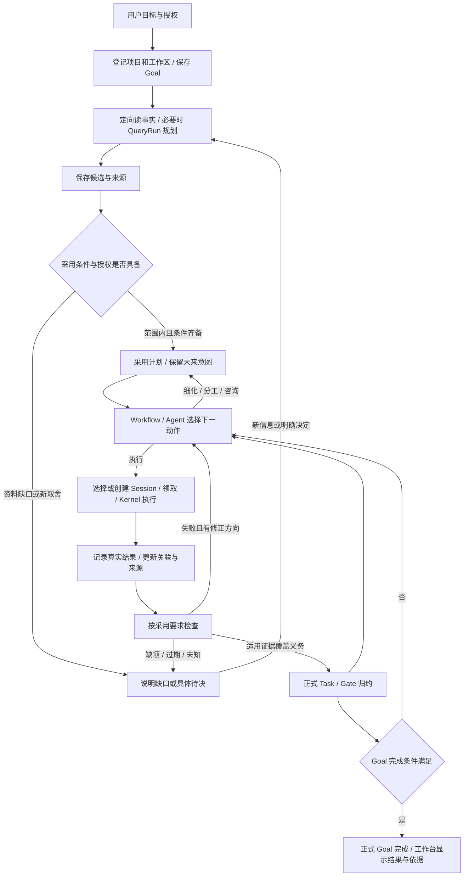

# MVP 产品行为与端到端验收

更新：2026-09-26。状态：当前产品目标的行为细化，供后续接口、骨架测试和实现共同使用；**不是实现完成报告**。施工位置为 `coding-platform/next`。

本文把 [PRODUCT](PRODUCT.md) 的承诺组织成可执行、可观察、可验收的用户路径。接口与状态字段仍归[模块文档](refactor/modules/README.md)、[共同契约](refactor/skeleton/CONTRACTS.md)及具体批次；本文不新建协议、调度器或业务状态库。实现状态只引用[能力索引](refactor/IMPLEMENTED-CAPABILITIES.md)和[实施计划](refactor/IMPLEMENTATION-PLAN.md)，不能从行为设计推断已交付。

## 1. 依据与范围裁决

| 依据 | 本文采用的行为 |
| --- | --- |
| [历史 PRODUCT §8](history/before-2026-09-22/PRODUCT.md#8-mvp-必须证明)、[当前 PRODUCT §9–10](PRODUCT.md#9-当前范围与后续方向) | 单用户单机、多项目作用域、连续推进、真实完成、控制恢复、换手和统一界面；历史有效承诺不因归档或本次拆批撤销 |
| [原话 DLG-029/037/044](refactor/intent/ORIGINAL-DIALOGUE.md#dlg-037-用户) | 当前/历史文件与 Session 相互关联；两图提供定位和操作；工具结果反向维护相关结构 |
| [编号原话 01、02、09、12、13、14](agent-platform-user-replies-numbered.md) | 工作由 Session 承载；角色可复用；Kernel 管执行与历史；无 baseline 可以开始调查和形成草案；知识库不是当前交付门槛 |
| [并行与白板纠偏](refactor/intent/2026-09-23-PARALLEL-AND-PRODUCT.md)、[未来意图与校验边界](refactor/intent/INTENT-AND-DECISIONS.md#2026-09-26-补充未来意图节点与校验边界) | 同工作区并行；任务关系不一律阻塞；未来节点可缺验收和分配，但不能从未完成说明中消失 |
| [本次引用讨论](chatgpt-conversation://6ab750c3-53d4-83ec-a03b-38f50a73ccd1) | 以纵向用户路径组织文档；骨架测试须区分失败来源和未执行断言。讨论中的完成百分比、四个断点和串行示意是助手判断，不是源码证据或缩减产品范围的决定 |

采用两个验收层次，避免把施工顺序误写成产品裁剪：

- **E2E 首通**：用户在真实入口给出 Goal，无预置 Plan，经调查/规划、正式采用、执行、真实检查、Task/Goal 完成，最终在工作台查看产物与依据。先选一条窄而真实的 coding 路径，允许该样例顺序执行；它不证明全部 MVP 已完成。
- **产品 MVP**：首通之外，还通过本文的并行、失败返工、控制恢复、换手、变更、双图追溯和项目隔离路径。界面可以朴素，但不能用手工 seed、脚本代改数据库或假成功填补用户路径。

首版仍是单用户、单机、coding-first，多 Project/Workspace，一个 Goal 绑定一个 Workspace。不建设跨机器共识、多租户、完整 IDE、通用工作流 DSL 或长期专家知识库；原生 compact 按真实能力显示 unsupported。已有生命周期、并行与恢复承诺不能以“最小化”为理由永久后置。

## 2. 用户入口与结果

布局、视觉与控件规范见[工作台 UI 设计](UI-WORKBENCH.md)。项目下保留未归档的工作中/待命 Agent，中心可切换项目主对话、指定 Agent 对话及行为观察，右侧辅助工作区默认可收起，以多页面承载树状双图、文件管理与终端；节点详情和任务过程按需展开，中间采用无卡片的传统 Session。

用户在同一工作台选择或创建 Project/Workspace，输入目标、约束与已有授权。工作台至少提供主对话、任务图、架构图和统一详情入口；图和列表可以简化布局，但两种结构必须真实可查看。

| 用户动作 | 应看到的结果 |
| --- | --- |
| 输入“修复问题并验证”或“实现这个功能” | 原目标被保存；系统说明正在调查、规划、执行或等待什么。授权内细化和验证自主推进 |
| 查看任务图 | 未来意图、当前工作、历史尝试同时可找；展示 required/optional、延期/取消/替代和缺项，不能只列 ready 节点 |
| 查看架构图或点名工作者 | 区分正式结构与源码观测，定位文件、职责、关联 Session 和历史；归档不删历史 |
| 查看任务详情 | 当前计划/义务、负责人和 Session、Run/Attempt、变更、检查、证据、阻塞原因与下一触发条件 |
| 查询状态、打开文件或历史 | 直接读已有事实，不因展开/分页启动模型；解释需求才使用必要的 QueryRun |
| 暂停、继续、取消或追加要求 | 显示受理回执、作用范围和实际生效状态；未支持、拒绝、未知分别可见 |
| 查看最终结果 | 产物位置、修改摘要、当前有效验收证据、未完成/排除事项；能追到原始结果和来源版本 |
| 关闭后重开 | 找回原目标、计划、执行与控制状态；不要求重述项目，不凭 UI 缓存重建正式状态 |

“已受理”“已进入执行”“执行结束”“检查通过”“Task satisfied”“Goal COMPLETED”分别表达。下文中文阶段是用户语义，不新增全局状态枚举；具体映射遵守[状态机](refactor/ORCHESTRATION-STATE-MACHINES.md)。

## 3. 主路径与模块责任

此图是有反馈的业务流程，不是源码依赖 DAG，也不要求所有任务串行经过同一常驻模型。主路径有变化才推进，无新依据时等待明确条件。

| 责任方 | 本路径负责什么 | 不得替代什么 |
| --- | --- | --- |
| Host/UI | 真实作用域、配置、交互、局部刷新、持久待办唤醒和展示 | 不自行置 Task/Goal 完成，不把浏览器状态当正式事实 |
| Workflow / 角色 Skill | 规划、采用授权判断、Session 选择、并行安排、检查/返工与待决选择 | 不复制图算法、事务、完成归约或模型循环 |
| WorkGraph | Goal/Plan/Task、Session 关联与占用、Query/消息/证据的正式操作和完成归约 | 不调用模型或 shell，不证明未来语义无冲突 |
| AgentRuntime / Kernel | 实际执行、只读查询执行、检查执行适配、控制与恢复、原历史观察 | 不凭模型结束宣布产品完成，不另建一套 Kernel 日志 |
| WorkspaceTools | 文件、来源版本、捕获、比较与结构观测 | 不自动采用架构或授予执行权限 |
| RecordStore | 条件提交、正文、事件与索引持久化 | 不决定业务方案 |

目标仍为[五模块八条允许边](refactor/module-dag.md)。运行结果回到 WorkGraph 后，由外层 Workflow/Host 消费变化，不引入 WorkGraph → Runtime/Workflow 反向依赖。

## 4. 行为契约

### B01：从空状态建立真实项目

**触发**：用户选择已有目录或要求在授权位置创建项目，提交目标。

Host 提供真实目录映射、存储与 Kernel 配置；经正式 Project/Workspace、Goal writer 保存引用。目录创建、登记、文件可访问是不同事实；不存在或无权访问时显示准确原因，不静默换到别的目录。空目录是合法观察。

没有 Plan、正式架构 baseline 或 CompletionPolicy 不阻止调查、回答和候选保存。正式采用才检查实际治理前提；首次架构通过已有初始采用能力登记真实候选，不能塞空 baseline 或测试 policy 冒充初始化。相关角色、政策与授权来自明确配置和正式 writer。

**结果/失败**：成功后能重开同一项目和 Goal；重复同一创建请求返回原回执。初始化中断仅续办未完成步骤，保留已经成功的登记，不盲目重建 Goal。

### B02：无 Plan 调查、规划与采用

**触发**：Goal 存在但尚无采用计划，或用户要求解释/修订现有方案。

优先读已有目标、文件、图和材料；需要模型判断时使用真实 QueryJob/QueryRun。Query 不伪装 Task/Attempt，不借 Work Run 权限；与其他执行共用 Session 占用和唯一 Kernel 循环。只读规划不获得文件编辑权限；后续初始化写入通过已授权写路径。

模型回答经真实来源提取和边界解析成为候选，保留 Goal/Workspace/回答及来源版本。候选中允许未来 `plan_only` 节点暂缺分配和验收；不沿用“所有节点必须立即可执行”的假设。解释旧方案复用原版本与理由，不能每次追问重新生成计划。

已有授权覆盖的细化可直接正式采用；缺治理或来源过期时说明具体对象并修复。实质改变目标、验收或越权时才展示可审阅差异和待决选项。用户确认绑定具体候选版本；过期确认不批准新版本。模型来源不能伪装 Host 来源绕过采用。

**结果/失败**：采用通过原 Plan writer 切换版本和关系；拒绝不部分修改活动计划。回答超时或结果未知先查询原 Query，不通过另建一次规划掩盖不确定状态。详细生产链见 [R5b](refactor/tasks/R5b-query-planning-skeleton.md)。

### B03：从白板选择行动并保留长程方向

**触发**：计划采用、执行/检查结果到达、消息有实际业务响应、控制/条件变化或用户补充。

Workflow 读取触发涉及的对象及当前计划，选择细化、分配、咨询、执行、检查、返工或等待。ready 是候选提示；分配不等于激活，激活不等于领取，领取不等于 Kernel 已开始。具体执行资格使用当前正式契约。

无 ready 时同时查看未来意图、未完成 required 工作、缺分配/说明/义务、实际输入缺口、忙碌 Session、检查与未知执行。能在授权内补足的继续细化；需要外部信息的保存原因和唤醒条件；不能宣布完成或无变化地重复调用模型。

预期依赖、架构相关和计划显示顺序不自动成为硬前置。明确采用的具体产物消费条件在真正需要该输入时检查；生产者 Task 尚未整体完成，但所需产物已合法可用时，不机械等待整个 Task。

**结果/失败**：每次行动可定位依据与结果。未来 required 意图不会因暂不可执行而从 Goal 未完成解释消失；一次局部失败不撤销其他独立工作。

### B04：真实执行、连续 Session 与结果回流

**触发**：选择了可执行工作和当前有效分配。

按任务/模块关联寻找合适 Session，核对角色、范围、健康和占用；相关工作优先延续，独立调查/审阅或并行使用独立 Session。创建 Session 本身不启动模型；创建成功后领取失败保留合法闲置 Session。

领取正式写入 Task/Session、Attempt/Run 与待执行项。Runtime 准备真实角色/Skill/工具及必要材料，经新鲜执行准入进入 Kernel。相同领取重放只能读原执行，不再次启动。Session ID 相同不足以证明连续性：后续模型输入必须真正包含必要前文与增量要求。

工具和执行结果带真实身份、来源及历史引用入账，局部更新相关图或标明尚待刷新。Run 结束释放匹配代次的占用，保留历史与工作关联；不归档 Session、不自动完成 Task。失败有具体修正方向才能开新 Attempt；未知先核对。

### B05：同工作区并行与协调

**触发**：存在可独立推进的多项工作。

Workflow/Agent 根据规范、架构和白板分工；允许同一目录中多个独立 Session 同时工作。不要求事前完整未来读写范围证明，不把模块、Workspace 或所有传递依赖加成一把锁。实际工具操作仍执行适用权限、文件版本和必要资源约束；同一 Session 保持一个对话修改占用。

发现冲突时返回真实对象、来源和已知影响，由 Agent 调整共享步骤、协调、等待或采用已有隔离能力。保留无冲突成果；不自动推翻两个分支全部工作，也不假称尚未实现的三方合并已经可用。通信的已读、回复、正式输入满足和任务完成分别表达。

**结果/失败**：独立工作继续，冲突只阻塞相关步骤。涉及新的产品/架构取舍才向人提交方案；普通文件协调不增加同义审批。并行结果经实际检查与整合后才能用于完成。

### B06：检查、返工与 Task/Goal 完成

**触发**：真实执行产生待验收结果，或已有检查需要补齐。

按已采用义务冻结本轮检查要求和实际来源；使用真实命令、只读报告见证及要求中明确存在的独立审阅。没有独立审阅要求时不强加 Reviewer。报告、正文材料、Evidence、检查轮次和正式完成是不同事实。

- 缺验收定义、required requirement 或有效证据时返回具体缺项，不利用空集合得到 PASS；允许此前合法调查已发生。
- FAIL 保留原轮次和证据；义务不变时返工保留 Task、新增 Attempt/Run，优先延续合适 Session。义务变化走正式计划演进，不偷改已经执行的定义。
- 缺项、INCONCLUSIVE、过期、执行中断或未知副作用均不完成；检查曾通过只证明对应来源版本。仍适用的结果可复用，不为补报告重复未知命令。
- WorkGraph 完成归约核对当前义务、覆盖、来源和局部版本，正式提交 Task satisfied；gate 只归约证据，不派发伪 Work Run。
- Goal 单独归约：无活动计划、空完成要求、required 尚未解决、相关未知执行均不能 COMPLETED。optional、延期、取消和被替代事项明确列出；required 取消不能自动算完成。明确接受部分结果记录 ACCEPTED_PARTIAL 与取舍依据。

**结果**：用户可从 Goal 完成进入每项义务、适用证据、原检查和文件版本。Run 成功、exit=0、模型说“完成”、消息回复或 ready 为空都不能替代此链。实现边界见 [R3e](refactor/tasks/R3e-completion-skeleton.md)。

### B07：查询、解释与统一导航

已知路径或引用可以直接读，不强制全图扫描。图用于缩小检索范围并关联模块、任务、Session、产物和历史；查询与分页不改状态、不 ack 消息、不启动模型。缺失、未授权、不支持、历史版本与当前结果分别返回。

用户追问理由时使用已保存的明确决定、选项与依据，不要求保存模型隐含思维过程。需要咨询才向适合的 Session 发消息或建立 Query；忙碌、离线或归档不妨碍读取已有事实，不冒充原工作者作答。

UI 用提交回执和读取水位刷新相关视图。投影延迟保留带版本旧视图或显示待刷新，不把已提交动作显示为未发生；节点、名册与对话定位到同一详情。

### B08：暂停、继续与取消

用户或授权策略发起作用域明确的控制，平台先持久记录期望，并停止相关新派发；Runtime 经真实 Kernel 能力投递并观察。控制请求、信号送达、安全点生效和终态分别展示；迟到旧 ack 不覆盖新控制。

继续需读取原控制、Session/Run/Turn、占用及恢复能力，按正式恢复入口处理；不能把重复 start 或创建新 Session 当作原 Run 恢复。取消不撤销已写文件或删除历史。终态后晚到控制按真实回执说明，不把已经结束的工作改写成“取消成功”。

部分 Run 仍未知或能力不支持时显示各自原因，不显示整个 Goal 已停；确认原写入停止或正式交接后才允许相交接管。R4.1 意图持久化、R4.2 安全点与后续投递/恢复必须共同贯通，不能单凭其中一项开启完整 capability。

### B09：目标/架构变更与安全换手

目标变更先保存要求并定位受影响任务、结构、Session 与证据；候选不立即作废现行计划。已有授权的变化按正式操作采用，新增取舍展示具体差异。停止受影响旧后续派发，运行中的相关操作按 B08 控制，无关任务继续。

正式架构与源码观测分别保存。发现漂移后能定位版本、相关文件和工作者，解释影响并进入修复或正式架构变更；不得自动把观测 imports 当作已采用职责，也不得隐藏观测环。拒绝、延期和过期决定不偷偷推进采用。

换手保存目标、当前义务、有效决定、未决项、未验证假设、文件变化和历史引用。接任者仅靠持久材料就能按需接续；责任切换前核对原写入和交接状态。交接失败不丢旧义务；归档保留全部历史，重新启用与另建接续如实区分。

### B10：中断、重启与无进展

| 可达中断/重复窗口 | 必须采取的行为 |
| --- | --- |
| 受理响应丢失 | 用原请求身份查询回执；同输入回放，改输入冲突，不再写一份候选/执行 |
| 已领取但确证未进入 Kernel | 续办原持久待执行项，不重新规划或领取 |
| 可能已进入，结果未知 | 保留身份与占用，核对原 Kernel 记录；日志暂缺/超时不能证明未执行 |
| 工具已发生，平台入账失败 | 依据原结果补账，不能重新执行工具取得“另一份结果” |
| 检查后文件或计划改变 | 保留历史证据；只在当前适用性成立时复用，缺口明确列出 |
| 同输入、同版本、同动作重复失败 | 没有新信息则换方法或等待具体条件，不无限增加 Attempt/模型调用 |
| Host 重开 | 先恢复持久待办、映射与未决观察，再允许相关新执行；Kernel 恢复自身日志，平台恢复关联 |

不增加另一个恢复引擎或承诺外部副作用恰好一次。不根据直接改坏内部记录构造不存在的运行时 Role 热切换生命周期；反例来自公开入口、真实并发与可达故障窗口。

## 5. 最小验收矩阵

以下是待实施的行为标准，当前不标 PASS。单个场景可以覆盖多个行为；复用已有底层测试，不为每一层复制同一事务矩阵。

| 编号 / 层次 | 起点与动作 | 必须观察到的证据 / 反例 |
| --- | --- | --- |
| E01 首通 | 空平台库、真实目录，用户只给 Goal 和范围，无 seed Plan，经 UI 推进 | 正式初始化 → 真实 Query 回答/候选 → 正式采用 → Kernel 修改文件 → 实际检查 → Task/Goal 完成 → UI 原引用可追溯；全过程无需人代填状态 |
| E02 首通 | 已有小型项目，任务至少有后续工作；一次执行结束 | Workflow 消费真实结果继续检查/下一动作，无手工调用内部接口；ready 为空但 required 待细化时仍未完成 |
| E03 首通 | 检查 FAIL 后修正；另有缺项或来源变化 | 旧失败保留，同 Task 新 Attempt；后半段断言实际执行；FAIL/缺项/过期/空义务都不能完成 |
| E04 首通 | 刷新、关闭重开、重复提交原用户请求 | 原 Goal/Plan/Run/回执与产物可查询；重复请求不增加实际启动；普通读取模型调用数不增加 |
| E05 MVP | 同 Workspace 两独立 Session 工作，加入一个实际共享冲突 | 独立执行时间重叠，冲突返回具体对象，独立成果保留；同 Session 竞争只有一个有效占用 |
| E06 MVP | 相关工作继续，随后有理由换手 | 实际后续输入包含必要历史；接任者从持久材料取得义务/理由/前沿，无需用户重述；归档后可查历史 |
| E07 MVP | 运行中暂停、继续、取消以及迟到控制观察 | UI 请求/实际分开，安全点与恢复真实生效；未确认停止不转交冲突写入，取消后文件事实仍保留 |
| E08 MVP | 采用前/执行中修改目标或验收 | 具体版本与授权可核对；受影响工作切换，无关工作继续；旧证据不完成新义务，required 取消不变全绿 |
| E09 MVP | 两个工作包提前提出接口/架构冲突，另观察到源码漂移 | 工具/消息 → 参谋解释 → 需要时人的具体决定 → 正式版本 → 受影响上下文；拒绝/延期/过期不采用；漂移有修复或待决路径 |
| E10 MVP | 在启动前、启动结果未知、结果入账前中断并重启 | 分别续办、核对、补账；记录实际 Kernel/命令调用次数，未知不猜成功/失败、不重复副作用 |
| E11 MVP | 多 Project/Workspace 切换，尝试使用另一作用域引用 | 合法项目可各自打开；越界材料/执行被拒，不能借相同 Role 或 Session 名称继承权限 |
| E12 MVP | 从双图查看文件、历史、消息与完成证据，重启后发起相关新工作 | 路径和版本可回指；查询不触发模型/已读/状态写；可复用历史但过期前提不会升级为当前事实 |

E01–E04 通过只报告“首条 E2E 已贯通”。产品 MVP 还须覆盖 E05–E12，并在[当前 PRODUCT §10](PRODUCT.md#10-验收与成功标准)约定的本项目与一个外部维护项目上保留真实任务证据。项目与样本在验收时选择；不把尚未运行的场景写成结果，也不强加大型模型对照实验。

每份验收报告记录：代码/文档版本、环境和真实配置、目标/授权、初始文件版本与必要未提交快照、实际入口操作、对象引用链、产物/检查/证据版本、最终状态、故障与恢复结果，以及明确未覆盖项。模型和命令调用次数用于证明查询/重放没有额外执行；性能或成本提升另需同输入实测。

## 6. 骨架测试与实现验收的交接

本节将引用讨论中的失败来源问题落实到现有[两阶段施工方式](refactor/DSH-WORKFLOW.md)，不启动本次文档任务之外的源码施工。

1. 每个行为测试标出本文行为/场景编号、真实目标入口和关键用户结果。夹具通过公开生命周期建立必要前置；纯单元测试可隔离依赖，但不宣称它证明生产链。
2. 骨架红测须报告实际到达的未实现入口、失败类型及调用路径。fixture 缺字段、依赖注入错误、无解释超时不计为有效红灯，应先修测试环境或定位问题。
3. 逐项区分已执行断言、被未实现入口阻断的后续断言、尚未有用例的行为。首行抛 NotImplemented 不能证明后续持久化、历史、覆盖或完成已经受测。
4. 中审核对后续断言能识别“返回空对象”“只改 UI”“把 Run ended 当 Task 完成”“seed PASS 绕过真实检查”等假实现；不只断言 defined/status 字符串。必要时用针对性错误实现验证测试敏感性，不要求每批建设通用变异测试系统。
5. 冻结接口与测试后再实现；最终重跑确认后续断言实际到达、无跳过，并从真实生产者→正式记录→消费者→用户结果核查接线。测试 fake、类型检查和总测试数不替代 E2E。
6. 按既定独立副本流程验收，记录目标能力和限制。校验遵守真实可达生命周期；不引入全账本屏障、未来完整语义证明或已授权动作的额外审批。

## 7. 与当前施工的连接

下表是截至本次阅读的文档/源码快照导航，不是本轮重新运行的验收。已抽查 Workflow 仍返回 unsupported；其余既有能力依据索引和批次报告。正在施工的骨架不计完成，后续状态统一更新原能力索引。

| 用户路径 | 直接复用 | 仍需贯通 / 原任务归属 |
| --- | --- | --- |
| B01 项目初始化 | R5a Project/Workspace/CompletionPolicy、Goal、初始架构、Role writer | Host 真实目录/配置/UI；模型采用所需 CoordinationPolicy 正式治理缺口 |
| B02 无 Plan 规划 | 原 Session、Kernel 循环、材料/source、Plan proposal/apply | [R5b](refactor/tasks/R5b-query-planning-skeleton.md)：正式 Query 受理→权限/执行→回答→来源绑定候选与采用；只完成 submit 不关闭规划 |
| B03–B05 自动推进/并行 | W2/C2 白板工具、B2 Runtime、C1 消息、关联与 claim | R5 Workflow/角色业务消费者、事件唤醒、实际分工/冲突处理；不重建上述服务 |
| B06 完成 | 义务/来源/材料/Run 终态与既有纯规则 | [R3e](refactor/tasks/R3e-completion-skeleton.md) 检查 producer、证据、Task/Gate/Goal 归约及 Workflow 返工消费者 |
| B07 用户入口 | 已有图/Session/文件/消息/有界历史端口 | R6 与 [Host/UI 骨架](refactor/skeleton/END-TO-END.md)；薄浏览工作台通过不等于 Goal 自主执行已通 |
| B08/B10 控制恢复 | B2 执行身份和观察、R4.2 Kernel 安全点 | [R4 控制恢复](refactor/tasks/R4-control-recovery-skeleton.md) 意图、投递/ack、取消历史消费、预算/恢复与 UI；不只交 R4.1 |
| B09 演进与换手 | 初始架构、observed 图、Session/WorkLink、W1/W2 未来修订 | R3d 正式架构演进、完整授权计划变更、R4 维护/交接及 R6 解释入口 |
| 版本与产物追溯 | 当前来源捕获/比较、材料来源与原历史 | Git 固定版本等 R2 尾项按真实消费者接入；不要求全部语言 provider 完成才开始首个支持语言样例 |

首通集成依赖 B01/B02、真实执行、B06、Workflow 推进与 Host/UI 共同完成。各批可按接口独立施工，但不能把“四个断点”误读成其余产品义务消失。未知/恢复规则从首通开始保持真实，完整控制与故障场景再按矩阵验收。旧消费者切换和最终退役仍按实施计划单独关闭。

## 8. 本次同步的文档差异

- [状态机 T2/T4/T9 与 A2/A3](refactor/ORCHESTRATION-STATE-MACHINES.md)：原表格仍用“前置任务满足、资源范围整体重核、后继不可领取”等早期措辞，与该页纠偏及用户白板意图冲突；本次改为具体输入条件、当前领取事实和实际操作约束。
- [Workflow §7](refactor/modules/business/workflow.md)：补无 ready 时的未来意图处理，去除把 `assessParallelism` 和预测范围理解为每次领取前置的歧义；不把目标接口当已有能力。
- [模块 DAG](refactor/module-dag.md)：仅澄清边标签中的可选范围分析，五模块八边不变。
- PRODUCT、文档索引及既有端到端骨架增加本页入口。原始对话和历史原稿保持原文；旧验收结果不因本页重写。
