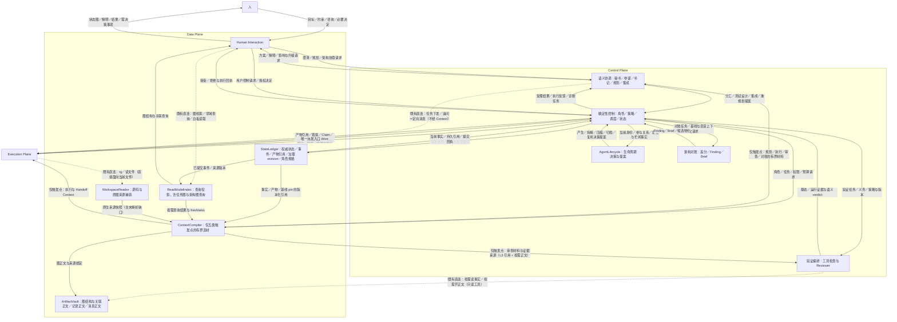
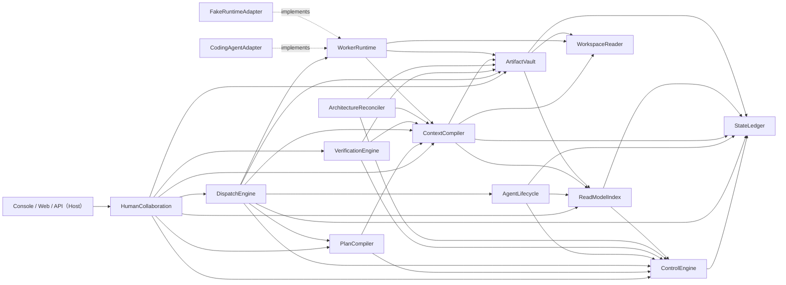

# Agent Platform Architecture Map（重构稿）

```yaml
status: draft-for-review（待人批阅；本稿不是仓库权威版）
updated: 2026-09-20
scope: Plane 与分层、Module Registry、ModuleDependencyDAG、生命周期管理、两张图能力层、模块边界变更、接口演进、全局不变量、差异说明与文档路由
落点: docs/refactor/ARCHITECTURE.md（工作区根 /home/hyh001/projects/coding-platform）
回填目标: my-coding-platform-docs/agent_platform/ARCHITECTURE.md（人批阅通过后由后续阶段回填）
改前基线（只读）: my-coding-platform-docs/agent_platform/ARCHITECTURE.md（369 行；12 Module / 34 条 Module 间依赖边 / 三类 DAG / 14 条全局不变量）
第一依据: docs/PRODUCT.md（2026-09-20 定稿）
输入版本冻结: my-coding-platform-docs@78b0c2aba27ac99132e320e1086b6c9920d01003（按 dev_docs/decision/04-documentation-location.md §5.3）
禁止自引用: 本稿属新版本；引用"方向依据"时固定指向上述冻结版本，不得以本稿自身作为方向依据
```

本文是低分辨率地图。Module 内部机制、字段和状态转换只存在于对应 Module 或 Interface 文档。

---

## §0 本稿的地位、约束与阅读方式

### 0.1 相对改前基线的三处性质变化

| # | 改前基线 | 本稿 |
| --- | --- | --- |
| 1 | `ARCHITECTURE.md:11`「不代表已经改变 Module 边界」；`:13`「本轮保留 12 Module」 | 按 `dev_docs/decision/02-investigation-and-conclusion.md` §7.2 的 L1 修订与 §7 注记，读作「**截至目前**保留 12 Module」；**模块边界与接口按本稿正式演进** |
| 2 | 模块集合固定为 12，DAG 视为不变 | **模块集合会变**（本稿新增 1 个 Module，见 §6）；DAG 随之变更 |
| 3 | 接口摘要作候选保留 | 按 `decision/02` §9.1，**12 个既有 Module 接口全部需要变化（I1–I12），无一可原样保留**；同步给出抽象优化（A1–A6）与"确认不变"清单（§7.3） |

### 0.2 保留不变的硬约束（已确认，不得破坏）

来源：`docs/refactor-prompts.revised.md` §2.4，2026-09-20 人确认「保留不变」清单作为硬约束。本稿的模块边界变更与接口演进**都不触碰下列入口**。

| 类别 | 内容 | 验证方式（源码事实） |
| --- | --- | --- |
| 命令入口 | `pnpm build` / `pnpm start` / `pnpm test` / `pnpm typecheck` / `pnpm check:architecture`（以及 `check` / `gui` / `ui:*` / `kernel:*`） | `coding-platform/package.json` scripts |
| 监听地址 | 本机回环 `127.0.0.1`，默认端口 `4317`，`PORT` 可覆盖 | `src/app/server.ts:141-142`（`listen(port, '127.0.0.1')`；Host 头限 `localhost`/`127.0.0.1`） |
| 数据目录 | `PLATFORM_GUI_DATA`，默认 `.local/gui` | `src/app/server.ts:140` |
| HTTP 路由 | **只新增、不删除既有路由**（`docs/refactor-prompts.revised.md` §2.4「允许演进」范围限定：界面展示与视觉改版不需要迁移方案） | 与 §7.3 一致 |

### 0.3 术语口径

- 本文新增或使用的概念必须与 `my-coding-platform-docs/agent_platform/CONTEXT.md`（唯一领域词典）一致：**Plane / Module / Interface / Seam / ArchitectureBaseline / ArchitectureEvolutionPolicy / ArchitectureFinding / Decision / AgentInstance / AgentRun / WorkContext / ContextBundle / HandoffPacket / ReadModel / TodoView / CompletionClaim / Evidence**。
- **词典缺口（本阶段不改 CONTEXT.md，登记于此）**：词典中没有 `Session`、`Run`（只有 `AgentRun`）、`Skill`/`Prompt`、`架构图`、`任务图`、`产品图` 条目。本稿按 `docs/PRODUCT.md` §3.1 与 §7.2 的定稿口径使用这些词，并在 §11 登记"需在词条层补齐"。
- `拆解`（生命周期四动作之一）指**把一个角色的职责分解为可指派给多个子 agent 的工作单元**，**不是**销毁或拆除。销毁语义由"结束终态 + 归档"承担（§4.5）。

### 0.4 证据分级约定（贯穿全文）

| 标记 | 含义 |
| --- | --- |
| **【代码】** | 已在 `coding-platform/src/**` 中存在（含契约类型、命令、事件、表结构） |
| **【契约未接】** | 契约或端口已存在，但生产装配处未接（返回 `unsupported`/`UnavailableState`，或无生产者） |
| **【设计新增】** | 本稿提出的目标归属，尚无实现与既有契约 |
| **【待人裁决】** | 讨论没说清、但架构必须表态的点；本稿给立场与备选，不替人决定（逐条见 §11） |

---

## §1 Plane 与分层

Plane 是按权责和运行角色组织 Module 的高层视图；Plane 本身没有 Interface，也不是代码包（CONTEXT.md）。

**本稿不新增 Plane。** 理由：两张图是**数据面的能力层**（`docs/PRODUCT.md` §7.2.2「这是"利用架构图、走数据面"的方式」）；生命周期决策属**控制面**（`decision/02` §8.1「它们不是数据面的问题，而是控制面的决策」）。新增 Plane 只会把同一批 Module 重新分组，不产生新的分责边界，且与 §7.2.7 的未决项（图的存在形式）混在一起更难裁决。



**图例（本图的三条读取规则，避免被读成"所有材料都经 ContextCompiler"）**

| 标注 | 含义 |
| --- | --- |
| **实线** | 长期依赖／既有流向，**本稿不变** |
| **虚线 + 「新增边」** | 本稿**新增的 Module 依赖边**：`DispatchEngine → AgentLifecycle`，以及 `AgentLifecycle → ControlEngine / StateLedger / ReadModelIndex`（共 4 条，§3 有完整账） |
| **虚线 + 「既有直连」** | 机制**已存在**，本稿**明确它不经 ContextCompiler**（定向消息、静态搜索、按需读事实／正文）——见 §6.2.1 |
| **「仅触发点」** | 该路径被**收窄**：只在五类触发点发生，不再每轮无条件发生 |
| **本图不再画出的路径（即"减少"）** | ① 「每次 Run 全量重新装配」——语义已删除（§6.2）；② 「通信经 Context 中转」——§6.2.1 明确不经；③ 「审查材料整包正文」——改为 L3 引用 + 按需正文（§6.2.3）；④ 「RoleManager／MemoryStore 一类新中间层」——不新增（§2） |

> **§1 与 §3 的分工（统一口径，避免把信息流读成源码依赖）**
>
> - **§1 只表达运行交互与信息流**：箭头表示请求、反馈与材料的传递关系，**不代表直接 import 或函数调用**，也不表示源码依赖方向。
> - **§3 专门表达 Module 的源码依赖**：箭头表示"调用者长期依赖被调用 Module 的 Interface"。
> - 因此 §1 中 **`Life ↔ Control` 是职责之间的请求与反馈**（产生／拆解／压缩／归档／复用决策的提案与身份／容量事实的回流），**不能读成"它本身就是 §3 新增的那 4 条 Module 依赖边"**；两者的对应关系以 §3 的边表为准。
> - 同理，§1 中 `Control → Context` 是**请求受理与策略输入的信息流**，**不能被读成"ControlEngine 直接调用 ContextCompiler"**：按 §3，`ControlEngine` 只有 `→ StateLedger` 一条出边；而 `ContextCompiler` 既不被 Control 调用、也不调用 Control（§6.2「收缩后仍然不做」，`runtime-collaboration.md:110`）。
> - 这是**图的解释问题，不需要因此新增模块**，也不改变 §3 的边集（34 条既有 + 4 条新增 = 38 条）。

| Plane | 责任（本稿口径） |
| --- | --- |
| Human Interaction | 统一图文展示、对话、查询、需求／架构讨论、控制与决定入口；图检索与统一侧栏的**读**侧入口（D-6） |
| Control | 语义协调负责澄清、分工、耦合／测试设计与集成；确定性控制负责授权、版本、预算、路由、派发、状态归约、架构对账，**以及 Agent/Session 生命周期决策** |
| Execution | 完成一次 Worker Run 并报告事实；把内核声明的持续执行、压缩与恢复能力**如实**适配上来（capabilities 不得虚报） |
| Data | 持久事实与产物引用；查询投影（含任务图）；五类触发点的有界选材；图结构与关联正文的持久与检索；原生来源捕获 |

**分层规则（沿用并收紧）**

1. 只有 ControlEngine 能接受并推进长期状态（不变量 #1）；AgentLifecycle、PlanCompiler、DispatchEngine 只提案／决策／执行。
2. Data Plane 承担信息组织，Control Plane 持有状态转换与授权责任（改前基线口径，本稿保留）。
3. Module 不反向依赖宿主（`scripts/check-module-boundaries.mjs` 强制）；Contracts 不反向引用实现；生产代码不消费 `fixtures`/`testing`。
4. ContextCompiler **不依赖** PlanCompiler／DispatchEngine，也不被 ControlEngine 反向调用——以保持"检索 → 启动 Agent → 再检索"不形成源码环（`runtime-collaboration.md:110`、`modules/data/context-compiler.md:74`）。

---

## §2 Module Registry

**13 个 Module（12 既有 + 1 新增）。** 目录名即 Module（`scripts/module-map.mjs` 的 `owner()` 按路径前缀判定，是归属的唯一可判定来源）。

| Plane | Module | 一句话职责 | 对外接口摘要 | 契约状态 | 实现现状（【代码】依据） |
| --- | --- | --- | --- | --- | --- |
| Human Interaction | [HumanCollaboration](dev_docs/modules/interaction/human-collaboration.md) | 面向人的统一入口：目标／决定／查询／架构协商与接管**读**侧 | `createGoal(request)`、`goalView(query)`、`query(request)`、`amend` | first-slice draft | 【代码】`interaction/human-collaboration/`（5 文件）；完整秘书／参谋对话与跨工作包协调仍缺 |
| Control | [PlanCompiler](dev_docs/modules/control/plan-compiler.md) | 有界协调：初始协调、人工计划、修订提案、机械返工提案 | `request(intent)`、`requestInitial(intent)`、`accept(resultRef)` | extension draft | 【代码】`control/plan-compiler/`（8 文件）；自动规划入口 `PlanCompilerImpl`，人工来源 `OperatorPlanCompiler` |
| Control | [ControlEngine](dev_docs/modules/control/control-engine.md) | 唯一的状态推进者与守卫：授权／CAS／幂等／归约／治理激活 | `submit(command)`；治理 `install/activate/applyPlan`；协调 `registerAgentInstance`、`startWorkParticipation`、`endWorkParticipation`、`mailboxView`、`grantMaterialAccess` | first-slice draft（扩展面极宽） | 【代码】`control/control-engine/`（95 文件，约 21,405 行） |
| Control | [DispatchEngine](dev_docs/modules/control/dispatch-engine.md) | 唯一派发入口：outbox 执行、准备与 claim 顺序、租约、运行事实对账 | `drive(trigger)`（唯一入口）；`RuntimePreparationPort`；`HandoffDriveEngineImpl`；`issueMatrixRoleBinding` | extension draft | 【代码】`control/dispatch-engine/`（28 文件）；生产路径已接 |
| Control | [VerificationEngine](dev_docs/modules/control/verification-engine.md) | 验证编排：检查生命周期、Evidence 受理、Reviewer 工作、探索报告资格 | `verify(intent) → verification ref`；`VerificationService.verify`；`reverifyRework` | planned（实现另有 `VerificationService`） | 【代码】`control/verification-engine/`（24 文件）；生产路径是 `VerificationService`，`VerificationEngineImpl.verify` 不是生产入口 |
| Control | [ArchitectureReconciler](dev_docs/modules/control/architecture-reconciler.md) | 架构对账：图差分 → Finding／Brief → 候选物化 | `inspect(intent) → assessment ref`；`computeArchitectureDelta`；`BaselineEvolutionPort` | planned | 【代码】存在但最薄（3 文件 / 263 行）；**未接产品 inspect 入口**、真实初始 sourceBinding 与 MigrationGate 仍缺 |
| Control | **AgentLifecycle（新增）** | **Agent/Session 生命周期决策与提案**：选谁／是否复用、产生、拆解、压缩、归档、重新启用 | `decide(request) → reuse_deferred / reuse_selected / needs_material / rejected`（候选）；`propose(action) → proposal / rejected`（候选） | **【设计新增】proposed（无实现、无契约）** | 无目录、无契约；现有承载见 §4.1 |
| Execution | [WorkerRuntime](dev_docs/modules/execution/worker-runtime.md) | 一次真实内核运行：启动、取消、能力探测、公开观察与快照 | `capabilities/start/control/events`；可选 `snapshot`；`RunPort`、`RuntimeReconciliationPort`、`HandoffControlPort` | extension draft | 【代码】`execution/worker-runtime/`（17 文件）；**契约中无名为 `WorkerRuntime` 的接口**，能力面分散在多个端口 |
| Data | [StateLedger](dev_docs/modules/data/state-ledger.md) | 原子提交 snapshot + Event；CAS、幂等、事件页 | `load/commit/events` | first-slice draft | 【代码】`data/state-ledger/`（29 文件）；SQLite 表 `events/snapshots/idempotency/identity_claims` |
| Data | [ArtifactVault](dev_docs/modules/data/artifact-vault.md) | 不可变正文持久化与材料授权适用性 | `put(record)`、`open(ref, accessScope)`；`MaterialAccessResolver` | planned | 【代码】`data/artifact-vault/`（5 文件）；表 `artifacts(key, record)` |
| Data | [ReadModelIndex](dev_docs/modules/data/read-model-index.md) | 从已提交事件重建查询投影（含**任务图**与**架构图查询**） | `advance(page)`、`goal(query)`、`planGraph(query)`、`mailboxView()`、`governanceView()` 等 27 项 | first-slice draft | 【代码】`data/read-model-index/`（23 文件，47 张表）；`plan_graph` 表已存任务图（`stages/tasks/task_hierarchy/execution_dag` 为 JSON 列） |
| Data | [ContextCompiler](dev_docs/modules/data/context-compiler.md) | **五类触发点**的有界选材（边界本稿收缩，见 §6.2） | `assemble(request) → ready/needs_material/rejected`（生产走 `TaskContextPort`）；12 个按消费者的 `assemble*` 端口 | extension draft | 【代码】`data/context-compiler/`（37 文件）；**契约无名为 `ContextCompiler` 的接口**，实际公共面是 12 个并行端口 |
| Data | [WorkspaceReader](dev_docs/modules/data/workspace-reader.md) | 路径边界内的源码与原图来源捕获 | `read(query) → sourced/unsupported/stale/rejected`；`ArchitectureSourceCapturePort` | extension draft | 【代码】`data/workspace-reader/`（18 文件）；`FakeWorkspaceReaderAdapter` 仍是默认装配 |

**Module 升级判据（本稿沿用并用来判定新增）**：一个流程方框只有在拥有独立 Interface、隐藏实质复杂度、且能通过该 Interface 验证时才升级为 Module。

- `AgentLifecycle` 满足三条：接口小（复用决策 + 四动作提案）；隐藏实质复杂度（Session 身份与容量、稳定前缀、压缩记录、归档与重新启用、可解释的复用决策）；可通过接口验证（给定任务与角色目录 → 复用决策及其排除理由）。**且当前没有任何 Module 拥有这套决策**（`decision/02` C10 明说"落点待定"）。
- 本稿**不新增**图模块：架构图的节点/边/快照与差分契约已存在，缺的是**生产者与关联**而不是新能力；任务图的类型、生成函数、投影表与视图**都已存在**。再建一个图模块会与 ReadModelIndex 的投影职责重复，并触碰"不要新建第五个机制去实现图索引编排"的既有禁令。备选方案见 §11-U2。
- **不新增**能力注册／技能市场模块：`docs/PRODUCT.md` §7.6 明写「不建设独立技能市场、自动生成技能工厂或新的注册体系」；能力与 skill 承载在 `RoleSpec` + 既有治理路径 + ArtifactVault。

---

## §3 ModuleDependencyDAG

箭头表示**调用者长期依赖被调用 Module 的 Interface**，不表示开发顺序。

**本节与 §1 不是同一张图**：§1 表达运行交互与信息流（箭头不代表 import 或函数调用），本节表达源码依赖；两者不可互相替代，也不可互相推断。



**边数**：改前基线 34 条 Module 间依赖边（不含 `Apps → HumanCollaboration` 的宿主边，与 `scripts/module-map.mjs` 的 `allowedModuleDependencies` 逐条一致）；本稿 **38 条**（新增 4 条：`DispatchEngine → AgentLifecycle`，以及 `AgentLifecycle → ControlEngine / StateLedger / ReadModelIndex`；**无删除**）。

### 3.1 无环说明

- 该 DAG 的**唯一强制判据**是 `coding-platform/scripts/module-map.mjs` 的 `allowedModuleDependencies`，由 `scripts/check-module-boundaries.mjs` 做「未声明依赖 + DFS 环检测」两项机械检查（`pnpm check:architecture`），并由 `tests/contracts/module-ownership.test.ts` 重复断言目录归属。
- 分层可按拓扑排序还原，无回边：`StateLedger` / `WorkspaceReader` 是汇（无出边）→ `ControlEngine`、`ReadModelIndex`、`ArtifactVault` 依次上溯 → `AgentLifecycle`、`ContextCompiler`、`WorkerRuntime` → `DispatchEngine`、`VerificationEngine`、`ArchitectureReconciler` → `PlanCompiler` → `HumanCollaboration` → Host。
- 新增的 `DispatchEngine → AgentLifecycle` 不构成环：`AgentLifecycle` 的三个出边（`ControlEngine`、`StateLedger`、`ReadModelIndex`）都在其下游，且**没有任何 Module 依赖 `AgentLifecycle` 之外**——只有 DispatchEngine 依赖它。
- 运行时可以形成 `Control → outbox → Worker → Fact → Control` 的反馈循环，但源码依赖保持无环（基线口径，保留）。

### 3.2 边的含义（新增／变更部分）

| 调用者 → 被调用者 | 消费的 Interface 与原因 | 状态 |
| --- | --- | --- |
| **DispatchEngine → AgentLifecycle** | **派发前取「选谁／是否复用哪个 Agent 与 Session」的决策**；派发结果记录复用决策与其排除理由（`decision/02` C1 要求）。DispatchEngine 仍是唯一派发入口，决策不改变派发权 | **【设计新增】** |
| **AgentLifecycle → ControlEngine** | 把产生／拆解／压缩／归档／重新启用的动作作为**提案**提交，由 ControlEngine 归约（不变量 #1/#3）；AgentLifecycle 不写 canonical | **【设计新增】** |
| **AgentLifecycle → StateLedger** | 只读 canonical 生命周期事实：`AgentInstanceV1`、`WorkParticipationV1`、`RoleSpecRevision`／矩阵 pin、WorkContextBinding | **【设计新增】** |
| **AgentLifecycle → ReadModelIndex** | 只读忙闲、当前工作、任务与角色视图（`ActiveAgentView`、`MailboxViewV1`、角色视图）以判断复用是否可行 | **【设计新增】** |
| HumanCollaboration → ReadModelIndex | **新增**：角色卡片／名册／统一侧栏所需的 Agent 与 Session 视图（`decision/02` C8、I6、I11）。图检索也走投影：任务图已有 `planGraph`，架构图查询面见 §5.4 | 既有边，**消费内容扩展** |
| ArchitectureReconciler → ContextCompiler | 获取相同版本的规范、代码关系、图材料与证据以做对账（基线口径，保留） | 既有边，语义收紧：对账材料由 ContextCompiler 按 §6.2 的有界选材提供 |
| ContextCompiler → ReadModelIndex | 消费已有查询结果，不重新实现状态归约（基线口径，保留） | 既有边，语义收紧 |

---

## §4 生命周期管理（专章）

本章回答两件事：**五阶段**（创建／初始化／运行／挂起·恢复／销毁）与**四动作**（产生／拆解／压缩／归档）各自**谁负责、边界在哪、状态归谁、进入与退出条件**。

### 4.0 起点：现状已经有的一半（不要把 greenfield 当成重构对象）

| 已有承载 | 位置 | 覆盖了什么 |
| --- | --- | --- |
| `AgentInstanceV1` / `AgentInstanceStatus = "active" \| "retired"`；`AgentInstanceRef`、`AgentPrincipalRefV1`、`WorkParticipationV1 {status: "active" \| "ended"}` | `src/contracts/coordination.ts` | **主体身份与参与关系的实体**【代码】 |
| `registerAgentInstance`（CAS@0）、`startWorkParticipation`、`endWorkParticipation`，经 `CoordinationControl` 暴露 | `control-engine/coordination/participation-operations.ts`、`contracts/modules.ts` | **身份的正式写路径**（经 ControlEngine）【代码】 |
| `RoleSpecRevision` / `ProjectRoleSpecActive` / 角色矩阵 `CoordinationRoleMatrixV1`（可选字段 `roles?`）；per-`(projectId, roleId, revision)` 独立 CAS@0 | `contracts/role-spec.ts`、`contracts/human-role-collaboration.ts` | 角色规格的版本化治理（第 5 个治理种类）与"哪些角色存在"的目录【代码】 |
| `WorkContextBinding` / `workId` | `contracts/context-continuity.ts` | **工作维度**的跨 Run 身份（"A Run is NOT a work identity"）【代码】 |
| `HandoffPacketV1`、`recordHandoff`／`claimReplacement`、`HandoffRecorded`／`ReplacementClaimed` | `contracts/handoff.ts`、`control-engine/handoff.ts` | 换手与接续【代码】 |
| `ContextContinuationResult`：`restored_original`／`took_over`／`unsupported`／`rejected` | `contracts/context-continuity.ts` | **恢复路径的如实观测**（能力由适配器声明，Control 不编造）【代码】 |
| `ExecutionNote`（不可变、有界 16 KiB、body-first） | `contracts/context-continuity.ts` | "先落盘再生效"的记录承载雏形【代码】 |
| `MailboxViewV1`、`mailboxView()`、`coordination_mailbox` 工具 | `contracts/coordination.ts`、`control-engine/coordination/mailbox-view.ts`、`worker-runtime/coordination-tools.ts` | 定向消息的查询与投递面（本产品**自有**机制）【代码】 |
| `LifecycleControlPort`、`ContextContinuationPort`、`HandoffControlPort` | `worker-runtime/*`、`contracts/*` | 三个生命周期端口**都在、都可注入**，但真实装配写死成"未配置"【契约未接】 |
| `RecoveryCoordinator`、`SessionStorePort`、`CheckpointStorePort`、`sessionRecordSchema`、`checkpointSchema` | `vendor/coding-agent` | **内核已声明**会话恢复与检查点能力【代码·内核】 |

**明确缺失（本稿不得假装已有）**：

| 缺失项 | 事实 |
| --- | --- |
| **Session 作为平台侧一等实体** | `SessionV1`、session 聚合、session 命令／事件／投影 **全部不存在**；`sessionId` 只在 `RuntimeRecord.sessionId`（prepare 时 `randomUUID()`）与 `producerSessionId`/`reviewerSessionId` 两个裸字符串里出现 |
| **退役写路径** | `"retired"` 与 `retiredAt` 字段存在，但**没有任何命令／事件写入它们** |
| **压缩** | 平台层无压缩策略；`compact*` 命中全是注释；容量溢出是**失败**（`ContextCapacityExceeded`），不是压缩 |
| **归档** | 无实现、无状态机；观察 journal 无删除／修剪／归档路径 |
| **运行期控制能力** | 生产 `lifecycleControl.capabilities()` = `{safePointDelivery:false, pause:false, cancel:false, steer:false, maxSteerPayloadBytes:0}`，**无配置入口** |
| **续跑** | 生产 `contextContinuation` 返回 `unsupported`，`unsupportedCapabilities: ['session_restore','context_resume','takeover_run']` |
| **责任接管** | `run.lock` 在 `outcome_unknown` 时**故意不释放**（设计正确）；但没有任何机制把责任移交给另一个主体 |
| **跨 Run 主体身份的复用决策** | 没有"给定任务，从角色目录里选一个角色／Agent"的检索或匹配器 |

### 4.1 五阶段归属矩阵

每格写：参与模块 ／ 谁负责 ／ 边界 ／ 状态归谁 ／ 进入与退出条件。

#### 阶段 1 · 创建

| 项 | 内容 |
| --- | --- |
| 参与模块 | DispatchEngine（触发与绑定签发）、AgentLifecycle（决策与提案）、ControlEngine（归约与守卫）、StateLedger（原子提交）、ReadModelIndex（视图） |
| 谁负责 | **决策**：AgentLifecycle 判断"是否需要一个新主体／能否复用既有主体"；**正式建立**：ControlEngine 归约 `registerAgentInstance` 一类的命令；**绑定签发**：DispatchEngine 按当前生效矩阵 pin 签发（`issueMatrixRoleBinding`），签发不代替守卫 |
| 边界 | AgentLifecycle **不写状态**；DispatchEngine **不自造身份**；ControlEngine **不自行选人**（选人依据来自 AgentLifecycle 决策 + 矩阵 pin） |
| 状态归谁 | canonical：`AgentInstanceV1`（`active`）＋ `WorkParticipationV1`（`active`）＋ `RoleBindingRefV1`；投影：ReadModelIndex 的角色／Agent 视图；运行态：WorkerRuntime 的 `RuntimeRecord` |
| 进入条件 | 【待人裁决】`decision/02` 与方案稿给的候选触发（① 有目标且该角色进入首批能力矩阵；② 同名角色首次被指派；③ 归档角色被重新启用）是**【推断·非人确认】**，尚未经人确认 |
| 退出条件 | 【待人裁决】现状**无判据**。可判定的事实只有：身份登记成功且参与关系 active 且绑定已签发 |
| 本阶段明确未定义 | **"创建"与"初始化"的分界**在现有实现里不存在（见阶段 2）；**Session 的创建**没有归属（Session 实体不存在） |

#### 阶段 2 · 初始化

| 项 | 内容 |
| --- | --- |
| 参与模块 | ContextCompiler（首次启动选材）、DispatchEngine（派发收口建立工作身份与精确授权）、WorkerRuntime（preflight 与能力探测）、StateLedger（Run/Attempt/Lease/Outbox 落账）、ControlEngine（归约） |
| 谁负责 | **选材**：ContextCompiler（五类触发点之"首次启动"）；**身份与授权**：DispatchEngine 在派发收口建立／解析工作身份，组装成功之后、`startRun` 之前；**运行准备**：WorkerRuntime `prepare` + `preflight`（拒绝已有锁或未对账的中断记录） |
| 边界 | ContextCompiler 只选材：**不选人、不调度、不归约状态、不启动模型**（§6.2）；WorkerRuntime 只准备与观察，不推进完成 |
| 状态归谁 | `RuntimeRecord{status:'prepared'}` 与 journal 归 WorkerRuntime；Run／TaskAttempt／Lease／Outbox 归 StateLedger（ControlEngine 归约） |
| 进入条件 | 已受理的计划任务 + 已签发的角色绑定 + 可用的 Workspace 与权限 |
| 退出条件 | 【待人裁决】现状**无独立判据**。可观察的现状是"无条件重新组装"：`assembleRuntimeContext` 每次执行、不检查"上次已组装" |
| 本阶段明确未定义 | **"初始化"作为独立阶段在方案稿与调研中都不存在**（`2026-09-19-agent-lifecycle-management-investigation-R2` §1.1 的五行为：创建／运行／结束／状态归约／恢复）。是否需要独立契约、独立入口与独立 owner：**未定义/待决策**。本稿**不补一个看似合理的答案**；首版继续由 `prepare + assemble` 承载 |
| 已知的根因事实 | 组装正文的第 4 段含 `scope.runId` 与 `roleBinding.bindingId/bindingVersion`——**每 Run 唯一值进入前缀**，这是"稳定前缀不稳定"在代码里的确切位置（`data/context-compiler/runtime-context.ts`） |

#### 阶段 3 · 运行

| 项 | 内容 |
| --- | --- |
| 参与模块 | DispatchEngine（唯一 `drive`）、WorkerRuntime（承载执行）、ControlEngine（状态与租约权威）、StateLedger、ContextCompiler（材料）、AgentLifecycle（运行中不介入，除容量决策） |
| 谁负责 | 派发与顺序：DispatchEngine；执行与公开观察：WorkerRuntime；状态归约与租约：ControlEngine；**运行期的压缩／更换决策**：AgentLifecycle（见四动作·压缩） |
| 边界 | WorkerRuntime 不编排、不规划、不归约；租约持有者是 **Run 而不是 Agent**（`TaskLeaseSnapshot.holderRunId`）；MSG 类普通消息**不是** `RuntimeExecutionDAG` 的阻塞边 |
| 状态归谁 | `RunSnapshot.status`（running/ended）由 ControlEngine 的纯函数 fold 归约；幂等、CAS、事件由 StateLedger 原子提交 |
| 进入条件 | 【代码】`capabilities()` 声明 + `preflight` 通过 + 唯一 Writer 租约可用 |
| 退出条件 | 【代码】五种终态之一：`completed`／`cancelled`／`budget_exhausted`／`failed`／`outcome_unknown`；只有非 `outcome_unknown` 才在 `finally` 释放 `run.lock` |
| 本阶段明确未定义 | 生产路径的 pause/cancel/steer/safePointDelivery **全部为 false 且无配置入口**；"可接管"在实现里不存在；安全点确认的宽松行为是**已确认的延期缺口**（无已发现生产消费者） |

#### 阶段 4 · 挂起·恢复

| 项 | 内容 |
| --- | --- |
| 参与模块 | WorkerRuntime（能力探测与适配）、AgentLifecycle（恢复哪个 Session 的决策与提案）、DispatchEngine（恢复入口与后继 Run）、ControlEngine（归约与对账）、ContextCompiler（恢复触发的选材）、StateLedger、ArtifactVault（正文） |
| 谁负责 | **挂起**：能力探测归 WorkerRuntime，决策归控制面；**恢复（重启后）**：DispatchEngine 只做两件事——补齐未落账事件、把未终结 Run 记为 `outcome_unknown`，**不重跑、不续跑**；**续跑／接续**：执行由 WorkerRuntime 适配内核能力，观测结果如实公开（`restored_original`／`took_over`／`unsupported`／`rejected`）；**接管**：AgentLifecycle 提案 + ControlEngine 归约 |
| 边界 | 平台**不承诺同会话热恢复**；能力缺失时必须返回 `unsupported` 并指名缺失能力，**不得用 Fake 适配器的行为冒充真实内核**；前驱的验读**不继承**为后继许可 |
| 状态归谁 | canonical：Run/TaskAttempt/outbox 与 `ControlIntentReconciled`；`ContextContinuationResult` 记录**观测到的**路径；投影：ReadModelIndex |
| 进入条件 | 重启后扫描到未终结 Run；或显式恢复／换手请求（仅 canonical `ended` 的普通来源可申请） |
| 退出条件 | 【待人裁决】恢复的**退出条件未定义**：未终结 Run 一律记 `outcome_unknown`，**没有对账完成判据，也没有接管入口** |
| 本阶段明确未定义 | **挂起（pause）是否进首批**：方案稿建议首批**不配**，用"取消 + 续跑"近似，代价是粒度粗（见 §11-U1）；**是否使用内核 `RecoveryCoordinator`/`SessionStorePort`**：待人裁决，接受后即受"同一 Session 同时一个活动 Run"的串行约束（内核在已有活动 Run 时抛错） |

#### 阶段 5 · 销毁

| 项 | 内容 |
| --- | --- |
| 参与模块 | AgentLifecycle（归档提案）、ControlEngine（归约）、StateLedger、ArtifactVault（保留记录与产物）、ReadModelIndex（投影随之更新） |
| 谁负责 | 提案：AgentLifecycle；归约：ControlEngine；**不删除**任何模块或图节点 |
| 边界 | **归档 ≠ 删除**：保留身份、Session、产物与重新启用能力；`docs/PRODUCT.md` §7.1「归档更新活跃状态与责任关联，不删除模块；模块撤销另按结构变更处理」 |
| 状态归谁 | 【待人裁决】`AgentInstanceStatus` 已有 `retired` 与 `retiredAt` 字段，**但无写入路径**；归档事实的正式承载形态未定 |
| 进入条件 | 候选：无未交接的活跃义务，且近期不再需要参与；由明确操作触发（首版**显式归档**，不做自动回收） |
| 退出条件 | 【待人裁决】归档后**身份与名称如何处置**、**投影如何更新**（"不保留已失效的成员"只是方案稿的保守默认，无实现依据）、**重新启用的入口**：均未定义 |
| 本阶段明确未定义 | **"销毁"不是可观察状态**（参考分层：disposal removes the agent from its registry; it is not a third observable status）。完整归档状态机在方案稿里被列为"以后做" |

### 4.2 四动作归属

| 动作 | 定义（不改写） | 参与模块 ／ 谁负责 | 状态归谁 | 进入条件 | 退出条件 |
| --- | --- | --- | --- | --- | --- |
| **产生** | 为一个角色（`RoleSpec` 的实例化）建立**可持久的身份**，并把它绑定到承担范围 | AgentLifecycle（决策与提案）／ ControlEngine（归约 `registerAgentInstance`、`startWorkParticipation`）／ DispatchEngine（按矩阵 pin 签发绑定） | `AgentInstanceV1`（canonical）、`WorkParticipationV1`、`RoleBindingRefV1` | 【待人裁决】三条候选触发为**【推断·非人确认】** | 身份登记成功 + 参与关系 active + 绑定已签发 |
| **拆解** | 把一个角色的职责**分解**为可指派给多个子 agent 的工作单元（**不是销毁**） | PlanCompiler（工作分解与提案）／ AgentLifecycle（承担角色与复用决策）／ DispatchEngine（派发）／ ControlEngine（受理与义务） | PlanRevision 的任务集与指派、`TaskHierarchy.parentOf`、`RuntimeExecutionDAG` | 目标确认且任务图生成后（阈值型触发**未给值 = 未定义**） | 【待人裁决】现状无判据；可观察的是"任务集与指派已受理并可派发" |
| **压缩** | 在不破坏**可复用前缀**的前提下缩小角色当前持有的会话工作集，并留下可追溯记录 | AgentLifecycle（压缩／更换的**决策**）／ WorkerRuntime（适配内核压缩能力并**如实报告**）／ ControlEngine（记录归约）／ ArtifactVault（记录正文）／ ContextCompiler（压缩后重建的有界选材） | 压缩记录（正式事实）；`ExecutionNote`（不可变、有界、body-first）是可用的既有承载 | 上下文容量确实不足，或已观察历史噪声影响任务质量；首版**显式**压缩，不做自动 | 【待人裁决】"压缩后仍能构成可复用前缀"是**判据而非实现**；如何度量前缀 digest 与最长公共前缀**当前无采集代码** |
| **归档** | 让角色退出**当前装配**，但保留身份与可检索的记录 | AgentLifecycle（提案）／ ControlEngine（归约）／ ArtifactVault（保留正文）／ ReadModelIndex（更新投影） | `AgentInstanceV1.status = retired` 是**已有字段但无写路径**；正式承载待人裁决 | 没有未交接的活跃义务，且近期不再需要参与；由明确操作触发 | 【待人裁决】未定义（同阶段 5） |
| **重新启用**（`docs/PRODUCT.md` §7.1 列为第五个动作） | 新请求需要该角色且现有身份与责任范围仍合适时，**优先恢复合适的原 session**，补充期间变化；确需新 session 时保留交接来源 | AgentLifecycle（决策与提案）／ DispatchEngine（派发与换手）／ WorkerRuntime（能力适配）／ ContextCompiler（新 Session 接续触发的选材） | canonical 走既有 handoff／continuation 路径；`ContextContinuationResult` 如实记录实际路径 | 新请求到达且既有身份与范围仍合适 | 【待人裁决】与"创建"的分界未定义 |

### 4.3 四个动作必须携带的硬约束（不变量化，见 §8 #18）

1. **先落盘再生效**：压缩与归档都是**有记录的写操作**，不是内存里的临时整理。
2. **压缩不得**把推断写成事实、不得丢弃关键的不确定性、不得把历史授权带入新任务。
3. **压缩后仍须构成可复用前缀**，否则压缩本身是亏的（成本按未命中计）。
4. **归档不得**破坏"装配还要用的可复用前缀"；归档省下的存储不能换来更大的输入成本。
5. **复用不得沿用旧授权**：历史材料的准入按**精确材料授权**判定，与本 Run 的读写权限正交。
6. **跨项目复用首版不做**：跨项目请求**显式拒绝并说明原因，不静默降级**。
7. **可解释**：复用决策必须能说明——为何选中该主体、复用了哪些材料、哪些因过期或撤权被排除。
8. **不得**以"固定常驻 Agent 数量"或新增进程管理器代替需求分析；**身份持续不要求进程常驻**，也**不是**"所有工作共享一个无限增长的上下文"。

### 4.4 与既有不变量的关系

| 既有不变量 | 生命周期的影响 |
| --- | --- |
| #1 Planner 只提案，ControlEngine 才推进长期状态 | 生命周期四动作**全部**走"AgentLifecycle 提案 → ControlEngine 归约" |
| #3 ControlEngine 生成 snapshot/Event，StateLedger 原子提交 | 新增的 Agent/Session 生命周期事件必须走同一路径与同一幂等／CAS 语义 |
| #6 每个执行／Evidence／Handoff／Decision 绑定 revision 与来源 | 复用 Session 时，verdict 与 Evidence 必须能追溯"哪个 Agent/Session 在哪个来源版本下产出" |
| #7 同一 checkout 同时最多一个 Writer | **"复用 Agent 续跑"时租约语义需重新定义**：延续、转移还是重新获取——本稿不替它选，登记为 §11-U5 |
| #11 治理种类只在有首个消费者时建立 | 若引入"Session 复用策略"等新治理种类，须遵守同一条（无内置默认值、显式 install/activate） |
| #13 ArchitectureBaseline 不可改写，须 CAS activation | 模块边界变更后 baseline 必须同步演进，否则 Reconciler 会把**有意变更**误报为漂移 |

---

## §5 两张图能力层（专章）

两张图是 **Agent session 的结构化管理与可视化机制**，与生命周期管理直接相关：图变了，角色的产生、压缩、归档与回收策略跟着变（`docs/PRODUCT.md` §7.2）。本节写清**是什么、怎么被检索、怎么反向决定编排、与三类 DAG 的权威关系**。

### 5.1 架构图：生成方、存在形式、版本化

| 项 | 内容 |
| --- | --- |
| **生成方** | **agent 探索已有项目后生成**；人参与、与 agent 讨论，不是人自己手写（`docs/PRODUCT.md` §5.2、§5.3）。落点路径：DispatchEngine 派发只读探索运行 → WorkerRuntime 执行 → 产出候选 → VerificationEngine 见证报告资格 → **ControlEngine 接纳** → 结构与关联落账 |
| **存在形式** | **"工具 + 摘要信息 + 图结构"**（`docs/PRODUCT.md` §7.2.4）：<br>• **正式模块结构与关联持久保存**：`CodeGraphSnapshotV1` 为版本化快照契约（`src/contracts/architecture-inspection.ts`），已含 `planRef`、`baselinePin`、`gitRef{commitHash,treeDigest}`、`nodes`、`edges`、`indexCapabilities`、可选 `sourceSnapshot`、`bodyRef`；正文入 ArtifactVault<br>• **查询索引、展示布局与部分摘要可重建**，但**不得据此把整张架构图视为可丢弃的派生物**（`docs/PRODUCT.md` §7.2.4）<br>• 节点 `CodeGraphNode.kind` = `module`/`interface`/`type`/`function`/`file`；边 `CodeGraphEdge.kind` = `module_dependency`/`interface_uses`/`type_references`/`calls` |
| **关联** | **module ↔ 文件夹 ↔ Agent ↔ session 的关联是本轮新增的正式事实**（今天不存在任何承载）。它以显式映射为准：`ArchitectureSourceMapping = {id, kind:'module'\|'interface', paths}`，契约注释原话：*"Explicit, versioned mapping; a directory name is not implicitly a product Module."*。**关联的 canonical 落账形态待人裁决（§11-U3）** |
| **版本化** | 结构身份：`structuralKey`（确定性身份，不可重复）+ `contentDigest`（归一化内容 sha256，用于变更检测）；版本绑定：`planRef` + `baselinePin`（契约原话：*"The ONLY admissible baseline input: the plan pin (invariant #12)"*）+ `workspaceRevision` + `gitRef`；freshness：`CodeGraphIndexCapabilities.graphRevision`（工作区版本变化后为 stale） |
| **容量上限（最硬的约束）** | 来源绑定：`mappings ≤ 512`、`nodes ≤ 512`、`edges ≤ 1024`、`unresolved ≤ 2048`、`JSON ≤ 240 KiB`（`architectureSourceIssues`，`nodes` 只允许 `module`/`interface`，`edges` 只允许 `module_dependency`/`interface_uses`）；快照正文：`INSPECTION_SNAPSHOT_MAX_BYTES = 256 KiB`；差分：`INSPECTION_MAX_DELTA_CHANGES = 256` |
| **不得隐藏缺口** | `unresolved: string[]` 契约原话：*"Unknown imports/unmapped sources are evidence gaps, never absent dependencies."*——未解析关系**永不**呈现为"没有依赖" |
| **现状对照** | 【契约未接】`CodeGraphSnapshotV1` 等契约齐备，但**生产者未接**：`WorkspaceReader` 的图读取返回 `unsupported`；`ArchitectureView` 的实现是 `UnavailableState`；`ArchitectureReconciler` 契约状态 `planned`；图端口能力仅 TS/JS 语义导入（C++/Python 必然 unsupported）。**把探索报告转成 baseline 而丢掉 `unresolved`，会把推断固化成权威架构**——这是已登记的失败模式 |
| **本稿立场** | 不新增图模块：生成与关联作为**既有 Module 的职责扩展**（WorkspaceReader 捕获、ContextCompiler 校验与保存、ArchitectureReconciler 差分与 Finding、ReadModelIndex 查询、Vault 正文、ControlEngine 归约） |

### 5.2 任务图：生成方、存在形式、版本化

| 项 | 内容 |
| --- | --- |
| **生成方** | **人确定目标之后由 agent 生成**（`docs/PRODUCT.md` §5.2）；人的确认是**唯一生效点**。落点路径：HumanCollaboration（人确认目标）→ PlanCompiler（生成候选计划）→ **ControlEngine 接受为 PlanRevision**（正式结构）→ ReadModelIndex 投影任务图 |
| **存在形式** | **monitor + 可编辑的参谋部白板**：`task 编排确认之后跟踪任务状态`；确认之前属于人与各 agent 协作、辅助确认 task 的环节，**可以自动放行**。<br>**两种关系分别表达**：任务依赖子图**保持 DAG**（调度顺序）；Agent 之间的咨询、反馈与讨论**可以往返**（通信关系） |
| **不是 to-do list** | 判据：任务图还要标注 agents 之间的协作关系，以及"agent 从哪里得到相关状态、到哪里去请求相关状态"（`docs/PRODUCT.md` §7.2.5）。**现状差距**：今天的任务图只有"状态 + 层级"，**没有"这件事动的是哪个模块"这一维度**，因此退化成 `TodoView` |
| **版本化** | 随 PlanRevision 与目标变更产生新版本：任务依赖子图属 PlanRevision（每 Goal 一版）；目标变更后**按受影响范围**修订并展示差异，**保留未变任务的身份与可复用证据**，旧版本保留可追溯、不被覆盖 |
| **现状对照** | 【代码】任务图**已端到端存在**：类型 `RuntimeTask`／`TaskHierarchy{parentOf}`／`RuntimeExecutionDAG{dependsOn}`（`contracts/plan.ts`）；生成 `deriveExpectedTaskGraph → RewiredTaskGraph`；存储 SQLite 表 `plan_graph`（`stages`/`tasks`/`task_hierarchy`/`execution_dag` 为 JSON 列）；视图 `PlanGraphView` + `ReadModelIndex.planGraph` + UI `src/ui/src/features/task-graph.tsx` |
| **缺口** | ① **Task → 模块归属缺失**（`moduleId` 字段不存在）：建议允许 PlanRevision 的 Task 声明一个或多个 `ArchitectureSourceMapping.id`（可选字段，不破坏既有计划）——**待人裁决（§11-U4）**；② Agent 间协作关系尚未进入任务图（`CoordinationIssue`、`MailboxViewV1`、`communication-view` 契约已存在，需要的是投影与展示，不是新机制） |
| **本稿立场** | **不新增模块**。任务图是"编排结果与状态的集合视图"：结构权威在 PlanRevision，状态权威在已提交事实，投影在 ReadModelIndex。给它单独立模块会把"投影"升级成"真相源"，与不变量 #4/#5 冲突 |

### 5.3 图作为可检索索引：记忆搜索链路

**链路（五步，`docs/PRODUCT.md` §5.4 是验收用例）**

| 步 | 做什么 | 依托 | 成本属性 |
| --- | --- | --- | --- |
| 1 | 人提问（"某模块是怎么回事"） | 主 Agent 面 | — |
| 2 | **架构图检索**：定位候选模块（取该模块的**邻域**：节点 + 直接边，不是整张图） | 架构图查询面（§5.1） | **命中友好**：检索结果进入请求，前缀不变 |
| 3 | **路由**：候选模块 → 负责该模块的 Agent／角色 | 图上的"模块 → 负责人"关联 + 角色矩阵 + 角色视图 | 本地查询 |
| 4 | **问该 Agent**（发定向消息，不是全量重读） | 定向邮箱与有界消息（`MailboxViewV1`、`Delivery`、`Wait`） | 复用其已持上下文 → **避免未命中输入** |
| 5 | **返回 + 事实校验**：回应用户，并附来源与校验结果 | 该 Agent 的记录 + 来源／版本／适用性 | 校验不通过时**显式说不确定，不补全** |

**两类索引（必须分开）**

| 索引 | 承担什么 | 对应检索 |
| --- | --- | --- |
| **agent 的索引** | 哪个 agent 负责哪个模块、它对哪个模块有认识 | 角色咨询：按模块路由到 agent，直接问它 |
| **事实的索引** | 事实落在哪个模块、来自哪次状态或哪段历史 | 状态／记忆查询：按模块与版本取回事实与校验结果 |

**静态搜索不强制归属这两类**：`rg`/文件读取直接面向当前文件，架构图只提供**路径范围与候选模块**。

**现状对照（不得假装已有）**：模块边界**目前不参与选材**（把 `ArchitectureSourceMapping` 作为 `material-selection` 的筛选维度只是建议）；没有"给定任务从角色目录选角色"的匹配器；没有 agent／role 维度的记忆 scope；没有"生成一个持有子图的 Agent 来回答问题"的实现。**图检索工具本身也是缺失的**——这是 §5.1 生产者缺口的直接后果。

**失败与降级必须显式**：没有图能力时使用允许的源码／文本检索降级并**标明覆盖不足**；离线 Agent **不等于**该模块或图节点消失——仍可利用它的 session、图上的引用与当前文件继续调查。

### 5.4 图反向决定 agent 编排

三条规则（`docs/PRODUCT.md` §7.2.3「编排依据是模块边界划分与角色划分，图承载这些划分」）：

1. **模块 → 角色**：`ArchitectureSourceMapping` 的每个模块映射到"负责该模块的角色"；边（`module_dependency`／`interface_uses`）决定角色之间**谁需要向谁请求状态**。
2. **任务 → 角色**：任务图上的每个工作单元显式声明它落在哪些模块上 → 由此确定承担角色；**一个单元跨多模块时声明多个模块，不拆成多张图**。
3. **目标变更 → 重生成**：目标变更后任务图重生成、架构图按需增量更新；两者都产生**新版本**，旧版本进历史（可追溯，不覆盖）。

**反向编排的落地边界（重要）**

- 反向编排**不改变派发权**：`DispatchEngine.drive` 仍是唯一派发入口；图给的是**范围与依据**（谁承担、向谁要状态、改到哪一层），不是绕过控制面的通道。
- 反向编排**不替代编排决策**：任务图承载编排结果与状态，编排决策仍由模块边界与角色划分决定（`docs/PRODUCT.md` §7.2.5）。
- 结构变更按影响处理：新增责任边界、拆分／合并模块、改变跨模块接口 → 说明依赖、任务、目录与责任影响，超出已定范围时提交具体决定事项；删除模块 → 先确认代码、依赖、未完成任务与责任的处理方式，记录迁移／替代关系与删除理由，保留历史引用。
- **"隐藏一个视图节点 / Agent 结束一次运行 / 删除代码目录 / 撤销模块"是四个不同操作**，界面上必须明确区分。

### 5.5 与三类 DAG 的关系，以及不变量 #5 的权威声明

| 结构 | 所有者 | 稳定性 | 表达 |
| --- | --- | --- | --- |
| ModuleDependencyDAG | ArchitectureBaseline | 长期 | Module 对 Interface 的依赖（本稿 §3） |
| DevelopmentTicketDAG | 当前开发计划 | 临时 | Ticket 的 blocking edges |
| RuntimeExecutionDAG | PlanRevision | 每个 Goal 一版 | Runtime Task 的真实输入输出前置关系 |
| **架构图**（能力层） | 能力层，版本化快照 | 随 baseline／工作区版本 | 模块／接口节点、依赖边、**module ↔ 文件夹 ↔ Agent ↔ session 关联**、两类索引 |
| **任务图**（能力层） | 能力层，集合视图 | 随 PlanRevision 与目标变更 | 任务依赖子图（DAG）+ Agent 协作关系（可往返）+ 状态 |

**不变量 #5 的核对结论：需要显式声明权威。** 改前基线只说"三类 DAG 不互相充当真相源"；本稿让两张图参与编排，因此必须把权威写清（同时进入 §8 的不变量 #24）：

1. **已接受的模块／接口／依赖的权威 = ArchitectureBaseline revision**（revision 不可改写，candidate 须经 Decision + migration Gate + CAS activation，不变量 #13）。架构图的正式结构**必须 pin 到某个已接受的 baseline revision**，**不得自行成为第二权威**——`CodeGraphSnapshotV1.baselinePin` 的既有契约注释就是这条。
2. **事实的权威 = 账本与 session 记录**（session 记录已发生的事情；架构图提供编排入口）。**图上的摘要不是事实本身，摘要必须能回到来源核验。**
3. **任务结构的权威 = PlanRevision**；任务图是它的版本化集合视图，**不替代编排决策本身**。
4. **module ↔ 文件夹 ↔ Agent ↔ session 的关联**：**今天没有权威，是本轮需要新增的正式事实**（若不落账，图就真的成了可丢弃投影）。**落账形态待人裁决（§11-U3）。**
5. **三类 DAG 仍互不充当真相源**；两张图与三类 DAG 之间同样**只互映、不互为真相源、不合并成一张图**（合并还会击穿 512 节点／1024 边／240 KiB 的容量上限）。
6. 图上结论引用对应 session 片段、执行记录或文件版本；**架构约定与当前代码不一致时，保留差异及其依据**（不以"代码更新"自动覆盖规范）。

---

## §6 模块边界变更（专章）

### 6.1 本次新增的模块

| 新增 | Plane | 一句话职责 | 对外接口摘要（候选） | 契约状态 |
| --- | --- | --- | --- | --- |
| **AgentLifecycle** | Control | Agent/Session 生命周期**决策与提案**：选谁／是否复用哪个 Session；产生、拆解、压缩、归档、重新启用的动作提案 | `decide(request) → reuse_deferred \| reuse_selected \| needs_material \| rejected`；`propose(action) → proposal \| rejected` | **【设计新增】proposed（无实现）** |

**它做什么**

1. 在派发前回答"**谁来做、是否复用既有 Agent/Session、复用哪些材料、哪些因过期或撤权被排除**"，产出可解释的决策给 DispatchEngine。
2. 回答 `decision/02` C10 的容量决策：**压缩还是更换 Session**。
3. 把四动作作为**提案**提交 ControlEngine，并给出进入／退出条件的判据与证据引用。
4. 维护"重新启用"的判定：既有身份与责任范围是否仍合适，是否需要新 Session 并保留交接来源。

**它不做什么（边界）**

| 不做 | 归属 |
| --- | --- |
| 不写 canonical 状态、不生成 snapshot/Event | ControlEngine + StateLedger（不变量 #1/#3） |
| 不派发、不建立 Run、不签发角色绑定 | DispatchEngine（唯一 `drive`；`issueMatrixRoleBinding`） |
| 不取材、不组装 ContextBundle | ContextCompiler（五类触发点选材） |
| **不产出 `selectedRefs`／`gaps`／manifest**（**L-1 收口**）：只输出**复用决策与选材意图**——选哪个身份／Session、复用哪段工作与哪些来源范围、预算与触发原因；**具体选了哪些材料只由 ContextCompiler 产出** | ContextCompiler（`assemble` 的三态结果）；`selectedRefs`／`gaps` 的唯一生产者 |
| 不读源码正文 | WorkspaceReader（经 ContextCompiler 取用） |
| 不执行压缩、不调用内核 | WorkerRuntime（能力探测与适配；**如实**返回 supported/unsupported） |
| 不裁决完成、不制造 Evidence | VerificationEngine + ControlEngine |
| 不新增独立记忆存储或每角色常驻进程 | `docs/PRODUCT.md` §7.5、§7.15 |

**为什么必须是 Module 而不是 ControlEngine 内部策略**

- 它有独立 Interface 与可验证性（给定任务 + 角色目录 → 复用决策及其排除理由）。
- 它隐藏的复杂度是真的：Session 身份与容量、稳定前缀与复用判据、压缩记录、归档与重新启用、跨项目拒绝语义。
- 今天**没有任何 Module 拥有这套决策**（`decision/02` C10："落点待定（可能在新模块或 ControlEngine）"）；R2 调研 D1 也把"是否新增跨 Run 的 Agent 身份／生命周期模块"列为待人拍板项。
- 备选方案（不新增模块，全部并入 ControlEngine 内部 `policies/`／`records/`）见 §11-U1。

**对既有 ADR 的处理（必须先说清，否则与 ADR 直接冲突）**

- **ADR 0002**（三类图分离、tracer-bullet）：**不冲突**。本稿新增第 4／5 类结构化视图时仍声明"可以引用彼此但不能互相替代"，并把不变量 #5 扩展而非推翻。
- **ADR 0003**（角色规格实体化；`decision/02` §8.3 明确列出需一并处理）：其中「**不新增 Module**：规格登记属 ControlEngine，取材与组装属 ContextCompiler」与 RW-18「后续产出核对属于现有 12 Module 内的记忆能力，**不能据"记忆模块"新增第 13 个 Module**」是**针对角色规格登记、取材组装与产出核对这三个具体范围的决策**，不是"永久冻结模块数量"的全局约束；同时 `decision/01` 维度 8 已把"无法为 lifecycle 相关能力新增模块而不破坏既有依赖 DAG"记为**不达标**项。
- **因此本稿要求**：在 `dev_docs/decisions/` 新增一条 ADR（编号顺延，如 `0004-agent-lifecycle-module-and-graph-capability.md`），显式记录本次模块边界变更的理由、与 ADR 0003 上述条款的关系，以及 RW-18 的记忆类禁止仍有效（**本稿不以"记忆模块"为名新增任何模块**）。这是 `decision/01` 维度 7 不达标项 ① 的解除条件，不是可选项。
- ADR 的优先级按 `decisions/INDEX.md`：ADR 只保存决策及其原因；当前术语、接口和施工状态以顶层地图、Module、Interface 与当前 Ticket 为准。

**模块变更必须同步的机械面（否则检查器与测试会分叉）**

| 位置 | 动作 |
| --- | --- |
| `coding-platform/scripts/module-map.mjs` | 新增 `moduleDirs` 前缀；在 `allowedModuleDependencies` 增加 `AgentLifecycle` 与其出边 |
| `coding-platform/tests/contracts/module-ownership.test.ts` | 同步 `MODULE_DIRS`（该表与 `module-map.mjs` 是**故意重复**的两份） |
| `coding-platform/src/README.md` | 模块索引 |
| `dev_docs/modules/control/agent-lifecycle.md` | 新增模块文档（五要素：职责／对外接口／依赖／被依赖／状态归属） |
| 本文件 §2／§3 | Module Registry 与 ModuleDependencyDAG |

### 6.2 ContextCompiler 边界收缩

**收缩后的职责（正列举）**

ContextCompiler 负责**五类触发点**的有界选材。**"触发点"只表示可能需要调用 ContextCompiler 的场景，不等于发生一次就必须编译一次**——是否真的调用、以及调用到什么范围，按 §6.2.1 的场景表执行：

| # | 触发点 | 现状锚点 |
| --- | --- | --- |
| 1 | **首次启动** | 今天无条件执行（无"上次已组装"检查）；`ContextBundle` 是"为一次初始化或接续编译的有界材料" |
| 2 | **恢复** | 恢复路径由 `ContextContinuationResult` 如实观测（`restored_original`／`took_over`／`unsupported`／`rejected`） |
| 3 | **材料变化** | 目标／计划／规范变化时计算受影响工作并刷新或重建材料；旧假设保留适用性说明 |
| 4 | **压缩后重建** | 压缩在安全点发生；容量与压缩次数只是**诊断信号**，不证明任务失败 |
| 5 | **新 Session 接续** | 后继 Run 用持久事实与有界交接接续；**旧授权、旧完成状态不被继承** |

> 触发点名称的口径差异（登记，不改写他人文档）：接口契约 `dev_docs/interfaces/context-lifecycle.md` §生命周期事件列的是**8 行**触发（正常回复／等待暂停／恢复／容量压力压缩 rollover／目标计划规范变化／故障转交／完成取消／后续相关新任务），其中**没有**"首次启动"这一行，也没有"压缩后重建"的独立名称。本稿以 `decision/02` §8.1 的五类触发点为准（它是本轮前提），并要求在接口层把五类触发点与 8 行触发表**显式对齐**。

**收缩后明确不做的（移出清单）**

| 移出项 | 新归属 |
| --- | --- |
| **选人**（选角色／选 Agent／选 Session） | AgentLifecycle 决策 + DispatchEngine 签发 + ControlEngine 守卫 |
| **调度**（何时派发、顺序、租约、安全点） | DispatchEngine（唯一 `drive`）+ ControlEngine |
| **正式状态归约**（Task／Goal／义务／Evidence 适用性） | ControlEngine（归约路径与 CompletionPolicy 不变） |
| **「何时该启动／该恢复哪个 Session／该不该重建材料」这三个问题** | 控制面（AgentLifecycle 决策，ControlEngine 归约）——`decision/02` §8.1 的原话是"它们不是数据面的问题，而是控制面的决策" |

**收缩后仍然不做（既有禁止，保留）**

不启动模型、不写正式状态、不裁决任务完成、不调用 Control、不被 Control 反向调用、不签授权、不把调查结果当 Evidence、不重新计算完成资格、不成为第二个完成归约器。

**两个维度必须分开表达（触发点不是分组键）**

| 维度 | 回答的问题 | 取值 |
| --- | --- | --- |
| **触发点**（trigger） | 为什么**现在**需要处理 | 首次启动／恢复／材料变化／压缩后重建／新 Session 接续 |
| **消费用途**（consumer） | 选出的材料**给谁、怎么用** | 执行者开工、Reviewer 独立审查、规划提案、查询回答、对账取材…… |

两者**不是同一维度，也不能互相替代**。三个例子说明为什么不能按触发点把接口合并成五个：

| 例子 | 触发点 | 消费用途 | 材料要求（关键差异） |
| --- | --- | --- | --- |
| 执行者首次启动 | 首次启动 | 执行 | 任务与义务、写入范围、直接前驱产物 |
| **Reviewer 首次启动** | **首次启动**（与上例触发原因**相同**） | 独立审查 | 被审对象的**原始见证**、独立性与来源资格要求、结论格式约束 |
| 执行者恢复工作 | **恢复**（与前两例触发原因**不同**） | 执行 | 工作前沿、未处置义务、压缩／交接后的续用材料 |

按五类触发点直接合并，会**丢掉 Reviewer 这类消费者的必要要求**（独立性、原始见证、结论约束），最后得到一个包含大量分支的通用函数。正确做法是：**复用共同的材料读取、引用与增量处理逻辑；请求分别表达触发原因与消费用途；按实际重复情况合并端口，不预先规定最终恰好有几个接口。**

#### 6.2.1 明确**不经过** ContextCompiler 的路径

这是"目前经过它的比较多"的正面回答：把默认路径从"必经装配"改成"默认直连、只在触发点装配"。

| 场景 | 走哪条路 | 依据 |
| --- | --- | --- |
| **编排 agent → 执行 agent 的任务下发与追问** | **定向通信（邮箱）**：消息正文先入 ArtifactVault，ControlEngine 校验并登记引用与路由事实；大正文不进入 reducer | 【代码】`DeliveryV1.bodyRef` + `sourceRefs{kind,refId,revision}`；`CommunicationAdmission`；`MailboxViewV1`。§7.15 四类共享载体之"定向邮箱" |
| **连续工作的日常推进** | **在既有 session 上追加消息 + 查询工具 + 补局部材料**；不因一次 Run 结束或一次派发就重建整套上下文 | `docs/PRODUCT.md` §7.5、§7.15；**首版不建设"每轮决定如何重组上下文"的通用编排器** |
| **静态搜索与文件读取** | `rg`/文件读取**直接面向当前文件**；架构图只提供**路径范围与候选模块** | `docs/PRODUCT.md` §7.2.3、§7.2.4 |
| **按需读取事实** | 只读事实工具直接读（已有实现：单次运行的事实引用有上限，合并来源清单有上限） | 【代码】`read_query_fact`（≤24 条事实引用/run，合并来源 manifest ≤64） |
| **材料缺口的追查** | 缺料由 Control 路径创建短生命周期工作，**ContextCompiler 不自行启动 Agent** | 既有禁止（保留） |

**边界要写准的一条（本节收口项）**

- 普通消息通过**既有身份、路由和访问检查**之后，**直接追加到 Session**，**不因此重新选取已有材料**。
- **确需初始化或重新构造工作上下文时**，才调用 ContextCompiler。
- **正式任务的建立与改派仍走既有调度接口**（DispatchEngine 唯一 `drive` + ControlEngine 守卫）；本节规则不改变调度权，也不新增派发入口。
- **必要的消息检查可以保留**（身份、路由、访问、去重、投递确认），但这些检查**不必同时承担上下文编译**。

所以"消息进入模型输入"的正确读法是：**默认追加**；只有当该 Session 需要初始化、或工作上下文确实需要重新构造时，才做一次有界选材。按场景落实：

| 场景 | 行为 | 是否调用 ContextCompiler |
| --- | --- | --- |
| 日常追问、工具返回、普通消息 | 追加到既有 Session | **否**（只做既有身份／路由／访问检查） |
| Kernel 成功恢复原 Session | 直接续用；有实际材料缺口再补充 | **否**（仅在出现真实缺口时按需补充） |
| Kernel 已完成压缩并提供可继续的上下文 | 使用其结果；避免平台再整理一次 | **否** |
| 新 Session 初始化或跨 Session 交接 | 按需要准备材料 | **是**（有界选材） |
| 目标、规范发生变化 | 更新受影响部分 | **是（局部）**——只更新受影响部分，不重建全部 |

**这五类场景就是"五类触发点"的落地含义：它们是"可能触发一次 ContextCompiler 调用"的场景清单，不是"每次发生都要编译一次"的清单。**

**授权与 currentness 复核没有因此取消**：它们落在既有消息检查（身份、路由、访问、去重、投递确认）与"确实需要编译时的那一次有界选材"里（材料不足在模型调用之前失败关闭）。区别只在于复核的**发生方式**：不再作为每轮装配的附带动作，而是按场景发生——**不变量 #17 的复核对象是"每次进入模型输入的实际材料"，#25 的金额判据依旧适用于任何"重新装配"的改动，两者都不因本收窄而放宽**。

#### 6.2.2 材料的三个等级（不得互相冒充）

"直接附路径"在**一部分**材料上成立，在另一部分上会破坏可追溯性。实现必须按等级区分：

| 等级 | 形态 | 能证明什么 | **不得**用于 | 适用来源 |
| --- | --- | --- | --- | --- |
| **L1 路径级** | 路径 + 内容版本／摘要（`workspaceSnapshot`、stale 判定） | "去哪里取、取的是哪个版本" | 完成归约、授权判定、审批 | 当下项目文件／代码（**【代码】已有**：role `code` 通道为受权限有界读取，索引 ≤512 条、正文 ≤8 文件 × 32 KiB，超限进 `gaps`） |
| **L2 摘录级** | 短摘录／结论 + 链接 + 取用日期 + "未经验证"标注 | 参考与解释 | 充当项目事实 | 网络资源、知识库／文档库、模型自身知识（`docs/PRODUCT.md` §7.14 五类来源表） |
| **L3 引用级** | **版本化引用**：`kind` + `refId` + `revision` + `digest` | 来源适用性、幂等与 CAS 复核、撤权后的再判定、完成归约 | — | 契约／计划、Evidence、Decision、历史材料、图结构与关联（**【代码】`SourceRefV1` 已是这个形状**） |

三条配套规则：

1. **给出索引 ≠ 原文已被消费**：manifest **只标记实际读入的内容**；聚合报告内未展开的嵌套引用仍是索引，不算对应原文已经被消费。
2. **图上的摘要不是事实本身**：摘要必须能回到来源核验（不变量 #22）。
3. **L1/L2 不能提升授权级别**：检索到事实不自动提升该材料的授权；跨工作历史仍须按精确材料授权判定。

#### 6.2.3 「事实校验」的准确边界（避免职责被误扩）

ContextCompiler 在事实相关工作上**只做两件事**：把材料的**来源、版本、适用性、缺口**如实带上，以及在必要材料缺失时返回 `needs_material` 并**在模型调用之前**失败关闭。

它**不裁决**事实真假与完成状态：`材料被选入 Context 不等于材料中的判断被接受`；Evidence 的适用性与完成归约在 ControlEngine（不变量 #2/#6），验证结论由 VerificationEngine 组织。因此本稿把它写成"**事实与证据的来源适用性检查与如实报缺**"，而不是"事实校验"。

**审查材料（Reviewer／Verification）的收口方向**：审查不再以"把证据正文全部装进来"为默认，而是——① 正式 Evidence／Decision／契约走 **L3 引用**；② 当下代码与外部参考走 **L1/L2**（路径 + 短摘录）；③ 需要正文时按需经授权打开（`open(bodyRef, {requesterRunRef, usage, currentBasis})`），并把实际读入的内容与缺口写进 manifest。这样审查链路的有界性由**引用 + 按需正文**保证，而不是由"多装材料"保证。

**接口侧的变化方向**（与 §7 的 I1 一致）：输入增加**触发点**与**增量基线**；输出增加**复用／增量语义**；新增**稳定前缀 vs 动态尾部**的分离契约；材料载体从"每次全量"变为"声明式触发 + 增量刷新 + 必要时重建"。

### 6.3 切断与新增的依赖边

| 类别 | 边 | 说明 |
| --- | --- | --- |
| **新增** | `DispatchEngine → AgentLifecycle` | 派发前取复用决策；派发结果记录复用决策与其排除理由 |
| **新增** | `AgentLifecycle → ControlEngine` / `→ StateLedger` / `→ ReadModelIndex` | 提案；只读 canonical 生命周期事实；只读忙闲与角色视图 |
| **切断（语义）** | ContextCompiler 的"**每次 compile 全量取料**" | 不再因 A3 的旧策略隐式依赖全部材料来源的当前版本；改为五类触发点的有界选材 + 增量刷新 |
| **切断（语义）** | ContextCompiler 的"**选人／调度／正式状态归约**" | 这三项**本来就不在它的文档职责内**；本稿把它们写成**禁止**，防止实现继续承载 |
| **不新增（有意为之）** | 没有 `ContextCompiler → 角色目录/AgentLifecycle` 的边 | 选人不经 Context；避免"检索 → 选人 → 再检索"的环 |
| **不新增（有意为之）** | 没有图模块，也没有 `X → 图模块` 的边 | 架构图能力由既有 Module 扩展承担（§5.1） |
| **保留但语义收紧** | `ArchitectureReconciler → ContextCompiler`、`ContextCompiler → ReadModelIndex` | 对账与选材材料统一走 §6.2 的有界选材；ReadModel 仍是"查询投影"而非完成判定器 |
| **保留** | 既有全部 34 条 Module 间依赖边 | 与 §3 边表一致；本稿**不删除任何既有边** |

**边界合法性自检**：本稿的新增边不改变 `StateLedger → {}`、`WorkspaceReader → {}` 两个汇；不改动 Contracts／Host 的既有规则（Contracts 不反向引用实现、Module 不反向依赖宿主、生产代码不消费 fixtures/testing）；不触碰 §0.2 的保留不变清单。

---

## §7 接口演进（专章）

依据：`decision/02` §9.1（I1–I12）与 §9.2（A1–A6）。**统一表述：从「无状态、每次重建、一揽子材料、隐式缓存」走向「有身份、可复用、可显式失效、分层材料（稳定／动态）」。**

### 7.1 会变的接口（I1–I12）

| # | 接口（模块） | 现状签名 | 变化方向 | 为什么必然 |
| --- | --- | --- | --- | --- |
| I1 | **ContextCompiler.assemble** | `assemble(request) → ready/needs_material/rejected`（`extension draft`） | 输入增加**触发点**与**增量基线**；输出增加**复用／增量**语义；**选人／调度／正式状态归约移出**；新增"稳定前缀 vs 动态尾部"的分离契约 | 边界收缩（§6.2）+ 前缀复用双重驱动 |
| I2 | **DispatchEngine.drive** | `drive(trigger)`（`extension draft`） | 结果包含 **Agent/Session 复用决策**（选了谁、为什么、排除了哪些材料）；trigger 语义扩展 | C1 |
| I3 | **WorkerRuntime 能力面** | `capabilities/start/control/events`；可选 `snapshot`（`extension draft`） | **新增 Session 恢复／压缩的能力探测与调用**；能力必须**如实**声明，不支持返回 `unsupported` 并指名缺失能力 | C10 的执行侧 + 生命周期的执行承载 |
| I4 | **ControlEngine.submit** | `submit(command)`（`first-slice draft`） | **命令集合扩大**：Agent 创建／绑定／挂起／恢复／退役、Session 复用策略、容量决策 | C3、C10 |
| I5 | **StateLedger.load/commit/events** | `load/commit/events`（`first-slice draft`） | **新增 commitKind 与事件类型**（Agent/Session 生命周期、复用、压缩、归档） | 不变量 #3：新事实必须经同一原子提交路径 |
| I6 | **ReadModelIndex.advance/goal** | `advance(page)`、`goal(query)`（`first-slice draft`） | **新增 Agent/Session 投影与查询**（角色卡片；已有 `ActiveAgentView` 是按 `(project,goal,task)` 查询，**不是按 agentId**） | C8 |
| I7 | **VerificationEngine.verify** | `verify(intent) → verification ref`（`planned`） | **verification ref 绑定 Agent/Session 身份与来源版本** | 不变量 #6 |
| I8 | **ArtifactVault.put/open** | `put/open`（`planned`） | **Work/Session 记录正文 body-first 持久化**（已有 `work-record` 雏形与 `ExecutionNote` 承载，需扩展 owner 与范围） | "保留原始记录及纠正链供追溯" |
| I9 | **RoleSpec / RoleBinding** | `contracts/role-spec.ts`（`first-slice draft`） | 从"角色规格 + 绑定"扩展为"**稳定 Agent 身份 + 角色绑定 + 负责范围 + 工作经历**"；精确基数关系与持久字段**待消费者设计确定** | ADR 0003 + 生命周期方向；C2 |
| I10 | **ArchitectureReconciler.inspect** | `inspect(intent) → assessment ref`（`planned`） | **baseline 演进后重新定义"漂移"判据**；接入真实图来源与产品入口 | C7 |
| I11 | **HumanCollaboration.createGoal/goalView** | `createGoal(request)`、`goalView(query)`（`first-slice draft`） | **新增 Agent/Session 视图查询**（角色卡片、名册、统一侧栏） | C8 |
| I12 | **PlanCompiler.request/accept** | `request(intent)`、`accept(resultRef)`（`extension draft`） | **新增"材料触发声明"**（何时需要重组材料） | C5 |

> 结论（照抄 `decision/02` §9.1 的判断，本稿不改写）：**12 个 Module 接口全部需要变化（I1–I12），无一可原样保留。**

### 7.2 抽象优化（A1–A6）

| # | 被优化的抽象 | 现状 | 优化方向 | 解决什么问题 |
| --- | --- | --- | --- | --- |
| A1 | **ContextBundle 作为唯一材料载体** | 单一有界材料集合 | 拆为**稳定前缀**（系统规则、角色 Skill、工具定义）+ **动态尾部**（事实、材料、版本、用户输入） | 提示词缓存前缀复用；也是 I1 的实体 |
| A2 | **Run 作为执行单元** | Run 是主要执行单位 | **Session 为连续载体，Run 为 Session 内一次执行**；WorkContext 跨 Session | 五阶段归属 |
| A3 | **"每次重新组装"的材料策略** | 每次 assemble 全量 | **声明式触发 + 增量刷新 + 必要时重建** | 性能；也是 I1 |
| A4 | **角色绑定** | Role → Task 绑定 | **Agent 身份 + 角色绑定 + 负责范围 + 工作经历** | C2、I9 |
| A5 | **选择结果缓存（digest）** | 校验 revision 后复用 digest，但仍执行底层读取（缓存命中发生在读取**之后**） | **版本化不可变事实制品复用 + 显式失效条件**（权限、撤权、来源更新、freshness 变化） | 让缓存真正省 I/O；同时不绕过 currentness 检查 |
| A6 | **material 授权一次性** | 授权按 Run 签发 | **复用时的授权复核抽象** | C9；禁止把历史授权带入新任务 |

### 7.3 确认不变的接口与入口

**先说清一件事**：按 I1–I12 的结论，**"确认不变"的清单里不包含任何模块接口签名**。不变的是外部入口、领域词义、语义义务与既有原子提交路径。

| 类别 | 内容 | 依据 |
| --- | --- | --- |
| **命令入口** | `pnpm build` / `pnpm start` / `pnpm test` / `pnpm typecheck` / `pnpm check:architecture`（另含 `check`、`gui`、`kernel:*`、`ui:*`） | §0.2；`docs/refactor-prompts.revised.md` §2.4 |
| **监听地址与数据目录** | `127.0.0.1` + 默认 `4317`（`PORT` 可覆盖）；`PLATFORM_GUI_DATA` 默认 `.local/gui` | §0.2 |
| **HTTP 路由** | 既有路由**只新增不删除**；界面展示与视觉改版不需迁移方案 | §0.2 |
| **领域词义** | CONTEXT.md 既有条目（Plane／Module／Interface／Seam／ArchitectureBaseline／AgentInstance／AgentRun／WorkContext／ContextBundle／HandoffPacket／ReadModel／TodoView 等） | 唯一领域词典 |
| **完成语义** | CompletionPolicy 的完成归约义务、`CompletionClaim` 不是完成事实、Task/Goal 不由 Run 结束推进 | `dev_docs/interfaces/completion-policy.md`；不变量 #2 |
| **原子提交路径** | 命令 → ControlEngine 守卫 → StateLedger snapshot+Event 原子提交 → 投影；`committed` 回执只在 Event 持久提交后返回；幂等与 CAS 语义 | 不变量 #1/#3；`command-event.md` |
| **既有事件负载语义** | `GoalCreated` 等既有事件**不可原地改变 v1 含义**，演进必须新增 `schemaVersion` 与兼容策略；未知版本继续拒绝 | `command-event.md` |
| **单写者与授权规则** | 同一 checkout 同时最多一个 Writer；写租约与工作区权限沿用既有 Kernel 规则，**不新增平台级细粒度权限／审批体系** | 不变量 #7；`docs/PRODUCT.md` §7.6 |
| **保留不变量** | §8 的 #1／#2／#3／#6／#7／#12／#13 编号与文本不变 | ADR 0003「保持不变」清单 |

### 7.4 四条关键接口交互

本节把 §6.2 的边界写成**可直接支撑实现判断**的四条交互：每条标明**调用者、输入输出、状态归属、是否调用 ContextCompiler**。四条都走既有边，不新增模块、不新增依赖边。

#### 交互 1 · 连续 Session 收到消息

| 项 | 内容 |
| --- | --- |
| **调用者** | 编排 agent（语义协调）发起定向消息；ControlEngine 受理并登记路由事实；投递到目标 Work 的既有 Session |
| **输入** | 消息正文（先入 ArtifactVault，得到 `bodyRef`）、`sourceRefs{kind,refId,revision}`、发送者／接收绑定、所属工作、correlation、响应要求、有限预算 |
| **输出** | 投递记录与等待／时间线视图（`Delivery`／`DeliveryRecorded`、`MailboxViewV1`、`CommunicationViewIndex`）；**不产生新的 ContextBundle** |
| **状态归属** | 消息与投递事实 = canonical（ControlEngine 归约 + StateLedger 原子提交）；正文 = ArtifactVault；投影 = ReadModelIndex |
| **是否调用 ContextCompiler** | **否**。只做既有身份／路由／访问／去重／投递确认检查。**唯一的例外**：该 Session 需要初始化或重建工作上下文，或消息带来必须走正式材料的缺口时，才显式触发一次有界选材 |

#### 交互 2 · 原 Session 恢复

| 项 | 内容 |
| --- | --- |
| **调用者** | DispatchEngine（恢复入口 `drive`）；能力探测由 WorkerRuntime 如实声明；"恢复哪个 Session"的决策属控制面（AgentLifecycle 决策 + ControlEngine 归约） |
| **输入** | 恢复请求（`workContextRef`、`originalRunRef`、`requestedByRunRef` 一类）、内核能力声明、当前 canonical Run／Task／Plan／Workspace 与授权 |
| **输出** | `ContextContinuationResult`：`restored_original`／`took_over`／`unsupported`／`rejected`（**如实观测，不编造**）；成功时直接续用该 Session |
| **状态归属** | Run／TaskAttempt／outbox = ControlEngine + StateLedger；`RuntimeRecord` = WorkerRuntime；续用路径的观测 = 正式记录 |
| **是否调用 ContextCompiler** | **Kernel 成功恢复原 Session 时不调用**（直接续用；出现实际材料缺口再按需补充）。**Kernel 不支持恢复**时不得假装恢复，转入交互 3（新 Run 接续），此时**调用** |

#### 交互 3 · 新 Session 初始化或跨 Session 交接

| 项 | 内容 |
| --- | --- |
| **调用者** | DispatchEngine（唯一 `drive`；在派发收口建立／解析工作身份与精确授权）；材料由 ContextCompiler 编译；执行由 WorkerRuntime 承载 |
| **输入** | 已受理的任务与义务、角色绑定（矩阵 pin 签发）、`workspaceSnapshot`、permissions、预算，以及**触发原因**（首次启动／新 Session 接续）；交接时含 `HandoffPacket` 的有界字段（`noFullTranscript`） |
| **输出** | 有界 `ContextBundle`（稳定前缀 + 动态尾部）＋ manifest（`selectedRefs`、`gaps`、`freshness`）；结果三态 `ready`／`needs_material`／`rejected`；**`needs_material` 在模型调用之前失败关闭** |
| **状态归属** | 材料正文 = ArtifactVault；Run／Attempt／Lease／Outbox = StateLedger（ControlEngine 归约）；envelope 绑定与 manifest = 派发事实 |
| **是否调用 ContextCompiler** | **是**（这是五类触发点里真正需要编译的一类）。边界：**旧授权与旧完成状态不被继承**（不变量 #17）；消费者要求（执行 vs Reviewer）由请求分别表达（§6.2 两维度表） |

#### 交互 4 · 目标变更后的局部更新

| 项 | 内容 |
| --- | --- |
| **调用者** | HumanCollaboration（人的确认是**唯一生效点**）→ PlanCompiler（提案）→ ControlEngine（接受为新 PlanRevision，含增量）→ DispatchEngine（按新 revision 派发） |
| **输入** | 目标／计划／规范的新版本与变更范围；受影响工作集合（**无法确定影响范围时先暂停该 Goal 的新派发**——不能把"暂时不知道"当作"没有影响"） |
| **输出** | 新 PlanRevision（任务集与指派的增量，如 `PlanTaskSetDeltaV1`）；受影响的材料**局部刷新或重建**；未变任务的身份与可复用证据保留；旧版本可追溯、不被覆盖 |
| **状态归属** | PlanRevision 与任务／义务 = ControlEngine + StateLedger；投影 = ReadModelIndex；受影响工作的记录 = 对应 Session |
| **是否调用 ContextCompiler** | **是，但只更新受影响部分**，不是全量重建；未受影响的工作继续执行（§6.2.1 场景表最后一行） |

**四条交互的边与不变量影响**：四条全部走既有边（交互 1 走 ArtifactVault + ControlEngine + ReadModelIndex，交互 2／3 走 DispatchEngine + WorkerRuntime + ContextCompiler，交互 4 走 PlanCompiler + ControlEngine）。**唯一新增的依赖边仍是 §3 的 4 条**；不新增模块。

---

## §8 全局不变量

**编号稳定：#1–#14 与改前基线逐字一致（后续环节引用这些编号）；#15–#28 为本稿新增。**

| # | 不变量 | 现状标注 |
| --- | --- | --- |
| 1 | Planner 只提出 Proposal/Patch；ControlEngine 才能接受并推进长期状态。 | 【代码】有守卫；生命周期四动作纳入本条 |
| 2 | Worker 和 Reviewer 只提交事实、Claim 或 Verdict，不能直接完成 Task。 | 【代码】 |
| 3 | ControlEngine 从版本校验后的 transition 生成 snapshot/Event；StateLedger 只原子提交两者。 | 【代码】 |
| 4 | UI、Todo、Plan Matrix 和 Timeline 都是 ReadModel，不接受直接状态写入。 | 【代码】 |
| 5 | ModuleDependencyDAG、DevelopmentTicketDAG 与 RuntimeExecutionDAG 不互相充当真相源。 | 【代码】+ 本稿由 #24 扩展 |
| 6 | 每个执行、Evidence、Handoff 和 Decision 都绑定明确 revision 与来源。 | 【代码】 |
| 7 | MVP 中同一目标 checkout 同时最多一个 Writer。 | 【代码】+ 复用续跑语义待定义（§11-U5） |
| 8 | GateTask 参与完成归约；只有显式 Runtime dependency 才阻塞调度。 | 【代码】 |
| 9 | 可激活 Plan 的 required executable Task、active required GoalGateTask、required AcceptanceObligation 与 required VerificationRequirement 集合都非空；空集合不能证明完成。 | 【代码】 |
| 10 | Workspace bootstrap 只从版本化 source 建立 Project/Workspace identity 与 manifest，不顺带创建治理 revision 或 Project active governance ref。 | 【代码】 |
| 11 | 五种治理种类（CompletionPolicy、ArchitectureBaseline、CoordinationPolicy、ArchitectureEvolutionPolicy、RoleSpecRevision）只在存在首个消费者的切片中，由显式版本化 source 经 install/activation contract 建立；local fixture 必须走同一正式路径，revision 持久且不可变，Project active ref 可审计，不存在内置默认值。 | 【代码】；新增治理种类受同一约束 |
| 12 | PlanRevision 在接受时固定解析出的 ArchitectureBaseline 与 CompletionPolicy revision；Project 默认 ref 后续移动不改写既有 Plan。 | 【代码】 |
| 13 | ArchitectureBaseline revision 不可改写；candidate 的 source ref 必须仍等于 Project 当前默认 ref，才能经显式 Decision、migration Gate 与 CAS activation 演进；否则必须基于新默认 ref 重新提案。 | 【代码】 |
| 14 | 归档文档永远不是当前状态来源。 | 【代码】 |
| **15** | **Session 属于一个 AgentInstance 身份，可包含多次 Run；同一 Session 首版只允许一个拥有执行控制权的活跃 Run；独立并行调查使用子会话。** | 【设计新增】内核已有"同一 Session 存在活动 Run 则拒绝"的行为 |
| **16** | **Agent/Session 生命周期事实只由 ControlEngine 归约、StateLedger 原子提交；生命周期决策者（AgentLifecycle）只提案与决策，不写 canonical。** | 【设计新增】 |
| **17** | **复用既有 Agent/Session 不沿用旧授权；历史材料的准入按精确材料授权判定，与本 Run 的读写权限正交。** | 【部分代码】`MaterialAccessGrantV1` 已实现 |
| **18** | **压缩与归档都是有记录的写操作；压缩不得把推断写成事实、不得丢弃关键不确定性、不得把历史授权带入新任务；压缩后仍须构成可复用前缀；归档不得破坏装配要用的可复用前缀。** | 【设计新增】 |
| **19** | **归档 = 退出活跃装配，不是删除；保留身份、Session、产物与重新启用能力；归档不删除模块，也不删除图节点。** | 【部分代码】`retired` 字段存在，写路径缺失 |
| **20** | **架构图的正式模块结构与关联持久保存；查询索引、展示布局与部分摘要可重建，但不得据此把整张架构图当作可丢弃的派生物。** | 【契约未接】 |
| **21** | **架构图的正式结构必须 pin 到一个已接受的 ArchitectureBaseline revision；图不成为模块／接口／依赖的第二权威。** | 【契约未接】`baselinePin` 注释已如此规定 |
| **22** | **事实的权威是账本与 session 记录；图上的摘要不是事实本身，摘要必须能回到来源核验。** | 【代码】部分 |
| **23** | **任务图的权威是 PlanRevision 与已提交状态；任务图承载编排结果与状态，不替代编排决策本身。** | 【代码】投影已存在 |
| **24** | **三类 DAG 不互为真相源；两张图与三类 DAG 之间同样只互映、不互为真相源、不合并成一张图。**（#5 的扩展） | 【设计新增】 |
| **25** | **任何"重新装配上下文"的改动必须给出金额判据；不得用缓存绕过 currentness 检查（权限、撤权、来源更新、freshness）。** | 【设计新增】 |
| **26** | **不依赖 dsh 实验包（agent-team）：不引入其运行期依赖，也不把其术语（Lead／teammate／roster／task board）搬进本产品领域词典。** | 【设计新增】 |
| **27** | **跨项目复用首版不做；跨项目请求显式拒绝并说明原因，不静默降级；跨项目检索后置。** | 【设计新增】 |
| **28** | **材料的三个等级不得互相冒充：路径级与摘录级只用于检索与解释；完成归约、授权复核与审批必须基于版本化引用（`kind`+`refId`+`revision`+`digest`）；manifest 只标记实际读入的正文，给出索引不等于原文已被消费。** | 【部分代码】`SourceRefV1` 与 manifest 已具备；等级规则为**设计新增** |

---

## §9 与现状架构的差异说明

| 维度 | 改前基线 | 本稿 | 性质 |
| --- | --- | --- | --- |
| 模块数 | 12 | **13**（+`AgentLifecycle`） | 边界变更 |
| 分层 | Human Interaction / Control / Execution / Data | **不变**（明确不新增 Plane，并写明理由） | 口径收紧 |
| Module 间依赖边 | 34 | **38**（+4：`DispatchEngine → AgentLifecycle`、`AgentLifecycle → ControlEngine／StateLedger／ReadModelIndex`） | 边界变更 |
| 生命周期 | 未作为架构专题；散在常量、文件锁与可选端口 | **独立专章**：五阶段 × 四动作的归属矩阵，含明确"未定义/待决策"格 | 新增专章 |
| 两张图 | 只出现在后续设计讨论与产品文档；架构文档无位置 | **独立专章**：能力层、生成方、存在形式、版本化、检索链路、反向编排、权威声明 | 新增专章 |
| ContextCompiler | 有界选材 + 隐性承担"每次 compile 全量取料"；通信与日常推进也容易绕到它 | **边界收缩**：五类触发点；选人／调度／归约**明文禁止**；**明确列出不经它的路径**（通信直连、默认延续、静态搜索、按需读事实）；材料按 L1/L2/L3 分级（§6.2.1–§6.2.3） | 边界变更 |
| 全局不变量 | 14 条 | **28 条**（#1–#14 编号与文本不变；#15–#28 新增） | 扩展 |
| 三类 DAG | ModuleDependencyDAG / DevelopmentTicketDAG / RuntimeExecutionDAG | **不变的三类**，另加"两张图能力层"，并显式声明权威链 | 扩展 |
| 接口 | 摘要列作候选保留 | **12 个接口全部列出变化方向**（I1–I12）+ 抽象优化（A1–A6）+ 明确"确认不变"清单 | 新增专章 |
| 「不新增 Module／不改 DAG」 | 基线自述为约束 | **撤销**：按 `decision/02` §7.2 L1/L3 与本轮前提，读作"截至目前" | 前提修订 |
| 与 ADR 的关系 | 未处理 | 显式处理 ADR 0002／0003，并要求新增一条 ADR | 新增 |

### 9.1 实现改动总账（按模块：新增／替换／删除／收窄）

> **为什么必须有这张表**：上表只统计"架构描述面"（模块数、边、不变量、专章），因此读起来**纯是加法**。本表把实现面上的新增、替换、清理候选与收窄显式列出，避免"这次只做加法、复杂度只增不减"的误读。
>
> **这张表登记的是"去向与候选"，不是工作量估算**：真正要比较的是**减少了哪些重复职责、处理步骤和读取**（重复的选材分支、重复的状态读取、重复的来源核对），而不是删了多少文件。
>
> **口径边界**：本表是**面**级别（哪些对象新增／替换／值得清理／收窄及其文件锚点），**不给行数级增删**——精确到行的破坏性变更与迁移方式属重构计划（Prompt 6）。

| 模块 | 新增 | 替换（改接法） | 清理候选（需先确认） | 收窄 | 主要文件锚点 |
| --- | --- | --- | --- | --- | --- |
| HumanCollaboration | Agent/Session 视图查询（角色卡片、统一侧栏） | — | — | — | `interaction/human-collaboration/**`（5 文件）、`contracts/console-views.ts` |
| PlanCompiler | 材料触发声明 | — | — | — | `control/plan-compiler/**`（8 文件）、`contracts/planning.ts` |
| ControlEngine | Agent 生命周期命令与 reducer 输入；Session 复用策略；容量决策 | — | — | — | `control/control-engine/**`（95 文件 / 约 21,405 行，**改动量最大的一方**） |
| DispatchEngine | `drive` 返回复用决策 | 工作身份区分 **Work 与 Session** | — | — | `dispatch-engine.ts`、`work-identity.ts`、`role-spec-read.ts`、`successor-run-preparation.ts` |
| VerificationEngine | verdict 绑定 Agent/Session 与来源版本 | — | — | 审查材料从"装正文"改为 **L3 引用 + 按需正文** | `control/verification-engine/**`（24 文件）、`contracts/review-context.ts` |
| ArchitectureReconciler | 接真实图来源与产品 inspect 入口 | 重定义"漂移"判据 | — | — | `control/architecture-reconciler/**`（3 文件 / 263 行）、`baseline-evolution.ts` |
| **AgentLifecycle（新）** | 全部（新目录 + 新契约 + 新命令/事件） | — | — | — | 新目录 `control/agent-lifecycle/`、候选契约 `contracts/agent-lifecycle.ts` |
| WorkerRuntime | Session 恢复／压缩能力探测 | **接入可配置能力提供方，同时保留未配置／不支持时的真实返回**（当前 `pause/cancel/steer/safePointDelivery=false`、continuation `unsupported` 是"未配置"，不是"不支持"） | — | — | `execution/worker-runtime/unconfigured-capabilities.ts`、`coding-agent-runtime.ts` |
| StateLedger | 新 commitKind 与事件类型 | — | — | — | `contracts/ledger.ts`（1063 行）、`data/state-ledger/**`（29 文件）；**是否迁移按实际持久字段、表与索引判断——增加事件类型不必然要求改变数据库结构** |
| ArtifactVault | Work/Session 记录 body-first；owner 与范围扩展 | — | — | — | `data/artifact-vault/**`（5 文件） |
| ReadModelIndex | Agent/Session 投影 + 图查询 | **先按职责拆分、提取共同逻辑并扩展必要投影**；是否整体重写依据具体耦合问题决定 | —（大文件拆分与死代码确认见末行） | — | `data/read-model-index/**`（23 文件 / 47 张表；`sqlite-read-model-index.ts` 4231 行、`read-model-index.ts` 3262 行） |
| ContextCompiler | 触发点与增量基线输入；稳定前缀／动态尾部分离 | 校验式缓存 → **显式失效的制品复用** | 全量取料路径；选人／调度／归约的承载（若有实现） | **复用共同的材料读取／引用／增量处理逻辑；请求分别表达触发原因与消费用途，按实际重复情况合并端口——不预先规定最终接口数量**（§6.2）；审查材料体量下降 | `data/context-compiler/**`（38 文件，17 个带 `assemble`） |
| WorkspaceReader | 图来源捕获接生产 | 默认 `FakeWorkspaceReaderAdapter` → 真实适配器 | — | — | `data/workspace-reader/**`（18 文件） |
| **跨模块清理** | — | — | 旧版前端 `app/public/**`（17 文件）；生产对 `fixtures/**`、`testing/**` 的直接依赖（**5 个文件存在该依赖，通常意味着移除或替换这些依赖，不等于删除这 5 个文件**）；`denied-prefixes` 字面量 3 处 → 1 处；`createScopedGuiService`（862 行，位于 1047 行的 `app/service.ts`） | `control-engine/policies/**` 被 PlanCompiler／DispatchEngine 直接 import → 收口为显式接口（C-10） | 可读性负债：8 个 >1000 行文件、38 个 ≥120 行函数、**18.7% 疑似死代码导出（调查候选：确认动态加载、注册与外部使用后再决定删除）** |

**净账（诚实版）**

| 面 | 净变化 |
| --- | --- |
| **架构描述面** | +1 模块、+4 依赖边、+14 不变量、+2 专章 → 看起来纯增 |
| **实现面** | 以**接入式替换**（能力提供方、材料读取／引用／增量逻辑复用）与**拆分扩展**（ReadModel 按职责拆分并补投影）为主；清理项是**候选**（旧版前端、fixture 生产依赖、重复字面量、大文件与疑似死代码导出，均需先确认）；新增最大的一块是 ControlEngine 的命令与 reducer、ReadModelIndex 的拆分与扩展、AgentLifecycle 全量。**本行不含工作量或行数估算** |

一句话：**"增加"落在架构描述面；实现面的变化以"接入式替换、拆分与收窄"为主，删除项是调查候选**。真正要比较的是**减少了哪些重复职责、处理步骤和读取**，而不是删了多少文件。

### 9.2 本次收窄是否成立，以及 §9.1 的最小改动范围

**判断依据（三条判据，逐条对 §7.4 的四条交互）**

| # | 判据 | 结论 |
| --- | --- | --- |
| 1 | **边界判据**：不调用 ContextCompiler 的场景是否真的是多数路径 | **成立**。交互 1（连续 Session 收消息）、交互 2（Kernel 成功恢复）、以及 Kernel 完成压缩后的继续使用，**都不调用**；只有交互 3（新 Session 初始化／交接）与交互 4（目标变更局部更新）**调用** |
| 2 | **不矛盾判据**：消息路径不接入编译后，授权与 currentness 是否仍有落点 | **成立**。既有身份／路由／访问／去重／投递确认保留；授权与适用性复核落在"进入模型输入的实际材料"上（`needs_material` 在模型调用之前失败关闭），不再依附于每轮装配（§6.2.1 末段） |
| 3 | **不丢要求判据**：收窄是否吞掉消费者的必要要求 | **成立，但有前提**。触发点与消费用途**分开表达**（§6.2 两维度表）：Reviewer 的独立性、原始见证与结论约束不能被"按触发点合并"吞掉。前提是**按实际重复情况合并端口，不预设数量** |

**结论：收窄成立，可以进入接口设计。** 依据是它不新增模块、不新增依赖边（§7.4），且把"必经装配"改为"按场景装配"——减少的是**重复的处理步骤与重复的状态／来源读取**，与 §9.1 的正向改动不冲突。

**据此确定 §9.1 的最小改动范围**（进入实现前必须先做的部分）

| 类别 | 项 | 为什么是最小集 |
| --- | --- | --- |
| **必须先改** | 1. `ContextCompiler.assemble`：输入表达**触发原因**与**增量基线**，输出保持三态并增加复用／增量语义（I1） | 没有它，交互 3／4 与"默认追加"无法区分 |
| **必须先改** | 2. **消息路径不接入 `assemble`**：确认既有消息与投递路径（ArtifactVault + ControlEngine + 投影）不需要 ContextCompiler；只在交互 3／4 两处接入（§7.4） | 这是收窄的核心，改的是**接线与判定**而非新能力 |
| **必须先改** | 3. `DispatchEngine.drive`：结果区分"直接续用"与"需要编译"，并携带复用决策（I2） | 交互 1／2／3 的分叉点在派发入口 |
| **必须先改** | 4. `WorkerRuntime` 能力面：**如实**暴露 Session 恢复／压缩是否受支持（I3） | 交互 2 的"不调用"以"Kernel 真的恢复了"为前提；谎报会让平台跳过必要编译 |
| **必须先改** | 5. `ControlEngine`：Session 复用与容量决策的命令与归约（I4） | 决策必须有正式落账路径（不变量 #1/#3/#16） |
| **可以后置** | 端口合并本身（按实际重复情况再做）；`ReadModelIndex` 的拆分与投影扩展（I6）；审查材料全面改为 L3 引用 + 按需正文（I7）；架构图来源接入与漂移判据（I10）；`HumanCollaboration` 的 Agent/Session 视图（I11） | 不阻塞"收窄成立"，属于后续模块设计的工作面 |
| **明确不做** | 新增模块（除已定的 `AgentLifecycle`）；新增依赖边（除 §3 的 4 条）；**预先规定接口数量**；为收窄而重写既有消息路径 | 与 §6.2、§7.4 的结论一致 |

**待解决的前提（阻塞项）**：`WorkerRuntime` 生产装配当前把恢复／压缩写死为"未配置"，且没有配置入口；`pause` 同理。第 4 项与 L-3（§11.1.1）必须一起解，否则交互 2 只能一直返回 `unsupported`。

**相对上一版生命周期方向（`2026-09-18-agent-lifecycle-session-reuse.md`）的变化**

| 上一版 | 本稿 |
| --- | --- |
| 候选设计方向，明确"不代表已经改变 Module 边界" | 正式模块边界变更（+1 Module），并给出 ADR 处理要求 |
| 概念表：Role／Agent／WorkContext／Session／Run／执行记忆 | 落到具体承载：`RoleSpec`／`AgentInstance`／`WorkContextBinding`／内核 session／Run／`ExecutionMemory`；**并指出 Session 在平台侧尚无一等实体** |
| "不预先增加独立 Module 或平行状态系统"（L2） | **撤销**：先设计再新增仍是流程要求，但"不新增"不再是结论 |
| "不在本建议中直接修改 Module DAG"（L3） | **部分撤销**：DAG 按本稿正式变更 |
| 五类触发点首次提出，ContextCompiler 收缩为方向 | 收缩为**可核对的禁止清单**，并与接口契约的 8 行触发表显式对齐 |

---

## §10 文档路由

| 需要什么 | 去哪里 |
| --- | --- |
| **本稿（重构稿，待人批阅）** | `docs/refactor/ARCHITECTURE.md`（工作区根） |
| **仓库权威架构版（回填目标）** | `my-coding-platform-docs/agent_platform/ARCHITECTURE.md`（现为"改前"只读基线） |
| 产品结果与非目标 | `docs/PRODUCT.md`（2026-09-20 定稿）→ 回填目标 `.../agent_platform/PRODUCT.md` |
| 领域词义 | `.../agent_platform/CONTEXT.md`（**需新增 Session／架构图／任务图／产品图词条**，本阶段不改） |
| 模块文档 | `.../agent_platform/dev_docs/modules/<plane>/<module>.md`（新增模块按 `decision/04` §5.2 扩展） |
| 跨模块契约（接口变更主要落点） | `.../agent_platform/dev_docs/interfaces/**` |
| 完成语义 | `.../agent_platform/dev_docs/interfaces/completion-policy.md` |
| 决策理由（ADR） | `.../agent_platform/dev_docs/decisions/INDEX.md`（本次边界变更须新增一条 ADR） |
| 阶段决策与证据 | `.../agent_platform/dev_docs/decision/`（`01` 评估标准、`02` 调查与结论、`04` 文档落点、`05` 参考解析） |
| 生命周期与两张图的方案素材 | `.../agent_platform/dev_docs/design/2026-09-19-agent-platform-lifecycle-orchestration-plan.md`、`2026-09-19-agent-lifecycle-management-investigation-R2.md`、`2026-09-18-agent-lifecycle-session-reuse.md` |
| 当前实现状态（唯一现状入口） | `.../agent_platform/human/module-status.md` |
| 文档职责与权威关系 | `.../agent_platform/dev_docs/document-ownership.md` |
| 源码事实 | `coding-platform/src/**`（模块归属判据：`coding-platform/scripts/module-map.mjs`） |

---

## §11 待决策、未定义与冲突登记

**本节的每一条都是"架构必须表态但材料没说清"的地方。本稿给出立场与备选，不替人决定。** 其中上一轮遗留的五项关键项已在 §11.1.1 收口（给出结论或明确决策点、影响范围与下一步输入）。

### 11.1 待人裁决（U 系列）

| # | 事项 | 本稿立场 | 备选／代价 |
| --- | --- | --- | --- |
| **U1** | 生命周期的承载：新增 Module 还是并入 ControlEngine | **新增 `AgentLifecycle`**（独立 Interface、隐藏实质复杂度、可验证；今天无人拥有这套决策） | 并入 `ControlEngine/policies`：不动模块集合、不需要新 ADR，但把控制面最重的决策塞进已 95 文件 / 约 21,405 行的模块，且失去独立可验证性 |
| **U2** | 两张图是否各建独立 Module | **不新增**：架构图落在既有 Module 的职责扩展（生成与关联是缺失的接线，不是新能力）；任务图已是投影 | 建 `GraphIndex`：单点 owner 更清晰，但与 ReadModelIndex 的投影职责重复，触碰"不要新建第五个机制去实现图索引编排"的既有禁令 |
| **U3** | module ↔ 文件夹 ↔ Agent ↔ session **关联**是否进入治理流程 | **已收口（见 §11.1.1 L-4）**：**结构入治理，关联不入治理**——已接受的模块／接口／依赖走 ArchitectureBaseline（#13）；"谁负责哪个模块、当前关联哪些 Session"是**日常事实**，按普通记录路径及时落账，不进 install/activate 审批 | 剩下的决策点只有**承载形态**（既有记录 + 投影，还是轻量新聚合），与 L-2 一起在模块设计前定。原备选①"新增治理种类"**已被否**（会把日常事实变成审批动作） |
| **U4** | Task 是否声明 `moduleId`（任务 → 模块归属） | 建议**允许**（可选字段，不破坏既有计划） | 代价：影响 `plan.ts`、`goal-change.ts` 的 `PlanTaskSetDeltaV1` 与 ReadModel 投影；若不做，任务图无法反向决定编排 |
| **U5** | 复用 Agent 续跑时的写租约语义 | 本稿**不选**（延续／转移／重新获取三者语义差异大） | 受不变量 #7 约束；无论选哪种都必须能证明"原 Writer 已停止可写活动" |
| **U6** | 挂起（pause）是否进首批 | **已收口（见 §11.1.1 L-3）：撤回原建议**。pause **属首批承诺范围**（`docs/PRODUCT.md` §4 承诺 5、§5.6 统一侧栏动作、§8 MVP 三处都写了"暂停"）；"取消 + 续跑"只能作**过渡实现**，对外必须表现为暂停语义并如实标注粒度 | 阻塞项：生产 `lifecycleControl.pause=false` 且无配置入口，必须先放开能力配置（与 L-3 一起解） |
| **U7** | 是否使用内核 `RecoveryCoordinator` / `SessionStorePort` / `CheckpointStorePort` | 建议使用（"不能续跑"不是内核能力缺失，是平台侧没用） | 接受"同一 Session 同时一个活动 Run"的串行约束 |
| **U8** | 压缩的决策落点 | `AgentLifecycle` 决策 + `WorkerRuntime` 执行 + 既有记录承载 | 放 `ControlEngine`（同 U1 的代价） |
| **U9** | 「初始化」是否需要独立阶段契约与 owner | **未定义/待决策**；本稿不补答案，首版由 `prepare + assemble` 承载 | 立独立契约需要新的事件与投影，成本高、收益未证 |
| **U10** | 归档状态机与"销毁后身份／名称处置" | 首版**显式归档**，不做自动回收；完整状态机列为"以后做" | — |
| **U11** | 跨 Run 主体标识（`agentId`）与 `WorkContext` 的基数关系 | 本稿按"一个 `AgentInstance` 可参与多个 Work、一个 Work 在一个时刻有一个 active participation"使用既有约束 | 具体基数与持久字段待消费者设计 |
| **U12** | 缓存命中率基数的三组数字 | 一律**以可复现组为准**并标注来源；引用 77.48% 时必须标注"本快照不可复现" | 三组并存不得择一当结论 |
| **U13** | **"编排→执行"是否绕开 ContextCompiler、以及"直接附路径"的适用范围**（人于 2026-09-20 提出） | **绕开成立**：任务下发与追问走定向通信（邮箱）；连续工作默认延续；静态搜索直接面向文件；按需读事实用只读工具。**"直接附路径"只对当下项目文件（L1）与外部参考（L2）成立**；Evidence／Decision／契约／历史必须是版本化引用（L3） | 若要求 L3 也降级为路径：将失去来源适用性复核、撤权后再判定与幂等/CAS 依据，**与不变量 #6/#17/#22 冲突**，需要显式改不变量而不是改实现。见 §6.2.1–§6.2.3 |

#### 11.1.1 上一轮遗留关键项的收口（L 系列）

这五项**不妨碍继续设计，但不允许在实现时留成"到时候再决定"**。每项给出结论或明确的决策点、影响范围与下一步需要的输入。

| # | 事项 | 结论 | 影响范围 | 下一步需要的输入 |
| --- | --- | --- | --- | --- |
| **L-1** | **AgentLifecycle 判断"复用哪些材料"与选材职责重叠** | **收口为"决策不取材"**：AgentLifecycle 只输出**复用决策与选材意图**（选哪个身份／Session、复用哪段工作与哪些来源范围、预算与触发原因），**不产出 `selectedRefs`**；`selectedRefs`／`gaps`／manifest **只由 ContextCompiler 产出**。两者接口不同：前者回答"谁、为什么"，后者回答"选了哪些、缺哪些" | AgentLifecycle 接口（§2／§6.1）；I1 与 I2 的字段划分——`drive` 的复用决策结果只带意图与理由，材料清单仍来自 `assemble` | 消费者设计时确认：复用决策里的"来源范围"是**提示**还是**约束**（若是约束，需要一条显式的越界拒绝语义） |
| **L-2** | **平台与 Kernel 的 Session 记录归属** | **分层归属**：**Kernel 拥有 Session 的执行记录与恢复**（session 事件日志、检查点、压缩与续用）；**平台拥有 Session 的身份、关联与正式事实引用**（属于哪个 `AgentInstance`、关联哪些 Work／Run、哪些记录被采纳为正式事实）。平台**不复制 Kernel 的记录正文**，只保存引用（L3） | I6（投影）、I8（ArtifactVault 的 Work/Session 正文范围）、不变量 #20／#22；与 `docs/PRODUCT.md` P-17「复用 Session／Kernel 持久记录与恢复机制」一致 | Session 身份的正式承载形态（新增轻量记录 vs 既有聚合字段扩展）——与 L-4 的承载决策**一起定** |
| **L-3** | **U6：pause 与产品承诺不一致** | **撤回"首批不提供 pause"**。pause **属首批承诺范围**：`docs/PRODUCT.md` §4 承诺 5（"在安全边界暂停、继续、取消"）、§5.6（统一侧栏含"暂停"）、§8（MVP 必须证明"用户可查询、暂停、继续、取消"）三处都写了。"取消 + 续跑"只能作为**过渡实现**，对外必须表现为**暂停语义**，并**如实标注实际粒度**（近似、非安全点） | U6、§4.1 阶段 4、I3／I4 的能力面；**阻塞项**：生产 `lifecycleControl.pause=false` 且无配置入口——必须先放开能力配置 | ① 安全点暂停的最小契约（何时可停、停下后工作前沿与义务归谁）；② 是否与 U7（使用内核 `RecoveryCoordinator`／`SessionStorePort`）**一并**放开能力配置入口 |
| **L-4** | **模块／Agent／Session 关联是否进入治理流程** | **分层：结构入治理，关联不入治理。** 已接受的模块／接口／依赖走 ArchitectureBaseline（不可改写、CAS 激活，#13）；**"哪个 Agent 负责哪个模块、当前关联哪些 Session"属日常事实**，按普通记录路径及时落账（`docs/PRODUCT.md` §7.2.4：「不把记录事实变成审批动作」）；只有**新增责任边界、拆分／合并模块、改变跨模块接口**才提交决定事项 | §5.1「关联」、§5.5 权威声明第 4 条、U3（原备选①被否）、#20／#21 | 关联事实的**具体承载**（既有记录 + 投影，还是轻量新聚合）；与 L-2 一起在模块设计前定 |
| **L-5** | **首个 ArchitectureBaseline 形成之前的探索与草案路径** | **草案不是 baseline**：基线激活前的探索按既有**只读探索路径**进行（`ExplorationSessionPort`、只读运行、报告资格由 Verification 见证），产出**草案图与报告**；草案**不参与漂移判定、不产生正式关联、不构成 baseline**；其**来源 pin 与 `unresolved` 必须保留**（不解析关系永不呈现为"没有依赖"）。基线激活时，草案经 Decision + migration Gate + CAS 转为候选（#13） | §5.1「生成方」、I10（Reconciler 的漂移判据）、#20／#21、C-5 | ① 草案图的**承载形态**（Vault 正文 + 引用，还是同时落 canonical）；② **草案→候选的转换门禁**由谁判定；③ 探索计划当前"UI 无入口、且不能原地替换"是否要开入口 |

### 11.2 冲突登记（需处理，本阶段不改他人文档）

| # | 冲突 | 事实 | 处理建议 |
| --- | --- | --- | --- |
| C-1 | **agent-team 复用范围 vs 依赖禁令** | 意图侧（§2.2 意图 3、方案稿 §6）写"复用 Roster／mailbox 通信模型 + 编辑机制"；但 `docs/agent-team-dsh-research.md` §7.1 结论是 dsh 明文「**组外已发布产品不得依赖实验性包**」，且其术语（Lead／teammate／roster／task board）**不能直接搬**；该文档 §7.2 还指出本产品**已有自己的对应物**（角色矩阵、`AgentInstance`/`WorkParticipation`、`MailboxViewV1`） | 本稿按**禁令**写：不引入运行期依赖、不搬术语（不变量 #26）；**"编辑机制"在来源文档中未找到任何机制描述**（只有限制与警告），故**不作为可复用项**；若仍要复用，需要人显式记录一次覆盖决定 |
| C-2 | **ADR 0003「不新增 Module」** | ADR 0003 D4 与 RW-18 明写"不新增 Module"、"不能据记忆模块新增第 13 个 Module"；而 `decision/01` 维度 8 把"无法为 lifecycle 新增模块"记为不达标；L1–L6 的撤销清单**不含 ADR 0003** | §6.1：新增一条 ADR 显式记录本次边界变更的理由与范围，并声明 RW-18 的记忆类禁止仍有效 |
| C-3 | **自我限定条款残留** | `dev_docs/interfaces/context-lifecycle.md` 仍写「不新增 Memory Module、Provider 注册系统或源码依赖」与「保持当前 ModuleDependencyDAG」；`docs/PRODUCT.md` §14 仍留旧版"保持 12 Module"表述 | 与 L2/L3 同属**自我限定**，按本轮前提需修订；**本阶段不改动这些文件**，登记待后续阶段处理 |
| C-4 | **C11 编号缺口** | `decision/02` §8.2 表只有 C1–C10，但 C10 与 §8.2 小结两处引用"C11"（WorkerRuntime 能力扩展） | 需补 C11 的定义或修正引用；本稿按 C10 的语义描述这块而不使用 C11 编号 |
| C-5 | **五类触发点 vs 8 行触发表** | `decision/02` §8.1 的五类触发点来自设计文档；`dev_docs/interfaces/context-lifecycle.md` 列的是 8 行触发，**无"首次启动"行、无"压缩后重建"名称** | §6.2 已要求在接口层显式对齐；对齐结果写回接口契约 |
| C-6 | **CONTEXT.md 词条缺口** | 词典无 `Session`、`Run`、`Skill`/`Prompt`、`架构图`、`任务图`、`产品图` | 需在词条层补齐（CONTEXT.md 由 Agent 维护，产品含义歧义时人参与）；本稿按 PRODUCT.md 口径使用 |
| C-7 | **不变量 #5 的引用行号不一致** | 方案稿引 `ARCHITECTURE.md:285`，R2 调研引 `:256`，另有对文档根版本的引用差异 | 回填权威版时统一为实际行号；不变量本身编号不变 |
| C-8 | **两份文档副本已分叉** | `my-coding-platform-docs/agent_platform/ARCHITECTURE.md`（369 行）vs `coding-platform/ARCHITECTURE.md`（340 行）；ADR 索引缺 0003 | 目标状态"一处权威 + 其余降级为指针"（`decision/04` §6），需人批准后执行；本稿只以文档仓副本为基线 |
| C-9 | **实现与文档的接口形状不一致** | `WorkerRuntime` 与 `ContextCompiler` **在契约中没有同名接口**（前者分散在 `RunPort`/`RuntimeReconciliationPort`/`HandoffControlPort`，后者公共面是 12 个 `assemble*` 端口）；生产路径的 Verification 走 `VerificationService` 而非 `VerificationEngineImpl` | 属既有登记冲突；本稿在 §2「实现现状」列如实标注，不在本阶段"对齐" |
| C-10 | **`control-engine/policies/**` 被跨模块直接引用** | PlanCompiler 与 DispatchEngine 直接 import `control-engine/policies/**`（属控制面内部策略，非声明接口） | 属边界气味（分析已登记）；本稿不改边，建议在接口演进（I4/I12）时收口为显式接口；已作为**收窄项**登记在 §9.1 |
| C-11 | **代码清理与重写的排期没有落点** | `decision/02` §11 列出的"应当放弃或重写"清单（4231／3262 行 read-model 文件、862 行 `createScopedGuiService`、17 文件旧版前端、5 文件 fixture 依赖、3 处重复字面量）与可读性负债（8 个 >1000 行文件、38 个 ≥120 行函数、18.7% 疑似死代码导出）在架构文档里**没有归宿**：架构文档按 `document-ownership` 只写分责与边界，不排实现工作 | 已登记在 §9.1 的"替换（改接法）／清理候选"列——**清理项是候选，需先确认动态加载、注册与外部使用**；**要求 Prompt 6（重构计划）为每一条给出阶段、迁移方式与回滚点**，否则"只做加法"的误读会持续 |

### 11.3 本稿的验证状态（不夸大）

| 项 | 状态 |
| --- | --- |
| 依赖 DAG 无环 | ✅ 与 `scripts/module-map.mjs` 的 34 条既有边逐条一致，+4 条新增边；环检测由 `pnpm check:architecture` 机械执行（新增边落地时须同步该文件与 `module-ownership.test.ts`） |
| 模块注册表与 DAG 一致 | ✅ 13 个 Module，边只引用注册表内的 Module |
| 生命周期五阶段 + 四动作落点 | ✅ 每格给出参与模块／负责／边界／状态归属／进入退出条件；**无归属处已显式写"未定义/待决策"** |
| 两张图"是什么 + 怎么检索 + 怎么反向编排" | ✅ §5.1–§5.4；并核对了不变量 #5 的权威声明需求（§5.5 + #24） |
| 模块边界变更与接口演进 | ✅ §6 与 §7；能看出哪些接口会变（I1–I12 全部）、哪些不变（§7.3） |
| ContextCompiler 的"必经路径"是否被削减 | ✅ §6.2.1 用场景表写准边界（默认追加到 Session；只有初始化／重建上下文与目标变更局部更新才调用），并保留既有消息检查与授权／currentness 复核的落点；§6.2.2 给出材料三级；§6.2.3 收紧"事实校验"口径（裁决权仍在 ControlEngine／VerificationEngine） |
| 触发点是否被当成接口分组键 | ✅ §6.2 新增"两个维度必须分开表达"：触发点回答"为什么现在"，消费用途回答"给谁、怎么用"，并用执行者首次启动／Reviewer 首次启动／执行者恢复工作三个例子说明不能按五类触发点直接合并端口 |
| 首图（§1 Plane 图）与 §3 的解释是否统一 | ✅ §1 只表达运行交互与信息流（箭头不代表 import 或函数调用），§3 专门表达源码依赖；`Life ↔ Control` 是职责请求与反馈、`Control → Context` 是信息流，二者都不被读成源码依赖；无需新增模块 |
| 四条关键接口交互 | ✅ §7.4 逐条给出调用者／输入输出／状态归属／是否调用 ContextCompiler；四条全部走既有边 |
| 收窄是否成立与最小改动范围 | ✅ §9.2 用三条判据判定**收窄成立**，并列出"必须先改 5 项／可以后置／明确不做"，附阻塞项（能力配置入口） |
| 上轮遗留关键项是否收口 | ✅ §11.1.1 L-1～L-5 逐项给出结论或决策点、影响范围与下一步输入；U3／U6 两行已按收口结论改写 |
| "只看到增加"的误读风险 | ✅ §9.1 按模块列出 新增／替换（改接法）／清理候选／收窄 四列，并写明**本表不含工作量估算**——真正要比的是减少了哪些重复职责、处理步骤与读取；§11.2 C-11 要求重构计划为清理项排期 |
| 本稿未做的事 | ❌ 未改任何源码；❌ 未改 `my-coding-platform-docs/` 下任何文件；❌ 未把设计新增的模块、接口、字段写成既有实现；❌ 未给出行数级增删或工作量估算（属 Prompt 6） |
