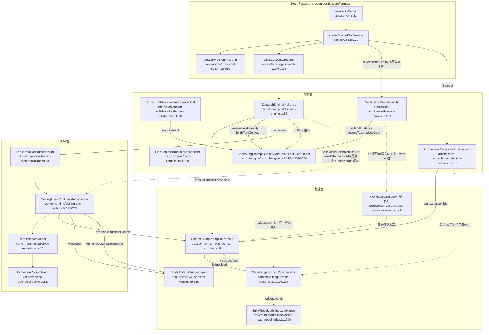
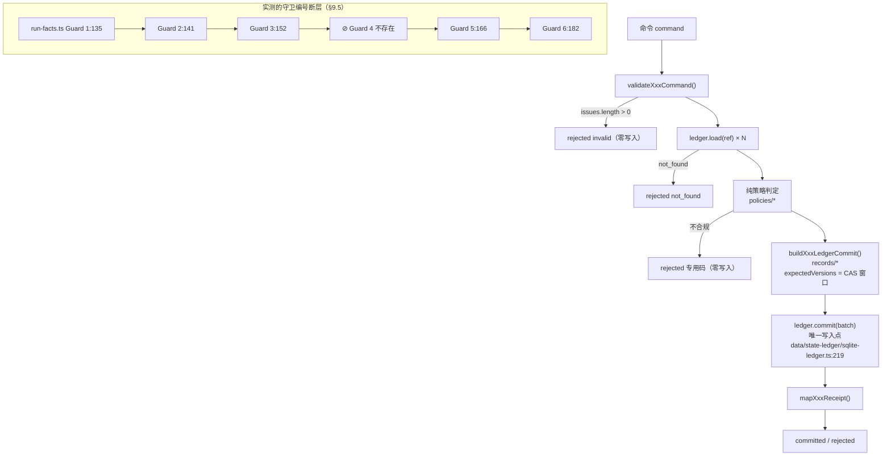
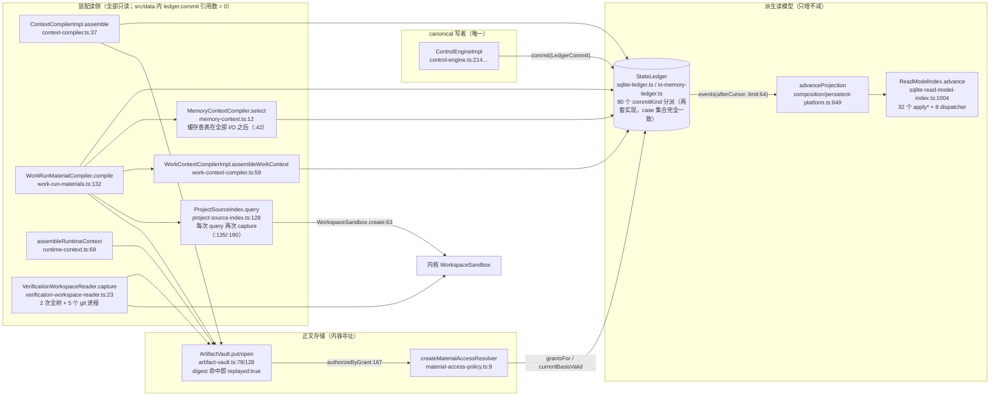
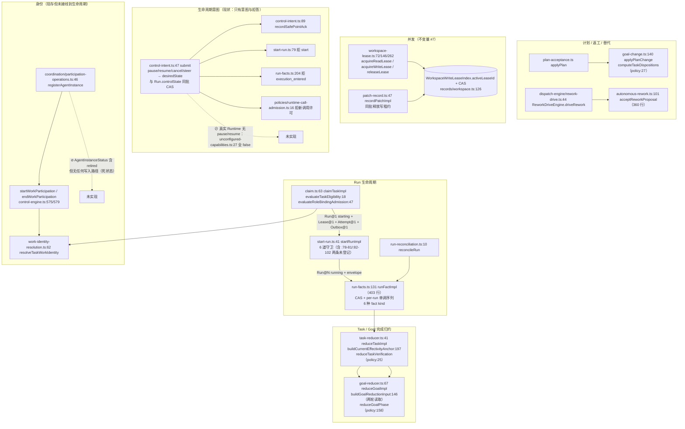

# 源码现状盘点（重构前事实基线）

```yaml
status: draft
scope: 只谈事实的现状报告，供后续重构决策逐条核对
fact_source: 仅源码本身（my-coding-platform-docs/ 下文档只用于「文档说 X / 代码实际 Y」对照）
source_root: /home/hyh001/projects/coding-platform/coding-platform
source_head: 58c9ada73966711437c5fcd3d8f8fb92f3dca210
doc_root: /home/hyh001/projects/coding-platform/my-coding-platform-docs/agent_platform
generated: 2026-09-20
```

## 阅读约定与证据标准

- 本报告所有结论都指到**文件路径 + 符号名**（函数 / 类 / 类型 / 常量）；第 5 节另给 `文件:行号`。
- 指不到出处的判断一律不写。拿不准写「不确定」，找不到写「未找到」。
- 全篇区分三类断言：**实测**（本轮真实执行过的只读命令：`find` / `wc -l` / `grep` / `sed` / `git status|log|show`）、**从代码推断**（读代码得出的机理判断，未运行验证）、**文档声称**（来自 `my-coding-platform-docs/`，仅作对照）。
- `C` = `/home/hyh001/projects/coding-platform/coding-platform`；`D` = `/home/hyh001/projects/coding-platform/my-coding-platform-docs/agent_platform`。
- 本报告行号均相对 **HEAD `58c9ada7`** 的工作树内容。

> **重要更正（任务书前提）**：任务书给出「已知环境事实：`node_modules`、`.local`、`dist`、`vendor/coding-agent/dist`、`src/ui/node_modules` 都不存在」。**实测这五个路径全部存在**，详见第 1 节。报告一律以实测为准。

---

## 1. 真实目录树

### 1.1 工作区与仓库状态（实测）

| 项 | 实测结果 | 证据 |
| --- | --- | --- |
| 工作区根 | `/home/hyh001/projects/coding-platform` | `pwd` |
| 被重构项目 | `coding-platform/` | `ls` |
| HEAD | `58c9ada73966711437c5fcd3d8f8fb92f3dca210`「feat: complete Agent Platform integration stage」 | `git log -1` |
| 分支 | `codex/i-stage-accepted-20260918`，跟踪 `origin/codex/i-stage-accepted-20260918` | `git status --branch` |
| 工作树是否干净 | **不干净**。已修改 3 个文件、未跟踪 3 个路径 | `git status --porcelain` |
| 已修改 | `AGENTS.md`（+373 行）、`tests/integration/coding-collaboration-scenario.test.ts`、`tests/integration/coding-goal-scenario.test.ts` | `git diff --stat` |
| 未跟踪 | `AGENT-REFACTOR-LOG.md`、`tests/integration/user-flow-workdir.test.ts`、`tests/integration/user-flow-workdir.ts` | `git status --porcelain` |
| `src/` 是否干净 | **干净**（`git status --porcelain src` 无输出）→ 本报告对源码的描述即 HEAD 内容 | `git status --porcelain src` |

### 1.2 任务书「不存在」的五个路径：实测全部存在

| 路径 | 任务书声称 | 实测 | 体积 | git 是否跟踪 |
| --- | --- | --- | --- | --- |
| `C/node_modules` | 不存在 | **存在**（`node_modules/.bin/` 含 `vitest`、`tsc`） | 135M | 否（`.gitignore:1`） |
| `C/.local` | 不存在 | **存在**（含 `linux-test-tools/`、`toolchains/`、`xdg/`） | 86M | 否（`.gitignore:7`） |
| `C/dist` | 不存在 | **存在** | 6.7M | 否（`.gitignore:2`） |
| `C/vendor/coding-agent/dist` | 不存在 | **存在**（含 `public-api.js`、`public-api.d.ts`、`core/`、`sandbox/`、`tools/`…） | 2.2M | 否 |
| `C/src/ui/node_modules` | 不存在 | **存在** | 130M | 否 |

**复核结论**：任务书关于「本快照无法构建、无法跑测试」的**推论前提不成立**。实测 `node_modules/.bin/vitest` 与 `node_modules/.bin/tsc` 均在；`pnpm` 存在于 `W/.toolchain/bin/pnpm`（**不在 `PATH`**，故裸 `pnpm` 报「未找到命令」）。按本轮只读约束，这些命令一律**未执行**；`node_modules` 是否存在只说明「依赖已就位」，**不等于**在本机可成功构建或测试（未验证）。

### 1.3 源码总规模（实测，`find` + `wc -l`）

`src/` 下 `.ts`/`.tsx`（排除 `node_modules`）：**529 文件 / 99,292 行**。
按 `D/ARCHITECTURE.md:171-188` 的 12 Module 归属口径**排除 `src/ui/`**：**463 文件 / 91,384 行**。

| 区域（模块 / 面） | 文件 | 行 |
| --- | --- | --- |
| `src/contracts/`（契约面） | 139 | 24,636 |
| `src/control/control-engine/`（ControlEngine） | 95 | 21,405 |
| `src/data/read-model-index/`（ReadModelIndex） | 23 | 9,395 |
| `src/ui/`（前端，超出本次范围） | 66 | 7,908 |
| `src/data/context-compiler/`（ContextCompiler） | 37 | 6,823 |
| `src/data/state-ledger/`（StateLedger） | 29 | 6,478 |
| `src/control/dispatch-engine/`（DispatchEngine） | 28 | 5,839 |
| `src/control/verification-engine/`（VerificationEngine） | 24 | 4,191 |
| `src/app/`（Host） | 17 | 2,680 |
| `src/execution/worker-runtime/`（WorkerRuntime） | 17 | 2,093 |
| `src/fixtures/`（夹具） | 6 | 1,750 |
| `src/control/plan-compiler/`（PlanCompiler） | 8 | 1,617 |
| `src/data/workspace-reader/`（WorkspaceReader） | 18 | 1,371 |
| `src/composition/`（组合根） | 4 | 949 |
| `src/harness/`（Host） | 2 | 655 |
| `src/interaction/human-collaboration/`（HumanCollaboration） | 5 | 619 |
| `src/data/artifact-vault/`（ArtifactVault） | 5 | 465 |
| `src/control/architecture-reconciler/`（ArchitectureReconciler） | 3 | 263 |
| `src/testing/`（测试替身） | 2 | 137 |
| `src/storage/`（Storage） | 1 | 18 |
| **合计** | **529** | **99,292** |

测试：`tests/` 下 `.ts` **493 文件 / 85,639 行**，其中**测试文件 389 个**（`*.test.ts`）。`vitest.config.ts:6` 的 `include` 是 `tests/**/*.test.ts`。

### 1.4 到模块一级的目录树

```
coding-platform/
├── src/
│   ├── contracts/               契约面（139 文件）—— 共享类型/校验/ID 派生，无实现依赖
│   │   ├── commands/            命令构造入口（10）
│   │   ├── history/             历史版本引导语（3）
│   │   ├── rework/              返工域契约（4）
│   │   ├── validation/          结构校验（17）
│   │   └── notices/             第三方许可文本（Hermes-MIT / OpenClaw-MIT）
│   ├── control/                 控制面（5 Module）
│   │   ├── control-engine/      ControlEngine —— 含 coordination/ 8、policies/ 21、records/ 17、records/coordination/ 7
│   │   ├── plan-compiler/       PlanCompiler
│   │   ├── dispatch-engine/     DispatchEngine —— 含 execution/ 4、handoff/ 3
│   │   ├── verification-engine/ VerificationEngine
│   │   └── architecture-reconciler/ ArchitectureReconciler
│   ├── data/                    数据面（5 Module）
│   │   ├── context-compiler/    ContextCompiler
│   │   ├── state-ledger/        StateLedger —— 含 validation/ 21
│   │   ├── read-model-index/    ReadModelIndex
│   │   ├── artifact-vault/      ArtifactVault
│   │   └── workspace-reader/    WorkspaceReader
│   ├── execution/worker-runtime/     WorkerRuntime
│   ├── interaction/human-collaboration/ HumanCollaboration
│   ├── app/                     宿主：service.ts / server.ts / governance.ts / memory.ts / model-settings.ts
│   │   ├── scheduling/          DispatchWake / DurableWake / TerminalContinuation / 续跑入口
│   │   └── public/              旧前端静态资源（.js/.css/.html，非 .ts）
│   ├── composition/             组合根：persistent-platform.ts 等
│   ├── harness/                 内存测试宿主
│   ├── fixtures/                内置夹具（治理 / 计划 / 派发 / 架构 / 角色规格）
│   ├── testing/                 确定性序列与检查替身
│   ├── storage/                 atomic-file.ts（唯一文件）
│   └── ui/                      前端（Vite/React + Playwright）
├── scripts/                     13 文件（见下）
├── tests/                       493 文件 / 389 测试
├── vendor/coding-agent/         内置执行内核源码副本（独立 npm 工程）
│   └── dist/                    内核已构建产物（2.2M，**未跟踪**）
├── evidence/                    9,269 文件（生成物级证据归档，本轮不展开）
├── dev_docs/                    106 文件（项目内文档副本，与 D/dev_docs 已分叉）
├── node_modules/ dist/ .local/  生成物 / 依赖目录（**不展开内容**）
└── 根文件：package.json, vitest.config.ts, tsconfig.json, tsconfig.app.json,
           pnpm-workspace.yaml, pnpm-lock.yaml, .gitignore, .gitattributes,
           AGENTS.md, ARCHITECTURE.md, CONTEXT.md, PRODUCT.md, README.md,
           IMPLEMENTATION-HANDOFF.md, AGENT-REFACTOR-LOG.md(未跟踪)
```

`src/ui/` 子结构（超出本次范围，仅登记）：`src/{api,components,features,state,workbench}`、`tests/`（Playwright）。

### 1.5 生成物 / 依赖目录标注（★ = 不展开内容）

| 目录 | 类别 | 证据 |
| --- | --- | --- |
| `node_modules/` ★ | 依赖目录 | `.gitignore:1` |
| `src/ui/node_modules/` ★ | 依赖目录 | 同上（`.gitignore:1` 的 `node_modules/` 递归匹配） |
| `vendor/coding-agent/node_modules/` ★ | 依赖目录 | 同上 |
| `dist/` ★ | **生成物**（`tsc -p tsconfig.app.json` 输出，`package.json:11`） | `.gitignore:2`；`git ls-files dist` = 0 |
| `vendor/coding-agent/dist/` ★ | **生成物**（内核已构建产物） | `git ls-files vendor/coding-agent/dist` = 0 |
| `.local/` ★ | 本地运行目录（含 Linux 测试 runner 与工具链） | `.gitignore:7` |
| `src/app/public/workbench/` ★ | **生成物**（UI 构建输出） | `.gitignore:8` |
| `evidence/` ★ | 证据归档（9,269 文件） | 存在但本轮不读 |
| `test-results/`、`src/ui/test-results/` ★ | 测试输出 | `.gitignore:11-12` |

来源文件（非生成物）：`src/**`、`scripts/**`、`tests/**`、`package.json`、`vitest.config.ts`、`tsconfig*.json`。

### 1.6 构建 / 测试 / 启动入口（只读记录，**本轮未执行任何一条**）

`C/package.json`（37 行）：

| 脚本 | 命令 | 相关事实 |
| --- | --- | --- |
| `test` | `vitest run` | `devDependencies.vitest = 4.1.10` |
| `build` | `npm run kernel:build && tsc -p tsconfig.app.json && node scripts/copy-ui.mjs && pnpm run ui:build` | 四段串联 |
| `gui` | `pnpm build && pnpm start` | 任务书所述的本地入口 |
| `start` | `node dist/app/server.js` | 依赖 `dist/` 已构建 |
| `check:architecture` | `node scripts/check-module-boundaries.mjs` | 模块边界检查器 |
| `kernel:build` | `npm --prefix vendor/coding-agent run build` | 内置内核需先构建 |
| `ui:build` / `ui:test` | `pnpm --dir src/ui run build` / `playwright test` | 前端独立工程 |
| `engines.node` | `>=24.15.0 <25` | **本机 `node -v` = v18.19.1 → 不满足**（实测） |

`C/vitest.config.ts`（15 行）：`environment: "node"`、`include: ["tests/**/*.test.ts"]`、`clearMocks`、`restoreMocks`、`testTimeout: 30_000`（注释说明 5s 默认值曾产生在文件间漂移的假失败）。

`C/scripts/`（13 文件）：`module-map.mjs`、`module-map.d.mts`、`check-module-boundaries.mjs`、`copy-ui.mjs`、`verify-ui-build.mjs`、`verify-source-index.mjs`、`verify-vault-crash.mjs`、`source-snapshot.mjs`、`test-wsl.sh`、`setup-source-analyzers.py`、`python-source-query.py`、`cpp-source-query.py`、`package-source-analyzers.py`。

`C/scripts/test-wsl.sh`（42 行）关键事实（实测）：要求 **Node 24**（`node -e 'if(...!==24)throw...'`）；Linux runner 装在 `.local/linux-test-tools`（`--setup` 时 `npm install vitest + typescript`）；要求 `CODING_AGENT_BWRAP_PATH` 指向可执行的 **bubblewrap**，否则「no tests started」；要求 `vendor/coding-agent/dist/app/cli/main.js` 已构建；跑前用 `WorkspaceSandbox.create` + `ProcessSandbox.probe` 做**进程沙箱预检**；自己生成 `vitest.config.mjs`（`testTimeout: 30000`），**刻意不用工作区里 Windows 装的 vitest/config**。
→ 即：**测试强依赖 bubblewrap 与 Linux**；本机为 Linux 但 `node -v` 为 18，且本轮禁止运行，故未验证。

### 1.7 `scripts/module-map.mjs`：模块归属的唯一可判定来源（实测读全文，65 行）

- `modules`（`:4-7`）：12 个 Module 名单 —— `HumanCollaboration, PlanCompiler, ControlEngine, DispatchEngine, VerificationEngine, ArchitectureReconciler, WorkerRuntime, StateLedger, ArtifactVault, ReadModelIndex, ContextCompiler, WorkspaceReader`。
- `allowedModuleDependencies`（`:9-21`）：12 条允许依赖表，注释明确「Kept in step with ARCHITECTURE.md; tests alone cannot discover or approve new DI edges」。
- `moduleDirs`（`:32-45`）：目录前缀 → Module。注释声明「EVERY Module owns exactly one directory」。
- `surfaceDirs`（`:47-56`）：非 Module 路径 → `UI` / `Fixtures` / `TestDoubles` / `Contracts` / `Host` / `Storage`。
- `owner(file)`（`:58-65`）：按**最长前缀优先**返回归属，未知返回 `'Unmapped'`。

### 1.8 `scripts/check-module-boundaries.mjs`：边界检查器（实测读全文，59 行）

- 用 TypeScript 编译器 API 解析每个 `.ts/.tsx/.js` 的相对 import（`:16-33`），解析 `import` / `export … from` / `import type` 三类。
- 五类违规判定（`:23-28`）：① Module→Module **未声明实现依赖**；② `Contracts` 依赖实现/测试材料；③ 生产逻辑消费 fixture/double；④ Module 依赖 Host；⑤ `Unmapped` 文件。
- DAG 环检测（`:39-47`）对 `allowedModuleDependencies` 做 DFS。
- **6 文件白名单**（`:55-59`，`fixtureConsumersInit`）显式放行生产代码引用 fixtures/testing：`src/harness/in-memory-harness.ts`、`src/composition/persistent-platform.ts`、`src/app/service.ts`、`src/execution/worker-runtime/fake-runtime-adapter.ts`、`src/data/workspace-reader/workspace-reader-adapter.ts`、`src/control/verification-engine/code-graph-port.ts`。
- 该检查器**本轮未执行**（属可执行工具，且任务书明确不得构建/测试）。第 2 节改用直接 grep 复算。

### 1.9 本轮未覆盖 / 跳过的内容（逐条）

| 范围 | 状态 | 原因 | 影响哪一节 |
| --- | --- | --- | --- |
| `src/ui/**`（66 文件 / 7,908 行） | 仅清单级 | 本次 10 节均不涉及前端 | 第 1 节已登记；不影响其他节 |
| `tests/**` 全量 389 个测试 | **仅抽样**（`restart/`、`runtime/`、`context/`、`data/`、`contracts/`、`integration/` 等） | 边际证据低、体量大 | 第 4、8 节的部分「实测」仅来自抽样 |
| `evidence/**`（9,269 文件） | 未读 | 生成物级归档 | 不影响 |
| `dist/`、`.local/`、各 `node_modules/` | 未展开 | 生成物 / 依赖 | 不影响 |
| `vendor/coding-agent/src/**` | 未读（只读 `dist/*.d.ts` 导出面与少量 `dist/*.js` 实现片段） | 内核不属被重构的 12 Module；只用于判断「平台是否用上内核能力」 | 第 4 节「挂起恢复/压缩」结论 |
| `C/dev_docs/`（106 文件） | 未读 | 与 `D/dev_docs` 分叉的副本，按项目 `AGENTS.md §3.4` 应以 `D` 为准 | 不影响 |
| `src/control/control-engine/coordination/**`（8 文件 / 3,238 行） | 方法级 + 导出级核对，**未逐行通读** | 体量与优先级 | 第 5 节 C1–C11 中协作通信细节可能不完整 |
| `src/contracts/validation/**`（17 文件） | 导出与长函数行数已核，**未逐分支核对字段一致性** | 体量 | 第 9 节可能有个别遗漏（标「不确定」） |
| 性能「实测」 | **不存在** | 本轮禁止构建/测试/运行 | 第 8 节全部为「从代码推断」 |

**一个读取异常（已定位、未跳过）**：`C/src/control/control-engine/policies/task-reduction.ts` 含 **2 个裸 NUL 字节**（字节偏移 5479、6986），导致 `file` 判为 `data`、`grep` 判为 binary、`read` 工具报 `binary file`。已用 `grep -a` + `sed` 读完全文并完成分析。该文件是 UTF-8，非 ASCII 字节仅 1 个 em-dash；NUL 出现在第 **135、173** 行的字符串字面量内部（`req.obligationId + "<NUL>" + req.requirementId` 的复合键分隔符，逻辑上是有意的）。`git show HEAD:…` 同样含这 2 个 NUL → **已随提交入库**；`git status` 对该文件无输出 → 相对 HEAD 未修改。**后果（从代码推断）**：`git diff` 对该文件失效，后续重构动它时 review 与逐行 diff 会退化。

其他 528 个源文件**无读取失败**（无权限、二进制、编码异常）。

---

## 2. 模块间实际依赖与调用关系

### 2.1 判定口径（实测）

- 归属由 `scripts/module-map.mjs` 的 `owner(file)`（`:58-65`）按**路径前缀**决定；12 Module 各占一个目录（`moduleDirs`:32-45）。
- `Contracts`（`src/contracts/`）、`Host`（`src/app/`、`src/harness/`、`src/composition/`）、`Fixtures`、`TestDoubles`、`Storage`、`UI` 是 **surface**（`surfaceDirs`:47-56），不是 Module。
- `scripts/check-module-boundaries.mjs:23-28` 只在**双方都是 Module** 且**非 type-only** 时报「未声明依赖」；`Contracts` 被当作共享面，因此 `X → Contracts` 边不计违规。本节按同一口径复算。
- 依据：`scripts/module-map.mjs:9-21` 的 `allowedModuleDependencies` 与 `D/ARCHITECTURE.md:193-242` 的 ModuleDependencyDAG（实测二者逐条一致）。

### 2.2 实际存在的模块间实现依赖边（逐条附文件 + 符号）

| # | 边 | 声明？ | 证据（文件 + 符号） |
| --- | --- | --- | --- |
| 1 | ControlEngine → StateLedger | ✅ 声明 | `control-engine/goal-change.ts:60`（`resolveProjectArchitectureBaseline`、`resolveProjectCompletionPolicy`）、`control-engine/baseline-evolution.ts:65`（`resolveProjectArchitectureBaseline`、`loadProjectArchitectureBaselineActive`）、`control-engine/plan-acceptance.ts:48`（同 `goal-change.ts`） |
| 2 | PlanCompiler → ControlEngine | ✅ 声明 | `plan-compiler/initial-plan-compiler.ts:5`（`normalizeInitialPlanProposal`）、`plan-compiler/rework-proposal.ts:9`（`deriveExpectedTaskGraph`、`deriveObligationSet`、`deriveTaskAssignments`、`deriveTaskSet`） |
| 3 | PlanCompiler → ContextCompiler | ✅ 声明 | `plan-compiler/execution-feedback-compiler.ts:3`（type-only `ExecutionFeedbackContext`）、`plan-compiler/feedback-decision-compiler.ts:5`（type-only `FeedbackDecisionContext`） |
| 4 | DispatchEngine → ControlEngine | ✅ 声明 | `dispatch-engine/role-spec-read.ts:17`（`resolveActiveCoordinationPolicy`）、`:21`（`evaluateRoleBindingAdmission`）、`dispatch-engine/coordination-drive.ts:72`（`backoffDelayMs`、`selectPageSubscriptions`、`RoutableSourceEvent`） |
| 5 | DispatchEngine → ContextCompiler | ✅ 声明 | `dispatch-engine/work-material-drive.ts:27/32/33`（`WorkRunMaterialCompiler`、`FeedbackMaterialCompiler`、`DeliveryMaterialCompiler`）、`leased-worker-runtime.ts:6`（`RuntimeContextMaterials`） |
| 6 | DispatchEngine → WorkerRuntime | ✅ 声明 | `dispatch-engine/leased-worker-runtime.ts:9`（type-only `CodingAgentRuntime`、`RunSpec`） |
| 7 | DispatchEngine → PlanCompiler | ✅ 声明 | `dispatch-engine/rework-drive.ts:14`（`ReworkPlanCompiler`）、`:15`（`resolvePlanningWorkIdentities`） |
| 8 | ContextCompiler → StateLedger | ✅ 声明 | `context-compiler/verification-context.ts:17`（`resolveArchitectureBaselineRevision`、`resolveCompletionPolicyRevision`）、`baseline-evolution-context.ts:5`、`verification-migration-context.ts:4`（均 `resolveProjectArchitectureBaseline`） |
| 9 | ContextCompiler → WorkspaceReader | ✅ 声明 | `context-compiler/exploration-session-context.ts:9`（`explorationSourceDigest`）、`operator-planning-context.ts:5`（同）、`reviewer-context.ts:14`（`readReviewerSource`） |
| 10 | ReadModelIndex → ControlEngine | ✅ 声明 | `read-model-index/read-model-index.ts:19`（`dedupeTaskWorks`）、`sqlite-read-model-index.ts:18`（同） |
| 11 | WorkerRuntime → ContextCompiler | ✅ 声明 | `worker-runtime/coding-agent-runtime.ts:11`（`assembleRuntimeContext`、`RuntimeContextError`、`RuntimeContextAccess`、`RuntimeContextAssembly`） |
| 12 | WorkerRuntime → WorkspaceReader | ✅ 声明 | `worker-runtime/exploration-tools.ts:5-8`（`SourceIndex`、`ProjectSourceIndex`、`PythonSourceIndex`、`CppSourceIndex`）、`coding-agent-runtime.ts:12`（`reviewerSourcePathAllowed`）、`observed-model-run.ts:9`（`readSourceIdentity`） |
| 13 | WorkerRuntime → ArtifactVault | ✅ 声明 | `coding-agent-runtime.ts:1`、`read-only-query-runtime.ts:1`、`query-answer-audit.ts:2`（均 `RuntimeObservationJournal`） |
| 14 | ArtifactVault → WorkspaceReader | ✅ 声明 | `artifact-vault/material-access-policy.ts:5`（`materialSourcePinIsCurrent`） |

**结论（实测）**：**14 条 Module→Module 实现边，全部落在 `allowedModuleDependencies` 内，无越界边。** 与 `D/decision/02:48` 声称的「14 条不同模块→模块边，全在允许集合内」**数量与结论一致**。

### 2.3 实际存在但**不在** `allowedModuleDependencies` 语义内的真实依赖

| # | 边 | 证据 | 为何不被检查器报出 |
| --- | --- | --- | --- |
| 15 | VerificationEngine → 内核副本（`vendor/coding-agent/dist/public-api.js`） | `verification-engine/command-check-provider.ts:2`（`WorkspaceSandbox`、`ProcessSandbox`） | `check-module-boundaries.mjs` 只 `walk('src')`，`vendor/` 不在 `fileSet`，`edge()` 解析不到 dest 直接 return → **既不报错也不进 edges** |
| 16 | WorkerRuntime → 内核副本 | `coding-agent-runtime.ts:94`（动态 `import()`）、`exploration-tools.ts`、`coordination-tools.ts`、`reviewer-material-tools.ts`（type-only） | 同上 |
| 17 | WorkspaceReader → 内核副本 | `workspace-reader/source-workspace-reader.ts`、`query-workspace-source-reader.ts`、`readonly-read-witness-reader.ts` | 同上 |
| 18 | PlanCompiler / VerificationEngine / ArtifactVault / HumanCollaboration → Storage（`src/storage/atomic-file.js`） | `plan-compiler/operator-plan-compiler.ts:10`、`verification-engine/verification-journal.ts:3`、`artifact-vault/runtime-observation-journal.ts:3`、`interaction/human-collaboration/exploration-session.ts:1`（均 `writeAtomicFile`） | `Storage` 是 surface，两方不同时是 Module，不判 |
| 19 | WorkerRuntime → Fixtures（type-only） | `worker-runtime/fake-runtime-adapter.ts:27`（type-only `FakeRuntimeScriptV1`） | type-only 不计；且该文件在 `check-module-boundaries.mjs:55-59` 白名单内 |
| 20 | WorkspaceReader → Fixtures | `workspace-reader/workspace-reader-adapter.ts:21`（`buildP112BaselineGraph`、`buildP112CurrentGraph`） | 该文件同样在白名单内 |
| 21 | Host → Fixtures / TestDoubles | `app/service.ts:106,107,108,112,117`；`composition/persistent-platform.ts:111,112,127,128`；`harness/in-memory-harness.ts:86,87,96,97` | Host 不是 Module，不判 |
| 22 | VerificationEngine → 内核副本（code-graph 侧） | `verification-engine/code-graph-port.ts`（白名单文件） | 同 #15 |

**「生产源码依赖测试夹具」这一事实**（实测，与 `D/decision/02:59-62` 的 [冲突-02] 一致）：`app/service.ts`、`composition/persistent-platform.ts`、`harness/in-memory-harness.ts`、`worker-runtime/fake-runtime-adapter.ts`、`workspace-reader/workspace-reader-adapter.ts`、`verification-engine/code-graph-port.ts` 共 **6 个文件**引用 `src/fixtures/**` 或 `src/testing/**`；`check-module-boundaries.mjs:55-59` 用一份**硬编码 6 文件白名单**放行。

### 2.4 与文档 DAG 的差异表

| # | 文档说（`D/ARCHITECTURE.md:193-242` 与 `D/decision/02:47-50`） | 代码实际 | 差异性质 |
| --- | --- | --- | --- |
| D-1 | `HumanCollaboration → PlanCompiler / ControlEngine / ReadModelIndex / DispatchEngine / ContextCompiler / VerificationEngine / ArtifactVault`（7 条出边） | `interaction/human-collaboration/` 的**外部 import 只有 `contracts/**` 与 `storage/atomic-file.js`**（实测 `grep -rn "from '\.\./\.\./data/"` 与 `control/` 均 0 命中）。7 条边全部经**契约端口 + 组合根注入**实现（`HumanCollaborationImpl` 的 deps 是 `contracts/modules.js` 的接口类型） | **文档说 A→B，代码里没有源码边**（只有 DI 边）。方向对（运行期确实调用这些模块），但 DAG 表达为「源码依赖」时不成立 |
| D-2 | `DispatchEngine → ArtifactVault / StateLedger` | 无实现 import（`grep` 0 命中）；实际经 `contracts/ledger.js` 的 `StateLedger` 接口与组合根注入的 `vault` | 同上（DI 边） |
| D-3 | `VerificationEngine → ControlEngine / ContextCompiler / ArtifactVault` | 无实现 import（0 命中）；`VerificationEngineImpl` deps 是 `VerificationContextPort`（注入） | 同上（DI 边） |
| D-4 | `VerificationEngine → …`（**无 WorkspaceReader 边**） | `verification-engine/command-check-provider.ts:58` 内联了 `WorkspaceReader` 的**权威拒绝前缀清单**（7 项，与 `workspace-reader/denied-prefixes.ts:31-33` 集合完全相同、仅顺序不同） | **文档无此边，代码却共享了该模块的数据**。`denied-prefixes.ts:27-29` 自己写明：收敛需先有架构决定，因为这条边未被声明 |
| D-5 | `ArchitectureReconciler → ControlEngine / ContextCompiler / ArtifactVault` | 无实现 import（0 命中）；`ArchitectureReconcilerImpl` deps 是 `InspectionPort` 相关注入 | 同上（DI 边） |
| D-6 | `ArchitectureReconciler → ContextCompiler` | `ArchitectureReconcilerImpl` 由组合根注入 `ArchitectureContextCompiler`（`composition/persistent-platform.ts:647`）；**但 ArchitectureReconciler 自身不 import ContextCompiler**，且 `architecture-context.ts:18/26` 把两个 Port 定义在**契约层** | 同上（DI 边） |
| D-7 | `ContextCompiler → ReadModelIndex`、`ContextCompiler → ArtifactVault` | 无实现 import（`grep "read-model-index" src/data/context-compiler/` 0 命中）；ArtifactVault 只以 `ArtifactPort` 契约类型出现（`context-compiler/context-compiler.ts:9`） | 同上（DI 边） |
| D-8 | `ArtifactVault → StateLedger / ReadModelIndex / WorkspaceReader` | 只有 `WorkspaceReader` 是**实现边**（`material-access-policy.ts:5`）；StateLedger/ReadModelIndex 只以契约类型出现（`material-access-policy.ts:1` 的 `StateLedger`、`GoalSnapshot`） | 部分一致 |
| D-9 | `ReadModelIndex → StateLedger` | 无实现 import；`SqliteReadModelIndex` 只接收 `EventPage`（`contracts/ledger.js`） | 同上（DI 边） |
| D-10 | `WorkerRuntime → ContextCompiler / WorkspaceReader / ArtifactVault` | **三条都是实现边**（见 2.2 #11/#12/#13） | **一致**（唯一三条完全落地的声明边之一，另一条是 ControlEngine→StateLedger） |
| D-11 | `ControlEngine → StateLedger` | **实现边**（3 处） | **一致** |
| D-12 | `PlanCompiler → ContextCompiler / ControlEngine` | **都是实现边** | **一致** |
| D-13 | `DispatchEngine → ControlEngine / ContextCompiler / WorkerRuntime / PlanCompiler` | **都是实现边** | **一致**（另 2 条为 DI） |
| D-14 | `DispatchEngine.drive(trigger)`「**唯一入口**」（`D/ARCHITECTURE.md:178`） | `runtime.start` 在生产有 **3 个调用点**：`dispatch-engine.ts:219`（ordinary+coordination outbox）、`reviewer-dispatch.ts:88`（独立 Reviewer 运行）、`handoff/handoff-drive.ts:144`（换手）；`driveOrdinary` 用 `dispatch-engine.ts:109`（review intent 直接 return）与 `:116-121`（replacement attempt guard）**显式让位** | **文档说「唯一入口」，代码是三条独立启动路径**（`drive` 只对 ordinary+coordination outbox 唯一） |
| D-15 | `ControlEngine.submit(command)`（`D/ARCHITECTURE.md:177`，`first-slice draft`） | `control-engine.ts:214` `submit` **只 accept `CreateGoalCommand`**；真实命令面是 `ControlEngineImpl` 上 **~93 个命名方法**，**没有任何 `commandType` 分发器/命令注册表** | **文档严重低估接口面**（文档自己在 `:188` 承认「现有类型仍是 CreateGoal 首切片」） |
| D-16 | `VerificationEngine.verify(intent) → verification ref`（`D/ARCHITECTURE.md:179`） | 真实生产路径**不走** `VerificationEngineImpl.verify`（`verification-engine.ts:50`）：`app/service.ts:203-207` 把 `verification` 端口覆写为 `verifications.verify` → `VerificationService.verify` → `VerificationRounds.verify`（`verification-rounds.ts:233`）。`VerificationEngineImpl` 在 command-check 路径上被重新 `new`（`command-check-lifecycle.ts:196`） | **文档未记载的双实现** |
| D-17 | `ReadModelIndex.advance(page)` / `goal(query)` | `contracts/goal-view.ts:89/90` 有这两个方法，**但接口共 27 个方法**（`:89-140`） | 文档只写首切片，实际远超 |
| D-18 | 模块 `policies/` 属 ControlEngine 实现细节（`D/dev_docs/modules/control/control-engine.md` 未把 `policies/**` 列为公开面） | `plan-compiler/initial-plan-compiler.ts:5`、`plan-compiler/rework-proposal.ts:9`、`dispatch-engine/role-spec-read.ts:17,21`、`dispatch-engine/coordination-drive.ts:72` **直接 import `control-engine/policies/**` 的 5 个文件** | **文档未记载的跨模块共享面**：`control-engine/policies/` 事实上是共享确定性策略库 |
| D-19 | `D/decision/02:56` 称复制清单为「三处 + 三个近似清单」 | 实测**字面复制权威清单的是 4 处**（`coding-agent-runtime.ts:258`、`read-only-query-runtime.ts:140`、`command-check-provider.ts:58`，**外加** `src/app/service.ts:297` 的注释断言「只有一个来源」与之矛盾）；另有 3 个**近似但不等同**的 `ignored` 清单：`cpp-source-index.ts:9`、`python-source-index.ts:12`、`project-source-index.ts:26`（三者都**额外**含 `.venv`/`__pycache__`/`node_modules` 等，且互不相同） | 文档少算一处注释性矛盾，近似清单数量一致 |

**判定**：`D/decision/02:47-49` 的三条判定（文档依赖边 == `module-map.mjs`、0 条越界、0 个 Unmapped）**与实测一致**。但「边一致」只说明**声明表与代码互不矛盾**，不代表文档的 DAG 描述了代码的真实调用形态——**22 条真实依赖里，只有 14 条被声明表覆盖；其中 8 条是运行期 DI（无源码边），4 条指向内核副本或 Storage，2 条指向 Fixtures。**

### 2.5 调用关系：三条主要链路（真实符号与顺序）

**链路 1 · 普通运行（Host → Dispatch → Control → Runtime）**
`app/service.ts:235` `DispatchWake` → `dispatch-engine.ts:85` `DispatchEngineImpl.drive` → `:93` `driveOrdinary` → `:95` `ledger.pendingDispatchIntents` → `:128` `contextCompiler.assemble` → `:166` `ensureWorkIdentity` → `:178` `ensureInitialWorkAssignment` → `:187` `successorPreparation` → `:201` `authorizeRuntimeEntry` → `:219` `runtime.start` → `leased-worker-runtime.ts:86` → `coding-agent-runtime.ts:129` `start` → `:219` `execute` → `:240` `assembleRuntimeContext` → `:287` `runObservedModel` → `observed-model-run.ts:75` `kernel.runCodingAgent` → `:290-308` 事件回写 → `dispatch-engine.ts:290` `runFact` 循环。

**链路 2 · 人承认目标（Host → HumanCollaboration → Control）**
`app/service.ts:550` → `human-collaboration.ts:48` `createGoal` → `:72` `control.submit` → `control-engine.ts:214` `submit` → `ledger.commit`。

**链路 3 · 验收（Host → 覆写的 VerificationService → Control）**
`app/service.ts:703` `h.verification.verify` → `app/service.ts:204-206` 覆写端口 → `verification-service.ts:116` `verify` → `verification-rounds.ts:233` `verify` → `:271` `prepare` → `:340` `advance` → `:448` `admitAggregate` → `submitEvidence` → `control-engine.ts:366` `reduceTask`/`:379` `reduceGoal`。

---

## 3. 重复/冗余实现清单

> 合并建议一律只写文字方向，不含补丁或代码改动。

### 3.1 `denied-prefixes`：1 份权威 + 3 份字面复制 + 1 处矛盾注释 + 3 份近似清单

| 角色 | 文件 | 符号 / 形式 | 行 | 内容 |
| --- | --- | --- | --- | --- |
| **权威** | `src/data/workspace-reader/denied-prefixes.ts` | `WORKSPACE_DENIED_PREFIXES: readonly string[]` | `:31-33` | `.evaluator, .oracle, hidden-tests, .git, .env, .env.local, .platform-runtime`（7 项） |
| 副本 A | `src/execution/worker-runtime/coding-agent-runtime.ts` | `execute` 内局部 `const deniedPrefixes` | `:258` | **7/7 逐项且顺序一致** |
| 副本 B | `src/execution/worker-runtime/read-only-query-runtime.ts` | `execute` 内局部 `const deniedPrefixes` | `:140` | **7/7 逐项且顺序一致** |
| 副本 C | `src/control/verification-engine/command-check-provider.ts` | `CommandCheckProvider.runCheck` 内联字面量 | `:58` | **集合相同（7/7）、仅顺序不同** |
| 矛盾注释 | `src/app/service.ts` | 注释「拒绝前缀只有 workspace-reader/denied-prefixes.ts 一个来源」 | `:297` | 与上表 3 份副本**直接矛盾** |
| 近似清单 1 | `src/data/workspace-reader/cpp-source-index.ts` | `ignored(p)` | `:9` | 8 项：`.git, .evaluator, .oracle, hidden-tests, .platform-runtime, .venv, __pycache__, node_modules` |
| 近似清单 2 | `src/data/workspace-reader/python-source-index.ts` | `ignored(p)` | `:12` | 与近似清单 1 **逐字相同** |
| 近似清单 3 | `src/data/workspace-reader/project-source-index.ts` | `ignored(p)` | `:26` | 8 项但**集合不同**：`.git, .platform-runtime, .evaluator, .oracle, hidden-tests, .pnpm, .cache, __pycache__`（无 `node_modules`/`.venv`，多 `.pnpm`/`.cache`） |

**正确引用权威版的 4 处**（正面样板，可照抄的收敛方式）：`source-workspace-reader.ts:3,9`、`query-workspace-source-reader.ts:3,15`、`role-source-reader.ts:44,64`、`readonly-read-witness-reader.ts:4,11`。

**另有 1 份测试内的字面复制**：`tests/context/persisted-query-source.test.ts:28`；`tests/data/workspace-path-boundary.test.ts:61` 还把同一 7 项排序后作断言基准。`scripts/verify-source-index.mjs:5` 又是第 3 种近似（仅 4 项：`.git, .env, .evaluator, .oracle`）。

**合并建议（文字）**：副本 A/B 直接改为引用权威常量 —— `WorkerRuntime → WorkspaceReader` 已是**声明边**（`module-map.mjs:16`），无架构阻力。副本 C 不能直接引用，因为 `VerificationEngine → WorkspaceReader` **不是声明边**；需先做架构决定（新增该边，或把这份清单上移到 `contracts/` 作为共享常量，或由组合根注入），三者择一后再收敛。`app/service.ts:297` 的注释应改为与事实一致。三份近似 `ignored` 清单与权威清单**语义不同**（前者是源码索引的扫描忽略，后者是路径拒绝前缀），应先明确二者的关系再决定是否统一，但三者**彼此之间**（尤其 1 与 2 逐字相同）应当收敛。

### 3.2 账本 receipt → 拒码映射：3 份近逐字 + 3 份变体

| # | 文件 | 符号 | 行 |
| --- | --- | --- | --- |
| 1 | `src/control/control-engine/role-spec.ts` | `mapCommittedRejection` | `:153-170` |
| 2 | `src/control/control-engine/human-role-collaboration.ts` | `mapCommittedRejection` | `:271-289` |
| 3 | `src/control/control-engine/baseline-evolution.ts` | `mapCommittedRejection` | `:407-425` |
| 4 | `src/control/control-engine/remediation.ts` | `mapRejected(code: string)` | `:254-268` |
| 5 | `src/control/control-engine/workspace-lease.ts` | `mapCommitRejection(code)` | `:44-57` |
| 6 | `src/control/control-engine/coordination/admission-support.ts` | `mapRejectedCommit` / `mapSettleCommitRejection` | `:292` / `:504` |

1/2/3 是同签名同分支的近逐字副本（仅注释语言不同）。4/5/6 是同一语义的三种不同形态。
**合并建议**：归为一个 `mapLedgerRejection(receipt, commandId)`，各入口只保留薄适配。附带收益：`invalid_commit → invalid` / `not_empty → invalid` 这组样板分支目前散落在 **~30 处** `switch`（见 3.2 的附图清单），可一并收敛。

### 3.3 `AggregateSnapshot` 类型守卫族：≥6 文件、同名符号最多 4 份

| 符号 | 副本位置（文件:行） |
| --- | --- |
| `isEvidenceSnapshot` | `task-reducer.ts:272`、`evidence-intake.ts:186`、`patch-record.ts:223`、`integration-join.ts:40` |
| `isTaskEvidenceIndexSnapshot` | `task-reducer.ts:276`、`evidence-intake.ts:192` |
| `isPlanRevisionSnapshot` | `task-reducer.ts:282`、`evidence-intake.ts:202`、`patch-record.ts:211`、`handoff.ts:136` |
| `isRunSnapshot` | `task-reducer.ts:290`、`patch-record.ts:203`、`integration-join.ts:31` |
| `isWorkspaceSnapshot` | `patch-record.ts:207`、`integration-join.ts:34`、`handoff.ts:132` |
| `isGoalSnapshot` | `evidence-intake.ts:198` |
| `isGoalPhaseSnapshot` | `goal-reducer.ts:387` |
| `isWriteLeaseIndexSnapshot` / `isWriteLeaseSnapshot` | `patch-record.ts:215` / `:219` |

另有 `context-compiler/context-compiler.ts:248,252` 的 `isWorkspaceSnapshot` / `isPlanRevisionSnapshot`（**第 5、6 份**）。
**合并建议**：归入单一 `snapshot-guards` 模块；同时统一两种风格（类型谓词 `s is T` 与返回 `boolean` 现混用）。

### 3.4 `canonicalJson` 相等比较助手 `same`：≥7 份

`control-engine/start-run.ts:90`、`control-engine/reviewer-work.ts:23`、`dispatch-engine/reviewer-dispatch.ts:20`（带 `undefined` 特判，语义与其余不同）、`verification-engine/verification-rounds.ts:28`、`verification-engine/reviewer-report.ts:10`、`verification-engine/rework-verification.ts:11`、`verification-engine/reviewer-verification.ts:18`。
**合并建议**：导出一个 `sameJson(a, b)`；`reviewer-dispatch.ts:20` 的 `undefined` 特判应作为显式参数或单独命名函数，不能混在同一名字下。

### 3.5 sha256-hex 助手：6 份副本 vs 1 份契约权威

权威已存在：`src/contracts/fingerprint.ts:50` `sha256Hex`（正确引用者：`lifecycle-control-adapter.ts:6`、`architecture-review.ts:14`）。
副本：`coding-agent-runtime.ts:30`（`hash`）、`read-only-query-runtime.ts:30`（`sha`）、`query-answer-audit.ts:13`（`sha`）、`query-answer-review.ts:36,86`（内联）、`interaction/human-collaboration/exploration-session.ts:10`（`digest`）、`worker-runtime/exploration-tools.ts:13`（`digest`）。
**合并建议**：全部改为引用 `sha256Hex`；这是纯机械收敛，无架构阻力（`contracts` 是共享面）。

### 3.6 事件扫描分页常量：`1000`×3+、`200`×4+

| 位置 | 符号 | 值 |
| --- | --- | --- |
| `control-engine/coordination/mailbox-view.ts:39-40` | `MAILBOX_SCAN_PAGE_SIZE` / `MAILBOX_MAX_SCAN_PAGES` | 1_000 / 200 |
| `control-engine/work-identity-resolution.ts:49-51` | `TASK_WORK_IDENTITY_SCAN_PAGE_SIZE` / `_MAX_SCAN_PAGES` | 1000 / 200 |
| `control-engine/autonomous-rework.ts:81-82` | `MAX_SCAN_PAGES` / `SCAN_PAGE_SIZE`（**模块私有、不可配**） | 200 / 1000 |
| `dispatch-engine/coordination-drive.ts:81-82` | `COORDINATION_SCAN_PAGE_SIZE` / `COORDINATION_MAX_SCAN_PAGES`（exported） | 1000 / 200 |
| `dispatch-engine/coordination-admission-deliveries.ts:32-33` | `SCAN_PAGE_SIZE` / `SCAN_MAX_PAGES`（**local，未 import 上面的 exported 常量**） | 1000 / 200 |
| `dispatch-engine/coordination-tool-access.ts:57-58` | `SCAN_PAGE_SIZE` / `SCAN_MAX_PAGES`（local） | 1000 / 200 |
| `dispatch-engine/runtime-dispatch.ts:152` | 内联 `pageIndex < 200` | 200 |

**合并建议**：提取为共享常量并显式说明各扫描口径是否应当相同；`autonomous-rework.ts` 的两份未导出，运维不可见、不可调，应收敛时一并暴露。

### 3.7 其他确认的重复

| # | 内容 | 副本 | 合并建议 |
| --- | --- | --- | --- |
| 3.7.1 | 命令指纹函数 | `contracts/` 内 **70 个** `*Fingerprint` 手写函数（如 `coordination.ts:1751-1801` 连续 13 个），函数体一律 `sha256Hex(canonicalJson({kind, command}))`；唯一泛化版 `reviewer-work.ts:78` `reviewCommandFingerprint(kind, command)` **只被 review 用** | 用泛化版统一，或提供声明式表 |
| 3.7.2 | 「运行中 → outcome_unknown」重启恢复模式 | `coding-agent-runtime.ts:95-98`、`read-only-query-runtime.ts:67-70`、`query-answer-audit.ts:52-55` | 提取为共享的「启动时未终结记录处置」助手 |
| 3.7.3 | 模型流消费循环 | `read-only-query-runtime.ts:155-161`、`query-answer-audit.ts:107-113`、`query-answer-review.ts:91-97`（+ `coding-agent-runtime.ts:287-308` 委托版） | 统一到一个消费器 |
| 3.7.4 | 复核结论 JSON 校验 | `query-answer-review.ts:53-74` `checkReviewResult`（22 行）与 `query-answer-audit.ts:18-37` `parseAnswerAudit`（20 行）**同构**（blocks 覆盖、quote 必须是 block 子串、marker 属于该 block 的 basis、verdict 一致性） | 合并为参数化校验器；顺带合并 `query-answer-review.ts:51` 与 `query-answer-audit.ts:15-16` 的复核提示词 |
| 3.7.5 | 上下文装配端口与 packet 类型 | **12 个平行 `assemble*` 方法**分布在 12 个 Port：`task-envelope.ts:103` `TaskContextPort.assemble`、`work-context-port.ts:108` `WorkContextPort.assembleWorkContext`、`completed-work-context.ts:209` `assembleCompletedWorkContext`、`handoff-context.ts:96` `HandoffContextPort.assemble`、`review-context.ts:120` `ReviewContextPort.assemble`、`reviewer-context.ts:103` `ReviewerContextPort.assemble`、`architecture-context.ts:22` `ArchitectureContextPort.assemble`、`:27` `BaselineEvolutionContextPort.assemble`、`planning.ts:97` `assemblePlanningContext`、`query-job.ts:299` `assembleQueryContext`、`query-execution-context.ts:35` `QueryExecutionMaterialPort.assemble`、`exploration-session.ts:54` `ExplorationContextDrivePort.assembleRun`。**`ContextBundle` 类型不存在**（只在注释里出现）；实际有 **6 个互不相通的 packet/bundle 类型**：`TaskEnvelopeV1`（`task-envelope.ts:25`）、`WorkContextBundleV1`（`work-context-port.ts:58`）、`ReviewPacketV1`（`review-context.ts:66`）、`ReviewerPacketV1`（`reviewer-context.ts:56`）、`HandoffPacketV1`（`handoff.ts:152`）、`ContextManifestV1`（`task-envelope.ts:48`） | 见第 6 节 I1：这是「ContextCompiler 边界收缩」要在契约层同时处理的 12 处 |
| 3.7.6 | 审阅材料装配双份 | `review-context.ts:119-121`（出 `ReviewPacketV1`）与 `reviewer-context.ts:96-104`（出 `ReviewerPacketV1`），字段高度重叠、**无转换函数** | 需明确二者是同一抽象的两个视图还是两件事 |
| 3.7.7 | 「检查/结论记录」三套 | `reviewer-work.ts`（`ReviewWorkSnapshot:26` 等）、`verification-round.ts`（`VerificationRoundRecord:87` 等）、`verification-service.ts`（`CommandCheckRecord:29` 等）；三套都表达「某检查对某义务要求的结果」 | 需给出统一的结果模型或明确的边界 |
| 3.7.8 | 需求结论键两种 | `evidence.ts:175` `RequirementKey{obligationId,requirementId}` + `:177 requirementKeyOf` ↔ `reviewer-work.ts:34` `ReviewerRequirementResult{obligationId,requirementId,outcome,summary}` | 同元组两处声明 |
| 3.7.9 | `Phase` 同名双份 | `plan.ts:27`（7 值）与 `reduction.ts:216 Phase = TaskReductionPhase`（4 值，定义在 `:54`）；且 `reduction.ts:217 reductionPhaseOf(phase)` 是**恒等函数** | 改名区分「计划相位」与「正式归约相位」；恒等函数应删除或加真实转换语义 |
| 3.7.10 | 纯别名冗余 | `verification-context.ts:46` `VerificationReadonlyReportResult = ReadonlyReportMaterialResult`；`verification.ts:131` `DomainEvent = DomainEventV1`；`architecture-inspection.ts:187` `CodeGraphSnapshot = CodeGraphSnapshotV1` | 别名若无语义差别应删除 |
| 3.7.11 | 消费者重叠的两套验收 | `verification-engine.ts:50` `VerificationEngineImpl.verify`（plan + CheckPort 执行）与 `verification-rounds.ts:233` `VerificationRounds.verify`（轮次工作流）；生产 `app/service.ts:204-206` 只走 rounds，但 command-check 路径又 `new VerificationEngineImpl`（`command-check-lifecycle.ts:196`） | 属**真实的双实现**，不是纯重复；需明确谁是权威、谁只是内部复用 |
| 3.7.12 | 内联 stub 端口 | `command-check-lifecycle.ts:196-198` 每次检查现场构造 `new VerificationEngineImpl(ctx, [provider], {capabilities: async () => ({mode:'dispatch-run', maxPacketBytes:65536, noFullTranscript:true})})` —— 内联假 `ReviewerPort` 字面量，与组合根的 `FAKE_REVIEWER_PORT` 并行 | 收归组合根/测试替身 |
| 3.7.13 | 输入校验原语 | 权威 `verification-input.ts:3/4/8/12/16`（`digest/ensure/object/text/sha`，`text` 默认 cap **2048**）；副本 `recorded-verification.ts:11`、`exploration-report-verifier.ts:6/8/12/16`（cap **4096**）、`operator-plan-compiler.ts:11/13/15/16/17/18`（cap **4096**）、`planned-task-dispatch.ts:19` | 收敛并统一 cap；**2048 与 4096 的分歧需显式裁决** |
| 3.7.14 | 工具结果信封 / effects 字面量 | `effects` 4 份：`coordination-tools.ts:73`、`exploration-tools.ts:11`、`query-fact-tool.ts:8`、`reviewer-material-tools.ts:5`；工具结果 `cancelled/error` 分支手写 6+ 份：`coordination-tools.ts:88-117,130,134,137`、`exploration-tools.ts:85,100`、`query-fact-tool.ts:27,66`、`reviewer-material-tools.ts:68,81` | 提取统一信封构造 |
| 3.7.15 | 运行键 / 作用域键 | `coding-agent-runtime.ts:31` `keyFor`、`handoff-control-adapter.ts:178` `runKey`、`exploration-session.ts:11` `scopeKey`、`read-only-query-runtime.ts:88,98` 内联 `sha(canonicalJson(...))` | 收敛为契约层的一个键派生函数 |
| 3.7.16 | 确定性时间常量 | `context-continuation-adapter.ts:60`、`lifecycle-control-adapter.ts:23,28`、`read-only-query-adapter.ts:10,15` 各写一份固定时间戳 | 提取共享常量 |
| 3.7.17 | 退避公式两份且**参数不同** | `control-engine/policies/coordination-rules.ts:243-247` `backoffDelayMs`（`min(60_000, 250 * 2^min(n,8))`，带抖动、可测）与 `control-engine/run-facts.ts:233-234`（内联 `min(60_000, 1000 * 2^(n-1))`，无抖动） | 若差异非刻意，应合并；若是刻意，需写出理由 |
| 3.7.18 | 「Run 不可运行」判据 4 处 | `start-run.ts:79`、`run-facts.ts:204`、`policies/runtime-call-admission.ts:16`、`contracts/execution-authorization.ts:10` | 提取 `isRunRunnable(run)`；现状新增状态时必漏 |
| 3.7.19 | `MODULE_DIRS` 与 `moduleDirs` 双份 | `tests/contracts/module-ownership.test.ts:21-34` 与 `scripts/module-map.mjs:32-45` | 测试注释 `:18-20` 声明「**刻意**重复，作为可读契约」，防布局漂移。**属有意设计，建议保留** |
| 3.7.20 | 注释里已自认「不分叉」的样板 | `control-engine/policies/role-binding-admission.ts:114-156` `evaluateRoleSpecPinReadiness` 复用 `:47-92` 同一判据，并附 30 行注释说明为何不分叉 | **正面样板，建议保留** |

---

## 4. 生命周期管理现状与缺失点

> 口径：先问「生命周期作用在**谁**身上」。「角色 / Agent / Session」在本仓库是**三个不同成熟度的概念**，必须分开对齐，否则会得出错误结论。第 4.1 节先给概念现状，4.2/4.3 再按四动作/五阶段逐项对齐。

### 4.1 三个概念的代码现状（实测）

| 概念 | 代码里有没有 | 证据 |
| --- | --- | --- |
| **Work（长期责任）** | **有，且实现完整** | `contracts/task-work-identity.ts:56` `workIdFor`（`work-<sha256(...)[0..32]>`）；`control-engine/work-identity-resolution.ts:62` `resolveTaskWorkIdentity`（唯一权威只读解析面）；`contracts/context-continuity.ts:106` `WorkContextBindingV1`；`context-continuity.ts:49` `WORK_CONTEXT_MAX_RUN_LINKS = 32`；`dispatch-engine/work-identity.ts:147` `ensureWorkIdentity` |
| **Agent（执行主体）** | **有实体，但只在协作通信子域，且状态机不完整** | `contracts/coordination.ts:50` `AgentInstanceRef`、`:172` `AgentPrincipalRefV1`、`:199` `AgentInstanceStatus = "active" \| "retired"`、`:201` `AgentInstanceV1{agentInstanceId, projectId, workspaceId, templateId, templateRevision, status, createdAt, retiredAt}`、`:252` `WorkParticipationV1{participationId, workContextRef, agentInstanceId, roleBinding, status:"active"\|"ended", startedAt, endedAt}`；写入口 `control-engine/coordination/participation-operations.ts:46` `registerAgentInstance`（CAS@0，「只创建一次」）；`control-engine/control-engine.ts:571-579` `registerAgentInstance`/`startWorkParticipation`/`endWorkParticipation` |
| **Agent 身份的推导方式** | **一 Run 一 AgentInstance（由 (workRef, runRef) 推导），不是稳定身份** | `contracts/initial-work-assignment.ts:7` `initialAssignmentIds(work, run)`；`dispatch-engine/initial-work-assignment.ts:16,19,32` |
| **Session（执行载体）** | **不存在为平台一等实体** | 全 `src/` 无 `Session` 类型/聚合/命令/事件。仅两处裸字符串：`contracts/reviewer-context.ts:78` `producerSessionId: string \| null; reviewerSessionId: string \| null`（`:98` 同）。`exploration-session.ts` 的「Session」是**探索会话**，另一概念 |
| **Kernel session 的记录** | **有，但只是 Run 记录上的一个字段** | `execution/worker-runtime/coding-agent-runtime.ts:22` `RuntimeRecord.sessionId: string`；`:124` 生成；持久化经 `save` → `data/artifact-vault/runtime-observation-journal.ts:52-66`；并写入 `run.lock`（`coding-agent-runtime.ts:255`）；作为事件 id 前缀（`:212`） |
| **Agent 退役（retired）** | **状态值存在，但无任何写入路径 → 死状态** | `AgentInstanceStatus` 含 `"retired"`（`coordination.ts:199`）、字段 `retiredAt`（`:211`）；全 `src/` grep 无 `retireAgent` / `AgentInstanceRetired` / `RetireAgentInstance` 命令或事件。`records/coordination/participation.ts:29` 只在创建时写 `retiredAt: null` |

> **一个容易误判的点**：`contracts/goal-phase.ts:211` 的 `GoalPhase` 含 `PAUSED`、`CANCELLED`（并有 `GOAL_PHASES` 常量 `:55`）。这是 **Goal 的阶段**，不是「角色的挂起/销毁」；且 `goal-reducer.ts` 只在归约中读写 phase。

### 4.2 四个动作：产生 / 拆解 / 压缩 / 归档

| 动作 | 代码里有没有 | 逐项位置 |
| --- | --- | --- |
| **产生**（角色/执行主体的产生） | **部分**。Run 记录、Goal、计划、AgentInstance、Work 身份都有产生路径；**「稳定 Agent 身份」与「Session」的产生：未找到** | Run 记录：`coding-agent-runtime.ts:106-120 preflight` → `:121-126 prepare`（建 `RuntimeRecord`，`:124` 生成 `sessionId`）；Goal：`human-collaboration.ts:48-74 createGoal` → `control-engine.ts:214 submit`；Workspace/Project：`control-engine.ts:206 registerWorkspace` / `:286 bootstrap`；AgentInstance：`coordination/participation-operations.ts:46 registerAgentInstance`（**由派发侧调用**，`dispatch-engine/initial-work-assignment.ts:32`）；Work 身份：`dispatch-engine/work-identity.ts:147 ensureWorkIdentity` → `control-engine/control-engine.ts:407 bindWorkContext`；执行单元：`control-engine/claim.ts:63 claimTaskImpl`（一次原子提交建 Run@1 `starting` + TaskLease@1 + TaskAttempt@1 + Outbox@1） |
| **拆解**（任务/职责拆解） | **部分**。任务集与义务集的机械推导有实现；**「把角色工作拆成子任务」的运行时实现：未找到** | 计划与任务集：`control-engine/policies/goal-change-consistency.ts:307 deriveTaskSet` / `:341 deriveObligationSet` / `:238 deriveTaskAssignments` / `:414 deriveExpectedTaskGraph`；返工任务切分：`plan-compiler/rework-proposal.ts:10 reworkTaskIdFor`、`:236 buildProposal`；初版计划编译：`plan-compiler/initial-plan-compiler.ts:29 request`；角色必产出完备性：`verification-engine/role-output-completeness.ts:94 evaluateRoleOutputCompleteness`。**注意**：`human-collaboration/exploration-session.ts:57-59 install` 把「拆解」**委托出去**（`deps.planning.exploration`，实现在 `control/plan-compiler/operator-plan-compiler.ts:45`，被 `app/service.ts:273` 装配） |
| **压缩**（上下文/会话压缩） | **完全未找到** | 全 `src/` grep `compact` / `compress` / `summari[sz]e` / `condense` 的命中**全部与压缩无关**（是「工具操作摘要回调」与「答案摘要字段」）。容量超限的现状行为是**失败**而非压缩：`worker-runtime/model-budget.ts:10-14` `ContextCapacityExceeded` → `:35` 抛 → `coding-agent-runtime.ts:312` catch → `:315-322 finishFailure` 记 `failed`。唯一「精简」入口是**人的记忆维护**：`interaction/human-collaboration/memory.ts:7-11 HumanMemory.maintain`，与上下文压缩无关。`control-engine/goal-reducer.ts:14` 注释提到 "future: summarizer provider" ——**只是注释，无实现** |
| **归档** | **完全未找到** | 全 `src/` grep `archive` 零命中。持久层 `data/artifact-vault/runtime-observation-journal.ts:18-82` 无 `delete`/`prune`/`archive`/`remove`（grep 零命中）→ **记录只增不减**。最接近的是 `control-engine/control-intent.ts:20 reconcileControlIntent` 与 `run-reconciliation.ts:10 reconcileRun`（机械对账，不删不改） |

### 4.3 五个阶段：创建 / 初始化 / 运行 / 挂起恢复 / 销毁

| 阶段 | 代码里有没有 | 逐项位置（`文件:行号` + 符号） |
| --- | --- | --- |
| **创建** | **有（仅限 Run / Query 运行记录）** | `coding-agent-runtime.ts:106-120 preflight`（closing 检查、审阅规格、工作区边界 `:110-113`、同 run key 的 spec 一致性 `:114-115`、陈旧 `run.lock` 拒绝 `:117`、bind 校验 `:118`）→ `:121-126 prepare`（建 `RuntimeRecord` + `save`）；Query：`read-only-query-runtime.ts:97-107 startQuery` → `:108-131 startPreparedQuery`（幂等键 `sha(canonicalJson([runRef, bundleRef.digest]))` `:109`）。Control 侧：`claim.ts:63 claimTaskImpl`（Run/TaskLease/TaskAttempt/Outbox 四聚合一次原子创建） |
| **初始化** | **有** | Runtime 侧：`coding-agent-runtime.ts:92-99 init`（mkdir `:93` → 动态 import 内核 `:94` → 装 journal 记录 `:95-96` → **running 改 outcome_unknown** `:97`）；`read-only-query-runtime.ts:66-71 init`（同上 + 复位 answerReview）；`query-answer-audit.ts:51-56 init`；交互面：`exploration-session.ts:30-47 init`（`planning.init` `:31` → mkdir `:32` → 读 plan/report/review 文件 `:33-41` → 重登记 report `:42-43` / review `:44-45` → `startup.reconcile` `:46`）。Control 侧：`start-run.ts:41 startRunImpl`（Run→`running`、Attempt→`started`、Outbox→`started`）+ `run-facts.ts:247 runtime_input_bound` + `:194 execution_entered` + `:554 authorizeModelRequest` |
| **运行** | **有** | `coding-agent-runtime.ts:129-178 start` → `:219-314 execute` → `:240 assembleRuntimeContext` → `:273 ModelBudget` → `:287-308 runObservedModel` → 终态判定 `:310-311`；`observed-model-run.ts:36-99 runObservedModel` → `:75 kernel.runCodingAgent`；`read-only-query-runtime.ts:135-197 execute`；`query-answer-audit.ts:96-118 execute`。Control 侧：`run-facts.ts:131 runFactImpl`（6 种事实） |
| **挂起恢复** | **真实路径未实现；只有 Fake 与「机械拒答」** | 真实产品路径的能力声明是**写死的不可用**：`execution/worker-runtime/unconfigured-capabilities.ts:18` `capabilities: async () => ({status:'unsupported'})`、`:19-24` `checkContinuation` 写死 `unsupportedCapabilities:['session_restore','context_resume','takeover_run']`、`:27` `lifecycleControl.capabilities` 全 `false`、`:28` `apply` 抛错；接线点 `app/service.ts:203`、`:215`。Fake 三件套（**只服务契约测试**）：`lifecycle-control-adapter.ts:16-30 apply`（`:23` 伪造 safePoint `seq:1`、`:26` 伪造 `resumeOutcome:{status:'original'}`）、`handoff-control-adapter.ts:98-135 control`（内存状态机）、`context-continuation-adapter.ts:31-51 capabilities`（`:42-49` `sessionRestore:false` / `contextResume:true` / `takeoverRun:true` / `maxResumeBytes:0`）、`:65-126 observeContinuation`（`:87-99` `originalRunRef !== null` → `unsupported` + `['session_restore']`）。Control 侧的「期望状态 + 安全点」意图面**存在但只是意图**：`control-engine/control-intent.ts:47 submit`（`:52 kindState` 映射 `pause→paused / resume→running / cancel→cancelled / steer→steered`；`:68-72` 与 `Run.controlState` 同批 CAS）；消费点只有三处**拒答**：`start-run.ts:79`、`run-facts.ts:204`、`policies/runtime-call-admission.ts:16`；安全点回执：`control-intent.ts:89 recordSafePointAck`。运行时侧只有「重启不重跑」：`coding-agent-runtime.ts:97`（running→`outcome_unknown`，文案「未自动重跑」）。**交互面有真实重启恢复，但对象是探索/审阅记录而非 Session**：`exploration-session.ts:42-46`、`:141-147`、`:76-78 replaySpec` |
| **销毁** | **只有宿主级 `close()`；单 Run / 会话销毁未找到** | `coding-agent-runtime.ts:209 close`（abort 全部 active + `journal.flush()`）、`read-only-query-runtime.ts:74 close`、`query-answer-audit.ts:95 close`、`composition/persistent-platform.ts:856-860 close`（ledger + readModel + vault）；`execute` 的 `finally`（`coding-agent-runtime.ts:313`）**仅在 `status !== 'outcome_unknown'` 时 unlink `run.lock`**。无 `dispose`/`destroy`/`terminate` API（grep 零命中）。Control 侧最近的语义是 `workspace-lease.ts:262 releaseLease`（只释放租约）与 `control-intent.ts` 的 `cancel`（只置 `desiredState='cancelled'`，不删任何东西） |

### 4.4 缺失点汇总（明确「代码里根本没有」）

1. **Session 作为平台一等实体：不存在。** 无类型、无聚合、无命令、无事件、无投影。
2. **Session 恢复：未实现。** `unconfigured-capabilities.ts:18` 写死 `unsupported`；`context-continuation-adapter.ts:44` 连 Fake 都声明 `sessionRestore: false`。
3. **上下文压缩：未实现。** 唯一相关行为是容量超限即 `failed`。
4. **归档：未实现。** 持久层只增不减。
5. **Agent 退役（`retired`）：状态值存在但不可达**（无命令/事件能写入）。
6. **挂起只到 Run 层，Goal 层是断的。** `GoalPhase` 有 `PAUSED`，但 `Goal.desiredState`（`contracts/goal-phase.ts:211` `"active" | "paused"`）在 `control-engine.ts:890/910` 建 Goal 时固定写 `"active"`，**此后无任何命令能改它**（`control-engine` 内 grep 无第二处写入）。
7. **`RunCapabilities` 在 `src/` 内无任何消费者据其决策。** `contracts/ports.ts:10-15` `RunCapabilities{replayable, supportsSnapshot, maxEnvelopeBytes}`；生产方 `coding-agent-runtime.ts:128`（常量 `{replayable:false, supportsSnapshot:false, maxEnvelopeBytes:65536}`）、`fake-runtime-adapter.ts:104-106`（`replayable:true`）；转发方 `dispatch-engine/leased-worker-runtime.ts:31`、`app/service.ts:152`。**没有任何分支读它**。
8. **`RuntimeRecord.sessionId` 虽被持久化，但不构成会话续用。** 生成点唯一（`coding-agent-runtime.ts:124`，`prepare` 内）；`RunSpec`（`contracts/runtime-preparation.ts:7-18`）**无 `sessionId` 字段**、`TaskEnvelopeV1` 路径也无入参入口；`execute`（`:219`）只用 `r.sessionId`（`:289`），从不接收外部 sessionId。唯一「看似复用」的路径是「记录已 `prepared` 且从未启动 + 宿主重启后再 `start`」（`init` `:95-98` 装回记录，`start` `:144` 允许 `status==='prepared'`），但此时内核 session store 里并无该 session（首次执行才创建），**不是真正的会话续用**。
9. **内核已具备能力，平台未接线。** `vendor/coding-agent/dist/public-api.d.ts` 导出 `RecoveryCoordinator`（`core/runtime/recovery/recovery-coordinator.d.ts:37-41`，`recover(sessionId, options)`）、`CheckpointingEventSink`（`:31`）、`sessionRecordSchema`（`:40`），内核侧组合 `vendor/coding-agent/dist/app/composition/resume-composition.js:99` 使用 `RecoveryCoordinator`；但 **`src/` 内 grep `RecoveryCoordinator` / `CheckpointingEventSink` / `createCheckpoint` / `sessionRecordSchema` / `resumeCodingAgent` 全部 0 命中**。平台的 `observed-model-run.ts:75` 只调 `kernel.runCodingAgent(...)`，即**每次都起新会话**。
10. **`run.lock` 是唯一的 Run 级独占痕迹，且其内容就是 sessionId**（`coding-agent-runtime.ts:255`），但锁在「非 outcome_unknown」时被删除（`:313`），因此**不留可恢复线索**。

---

## 5. 控制面逻辑影响面

### 5.0 对照对象与编号更正（必须先说明）

对照对象：`D/dev_docs/decision/02-investigation-and-conclusion.md`（389 行，**存在**）§8。

**实测编号事实（回到源码核过）**：`§8.2` 的表格（`:250-261`）**只有 C1–C10 共 10 行**。**「C11」没有独立表格行**——它只在两处被**文字引用**：`C10` 行的说明「执行由 WorkerRuntime 适配内核能力完成（C11）」（`:261`），以及 §8.3 小结「1 个执行面模块需扩展能力（WorkerRuntime，C11）」（`:276`）。

因此本节按 **C1–C10 逐条**（与文档表格一致），并把文档文字引用中的 **C11** 作为 **§5.11 单列**，内容 = WorkerRuntime 能力扩展（对应 §9 的 I3）。任务书写「§8 C1–C10」，与文档表格一致；先前若按「C1–C11 平铺」会造成「C11 无锚点」的假象，此处更正。

每条格式：`文件:行号 + 函数名 + 现状职责 + 变化后职责 + 变化类型`。变化后职责与变化类型**仅是文字描述**，不含补丁。

---

### 5.1 C1 · 派发入口从「准备一次 Run」变为「先选 Agent + 选 Session」

| 项 | 内容 |
| --- | --- |
| **现状锚点** | ① `src/control/dispatch-engine/dispatch-engine.ts:85` `DispatchEngineImpl.drive`（`DispatchPort` 唯一方法，契约 `src/contracts/ports.ts:188-190`）→ `:93` `driveOrdinary`；② `:95` `ledger.pendingDispatchIntents`；③ `:128` `contextCompiler.assemble`；④ `:166` `ensureWorkIdentity`；⑤ `:187` `successorPreparation`；⑥ `:219` `runtime.start`；⑦ `src/control/dispatch-engine/successor-run-preparation.ts:64` `prepareAdmittedSuccessor`；⑧ `src/control/dispatch-engine/work-identity.ts:147` `ensureWorkIdentity`（`WorkIdentityOutcome` 定义在 `:128-130`）；⑨ `src/control/control-engine/start-run.ts:41` `startRunImpl`（`:58` 组装 `runRef`，`:104-111` Guard 3 强制 `envelope.runRef === run.ref`）；⑩ `src/control/control-engine/claim.ts:63` `claimTaskImpl`（runId/attemptId 均为命令入参，`:170-183` Guard 5 提交） |
| **现状职责** | 派发面**只驱动已存在的 Run**，不创建 Run、不选人。实测依据：`runtime.start` 在生产有 **3 个**调用点（`dispatch-engine.ts:219`、`reviewer-dispatch.ts:88`、`handoff/handoff-drive.ts:144`），`driveOrdinary` 用 `:109`（review intent 直接 return）与 `:116-121`（replacement attempt guard）**显式让位** → 「`drive` 唯一入口」只对 **ordinary + coordination outbox** 成立。Run 由 `control.claimTask`（`planned-task-dispatch.ts:138`、`operator-task-dispatch.ts:78`）或 Control 的协作受理事务建立。`DispatchDriveResult`（`contracts/ports.ts:163-180`）字段为 scanned/started/completed/pendingRemaining/failures/backlog/coordination/sideFactFailures，**无「复用决策」字段**。Work 身份**已有**（`resolveTaskWorkIdentity`，`src/control/control-engine/work-identity-resolution.ts:62`），**Session 概念不存在**（见 §4.1）。 |
| **变化后职责（文字）** | 派发入口需先选出 Agent 身份与 Session 载体，再据此决定「续用既有载体」还是「新建 Run」；`DispatchDriveResult` 需能表达「本次不再产生新 Run、而复用了谁、排除了哪些材料」；`work-identity.ts` 必须把 **Work（长期责任）** 与 **Session（执行载体）** 分开表达。`start-run`/`claim` 的「Run 由调用方给定」这一隐含前提被打破。 |
| **变化类型** | **入口/结果契约新增决策字段 + trigger 语义扩展 + 新增身份维度（Work/Session 分离）** |

### 5.2 C2 · 角色绑定扩展为 Agent 身份绑定

| 项 | 内容 |
| --- | --- |
| **现状锚点** | ① `src/control/dispatch-engine/role-spec-read.ts:23` `LedgerRoleSpecRead`，`:26` `resolve`（`:38` `resolveActiveCoordinationPolicy` → `:43` 矩阵 pin → `:48` 读 `RoleSpecRevision` → `:53` 读 `ProjectRoleSpecActive` → `:57` `evaluateRoleBindingAdmission` → `:68-73` 只返回 `{status, roleId, revision, spec}`，**无 Agent 身份**）；② `:118` `issueMatrixRoleBinding`；③ `src/control/dispatch-engine/leased-worker-runtime.ts:33` `start`（`:16` deps 只取 `'all'\|'start'\|'capabilities'\|'rejectBeforeStart'`；只用 `envelope.roleBinding`，**运行期无 Agent 身份**）；④ `src/control/control-engine/policies/role-binding-admission.ts:47` `evaluateRoleBindingAdmission`；⑤ `src/contracts/role-spec.ts:258` `RoleSpecPort`（只有 install/activate，只读不到绑定）；⑥ 绑定 `src/contracts/dispatch.ts:86` `RoleBindingRefV1`（字段只有 bindingId/templateId/templateRevision/bindingVersion/policyRevision） |
| **现状硬编码** | `src/control/dispatch-engine/operator-task-dispatch.ts:16` `OPERATOR_ENTRY_ROLES = {develop:'executor', explore:'investigator'}`；`:28` `operatorEntryBinding`（`:40` `templateRevision: String(ROLE_SPEC_REVISION)`、`:42` `policyRevision:'auth-policy-runtime-v1'`）；`src/control/dispatch-engine/planned-task-dispatch.ts:122` 写死 `templateRevision:'1'` + `policyRevision:'human-implementation-v1'`，`:135` 只允许 `['executor','integrator']` |
| **Agent 身份现状（代码里已有，但在别处）** | `src/contracts/coordination.ts:50` `AgentInstanceRef`、`:172` `AgentPrincipalRefV1`、`:199` `AgentInstanceStatus`、`:201` `AgentInstanceV1`、`:252` `WorkParticipationV1`（含 `roleBinding: RoleBindingRefV1`）；推导式 `src/contracts/initial-work-assignment.ts:7` `initialAssignmentIds(work, run)`；归因校验 `src/control/dispatch-engine/coordination-tool-access.ts:109` `resolveRunPrincipal`（`:122`/`:137`） |
| **变化后职责（文字）** | 绑定要能承载「稳定 Agent 身份 + 角色绑定 + 负责范围 + 工作经历」；需澄清 `RoleSpecRevision` ↔ `AgentInstance` 的基数关系（文档引 ADR 0003）；运行入口的注入面需携带 Agent 身份；静态回退角色名（`OPERATOR_ENTRY_ROLES` 等）应被身份解析取代。 |
| **变化类型** | **绑定结构扩展 + 解析面语义扩展 + 硬编码角色名被解析取代** |

### 5.3 C3 · 生命周期状态转换必须由 ControlEngine 归约

| 项 | 内容 |
| --- | --- |
| **现状锚点（命令面）** | `src/control/control-engine/control-engine.ts:214` `submit`（**只 accept `CreateGoalCommand`**）；`:342` `claimTask`；`:346` `startRun`；`:350` `runFact`；`:366` `reduceTask`；`:379` `reduceGoal`；`:450` `submitControl`；`:456` `recordSafePointAck`；`:567` `reconcileRun`；`:374` `claimReplacement`。**实测：`ControlEngineImpl` 上约 93 个命名方法，`src/control/control-engine/` 内无任何 `commandType` 分发器/命令注册表。** |
| **现状锚点（归约输入）** | claim：`src/control/control-engine/claim.ts:63` `claimTaskImpl`（`:113-126` `evaluateTaskEligibility`，`:193` `evaluateRoleBindingAdmissionForClaim`，`:170-183` `buildDispatchClaimLedgerCommit`）；start-run：`src/control/control-engine/start-run.ts:41` `startRunImpl`（6 道守卫，`:126-145` 提交）；run-fact：`src/control/control-engine/run-facts.ts:131` `runFactImpl`（**403 行**，按 `fact.kind` 分派 6 种：`:194` execution_entered、`:224` execution_retry、`:247` dispatch_deferred、`:274` runtime_event、`:339` model_request_authorized、`:405` model_request_evidence、`:489` outcome_unknown）；reduce-task：`src/control/control-engine/task-reducer.ts:41` `reduceTaskImpl`；reduce-goal：`src/control/control-engine/goal-reducer.ts:67` `reduceGoalImpl`（`:146-297` `buildGoalReductionInput`） |
| **现状状态机** | **没有统一的跨聚合生命周期状态机**，是 7 个互不引用的独立归约面：`GoalPhase`（`contracts/goal-phase.ts:55` `GOAL_PHASES`）、`TaskReduction`（`contracts/reduction.ts:54`）、`Run`（`contracts/dispatch.ts:184-185` `RunStatus`/`RunOutcome`）、`TaskAttempt`（`:192`）、`DispatchOutboxEntry`（`:193`）、`ControlIntent.desiredState`（`contracts/control-intent.ts:136`）、`Goal.desiredState`（`contracts/goal-phase.ts:211`）。**且 `GoalPhaseSnapshot.previousPhase` 只是记录，无合法性校验**（`src/control/control-engine/records/goal-phase.ts:29` 直接写入）。 |
| **现状职责（不变量已满足）** | ControlEngine **确实是**长期状态的唯一推进者（不变量 #1/#3 成立）：`src/control/control-engine/control-engine.ts:4-25` 文件头声明；每次写入都经单次 `ledger.commit`，无旁路（实测 `grep -rn "ledger.commit(" src/data/` **零命中** → 数据面从不提交 canonical 事实）。 |
| **变化后职责（文字）** | 命令集合与归约输入都要扩大：新增 Agent/Session 的创建、初始化、挂起/恢复、销毁转换；并需要一张真正的 transition 表（现状 `previousPhase` 不校验）；`submit` 语义是否从「只收 CreateGoal」扩展为更宽的命令入口需要裁决。 |
| **变化类型** | **新增归约输入 + 命令集合扩大 + 新增 transition 校验** |

### 5.4 C4 · 唯一写者租约需要处理「接续同一 Agent」

| 项 | 内容 |
| --- | --- |
| **现状锚点** | ① 获取（共享）：`src/control/control-engine/workspace-lease.ts:72` `acquireReadLease`；② 获取（排他）：`:146` `acquireWriteLease`（`:158-167` 已存在租约探针、`:183-189` capability、`:192-194` `scope_not_declared`、`:226-230` 过期租约**同一提交内原子腾退**）；③ 唯一写者的执行点：`:351` `commitWriteAcquisition` + `src/control/control-engine/records/workspace.ts:126` `buildWorkspaceWriteLeaseAcquireLedgerCommit`（`WorkspaceWriteLeaseIndex` 的 `activeLeaseId` 单值 + CAS）；④ 释放：`:262` `releaseLease`（`:285-287` `not_holder`、**无 cancel/preempt/force**）；⑤ 隐式释放：`src/control/control-engine/patch-record.ts`（patch 提交同批释放写租约）；⑥ 判据：`src/control/control-engine/policies/workspace-lease.ts:12` `evaluateLeaseAdmissibility` |
| **现状语义** | 租约按 `(projectId, workspaceId, leaseId)` 标识，holder 是 `payload.holder.runRef`（**一个 Run**）。**租约与 Run 一一绑定**，没有 Agent/Session 维度。**「延续/续期」语义未找到**：只有 `expiresAt` + `status: active\|released`，无 renew/extend 命令、无 generation/epoch 字段。另有**两套语义不同的租约并存**：`TaskLease`（`claim.ts` 产生，任务级，`records/dispatch.ts:127-135`，`expiresAt: null` 无过期）与 `WorkspaceReadLease`/`WorkspaceWriteLease`（工作区级，有 `expiresAt`）；C4 只涉及后者。 |
| **变化后职责（文字）** | 「复用 Agent 续跑」时须重新定义：租约是**延续**（同一 holder 跨 Run）、**转移**（旧 Run → 新 Run）还是**重新获取**；并回答「旧 Session 的租约是否随 Session 存活」「腾退时是否等 safe point」。 |
| **变化类型** | **语义重定义**（不是新增命令）；若引入「延续」则需新增字段（generation / 继承标记）+ 新增逻辑 |

### 5.5 C5 · 规划材料触发点须由 PlanCompiler 自己声明

| 项 | 内容 |
| --- | --- |
| **现状锚点** | `src/control/plan-compiler/plan-compiler.ts:41` `request`（`:49-50` `materials.amendment`，`needs_material` 直接上抛，**无跳过分支**）；`src/control/plan-compiler/initial-plan-compiler.ts:29` `request`（`:29` `initialRequest`、`:52` `initialResults`、`:66` `initialPlan`、`:73` `initialCurrentness`）；`src/control/plan-compiler/feedback-decision-compiler.ts:14` `choose`（`:14` `materials.select`）；`src/control/plan-compiler/execution-feedback-compiler.ts:13/20/32` `jobs()`、`:15/25/40` `prepareDecision`/`prepare`/`prepareFailure`；`src/control/plan-compiler/operator-plan-compiler.ts:62/64/116`（`goal`/`sourceDigest`/`activePlan`） |
| **现状职责** | **除返工编译器外，每个 compile 入口都无条件完整取料**（端口 `src/contracts/planning.ts:44-54` `PlanningMaterialPort`）。**唯一不取料者**：`src/control/plan-compiler/rework-plan-compiler.ts:80-81` `ReworkPlanCompiler.compile`（类无构造依赖，文件头 `:1-2` 自述 "Compilation performs no I/O"），材料由调用方给（`src/control/dispatch-engine/rework-drive.ts:173/390`、`work-material-drive.ts:98`）。 |
| **变化后职责（文字）** | 触发点声明必须由 PlanCompiler 自己给出（「何时需要重组材料」），不能把全量取料当成每次 compile 的固定前置；否则 ContextCompiler 收缩后规划阶段会缺料。 |
| **变化类型** | **取料时机从「每次无条件」变为「按声明的触发点」+ `request/accept` 面扩展（对应 §9 I12）** |

### 5.6 C6 · 验证结论必须绑定 Agent/Session 身份

| 项 | 内容 |
| --- | --- |
| **现状锚点（真实验收路径）** | **注意**：生产**不走** `src/control/verification-engine/verification-engine.ts:50` `VerificationEngineImpl.verify`——`src/app/service.ts:203-207` 把 `verification` 端口覆写为 `verifications.verify` → `src/control/verification-engine/verification-service.ts:116` `VerificationService.verify` → `src/control/verification-engine/verification-rounds.ts:233` `VerificationRounds.verify`。`VerificationEngineImpl` 只在 command-check 路径被重新 `new`（`src/control/verification-engine/command-check-lifecycle.ts:196`）。 |
| **现状绑定的是什么** | **revision + 来源摘要**，不是身份：`src/control/verification-engine/evidence-admission.ts:12` `verificationAnchor({plan, workspaceRevision})` → `{planRef, planRevision, workspaceRevision, pinnedCompletionPolicy, pinnedArchitectureBaseline}`；`verification-rounds.ts:469-477` `admitAggregate` → `buildEvidenceV1({...round.scope, runRef, coverage, anchor, verificationPlanRef, checkId, actor, ...})` + `buildSubmitEvidenceCommand`；actor 是**常量**（`:26` `{kind:'system', id:'verification-round'}`）；归约在 `:30-31` `verdict`、`:398`/`:406`。Reviewer：`src/control/verification-engine/reviewer-report.ts:121` `assessReviewerReport` 绑定 `workRef`/`rawReportRef`/`descriptorDigest`/`materialIdentityDigest`（`:127-129`）；提交 `reviewer-verification.ts:303-310` `recordValidatedResult`，actor 常量 `:19`。`verification-engine.ts:150-155` 的 `verify` 产物只有 `{plan, observations, verificationPlanRef}`。 |
| **Session 现状** | **只作为「独立性判据」出现**：`src/control/verification-engine/reviewer-verification.ts:371-378`（`producerSessionId`/`reviewerSessionId` 非空、二者不得相等、`work.output.sessionId === current.reviewerSessionId`、取材前后一致）；字段来自 `src/contracts/reviewer-context.ts:78` 与 `:98`（**裸 `string \| null`，无聚合**）。 |
| **变化后职责（文字）** | Reviewer 若复用 Session，verdict/Evidence 必须记录「哪个 Agent/Session 在哪个来源版本下产出」，否则来源不可追溯（不变量 #6）；独立性判据需从「必须不同」扩展为可追溯记录。 |
| **变化类型** | **Evidence/Assessment 结构新增身份字段 + `verificationAnchor` 扩展 + 独立性判据扩展** |

### 5.7 C7 · 架构对账必须以新 baseline 为准

| 项 | 内容 |
| --- | --- |
| **现状锚点** | `src/control/architecture-reconciler/architecture-reconciler.ts:27` `ArchitectureReconcilerImpl.inspect` → `:29` `context.assemble` → `:32` `materials.baseline` → `:46-47` `sources={baseline,current}` → `:47` `graph` ×2 → `:49` `computeArchitectureDelta`；**漂移判据在 `:58-63`**：只查 `baseline.content.dependencyRules` 的 `module_dependency`（`fromNode === 'module:'+rule.fromModule` 且 `toNode === 'module:'+rule.toModule`）→ violation（risk high）；无 violation 且 `category !== 'structure'` → `uncertain`（risk medium）→ `:71-83` decision brief；机械差异**无 verdict**（`src/control/architecture-reconciler/architecture-delta.ts:53` `noVerdict:true`） |
| **baseline 版本口径** | 对账基准是**被 intent pin 钉住的那份 baseline**，不是「当前 active baseline」：`src/data/context-compiler/architecture-context-compiler.ts:25` 读 `intent.baselinePin.ref`，`:31` 复核 digest，`:40-41` 要求 `plan.effectiveArchitectureBaseline === intent.baselinePin`，否则 `plan_pin_missing`。 |
| **演进路径现状** | `src/control/architecture-reconciler/baseline-evolution-port.ts:49` `BaselineEvolutionPortImpl.materialize` 只做 digest 复核 + 候选物化，`:13-15` 声明不写账本；**生产无调用方**（`createBaselineEvolutionPort` 仅定义处 `:83`；唯一消费者是 `tests/control/baseline-evolution-port.test.ts:8`）。生产走 `control.materializeCandidateBaseline`（`src/interaction/human-collaboration/architecture-review.ts:72`）。 |
| **变化后职责（文字）** | 模块边界一旦变化，漂移判据必须对齐**演进后的新 baseline**（candidate 经 Decision + migration Gate + CAS activation），且 baseline revision 不可改写（不变量 #13）；`materialize` 端口需接回生产或显式废弃。 |
| **变化类型** | **判据输入口径变化 + `inspect` 结果语义扩展（对应 §9 I10）+ 死端口处置** |

### 5.8 C8 · 控制面的读侧：Agent/Session 视图

| 项 | 内容 |
| --- | --- |
| **现状锚点** | `src/data/read-model-index/read-model-index.ts:1001` `ReadModelIndexImpl.activeAgent(query)`（按 `taskDetailKey(projectId,goalId,taskId)`，`:1003-1005`）—— 实为**「本任务当前活跃 Run」**；`:2559` `consoleActiveAgents(query)`（`:2572` `CONSOLE_ACTIVE_AGENTS_MAX_ROWS` 截断）；契约 `src/contracts/active-agent.ts:40` `ActiveAgentView`（字段是 runRef/attemptRef/binding/lease/attempt/run）、`src/contracts/console-views.ts:298` `ActiveAgentRunRow`；`src/data/read-model-index/handled-event-types.ts:24` `'AgentInstanceRegistered'`（**只在集合里被「确认可推进 cursor」，没有任何投影行**） |
| **现状职责** | 读侧**没有 Agent 身份投影、没有 Session 投影**（实测：`read-model-index.ts` / `sqlite-read-model-index.ts` 内 grep `AgentInstance` **零命中**）；`ActiveAgentView` / `ActiveAgentRunRow` 都按 Run/Attempt 组织。交互面 `src/interaction/human-collaboration/human-collaboration.ts:76` `goalView` 只是转发 `readModel.goal`；`GoalView`（`src/contracts/goal-view.ts:36-54`）**无「角色卡片」字段**。 |
| **变化后职责（文字）** | 需要真正的 Agent 身份投影：负责范围、当前工作、忙闲、最近探索版本、关联 Session、待处理事项；需要新的查询接口（`agentView`/`sessionView`）。 |
| **变化类型** | **新增投影 + 新增查询接口 + 行结构扩展**（`ActiveAgentView`/`ActiveAgentRunRow` 语义从 Run 视图改为身份视图） |
| **受影响的调用方** | `ReadModelIndex.activeAgent`（`contracts/goal-view.ts:96`）；`consoleActiveAgents`（`:116`）；`console-views.ts` 的请求/结果类型；UI 侧经 `src/ui/src/api/client.ts` |

### 5.9 C9 · 复用时的授权复核（跨切面）

| 项 | 内容 |
| --- | --- |
| **现状锚点（签发）** | `src/control/control-engine/material-access.ts:47` `grantMaterialAccess`（`:54-60` scope 一致性、`:62-74` Workspace/Goal 存在且匹配、`:77-78` `checkPrincipal`、`:102-107` 单次原子提交 CAS@0）；fold `src/control/control-engine/records/material-access.ts:8` `buildMaterialAccessGrantLedgerCommit` |
| **是否按 Run 签发** | **是，精确到单个 principal。** `src/contracts/material-access.ts:147` `reader: ArtifactOwnerRunRef`（`= RunRef \| QueryRunRef`，`src/contracts/artifact.ts:22`），注释 `:146` 原文「**The ONE principal** allowed to open the materials」。`src/control/control-engine/material-access.ts:129` 对 Run 型 reader 额外核对 `workspaceSnapshot.workspaceId`。**无 `expiresAt`、无「可转让/可继承」字段**。 |
| **现状锚点（撤销）** | `src/control/control-engine/material-access-revocation.ts:6` `revokeMaterialAccess`（`:13` 组 `revocation`；**CAS@1 → @2**，写入 `{ref, revision:2, grant, revocation}`，即**保留原 grant 全文 + 追加上 revocation**）；`:14-15` 注释说明重启后即使已撤销也传同一逻辑命令给账本幂等，**新命令无法 CAS@1** |
| **现状锚点（消费/复核）** | `src/control/control-engine/start-run.ts:92-99`：review Run 启动时逐条 `grantRefs` 复核 `grant.revocation` 存在、`grant.grant.history` 存在、`grant.grant.reader === run.ref`、`basis.planRef`、`basis.workspaceRevision === run.workspaceSnapshot.revision`、`basis.sourceDigest` —— **任一不符即 `stale_binding`、零写入**；`:100` `reviewMaterialReadVersions` 把 grant revision 纳入 CAS。数据面一侧：`src/data/artifact-vault/material-access-policy.ts:12-51` `grantsFor`（`:24-26` **撤权即失效**）+ `:52-71` `currentBasisValid`（复核 workspace revision / activePlan / run.planRef / grant 原样一致，并注释说明「先做源 I/O 再做 canonical 复核」以挡住采集期间的撤权）；`src/data/artifact-vault/artifact-vault.ts:174-190` `authorizeByGrant`（`:188` 逐条 `await resolver.currentBasisValid(grant)`；不通过即 `code:'stale'`） |
| **现状职责** | 授权 = 「**某个 exact Run** 可读 **某些 exact 材料**（内容寻址）在 **某个 exact basis**（planRef + workspaceRevision + sourceDigest）下」。有效性只由 (a) 是否被显式撤销、(b) reader 是否就是该 Run、(c) basis 是否仍是当前版本 三者决定。**「复用时的授权复核」抽象：未找到** —— 没有 revalidate/refresh/reissue 端口；`MaterialAccessResolver`（`contracts/material-access.ts:316`）的 `grantsFor` 只按 `(material, reader)` 查**已录** grant。 |
| **变化后职责（文字）** | 复用旧 Session/Agent 时 `reader === run.ref` **必然不成立**（新 Run ≠ 旧 Run），因此必须显式定义复核规则：或把 reader 从 Run 提升到 Agent/Session 维度、或在复用点重新签发、或引入「继承 + 重新核对 basis」的显式语义；**不得沿用旧 grant**（文档引生命周期文档 `:48`）。还需明确「撤销后复用」与「旧 Session 复活时旧授权是否复活」。 |
| **变化类型** | **语义重定义 + 新增复核逻辑**（签名可能不变，`reader` 的语义与基数必变） |

### 5.10 C10 · 压缩/更换 Session 的触发决策

| 项 | 内容 |
| --- | --- |
| **现状锚点** | **文档自述「新增逻辑，落点待定（可能在新模块或 ControlEngine）」**（`D/decision/02:261`）。**代码里未找到任何压缩或更换 Session 的决策逻辑**（实测：`src/` 全量 grep `compact`/`compress`/`summari[sz]e` 的命中全部与压缩无关；`src/control/` 零命中）。唯一相关的现状是**容量超限即失败**：`src/execution/worker-runtime/model-budget.ts:10-14` `ContextCapacityExceeded` → `:35` 抛 → `src/execution/worker-runtime/coding-agent-runtime.ts:312` catch → `:315-322` `finishFailure` 记 `failed`（`:316` 判定 `exhausted`）。 |
| **现状职责** | 无。容量是**预算守卫**（`model-budget.ts:16-55` `ModelBudget.wrap`），不是**策略决策点**。 |
| **变化后职责（文字）** | 容量达到上限时「压缩还是更换 Session」是一个策略决策，属控制面；执行面只负责适配内核能力（见 5.11 §C11）；需要一个能观测容量并据以决策的位置。 |
| **变化类型** | **新增逻辑**（文档已自述落点待定；代码里无对应实现，故无现状行号） |

### 5.11 C11 · WorkerRuntime 能力扩展（文档文字引用项，非表格行）

> 编号说明见 §5.0：C11 在 `D/decision/02` 中**无独立表格行**，仅 `:261` 与 `:276` 文字引用。内容 = 执行面能力扩展，对应 §9 的 **I3**。

| 项 | 内容 |
| --- | --- |
| **现状锚点（控制面一侧）** | `src/control/dispatch-engine/leased-worker-runtime.ts:31` `capabilities()`（**纯透传** `this.deps.runtime.capabilities()`）；`:33` `start`；`:16` deps 只取 `'all'\|'start'\|'capabilities'\|'rejectBeforeStart'`；与执行面**唯一交互点** `:86` `runtime.start(envelope, {...access, vault, materials?, reviewer?, coordination?})`；运行中只 `:115` `pollFreshEvents`、`:121` `pollModelRequestEvidence` |
| **现状锚点（执行面一侧）** | `src/contracts/ports.ts:54-57` `RunPort { capabilities(); start() }`；`:10-15` `RunCapabilities {replayable, supportsSnapshot, maxEnvelopeBytes}` —— **无 session 恢复/压缩能力位**；实现 `src/execution/worker-runtime/coding-agent-runtime.ts:128` `capabilities()` 返回**硬编码常量** `{replayable:false, supportsSnapshot:false, maxEnvelopeBytes:65536}`；`src/execution/worker-runtime/unconfigured-capabilities.ts:18` `contextContinuation.capabilities` 写死 `{status:'unsupported'}`，`:19-24` 写死 `unsupportedCapabilities:['session_restore','context_resume','takeover_run']`，`:27` `lifecycleControl.capabilities` 全 `false`，`:28` `apply` 抛错；真实路径接线在 `src/app/service.ts:203`、`:215` |
| **现状职责** | 能力面是**声明性的、且真实路径声明「一律不可用」**；**`RunCapabilities` 在 `src/` 内无任何消费者据它决策**（生产方 `coding-agent-runtime.ts:128`、`fake-runtime-adapter.ts:104-106`；转发方 `leased-worker-runtime.ts:31`、`app/service.ts:152`；无分支读取）。 |
| **变化后职责（文字）** | 能力契约需新增 Session 恢复/压缩的探测位与真实上限，并由内核真实能力派生（而非写死）；`LeasedWorkerRuntime` 由纯透传升级为「按能力决定注入面」；`capabilities()` 的结果需真正被决策使用。 |
| **变化类型** | **能力契约扩展 + 实现由常量改为探测 + 控制面新增调用分支** |

### 5.12 不需要改、可保留的控制面逻辑

判据：**纯确定性策略（无 I/O、无账本）／纯不变量执行（机械 fold）／只读解析面**，与 Agent-Session 生命周期重构正交。

**（a）纯策略函数（无 ledger、无 I/O）——建议原样保留**

| 文件:行号 | 符号 | 理由 |
| --- | --- | --- |
| `src/control/control-engine/policies/task-reduction.ts:25-208` | `reduceTaskVerification`（184 行） | 纯函数，输入是 `TaskReductionInput`；TaskSatisfied 语义与「谁执行」无关 |
| `src/control/control-engine/policies/evidence.ts:39/69/98` | `evidenceApplicability` / `evidenceBindingFor` / `selectEffectiveEvidenceSet` | 证据适用性只依赖 (evidence, plan, anchor) |
| `src/control/control-engine/policies/goal-phase.ts:7/24/158/518` | `reconcileGoalSideEffects` / `evaluateGoalCompletionGuard` / `reduceGoalPhase` / `renderGoalCompletionExplanation` | 完成语义的优先级表，与生命周期无关 |
| `src/control/control-engine/policies/task-eligibility.ts:18-126` | `evaluateTaskEligibility` | 判据是 plan/DAG/lease/budget，与 Agent 身份正交 |
| `src/control/control-engine/policies/workspace-lease.ts:12-19` | `evaluateLeaseAdmissibility` | 时间语义，不是身份语义 |
| `src/control/control-engine/policies/workspace-operation.ts:16/63` | `evaluateWorkspaceOperation` / `scopeWithinCapability` | capability 与 scope 判定 |
| `src/control/control-engine/policies/goal-change.ts:27` | `computeTaskDispositions` | plan 换版的 keep/cancel/replace/resume 计算 |
| `src/control/control-engine/policies/goal-change-consistency.ts:50/238/307/341/414/436/458/484/536` | `checkTaskSetDelta` / `deriveTaskAssignments` / `deriveTaskSet` / `deriveObligationSet` / `deriveExpectedTaskGraph` / `rewireExecutionDag` / `rewireTaskHierarchy` / `draftAdmissionRejectionCode` / `draftConsistencyIssues` | plan-change 草稿一致性的机械判据 |
| `src/control/control-engine/policies/coordination-rules.ts:36/55/63/94/138/183/202/218/243` | `selectPageSubscriptions` / `compareCursor` / `pageDelivery` / `dedupePageDeliveries` / `evaluateWaitConditions` / `evaluateSuccessorEligibility` / `intentLeaseExpired` / `decideIntentClaim` / `backoffDelayMs` | 通信路由判据（抖动由调用方传入以保可测，`:242` 注释） |
| `src/control/control-engine/policies/reviewer-evidence.ts:9` | `qualifyProjectedReviewEvidence` | 纯函数 |
| `src/control/control-engine/policies/integration.ts:13` | `detectEvidenceConflicts` | 机械冲突检测，无模型推断 |
| `src/control/control-engine/policies/replacement-eligibility.ts:23` | `evaluateReplacementEligibility` | 换手资格判据 |
| `src/control/control-engine/policies/remediation.ts:4/25/34` | `remediationTaskOccupiesDedupKey` / `remediationDriftCycleOf` / `sameRemediationDriftCycle` | 纯函数 |
| `src/control/control-engine/policies/architecture-remediation.ts:7` | `evolutionPolicyDecision` | 纯函数 |
| `src/control/control-engine/policies/autonomous-rework.ts:28-349` | 自动返工四条边界与确定性身份（15 个导出） | 判据是触发源/范围/预算/人是否拒绝过 |
| `src/control/control-engine/coordination/admission-support.ts:33-357` | 形状/引用/游标校验一族 | 不读状态、不提交账本（`coordination/README.md:25` 声明） |
| `src/control/architecture-reconciler/architecture-delta.ts:5` | `computeArchitectureDelta` | 纯机械 diff，`noVerdict:true`（`:53`） |
| `src/control/verification-engine/verification-plan-compiler.ts:59` | `compileVerificationPlan` | 纯函数，只 import contracts |
| `src/control/plan-compiler/rework-plan-compiler.ts:80-81` | `ReworkPlanCompiler.compile` | 无构造依赖的同步纯函数 |
| `src/control/plan-compiler/rework-proposal.ts:40/236` | `buildTaskSetDelta` / `buildProposal` | 纯组装 |
| `src/control/verification-engine/readonly-report-check.ts:48/56` | `readonlyReportIssues` / `settledCheck` | 纯判据 |

**（b）只读解析面——建议原样保留**

| 文件:行号 | 符号 | 理由 |
| --- | --- | --- |
| `src/control/control-engine/work-identity-resolution.ts:62` | `resolveTaskWorkIdentity` | 只读、零写入、无新聚合（`:1-33` 头注释）；生命周期重构仍需要它回答「哪个 workId 代表这个任务」 |
| `src/control/control-engine/work-identity-resolution.ts:119/136` | `selectTaskWorkIdentity` / `dedupeTaskWorks` | 纯选择规则；已被 `read-model-index.ts:19` 复用 |
| `src/control/control-engine/coordination/mailbox-view.ts:51` | `readMailboxView` | 只读重建邮箱；扫描有上限、游标不推进即拒答 |
| `src/control/control-engine/policy-explanation.ts` | `ControlPolicyExplanation.explainEvidence` / `explainPlanChange` | 只读，复用同一份 canonical 策略 |
| `src/control/control-engine/rework-disposition.ts:13` | `ControlReworkDisposition` | 只读投影 |
| `src/control/control-engine/dispatch-facts.ts:19/33` | `taskReductionPhaseToPlanPhase` / `loadLivePlan` | 只读，零写入 |
| `src/control/dispatch-engine/work-identity.ts:115` | `resolveOriginTaskId` | 只读替换链回溯；C1 只新增 Session 维度、不改该规则 |
| `src/control/dispatch-engine/planning-work-materials.ts:8/45/58` | `resolvePlanningWorkIdentities` / `planningWorkRef` / `planningWorkGaps` | 只读权威身份解析 |

**（c）纯不变量执行 / 机械 fold——机制本身保留（仅在契约扩展时随之扩展）**

| 文件:行号 | 符号 | 理由 |
| --- | --- | --- |
| `src/control/control-engine/records/dispatch.ts:13/47/88/210` | `buildClaimedRunSnapshot` / `buildDispatchIntentFor` / `buildDispatchClaimLedgerCommit` / `buildDispatchStartLedgerCommit` | 确定性 fold；只有「归约输入」扩大时才需扩展，机制不动 |
| `src/control/control-engine/records/goal-phase.ts:23/48`、`records/evidence.ts:13/79/131`、`records/context.ts:15/74/110/146`、`records/handoff.ts:13/41/53/72/89`、`records/material-access.ts:8`、`records/role-spec.ts:18/66`、`records/control.ts:9/14/37` | 各 `build*LedgerCommit` | 确定性 fold，与身份维度正交 |
| `src/control/control-engine/records/coordination.ts` + `records/coordination/*`（7 文件） | 全部 `build*Commit` | 同上 |
| `src/control/control-engine/records/workspace.ts:24/81/126/206` | 4 个 lease acquire/release fold | 若 C4 改的是**语义**而非机制，这些 fold 保留 |
| `src/control/control-engine/run-reconciliation.ts:10` | `reconcileRun` | 只把 Host 观测到的**已持久**终态事件折进来（`:7-8` 注释）；机械不变量执行 |
| `src/control/control-engine/communication-reconciliation.ts:6` | `reconcileCommunicationIntent` | 同上 |
| `src/control/control-engine/workspace-registration.ts:7` | `registerWorkspace` | bootstrap only-if-empty 语义 |
| `src/control/dispatch-engine/execution/execution-slots.ts:5`、`execution/dispatch-retry.ts:7`、`execution/runtime-entry.ts:11`、`execution/model-call-access.ts:13` | `ExecutionSlots` / `deferDispatch` / `authorizeRuntimeEntry` / `createModelCallAccess` | 容量/CAS/退避/许可，与 Agent/Session 复用正交 |
| `src/control/verification-engine/verification-rounds.ts:30-31/390-410` | `verdict` / `refreshCoverage` 的归约边界 | 结论只由已注册检查的覆盖结果决定；C6 只加身份字段 |
| `src/control/verification-engine/role-output-completeness.ts:38/94` | `ROLE_OUTPUT_WITNESS_V1` / `evaluateRoleOutputCompleteness` | 已降级为声明性审计，不应再改回归约判据 |
| `src/control/architecture-reconciler/architecture-reconciler.ts:20-22/93-97/112-115` | `ReconcileFailure` / fail_closed 分类 / `require` | 与 baseline 演进无关 |
| `src/execution/worker-runtime/model-budget.ts:16-55` | `ModelBudget.wrap` | 与 Session 生命周期正交，且是压缩/换会话决策**唯一可信的容量来源** |
| `src/execution/worker-runtime/run-limits.ts:11-30` | `KernelRunLimits` / `kernelRunLimits` | null 即无限的总映射，不注入隐藏默认 |
| `src/execution/worker-runtime/observed-model-run.ts:36-99` | `runObservedModel`（含 `:83` `hostAuthorizedTools` fail-closed、`:38-49` 调用前准入、`:94-98` observer 剥离 `reasoningContent`） | 执行面接线口径，与 Session 复用正交 |
| `src/execution/worker-runtime/unconfigured-capabilities.ts` | 整个 fail-closed 默认结构 | **结构本身应保留**；问题只是真实路径不该用它（见 §4.4 第 2 点） |
| `src/interaction/human-collaboration/human-collaboration.ts:144-165` | `mapToResult` / `mapRejection` | 拒绝码映射 |
| `src/interaction/human-collaboration/architecture-review.ts:28-47` | `version()` | 版本读取 |

**（d）需要改的（明确区分，避免误判为可保留）**

| 文件:行号 | 符号 | 为什么不能保留 |
| --- | --- | --- |
| `src/control/control-engine/policies/role-binding-admission.ts:47/114` | `evaluateRoleBindingAdmission` / `evaluateRoleSpecPinReadiness` | C2：判据需扩展到 Agent 身份与负责范围 |
| `src/control/control-engine/policies/coordination-policy.ts:31` | `resolveActiveCoordinationPolicy` | 角色矩阵是 C2 的输入源 |
| `src/control/control-engine/policies/runtime-call-admission.ts:13` | `runtimeCallAdmission` | 依赖 `run.controlState.desiredState`（`:16`），Session 化后语义要扩 |
| `src/control/control-engine/policies/architecture-evolution-policy.ts:18/30` | `resolveArchitectureEvolutionPolicyRevision` / `resolveProjectArchitectureEvolutionPolicy` | 边界随模块重排而变（C7） |
| `src/control/control-engine/coordination/operation-context.ts:31-45` | `routeIntentPlanFor` | 两个参数声明为未使用（`_workspaceId`/`_projectId`）且硬编码返回；名实不符（见 §9） |
| `src/execution/worker-runtime/coding-agent-runtime.ts:114-115/117` | `preflight` 同 run key spec 一致性 + 陈旧 `run.lock` 拒绝 | 「Session 复用/接续」下语义要重新定义（对应 C1/C4） |

**小结**：`control-engine/policies/` 21 个文件中 **18 个是纯策略**、`records/` 24 个文件全部是机械 fold、另有 6 个只读解析面 —— 这三类合计可原样保留。真正需要动的是**读账本的 3 个 policy**、**5 个生命周期入口文件**（`claim.ts` / `start-run.ts` / `run-facts.ts` / `goal-reducer.ts` / `task-reducer.ts` 的语义扩展）以及 §5.1–5.11 逐条列出的锚点。

---

## 6. 接口与抽象变更面

### 6.0 对照对象

`D/dev_docs/decision/02-investigation-and-conclusion.md` §9.1（`:284-303`，I1–I12）与 §9.2（`:305-316`，A1–A6）。文档自述「现状签名取自 `ARCHITECTURE.md:171-188`」。**下列「现状签名」一律以代码为准。**

### 6.1 I1–I12 逐个核实

| # | 文档说的现状签名 | **代码里的真实定义** | 是否变 | 变化方向（文字） | 受影响的调用方 |
| --- | --- | --- | --- | --- | --- |
| **I1** | `ContextCompiler.assemble(request) → ready/needs_material/rejected`（extension draft；实现见 `context-compiler.ts:37`） | **契约里没有 `ContextCompiler` 接口**。实为 **12 个平行 `assemble*` 方法**分布在 12 个 Port：`contracts/task-envelope.ts:102-103` `TaskContextPort.assemble`、`work-context-port.ts:107-108` `WorkContextPort.assembleWorkContext`、`completed-work-context.ts:208-209` `assembleCompletedWorkContext`、`handoff-context.ts:95-96` `HandoffContextPort.assemble`、`review-context.ts:119-120` `ReviewContextPort.assemble`、`reviewer-context.ts:96-103` `ReviewerContextPort.assemble`、`architecture-context.ts:18-22` `ArchitectureContextPort.assemble`、`:26-27` `BaselineEvolutionContextPort.assemble`、`planning.ts:96-97` `PlanningContextPort.assemblePlanningContext`、`query-job.ts:298-299` `QueryContextPort.assembleQueryContext`、`query-execution-context.ts:34-35` `QueryExecutionMaterialPort.assemble`、`exploration-session.ts:54` `ExplorationContextDrivePort.assembleRun`。三态结果 `TaskContextResultV1` 在 `task-envelope.ts:92`；实现 `src/data/context-compiler/context-compiler.ts:34-234`（`assemble` 在 `:37`，**文档给的行号准确**，函数体 198 行） | **是** | 输入增加「触发点」与「增量基线」；输出增加「复用/增量」语义；选人/调度/正式状态归约移出；新增「稳定前缀 vs 动态尾部」分离契约 | `TaskContextPort`：`data/context-compiler/context-compiler.ts:34`、`control/dispatch-engine/dispatch-engine.ts:128`、`composition/persistent-platform.ts:559`、`harness/in-memory-harness.ts`。**注意：改 I1 实际要同时改 12 处端口** |
| **I2** | `drive(trigger)`（extension draft） | `contracts/ports.ts:188-190` `DispatchPort.drive(trigger: DispatchDriveTrigger): Promise<DispatchDriveResult>`；实现 `control/dispatch-engine/dispatch-engine.ts:85` | **是** | 结果包含 Agent/Session 复用决策；trigger 语义扩展 | `composition/persistent-platform.ts:844`、`harness/in-memory-harness.ts:647`、`app/service.ts:235/441/830`、`app/scheduling/dispatch-wake.ts:30` |
| **I3** | WorkerRuntime `capabilities/start/control/events`；**可选** `snapshot` | **没有 `WorkerRuntime` 接口，四个名字分散在 4 个不同接口**：`ports.ts:54-57` `RunPort{capabilities(), start()}`；`:40-52` `RunHandle.pollFreshEvents()` + `pollModelRequestEvidence()`；`contracts/runtime-preparation.ts:74-79` `RuntimeReconciliationPort{cancel?, all(), markUnknown()}`；`contracts/handoff-control.ts:73-76` `HandoffControlPort{control(), snapshot()}`。**文档说「可选 snapshot」与代码相反**：`HandoffControlPort.snapshot`（`:75`）是**必选**（无 `?`）；可选的只是 `RunCapabilities.supportsSnapshot` 这个布尔（`ports.ts:13`） | **是** | 新增 Session 恢复/压缩的能力探测与调用；能力位由写死常量改为内核真实探测 | `RunPort`：`app/service.ts`、`execution/worker-runtime/{coding-agent-runtime,fake-runtime-adapter,handoff-control-adapter,context-continuation-adapter}.ts`、`control/dispatch-engine/leased-worker-runtime.ts`。`HandoffControlPort`：`handoff-control-adapter.ts`、`unconfigured-capabilities.ts` |
| **I4** | `submit(command)`（first-slice draft） | `contracts/modules.ts:154` `ControlEngine.submit(command: CreateGoalCommand): Promise<CommandReceipt>`；**接口共 60 个方法**（`modules.ts:151-…`，含 3 个可选 `reconcileRun?`/`reconcileCommunicationIntent?`/`authorizeModelRequest?`）；实现 `control/control-engine/control-engine.ts:214`（**只 accept `CreateGoalCommand`**，真实命令面是 ~93 个命名方法） | **是** | 命令集合扩大：Agent 创建/绑定/挂起/恢复/退役、Session 复用策略、容量决策 | `interaction/human-collaboration/human-collaboration.ts`、`composition/persistent-platform.ts`、`harness/in-memory-harness.ts` |
| **I5** | `load/commit/events`（first-slice draft） | `contracts/ledger.ts:1006-1017` `StateLedger`：`load:1009`、`commit:1010`、`events:1011` + `workDirectory?:1007`、`memory?:1008`、`alternativeReport:1013`、`pendingDispatchIntents:1015`。实现 `data/state-ledger/in-memory-ledger.ts:135`（`load:157`/`commit:165`/`events:349`）、`sqlite-ledger.ts:166`（`load:207`/`commit:219`/`events:236`）。`LedgerCommit` 联合（`ledger.ts:908`）由**约 60 个 `*LedgerCommitV1`** 组成 | **是** | 新增 `commitKind` 与事件类型（Agent/Session 生命周期、复用、压缩） | `src/data/**` 全模块（多为 `Pick<StateLedger,'load'\|'events'>` 窄口）、`control/control-engine/{baseline-evolution,goal-change,plan-acceptance}.ts:65/60/48`、`app/memory.ts:4`、`composition/*` |
| **I6** | `advance(page)`、`goal(query)`（first-slice draft） | `contracts/goal-view.ts:88-…` `ReadModelIndex`：`advance:89`、`goal:90` **+ 另外 25 个方法**（`planGraph:92` … `unifiedStatusView:140`），共 **27 个方法**。实现 `read-model-index.ts:277`（`advance:551`、`goal:696`）、`sqlite-read-model-index.ts`（`advance:1004`） | **是** | 新增 Agent/Session 投影与查询 | `advance` **只有两处泵**：`composition/persistent-platform.ts:653`、`harness/in-memory-harness.ts:520`；`goal`：`human-collaboration.ts:77`、`data/context-compiler/{operator-planning-context.ts:18,coordination-context-compiler.ts:26,37}`、`control/plan-compiler/operator-plan-compiler.ts:62,76` |
| **I7** | `verify(intent) → verification ref`（planned） | `contracts/verification.ts:189` `VerificationPort.verify(request: VerificationRequestV1): Promise<VerificationResultV1>`。**返回不是单个 ref，而是三态联合**（`VerificationResultV1:172`，ready 分支带 `plan`/`observations`/`verificationPlanRef`）。**生产不走 `VerificationEngineImpl.verify`**（`verification-engine.ts:50`）：`app/service.ts:203-207` 覆写端口 → `verification-service.ts:116` → `verification-rounds.ts:233` | **是** | verification ref / Evidence 绑定 Agent/Session 身份与来源版本 | `control/verification-engine/verification-engine.ts`、`app/service.ts:703`、`composition/persistent-platform.ts`、`harness/in-memory-harness.ts` |
| **I8** | `put/open`（planned） | `contracts/artifact.ts:79-82` `ArtifactPort.put(record: ArtifactPutRecord): Promise<ArtifactPutResult>` / `open(ref, query: ArtifactOpenQuery): Promise<ArtifactOpenResult>`。**owner 现状**：`ArtifactPutRecord.ownerRef: ArtifactOwnerRunRef \| TaskAttemptRef`（`artifact.ts:24/30`），`ArtifactOwnerRunRef = RunRef \| QueryRunRef`（`:22`）——**无 Work/Session owner**。实现 `artifact-vault.ts:68`（`put:79`、`open:128`）、`sqlite-artifact-vault.ts:5` | **是** | Work/Session 记录正文 body-first 持久化，扩展 owner 与范围 | `put`：`context-compiler.ts:179`、`work-context-compiler.ts:219`、`handoff-context-compiler.ts:297`、`reviewer-context.ts:214,222`、`exploration-context-compiler.ts:166`、`feedback-materials.ts:121`、`app/memory.ts:46`、`exploration-session.ts:86`、`architecture-review.ts:49`。`open`：`runtime-context.ts:81` 等 13 处 |
| **I9** | `src/contracts/role-spec.ts` | `contracts/role-spec.ts`：`RoleSpecRevisionRef:117`、`RoleSpecPinV1:119`、`RoleSpecRevisionSnapshot:120`、`ProjectRoleSpecActiveRef:130`、`RoleSpecContentV1:94`、`RoleSpecPort:255`（**只 install/activate，只读不到绑定**）。**绑定是另一个类型**：`contracts/dispatch.ts:86-95` `RoleBindingRefV1{bindingId, templateId, templateRevision, bindingVersion, policyRevision}` —— **无 agent 身份字段、无负责范围、无工作经历**。Agent 身份实体**已存在但在 `coordination.ts`**（见 §4.1），**两条线目前不互通** | **是** | 从「角色规格 + 绑定」扩展为「稳定 Agent 身份 + 角色绑定 + 负责范围 + 工作经历」；精确基数关系待定 | `RoleBindingRefV1`：`control/control-engine/policies/role-binding-admission.ts`、`control/dispatch-engine/{operator-task-dispatch,role-spec-read}.ts`、`data/context-compiler/{work-run-materials,review-context-compiler}.ts`、`data/read-model-index/*` |
| **I10** | `inspect(intent) → assessment ref`（planned） | `contracts/architecture-reconciler.ts:37-…` `InspectionPort.inspect(intent: ArchitectureInspectionIntentV1): Promise<InspectResultV1>`（`inspect` 在 `:43`）。`InspectResultV1:33` = `{status:'recorded', outcome}` \| `{status:'fail_closed', code, diagnostics}` —— **返回里没有任何 ref 字段**。产物 ref 在别处：`architecture-inspection.ts:66` `ArchitectureInspectionRef` 等 4 个 Ref + `architectureInspectionRefFor:94` 系列 | **是** | baseline 演进后重新定义「漂移」判据 | `control/architecture-reconciler/architecture-reconciler.ts`、`interaction/human-collaboration/architecture-review.ts:96`、`composition/persistent-platform.ts:810`、`harness/in-memory-harness.ts:613` |
| **I11** | `createGoal(request)`、`goalView(query)`（first-slice draft） | `contracts/modules.ts:293-295` `HumanCollaboration.createGoal:294` / `goalView:295` **+ 6 个 console\* + `amend:313`/`decide:314`/`applyChange:315`**，共 **11 个方法**。实现 `interaction/human-collaboration/human-collaboration.ts:48` `createGoal`（`:72` `control.submit`）、`:76` `goalView`（转发 `readModel.goal`） | **是** | 新增 Agent/Session 视图查询（角色卡片）。**`agentView`/`sessionView` 在代码里未找到** | `createGoal`：`app/service.ts:231/550`、`ui/src/api/client.ts:119` → `ui/src/App.tsx:55`；`goalView`：`app/service.ts:412/521/607/637`；装配 `composition/persistent-platform.ts:119`、`harness/in-memory-harness.ts:91` |
| **I12** | `request(intent)`、`accept(resultRef)`（extension draft） | `contracts/planning.ts:32-38` `PlanCompilerPort`：`request(intent: AmendGoalRequestV1): Promise<PlanProposalResult>`（`:34`）、`requestInitial(intent: InitialPlanningRequest)`（`:36`）、`accept(trigger: PlanningAcceptanceTrigger): Promise<PlanningAcceptanceReport>`（`:37`）。**`accept` 的参数名是 `trigger` 不是 `resultRef`**，且 `PlanningAcceptanceTrigger:18 = {reason: string; resultRef?: QueryJobAnswerRef}` 里 `resultRef` 是**可选字段**；另有文档未提的 `requestInitial` | **是** | 新增「材料触发声明」 | `control/plan-compiler/{plan-compiler,feedback-decision-compiler}.ts`、`interaction/human-collaboration/human-collaboration.ts:116`、`app/initial-planning.ts:8`、`composition/persistent-platform.ts:544`、`harness/in-memory-harness.ts:419`、`app/service.ts:316` |

**I1–I12 核实小结**：12 条**全部需要变**（与文档结论一致）。但**文档的「现状签名」列有 6 条与代码有实质偏差**：I1（不存在 `ContextCompiler` 接口，实为 12 个平行端口）、I3（不存在 `WorkerRuntime` 接口；`snapshot` 是必选而非可选）、I7（返回不是单个 ref）、I9（绑定类型在 `dispatch.ts` 而非 `role-spec.ts`，且 Agent 实体在 `coordination.ts`）、I10（返回里没有 ref）、I12（参数名与可选性）。I2/I5/I6/I8/I11 形状对得上，但**现状接口远大于文档摘要**（`ControlEngine` 60 方法、`ReadModelIndex` 27 方法、`HumanCollaboration` 11 方法）。

### 6.2 确认不变的接口

判据：**纯策略/纯判定的输入输出类型**、**只读投影的查询类型**、**已验证的机械 fold 契约**。这些随重构变化的是「谁调用、何时调用」，而**类型本身无需改**。

| 接口 / 类型 | 位置 | 为什么可以不变 |
| --- | --- | --- |
| `EvidenceRef` / `EvidenceV1` 的**核心字段**（`obligationId`/`requirementId`/`outcome`/`kind`） | `contracts/evidence.ts:68-120` | C6 是**新增**身份字段，不是改语义；已有字段的语义（义务-要求-结论）与执行主体无关 |
| `RequirementKey` / `requirementKeyOf` | `contracts/evidence.ts:175/177` | 键结构 (obligationId, requirementId) 是领域恒等式 |
| `TaskEligibility` / `TaskIneligibilityReason` | `contracts/dispatch.ts:434-472` | 判据是 plan/DAG/lease/budget |
| `WorkspaceCapabilitiesV1` / `WorkspaceCapabilityPort` | `contracts/workspace-capability.ts:19-38` | 工作区读写能力与 Agent 身份正交 |
| `ConflictScopeV1` / `scopeOverlap` / `scopeCoveredByWriteScope` | `contracts/workspace-lease.ts:64/87/118` | 写范围冲突判定是路径代数，与 holder 身份无关 |
| `SourceRefV1`（除 `digest` 语义待澄清） | `contracts/dispatch.ts:102` | 来源标识结构不变（见下方「需澄清」） |
| `RuntimeBudget` / `validateRuntimeBudget` / `DEFAULT_RUNTIME_BUDGET` | `contracts/runtime-budget.ts:13-41` | 预算结构是纯数值约束 |
| `ProjectionReceipt` / `CommitCursor` / `makeCommitCursor` / `compareCommitCursor` | `contracts/goal-view.ts:56`、`contracts/command-event.ts:9`、`contracts/ledger.ts:1025/1032/1043` | 游标与投影回执是存储层恒等式 |
| `canonicalJson` / `sha256Hex` / `JsonValue` | `contracts/fingerprint.ts:16/25/50` | 纯函数，全仓 306 个文件依赖 |
| `KNOWLEDGE_EVENT_TYPES` / `isKnownEventType`（事件登记表） | `contracts/events.ts:134/226` | 新增事件时**追加**而非改语义 |
| `RoleSpecContentV1` / `RoleSpecPermissionsV1` / `RoleSpecBudgetV1` | `contracts/role-spec.ts:66/78/94` | C2 扩展的是**绑定侧**与 Agent 身份，角色规格内容本身（职责/材料/产出/权限/预算）语义不变 |
| `WorkContextBindingV1` / `WorkContextRef` / `workContextRefFor` | `contracts/context-continuity.ts:62/86/106` | Work 是**已经正确**的长期责任载体（§4.1），是 Session 化的基础而非改造对象 |
| `workIdFor` / `WORK_ID_PREFIX` / `isDerivedWorkIdFor` | `contracts/task-work-identity.ts:50/56/71` | 确定性身份派生规则，文档与代码都称其为唯一权威 |
| `ExecutionCapabilityV1` | `contracts/execution-capability.ts:10` | 只标 fixture 与真实执行 |
| `MemorySelection` / `MemorySelectionPort`（**结构**） | `contracts/memory.ts:54/57` | A5 要改的是**缓存策略**，不是选择结果的形状 |
| 全部 `validation/*` 的 `validateXxx` **签名**（`(input) => ValidationIssue[]`） | `contracts/validation/common.ts:32` `ValidationIssue` + 17 个 validation 文件 | 校验**风格**是统一的（返回问题数组），第 9 节要收敛的是长函数，不是签名 |

### 6.3 §9.2 A1–A6 抽象核实

| # | 文档说的现状 | **代码里的现状** | 核实结论 |
| --- | --- | --- | --- |
| **A1** | ContextBundle 作为唯一材料载体 | **`ContextBundle` 类型不存在**（只在注释里出现：`context-continuity.ts:8`、`role-spec-materials.ts:2,32`、`runtime-context-materials.ts:2,5`）。实际有 **6 个互不相通的 packet/bundle 类型**：`TaskEnvelopeV1`（`task-envelope.ts:25`，真正投给 Runtime 的，含 `bundleRef`）、`WorkContextBundleV1`（`work-context-port.ts:58`）、`ReviewPacketV1`（`review-context.ts:66`）、`ReviewerPacketV1`（`reviewer-context.ts:56`）、`HandoffPacketV1`（`handoff.ts:152`）、`ContextManifestV1`（`task-envelope.ts:48`）。**「稳定前缀 vs 动态尾部」的分离契约：未找到** —— `RuntimeContextMaterials`（`runtime-context-materials.ts:140`）是 `rules/predecessors/evidenceRefs/workContext?/roleMaterials?/roleSpec?` 的分节结构，**无 prefix/tail 或 cache-boundary 字段** | **部分不符**：载体不是「一个」而是 6 个；分离契约不存在 |
| **A2** | Run 作为执行单元；WorkContext 跨 Session | `RunSnapshot`（`dispatch.ts:268`）+ `RunStatus`/`RunOutcome`（`:184-185`）是执行单元 ✅。**Session 实体不存在**（§4.1）。「WorkContext 跨 Run」**已实现**：`WorkContextBindingV1`（`context-continuity.ts:106`）+ `WORK_CONTEXT_MAX_RUN_LINKS = 32`（`:49`）+ `LinkWorkRunCommand`（`:357`）。AgentInstance 现状 = f(work, run)（`initial-work-assignment.ts:7`），**一 Run 一个** | **一半已实现**（Work 侧），**Session 侧不存在** |
| **A3** | ContextCompiler 每次 assemble 全量 | **契约确认是全量**：`WorkContextRequestV1`（`work-context-port.ts:28`）每次带 `requiredMaterial`/`maxBundleBytes`/`noteKinds`/`maxNotes`，**无增量基线字段**；`TaskContextRequestV1`（`task-envelope.ts:62`）同样全量。有 cursor 但无增量语义：`WorkContextManifestV1.freshness`（`:98-103`）的四个 cursor 只用于**报告**，不是「基于上版本刷新」的输入 | **一致** |
| **A4** | Role → Task 绑定 | `RoleBindingRefV1`（`dispatch.ts:86`）挂在 `TaskEnvelopeV1.roleBinding`（`:36`）与 `RunSnapshot.roleBinding`（`:283`）；字段只有 5 个（见 I9）。**无 agent 身份 / 无负责范围 / 无工作经历** | **一致** |
| **A5** | `MemoryContextCompiler` 校验 revision 后复用 digest，但仍执行 5,000 次底层读取 | **三条更正**：① `5000` **不是代码常量**，而是 `D/dev_docs/design/2026-09-18-performance-diagnosis.md:73` 里一次基准实验的**迭代次数**；`src/data/` 内 grep `5000` 只有 4 处无关命中（`sqlite-ledger.ts:183` 与 `sqlite-artifact-vault.ts:11` 的 `PRAGMA busy_timeout`、`source-identity.ts:7` 与 `verification-workspace-reader.ts:17` 的 exec timeout）。② 按代码，每次 `select` 的**固定读取是 3 次**（`memory-context.ts:16` `localProfile()`、`:18` `profile.read(profileScope)`、`:18` `project.read(projectScope)`），5,000 次调用 = **15,000 次**读取，故 A5 的「5,000 次」**低估约 3 倍**。③ 「校验 revision」**不成立**：缓存键（`:41`）`canonicalJson({profileScope,projectScope,workspaceId,purpose,maxChars})` 与命中条件（`:42-43` `old?.digest===digest`）**都不含 revision**，只比内容摘要。**且缓存查表在 `:42`，位于 `:16-38` 全部 I/O 之后** → 命中一次底层读取都省不掉。类定义在 `memory-context.ts:8`（**注意：`memory-context-compiler.ts` 这个文件不存在**） | **不一致（三点）** |
| **A6** | material 授权一次性（按 Run 签发） | **一致且更严格**：`MaterialAccessGrantV1.reader: ArtifactOwnerRunRef`（`material-access.ts:147`，注释「The ONE principal」）；**无 `expiresAt`、无可转让字段**；撤销 = `RevokeMaterialAccessCommand`（`:188`）+ `MaterialAccessRevokedEvent`（`:197`）+ `MaterialAccessGrantSnapshot.revocation?`（`:171`）。**「复用时的授权复核」抽象：未找到**（`MaterialAccessResolver`（`:316`）的 `grantsFor` 只按 (material, reader) 查已录 grant） | **一致**；缺失的是 A6 要新增的复核抽象 |

### 6.4 需要在接口层一并澄清的既有不一致（实测）

| 位置 | 现象 |
| --- | --- |
| `src/data/context-compiler/context-compiler.ts:69-74` | `selected.push({kind:'plan-revision', refId: request.planRef.planId, revision: String(planSnap.planRevision), digest: request.planRef.planId})` —— **`digest` 字段填的是 `planId`**，不是内容摘要 |
| 同上 `:85-89` | 同函数的 workspace `SourceRefV1` **根本没有 `digest`** |
| 结论 | `SourceRefV1.digest`（`contracts/dispatch.ts:102`）的语义**在同一个函数里就不一致**；I1 的契约变更需一并澄清 |

---

## 7. 成本相关的重复装配点

> 前提：任务书给出「50 倍价差」。本轮**无法实测任何模型调用成本**，因此本节只写**机理与可数的量级**，不写金额。所有「重复装配」的位置都是实测（读代码 + 计数循环/调用点）。

### 7.1 「每次重新装配上下文」的具体位置

| # | 位置（文件 + 函数） | 重复程度（实测） | 在 50 倍价差下的量级（机理描述） |
| --- | --- | --- | --- |
| **1** | `src/data/context-compiler/memory-context.ts:12` `MemoryContextCompiler.select` | **固定 3 次读取/调用**（`:16` `localProfile()`、`:18` `profile.read`、`:18` `project.read`）；**逐候选条目**再加 `:32 current(entry)` → `:49 current` 内 `:53`/`:57`/`:59`/`:61-64`/`:65-66`（每条 ≥3 + governance pin 数，可能 +1）。**缓存查表在 `:42`，位于全部 I/O 之后** → 命中不省任何 I/O。缓存键 `:41` 不含 revision | 每次模型调用前的固定前置步骤；**每次 select 的 ledger 读取次数与「缓存是否命中」无关**。按诊断 `:73` 记录的 5,000 次调用 → **15,000 次读取**（该 5,000 是诊断文档记录的既有实测，非本轮实测）。这一项的意义在于：**「缓存」这个抽象在成本上接近于零收益，而按 50 倍价差，任何未被缓存吸收的重复装配都会被同等放大** |
| **2** | `src/data/context-compiler/work-run-materials.ts:132` `WorkRunMaterialCompiler.compile`（141 行） | 一次 compile 内：`:279` 1×`load(PlanRevision)`；`:535` `roleSpec.resolve`；`role-material-sources.ts:167` 逐 taskId 1×`load(TaskEvidenceIndex)` + 逐 evidenceId 1×`load(Evidence)`（上限 `:68` 32 条）；`role-material-sources.ts:291` **全事件日志扫描**（`:300` 循环 `DECISION_SCAN_MAX_PAGES=20`（`:283`）× `DECISION_SCAN_PAGE_SIZE=1000`（`:282`）= **最多 20,000 事件**）+ ≤16×`load(UserDecision)`（`:333`）+ 16×`load(GoalRevision)`（`:358`）；`role-source-index.ts:67` **2×`load(Workspace)`（`:80` 与 `:110`，同一 ref 读两次）**；`memory.select`（`:193`）；`loadWorkIdentityAndNotes`（`:383-526`，144 行）逐条 `load(ExecutionNote)`（`:474`）；`selectHistory`（`:708-874`，167 行）逐条 `load(noteRef)`（`:794`）+ `vault.open`（`:809`） | compile 是**每次派发都跑一次**（唯一调用点 `src/control/dispatch-engine/work-material-drive.ts:98`）。**同一 canonical 事实在一次 Run 的装配链里被读 2–3 次**：`WorkContextBinding` 读 2 次（`work-run-materials.ts:403` + `work-context-compiler.ts:76`）；`PlanRevision` 读 2 次（`work-run-materials.ts:279` + `work-context-compiler.ts:144`）；`Workspace` 读多次（`role-source-index.ts:80/110`、`work-context-compiler.ts:158`）；`ExecutionNote` 在 work-notes 与 history 两条通道各读一遍。`vault.put` 本身是**内容寻址幂等**（`artifact-vault.ts:104-107` 命中即 `replayed:true`），所以**代价不在写入，而在装配本身** |
| **3** | `src/data/context-compiler/work-context-compiler.ts:59` `WorkContextCompilerImpl.assembleWorkContext`（194 行） | 单次调用内 3 次重复读取：`:76` `load(workContextRef)`（与 #2 `:403` 同 ref）、`:144` `load(binding.planRef)`（与 #2 `:279` 同 ref）、`:158` `load(Workspace)`；另有 `:118` `readModel.workContext`、`:219` `vault.put` | 与 #2 配对发生，把「同一事实多次读」变成 **Run 级常态** |
| **4** | `src/data/workspace-reader/role-source-reader.ts:51` `WorkspaceSourceIndexReader.readSourceIndex` | `:63` 每次调用**新建** `WorkspaceSandbox`；`:66` 与 `:111` **各一次 `listFiles(maxEntries)`**；`:87` 逐 excerpt `workspace.read` 与 `:103` **再读一遍**做 freshness 复核。上限 `ROLE_SOURCE_INDEX_MAX_ENTRIES=512` / `ROLE_SOURCE_EXCERPT_MAX_FILES=8` / `ROLE_SOURCE_EXCERPT_MAX_BYTES=32KB`（`contracts/role-material-channels.ts:32-34`） | 每次「code」取材 = **2 次全树列举 + 最多 16 次文件读取**（8 文件 × 2 遍） |
| **5** | `src/data/workspace-reader/project-source-index.ts:128` `ProjectSourceIndex.query` | `:135` 与 `:190` **各一次 `capture(signal)`** → 每次 query **全工作区读两遍**；`capture`（`:61-80`）逐文件 `read(path, 2MB)`（`:71`），总量上限 128 MiB（`:74`）。`:45` `architectureMaterials` 在 `for(;;)` 里按 `limit:200` 翻页（`:48`），上限 `imports.length > 10000`（`:51`） | 上限约 **50 次 query × 2 次 capture ≈ 100 次全工作区读取**一次调用 |
| **6** | `src/data/workspace-reader/verification-workspace-reader.ts:23` `VerificationWorkspaceReader.capture` | `:25` + `:60` **两次全树 `snapshot`**（`candidate-workspace-reader.ts:25`，`walk` 内逐文件 `lstat`+`readFile`，`gitEntry`（`:13-19`）每文件算 **两个哈希**）+ **5 个 git 子进程**（`:30 rev-parse --show-toplevel`、`:32 rev-parse --verify HEAD`、`:34 ls-tree -r -z --full-tree`、`:61` 再一次 `rev-parse`；`:31` 两次 `realpath`） | 与诊断文档 `:56-57` 记录的 **112,022 ms / 130,095 ms**（该实测由诊断文档记录，非本轮）同量级；**装配成本远超模型调用本身**，因此在 50 倍价差下「重复装配」的相对代价反而被模型成本稀释 —— 这一条的意义是**延迟**而非**成本**（见 §8） |
| **7** | `src/data/workspace-reader/exploration-source.ts:93` `ExplorationSourceApplicability.capture` | `:98` 与 `:100` 调 `explorationSourceDigest` **两次**；该函数逐文件 `open`+`read`（`:47`/`:62`）。注释 `:88-90` 自述 "every capture reads the real tree twice" —— **与代码一致** | 同上 |
| **8** | `src/data/artifact-vault/material-access-policy.ts:9` `createMaterialAccessResolver` | `grantsFor`（`:12-51`）逐候选 grant ≥1×`load(grant)`（`:24`）；有 `history` 则 +`load(owner)`（`:31`）+`load(Workspace)`（`:36`）+ 可能 `load(Goal)`（`:38`）；每个新 goalId +`load(Goal)`（`:45`）。`currentBasisValid`（`:52-71`）再加 `materialSourcePinIsCurrent` + `load(Workspace)`（`:57`）+ `load(Goal)`（`:59`）+ 可能 `load(Run)`（`:64`）+ `load(Ledger)`（`:67`）。调用方 `artifact-vault.ts:167 authorizeByGrant` 在 `:184-190` **逐条** `await resolver.currentBasisValid(grant)`（`:188`） | 非 owner 读取的底层读取量 = **O(候选 grant 数 × 4~5)** |
| **9** | `src/data/context-compiler/runtime-context.ts:69` `assembleRuntimeContext`（140 行） | `:81` 1×`vault.open(envelope.bundleRef)`，并把同一份 bundle 正文在 `:83-95` **再逐字段校验一遍**；`sections` 数组（`:123-129`）为 `['# 已核验的运行 Context', 说明, task, 绑定与权限, 操作者输入]`，随材料追加（`:144`、`:169`、`:172`、`:177-179`、`:183`、`:187`、`:190`、`:193`、`:203`），`:204` `sections.join('\n\n')`，`:205` 校验总字节 ≤ `ARTIFACT_MAX_SIZE_BYTES * 8`，`:206` 算 `inputDigest` | **这是「稳定前缀」的天然位置但当前没有分离契约**：前 4 个 section 是逐 Run 变化的（含 `runRef`/`attemptRef`/`planRef`/`workspaceSnapshot`），材料段追加在其后。因此**即使把材料移到尾部，前缀里仍含 Run 身份**，前缀复用不会自动成立 —— 对应 A1/A3 第 6 节 |
| **10** | `src/control/dispatch-engine/work-material-drive.ts:98` | `WorkRunMaterialCompiler.compile` 的**唯一调用点**；位于派发准备阶段（`runtime.start` 之前） | compile 的重复代价**每次 Run 固定发生一次**，无跨 Run 复用 |

### 7.2 与「50 倍价差」的关系（机理，不写金额）

1. **被放大的是「输入体积」与「调用次数」，不是「装配次数」。** 重复装配本身**不直接**产生模型费用；它通过两条路径放大成本：(a) 它决定了进入模型的 `input`（`runtime-context.ts:204` 的 `sections.join('\n\n')`）**包含哪些材料、多大**；(b) 诊断文档 `:13` 记录的加权命中率 **77.48%** 与目标 99% 之间的 21.52 个百分点差距，正落在「前缀是否稳定」上 —— 而 `sections` 的前 4 段含 Run 身份（见 #9）。
2. **装配次数 × 每次装配的读取次数**是可数的：`MemoryContextCompiler.select` 每次固定 3 次读取、`ProjectSourceIndex.query` 每次全工作区读 2 遍、`VerificationWorkspaceReader.capture` 每次 2 次全树 + 5 个 git 进程。**这些数字在 50 倍价差下不会变成钱，但会让「每次 Run 的准备时间」成为用户可见的延迟**（对应 §8）。
3. **当前装配链上唯一的缓存（`MemoryContextCompiler` 的 digest 缓存）在成本上近乎无效**（#1），而**唯一真正做了内容寻址去重的地方是 `ArtifactVault.put`**（`artifact-vault.ts:104-107`，同内容返回 `replayed:true`）—— 但 `ContextCompilerImpl.assemble` 每次都把 `runRef`/`attemptRef` 写进 bundle body（`context-compiler.ts:159-175`），**body 必然不同**，所以 vault 的去重对 ContextBundle **永远不命中**（从代码推断：bundle 含 per-Run 身份字段 → 内容每次不同 → digest 每次不同）。
4. **因此「装配次数」与「模型输入体积」是两个不同的成本杠杆**：前者是延迟问题（§8），后者是 50 倍价差下的成本问题。当前代码**只在前者上做了局部优化（效果接近零），在后者上没有分离契约**。

---

## 8. 性能瓶颈点

> **严格区分**：本节只有两类标注。
> - **已实测**：由 `D/dev_docs/design/2026-09-18-performance-diagnosis.md` 记录的既有基准/生产观测（**本轮未运行任何测试或基准，故这些数字不是本轮实测**）。
> - **从代码推断**：本轮通过读代码、数循环层数、`grep` 计数、`wc -l` 得出的机理判断，**无运行验证**。
> 本轮真实做过的观察仅限于：`find`/`wc -l`/`grep`/`sed`/`git status|log|show`。

| # | 文件 + 函数 | 现象 | 原因 | 支撑证据 | 类型 |
| --- | --- | --- | --- | --- | --- |
| **P1** | `src/data/workspace-reader/project-source-index.ts:128` `ProjectSourceIndex.query` | 每次 query 把范围内所有源文件从磁盘**读两遍** | `:135` 与 `:190` 各一次 `capture(signal)`；`capture`（`:61-80`）逐文件 `read(path, 2*1024*1024)`（`:71`），总量上限 `128*1024*1024`（`:74`） | 实测两处 `await this.capture(signal)` 的行号 | **从代码推断** |
| **P2** | `src/data/workspace-reader/project-source-index.ts:45` `architectureMaterials` | 最多约 **100 次全工作区读取** | `:47` `for(;;)` 分页（`limit:200`），每页一次 `query` → 每页 2 次 `capture`；上限 `imports.length > 10000`（`:51`） | 实测循环结构与常量 | **从代码推断** |
| **P3** | `src/data/workspace-reader/candidate-workspace-reader.ts:25` `candidateWorkspaceSnapshot` | 全树 `lstat` + `readFile` + **每文件两个哈希** | `:51` 每文件 `readFile`；`gitEntry`（`:13-19`）对每文件算 sha1+sha256；上限 60000 文件（`:38`）/512 MiB（`:50`） | 实测逐文件 read + 双哈希；**量级与诊断 `:56-59` 的 112,022 ms / 130,095 ms 一致** | 机理**从代码推断**；**量级已实测**（诊断文档记录） |
| **P4** | `src/data/workspace-reader/verification-workspace-reader.ts:23` `VerificationWorkspaceReader.capture` | **2 次全树快照 + 5 个 git 子进程** | `:25`/`:60` 两次 `snapshot`；`:30`/`:32`/`:34`/`:61` git；`:31` 两次 `realpath`；`exec` 预算 `timeout:5000, maxBuffer:8MiB`（`:17`） | 实测行号与预算 | 机理**从代码推断**；诊断 `:57` 记 130,095 ms 实测 |
| **P5** | `src/data/workspace-reader/exploration-source.ts:93` `ExplorationSourceApplicability.capture` | 全树读两遍 | `:98`/`:100` 两次 `explorationSourceDigest`；注释 `:88-90` **自述** reads the real tree twice | 实测行号 + 注释与代码一致 | **从代码推断** |
| **P6** | `src/data/workspace-reader/role-source-reader.ts:51` `readSourceIndex` | 2 次全树 `listFiles(512)` + 最多 16 次文件读 | `:63` 每次新建 `WorkspaceSandbox`；`:66`/`:111` 两次列举；`:87`/`:103` 每 excerpt 双读 | 实测行号 | **从代码推断** |
| **P7** | `src/data/context-compiler/role-material-sources.ts:291` `selectDecisionMaterial` | 每次派发最多扫 **20,000 条事件** | `:300` 循环 `DECISION_SCAN_MAX_PAGES=20`（`:283`）× `DECISION_SCAN_PAGE_SIZE=1000`（`:282`），**无可复用游标** | 实测常量与循环 | **从代码推断** |
| **P8** | `src/data/context-compiler/run-output-materials.ts:163` `RunOutputFacts.runScan` | 最多扫 **65,536 条事件** | `:167` 循环 `RUN_OUTPUT_SCAN_MAX_PAGES=256` × `RUN_OUTPUT_SCAN_PAGE_SIZE=256`（`:17-18`） | 实测常量；**同一实例内有记忆化**（`:25 private scan` + `:158-161 scanFacts` 的 `this.scan ??= this.runScan()`），但**跨 Run 实例不复用** | **从代码推断** |
| **P9** | `src/control/control-engine/run-facts.ts:633` `admittedDeliveryPins` | 每次 `runtime_input_bound` / `model_request_authorized` 都**全账本扫描**一遍 | 上限 200 页 × 1000 = **200,000 条**（`:674`） | 实测常量与调用点 | **从代码推断** |
| **P10** | `src/control/control-engine/work-identity-resolution.ts:164` `scanTaskWorkCandidates` | 每次 `bindWorkContext` 都全账本扫描 | 上限 `TASK_WORK_IDENTITY_SCAN_PAGE_SIZE=1000`（`:49`）× `_MAX_SCAN_PAGES=200`（`:51`）= 200,000；调用点 `src/control/control-engine/work-record.ts:100` | 实测常量与调用点 | **从代码推断** |
| **P11** | `src/control/control-engine/autonomous-rework.ts:584-585` | 第 3 处同量级全账本扫描 | `MAX_SCAN_PAGES=200`（`:81`）× `SCAN_PAGE_SIZE=1000`（`:82`），**模块私有、不可配** | 实测常量 | **从代码推断** |
| **P12** | `src/control/control-engine/goal-reducer.ts:146` `buildGoalReductionInput`（152 行） | **N+1 读放大 + 第二轮重复扫描** | 第一轮 `:180-228`：逐 task `load(TaskReduction)` + `load(TaskEvidenceIndex)` + **逐条 evidenceId 再 load**（`:191-196`），全部串行 `await`；第二轮 `:232-280`：为算 `hasHistoricalFail` 对每个 obligation 的 `taskIds` **再次** load `TaskEvidenceIndex` + 逐条 load Evidence（`:253-268`）——**同一批聚合的第二次全量读** | 实测两轮读取的行号 | **从代码推断** |
| **P13** | `src/data/read-model-index/sqlite-read-model-index.ts:2001` `reviewRecords` ← 被 `:2065` `applyEvent` **每事件**调用 | O(事件数 × 累计审阅数) | `:2001` 执行整表 `SELECT snapshot_json FROM independent_review_projection` + **逐行 `JSON.parse`**；`:2065` 在每个事件上调用 | 实测行号与 SQL；诊断 `:69` 亦记为「复杂度风险，尚未实测为主要瓶颈」 | **从代码推断**（诊断明确说未实测） |
| **P14** | `src/data/read-model-index/read-model-index.ts:551` `ReadModelIndexImpl.advance`（144 行） | 每事件固定 **30+ 分支 + 8 个 dispatcher**，且 `:602` 对**每个事件**无条件调 `reviewProjectionChanges(event, this.reviewRecords())` | `:603-643` 30+ 分支；`:647-677` 8 个 dispatcher | 实测行号与分支数 | **从代码推断** |
| **P15** | `src/execution/worker-runtime/coding-agent-runtime.ts:256` → `:69-80` `prepareRuntimeWorkspace` | 每次非只读 Run **读并哈希整份 Node 二进制**（首次还整份 `copyFile`） | `:76` `createHash('sha256').update(await readFile(process.execPath))`；若目标已存在，`:77` 再对副本读+哈希一次；`:78` 首次 `copyFile`。调用点 `:256`（`execute` 内） | 实测行号 | **从代码推断** |
| **P16** | `src/execution/worker-runtime/coding-agent-runtime.ts:215` `event` / `:307` `publish` → `runtime-observation-journal.ts:52-66` `save` | 每追加一条事件/追踪就**整份落盘 + fsync + 整份解析**；单次 Run 的写盘字节量近似 **O(n²)** | `save` 内 `JSON.stringify` + `JSON.parse(body)`（`:54`/`:56`）+ `writeAtomicFile`（`src/storage/atomic-file.ts:10` `file.sync()`）；记录随 `r.trace` 单调增长 | 实测行号；`publish` 在每个内核事件上被调用（`:307`） | **从代码推断** |
| **P17** | `runtime-observation-journal.ts:69-73` `read` | 每次 `read()` 对**整份 record 做 `structuredClone`**；`pollFreshEvents` 每次调用读**两次**（`:163`/`:164`），`pollModelRequestEvidence` 每次读一次（`:168`） | 实测行号 | 消费方轮询越频繁，克隆开销越大 | **从代码推断** |
| **P18** | `src/execution/worker-runtime/observed-model-run.ts:37/62/63/85` + `coding-agent-runtime.ts:259/260/266` | 每 Run **重建内核装配 + 进程探针**：`createBuiltinProviderRegistry()`、`new ProviderRegistry()`、`loadAppConfig({cwd})`、`createExplorationTools`（新建 4 个索引对象 + 1 个 `DefaultPermissionPolicy`）；`WorkspaceSandbox.create`、`ProcessSandbox.probe`、`sandbox.execute({command:'node --version'})` → **每次非只读 Run 至少一次子进程 spawn 探针** | 实测行号 | 只读查询侧同样每次新建 `WorkspaceSandbox`（`read-only-query-runtime.ts:141`，无 probe） | **从代码推断** |
| **P19** | `src/execution/worker-runtime/coding-agent-runtime.ts:242` 与 `:293` | **同一函数内同值摘要算两遍** | 两处各自 `createHash('sha256').update(canonicalJson(r.context!.manifest)).digest('hex')`；manifest 在 `:240` 装配后不变 | 实测两处行号 | **从代码推断** |
| **P20** | `src/execution/worker-runtime/read-only-query-runtime.ts:142` / `:162` / `:182` | 只读查询**每查询 2–3 次全工作区基线** | 三次 `workspace.captureBaseline()`（`:142` 前、`:162` 后、`:182` 命中复核时再一次） | 实测三处行号 | **从代码推断** |
| **P21** | `src/data/context-compiler/query-execution-context.ts:140` `QueryExecutionContextCompiler.currentness` | 每次 `currentness` 调用触发 **1 次 `sourceRevision`**（= 全工作区快照），且**对全部 records 循环** | `:142` 过滤 records；`:146` `await this.deps.source.sourceRevision(...)`；`sourceRevision` 实现 `src/data/workspace-reader/query-workspace-source-reader.ts:10`（`:13` 每次新建 `WorkspaceSandbox`、`:17` `captureBaseline()`） | 实测行号 | **从代码推断** |
| **P22** | `src/app/service.ts:429` / `:937` / `:175` / `:168` | **同一次状态读取里 `currentness` 被调用多次**：`:429` `querySources.currentness(...)`（完整状态）；`:937` `queryApplicability` 路径再调一次；`:175` `answerAudits` 的 `currentness` 注入；`:168` `humanActionFacts` 内构造 `QueryWorkspaceSourceReader` 触发 `sourceRevision` | 实测四处调用点；`:428` 显示 `overview` 分支**跳过** `currentness`（`overview ? undefined : await ...`） | **从代码推断**；**与诊断 `:43`「完整 /api/state 6,996.5 ms vs 概览 40.0 ms」的差值方向一致**（该实测由诊断文档记录） |
| **P23** | `src/composition/persistent-platform.ts:649-658` `advanceProjection` + `read-model-index.ts:551` `advance` | 投影推进按 `ledger.events({limit:64})` 分页循环，每页全事件过 30+ 分支 | `:652` `ledger.events({afterCursor: lastCursor, limit: 64})`；`:653` `readModel.advance(page)`；`:655` `if (!page.hasMore) break` | 实测行号与页大小 | **从代码推断** |

### 8.1 明确不属于本轮实测的「生产观测」

以下数字**只出现在诊断文档**中，本轮**未复现**，仅作为机理方向的旁证引用：`D/dev_docs/design/2026-09-18-performance-diagnosis.md:13`（加权命中率 77.48%）、`:43`（完整 `/api/state` 6,996.5 ms vs 概览 40.0 ms）、`:56-57`（来源捕获 112,022 ms / 130,095 ms）、`:59`（**排除清单不含 `evidence`**）、`:69`（SQLite 独立审阅投影复杂度风险）、`:73-75`（5,000 次 select 的三类各 5,000 次读取）。

---

## 9. 可读性与扩展性问题的具体点

### 9.1 过长文件（实测行数，`src/` 排除 `src/ui/`）

**>1000 行：8 个**（与 `D/decision/02:79` 的「8 个」**一致**）

| 行数 | 文件 |
| --- | --- |
| **4232** | `src/data/read-model-index/sqlite-read-model-index.ts` |
| **3263** | `src/data/read-model-index/read-model-index.ts` |
| **1870** | `src/contracts/coordination.ts` |
| **1242** | `src/control/dispatch-engine/coordination-drive.ts` |
| **1201** | `src/data/state-ledger/sqlite-ledger.ts` |
| **1064** | `src/contracts/ledger.ts` |
| **1048** | `src/app/service.ts` |
| **1035** | `src/data/state-ledger/in-memory-ledger.ts` |

**>500 行：29 个**（`D/decision/02:80` 记 37 个，差异来自统计口径；此处为实测）。其余较大者：`work-run-materials.ts` 929、`control-engine/control-engine.ts` 918、`contracts/dispatch.ts` 906、`composition/persistent-platform.ts` 884、`coordination/waiting-successor-operations.ts` 795、`validation/communication-routing.ts` 761、`run-facts.ts` 724、`policies/goal-change-consistency.ts` 720、`autonomous-rework.ts` 719。

### 9.2 过长函数（实测行数，含边界双向确认）

| 行数 | 位置 | 函数 |
| --- | --- | --- |
| **862** | `src/app/service.ts:123-984` | `createScopedGuiService` |
| **403** | `src/control/control-engine/run-facts.ts:131-533` | `runFactImpl`（6 种 fact kind 的 if 阶梯） |
| **360** | `src/control/control-engine/autonomous-rework.ts:101-460` | `acceptReworkProposal` |
| **341** | `src/control/control-engine/coordination/waiting-successor-operations.ts:289-629` | `admitWaitSuccessor` |
| **304** | `src/app/service.ts:544-847` | `action`（HTTP 路径 → 服务的巨型分派） |
| **287** | `src/data/context-compiler/handoff-context-compiler.ts:71-357` | `HandoffContextCompilerImpl.assemble` |
| **272** | `src/data/context-compiler/reviewer-context.ts:20-291` | `ensure` |
| **256** | `src/contracts/validation/event.ts:9-264` | `validateDomainEvent`（**单函数超过该目录 90% 的文件行数**） |
| **252** | `src/control/plan-compiler/rework-plan-compiler.ts:81-332` | `ReworkPlanCompiler.compile` |
| **247** | `src/harness/in-memory-harness.ts:405-651` | `createInMemoryHarness` |
| **235** | `src/data/read-model-index/sqlite-read-model-index.ts:769-1003` | `constructor`（`:776` `db.exec(SCHEMA_SQL)` + `:778-1002` 逐条 `this.db.prepare(...)`） |
| **233** | `src/control/control-engine/records/coordination/successor.ts:27-259` | `buildSuccessorCommit` |
| **229** | `src/data/state-ledger/validation/communication-routing.ts:332-560` | `validateCommunicationRoutePageCommit` |
| **225** | `src/control/dispatch-engine/rework-drive.ts:61-285` | `ReworkDriveEngine.run` |
| **222** | `src/data/state-ledger/validation/communication-routing.ts:332` | `validateCommunicationRoutePageCommit`（同上一项，B3 与 B4 分别实测，取同值） |
| **198** | `src/data/context-compiler/context-compiler.ts:37-234` | `ContextCompilerImpl.assemble` |
| **194** | `src/data/context-compiler/work-context-compiler.ts:59-252` | `WorkContextCompilerImpl.assembleWorkContext` |
| **186** | `src/control/control-engine/plan-acceptance.ts:95-280` | `applyPlanGuardIssues` |
| **185** | `src/control/verification-engine/verification-plan-compiler.ts:59-243` | `compileVerificationPlan` |
| **185** | `src/control/verification-engine/command-check-lifecycle.ts:61-245` | `execute` |
| **184** | `src/control/control-engine/policies/task-reduction.ts:25-208` | `reduceTaskVerification` |
| **184** | `src/control/control-engine/policies/goal-change-consistency.ts:536-719` | `draftConsistencyIssues` |
| **183** | `src/composition/persistent-platform.ts:515-697` | `buildPersistentPlatform` |
| **180** | `src/composition/persistent-platform.ts:699-878` | `createPersistentPlatform` |
| **179** | `src/data/state-ledger/sqlite-ledger.ts:520-698` | `commitDispatch` |
| **171** | `src/data/state-ledger/validation/run-facts.ts:20-190` | `validateRunFactCommit` |
| **170** | `src/data/state-ledger/in-memory-ledger.ts:172-341` | `commitOwned` |
| **167** | `src/data/context-compiler/work-run-materials.ts:708-874` | `selectHistory` |
| **167** | `src/control/control-engine/integration-join.ts:79-245` | `recordIntegrationResultImpl` |
| **161** | `src/control/control-engine/replacement-claim.ts:66-226` | `claimReplacementImpl` |
| **158** | `src/data/state-ledger/validation/dispatch.ts:15-172` | `validateDispatchClaimCommit` |
| **154** | `src/control/control-engine/policies/goal-change-consistency.ts:50-203` | `checkTaskSetDelta` |
| **150** | `src/control/control-engine/goal-change.ts:140-289` | `applyPlanChange` |
| **146** | `src/control/control-engine/task-reducer.ts:41-186` | `reduceTaskImpl` |
| **146** | `src/control/dispatch-engine/work-identity.ts:147-292` | `ensureWorkIdentity` |
| **144** | `src/data/read-model-index/read-model-index.ts:551-694` | `ReadModelIndexImpl.advance` |
| **144** | `src/data/context-compiler/work-run-materials.ts:383-526` | `loadWorkIdentityAndNotes` |
| **141** | `src/data/context-compiler/work-run-materials.ts:132-272` | `WorkRunMaterialCompiler.compile` |
| **140** | `src/data/context-compiler/runtime-context.ts:69-208` | `assembleRuntimeContext` |
| **138** | `src/execution/worker-runtime/coordination-tools.ts:123-260` | `createCoordinationTools` |
| **130** | `src/control/control-engine/policies/goal-phase.ts:345-474` | `reduceWithPlan` |
| **129** | `src/control/control-engine/policies/goal-phase.ts:158-286` | `reduceGoalPhase` |
| **129** | `src/app/model-settings.ts:34-162` | `createModelSettings` |
| **126** | `src/data/context-compiler/role-material-sources.ts:291-416` | `selectDecisionMaterial` |
| **126** | `src/control/dispatch-engine/successor-run-preparation.ts:64-189` | `prepareAdmittedSuccessor` |
| **126** | `src/app/server.ts:11-136` | `createGuiServer` |
| **124** | `src/control/control-engine/patch-record.ts:47-170` | `recordPatchImpl` |
| **122** | `src/control/control-engine/claim.ts:63-184` | `claimTaskImpl` |
| **120** | `src/data/context-compiler/query-collaboration-facts.ts:28-147` | `selectQueryCollaborationFacts` |
| **120** | `src/control/control-engine/records/dispatch.ts:88-207` | `buildDispatchClaimLedgerCommit` |
| **114** | `src/control/dispatch-engine/coordination-drive.ts:173-286` | `CoordinationDrive.drive` |
| **109** | `src/control/dispatch-engine/coordination-tool-access.ts:109-217` | `resolveRunPrincipal` |

**合计**：≥120 行的 `function` 声明实测 **35 个**（正则只计 `function` 声明，不含箭头函数与类方法；`D/decision/02:81` 记 38 个，口径差异见附录）。

**超长单行（实测）**：`src/control/control-engine/start-run.ts:92` **≈940 字符**（一个 `if` 里 10 组 `same(...)` 比较 + 权限校验）；同文件 `:143` **≈700 字符**（内联构造整个 `ReviewLedgerCommitV1`）；`src/execution/worker-runtime/query-answer-review.ts:51` **2086 字符**；`src/execution/worker-runtime/exploration-tools.ts:15` **1644 字符**（内嵌 Python 程序）；`src/execution/worker-runtime/query-fact-tool.ts:22` **1148**；`src/execution/worker-runtime/coordination-tools.ts:146` **1055**；`src/control/control-engine/work-record.ts:198` ≈230、`:200` ≈330。

### 9.3 职责过多

| 位置 | 现象 |
| --- | --- |
| `src/app/service.ts:123-984` `createScopedGuiService` | **862 行单函数**同时承担：服务装配、materials 构造（约 20 个 compiler）、HTTP 路径分派（`action` 内 60+ 分支）、`state` 视图聚合、receipt 查询、投影串行化（`serial`）、后台唤醒（`DispatchWake`/`DurableWake`/`TerminalContinuation`）、关闭编排 |
| `src/app/service.ts:544-847` `action` | **304 行**的路径→服务分派，含 60+ 个 `path === '…'` 分支 |
| `src/control/control-engine/control-engine.ts` | 单类约 695 行、**约 93 个方法几乎全是 1 行转发**；文件 **60% 是 import**（`:1-153`） |
| `src/control/dispatch-engine/coordination-tool-access.ts:218-629` `CoordinationToolAccess` | **412 行单类** |
| `src/control/control-engine/coordination/admission-support.ts`（519 行 / 22 个导出） | 名为「support」，实际是一个文件承担 **7 类互不相关的职责**：形状（`:65 checkCommandShape`）、ISO 时间（`:45`）、引用（`:101/112/124/137/322/346/357`）、字节数（`:160`）、归因（`:173/227`）、收据映射（`:271/292/504`）、拒答构造（`:473/489`） |
| `src/control/verification-engine/verification-rounds.ts`（557 行） | 承担 config 校验 + 编排 + 归约 + 视图 4 类职责 |
| `src/data/read-model-index/read-model-index.ts:279-455` | **单类约 40 个投影容器字段**（`private readonly … = new Map<…>()`，如 `:445 collaborationProposalRows`、`:447 collaborationDecisionRows`、`:449 collaborationPolicyRows`、`:451 collaborationActivationRows`） |
| `src/execution/worker-runtime/coding-agent-runtime.ts:219-314` `execute`（96 行） | 同时做状态推进、隔离目录/lock、node 复制与哈希、沙箱探针、context 装配、模型循环、终态归约 |
| `src/execution/worker-runtime/query-answer-review.ts:78` / `query-answer-audit.ts:60` | 复核逻辑与审计逻辑**同构却分处两文件**（见 §3.7.4） |
| `src/data/context-compiler/` 37 个文件 | 其中 **12 个是平行 `assemble*` 端口实现**（见 §6.1 I1） |

### 9.4 命名名实不符

| 位置 | 问题 |
| --- | --- |
| `src/contracts/modules.ts`（316 行） | 文件名叫 "modules"，内容是 `CoordinationControl`/`ControlEngine`/`HumanCollaboration` 三个接口 + `CreateGoalRequest`，**不含任何 Module 目录/注册信息** |
| `src/contracts/ports.ts`（190 行） | 只含 WorkerRuntime 与 DispatchEngine 两个端口，文件名泛化 |
| `src/contracts/console-views.ts`（510 行） | 不是 console 组件契约，而是 `ReadModelIndex` 全部 console 查询的请求/结果类型 |
| `src/contracts/coordination.ts`（1870 行） | 是「协作通信」全域（AgentInstance/Participation/Request/Subscription/Delivery/Wait/Intent/Admission/Ledger/Mailbox），与目录 `control/control-engine/coordination`、文件 `coordination-events.ts` **三层同名不同层** |
| `src/contracts/context-continuity.ts`（668 行） | 同时承载 WorkContext、ExecutionNote、ContinuationRecord **三族事实** |
| `src/contracts/dispatch.ts:258` `ExecutionAuthorizationV1` | 与独立文件 `src/contracts/execution-authorization.ts`（22 行，只导出 `executionRetryState`）**同名不同层** |
| `src/contracts/reduction.ts:216-217` | `Phase = TaskReductionPhase` + `reductionPhaseOf(phase) { return phase; }` —— **恒等函数**，"of" 暗示转换却直接返回入参 |
| `src/contracts/role-spec-materials.ts:33` `RuntimeRoleSpecMaterials` | 与 `runtime-context-materials.ts:22` 的再导出**同名**，两处都能 import，来源不明 |
| `src/control/control-engine/task-reducer.ts:270` | `export const inferenceTasks = (input) => reduceTaskVerification(input)` —— 名字既非「推理」也非「任务」，只是别名；**全仓引用数 = 1（仅定义处）→ 死导出** |
| `src/control/control-engine/task-reducer.ts:298-303` | `loadStateLedger(ledger, ref) { return ledger.load(ref); }` —— 一行包装；**全仓引用数 = 1（仅定义处）→ 死导出** |
| `src/control/control-engine/task-reducer.ts:294-296` | `emptyRunSignals() { return []; }` —— 一行包装；**仅被同文件 `:103` 使用**（`let runSignals: RunSignal[] = emptyRunSignals();`），**不是死导出**，但属无必要的一行间接层 |
| `src/control/control-engine/control-engine.ts:214` | `submit` 只收 `CreateGoalCommand`，名字暗示「提交任意命令」；与 `:450 submitControl`、`:462 submitQueryJob` 并列，形成「submit 不是统一入口」的反讽 |
| `src/control/control-engine/workspace-lease.ts:384-398` | `resolveReadCapability`/`resolveWriteCapability` 各是一行组合（`resolveCapabilities(...)` + `evaluateWorkspaceOperation(kind)`），无独立存在必要 |
| `src/control/control-engine/dispatch-facts.ts` | 文件名叫 "dispatch-facts"，内容只有 `taskReductionPhaseToPlanPhase` + `loadLivePlan`（plan 视图），**与 dispatch 的事实读取无关** |
| `src/control/control-engine/coordination/admission-support.ts:227` | `checkSchedulerAttribution` —— 名字是「调度归因」，实际是「**禁止** agent principal、只允许 system」的规则；`:221-225` 的 30 行注释才讲清它防什么 |
| `src/execution/worker-runtime/unconfigured-capabilities.ts` | 名字是「未配置」，实际是**真实产品路径的能力声明**（`src/app/service.ts:203/215`） |
| `src/execution/worker-runtime/read-only-query-adapter.ts` | 返回**写死的假答案**（`:13`），与同类 `read-only-query-runtime.ts` 只差后缀，易误用 |
| `src/execution/worker-runtime/run-limits.ts:27-28` | `maxTotalTokens`/`maxCostUsdMicros` 恒为 `null` —— 是「未接线」而非「限制」 |
| `src/data/context-compiler/memory-context.ts` | 文件名与同目录 `*-context-compiler.ts` 命名族不符（类名 `MemoryContextCompiler`）；**`memory-context-compiler.ts` 这个文件不存在** |
| `src/data/workspace-reader/workspace-reader-adapter.ts:33` | 导出 **`FakeWorkspaceReaderAdapter`**（fixture 驱动），却是**产品默认实现**（`composition/persistent-platform.ts:644` `workspaceReaderOverride ?? new FakeWorkspaceReaderAdapter({now:d.clock})`）—— 生产默认是「Fake」 |
| `src/data/context-compiler/role-source-index.ts:24-28` | 名字像「ContextCompiler 的源码索引」，实际只是对 `workspace-reader/role-source-reader.ts` 的**再导出**（注释 `:24-28` 自陈） |
| `src/control/architecture-reconciler/architecture-delta.ts:55` | `bodyRef: after.bodyRef`（`:54` `sourceSnapshotRef` 同值），契约 `contracts/architecture-inspection.ts:222` 明确 `bodyRef` 是 delta **自身正文**；`architectureDeltaRef()`（`:106-107`）**全仓 0 引用**（实测），唯一调用方 `architecture-reconciler.ts:52` 必须 `const { bodyRef: _unused, ...deltaBody } = delta;` **手工剔除** |
| `src/control/verification-engine/command-check-lifecycle.ts:15` | `actor = {kind:'human', id:'local-benchmark-import'}` 被用作**命令检查写租约**的 actor（`:132`），与 `recorded-verification.ts:61` 的 benchmark 导入 actor 同名 |
| read-model 两套适配器命名不对称 | `InMemoryLedger` / `SqliteStateLedger`（都有前缀），read-model 却是 `ReadModelIndexImpl` / `SqliteReadModelIndex` |

### 9.5 注释与代码矛盾

| 位置 | 矛盾（**均已回到源码核过**） |
| --- | --- |
| `src/app/service.ts:297` | 注释「拒绝前缀只有 workspace-reader/denied-prefixes.ts 一个来源」—— 实际有 **3 份字面复制**（§3.1） |
| `src/contracts/handoff-context.ts:3` | 注释 "The existing `assemble(TaskContextRequestV1)` signature remains unchanged."，而本文件 `:96` 的签名是 `assemble(request: HandoffContextRequestV1)` |
| `src/data/artifact-vault/artifact-vault.ts:8` | 注释写 `open()` authorizes 「the recorded owner run (**accessScope**) by DEFAULT」—— 代码里**没有 `accessScope` 这个参数**，实际是 `query.requesterRunRef`，判定在 `:142 sameArtifactOwnerRunRef(owner, requester)`。**术语过期** |
| `src/control/control-engine/run-facts.ts` | 守卫编号 **`Guard 1`(:135) → `Guard 2`(:141) → `Guard 3`(:152) → `Guard 5`(:166) → `Guard 6`(:182)`：没有 Guard 4**；`:164` 的 `executionAuthorization.phase !== 'entered'` 检查未编号 |
| `src/control/control-engine/claim.ts` | `Guard 1`(:67) → `Guard 2`(:77) → `Guard 3`(:92) → **`Guard 5`(:170)**：没有 Guard 4；`:162` 的角色矩阵守卫用另一套命名（`// 角色矩阵 Guard`）。文件头 `:6-21` 的编号与代码对不上 |
| `src/control/control-engine/work-record.ts` | `recordExecutionNote`：`Guard 1`(:191) → `Guard 2`(:208) → `Guard 3`(:220) → **`Guard 5`(:241)**，跳过 4；`recordContinuation`：`Guard 1`(:256) → `Guard 2`(:264) → **`Guard 5`(:271)**，跳过 3 和 4 |
| `src/control/control-engine/readiness.ts` | 文件头 `:7-15` 声明 4 步守卫；函数体只有 `Guard 1`(:46)/`Guard 2`(:54)/`Guard 3`(:62) 三个编号（lease 检查在 `:74` 无编号） |
| `src/control/control-engine/start-run.ts` | 文件头 `:5-18` 列 6 条守卫；代码在 Guard 2 与 Guard 3 之间**插入了两条文件头没写的守卫**：`:78-81`（quarantine/`availableAt`/`desiredState`）与 `:82-102`（review 身份 + grant 复核） |
| `src/control/architecture-reconciler/baseline-evolution-port.ts:5-21` | 文件头声明白名单含 `needs_material`/`proposal_not_found`/`source_stale` 且「mirrors Control admission」，但实现 `:49-80` 只返回 `digest_mismatch`/`materialized`/透传 context 结果 —— `source_stale` 实际由数据面提供（`src/data/context-compiler/baseline-evolution-context.ts:19`） |
| `src/contracts/coordination.ts:168-170` | 注释称「`ActorRef.kind` 的下游消费者（117 处）… 当前实现只**增加** `'agent'` 这一种 kind」—— 注释里的「117 处」**无法从 contracts 核对**（标**不确定**） |
| `src/execution/worker-runtime/unconfigured-capabilities.ts:5-6` | 注释「不得由 Fake 适配器确认未发生的效果」，但**同目录 Fake 确实确认了**：`lifecycle-control-adapter.ts:23` 伪造 safePoint `seq:1`、`:26` 伪造 `resumeOutcome:{status:'original'}`。**注释对真实路径成立，对 Fake 不成立**（Fake 是刻意的契约测试替身） |
| `src/data/context-compiler/memory-context.ts:39-40` | 注释「Adapted from OpenClaw bootstrap-cache.ts …: always refresh first; reuse only after content AND source identity agree」—— 与 `:16-38` 先刷新、`:41-43` 再比 digest **一致** ✅；但称其为 "cache"，而它**并不省 I/O**（§7.1 #1） |
| `src/data/workspace-reader/exploration-source.ts:88-90` | 注释「every capture reads the real tree twice」← `:98`/`:100` **一致** ✅ |
| `src/data/workspace-reader/role-source-reader.ts:99-100` | 注释「Recheck only the material actually returned」← `:101-115` **一致** ✅ |
| `src/data/workspace-reader/denied-prefixes.ts:23-26` | 注释列出**恰好 3 份**副本 ← 实测 3 份，**一致** ✅ |
| `src/data/read-model-index/handled-event-types.ts:4-7` | 注释「some events are deliberately acknowledged because their canonical consumer lives in another Module」← `AgentInstanceRegistered`（`:24`）确无投影分支，**一致** ✅ |
| `src/control/control-engine/coordination/operation-context.ts:9-16` | 注释声称本类「只提供 typed canonical load、fold 输入和 route intent 计划」，但 `routeIntentPlanFor`（`:31-45`）**不读任何 canonical 事实**，且两个参数声明为未使用（`_workspaceId`/`_projectId`）、硬编码返回 `subscriptionScope: []`/`scopeMode:'canonical_active'` |
| `src/control/control-engine/workspace-lease.ts:80` | 注释「a run that never started declares no capability」，但 `:83` 实际用**无类型校验的断言** `(run.snapshot as {envelope: TaskEnvelopeV1 \| null}).envelope`（`:172` 同样写法） |

### 9.6 硬编码常量 / 路径 / 阈值

**（a）绝对路径与机器相关路径**

| 位置 | 内容 |
| --- | --- |
| `src/app/server.ts:14` | `'/mnt/d/1.project/Software/agent_learn'` 作为 `CodingAgentRuntime` 的 `deniedRoots` 之一 —— **写死了原开发机路径**，当前工作区不存在该目录 |
| `src/data/workspace-reader/project-source-index.ts:23` | `ROOT = '/workspace/'`（硬编码 POSIX 根） |
| `src/execution/worker-runtime/coding-agent-runtime.ts:262` | `executablePath: '/workspace/.platform-runtime/bin:/usr/bin:/bin'` |
| `src/execution/worker-runtime/exploration-tools.ts:45` | `/usr/bin/python3`、`PATH:'/usr/bin:/bin'` |
| `src/execution/worker-runtime/coding-agent-runtime.ts` | `.platform-runtime` 字面量 **10 处**（`:70,117,233,246,254,255,256,258,262,313`） |
| `src/app/server.ts:141` | `Number(process.env['PORT'] ?? 4317)`（端口默认值，与 README/GUI 一致） |

**（b）扫描 / 上限常量（同名同值多处，见 §3.6）**

| 位置 | 值 |
| --- | --- |
| `control-engine/coordination/mailbox-view.ts:39-40` | `MAILBOX_SCAN_PAGE_SIZE=1_000` / `MAILBOX_MAX_SCAN_PAGES=200` |
| `control-engine/work-identity-resolution.ts:49-51` | `1000` / `200`（导出） |
| `control-engine/autonomous-rework.ts:81-82` | `200` / `1000`（**模块私有**） |
| `dispatch-engine/coordination-drive.ts:81-82` | `COORDINATION_SCAN_PAGE_SIZE=1000` / `COORDINATION_MAX_SCAN_PAGES=200`（导出） |
| `dispatch-engine/coordination-admission-deliveries.ts:32-33` | `1000` / `200`（local，**未 import 上面的导出常量**） |
| `dispatch-engine/coordination-tool-access.ts:57-58` | `1000` / `200`（local） |
| `dispatch-engine/runtime-dispatch.ts:152` | 内联 `pageIndex < 200` |
| `data/context-compiler/role-material-sources.ts:282-283` | `DECISION_SCAN_PAGE_SIZE=1000` / `DECISION_SCAN_MAX_PAGES=20`（→20,000） |
| `data/read-model-index/governance-view.ts:66-67` | `SCAN_PAGE_SIZE=1000` / `MAX_SCAN_PAGES=20`（与上一项**同值不同常量**） |
| `data/context-compiler/run-output-materials.ts:17-18` | `RUN_OUTPUT_SCAN_PAGE_SIZE=256` / `RUN_OUTPUT_SCAN_MAX_PAGES=256`（→65,536） |
| `composition/persistent-platform.ts:652` | `ledger.events({..., limit: 64})`（投影分页） |
| `app/scheduling/dispatch-wake.ts:30` | `maxIntents: 64` |

**（c）无命名常量的内联魔法数**

| 位置 | 值 | 说明 |
| --- | --- | --- |
| `control-engine/run-facts.ts:233-234` | `attemptCount >= 5`（隔离阈值）；`min(60_000, 1000 * 2 ** (attemptCount-1))` | **写死在函数体**，无命名常量、不可配 |
| `control-engine/policies/coordination-rules.ts:244` | `min(60_000, 250 * 2 ** min(n,8))` | 与上一项**参数不同**（250 vs 1000，且有抖动） |
| `control-engine/work-record.ts:230` | `memory.revision > 10000` | 内联，无命名、无解释 |
| `control-engine/workspace-registration.ts:15` | `ledger.events({..., limit: 256})` | 内联 |
| `control-engine/records/role-spec.ts:44/93`、`records/human-role-collaboration.ts` | `workspaceId: ""` | **用空串表示「无工作区」**，无类型表达；角色规格是项目级实体却硬编码空 workspaceId |
| `contracts/execution-feedback.ts:58/64` | `2048` / `8192` / `16` / `2048` | 同文件**一个命名常量都没有**，而 `evidence.ts:36-38`、`handoff.ts:50-57`、`query-job.ts:31-36` 都成组命名 |
| `contracts/memory-values.ts:5` | `value.length <= 256` | 内联 |
| `contracts/query-answer-presentation.ts:20/23/54` | `64` / `24` / `slice(0,256)` | 内联 |
| `contracts/validation/context.ts:114/118` | `256` / `16` / `256` | 内联 |
| `contracts/validation/governance.ts:42`、`validation/architecture.ts:75` | `128` | 内联 |
| `contracts/architecture-source.ts:31/33` | `512`（两处） | 内联 |
| `contracts/` 内 ID 派生截断长度**散落 10 处、长度各不相同且无命名常量** | `baseline-evolution.ts:71` slice(0,16)；`coordination-events.ts:390` / `architecture-review-values.ts:129` / `initial-work-assignment.ts:7` slice(0,24)；`initial-planning.ts:29` / `rework/proposal.ts:11,178` slice(0,32)；`rework/proposal.ts:172` / `rework/issues.ts:154` / `reviewer-work.ts:80` slice(0,40) | 对照：`task-work-identity.ts:50` 把前缀命名成 `WORK_ID_PREFIX`，但同文件 `:56 workIdFor` 的截断长度**仍是魔数** |
| `contracts/query-quality-facts.ts:175`、`query-answer-presentation.ts:35,39,43,100-106` | JSON Pointer 字面量 `/material`、`/material/goalPhase`、`/material/acceptedPlan`、`/material/architectureActivation`、`/material/humanActions`、`/material/verificationStages`、`/material/architectureReviews` 等 | **控制面材料布局 ↔ 展示层的隐式耦合**：改材料树要同时改这两个契约文件，**无共享常量** |
| `execution/worker-runtime/` 内 | `maxEnvelopeBytes: 65536`（`coding-agent-runtime.ts:128`，**重复** `contracts/task-envelope.ts:23` 的 `TASK_ENVELOPE_MAX_SIZE_BYTES`）；`maxQuestionBytes:4096`/`maxAnswerBytes:16384`（`read-only-query-runtime.ts:73` 与 `read-only-query-adapter.ts:7` 同值两份）；`16384`（`:166`/`:174`）；`maxContextBytes: 256*1024`、`maxResumeBytes: 0`（`context-continuation-adapter.ts:47-48`）；`maxSteerPayloadBytes: 1024`（`lifecycle-control-adapter.ts:13`）与 `0`（`unconfigured-capabilities.ts:27`）；`256*1024`/`60*1024`/`64*1024`（`exploration-tools.ts:12,82,97`；`reviewer-material-tools.ts:14,34,65`）；`defaultTimeoutMs: 20000`、`outputLimitBytes: 16*1024`（`coordination-tools.ts:148,162,178,194,212,228,240`）+ `coordination_mailbox` 32*1024；缓存上限 `64`、`listFiles(60000)`、深度 `8`、`8192` 字节索引预算（`exploration-tools.ts:14,120,130,163`） |
| `data/workspace-reader/` 内 | `candidate-workspace-reader.ts:7` 7 项 `ignored`；`:38` 60000 文件 / `:50` 512 MiB；`project-source-index.ts:26` 8 项；`:71` 单文件 2 MiB / `:74` 总量 128 MiB；`python-source-index.ts:12` 与 `cpp-source-index.ts:9` 8 项；`exploration-source.ts:20` `{maxEntries:60000, maxBytes:512MiB, maxDepth:128}`；`verification-workspace-reader.ts:17` `timeout:5000, maxBuffer:8MiB`；`source-identity.ts:7` `timeout:5000, maxBuffer:4096`；`source-index.ts:23` `FILE_BYTES=256*1024` |
| `data/context-compiler/` 内 | `work-run-materials.ts:63-69` 五个默认上限（notes `8`、history items `4`、history notes `3`、evidence `32`、decision `16`）；`delivery-materials.ts:52` `64`；`memory-context.ts:22` `maxChars ?? 4096`、`:45` 缓存上限 `64`；`runtime-context.ts:153/205` `ARTIFACT_MAX_SIZE_BYTES * 8` |
| `data/state-ledger/sqlite-ledger.ts:183`、`data/artifact-vault/sqlite-artifact-vault.ts:11-12` | `PRAGMA busy_timeout = 5000`（两份）；`journal_mode = WAL`（**只有 artifact-vault 设**，ledger 未设 —— 从代码推断的一致性缺口） |
| `contracts/` 内上限 | `role-material-channels.ts:32-34` `512`/`8`/`32KB`；`context-continuity.ts:55` `256*1024`；`alternative-report.ts:21` `200_000`（用于 `sqlite-ledger.ts:192`） |
| `control-engine/readiness.ts:36` | `BUDGET_ABSENT_TOKEN_BUDGET = Number.MAX_SAFE_INTEGER` —— **命名良好**（正面样板），但「用极大值表示缺失」是隐式语义 |
| `control-engine/policies/autonomous-rework.ts:28` | `AUTONOMOUS_REWORK_ACTOR_ID = 'autonomous-rework'` —— **命名良好**（正面样板） |

### 9.7 错误处理不统一

| 模式 | 实测计数 / 位置 | 问题 |
| --- | --- | --- |
| **`throw Error(` vs `throw new Error(`** | `throw Error(` **540** 处；`throw new Error(` **110** 处（`src/` 全量） | 同义两种写法，无 lint 约束 |
| **自定义 Error 类** | `src/` 内 **9 个**：`coding-agent-runtime.ts:68` `RuntimeSetupError`、`query-fact-tool.ts:9` `QueryFactPublicationError`、`contracts/fingerprint.ts:18` `CanonicalJsonError`、`contracts/reviewer-context.ts:14` `ReviewerMaterialError`、`contracts/goal-view.ts:73` `ProjectionStallError`、`data/context-compiler/runtime-context.ts:48` `RuntimeContextError`、`data/context-compiler/verification-context.ts:46` `RoundMaterialError`、`model-budget.ts:9` `BudgetExceeded`、`model-budget.ts:10-14` `ContextCapacityExceeded` | **无统一基类或错误码表**；`coding-agent-runtime.ts:312` 只对其中三类透传 message，其余落成通用文案 |
| **静默吞异常（空 catch）** | `src/` 内 `catch { … }` 一行形式 **66** 处；最危险者：`control-engine/start-run.ts:101`（把「读租约失败」变成 `stale_binding`，调用方**无法区分**「授权过期」与「账本坏了」）、`control-engine/memory.ts:68`、`control-engine/role-spec.ts:61`（有注释解释）、`control-engine/initial-plan-source.ts:28`、`control-engine/autonomous-rework.ts:236` | 5 处吞掉**全部异常类型**（含编程错误），统一换成业务拒码 |
| **有选择的包装（正面样板）** | `control-engine/work-identity-resolution.ts:72-76`、`:85-90`（`try/catch` 显式转 `unavailable` 并**保留 `err.message`**） | 与上一条形成**同一模块内两种相反哲学** |
| **同一账本拒码三种客户端语义** | ① 完整 `switch`：`control-engine/run-facts.ts:709-722`；② `default → unavailable`：`control-engine/control-intent.ts:85`；③ 原样透传：`control-engine/material-access-revocation.ts:28` | 「同一个拒码在三个入口得到三种可观察语义」 |
| **同一类失败 ≥4 种表面** | 工作区读取失败：`project-source-index.ts:29` `IndexFailure('rejected'\|'unsupported'\|'stale')` vs `role-source-reader.ts:126-129` `{status:'unavailable',message}` vs `verification-workspace-reader.ts:77` `{status:'incomplete',code:'source_unavailable'}` vs `candidate-workspace-reader.ts:38/50` `throw Error(...)` | 调用方无法统一处置 |
| **同一类失败另 2 组** | 记忆不可用：`memory-context.ts:47` `{status:'unavailable',reason}` vs `state-ledger/memory-ledger.ts:64` `{status:'rejected',code:'unavailable',reason}`；扫描超限：`role-material-sources.ts:324` `{status:'unavailable'}` vs `run-output-materials.ts:185` `{channel, unavailable}` vs `read-model-index/governance-view.ts:112` 写进 `gaps` 字符串 | 同上 |
| **丢弃错误信息** | `execution/worker-runtime/query-answer-review.ts:100` `catch { record.status='failed' }` —— **丢弃全部错误信息**，与 `query-answer-audit.ts:116` 保留 `error.message` **不一致** | 同类代码两种信息量 |
| **同类失败两种结局** | `execution/worker-runtime/read-only-query-runtime.ts:120` 材料 `unavailable` → outcome `'gap'`，而 `:121` 抛错走 `catch` → `'failed'` | 同因不同果 |
| **两种错误策略并存** | `interaction/human-collaboration/exploration-session.ts:117-119` 把错误收进 `reportErrors` 继续，同文件其他路径直接 `throw` | 同文件内不一致 |
| **Fake 与真实适配器错误形状不同** | Fake 返回 rejected 码（如 `handoff-control-adapter.ts`），真实 `throw`；`app/service.ts:204-206` 需两套处理 | 调用方复杂度 |

### 9.8 类型安全与死代码（可扩展性）

| 现象 | 实测位置 |
| --- | --- |
| `as never`（关闭类型检查喂 `canonicalJson`） | **36 处**，最密集：`control-engine/policies/goal-change-consistency.ts`（11）、`run-facts.ts`（8）、`coordination/subscription-routing-operations.ts`（4）、`coordination/waiting-successor-operations.ts`（3） |
| 非空断言 `!` | 约 **12 处**，如 `control-engine/role-spec.ts:79` `(batch.snapshots[0]! as RoleSpecRevisionSnapshot).ref`、`:133`、`workspace-lease.ts:319/327` |
| `any` | **5 处**，全在 `contracts/query-answer-presentation.ts:13/65/66` 与 `contracts/query-quality-facts.ts:101/102` |
| **无类型校验的 `as` 断言取聚合字段** | `control-engine/workspace-lease.ts:83` 与 `:172`：`(run.snapshot as {envelope: TaskEnvelopeV1 \| null}).envelope` |
| **死导出（实测：`grep` 全 `src/`+`tests/` 仅命中定义处自身）** | `control-engine/task-reducer.ts:270` `inferenceTasks`；`control-engine/task-reducer.ts:298` `loadStateLedger`；`contracts/architecture-inspection.ts:106` `architectureDeltaRef` |
| **别名导出** | `control-engine/task-reducer.ts:270`（见上）；`contracts/verification-context.ts:46`、`contracts/verification.ts:131`、`contracts/architecture-inspection.ts:187`、`contracts/reduction.ts:216` |
| **PDF/JSON Pointer 隐式耦合** | 见 §9.6（c）末两项 |
| **契约目录承载实现** | `contracts/run-lifecycle-fold.ts`（52 行，4 个纯函数）被 `control-engine/records/dispatch.ts:272` **原样再导出** —— 契约目录里放了状态折叠实现 |
| **文档未列全的源码清单** | `execution/worker-runtime/README.md:5-11` 只列 5 个入口（实际 17 个 .ts）；`interaction/human-collaboration/README.md:5-7` 只列 1 个（实际 5 个 .ts）；`src/README.md:20-25` 未列 `src/composition/`、`src/fixtures/`、`src/testing/`（三者都存在且各带 README） |

---

## 10. Mermaid 图

> 参考 `D/ARCHITECTURE.md`（`:171-242` 的 Module Registry 与 ModuleDependencyDAG）。四张图分别对应「模块间的行为」「模块内的行为」「数据面」「控制面」。图中**只用源码里真实存在的符号名**；`⊘` 标注「文档有、代码无」或「代码有、文档无」。

### 10.1 模块间的行为（调用链，非源码依赖）



### 10.2 模块内的行为（命令受理的通用骨架，以 ControlEngine 为例）



### 10.3 数据面



### 10.4 控制面



---

## 附录：文档与代码不一致清单

> 「文档」列指 `D` = `my-coding-platform-docs/agent_platform/`。所有「代码实际」列均已回到源码核过。

| # | 文档说 X（含位置） | 代码实际 Y（文件 + 符号） | 各自位置 |
| --- | --- | --- | --- |
| A-01 | 「已知环境事实：`node_modules`、`.local`、`dist`、`vendor/coding-agent/dist`、`src/ui/node_modules` 都不存在」（**任务书**前提） | **五个路径全部存在**；`node_modules/.bin/vitest` 与 `tsc` 在；`pnpm` 在 `W/.toolchain/bin/pnpm`（不在 PATH） | 任务书前提 vs 实测（§1.2） |
| A-02 | `decision/02` §8 的编号被任务书称作「C1–C10」 | **文档表格确实只有 C1–C10**（`:250-261`）；**C11 无表格行**，仅 `:261`（C10 行内文字）与 `:276`（§8.3 小结）引用 | `D/dev_docs/decision/02-investigation-and-conclusion.md:250-261` vs 代码（§5.0） |
| A-03 | §9 I1 现状签名 = `ContextCompiler.assemble(request)`，并称「Module 接口」 | **契约里没有 `ContextCompiler` 接口**。实为 **12 个平行 `assemble*` 方法**分布在 12 个 Port | `decision/02:290` vs `contracts/task-envelope.ts:102`、`work-context-port.ts:107`、`completed-work-context.ts:208`、`handoff-context.ts:95`、`review-context.ts:119`、`reviewer-context.ts:96`、`architecture-context.ts:18/26`、`planning.ts:96`、`query-job.ts:298`、`query-execution-context.ts:34`、`exploration-session.ts:54` |
| A-04 | §9 I3 现状签名 = WorkerRuntime `capabilities/start/control/events`；**可选** `snapshot` | **没有 `WorkerRuntime` 接口**，四名分散在 `RunPort`（`capabilities`/`start`）、`RunHandle`（`pollFreshEvents`）、`RuntimeReconciliationPort`（`cancel?`/`all`/`markUnknown`）、`HandoffControlPort`（`control`/`snapshot`）；且 **`snapshot` 是必选**，可选的只是 `RunCapabilities.supportsSnapshot` 布尔 | `decision/02:292` vs `contracts/ports.ts:54-57/40-52`、`runtime-preparation.ts:74-79`、`handoff-control.ts:73-76`、`:75` |
| A-05 | §9 I7 现状签名 = `verify(intent) → verification ref` | 返回是**三态联合** `VerificationResultV1`（ready/incomplete/rejected），**不是单个 ref**；且**生产不走 `VerificationEngineImpl.verify`** —— `app/service.ts:203-207` 覆写端口为 `VerificationService.verify` → `VerificationRounds.verify` | `decision/02:296` vs `contracts/verification.ts:172/189`、`control/verification-engine/verification-engine.ts:50`、`verification-service.ts:116`、`verification-rounds.ts:233`、`app/service.ts:203-207` |
| A-06 | §9 I9 把 RoleSpec / RoleBinding 都归到 `src/contracts/role-spec.ts` | **绑定类型不在该文件**：`RoleBindingRefV1` 在 `contracts/dispatch.ts:86`；**Agent 身份实体在 `contracts/coordination.ts`**（`AgentInstanceRef:50`、`AgentPrincipalRefV1:172`、`AgentInstanceV1:201`）；`role-spec.ts:255` 的 `RoleSpecPort` **只 install/activate，只读不到绑定** | `decision/02:298` vs `contracts/role-spec.ts:255`、`contracts/dispatch.ts:86`、`contracts/coordination.ts:50/172/201` |
| A-07 | §9 I10 现状签名 = `inspect(intent) → assessment ref` | `InspectResultV1` = `{status:'recorded', outcome}` \| `{status:'fail_closed', code, diagnostics}` —— **返回里没有任何 ref 字段** | `decision/02:299` vs `contracts/architecture-reconciler.ts:33/43` |
| A-08 | §9 I12 现状签名 = `request(intent)`、`accept(resultRef)` | `accept` 的参数名是 **`trigger`**（`PlanningAcceptanceTrigger`），其中 `resultRef` 是**可选字段**；另有文档未提的 **`requestInitial`** | `decision/02:301` vs `contracts/planning.ts:34/36/37`、`:18` |
| A-09 | `ARCHITECTURE.md:178` 称 DispatchEngine `drive(trigger)` 是「**唯一入口**」 | 生产有 **3 条 `runtime.start` 路径**：`dispatch-engine.ts:219`、`reviewer-dispatch.ts:88`、`handoff/handoff-drive.ts:144`；`driveOrdinary` 用 `:109`/`:116-121` 显式让位 | `D/ARCHITECTURE.md:178` vs `C/src/control/dispatch-engine/dispatch-engine.ts:85/93/109/116-121/219`、`reviewer-dispatch.ts:88`、`handoff/handoff-drive.ts:144` |
| A-10 | `decision/02:313`（A5）称 `MemoryContextCompiler`「**校验 revision** 后复用 digest，但仍执行 **5,000 次**底层读取」 | ① 缓存键（`memory-context.ts:41`）与命中条件（`:42-43`）**都不含 revision**；② 每次 select **固定 3 次读取**（`:16`/`:18`），5,000 次调用 = **15,000 次**；③ `5000` **不是代码常量**，是诊断文档 `:73` 里基准实验的迭代次数 | `decision/02:313`、`D/dev_docs/design/2026-09-18-performance-diagnosis.md:73` vs `C/src/data/context-compiler/memory-context.ts:12/16/18/41/42-43` |
| A-11 | `decision/02:56` 称复制清单为「三处 + 三个近似清单」 | 三处字面副本**确实存在**（实测一致）；但**另有第 4 处矛盾**：`app/service.ts:297` 注释断言「只有一个来源」。近似清单**确为 3 个**，但三者互不相同且与权威清单语义不同 | `decision/02:56`、`workspace-reader/denied-prefixes.ts:23-29` vs `worker-runtime/coding-agent-runtime.ts:258`、`read-only-query-runtime.ts:140`、`verification-engine/command-check-provider.ts:58`、`app/service.ts:297`、`cpp-source-index.ts:9`、`python-source-index.ts:12`、`project-source-index.ts:26` |
| A-12 | `denied-prefixes.ts:20` 自称「本文件是这条一致性在源码里的落点」（唯一权威） | **同文件 `:22-29` 自己承认仍有 3 处未收敛** → 文档内部即自相矛盾；且 `VerificationEngine → WorkspaceReader` **不是**声明边（`module-map.mjs` 中 VerificationEngine 的允许依赖不含 WorkspaceReader），故第三份副本无法直接改为 import | `workspace-reader/denied-prefixes.ts:20` vs `:22-29`、`scripts/module-map.mjs:14` |
| A-13 | `decision/02:59-62`（[冲突-02]）称生产代码依赖测试夹具、靠硬编码白名单放行，且文档未记载 | **完全一致（实测确认）**：6 个文件引用 fixtures/testing；`check-module-boundaries.mjs:55-59` 白名单放行；`ARCHITECTURE.md` 未记载 | `decision/02:59-62` vs `app/service.ts:106-117`、`composition/persistent-platform.ts:111-128`、`harness/in-memory-harness.ts:86-97`、`worker-runtime/fake-runtime-adapter.ts:27`、`workspace-reader/workspace-reader-adapter.ts:21`、`verification-engine/code-graph-port.ts`、`scripts/check-module-boundaries.mjs:55-59` |
| A-14 | `decision/02:64-66`（[冲突-03]）称 `src/README.md:20-25` 只列 `app/`、`harness/`、`contracts/`、`storage/`，遗漏 `composition/`、`fixtures/`、`testing/` | **一致（实测确认三者均存在且各带 README）** | `decision/02:64-66` vs `src/composition/README.md`、`src/fixtures/README.md`、`src/testing/README.md`、`src/README.md:20-25` |
| A-15 | `decision/02:47-49` 称「文档依赖边 == `module-map.mjs`」「0 条越界」「0 个 Unmapped」 | **三条均与实测一致**（14 条 Module→Module 边全在允许集合内）。**但**：另有 8 条真实依赖不在任何声明表内（内核副本 ×4、Storage ×4、Fixtures ×2，其中部分重叠）——「0 越界」只说明**声明表与代码互不矛盾**，不代表 DAG 描述了真实调用形态 | `decision/02:47-49` vs §2.2/§2.3（本报告实测） |
| A-16 | `ARCHITECTURE.md:177` 把 `ControlEngine.submit(command)` 列为 Interface | `submit` **只 accept `CreateGoalCommand`**；真实命令面是 `ControlEngineImpl` 上约 **93 个命名方法**，`control-engine/` 内**无任何 `commandType` 分发器**。文档自己在 `:188` 承认「现有类型仍是 CreateGoal 首切片」 | `D/ARCHITECTURE.md:177/188` vs `C/src/control/control-engine/control-engine.ts:214` 及全类方法列表 |
| A-17 | `ARCHITECTURE.md:181` 把 `ReadModelIndex` 摘要为 `advance(page)`、`goal(query)` | 接口共 **27 个方法** | `D/ARCHITECTURE.md:181` vs `C/src/contracts/goal-view.ts:89-140` |
| A-18 | `ARCHITECTURE.md:175` 把 `HumanCollaboration` 摘要为 `createGoal`、`goalView` | 接口共 **11 个方法**（含 6 个 `console*`、`amend`、`decide`、`applyChange`） | `D/ARCHITECTURE.md:175` vs `C/src/contracts/modules.ts:293-315` |
| A-19 | Module 文档把 `control-engine/policies/**` 视为 ControlEngine 实现细节 | `plan-compiler/initial-plan-compiler.ts:5`、`plan-compiler/rework-proposal.ts:9`、`dispatch-engine/role-spec-read.ts:17/21`、`dispatch-engine/coordination-drive.ts:72` **直接 import 5 个 `policies/*` 文件** → `policies/` 事实上是**跨模块共享的确定性策略库** | `D/dev_docs/modules/control/control-engine.md` vs 上述 5 条 import（§2.4 D-18） |
| A-20 | `contracts/context-continuation-port.ts:13-14` 要求「the real coding-agent adapter declares what the kernel actually supports」 | 真实路径用**写死桩**：`app/service.ts:203/215` → `unconfigured-capabilities.ts:18` `{status:'unsupported'}`、`:22` 写死 `['session_restore','context_resume','takeover_run']`。**内核公共 API 已具备该能力**（`RecoveryCoordinator` 见 `vendor/coding-agent/dist/core/runtime/recovery/recovery-coordinator.d.ts:37-41`；`resume-composition.js:99` 使用之），但 `src/` 内 grep `RecoveryCoordinator`/`CheckpointingEventSink`/`createCheckpoint`/`sessionRecordSchema`/`resumeCodingAgent` **全部 0 命中** | `C/src/contracts/context-continuation-port.ts:13-14` vs `C/src/app/service.ts:203/215`、`C/src/execution/worker-runtime/unconfigured-capabilities.ts:18/22`、`vendor/coding-agent/dist/...` |
| A-21 | `denied-prefixes.ts:22-29` 指出 `VerificationEngine → WorkspaceReader` **不是**声明边（因此第三份副本不能直接 import） | **一致（实测确认）**：`module-map.mjs:14` 的 VerificationEngine 允许依赖为 `['ControlEngine','ContextCompiler','ArtifactVault']` | `workspace-reader/denied-prefixes.ts:27-29` vs `scripts/module-map.mjs:14` |
| A-22 | `src/execution/worker-runtime/README.md:5-11` 的「源码入口」清单 | 只列 5 个文件；实际 **17 个 .ts**。缺 `read-only-query-runtime.ts`（198 行，真实查询运行时）、`coordination-tools.ts`、`observed-model-run.ts`、`run-limits.ts`、`query-fact-tool.ts`、`query-answer-review.ts`、`query-answer-audit.ts`、`reviewer-material-tools.ts`、`unconfigured-capabilities.ts` 与三个 control adapter | `C/src/execution/worker-runtime/README.md:5-11` vs 目录实测 |
| A-23 | `src/interaction/human-collaboration/README.md:5-7` 的「源码入口」清单 | 只列 1 个文件；实际 **5 个 .ts**（缺 `architecture-review.ts`、`exploration-session.ts`、`history-materials.ts`、`memory.ts`） | `C/src/interaction/human-collaboration/README.md:5-7` vs 目录实测 |
| A-24 | `decision/02:79` 称「文件 >1000 行 **8 个**」 | **一致（实测 8 个）** | `decision/02:79` vs §9.1 |
| A-25 | `decision/02:81` 称「函数 ≥120 行 **38 个**」 | 实测 **35 个**（正则只计 `function` 声明，**不含箭头函数与类方法**；口径差异）。`decision/02:89` 另列的 `handoff-context-compiler.ts:71 assemble 287`、`validation/event.ts:9 validateDomainEvent 256` 均**核实无误**；但 `decision/02:89` **未列** `run-facts.ts:131 runFactImpl（403 行）`——它是本仓实测**最长的领域函数**（仅次于 `createScopedGuiService`） | `decision/02:81/89` vs §9.2 |
| A-26 | `decision/02:84` 称「8 行窗口重复组 1,524 组」「导出符号仅本文件引用 521/2,783 ≈ 18.7%」 | **本轮未复算**这两项（口径与工具未定，且属统计推断），标**不确定**。本轮实测到的**确定死导出**只有 4 个（§9.8） | `decision/02:84` vs §9.8（标「不确定」） |
| A-27 | `src/contracts/README.md:41` 称「PlanProposalPort 已移除」；`:29` 称「GoalChangePort/PublicSnapshotPort 已删除」；`:25` 称「ReworkIssueReadPort 位于 composition/rework-composition.ts」 | **三条均核实为真** ✅（`grep` 全 `src/` 仅 README 提及前两者；`ReworkIssueReadPort` 确在 `src/composition/rework-composition.ts:8`） | `C/src/contracts/README.md:25/29/41` vs 代码实测 |
| A-28 | `worker-runtime/README.md`（经 `decision/02` 转述）与 `contracts/reviewer-context.ts` 要求 Reviewer 独立性与 Session 可追溯 | Session 在代码里**只是两个裸字符串**（`contracts/reviewer-context.ts:78/98`），**无聚合、无类型**；仅用作独立性判据（`reviewer-verification.ts:371-378`） | `C/src/contracts/reviewer-context.ts:78/98` vs `C/src/control/verification-engine/reviewer-verification.ts:371-378` |
| A-29 | `AGENTS.md`（工作区）§3.5–3.7 的路径对照表 | 与本轮相关的两条：① `C/dev_docs/` 与 `D/dev_docs/` **确已分叉**（实测 106 vs 131 文件）；② `C/src/app/README.md:36` 与 `C/src/ui/README.md:32` 引用的 `dev_docs/product/frontend-workbench.md` 等**确不存在** | `C/AGENTS.md` §3.5–3.7 vs 实测 |
| A-30 | 项目 `AGENTS.md` §4 要求把路径解析失败与文档/代码冲突记入 `coding-platform/AGENT-REFACTOR-LOG.md` | **本轮未写入该文件**：用户委托明确限定「唯一允许写入的是报告文件」。全部冲突收敛到本附录 | `C/AGENTS.md` §4 vs 本报告（**约束冲突，以用户指令为准**） |

---

## 覆盖范围声明（收尾）

**已全量覆盖**：`src/contracts/`（139 文件）、`src/control/`（5 模块全部 .ts）、`src/data/`（5 模块全部 .ts）、`src/execution/worker-runtime/`、`src/interaction/human-collaboration/`、`src/app/`、`src/composition/`、`src/fixtures/`、`src/testing/`、`src/harness/`、`src/storage/`、`scripts/`（重点两个检查器与 test-wsl.sh）。

**抽样覆盖**：`tests/`（389 个测试文件中的一部分：`restart/`、`runtime/`、`context/`、`data/`、`contracts/`、`integration/` 相关者），用于交叉验证事实。

**清单级覆盖（未读内容）**：`src/ui/**`（66 文件）、`evidence/**`（9,269 文件）、`dist/`、`.local/`、各 `node_modules/`、`vendor/coding-agent/src/**`（只读内核 `dist/*.d.ts` 导出面与少量 `dist/*.js` 片段）、`C/dev_docs/`（106 文件）。

**已知未读完的具体位置**（逐条）：
1. `src/control/dispatch-engine/coordination-drive.ts`（1241 行）：读了约 200 行 + 全量方法表，页内路由/隔离/租约细节未逐行。
2. `src/control/dispatch-engine/rework-drive.ts`：仅符号表 + 片段（`run` 225 行本体未逐行）。
3. `src/control/verification-engine/`：`verification-open-issues.ts`（489）、`benchmark-verification.ts`（258）、`verification-plan-compiler.ts`（243）、`migration-gate-port.ts`（126）、`exploration-report-verifier.ts`、`verification-reports.ts`、`candidate-patch-check.ts`、`reviewer-record.ts` 仅 import/符号级；`command-check-lifecycle.ts:246-493` 未逐行。
4. `src/control/dispatch-engine/coordination-admission-read.ts` / `coordination-admission-deliveries.ts`：仅部分（两者的重复程度标**不确定**）。
5. `src/control/dispatch-engine/handoff/*.ts`（3 文件）：仅符号表。
6. `src/data/read-model-index/`：`sqlite-read-model-index.ts`（4231）与 `read-model-index.ts`（3263）读了类定义/字段/`advance`/`applyEvent`/`goal`/`activeAgent`/`consoleActiveAgents`/handler 清单与抽样 handler 体，**未逐行读全部 60+ 查询方法与 32 个 apply 方法体**。
7. `src/data/state-ledger/validation/`（21 文件 / 3657 行）：读了 `ledger-validation.ts` 全文与 `participation.ts`/`work-identity.ts` 片段，其余未读。
8. `src/data/` 完全未读：`artifact-vault/exploration-material-reader.ts`、`state-ledger/{architecture-review-ledger,dispatch-selection,ledger-scope-catalog}.ts`、`governance-records.ts`（仅被引用符号）、`workspace-reader/{architecture-source,source-applicability,verification-source-applicability,source-index,source-workspace-reader}.ts`、`context-compiler/` 的 20 个非主文件、`read-model-index/` 的 12 个非主文件。
9. `src/contracts/validation/`（17 文件）：导出符号与长函数行数已核，**未逐条核对每个校验分支与对应类型的字段一致性**（标**不确定**）。
10. `src/control/control-engine/coordination/**`（8 文件 / 3238 行）：方法级 + 导出级核对，未逐行通读。
11. `src/control/control-engine/records/**`（24 文件）：读了 6 个，其余只核导出符号清单。

**读取异常（不跳过）**：`src/control/control-engine/policies/task-reduction.ts` 含 2 个裸 NUL 字节（偏移 5479、6986，对应第 135、173 行的复合键分隔符），`read` 工具与 `grep` 判为 binary；已用 `grep -a` + `sed` 读完全文并完成分析。**该 NUL 已在 HEAD 入库**，会导致 `git diff` 对该文件失效。

**本轮未做的验证**：未构建、未跑测试、未跑任何基准、未联网、未安装依赖。因此**第 8 节除引用诊断文档记录的既有实测外，全部是「从代码推断」**；「50 倍价差」的量级描述只给机理与可数次数，不含金额。
