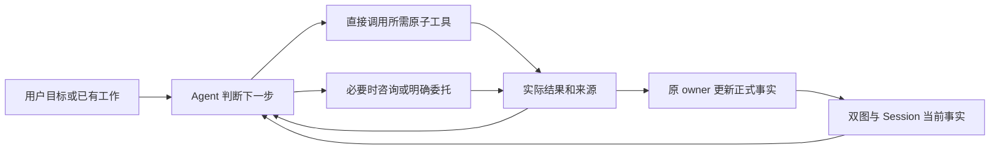
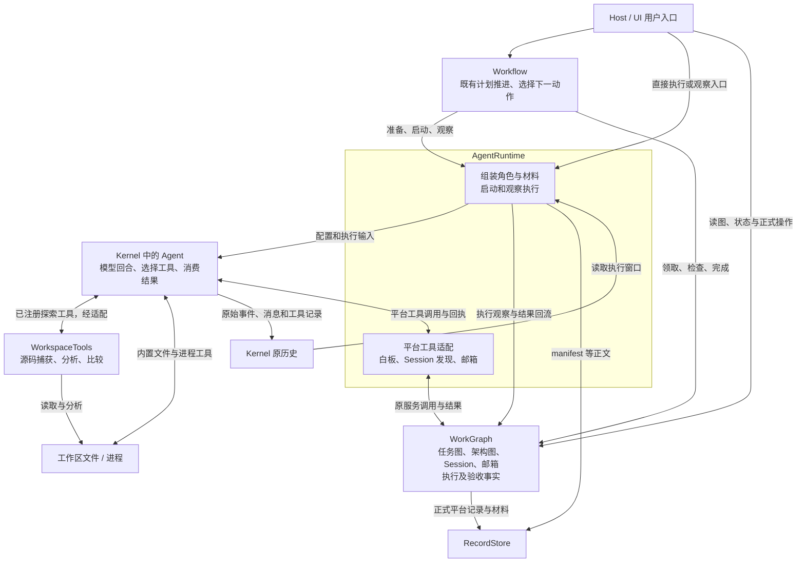
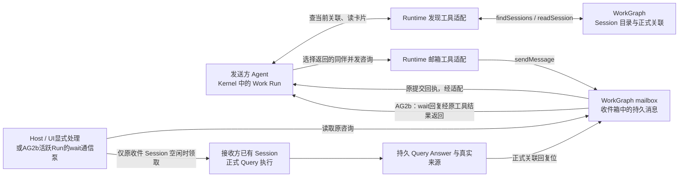
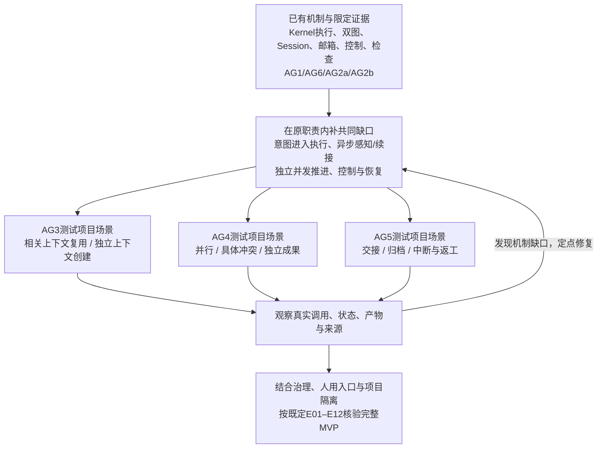

# Agent 职责、行为与执行计划

**2026-09-28 当前落点：共同机制已导入并通过本轮统一验收。** 100 个候选文件精确导入，后续必要修正后共 102 个代码/测试/资源/生成物路径。 DSH 已停止，主审与子代理已完成候选修正、独立复核和导入；不再等待候选导入。实现复用原 owner、Runtime 与 Kernel，包括隔离 A′、真实 yield 后同 Task/Session 新 Run 接续、Work 控制、同 Goal 独立 Task 推进、显式机械通知及生命周期入口。没有默认启动四个 Agent，也没有按 AG 场景划分的专用生产流程。

**本轮限定验收通过。** 相关 15 文件/134 项检查中 3 项旧 AG2 fixture 迁移后通过，导入后 driver 与目录参数修正的必要复验、类型和构建通过。最终浏览器启动的 DeepSeek 链为 14 次请求、两次真实让出/回复/原 Session 新 Run 接续、实际改文件、Work 与 Goal gate 两次正式检查 PASS，Goal COMPLETED；网络、provider、工具错误均为 0。刷新和原历史展开未新增模型请求，临时 Host 已关闭；此前失败保留并记录根因。详见[统一验收记录](reviews/evidence/orchestration-2026-09-28/README.md)。通用决定提交、原生 compact、Query 公开控制及整个 MVP 未宣告完成。

用户已认可[单张共同协作图](ORCHESTRATION-STATE-MACHINES.md#shared-mechanism-review)。职责仍是按需组合的行为，AG1–AG5 是验收场景，不是专用生产流程。当前范围以既有产品决定为准；历史 AG2a 原 Session 咨询与 AG2b 原 Run 等待证据不替代本轮 A′/yield 证据。

依据：[PRODUCT](../PRODUCT.md)、[MVP 用户行为](../MVP-BEHAVIOR.md)、[HANDOFF](HANDOFF.md)、[能力索引](IMPLEMENTED-CAPABILITIES.md)。下文早期批次的实现与验收描述保留当时范围，当前状态以本页顶部及共同机制验收为准。

## 1. 职责是可组合行为，不是固定常驻角色链

具体触发、判断、动作、双图关系与停止条件见[通用行为与按需分工](AGENT-ROLE-ACTIONS.md)。该表同时区分已接工具、已有正式服务和仍缺的 Agent 消费者，不因写成行为定义就视为已经交付。

**2026-09-28 用户六条批注纠偏：保留秘书、参谋、书记三个人用视角，不把它们抹平成同一种职责。** 三者可以组合或按需实例化；不要求先启动三/四/六个 Agent，也不形成固定权限链。执行者直接做授权内的工作，参与者默认用邮箱和双图直接沟通；上下文承载不了时再临时委托局部小参谋。

| 职责 | 触发与输入 | 应做的判断和动作 | 产出及结束条件 |
| --- | --- | --- | --- |
| 秘书 | 用户交流、项目理解与掌控需要 | 掌握目标/进展/待决，定位事实，形成可视化、文档与提示词；必要时路由咨询 | 可理解的说明、内容和具体问题；保存依实际工具，不为普通事实查询启动额外 Agent |
| 参谋/规划 | 技术选择、实践调查、方案或执行方向需要判断 | 调查技术方案与 tradeoffs，辅助决策，履行总监工职责；接收设计反馈并提出修订 | 有来源的建议、候选、重审条件；无新信息不循环讨论，不把建议写成采用事实 |
| 临时协调/局部参谋 | 参与者上下文不足以处理局部协调 | 帮助分工、等待、交接；默认仍由参与者通过双图和邮箱直接沟通 | 有范围的协调结果；设计问题反馈参谋、架构决策者或人，不建常驻转发链 |
| 执行者 | 明确工作与材料入口 | 按需读资料、调用原子工具、修改与检查；局部细节自主处理，设计问题反馈 | 真实产物、来源与未决项；Run 结束不自行等于 Task 完成 |
| 审查者 | 按任务提出的审查请求或既定义务 | 核查复杂度、架构符合性、实际完成与计划符合性，按委托选择范围 | 带依据的问题或结论；未接正式 Review consumer 时不声称已登记验收结果 |
| 书记 | 事实核查、历史/设计文档和流程维护需要 | 核查并管理来源、历史与设计文档，整理派发、审查和对话背景 | 文档、流程支持、决定与未决项；实际写入沿已有工具，不另存图真相 |

是否换执行主体看具体上下文、独立判断与工作安排，不仅看职责名称或任务可拆。一个模块可关联多个参与者，一个 Agent 可关联相关模块；每个工作包仍有可定位的交付责任。已有 Agent 能完成时直接协作，不为经过所有职责而新增交接。

2026-09-28：AG6 已按两阶段工作法导入生产配置与五份提示词资源。`grant.skills = { bundle: 'platform', behaviors: ['secretary', 'adviser', 'scribe', 'reviewer'] }` 按需选择行为，默认共同指令为 `platform-work`；数组展示可选项，不要求全部启用，不启动额外 Agent 或扩大工具授权。旧 `resourceRoot + enabledIds` 配置保持可用。

已通过 19 项检查、types、build 和模块边界检查；提示词修正后的 8 项检查与资产摘要复验通过，见[本批证据](reviews/evidence/agent-behavior-2026-09-28/ag6/README.md)。真实 DeepSeek 两轮、每轮 4 次调用均机械完成，但语义抽查仍出现无来源连线、过强的消费者结论，以及不必要的授权/检查建议。**这只证明配置装配和真实调用已接通，不证明语义可靠，也不证明正式 Reviewer 结果消费者完成。** AG6 本身不完成咨询、派发和恢复消费者；AG2a 的后续交付见第 4 节，其余缺口不因 Skill 装配或模型返回正文转为已交付。

用户使用**一个通用工作台，按项目与成员查看 Agent、切换 Session 和历史**；秘书、参谋、书记是职责视角，不是三套人用 UI 入口。

规模、复杂度与 1–2 万行/500K 的自适应讨论见[架构文档](ARCHITECTURE.md)，属于未来方向，不是本轮硬阈值。

## 2. 什么由图记录，什么由 Agent 决定

| 对象 | 承担的事实/操作 | 不承担的判断 |
| --- | --- | --- |
| 架构树及架构关系 | 模块包含、职责、路径/版本、当前与历史工作关联；依赖关系另行表达 | 包含树不等于依赖 DAG；图不自动决定创建、拆分或销毁 Agent |
| Task 树及任务关系 | 工作意图、拆分、分工、状态、材料/证据和历史入口；未来节点可以没有验收或分配 | 节点存在不等于可执行或已完成；预期依赖不强制等待前驱全部完成 |
| Session | 延续相关上下文、承载角色/工作关联和当前占用；原历史由 Kernel 保存 | 同一模板不等于同一执行主体；不建立第二份永久 Agent 事实库 |
| Run/Attempt | 一次真实执行、结果、来源、控制观察及历史窗口 | 一次 Run 成功不自动完成 Task；同 Task 返工可有新的 Attempt/Run |
| 原子工具与正式 owner | 读写文件/图/消息，返回具体事实；负责各自权限、版本和提交原子性 | 不预测所有未来语义冲突，不要求普通读取先经全局规划或模型审批 |
| Agent 的 Skill/Prompt | 基于事实判断问谁、如何拆分、是否相关、如何并行、何时停或升级 | 不伪造执行结果，不以解释替代来源，不绕过工具本身的边界 |

已有引用就定向读取；文件内容可直接用 Kernel/现有读取工具，不强迫每次绕图。工具和 Runtime 的实际结果更新正式状态及索引；Agent 可提出语义关系或计划修订，沿已有采用规则生效。图是工作环境，不是每次工具调用的额外审批层。

架构节点由调查得到的职责、接口与独立变更边界支持。一个叶节点可以覆盖多个文件或文件内代码片段；当继续拆分不能提供有用的责任、检索或协作边界时停止。代码增长触发重新观察，不直接触发拆节点或创建 Agent；这类语义决定由 Agent 提出、沿正式图操作落地。

图中是目标行为，不表示咨询回复、自动委托或所有状态更新已接通。没有新增判断或执行职责的纯转发层，不因出现在调用链中就必须保留；是否删除以接通后的真实消费者为据。

## 2.1 与当前模块的交互

以下是 **AG1 导入后的运行时交互概览**，不是新的模块划分，也不是静态 import 图。箭头表示调用、结果或事实流向；这里的 Agent 是 Kernel 中实际运行的模型回合和工具循环。Role/Skill 在 Runtime 准备时装入上下文，不是独立的常驻进程。

通用行为使用这些路径的对应关系见[行为表第 5 节](AGENT-ROLE-ACTIONS.md#5-与两张运行路径图的对应)；对架构图与 Task 图的读写边界见[第 2 节](AGENT-ROLE-ACTIONS.md#2-通用行为与双图的对应)。

读图要点：

- **Agent 决定下一步调用什么；工具及正式服务执行操作并返回事实。** 上图中的平台工具适配是 AgentRuntime 内部接线，不是另一个决策 Agent。
- **Workflow 不是每次工具调用的必经路径。** 它已有按计划推进的消费者；Host 也可直接调用正式入口。当前 Workflow 的 Session 选择仍主要由代码完成，Agent 明确选择复用/创建并驱动派发的完整消费者还待 AG3。
- **普通文件读取不必先经过任务图或架构图。** Kernel 内置工具可以直接读写；源码探索工具复用 WorkspaceTools。读取结果可供 Agent 判断，但不会因读了文件或模型说“完成”就自动改图。图及完成状态要经对应正式操作更新。
- WorkGraph 框中列出的是已有事实职责，**不表示这些能力均已完整暴露为 Agent 工具**。当前白板、Session发现和邮箱工具已有接线；自动维护架构分支、派生与完整生命周期仍按后续批次核验。
- RecordStore 保存平台正式事实及正文；Kernel 保存原始执行历史。Runtime读取后者、将可核对的执行事实回流前者，不另存一份可独立修改的 Task/Session 权威状态。

## 2.2 当前已跑通的咨询路径，以及缺的下一段

下图包含 AG1/AG2a 及 AG2b：普通消息由 Host/UI 显式处理；原活跃 Work Run 的 wait 消息由 Host 通信泵处理，回复成为原工具结果。通用异步唤醒与中断后恢复仍未接通。下图只展开上一图的平台工具一支，没有增加模块。

咨询可以服务于查询、规划、执行或审查等行为，不是一个必须新增的常驻角色；发送与接收对应[通用动作明细](AGENT-ROLE-ACTIONS.md#4-各项通用行为的动作明细)。

**已经发生：** 真实 DeepSeek 从目录结果选择 idle 同伴，查看卡片，再把咨询写入该同伴的收件箱。接收方仍处于 idle；后续读取消息和卡片没有新增模型调用。忙碌同伴也可收异步消息，但发送不会抢占或并发启动它。

**AG2a 已实现：** 显式 Host/UI 处理原咨询，在原收件 idle Session 执行只读 Query，并把正式 Answer 挂回消息；Query 不需要开放邮箱写工具。最终 12 文件 / 115 项、Node/UI types、边界与隔离 build 已通过，限定真实模型与实际浏览器路径已通过（首条两次工具参数错误后恢复，不是零错误声明），见[AG2 证据](reviews/evidence/agent-behavior-2026-09-28/ag2/README.md)。自动触发、原发信 Agent 感知/恢复/再决策及自主派发仍未由本批完成。

源码定位：[平台装配](../../src/composition/create-platform.ts)、[Workflow](../../src/business/workflow/workflow.ts)、[Runtime 工具装配](../../src/core/agent-runtime/execution-driver.ts)、[Kernel 调用及工具注册](../../src/core/agent-runtime/observed-model-run.ts)、[发现工具](../../src/core/agent-runtime/session-discovery-tools.ts)、[邮箱工具](../../src/core/agent-runtime/communication-tools.ts)。AG1 实际证据见[真实模型结果](reviews/evidence/agent-behavior-2026-09-27/ag1/live-result.json)；静态模块依赖另见[模块现状图](reviews/current-module-map-2026-09-27.md#2-五模块的实际静态依赖)。

## 3. 创建、复用、派生与停止条件

### 冷启动与编排策略边界（2026-09-28）

现有 MVP B01/B02/B04 描述了空项目登记、按需调查和真实执行，但“秘书/参谋/书记何时分别成为会话、是否另建执行者”此前没有完整冻结为冷启动策略。当前 Host 不自动建四个 Agent 是代码事实，不代表已决定冷启动的成员数量。

本轮最小交付是可按受信配置选择行为并真实运行。**用户已确认只有一个统一工作台/通用交互面**，沿项目与成员导航逐个查看 Agent、切换 Session 和历史；不是给秘书、参谋、书记各造一套独立 UI 入口。三种职责都能与人交流，不等于三个入口。独立长期上下文需要时可分成成员 Session，实施时另找或创建执行者；成员数量与同时运行的模型数量也不同，不把四个同时运行设为初始化前提。遵守 [UI-WORKBENCH](../UI-WORKBENCH.md)。

| 时机 | 编排负责的选择 | 生命周期/Runtime 负责的实际动作 |
| --- | --- | --- |
| 启动应用/登记项目 | 提供可选职责与配置；尚无用户工作时无需模型运行 | Host 加载受信配置与已有状态，不虚构活跃 Agent |
| 用户开始交流或调查 | 选择相关现有 Session 或按当前需要新建，装配相应行为与有效工具 | 原 Session/Query/Runtime 入口真正创建、占用、执行并返回来源 |
| 需要实施工作 | 按工作范围、相关性、占用及独立上下文需要选择复用/新增执行者 | 原关联、claim、prepare/start/observe 与结果 owner 执行动作 |
| 模块/上下文负担发展 | 判断直接协作、局部协调、分工、压缩或交接；重大设计反馈用户 | 已支持的控制/生命周期服务执行；未支持的动作如实保留缺口 |

生命周期层不是只保留 `execute`：身份、创建、占用、停止事实、历史、归档/重新启用等仍各归原 owner；**何时与为何使用这些动作属于编排策略**。后续 Agent 迭代不会因为模块变多而自然自动发生，仍需实际触发、判断及消费者。AG6 只落实行为配置与装配，AG2–AG5 的咨询、派发及生命周期缺口继续保留。

| 行为 | 何时选择 | 保留的边界 |
| --- | --- | --- |
| 创建 | 无适合的现有 Session，或独立调查/审查、工作不兼容需要独立上下文 | 采用现有角色与能力装配，关联目标/模块；不凭“新 Task”自动创建 |
| 复用 | 双图和当前材料表明工作相关，角色、范围、健康及占用允许 | 默认延续相关工作，补差异与材料引用；无关工作不默认带整段历史 |
| 派生/拆分 | 子问题独立且当前上下文难以承载，或需要独立意见/交接；先考虑已有合适 Agent | 写清工作边界、责任和来源；可拆任务不强制新增主体，不按行数/目录或六项职能自动派生 |
| 并行 | 存在可独立推进的实际工作，Agent 根据工具事实决定安排 | 独立执行用独立 Session；同 Workspace 可并行，不先证明所有潜在冲突不存在 |
| 暂停/取消 | 用户或已授权策略要求，或受影响工作需切换 | 请求与真实停止分开；未确认停止不能移交相交写入；已有文件事实保留 |
| 结束本次工作 | 实际执行终止并上报结果 | 通常回到 standby，仍可发现/咨询；Task/Goal 完成由已有正式验收路径判定 |
| 停止重复推进 | 同问题、依据和失败没有新信息，或结果/副作用未知 | 保留未决项；等条件、调查或核对原事实，不循环重跑、不猜完成 |
| 压缩/重组 | 容量/噪声优先用 Kernel 能力；目标变化、历史失效或上下文失控才重组 | 能力 unsupported 如实显示；普通消息不重新全量装配，不运行中热换角色 |
| 归档/恢复/交接 | 显式归档；相关工作需要恢复；职责需要换手 | 归档保留历史，读历史不唤醒；恢复核对真实能力；接任者取得义务、决定、成果及未决项 |

咨询先区分事实与语义：进度和负责人直接查；目标只读问询按最新主图派生A′，不占用原A回答或替A承诺。原A承诺与行动调整通过异步消息及适用控制进入原上下文；paused不因来信恢复，archived不自动解除归档。当前AG2a的原idle Session查询保留为已实现路径，不冒充派生。没有合适对象时可调查事实或授权创建，不能因此宣告整条路径失败。

## 4. 共同机制与行为场景验收

**2026-09-28 用户纠偏：发现、咨询、复用、派生、并行、交接和恢复，应由同一组状态机、工作流、通信与异步执行能力组合产生。AG1–AG5 是行为验收分组，不是按场景各写一条生产流水线。** 先前按行为命名施工批次的表达撤回；AG1/AG2 已有记录保留其交付范围。用户已认可[编排状态机 §0](ORCHESTRATION-STATE-MACHINES.md#shared-mechanism-review)的单张主图；角色/全局判断与状态表统一补在该文档，不再要求重复审图或分建场景流程。

生产负责共同能力，Agent/配置提供语义选择，测试项目提供验证条件：

| 层次 | 应放置的内容 |
| --- | --- |
| 既有 owner 与 Runtime/Host 机制 | 接受明确工作/Session意图，执行与占用，独立运行的推进，消息送达与回复关联，等待/让出/继续，控制与结果回流；恢复沿原事实核对 |
| Agent / Skill / 已授权策略 | 是否复用上下文、是否拆分/并行、找谁沟通、冲突后如何调整、何时交接或请人决策；规则可作明确配置的默认值，但不冒充语义判断 |
| 隔离测试项目 | 设置相关/独立任务、忙碌成员、具体冲突、中断与返工；观察同一套生产入口的实际行为，不预写答案或绕过正式操作 |

“共同机制”沿现有 Goal/Task/Session/Run/mailbox/控制各自状态组合，不另造全局巨型状态机、通用事件总线、第二份调度数据库或中心 Supervisor。普通文件和工具操作继续走自身边界，不因完善编排而逐次增加平台审批。

施工顺序：画共同状态机与流程 → 用户审阅意图和可验收行为 → 将通过的转移对账到现有入口 → 冻结最小缺口并在原职责内补齐 → 用相关项目场景验收。若机制已支持某场景，只需验证，不为取得场景编号的“完成”而新增生产文件。新生产实现仍沿两阶段 DSH；本轮停在可审阅图稿，没有启动生产或测试修改。

### AG1：当前关联 Session 的发现 → 选择 → 咨询请求

**范围：** Agent 从一个真实 Task/Module 引用查询现有正式关联，读候选状态与角色，按相关性选择对象，发送带问题及来源引用的咨询请求。复用现有 Session 发现与 mailbox；不新增 AgentDirectory。

最小验收：

1. 准备真实正式关联及不同状态的候选；Agent 通过工具获得局部结果，选择当前适合的相关 Session，说明选择依据。
2. 从原记录读回一条对应咨询消息，其目标、问题与 Task/Module/材料引用正确；观察请求与原回执，不人工代写发送结果。
3. 归档候选不冒充当前可咨询对象；没有合适对象时如实返回缺口，不伪造目标或答案。普通发现查询不额外调用模型。

**严格限界：send ≠ 答复 ≠ 唤醒 ≠ 执行。** 本批只验发现、选择、请求落点，不承诺收件 Agent 已被启动、已经回答或完成委托。本轮限定AG1路径已形成下述接线与真实模型证据；其它协作行为仍按后续批次核验。

**本批接线已交付（2026-09-27）：** 两个发现工具、原 mailbox 消费与秘书 Skill 已两阶段独审导入；[6文件/42项、类型和边界证据](reviews/evidence/agent-behavior-2026-09-27/ag1/verification.json)。有效工具仍由 Host/Role 共同授予。另有[真实DeepSeek验收](reviews/evidence/agent-behavior-2026-09-27/ag1/live-result.json)：4次provider、3次成功工具调用，模型从候选选择idle同伴并发送真实咨询，接收者仍待命；后续读取不增加模型调用。只证明这个限定场景，不是一般模型决策能力评估。

### AG2：咨询回复与明确委托

**AG2a 已实现、导入并通过限定真实模型/浏览器验收：** 显式处理一条已有咨询，绑定其接收方已有 idle Session，通过正式 Query 执行取得 Answer，再把 Answer 及真实执行来源关联到原消息回复位。复用已有记录、Query 模型循环和 Session 占用，不伪造 coding Task，不给 Query 通用文件/图/邮箱写权限，不冒用 Host/Work Run 答复身份。

最小验收：原消息→接收 Session→QueryRun→持久 Answer→原消息回复可追溯；真实接收 Agent 按需读取来源，答复区分事实、推断与未知。busy 时等待，不抢占、不另起随机 Session；重放原请求不重复启动，Answer 已提交而关联未确认时检查原结果并补关联，不重跑模型。普通状态查询不启动咨询。

**AG2a 批次不做自动阈值/心跳调度、Work 自动继续或通用委托执行；原 Run 内持续通信见 §8.1 AG2b。** 显式唤醒处理一次咨询不等于持续后台调度；请求入箱、接收方开始、Answer 提交、原消息已回复分别表达。后续委托仍需明确工作与权限，不能由一条回复推导任务完成。

当前通过 `claimQuery` 指定原收件 idle Session，复用正式 Query Answer 关联回复；不把 Query 开放邮箱工具作为前提。独审三项修复已收口，最终 12 文件 / 115 项、Node/UI types、边界及隔离 build 通过，[证据](reviews/evidence/agent-behavior-2026-09-28/ag2/README.md)按真实范围记录。AG2a 当时尚未接通原发信 Agent 感知回复与再决策；后续 AG2b 已限定接通存活 Host 内原 Run 的回复工具结果与继续执行（见 §8.1），明确委托及中断后的恢复仍不能由回复关联推导完成。

### AG3 验收场景：复用或创建 → 执行 → 结果回流

测试项目提供相关的后续工作与需要独立上下文的工作。Agent 根据实际材料与候选选择复用或创建；共同执行入口接受该选择、交付工作并回流结果。不新增“AG3执行器”，不按测试顺序硬选Session，也不要求固定的协调角色。

验收观察：相关 Work 实际消费原 Session 必要历史；独立工作使用选定的独立上下文；真实产物和检查可追溯到 Task/Run/Session；无验收的未来节点继续存在。已有两 Work 连续链只覆盖其中一条路径，不证明 Agent 选择已被共同入口消费。

### AG4 验收场景：并行与具体冲突反馈

测试项目提供可并行的工作，以及一个具体共享改动冲突。Agent 选择分工，共同执行机制允许多个独立运行持续推进，具体工具返回冲突与来源，再由 Agent 判断调整、等待或升级。生产不固定“两名Agent”“两个任务”或某类演示冲突，不新增并行场景专用workflow。

验收观察：实际 Kernel 执行时间重叠，独立成果保留，具体冲突与调整可追溯；不把未知影响当无影响，也不增加全工作区单 writer。当前原语允许并发不等于所有推进入口已支持并发。

### AG5 验收场景：结束、交接、归档与恢复

测试项目在共同机制的真实执行中触发结束、交接、显式归档/恢复、暂停/继续、中断和同 Task 失败返工。交接材料由 Agent依据原事实准备；生命周期/控制/执行 owner 执行相应动作，不写一条必经的“结束→交接→归档→恢复”流水线。

验收观察：待命成员仍可发现，归档历史可读且读取不唤醒；接任者能定位义务、决定、成果与未决项；未知结果先核对，已发生结果可补账，同 Task 可有新 Attempt。不能新建随机Session掩盖恢复失败。这些是既定 MVP 的必要场景，仍需真实覆盖，重分类不等于已经实现或移出范围。

### 4.1 当前共同机制与具体限制

2026-09-28 共同机制已导入并通过[统一验收](reviews/evidence/orchestration-2026-09-28/README.md)：

- [Workflow](../../src/business/workflow/workflow.ts) 接受显式Task与Session选择；没有明确选择时仍有 required优先/Plan顺序和兼容Session的默认规则。回复续接先定位持久等待的原Session，不用默认选择替换它。这些机械规则不等于Agent已完成所有语义分工行为验收。
- [Host driver](../../src/app/collaboration-driver.ts) 同Goal按Task持有独立推进句柄，共用原owner的Session互斥；两Task真实Kernel重叠、独立写入与检查已验证。Goal级继续会在完成当前Work后继续正式Goal检查，不把yield误作Work完成。
- 通信已区分只读inquiry、原上下文消息、需要回复和立即等待。A′采用Kernel固定已完成历史；等待真实让出并释放占用，回复通过持久输入在原Session新Run继续。普通消息/旧Run的迟到回复由显式Host inputConsumers消费；暂停、取消或归档不会被消息自动解除。
- Work公开控制已支持pause/resume/steer/cancel；暂停沿原Run/Turn续办，普通start重试不能解暂停。Query没有对应公开控制入口。Host推进句柄仍是内存投影，重开能依据正式事实显式续接，不宣称任意进程崩溃自动恢复。
- 心跳、配置文件增删行量及正式双图变化进入共用输入；无变化无模型，自身通知不自激。关注范围显式配置，自动规模分工、原生压缩、通用决定采用/落实、Reviewer/返工与完整UI仍按既定MVP范围核对，不因共同机制验收而自动标完成。

生产没有A/B身份、咨询次数或示例工程判断。AG1–AG5继续作为同一机制的观察场景；发现失败时修对应事件/转移和owner接缝，不另造场景handler。

## 5. 执行记录与收口方式

各批记录：所用角色/Skill、实际工具调用、图查询及材料范围、Session/Run 引用、请求/回复/产物、停止或选择依据，以及仍未实现的下一步。复用现有验收和 HANDOFF，不再创建平行进度事实库。

AG1/AG2 历史证据分别限定发现、发送与回复范围；AG3–AG5用于观察同一组机制的执行选择、并行与生命周期行为，不要求按编号串行新增消费者。同一个机制修复可以支持多个场景，场景未通过要定位实际缺口。最终范围仍按 [MVP 最小验收矩阵](../MVP-BEHAVIOR.md#5-最小验收矩阵)核对，不把分批收口等同完整 MVP。

## 6. 对齐、注意力与异步感知

参谋的全局概览、触发条件及调查/决定回流统一见[项目判断机制](ORCHESTRATION-STATE-MACHINES.md#project-guidance-loop)；各职责共享的状态与唤醒条件见[状态表](ORCHESTRATION-STATE-MACHINES.md#agent-state-transitions)。下方是同一设计的注意力与异步策略，不表示已有全局变化消费者。

2026-09-28 补充依据：[用户分享对话](https://chatgpt.com/share/6ab95058-2208-83ec-912a-0e1e11c74d0e)。以下将用户方向落实为行为目标；不采用旧讨论中“最后接线即可完成”的估计，不把尚未实现策略写成能力。

**语义可靠性依靠可核来源、明确不确定性和必要的人参与。** 关键技术/设计判断附文件、版本、实际观察或决定来源，解释 tradeoffs；重要分歧回到负责决策者或人。增加校验数量、让模型审模型都不能证明语义正确。Reviewer 是按任务提供独立判断，不是消除模型偏差的通用审批层；既定验收义务仍保留。

注意力从当前工作必要材料开始，可沿任务、架构、文件、历史和相关参与者扩展；不把模块边界硬变成上下文隔离。职责可以组合，不意味着适合由同一 Session 全包。上下文承载不了或需要避免已有方案倾向时使用独立主体；独立审查要具备独立判断条件，不是给实现者换称呼。

### 6.1 异步触发策略目标

2026-09-28 用户纠偏：不要让平台持续做语义分析以识别“关键变化”。主触发采用**心跳机械补查＋文件增删行量＋双图结构/状态变化量**，相关工作Agent和用户可主动提交不受数量阈值限制的反馈。通知后再由参谋判断影响与调查范围；概览是实际判断的产物，不是常驻语义监控。计量口径与边界见[低成本触发说明](ORCHESTRATION-STATE-MACHINES.md#attention-triggers)。

| 触发 | 应感知/处理什么 | 调度边界 |
| --- | --- | --- |
| 文件行数变化 | 自上次实际处理基线以来的新增/删除行量及文件/模块引用；不以净增长代替变化量 | 达到配置的数量/比例阈值再合并通知；不重复累计同一diff，不要求平台先理解修改语义 |
| 双图较大变化 | 节点/边增删改数量、涉及范围和正式状态变化；按版本取得差量 | 以配置的数量/比例/范围判定是否触发；明确订阅的状态事件可直接递送，不把“大”当语义正确性或重要性的证明 |
| Agent反馈/阶段交付 | 相关成员报告的接口/约束影响、结果、决定、失败、未决与来源 | 高影响小改动可直接报告，不等数量阈值；总结的转述不再次自动触发总结，避免消息风暴 |
| 人的请求 | 具体提问、纠偏、对齐或控制意图 | 显式进入相应处理路径；控制请求沿已有控制入口，通知不能代替真实停止 |
| 上级/负责协调者的对齐请求 | 明确委托范围内的偏差、进度、需要决策的问题 | 定向请求与答复；不是每个工具调用都上报审批，不新建强制层级 |
| 心跳补查 | 是否有未处理消息、文件/图差量或等待条件变化，是否达到阈值/合并期限 | 心跳只作机械补查；无变化不唤醒，有待处理变化按上述规则递送，不每次心跳运行参谋模型 |

心跳周期、计量阈值及关注范围按项目配置，当前没有已验收默认值。合并须有**最大等待界限**，已有小幅变化也不能永久低于阈值而不被处理。后续补入材料以**上次实际处理的位置/版本**为界，不能把已送达或已读当已处理；失败、忙碌或未处理时不提前推进该位置。普通事件只传增量与引用，不反复广播全历史，不每次心跳重新解析全仓。低于阈值不证明无影响；相关Agent利用自己的工作上下文主动反馈，参谋触发后再定向核对。用户暂停不因心跳或量变化被解除。

**通知已送达 ≠ 已处理 ≠ 控制已生效。** mailbox 回执只能说明其实际状态；模型回复也不证明进程暂停或写入已停止。当前 Kernel/Runtime 有部分真实控制能力，完整 resume、冷恢复和消费者仍有缺口。上述异步策略须复用现有事实与入口逐步接线，AG2 不建设全量事件调度器。

## 7. 冷启动与再次进入项目

冷启动按必要信息逐步形成工作环境，不以完整双图、完整文档或四个角色均启动为前提。

| 阶段 | 动作与最小结果 |
| --- | --- |
| 1. 接收目标和范围 | 明确用户想做什么、当前项目/工作区与已有授权；真正缺失的取舍才提问 |
| 2. 定位已有材料 | 查现有文档、目录、配置、历史入口；缺文档如实记录，不造一份假完整基线 |
| 3. 有界探索 | 使用实际工具调查必要源码/实践，区分观察、推断和未知，可按工作跨模块扩展 |
| 4. 形成最小工作图 | 记录当前可理解的职责、任务意图与关系；保留未细化未来工作，草案不冒充正式采用 |
| 5. 选择与启动 | 在已有授权内采用所需计划，选择合适 Session 与行为；先跑有明确输入的一段，不预启全部角色 |
| 6. 结果回流与再对齐 | 保存真实结果及来源，更新必要文档/图关联，决定继续、咨询、重审或等待 |

三种进入情形分别处理：**首次接项目**需要目标定位与必要探索；**进程重启**优先恢复原记录、回执、Session/Run 和未知执行结果，不重新规划掩盖未决副作用；**idle 唤醒**只消费相关新请求/变化与必要上下文，不全量冷启动。归档恢复仍需显式操作，不能由读历史或收到消息代替。

## 8. 到达 MVP 的路线与证据导航

下表沿现有 [B01–B10 与 E01–E12](../MVP-BEHAVIOR.md)展开；它是用户行为与证据覆盖表，不是逐场景开发生产流程的顺序，也不是第二套完成状态。具体版本和证据由 [能力索引](IMPLEMENTED-CAPABILITIES.md)、[有界审计及末尾补证](reviews/completion-audit-2026-09-27.md)、[HANDOFF](HANDOFF.md)维护。

| 行为 / 验收关联 | 已有依据 | 明确待补与路线 |
| --- | --- | --- |
| B01 初始化 / E01 | 正式 Project/Workspace/政策初始化、SQLite 重开 | 完整 UI bootstrap 与真实项目入口验收；复用现有 owner |
| B02 调查规划采用 / E01、E08 | 真实 Query→Answer→候选→采用；AG6 装配已验，语义限制保留 | 关键判断来源与人回路；不把结构合法当方案可靠 |
| B03 白板推进 / E02、E08 | future 节点保留、未来计划工具、两 Work 顺序链 | AG2a 已验显式处理及回复关联；AG2b 已验存活 Host 内原 Run 多轮等待回复→工具结果→继续执行；共同机制的显式执行选择及中断恢复仍待补（由AG3/AG5场景验证），长期未细化工作不能被误判完成 |
| B04 执行连续性 / E01、E02、E06 | 两 Work 同 Session 真实改文件、检查和正式完成 | 共同入口消费明确复用/创建选择，由AG3场景验证；不重做 Kernel 循环 |
| B05 并行 / E05 | 不同 Session 占用原语、无全工作区 writer 锁 | 共同机制支持独立并发推进；AG4场景验证真实重叠、具体冲突反馈和独立成果保留 |
| B06 检查返工完成 / E03 | 命令检查、Evidence、Task/Goal 完成限定链 | 同 Task FAIL 后新 Attempt；按已采用义务补 Reviewer 结果消费者，不给所有任务增审查门槛 |
| B07 查询解释导航 / E04、E12 | Task→Run→原 Session→执行窗口；AG1 发现发送；普通读取不增模型调用 | **AG2a 显式咨询处理与 Answer 回复关联已导入，限定真实模型/浏览器路径已验**；随后补历史尝试、结束关联、检查证据等真实导航缺口 |
| B08 控制 / E07 | 本进程 pause/cancel、意图与观察局部证据 | AG2b Host driver 已接正式 cancel 与排空，未确认原因保留；原 Run resume及完整控制/恢复仍待补，与 AG5 对齐，不把 queued 当成功 |
| B09 变更治理换手 / E06、E08、E09 | 未来 Plan 修订、目录修订服务、Session 生命周期原语 | 设计分歧→人/负责者决定→正式版本→受影响上下文；接任消费义务/成果/未决项 |
| B10 中断重启无进展 / E04、E10 | 回执重放、Session 映射重开、原执行观察 | 启动前续办、未知核对、终态补账、预算/待办恢复；同失败无新依据停止，不能重复副作用 |
| 跨行为项目隔离与整体入口 / E11、E12 | 局部作用域保护、双图与历史入口 | 多项目切换、越界拒绝、重启后相关新工作与统一 UI；最终按本项目和外部维护项目真实任务合验 |

图示区分生产机制与测试场景：场景之间没有产品必经顺序，不为通过不同场景复制状态或编排逻辑。E01–E04 通过只报告首条 E2E，完整 MVP 仍保留 E05–E12 及本项目、一个外部维护项目的真实任务门槛。候选真实工作区未经明确要求不写入；在验收时选定范围。不得因历史任务书存在判阻塞，也不得把既定必需项因尚未实现自动移到未来。

MVP 必需的是明确请求能被处理、已报告的关键变更能传达、相关上下文能够恢复；AG2a 回信落盘不证明原发信 Agent 已继续工作。§6 的文件/双图变化量阈值、心跳补查及具体合并参数仍是待落实的策略，不因列出多种信号就新增多套独立门禁，也不要求为本批建设完整事件调度器。

### 8.1 限定已验：AG2b 原 Run 持续通信

2026-09-28，用户明确要求通信成为可持续的状态机，接通工作台并完成隔离工程 E2E。本批契约见 [AG2b 任务书](tasks/AG2b-continuous-communication-2026-09-28.md)。生产接线已导入，隔离工程真实 DeepSeek 验收通过：[本批证据](reviews/evidence/agent-behavior-2026-09-28/ag2b/README.md)。成功轮次共13次模型调用，两轮真实回复均进入原 A Run 的后续模型请求，B 复用原收件 Session；实际文件编辑后Work/gate 两个正式检查轮次 PASS，Goal 正式 COMPLETED。成功轮次 transport/provider/tool errors 均为0；此前连接失败及启动环境失败另保留，不将成功轮次外推为一般语义可靠性。

最小运行单元是原 Work Run：Agent 明确发送并等待，同伴通过原咨询入口回答，回复进入原 Kernel 工具结果，原 Agent 继续判断与行动；可再次咨询。Host 持有推进句柄并并行处理咨询，页面只读状态，避免浏览器承担续接。普通通知不自动变成咨询，忙碌/归档者不被抢占或替换。人要求停止走已有控制与真实运行观察。

本批不新建中心 Supervisor、第二份 Task 状态或回复消费数据库。原消息及 Query Answer 保存通信事实，原 Kernel 历史保存回复工具结果及后续行为，正式 checks/Evidence 决定完成。存活进程内持续往返与崩溃后恢复是不同能力；后者仍按 B10/E10 的明确缺口处理，不把重开只读原结果等同自动恢复执行。
