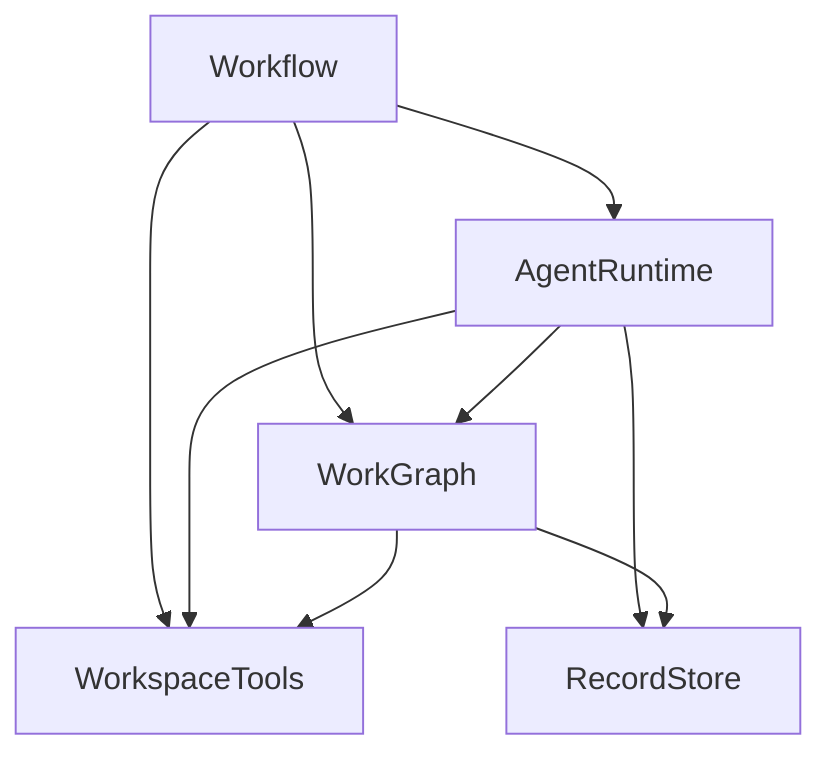
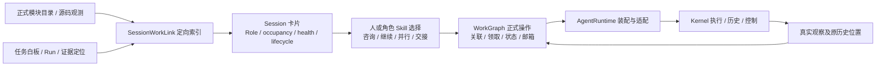

# Agent Platform：数据结构、原子能力与业务编排

```yaml
status: target-design
updated: 2026-09-24
basis: 用户要求先确定数据结构与行为，再设计编排状态机，最后推导模块与重构方案
implementation: 在 coding-platform/next 独立目标工程分批实现；原 src 作为只读参考
```

本稿是本轮重构的当前目标架构。共同产品依据为[当前PRODUCT](../PRODUCT.md)，修改时同时核对[原始对话](intent/ORIGINAL-DIALOGUE.md)、[2026-09-24 独立目标工程纠偏](intent/2026-09-24-TARGET-PROJECT.md)与相关模块。当前实现目录是 `coding-platform/next`，五模块目录已存在；Workspace、Goal 和材料/存储是已迁入子集，AgentRuntime 已补迁模型工具循环与 Work/Review/Query 来源绑定，正式 Runtime/Workflow 入口仍明确拒绝未实现操作，UI 未迁入。最新独立验收见[干净迁移记录](reviews/next-completed-migration-2026-09-24.md)。

原 `coding-platform/src` 的 R3a/R3b 与 Kernel R4a 验收保留为旧工程历史与可复用证据，不代表新平台已支持连续 Session、范围并行或完整业务。旧源码归属仍由原 `scripts/module-map.mjs` 描述；新工程由 `next/scripts/check-boundaries.mjs` 检查。目标五模块八条允许依赖保持不变，不能把目录或边界检查通过当成功能完成。此前 13 Module／38 边[原稿已保留](archive/2026-09-23-before-core-design/ARCHITECTURE.md)。

无对话记忆的接手者先读[HANDOFF](HANDOFF.md)。用户原话、草图与工程解释分开保存在[意图层](intent/INTENT-AND-DECISIONS.md)；关键文件、完整主要接口与内部逻辑见[详细骨架](skeleton/README.md)，Host/UI贯通见[END-TO-END](skeleton/END-TO-END.md)。本稿负责总体边界，不能替代模块文件级施工说明。当前已实装原子能力、源码符号、装配状态和复用前提统一查 [IMPLEMENTED-CAPABILITIES](IMPLEMENTED-CAPABILITIES.md)；后续先核已有实现，再冻结真实缺口，不能把尚未接线误称架构空白。

**静态技术图解：** [核心数据结构、原子操作与编排状态机](CORE-STRUCTURES-AND-ORCHESTRATION.md)。从记录表、事件、幂等、唯一占用、正反邻接和查询索引展开，逐项说明原子操作的读写范围，并画出业务、Task、Session、Run/控制、恢复和检查返工的状态机；适合先审阅底层数据管理设计。

## 1. 设计顺序与文档责任

| 顺序 | 正文 | 负责什么 |
| --- | --- | --- |
| 1 | [核心数据与原子操作](CORE-DATA-OPERATIONS.md) | 对象、结构、字段、读写／比较／生成操作、约束、失败与增量同步 |
| 2 | [编排状态机](ORCHESTRATION-STATE-MACHINES.md) | 意图、状态、转移、执行副作用、结果、重试与恢复 |
| 3 | 本稿与[模块文档](modules/README.md) | 根据职责与变化边界组织实现，不按旧目录反推业务 |
| 4 | [模块 DAG](module-dag.md)与[实施方案](IMPLEMENTATION-PLAN.md) | 旧实现复用、迁移、重写、删除、消费者切换与验收 |
| 5 | [共同契约](skeleton/CONTRACTS.md)、五篇模块骨架、[贯通流程](skeleton/END-TO-END.md) | 精确身份/输入/结果、内部文件、算法、事务、恢复、真实装配与UI接线 |

当前产品意图与已采用结论见 [INTENT-AND-DECISIONS](intent/INTENT-AND-DECISIONS.md)及本轮明确指令；[历史 PRODUCT 原稿](../history/before-2026-09-22/PRODUCT.md)和[2026-09-21 历史澄清](../history/before-2026-09-22/agent-platform-open-decisions-recommendations.md)用于追溯，不能把旧模块方案重新作为当前决定。共同质量要求见 [CODE-QUALITY-GUIDELINES](CODE-QUALITY-GUIDELINES.md)。数据基础、环、共享与工具职责已经在上述两份设计里确定，不推给实施者再次猜测。

## 2. 数据结构及其操作是核心

基础数据按“工作会话／文件产物 × 当前／历史”组织。Kernel 保存 Session 原日志、检查点和实际恢复；Git 保存已提交文件历史；平台保存自身拥有的任务、架构、责任、消息及必要映射。未提交但需跨恢复保存的修改使用必要补丁／内容快照。

| 结构 | 正式内容 | 专用索引和操作 |
| --- | --- | --- |
| 架构与观测源码关系 | 采用的模块职责、接口、依赖、来源、版本；实际源码关系单独记录 | 正反邻接、模块到文件／Session 关联、邻域、影响分析、差分 |
| 任务与执行关系 | 协作白板：目标、计划意图、分组/协作/预期依赖、明确产物消费条件、状态与历史 | 关系与 Session/证据检索、候选提示、明确输入条件查询、责任记录和状态推进 |
| Session 与工作关联 | Kernel 映射、角色配置、承担范围、归档、延续和重组来源 | 活跃集合、按任务／模块检索、可调用性和占用 |
| 协作与邮箱 | 消息、收件对象、来源、处理状态和任务关联 | 邮箱、待处理索引、协作关系；通信不成为阻塞依赖 |
| 产物、证据和历史 | 正文引用、结果、来源版本、明确决定及理由、修正／替代 | 历史查找、引用解析、摘要／全文索引、去重和适用性 |
| 文件与代码 | 工作区、Git 引用、必要快照、解析覆盖与内容版本 | 文件树、AST／语言分析、文本／符号索引、局部更新 |

八类结构的完整定义及角色／有限记忆能力见[核心数据设计](CORE-DATA-OPERATIONS.md)。不同结构可分别持久化、使用不同算法；正式结构和关联不能全部视为可丢弃投影。共享对象标识与来源引用，不强制一张图或一个数据库。共同原子操作负责同步相关结构，业务不用逐表维护。

## 3. 业务与核心的分界

**业务选择明确意图；核心执行意图，维护数据约束并返回可核对结果。** 核心可以理解 Task、Session、Run 和 Module；不是允许任意改正式字段的裸 CRUD。

| 业务选择 | 核心操作 |
| --- | --- |
| 查什么、为哪个目标需要哪些材料 | 邻域／历史查询、版本定位、去重、来源关联、有界返回 |
| 怎样规划、是否改范围与架构 | 候选保存、按版本应用关系与计划变更、同步必要索引 |
| 继续谁、何时并行／压缩／重组／归档 | 领取和占用、创建／打开／继续 Session、Kernel 控制及结果记录 |
| 验收要求、独立审阅和返工策略 | 检查执行、精确证据读取、按已采用要求汇合并提交完成 |
| 找谁协作、沟通什么 | 消息持久化、路由、去重、领取／确认及状态查询 |

任务图是 monitor、协作白板和历史索引，保存编排意图与结果；不把每条关系变成调度禁令，也不负责证明未来并行一定正确。编排 Agent 结合规范、架构和当前事实决定行动，工具结果反馈后再核对与修正。明确的产物消费条件按实际所需输入检查，不能用前驱整个 Task 的完成状态替代；机械一致性与未知语义风险分别返回。

策略可以由规则、Skill、Agent 或人提供，不要求每次操作都经过常驻主模型。秘书、参谋、书记是业务角色，不固定成三个常驻 Session，也不充当所有成员通信的中转站。普通消息、文件读取与查询不触发完整生命周期和全量上下文编译。

生命周期组织图、历史、角色、Skill 和记忆的使用；这些能力仍可独立查询。完整长期领域专家与知识积累保留扩展位置，本轮不把接口预留写成已有功能。

## 4. 状态、时间与环

- 状态类型允许反馈：实现 → 检查 → 返工 → 检查。策略每次可以只返回下一步意图。
- 实际执行按不同 Run／Attempt／事件追加；因果边向后，并行事件不强行串成执行依赖。
- 明确采用的硬产物消费前置保持 DAG；协作、预期关系不由此变成硬前置。返工增加执行记录，原 Task 可保留。
- 目标模块依赖保持 DAG；实际源码采集如实保留环并报告，不能为满足展示形状删边。
- Agent 通信可以往返；通信关系、任务依赖、模块依赖和事件因果分别表达。
- 架构图有当前与历史；任务图有计划、当前与历史。时间增加不自动证明业务有进展。

采用 Goal／Plan、Task、Run、Session、检查轮次和邮箱的组合状态，不建设全局大状态机。状态更新、Kernel 副作用及失败恢复的顺序由[状态机文档](ORCHESTRATION-STATE-MACHINES.md)给出。

## 5. 从职责推导的目标模块

| Module | 独立理由 | 目标目录 | 内部职责与边界 |
| --- | --- | --- | --- |
| Workflow | 产品流程与决策策略的变化独立于数据算法和 Kernel | `src/business/workflow/` | 人机流程、规划、Session 选择、输入需求、检查／返工业务；不直接写表或重建索引 |
| WorkGraph | 相关工作结构、共同变更与查询需要清楚归属 | `src/core/work-graph/` | 任务、架构、Session 映射、通信、证据、材料各有内部组件；不调用模型或 Kernel |
| AgentRuntime | 隔离 Kernel 与外部执行副作用，统一执行驱动 | `src/core/agent-runtime/` | 意图消费、Kernel 适配、运行配置、控制和结果回流；不选择业务方案或另写正式状态 |
| WorkspaceTools | 文件／Git／解析器和读取一致性有独立 I/O 与技术变化 | `src/core/workspace/` | 文件、快照、路径、文本、AST／符号、源码图；普通查询不要求先有 Run／baseline |
| RecordStore | 隔离事务、正文与索引的物理持久实现 | `src/core/record-store/` | SQLite 提交、不可变正文、事件页、索引存取；不决定业务策略、不复制 Kernel 日志 |

五个模块是本次推导结果，不是先验优化指标。WorkGraph 内部按结构分责，不堆成一个大类；RecordStore 可继续使用原数据库／表，不为合并模块强行合库。数据结构数量也不等于顶层模块数量。

Host／UI、Contracts、fixtures／testing 是支撑面。Host 装配并驱动流程；核心不反调 Workflow 策略。核心返回意图受理或执行结果，业务调用方选择后续动作。

## 6. 允许依赖



箭头＝调用者长期依赖提供者，包括端口注入；不是数据流或开发顺序。8 条边逐项依据见 [module-dag](module-dag.md)，机器可读声明见 [module-target.json](module-target.json)。当前实际 `module-map.mjs` 描述迁移中的真实布局，每批迁移同步归属和检查，不提前把目标当实现。

### 6.1 并行协作与资源归属

多 Agent 必须支持同一工作区并行。Workflow/编排 Agent 根据规范、架构与任务白板选择并行和顺序；WorkGraph 保存意图、责任、关系及结果，并提供定向查询。领取维护 Task/Session 身份及持久状态的一致性，不认证未来执行无冲突，也不以预测全部文件范围为前置。WorkspaceTools 提供实际路径/来源/差异；AgentRuntime 在具体工具操作处落实已有权限和适用的文件版本/资源约束；RecordStore 负责条件事务及必要索引。实际结果回流后由 Agent 核对和整合，局部冲突保留独立成果。

注释：架构模块是职责与影响线索，不是全模块锁；同一工作区不是单 writer 锁。此前详细方案将完整 ScopeProposal / ResourceReservation 设为每次 Task/Query 领取必需，现撤销这一普遍前置；不能仅把单独预检查改成可选，却在 claim 内重复同一全量证明。资源机制只按实际工具需要采用，不先为此建设通用资源调度系统。已知共享改动由 Agent 协调，冲突的步骤才等待，其余独立范围继续。旧参考源码仍有全根租约及 `writeScope='*'` 限制，必须沿真实调用链替换，不能靠修改图宣称完成。详细资源结构、接口缺口、协作反馈图与并行开发图统一见 [PARALLEL-COLLABORATION](PARALLEL-COLLABORATION.md)。

## 7. 贯通路径

### 7.1 双图中的工作实体与生命周期（2026-09-25 对齐）

共同审阅[双图与生命周期对齐记录](../AGENT-GRAPH-LIFECYCLE-ALIGNMENT-2026-09-25.md)和[用户编号原话](../agent-platform-user-replies-numbered.md)第01、03、09、12、14段。工作实体沿用 `SessionRecord + RoleConfigurationRef + SessionWorkLink`；不因图上显示 Agent 就增加永久 Agent 目录。Role 配置可复用，独立并行工作使用不同 Session。

架构图的关联回答“现在谁在此工作或仍可咨询”，任务图的关联回答“谁承担过这项工作、结果和原历史在哪里”。当前发现包括 active/idle 与 active/busy，默认排除 archived；归档不删除模块、任务、Kernel 历史或关联记录。idle 由无 occupancy 且实际 health 可用派生，不额外持久化一份 standby 状态。可发现不等于已授权调用、能够立刻恢复或回答一定正确。



这是使用路径，不是新增源码依赖。WorkGraph 拥有正式记录与确定性维护，Runtime 产生实际执行结果，Workflow/Skill 选择组织动作；不增加夹在图和生命周期之间的管理模块。图变更给出受影响关联，不静默销毁 Agent；结束 Run 不直接推出 Task 完成或 Session 归档。

交付须同时登记：A 关联/发现/生命周期，B 能力装配与真实执行，C 通信及角色编排，D 控制/连续性/完成与人用入口。底层图算法通过测试不等于以上路径完成；状态、责任与验收矩阵统一见[实施方案](IMPLEMENTATION-PLAN.md)。正式模块挂靠需要真实 catalog，但无挂靠的探索和 Session 创建不以 baseline 为前提。

### 7.2 既有原子能力组成的路径

**定位事实：** 业务／Agent 给出范围 → WorkGraph 查关系与历史，或 WorkspaceTools 直接读取已知文件 → 返回内容、版本、来源与覆盖。确定性读取不需要先建立模型运行，精确引用不必先查全图。

**连续执行：** Workflow 选择延续／新建 → WorkGraph 按版本与占用受理 → AgentRuntime 消费意图调用 Kernel → 结果交 WorkGraph 更新平台状态及关联。延续默认增量追加；容量或目标变化才按条件压缩／重组。

这里的连续执行是目标行为。冻结 Kernel R4a 的默认模式仍为 current_turn，显式历史模式和恢复接口已验收；平台 Session 装配尚未实现，不能把同 Session ID 等同上下文延续。`resumeCodingAgent`恢复原未结束 Run。按 Run 分配 Kernel 数据库的是旧参考平台行为。目标采用稳定的workspace存储映射和最小Kernel公开扩展，由Kernel内部选择历史、核算预算并持久恢复依据；平台不再复制一套历史选择器。原生compact没有实际实现，必须保持unsupported。具体前置与验收写在[AgentRuntime骨架](modules/core/agent-runtime.md)，不能仅用ID相同证明能力已具备。

**产物与完成：** 工具结果与对应文件版本记录 → 更新受影响结构或标明待刷新 → 检查引用同版本 → WorkGraph 按采用条件汇合并提交状态 → Workflow 必要时选择返工。声明完成、执行结束和正式完成分别表达。

执行前后的机械分析复用同一 Workspace 文件比较和 WorkGraph observed 图差分、邻域及反向影响，不另造冲突图。执行前返回已有事实提示，执行后以真实来源/变更核对；结构影响不冒充文本冲突或语义判决。现有能力与尚缺的符号差分、跨隔离根对齐/合并见[WorkGraph复用矩阵](modules/core/work-graph.md#40-执行前后静态分析的实现复用2026-09-24)。

工具结果反向维护图与状态是用户原始设计；这里只落实增量操作，不把闭环当作用户方案缺项。

## 8. 兼容与旧前提的处置

保留 `pnpm build/start/test/typecheck/check:architecture` 等入口、`127.0.0.1` 与默认 `4317`／`PORT`、`PLATFORM_GUI_DATA`、已有 HTTP 路由兼容、Kernel 边界、历史引用、必要权限／版本／幂等／失败／恢复语义。

取消固定 13／38、图天然必须跨 4–7 模块、独立图模块必然成为第二权威、所有材料读取必经 ContextCompiler、生命周期只增加包装、所有工作先登记身份与绑定、普通事实更新也须审批等旧前提。

共享路径规则归 WorkspaceTools；RecordStore 不做文件政策。材料适用性在 WorkGraph／AgentRuntime 的实际使用处处理。ReadModelIndex 对 Control 的解释算法成为 WorkGraph 内部共同规则。普通、Reviewer、Handoff 统一使用 AgentRuntime 执行协议，以运行类型保留必要差异，关闭旧稿“两种入口方案待选”的悬置项。

## 9. 实施与验收

先迁职责与消费者，再删旧实现；事务、解析、差分及 Kernel 适配尽量复用。兼容入口必须列消费者和退出条件。批次、旧路径和实际进度见[实施方案](IMPLEMENTATION-PLAN.md)。

比较主路径可读性、重复逻辑、代码量和 UI 行为；性能声明核实同输入下的实际捕获、解析、读写与模型调用次数。源码目录、完整生命周期与 UI 联动全部完成前，不宣布整体重构完成。
