# 核心数据结构、原子操作与编排状态机图解

> **2026-09-24 并行语义纠偏：** 任务图是协作白板、状态/历史与证据索引；预期依赖和架构影响不自动阻止执行。明确采用的具体输入条件在需要消费时检查，不以生产方整个 Task satisfied 代替。取消每次 Task/Query 领取必须预证明全部未来范围、预占资源的要求；身份、权限、幂等、同 Session 一致性及实际操作的原子性仍保留。下文尚含该旧方案的 scope/reservationRef 必填代码块，标记为**待按具体工具收窄的草案，不得直接冻结施工**。最新行为图见[并行设计 §1.2、§3](PARALLEL-COLLABORATION.md)；当前代码差异见[审阅报告](reviews/task-graph-orchestration-intent-2026-09-24.md)。


并行补充（2026-09-23）：用户已确定同一工作区按架构/实际范围支持多 Agent 并行。下图补充现有 Task/Session 占用结构；详细 DTO、冲突解释和开发图见 [并行协作设计](PARALLEL-COLLABORATION.md)。

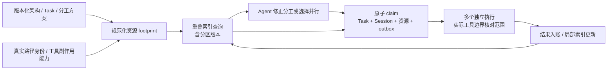

注释：模块名不充当全模块锁；资源占用可以并存，只有相交副作用需要协调。范围预检查不等于已占用，提交时防止并发插入漏检；冻结读取和现场一致性读取区别处理。SQLite 的短提交事务依次落盘不意味着 Agent 的执行必须串行。旧全工作区 writer、旧租约仅到期即可移交的规则不作为本图的目标。

更新：2026-09-23。本文是**静态技术设计**，用来审阅“数据具体怎样组织、什么操作维护它、状态机怎样调用这些操作”。图中的 Map、邻接表、集合、索引与日志是具体的逻辑结构；它们由现有存储及目标新增能力承载，不表示已经有同名源码或数据库表。

本页依据[核心数据与操作](CORE-DATA-OPERATIONS.md)、[共同契约](skeleton/CONTRACTS.md)及五篇模块骨架，将分散定义集中画出。源码仍处于迁移阶段；完整目标接口、Session目录、跨请求捕获与连续上下文尚待实现。图中的“当前”表示一个版本的当前状态，“历史”表示可定位的旧版本或执行记录。

## 阅读顺序

1. [管理数据的底座](#data-foundation)：主记录、事件、幂等、唯一占用及索引怎样分工。
2. [八类结构与操作](#data-structures)：文件/图/任务/会话/运行/邮箱/证据/配置各自的实际组织方式。
3. [原子提交边界](#atomic-boundary)：一次操作究竟读什么、检查什么、一起写什么。
4. [编排状态机](#orchestration)：业务、Session、执行、检查和恢复怎样调用这些操作。
5. [一个完整例子](#worked-example)：文件修改与任务返工怎样反向维护结构。
6. [实现对应及审阅清单](#implementation-map)：现有和新增能力、文件归属、性能边界。

<a id="data-foundation"></a>
## 1. 管理数据的底座

### 1.1 来源、正式记录、查询结构

用户提出的四类基础数据对应两个维度：文件/会话，以及当前/历史。具体操作还要维护目标、计划、责任、控制和完成要求。这些正式决定由人或业务通过操作写入；AST或日志解析不会自行产生已采用的业务决定。

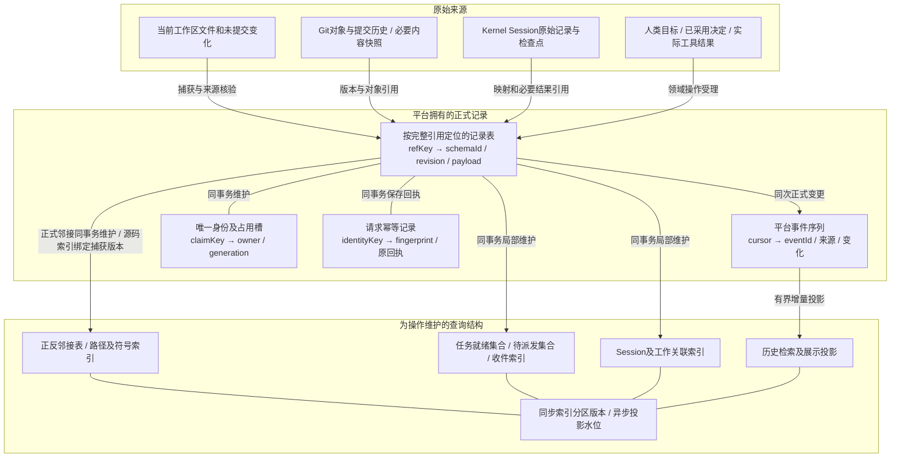

图中箭头表示记录来源和结构维护关系。Kernel原日志仍留在Kernel，Git对象仍留在Git；平台事件只记录自身需要的变化，不复制第二本会话日志。Session/责任/依赖等正式关系有记录归属；必要关联索引与记录同事务维护，历史检索和展示投影可以按水位增量推进。正式关系索引可从记录重建，源码路径和符号索引则从绑定版本的捕获重建。

### 1.2 六个基础结构及内部原语

下表中的键写法是**逻辑定位式**。真实编码沿用完整ref的规范化规则，不按局部taskId/runId重新编码；Map表示键值关系，不要求内存常驻全仓，也不强制新建独立表。

| 结构 | 逻辑组织 | 支持的内部原语 | 维护要求 |
| --- | --- | --- | --- |
| 记录表 `R` | `refKey → {schemaId, revision, payload}` | `read / readMany`；提交新版本 | CAS核对预期revision；不可变Plan/架构版本使用独立版本引用，活动指针单独变化 |
| 事件序列 `E` | `cursor → event`，eventId可去重 | `events(afterCursor, limit)`；提交时追加 | cursor用于存储顺序/水位；不把先后写入自动解释为业务因果 |
| 幂等表 `I` | 完整命令身份→指纹与原回执 | `lookupCommit`；事务中再次核对 | 同身份同内容返回原结果，同身份异内容冲突；不以当前新状态重算旧回执 |
| 唯一槽 `C` | 完整资源键→类型化owner及generation | 比较owner并占用/释放 | 只允许期望owner变更；Session执行与维护使用同一个槽 |
| 同步索引 `S` | `(index, partition, sortKey, rowKey) → recordKey` | `readIndex`；put/remove局部行 | 与正式记录同事务更新；索引分区revision防止范围读取遗漏并发新增项 |
| 正文与投影 `B/P` | ArtifactRef→不可变正文；投影分区→行＋水位 | 正文put/read；整页投影提交 | 正文落盘不等于证据已受理；异步投影不参与要求最新事实的准入判断 |

RecordStore提供上述存储原语；WorkGraph把“领取任务”等领域操作编译成完整读集和写集。原语是可信实现之间的接口，模型/业务调用者获得的是具有明确语义的操作，不获得SQL或任意字段写入口。

### 1.3 当前物理承载与目标扩展

| 层次 | 已有实现 | 目标设计中的增加/迁移 |
| --- | --- | --- |
| 正式记录、事件、幂等、唯一槽 | Ledger的` snapshots / events / idempotency / identity_claims ` | 注册Session、关联、操作等必要schema，复用现有事务及引用 |
| 同步索引 | 现有查询和分散的查询实现 | 新增`core_index_rows / core_index_partitions`，按专用index名承载邻接、关联、就绪和待办 |
| 异步展示/检索 | ReadModel既有表及checkpoint | 有界投影页、水位、去重；与领域事务库中的同步索引分开 |
| 正文 | Vault的Artifact引用及内容 | 保持旧引用和来源；增加真实host材料访问，保留内容去重与读取资格分离 |
| 平台运行观察 | 旧RuntimeRecord累计JSON文件 | 目标`runtime_operations / runtime_observations`保存小状态与增量观察；兼容旧文件 |
| 文件/会话原文 | 工作区、Git、Kernel Store | 复用原生存储；平台维护准确locator和有界读取入口 |

新表是目标DDL，当前不存在；完整物理接口与DDL见[RecordStore骨架](modules/core/record-store.md)。记录表、索引表可以复用一个库，正文与Kernel可以继续独立存放，没有跨这些存储的隐含事务。

已有`snapshots(ref_key,snapshot_json)`保存按key定位的当前快照，并非已经存在`(ref,revision)`全版本表；历史由事件和不可变对象引用定位。已有`identity_claims(claim_key,owner_key)`的owner编码可承载完整类型化身份和代际。目标`EncodedRecord`是内部协议，不能据其字段推断旧表已经有独立schemaId/revision列。

<a id="data-structures"></a>
## 2. 八类专用结构与对应操作

本节图中的数组、Map、Set是算法视角；持久索引可以由SQLite的复合键/B-tree承载，内存算法只加载操作所需的局部数据。领域名称和数据库表数没有一一对应关系。

### 2.1 D2：文件树、源码索引与冻结捕获

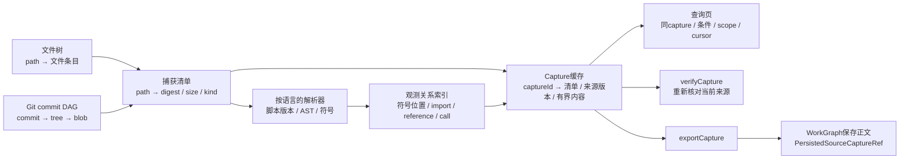

| 结构 | 内容/键 | 负责的操作 |
| --- | --- | --- |
| 文件树与路径索引 | workspace＋规范路径→内容位置；目录前缀定位范围 | `readWorkspace`；`querySource(kind=paths/text)` |
| 解析和符号结构 | 文件digest/脚本版本、配置digest、provider版本→AST/符号及位置 | `querySource(symbols/definitions/references/imports/calls)` |
| 捕获缓存 | captureId→同一捕获清单、实际内容、coverage、过期时间、主体/权限绑定 | `captureSourceChanges / querySource / releaseCapture` |
| 版本差分 | 两个capture或Git版本的path/digest清单 | `compareWorkspace`；增删改及有依据的重命名 |
| 持久来源 | `{capture: SourceCaptureRef, material: ArtifactRef}` | WorkGraph的来源登记操作；供历史查询和后续比较 |

维护规则：编辑路径只是失效提示，配置、导出和解析器版本变化可扩大失效范围。只更新必要解析与关系；完整初次采集和最终来源验证仍有实际I/O。捕获是经过核验的一致来源，不承诺文件系统全局原子快照（`filesystemAtomic=false`）。冻结页的`currentness=not_rechecked`，需要当前有效性时再verify。

WorkspaceTools的`captureSourceChanges`负责临时捕获，WorkGraph同名操作复用它后保存正文及正式来源引用；两者共享一次解析实现。源码图如实保留循环和unresolved；文件夹树、AST树、Git提交DAG与源码引用图分别表达不同关系。

### 2.2 D1：正式架构版本与正反邻接表

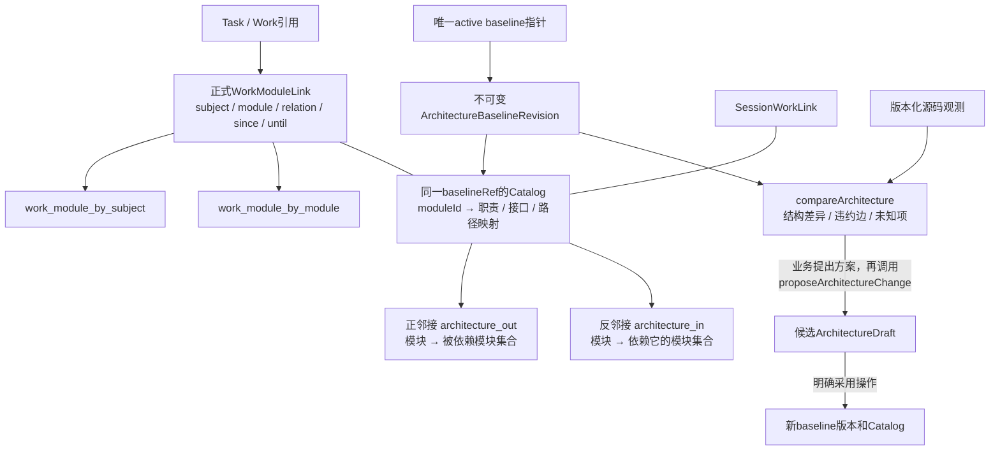

例：采用的依赖为`Auth → Store`、`API → Auth`，则：

```text
out[Auth] = {Store}           in[Store] = {Auth}
out[API]  = {Auth}            in[Auth]  = {API}
```

`queryArchitecture(Auth)`读取模块及有限邻域；`queryImpact(Store)`沿反邻接找Auth、API。候选增边时检查反向可达路径，得到具体环；正式DAG规则不适用于要求如实保存的观测源码图。

| 操作 | 读取 | 写入/维护 |
| --- | --- | --- |
| `queryArchitecture / queryImpact` | 指定baseline/capture版本、局部邻接、工作关联 | 无正式写入；返回来源版本、分页和未知项 |
| `proposeArchitectureChange` | 基准版本及请求的完整候选结构 | 保存Draft、理由与来源；内部计算差分，active不变 |
| `applyArchitectureChange` | Draft版本、现行baseline、适用采用/演进依据 | 同事务写新baseline＋Catalog、active指针及相关索引/事件 |
| `linkWorkToModule` | subject/module与预期关联版本 | 写正式关联和双向索引；Session分支复用同一SessionWorkLink写者 |

`Task.scope`中已有的模块归属由Plan解释；额外的implements/investigates/affects关系单独保存。任务未有Session时也可关联模块。邻接索引可重建，已采用职责和正式责任关联必须有可恢复的正式记录。

### 2.3 D3：任务白板、关系、候选和证据索引

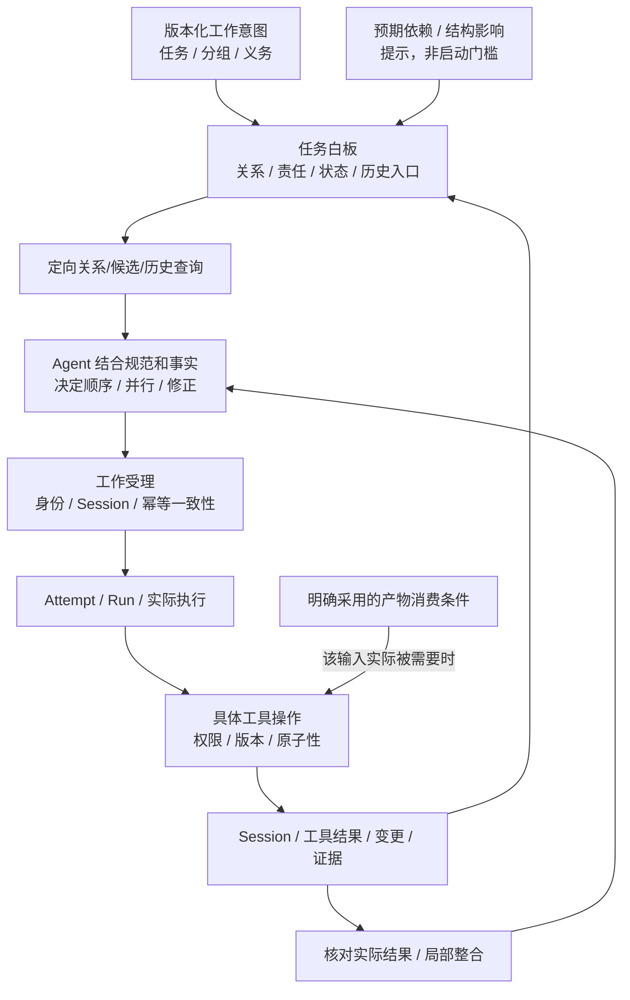

例如 B 预计使用 A 的接口：先保存预期关系，Agent 可安排 B 的调查或独立部分并行；B 真正需要某个已明确版本的接口/产物时核对该输入，不要求 A 的全部任务都完成。A 产出后仅刷新关联事实、输入条件与受影响提示。当前 next 的旧 `executionDag` / `phase=satisfied` 候选规则尚未完整表达这个区别，不能把图解当已交付。

候选/关联查询帮助 Agent 选择，不承担预测未来并行无冲突的证明。就绪信息有事实版本；它既不授予权限，也不应扩成全任务预占。

| 操作 | 必要读集 | 一起变化的数据 |
| --- | --- | --- |
| `applyPlanChange` | 旧/新任务定义、当前计划指针、运行中项、适用义务/政策 | 新Plan、唯一active、task_by_plan/forward/reverse及受影响ready项 |
| `queryReadyTasks` | ready候选＋同一资格规则需要的记录 | 无正式写入，返回可领取/阻塞解释与版本 |
| `claimTask` | Plan/Task、角色、当前Attempt、Session及占用；具体输入在需要处检查 | Attempt、Run、outbox、任务/Session占用和必要索引，详见§3 |
| `completeTask` | 当前义务、适用检查/证据、未决事项、Run事实 | 正式reduction与受影响后继就绪变化；不会自动启动后继模型 |

Task当前phase从Plan定义、运行事实、处置和正式归约解释；不为了展示再维护一套可独立修改的Task状态。接受整版计划可做`O(V+E)`校验；局部变更按受影响范围维护，不承诺每次都是常数时间。

现有Plan任务定义确有phase，现有`task_detail`也有phase投影列。这里要求执行时不改写已接受Plan的定义，投影由同一套归约生成；不是删除全部phase字段。Plan快照的revision与业务planRevision序号也分别保留。

### 2.4 D4 / D5：Session目录、多对多关联与唯一占用

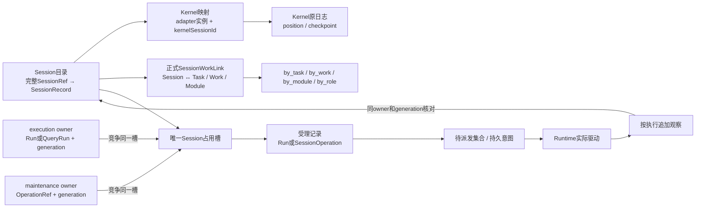

| 管理结构 | 逻辑键/值 | 对应工具 |
| --- | --- | --- |
| Session目录 | `{projectId,sessionId}`→kernel映射、role、health、lifecycle、occupancy、historyCursor | `readSession / findSessions`；创建由`createSession`分阶段接通 |
| Kernel唯一映射 | `{adapterId,kernelSessionId}`→SessionRef | `recordSessionCreated`；adapterId指真实存储实例 |
| Session工作关联 | Session＋target(kind/ref)＋relation→revision/since/until | `linkSessionWork / linkWorkToModule`；同步维护双向查询 |
| Session占用 | `session-occupancy:[projectId,sessionId]`→typed owner＋generation | `claimTask / beginQueryExecution / admitSessionOperation`及对应结果入账 |
| Run与派发 | 完整RunRef/QueryRunRef、admission代际、outbox/Query intent | `pendingDispatch / authorizeRuntimeEntry / startRun / recordRunResult` |
| 技术观察 | 完整binding派生键＋sequence→RuntimeObservation；小状态保存最后位置 | Runtime的`observe / reconcile`；RecordStore增量保存 |

Session是可延续的会话，不等于一次Run；一个Session可先后承接多个任务并关联多个模块。Session的树形展示可以表达创建/重组层级，跨任务和模块仍需要多对多索引。Kernel原历史通过`AgentRuntime.readSessionHistory`精确读取，找候选Session不先遍历全部transcript。

正式`occupancy`与唯一槽同事务维护，是同一约束的记录及物理实现，不允许各自独立设置。任务和工作区还有各自适用的占用/租约；Session槽不能代替文件写冲突控制。失败或unknown的处理见状态图，不能仅凭无回复释放槽。

### 2.5 D6：工作地址、邮箱索引与等待集合

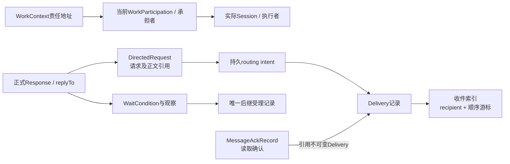

收件地址优先绑定持久工作责任，更换Session后未处理请求仍可定位。图中通信关系可以往返；事件按实际请求、响应、投递分别追加，消息边不会自动成为任务DAG的前置边。

| 操作 | 读/写范围 | 原子性与增量维护 |
| --- | --- | --- |
| `sendMessage` | 核对地址/参与关系，保存正文；写请求和routing intent | 正文先存，正式请求/intent再同事务提交；返回成功意味着正式请求已登记 |
| `readInbox` | recipient分区＋游标查Delivery/请求 | 按索引页读取；不重放全项目日志 |
| `ackMessage` | 以对应Delivery引用登记MessageAckRecord | 旧Delivery保持不可变；单调确认不等于正式回答或任务完成 |
| `respondMessage` | 正式响应、replyTo、受影响等待 | 按正式规则更新响应和等待观察；后继受理保证唯一 |
| `waitFor`及取消/投递操作 | 类型化条件、当前责任和相关intent | 有界批次；处理结果与续页位置共同保存，崩溃可继续 |

### 2.6 D7 / D8：不可变结果、证据适用性与版本配置

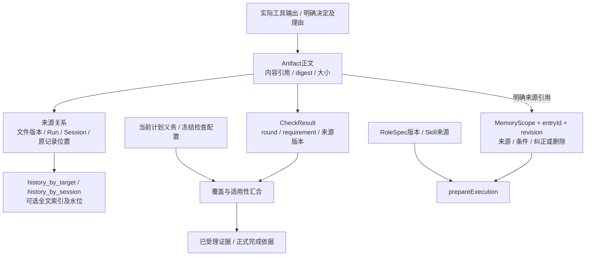

| 结构/操作 | 查询或更新内容 | 必须保留的含义 |
| --- | --- | --- |
| `storeArtifact / openArtifact` | 按引用保存/读取正文，附来源与使用目的 | 保存正文不等于接受结论；内容去重不转让其他主体的读取资格 |
| `searchHistory` | 按任务、模块、Session、种类和关键词检索原记录引用 | 索引给定位和水位；必要时再取有限正文 |
| `openVerification / recordCheckResult / finalizeChecks` | 固定轮次要求、登记实际检查、汇合覆盖与适用性 | 缺失、FAIL、过期、未知分别保留；PASS数量不替代当前义务 |
| `readRoleSpec / resolveRoleBinding` | 按配置版本解析职责、工具和材料要求 | 活动角色配置变化不改写已运行的pin；Query沿自身协议 |
| `readMemory / selectMemory / updateMemory` | scope＋entryId定位、条件筛选、revision更新、纠正和删除 | 已删除正文不复制进审计；历史测试通过不变成永久正确性结论 |

正文的内容引用、采用关系和索引是不同结构。`RecordStore`负责正文与物理页；`WorkGraph`负责来源/授权/条件；`AgentRuntime.runCheck`实际执行检查，`prepareExecution`装配所需输入。长期专家知识库仍是扩展面，本图没有假设它已经存在。

现有Vault正文键包含`contentType | digest | sizeBytes`，图中的digest是简写，不应在迁移时缩为仅digest并改变旧引用。检查轮次当前来自既有VerificationJournal；目标RoundSnapshot外形按迁移方案接入。

<a id="atomic-boundary"></a>
## 3. 原子操作怎样维护这些结构

### 3.1 一次平台原子提交

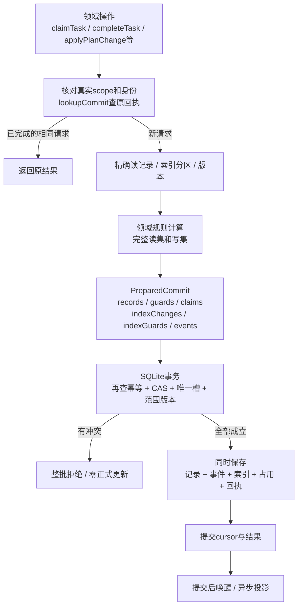

`guard(refKey, expectedRevision)`保护“我刚才读到的这条记录未变”；`indexGuard(index, partition, revision)`保护“我刚才依据的这个范围未发生变化”；唯一槽保护互斥关系。范围内没有返回行也可能是重要条件，因此不能只检查已有行的revision。

这些检查与正式写入在同一事务内。事务中不调用模型、不读取文件、不运行测试；需要的外部输入先取得来源证明，在实际使用点按其语义再次核验。权限、来源核验和幂等检查有各自时点，不因强调原子而删除。

### 3.2 `claimTask` 的确切变化范围

```text
读：
  Goal采用的Plan、目标Task定义
  Role/控制期望/当前Attempt；不预证明全部未来资源
  SessionRecord及Session唯一占用槽

核对：
  expected版本 + 当前受理适用的义务/政策 + 正式角色授予
  Session真实映射、active、可用且无执行/维护占用
  适用任务身份与当前代际；不扩成工作区排他

同事务写：
  新TaskAttempt、新Run(starting)、待派发outbox
  当前任务领取/占用、Session.occupancy及唯一槽owner
  相关同步索引、正式事件、该请求的原回执

返回：
  TaskClaim（含原执行引用与generation）
  尚未调用Kernel，尚不能显示模型已经进入运行。
```

Kernel入口按`authorizeRuntimeEntry → fresh beginRuntimeEntry → 实际Kernel观察`处理。资源在具体工具确有需要时协调，旧统一预占协议不再是 claim 前置；不能假设 claim 已证明未来操作无冲突。`continueSession`消费已有admission，不再领取第二次。Query使用`beginQueryExecution`及自己的QueryRun引用，不为复用这一机制创建虚构Task。

### 3.3 操作的四类边界

| 操作类别 | 原子性/一致性范围 | 例子 |
| --- | --- | --- |
| 精确读/局部查询 | 指定记录/版本；结果带来源或水位 | `readSession / queryArchitecture / queryReadyTasks` |
| 纯算法/来源捕获 | 算法不写正式状态；捕获有范围、验证及失效语义 | 图遍历、差分、`captureSourceChanges / verifyCapture` |
| 平台正式变更 | 一个领域提交中记录/索引/占用/事件/幂等共同变化 | `claimTask / applyPlanChange / completeTask / respondMessage` |
| 外部副作用操作 | 先持久受理，再执行，再记录观察；阶段可恢复 | `createSession / startRun / applyControl / runCheck` |

因此“原子工具”有清楚的职责和失败边界；只有平台事务覆盖的部分可以承诺共同成功或共同失败。Kernel、文件系统、正文库和平台事务之间通过记录与核对衔接，不能用一个大事务框把它们圈在一起。

<a id="orchestration"></a>
## 4. 编排状态机：从原子操作到业务推进

以下六图是目标设计的静态技术图。图中的“业务步骤”和“查询解释态”不是新增持久枚举；真正写入哪些记录见各图后的表。所有写操作使用真实调用上下文、幂等身份和必要版本；事务不包含模型或命令执行。

<a id="s01"></a>
### 4.1 业务推进：只对新增取舍等待人

节点表示 Workflow 的处理步骤；Goal/Plan/QueryJob 等是持久对象。没有 `workflowState` 全局字段。

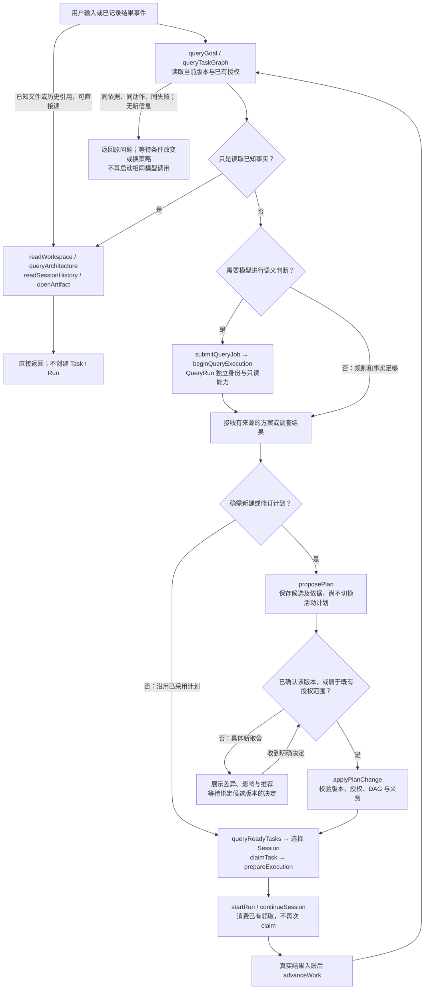

| 操作 | 读取什么 | 写入什么 / 不发生什么 |
| --- | --- | --- |
| 普通精确查询 | 当前合法 scope 内的图、文件、材料、Kernel 历史页 | 不创建 QueryRun，不写已读、不启动模型 |
| proposePlan | Goal、所基于的 PlanRevision、既有授权及材料引用 | PlanProposal；不修改活动计划或已运行任务 |
| applyPlanChange | 候选版本、当前 Goal/Plan、真实决定、结构和义务 | 新不可变 PlanRevision、活动指针、受影响任务关系/索引；冲突整次拒绝 |
| advanceWork | 当前事实、已受理操作、阻塞和事件依据 | 通过核心操作产生下一意图；自身不维护第二套状态表 |

首次方案尚未授权时保留确认语义；人已经要求“实施并验证”的范围内细化不再重复确认。缺材料、Session 忙和依赖未满足是不同等待原因，不自动变成人类取舍。模型解释不产生新计划；只有实际修订才形成新候选。

<a id="s02"></a>
### 4.2 Task 阶段：解释态由正式记录共同决定

下面七个名称是现有 `Phase` 值，图表示目标 `TaskRow.effectivePhase` 的解释，不是提供一个可随意调用的 `setTaskPhase`。其输入包括采用计划中的任务定义、正式 TaskReduction、Attempt/Run、阻塞及控制事实。Plan 本身有 phase，旧查询投影也可持久化 phase；执行不回写不可变 Plan，不能把投影缓存另立为执行权威。

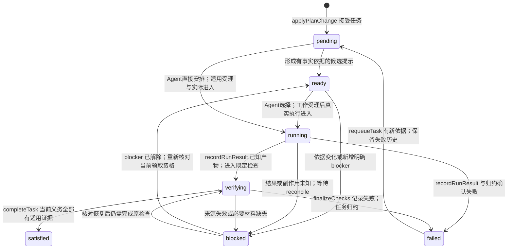

| 操作 | 同一操作核对/写入的核心记录 | 关键限制 |
| --- | --- | --- |
| queryReadyTasks | 读取 Plan、任务现状、关联与已有输入事实 | 返回候选提示；不认证未来并行安全，不能代替 Agent 选择 |
| claimTask | 读活动 Plan/任务、Session、角色及适用版本；同事务写 Attempt、Run、outbox、Task/Session 占用及关联 | 两个领取竞争只允许一个有效提交；不调用 Kernel |
| recordRunResult | 读取该 admission/generation；登记真实观察，归约 Run/相关投影 | Run completed 不能单独产生 Task satisfied；unknown 不释放占用 |
| completeTask | 核对当前 Plan、要求、轮次、适用 Evidence 与未知副作用 | 写 TaskReduction 并增量更新直接后继；不重算无关全图 |
| requeueTask | 读取原失败及当前义务，保存可派发变更；下一次 claim 新建 Attempt | 同义务保留 Task 身份；范围/验收变化走计划变更 |

`disposition=active/deferred/cancelled/superseded`、required/optional、work/gate 均与 phase 分开。图中的领取路径用于可执行 work；gate 依据既定证据归约，不强制启动 Agent。取消/替代修改 disposition 并处理真实运行，不把取消伪装为 satisfied。通信回复不是前驱任务完成。

<a id="s03"></a>
### 4.3 Session：生命周期、健康与唯一占用相互独立

`lifecycle/health/occupancy` 是目标 SessionRecord 持久字段；`availability` 是查询解释态。以下图块不是三份 Session 数据，也不是三个独立锁。

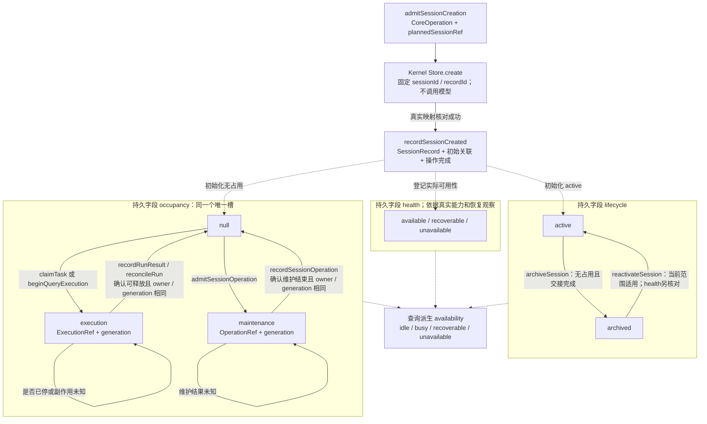

| 操作 | 读取 / 写入 | 保留的边界 |
| --- | --- | --- |
| findSessions/readSession | 读 SessionRecord、SessionWorkLink 与索引，解释忙闲 | 不读取整本 transcript，不自动唤醒模型 |
| recordSessionCreated | 核对创建操作与真实 Kernel 映射；原子写 Session、关联、索引及操作完成 | plannedSessionRef 不是可领取记录；失败不随机新建第二会话 |
| admitSessionOperation | 核对所有 source/target 版本；原子占用维护槽并登记操作 | regroup 的 target 须先完成真实创建；不能与任何占用执行并发 |
| archiveSession/reactivateSession | 修改 lifecycle/时间及关联适用性；核对占用与未交接责任 | 不删除历史，不自动继承旧任务权限，不伪称 Kernel 已恢复 |

同一 Run 结束后可以继续使用这个 Session，但下一轮使用新的 ExecutionRef。目标延续依赖稳定存储实例和真实 Kernel 历史扩展；同 sessionId 落在另一数据库不算延续。native compact 目前 unsupported，不会因为图中存在维护槽就变为已实现能力。

<a id="s04"></a>
### 4.4 Run、控制与 QueryRun：正交字段，分别核对

下面前三块分别是持久 Run.status、持久控制意图及持久 Run.outcome；右侧为 QueryRun 自己的协议。`pause_requested/paused` 等 UI 文字由期望和已观察 ack 解释，不能写入 Run.status。

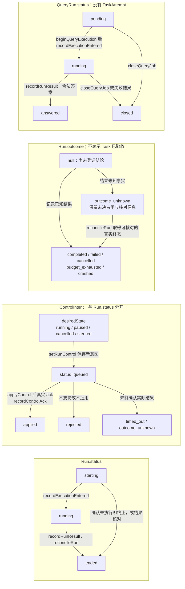

| 行为 | 读取 / 写入 | 不可以推断的结果 |
| --- | --- | --- |
| setRunControl | 读实际范围、Run 与现行控制；写 ControlIntent/Run 控制引用 | queued 或 desiredState=paused 不能说明 Kernel 已暂停 |
| applyControl → recordControlAck | 读正式 intent；作用真实 controller/安全点；写实际 ack 和控制状态 | abort 是取消，不是暂停；旧 ack 不覆盖较新意图 |
| Run ended + outcome_unknown | 写已知的“不确定”事实；保留恢复来源、占用/租约 | ended 不是已确认无副作用，也不是领取下一个写者的许可 |
| closeQueryJob | 写 QueryJob/QueryRun 的 closed 协议状态；driver 取消真实 Query 执行 | closed 本身不释放 Session；只有终止核对后才能释放 |

QueryRun 的结果为 answered/timeout/gap/failed/cancelled/null；其模型执行共用 Session 排他及入口代际，但不伪造普通 RunRef、TaskAttempt 或任务写权限。普通读取不创建 QueryRun。首批 QueryRun pause 为 unsupported。

<a id="s05"></a>
### 4.5 跨 Kernel 副作用：先持久受理，按原身份观察和恢复

图中的“准备/尝试进入/观察”是 Runtime 技术阶段，不是另一份正式 Run.phase。平台与 Kernel 各自提交；两者之间没有跨系统原子事务。

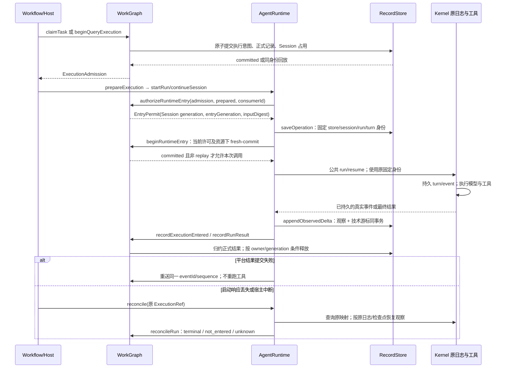

| 中断位置 | 恢复读取 | 允许写入 / 禁止动作 |
| --- | --- | --- |
| 领取后尚未进入 | outbox、EntryPermit、Runtime 技术绑定及真实 Kernel 证据 | 可证明未进入才按原授权续办；没有平台日志不足以证明未运行 |
| Kernel 已产生副作用 | 原 Kernel 位置、工具记录、技术观察及来源引用 | 补原观察/正式入账；不为补报告重跑相同工具 |
| Kernel/存储不可核对 | 原映射、失败信息、未决执行 | 保留 unknown 和原占用；不换新会话或随机执行 ID 掩盖缺口 |
| 结果已写但响应丢失 | 幂等记录、正式版本、同 eventId/sequence | 返回原回执；冲突内容拒绝，不重复释放资源 |

`appendObservedDelta` 写平台所需的增量观察、技术游标及必要用量；Kernel transcript/checkpoint 留在 Kernel。技术键由完整作用域和执行/操作身份派生，不能用局部 runId。恢复只追踪未决引用，不建立常驻监督模型或全仓循环扫描。

<a id="s06"></a>
### 4.6 检查、返工与时间线：状态可以循环，事件实例只向前

左块是业务处理步骤；右块是同一 Task 的实际事件实例，不是新增任务依赖。并发事件靠因果引用、版本和流序号排序，墙钟时间只用于展示。

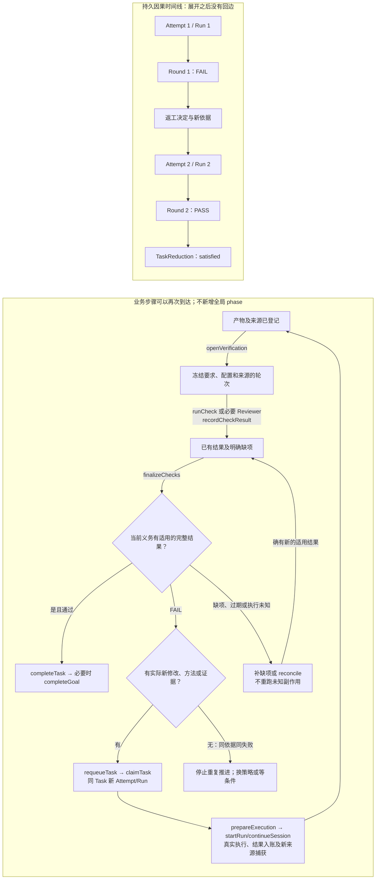

| 操作 | 读取 / 写入的核心记录 | 判定边界 |
| --- | --- | --- |
| openVerification | 读当前 Task/Plan、产物身份、要求和 source proof；写冻结轮次及检查定义 | 不能凭空建空 PASS；角色建议产物不新增完成门禁 |
| runCheck → recordCheckResult | 读检查绑定/授权/租约；存真实命令结果、报告引用及轮次单项观察 | shell 未运行、测试 FAIL、影响未知分别保留；检查不强制起 Agent |
| finalizeChecks | 读本轮全部义务、检查、Reviewer Evidence 和当前性；写汇合及证据 | 两 PASS 一缺项仍不能完成；round completed 不等于 PASS |
| completeTask/completeGoal | 读当前采用义务、适用 Evidence、未决运行与正式归约 | 写完成事实与受影响后继就绪索引；旧版本 PASS 不完成新义务 |

轮次持久 `status` 复用 incomplete/rejected/running/interrupted/completed；结果另存 PASS/FAIL/INCONCLUSIVE/null。硬任务依赖保持 DAG，返工不用增加反向 dependsOn；通信来回也不变成硬依赖。时间线变长不能证明有进展，相同问题、版本、动作和失败没有新依据时停止重复执行。

<a id="worked-example"></a>
## 5. 完整例子：修复一个模块，检查失败后继续

假设任务T1负责修改Auth模块，T2需要T1的适用产物；Session S1已存在且可用，示例检查配置含一项必须通过的命令检查。下面的标识仅是图解实例，不改变真实复合引用规则。

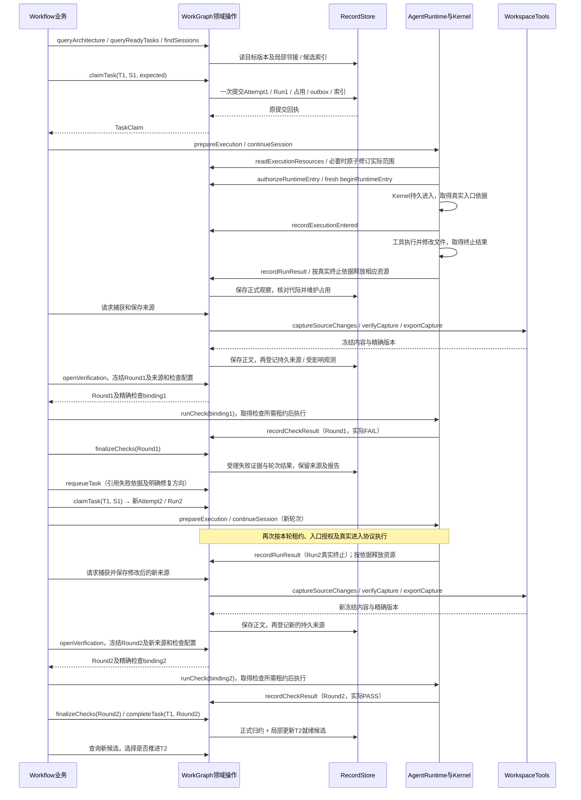

这里发生了五种不同的数据变化：

1. **文件内容变化**由工作区/Git及必要快照承载；捕获器更新受影响的观测关系与来源。
2. **实际执行历史**追加Run1、Run2以及检查记录；Task T1的工作身份可以保留。
3. **Session工作关系**保留S1与T1/Auth的关联；执行期间占用，实际终止核对后释放。
4. **证据与完成依据**按轮次和版本保存；第二轮成功不抹去第一轮失败。
5. **任务调度索引**在完成或适用性变化后局部更新；新就绪候选由业务读取，不在存储事务里启动模型。

若只是文件实现改变，正式架构职责和依赖可以保持原版本；观测差异有记录。若确需改变模块边界，再走候选与采用操作。若执行结果unknown，流程停留在对账，不能直接走第二次claim。

两轮检查绑定各自的来源、配置、任务/Run和轮次；Run2执行完成不会自动产生PASS，Round1的失败也不会被覆盖。`finalizeChecks`受理证据，`completeTask`另行核对并完成任务，两者是独立操作。执行入口、检查入口分别遵守现行工作区租约协议，`claimTask`本身没有取得这些租约。

此例要求Kernel具备目标设计中的真实历史延续：同一存储实例、同Session、新Run/Turn、正确历史边界。当前该公开扩展尚未实现，原生compact也不支持；仅Session ID相同不能作为例子已接通的证据。

<a id="implementation-map"></a>
## 6. 从图到实现，以及审阅要点

### 6.1 结构和算法落在哪些文件

路径均相对代码仓`coding-platform/`，是目标文件；旧实现迁移去向见对应模块页。

| 图中部分 | 目标实现位置 | 应可独立审阅的逻辑 |
| --- | --- | --- |
| 正式记录编解码、领域提交编译 | `src/core/work-graph/persistence/` | ref/schema、完整读集、确定性变更、幂等与历史结果恢复 |
| 主库事务、索引页、正文和技术观察 | `src/core/record-store/` | CAS/唯一性/分区版本、原子写入、schema迁移、游标与去重 |
| 架构版本、邻接和差分 | `src/core/work-graph/architecture/` | 正式与观测分开、正反邻接、环检测、局部影响闭包 |
| 任务依赖、资格和完成 | `src/core/work-graph/tasks/` | 同一资格函数、任务归约、受影响后继、Run/Query分型 |
| Session目录及占用 | `src/core/work-graph/sessions/` | 稳定映射、多对多关联、执行/维护同槽、代际释放 |
| 邮箱、证据、材料、角色记忆 | WorkGraph的`communication/`、`evidence/`、`materials/`、`configuration/` | 正式记录与索引维护、适用性、分页、等待推进 |
| 文件/Git/解析/捕获 | `src/core/workspace/` | 来源版本、解析器复用、失效范围、冻结分页与最终核验 |
| 实际执行与外部恢复 | `src/core/agent-runtime/` | 已受理驱动、稳定Kernel身份、增量观察、控制确认及对账 |
| 下一步选择和产品流程 | `src/business/workflow/` | 任务/Session选择、方案采用、检查/返工、必要的人类取舍 |

### 6.2 性能收益具体来自哪里

| 路径 | 结构带来的改进 | 仍须保留的成本/条件 |
| --- | --- | --- |
| 查模块或受影响部分 | 按key＋正反邻接读取局部集合，避免每次全图搜索 | 全图比较、全局映射变化仍可能`O(V+E)` |
| 查可做任务 | ready索引和受影响后继更新，复用同一资格规则 | 领取需核对当下版本、资源和实际Session，不能跳过并发检查 |
| 找可继续Session | 任务/模块/角色/活跃索引取候选，必要时再读有限历史 | 候选需核对能力与占用；不承诺任何筛选都只读取最终返回条数 |
| 多页源码查询 | 一次冻结捕获上切页，解析器按真实支持范围增量复用 | 初次捕获、失效扩大、最终verify、缓存保留都有成本 |
| 邮箱与事件观察 | recipient/游标页、单执行sequence，按新增部分推进 | 必须保存实际水位与缺口；断档需从原来源补读 |
| 平台运行记录保存 | 小状态＋新增观察，避免每次累计JSON重写 | 旧格式兼容与新旧去重；不将平台优化误称Kernel日志已优化 |

上述是设计依据和验收目标。已落地的R1仅消除了同次完整架构材料读取中的重复捕获/关系提取；完整新结构尚待实施。SQLite按键查询通常依赖B-tree，并非所有存储读取都承诺`O(1)`；图遍历按实际访问节点/边计成本，查询结果较大时仍需有界返回。

### 6.3 审阅时沿这条链核对

```text
一个业务动作
  → 调用了哪个明确的领域操作？
  → 读取了哪些正式记录、来源和索引分区？
  → 约束由哪一个共同算法判断？
  → 哪些记录、唯一槽、索引和事件必须同事务改变？
  → 外部副作用在何时执行，未知结果如何恢复？
  → 哪个状态或新事件触发下一轮选择？
```

读图时重点检查：是否遗漏了无Session的任务关联；是否重复保存同一正式关系；是否把异步显示索引作为准入真相；是否将文件/Kernel圈进虚假的数据库事务；是否把请求受理、实际执行、检查通过和任务完成混成一步。源码依赖方向继续由[模块DAG](module-dag.md)约束，本页的数据反馈和状态循环不会增加反向import。

## 7. 本页与其他文档的分工

- 本页集中提供静态结构图、状态图、操作读写关系及完整例子，适合先审阅和交接。
- [CORE-DATA-OPERATIONS](CORE-DATA-OPERATIONS.md)保留D1–D8的对象语义与操作要求。
- [ORCHESTRATION-STATE-MACHINES](ORCHESTRATION-STATE-MACHINES.md)保留完整转移表及A1–A12验收场景。
- [模块骨架](modules/README.md)给出完整主要接口、文件、算法与迁移；[共同契约](skeleton/CONTRACTS.md)统一跨模块字段。
- 本页不新增另一套状态字段或存储写者。图中解释态有明确标注；公开字段或操作语义若变更，应同时更新其定义页和本页。
