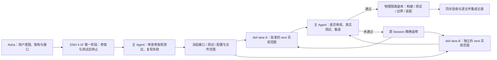

# 分阶段骨架、冻结契约与 dsh 实现环境

> 提示词引用现有真源、宽读窄写的统一规则见 [DSH-WORKFLOW §3](DSH-WORKFLOW.md)。Harness限制写入范围，不隔离产品意图和上下游只读设计；不另建重复施工包。

更新：2026-09-24。用户最新调整：Astra 架构/接口 → DSH 4.1F 骨架与测试 → Astra 审核冻结 → DSH 实现 → Astra 审阅 → 隔离测试。历史 Sol 产物与验收保留；不再要求每批先调用 Sol。[原话与时序纠正](intent/2026-09-24-DSH-HARNESS.md)。

> **当前工程：** `coding-platform/next` 已建立，原 `coding-platform/src` 只读参考。先读[独立目标工程迁移与验收](reviews/next-completed-migration-2026-09-24.md)。Workspace/Goal/material/body/Store 已迁入，reader/index 子项已验收；五目录存在，但 AgentRuntime 已补迁工具循环/来源绑定组件，本批Session创建/历史入口已接通，正式Workflow/Runtime执行入口仍unsupported，UI未迁，完整目标契约尚未运行化。旧产品接线通过不能证明 next 完成。

## 1. 分工与顺序



DSH 第一阶段先按 [已实现能力索引](IMPLEMENTED-CAPABILITIES.md) 定向读相关实现、真实消费者和测试，再按 Astra 审定的接口搭骨架、写行为测试，可复用已经存在的 Sol 产物；此阶段不实现业务。主审检查已有能力复用对照、真实调用链、测试本身、正反例及失败原因，确认测试验证产品语义后冻结。仅“类型能编译”或“测试为红”不构成审核通过。

DSH 第二阶段读取运行冻结测试，只写批准的生产文件；第一阶段可写的测试在第二阶段由环境改为只读。真实接口或断言不足时报告准确反例，由 Astra 审定更新后再继续原 Session。最终主审重新检查实现及测试，独立运行隔离副本；不把同一个实现模型的自检叫独立验收。

本地当前 headless 组合配置的选择为 `deepseek-official / deepseek-flash`；本地 provider catalog 将该模型标为 `DeepSeek-V41-Flash`。这次核对仅输出模型选择，不读取或打印凭据，不更改全局 profile。


## 2. 原工程 R3a / R4a 历史骨架

| 范围 | 已由 Sol 落盘 | dsh 负责 |
| --- | --- | --- |
| R3a | `guarded-revision.ts` 复用原 codec 的最终 guard 解码；真实双后端语义对照和 RAT-03 旧库重放 | 接入两 backend 的事务内 guard；修 WG 首次异步前的输入隔离 |
| R4a | 冻结 `recovery-contract-types.ts`；`recovery-contract.ts` 初始两个函数与后补工作区装配 helper；恢复语义测试；原沙箱实际生效值的只读 getter | 精确目标 Turn 选择、原有效约束持久化与恢复、公共入口真实接线 |

详细施工位置：[R3a Sol 交接](tasks/R3a-sol-skeleton.md)、[R4a Sol 交接](tasks/R4a-sol-skeleton.md)。目标仍为五模块 / 八边；没有为隔离新增 DataEngine、PolicyResolver 或另一套领域状态。

R4a 的选择算法放在已有 Core 恢复文件，app 骨架调用它；Core 不反向依赖 app。沙箱 getter 返回实际规范化值和数组拷贝，避免组合根复制默认值、合并和过滤算法。新增未实现函数只有完成接线并通过行为测试后才算能力，不以“文件已存在”宣布完成。

## 3. 测试作为可调用能力

新工程运行入口是 [next/package.json](../../package.json)，在 next 使用已有 Node24 执行 `check:architecture`、`typecheck`、`test`、`build`，主审最终执行 `verify:isolated`；具体测试范围由当批任务书冻结。可调用测试能力继续由 [check.py](../../tools/dsh-refactor/check.py) 提供，使用该脚本实际登记的 next 批次名称。

以下保留原工程已运行的检查名称与命令，不是新批的默认验收入口：

```sh
python3 /home/hyh001/projects/coding-platform/tools/dsh-refactor/check.py r3a
python3 /home/hyh001/projects/coding-platform/tools/dsh-refactor/check.py r4a
```

| 检查名 | 固定内容 |
| --- | --- |
| `r3a` | 原独立 14 项、特殊输入 1 项、Sol 补充 9 项；含真实 Memory / SQLite 和旧库副本 |
| `r4a` | 原独立 6 项、Sol 补充 11 项；公共入口、真实 SQLite、本地模型 |
| `r3a-regression` | core、自检、既存历史库 / Host 兼容路径 |
| `r4a-regression` | 完整 Kernel vitest |
| `platform-types` / `kernel-types` | 各自类型检查 |
| `platform-architecture` / `kernel-architecture` | 各自现有架构检查 |

固定 Node 24、单 worker、禁用共享测试缓存和配置打包写入；不加大用例 timeout。返回真实退出码与原失败信息，不将失败包装为 success。实现者可看测试源码；“独立”指标准及最终裁决由实现者之外的人维护，不要求把所有测试隐藏。

实现前在实际隔离环境复跑：R3a 23 项中 16 通过 / 7 失败；R4a 10 项中 4 通过 / 6 失败。RAT-03 原库经新 GoalTaskPort 重放原结果、后续提交与重启已验证通过，原证据库字节不变。后续结果另记录，不覆盖这份失败基线。

## 4. 实际环境约束

外层执行器：[harness.py](../../tools/dsh-refactor/harness.py)。新任务明确 `T=C/next`；只读原 C/src，写权限只开放冻结的 next 文件。它把当前工作树（包括未提交 / 未跟踪实现）复制到各 lane，不使用仅有 HEAD 的旧副本，不 reset 用户工作树。副本在进程内映射为原工作区绝对路径，任务书和源码路径保持一致。

- bwrap 对外层文件系统只读，仅对批准的实现文件单独开放写入；测试、types、脚本、配置、锁文件、其他模块均只读。
- 每个 lane 有私有临时目录、运行状态及测试输出。现有依赖、构建产物和历史证据库只读复用，不重复安装。跨进程测试还只读挂载已安装的 `.local/linux-test-tools/node_modules`（R3b 首次快照遗漏该目录，后由主 Agent 补齐，未安装或改测试）；Vitest 的 `.vite-temp` 配置缓存单独挂到私有可写目录；历史 Host 测试使用其既有 `EVIDENCE_OUTPUT_DIR` 输出，不开放证据原库。
- 本机 `/etc/resolv.conf` 指向 `/run/systemd/resolve/stub-resolv.conf`，harness 的私有 tmpfs `/run` 曾遮住该实际 resolver 文件并导致 fetch `EAI_AGAIN`；现只将该文件只读挂入，保留其余 `/run` 隔离，沙箱 DNS 已验证成功（见[恢复记录](reviews/evidence/next-b2-2026-09-26/dsh-network-recovery-20260926.json)）。
- dsh 原配置 / 凭据保持原位置只读；会被 CLI 启动时重写的 profiles 复制到 lane，sessions / storages / cache / attachments 等使用独立目录，不污染原会话或修改全局权限模式。
- 已实测：批准实现文件可写；冻结测试、Port / type 文件、其他模块、package.json 打开写入返回 EROFS。内层 dsh 的 workspace-write 不能提升外层只读挂载。
- 每次交付后核对整个副本文件清单与 hash；合入前另核对主工作区文件仍等于派发基线。主 Agent 审阅后逐文件合入，没有自动覆盖或“全目录复制回去”。

本机 dsh 内置权限档位不足以表达这种单文件范围；团队 write_scopes 也只是提示，因此此次使用外层操作系统约束。普通 chmod 和提示词、hash 事后检查本身都不能替代该只读边界。

单文件挂载与 dsh 原子 rename 编辑工具不兼容；实现者已获知应使用 Python / Node 原地写入批准文件。没有为此放开整个父目录。需要新增生产文件时先由主 Agent审定并预建骨架，再添加该文件写权限。

本次两个副本是实施环境的选择，不是产品“同一工作区必须隔离为不同 worktree”的规则；产品仍按已定资源范围支持同工作区多 Agent 并行。

## 5. 原工程 R3a / R4a 历史派发记录

| lane | dsh Session | 写范围与任务 |
| --- | --- | --- |
| R3a | `session-fde96b5a-69eb-4dc6-8c54-62583d3027dd` | [精确文件清单](tasks/R3a-dsh-write-scope.json)、[执行提示词](tasks/R3a-dsh-execution.md) |
| R4a | `session-61a1c0c8-6d71-4800-b672-3e6d89651fed` | [精确文件清单](tasks/R4a-dsh-write-scope.json)、[执行提示词](tasks/R4a-dsh-execution.md) |

运行记录在 `W/.toolchain/dsh-refactor-runs/{r3a-sol-01,r4a-sol-01}/`。主 Agent 包装器只保存工具事件元数据、最终报告及退出状态，不采集 thinking 正文。R4a 首次运行由主 Agent 暂停，以补齐已确认需要的沙箱 getter 和单一 Core 选择算法说明；后续沿同一 Session 继续。不能把该主动暂停或中途测试结果当作实现完成。

原工程 R3a / R4a 已返修、独立验收并合入当时工作树；结果见[验收报告](reviews/R3a-R4a-sol-dsh-acceptance.md)与[逐批记录](reviews/implementation-batches.md)。此前[独立失败报告](reviews/R3a-R4a-independent-acceptance.md)保留其当时事实。平台 Session / 范围并行等后续能力不因这套开发环境存在而自动交付。

## 6. 后续 R 批次沿用的方式

后续 R2–R6 默认在 next，按本页 §1 的最新两阶段分工实施：DSH 先交骨架/测试，Astra 审核冻结后，再由 DSH 实现；已交付的 Sol 产物复用。当前具体进度以 HANDOFF 最新验收为准。每批按真实接口前置准备可编译的窄契约、关键实现入口和必要行为测试；不把未来全部 API 预建成可调用的假成功实现。未实现入口必须明确失败，且不能提前接入生产调用链。

主 Agent 先审测试是否来自已定需求，再复现缺口并冻结；不能因为测试失败就要求实现者改变产品。例如 R2e.1 原补测把明确排除的符号链接当成缺陷，主审撤销后换成真实许可普通文件漏项测试。测试是可调用的检查能力，dsh 可读取、运行，但不负责改变标准。

独立实现按冻结接口和文件范围并行，共享类型、测试、装配和模块图由指定集成者维护。某个 lane 需要另一 lane 的已验收实现时，由主 Agent 核对 hash 后同步并登记来源，不让实现者扩大自己的写范围。语义不足先补骨架与测试，再继续原 Session；不靠增加 timeout、删检查或宽泛兼容兜底过关。

每次验收记录 next 真实入口是否贯通、对旧业务依赖是否退出、代码增减与未实现契约。原产品消费者在新 Workflow/UI 切换前继续使用旧产品，不要求新核心接回旧系统；旧目录在最终切换后删除。逐批产物可增加功能代码，但全项目精简必须由同口径统计和真实退役证明，不能由目标模块数或测试通过推出。首份统计见[规模与复杂度](reviews/code-size-and-complexity-2026-09-24.md)。

原工程已复用此流程完成 [R2e.1](reviews/R2e-1-sol-dsh-acceptance.md)：`r2e1` 为固定冻结测试入口；`r2e1-regression` 为核心相关回归入口。R3b 也已按正文/材料规则两个 Session 并行实现，再由集成 Session 接通 Host/真实 Run，见[验收与架构欠账](reviews/R3b-sol-dsh-acceptance.md)。独立测试共31项；`r3b-*` 是对应可调用能力。这些是原工程的临时依赖记录；next 必须用目标 Store reader/index 独立供给。类型/import 检查通过不证明运行注入来源正确，仍需目标装配与独立测试。
