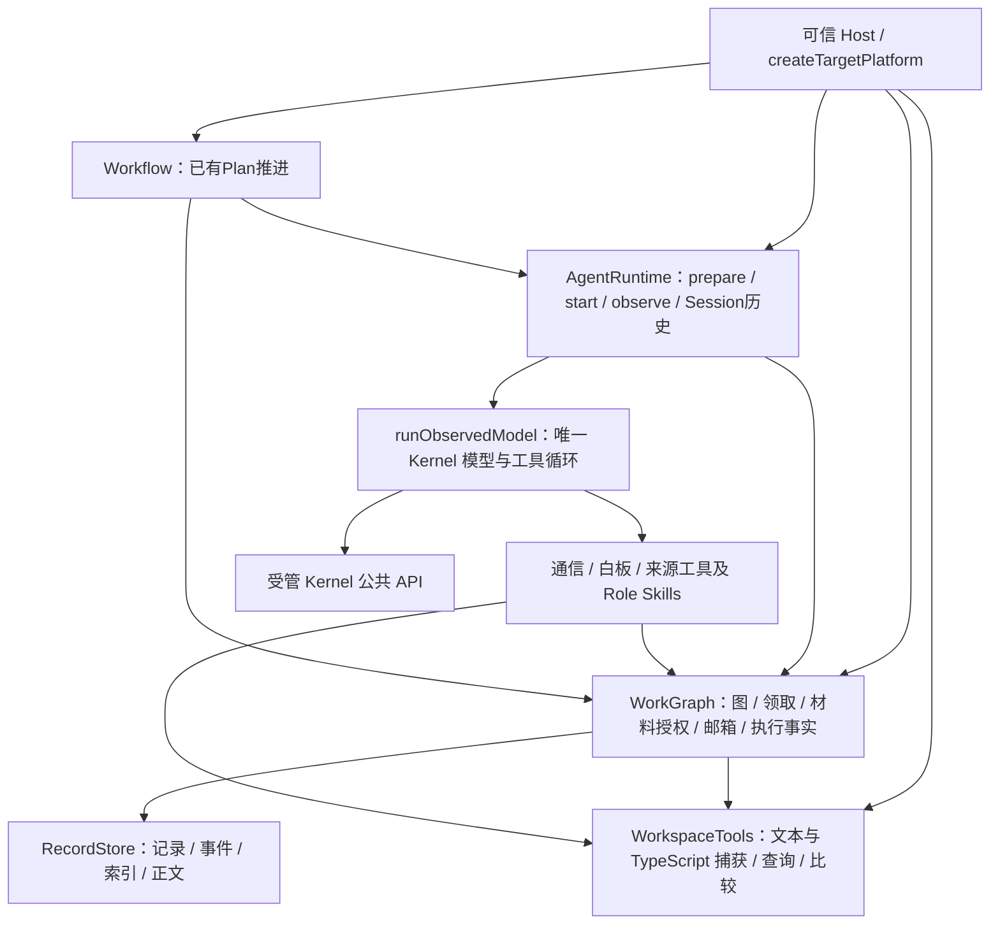

# 当前已实现能力与复用入口

**2026-09-29 文件资源管理器修复：** 普通目录浏览改用既有 Kernel 路径枚举，不再依赖完整文本 capture；二进制/大文件不阻断文件名展示。每次本地显示100项、可输入子目录、明确加载/错误/部分结果。13项、类型、构建、边界及真实ROS目录只读浏览/文件打开通过；未写项目文件、未调用模型。当前44797终端Host PID379878；未提交推送。[本批证据](reviews/evidence/ui-directory-inventory-2026-09-29/README.md)。

**2026-09-29 正常 UI 冷启动与双图纠偏：** 隔离新项目已从主对话目标、只读调查、候选审阅和明确采用，进入两个同 Session Work；唯一预期源码变更、三轮正式检查 PASS、GoalPhase COMPLETED。双图恢复稀疏节点/真实连线、下方独立滚动详情、按需展开及固定，未来节点保留。检查恢复不重开模型、不把已 finalized 非 PASS 当成无结果。按工作区保存显示选择及两标签页切换/刷新恢复已通过浏览器复验；取消/失败后新 Attempt 等缺口仍保留，不能宣告整个 MVP。产品模型 10 次，曾有 2 次沙箱工具失败；正常终端 Host 保留沙箱后检查通过，用户级服务已停止。 [本批证据与边界](reviews/evidence/goal-cold-start-2026-09-29/README.md)。

**历史核对（2026-09-29，本批冷启动接线之前）：当时仍有产品接线缺口。** 用户追问成员与双图后，只读核对 slam6_navigation (test) 当前项目：1 Goal（activePlanRevision=null）、1 active/available Session、3 QueryJob/QueryRun、1 Answer；无 Plan、Task 或正式架构 baseline。浏览器双图入口仍在，但分别返回“该 Goal 还没有已采用的 Plan”和“没有已采用的架构 baseline”。普通发送采用 semantic_query，回答后不进入 planning_answer；规划仍在更多菜单，初始架构仍依赖设置页材料/JSON采用，未形成调查结果→架构候选/采用→任务规划→按需分工的连续冷启动体验。主对话与 local-workbench 成员可指向同一 Session，不是两个 Agent。现有执行/通信闭环验收不能替代此缺口；不能用原型示例节点或固定增开四个成员掩盖。此次仅核对并记录，未启动规划/模型或更改真实项目状态。

**Session 交互与思考配置更新（2026-09-29）：本批限定验收完成。** 对照 DSH 提炼正文主线、动作摘要及按需展开；同身份相邻活动分组，外层显示读取/搜索等动作和文件名，展开直接读工具结果，技术事件、参数和完整原记录继续可查。新增代码复制/换行、稳定展开与最新尾页读取，缩窄对话仍固定页面和输入框。原 72 条历史顺序/唯一性、read 输出、原文、复制粘贴、浅色/窄栏已实际操作；主审 28 项、独审另一重合集合 30 项及 AG6 3 项通过，构建/边界通过。用户指出 think 不可见后，查到当前模型配置为 thinking=disabled，已在本机设置改为 enabled，并删除实时 observer 裁剪 reasoningContent 的旧行；旧历史没有保存的思考不能补齐，新思考输出尚未发起模型调用验证。本批新增产品模型调用 0，工作台 44797（PID 3233874）已加载更新；未改真实项目、未提交推送，不宣告整个 MVP 完成。详见[本批证据](reviews/evidence/ui-progressive-session-2026-09-29/README.md)。

**目标创建与对话恢复更新（2026-09-29）：本批限定验收通过。** 首次发送创建 Goal 后直接开始调查；未配置模型时保留 Goal/草稿并引导设置，设置保存不调用模型；已 claimed/prepared 的原 Query 可显式继续准备。草稿仅在原内容未变化时清理，成员目录与 Session 状态刷新。根集成 4 文件 29 项检查、类型、构建与边界通过；受控浏览器 4 calls / 3 Goal / 4 Session / 4 Job / 4 Run（含 1 个 HTTP 构造前态）。最终真实调查复用原 Goal/Session，2 次 provider 调用、4 次工具成功、0 失败，answered/settled 且占用释放；历史分页 50→72，Markdown 与原始记录入口正常。Query null 累计预算不限但 deadline 仍传入 Kernel，Work 预算未改；仅当前真实 scope 显式配置官方支持的 1M context，其他默认仍 128K，非自动容量发现。工作台 44797（PID 243350）继续运行；未提交推送、未写用户项目，不宣称流式或完整 MVP 完成。详见[本批证据](reviews/evidence/goal-conversation-start-2026-09-29/README.md)。

**本机设置接线（2026-09-29）：本批集成、浏览器与常用启动器核验完成。** 左下角“设置”提供工作区与模型两类操作：空 Host 可打开第一个本机目录；选择新项目或向已有项目添加工作区，默认只读，文件写入与命令执行需显式勾选。模型支持新增、编辑和按工作区选择；API key 留空保留，输入的密钥只保存在本机私有配置，不返回 UI、不进入仓库，未另设密钥时可沿用 provider 原环境来源。新选择用于后续新运行，已开始的 Run 保持其固定配置；切换工作区保留各自草稿与 Session。设置保存不调用模型，本批未重测真实模型连接。根类型、构建与 2 文件 15 项检查通过；浏览器已验证 2 项目 3 工作区、草稿保留、模型选择隔离及重启恢复。常用 44797 已替换为正常启动器并复验，沿用原配置与数据库，没有验收调用上限或请求记录包装；本批实际模型调用为 0，未提交、未推送。操作与验收边界见[本批记录](reviews/evidence/host-settings-2026-09-29/README.md)；以下较早批次的“只能预配置目录”等限制保留其当时含义，不作为本批验收结论。

**Session 渲染更新（2026-09-29）：本批限定实现与浏览器验收完成。** 保留原型布局，既有历史支持本地 Markdown、易读工具与计划、长输入/技术事件折叠及完整原文展开；历史分页从 50 条追加至 85 条，前缀保留且身份唯一。类型、构建与必要检查通过，详见[本批证据](reviews/evidence/session-rendering-2026-09-29/README.md)。没有新增产品模型调用或写入用户项目；既有模型输出不算本轮新执行。不含逐 token 流式或语法高亮；界面打开任意本机目录仍未实现，当前仅 Host 预配置绑定。本结果不等于整个 MVP 完成。

**原型 UI 纠偏更新（2026-09-28）：已按原会话完成本批返修及实际浏览器核对。** 前批误将原型降格为风格参考，重组了项目导航、持续对话、辅助页和图交互；该交付口径已撤回。现恢复项目树、统一输入、项目共享辅助页、独立对话草稿、节点下方详情、双击固定/右键新页及 Task 图内连续纵向焦点。复用正式后端数据，未复制原型示例或新建业务机制；无时间 gate/未来节点仍在图上。四个前端文件及一处既有 UI 测试断言更新，类型、构建、2 文件 16 项检查通过。浏览器核对范围与限制见[纠偏记录](reviews/evidence/ui-prototype-correction-2026-09-28/README.md)；本批未触发模型执行，不宣告整个 MVP 或任意规模 UI 验收完成。工作台仍为 http://127.0.0.1:44797/workbench/ ，用户级服务继续运行；未提交、未推送。

**此前 UI 后端接线验收（2026-09-28，保留原范围）：** 工作台使用真实 owner/Kernel 接口，已确认原型是界面与交互验收基线，示例数据不复制。FUGeXf 隔离 retry 工程沿原 Goal 与数据库，在 stage scope 修复后由界面点击“采用并执行”，最终正式 `complete_goal / COMPLETED`；Work、stage 与 Goal 三项 satisfied，三轮正式检查均 exit 0 / PASS，详见 [live-final](reviews/evidence/mvp-ui-2026-09-28/live-final.json)。

最终验收轮 14 次模型调用（本批较早失败轮次另计，见证据），provider/transport 错误为 0；有 1 次模型猜错另一项目收件人的语义工具错误，后续已修正，不能写成零工具错误。普通读取、重开及继续 gate 未增加模型调用；此前失败保留。浏览器已核对文件保存与 CAS 冲突、命令隐藏保留/运行/取消、Git↔working tree 行级 diff、未保存选区进入真实请求并返回 marker、成员原 Session 咨询答复、双图节点/固定/新页、Task→Run→原历史，以及固定高度/调宽。[本批验收与失败记录](reviews/evidence/mvp-ui-2026-09-28/README.md)。

边界：命令页无 PTY/stdin；架构初始化仍需人工审阅 JSON；Host 内存句柄不代表任意崩溃自动恢复；本次使用隔离 retry 工程，未修改三个候选真实仓库。无默认四 Agent 或 AG 专用生产流程。DSH 已停止，未提交或推送。临时工作台 [查看当前界面](http://127.0.0.1:44797/workbench/)（PID 2247899）保留运行供查看，启动本身不调用模型；这是临时地址，不承诺长期可用。

以下较早条目保留各自当时范围，不覆盖上述最新状态。

**2026-09-28 当前落点：共同机制已导入并通过本轮统一验收。** 100 个候选文件精确导入，后续必要修正后共 102 个代码/测试/资源/生成物路径。 DSH 已停止，主审与子代理已完成候选修正、独立复核和导入；不再等待候选导入。实现复用原 owner、Runtime 与 Kernel，包括隔离 A′、真实 yield 后同 Task/Session 新 Run 接续、Work 控制、同 Goal 独立 Task 推进、显式机械通知及生命周期入口。没有默认启动四个 Agent，也没有按 AG 场景划分的专用生产流程。

**本轮限定验收通过。** 相关 15 文件/134 项检查中 3 项旧 AG2 fixture 迁移后通过，导入后 driver 与目录参数修正的必要复验、类型和构建通过。最终浏览器启动的 DeepSeek 链为 14 次请求、两次真实让出/回复/原 Session 新 Run 接续、实际改文件、Work 与 Goal gate 两次正式检查 PASS，Goal COMPLETED；网络、provider、工具错误均为 0。刷新和原历史展开未新增模型请求，临时 Host 已关闭；此前失败保留并记录根因。详见[统一验收记录](reviews/evidence/orchestration-2026-09-28/README.md)。通用决定提交、原生 compact、Query 公开控制及整个 MVP 未宣告完成。

当前机制与能力边界详见[状态机 §0.3–0.7](ORCHESTRATION-STATE-MACHINES.md#shared-mechanism-review)。

## 历史限定交付证据（不是当前实现缺口清单）

**AG2b 原 Run 持续通信（2026-09-28）已导入并通过限定真实模型验收。** 显式 `send_session_message(replyMode: 'wait')` 经原 Run outbox 触发已有咨询消费者，B 在原收件 Session 产生正式 Answer，回复作为原 Kernel 工具结果让 A 继续并可再次咨询。Host 持有推进句柄，工作台查询状态与请求停止；普通消息不自动派发，busy/归档对象不被抢占或换成新 Session。正式 cancel 与原运行排空沿已有 owner 执行，queued 或未确认取消保留原因，不自行释放占用。

隔离工程成功轮次13次 DeepSeek 调用，两轮回复均进入同一 A Run 后续请求，B 保持同一 Session；真实文件编辑、Work/gate 两个正式检查轮次 PASS、Goal COMPLETED，当前轮 transport/provider/tool errors 均为0。[AG2b 证据](reviews/evidence/agent-behavior-2026-09-28/ag2b/README.md)保留此前两次连接失败及一次模型调用前的 Node 环境失败，不以成功轮次抹掉这些记录。该结果只证明存活 Host 内的限定往返与执行链，不保证语义可靠，不包含 Host 崩溃、Run ended/pause 后自动续跑；重开读取持久事实不等于自动恢复执行。AG3、Reviewer/返工、并行、治理、完整恢复及整体 UI/真实项目验收继续，**不是整个 MVP 完成**。

本批相关11文件/105项、Node/UI类型、边界及构建通过。实际浏览器启动后刷新读回相同flow，看到两条回复、正式Goal完成和可展开原历史；普通读取未新增模型。测试Host已正常关闭，未提交/推送。

**显式咨询消费者 AG2a（2026-09-28）：** [consultation.ts](../../src/business/workflow/consultation.ts)由原 Workflow 暴露 `consumeConsultation`，经 `workflow/consultation` 和统一工作台消息详情可实际处理一次咨询。原消息/确定性 Query 身份、首次 claim 的收件 Session、正式 Answer 与回复来源由现有 owner 绑定；Query 只读，Host 仅机械关联真实答案，不能自填答复身份/内容。普通读取无模型；busy 等待，重复处理与已保存答案补挂不另建 Query。12 文件/115 项、类型/边界/构建通过；[证据与限定范围](reviews/evidence/agent-behavior-2026-09-28/ag2/README.md)。AG2a 本身未完成自动感知、原发信 Work 续接或完整多 Agent 调度；后续 AG2b 的原 Run 限定续接见上方。 真实模型与浏览器终验已通过限定接线：共7次模型调用，首条4次含2次参数错误后修正，浏览器第二条3次/2次成功工具/0失败；重放、重开和普通读取均无新增模型。该结果不保证语义可靠，也不宣称零工具错误。

**Agent 行为装配 AG6（2026-09-28）：** [Host 配置](../../src/app/runtime-configuration.ts)已接受 `grant.skills = { bundle: 'platform', behaviors: [...] }`，解析为原 Runtime 的资源根/Skill ID。共同 `platform-work` 加按需秘书、参谋、书记、审查指令；数组为空只加载共同指令，原 `enabledIds: []` 仍是不加载指令。Work/Query 共用装配入口，Kernel 原有多 Skill 加载和模型循环直接复用，工具/写范围不变，选择行为不会创建或唤醒 Agent。统一 UI 按成员查看，不增加职责专属入口。[使用示例](../../README.md#按需装配-agent-行为)、[行为表](AGENT-ROLE-ACTIONS.md)、[验收与限制](reviews/evidence/agent-behavior-2026-09-28/ag6/README.md)。19 项及类型/边界/构建通过，提示词修正后 8 项与资产摘要复验通过；两轮共 8 次真实模型调用机械完成，但语义样本仍有推断过强等问题，不声明回答质量全面通过。AG2 回复/执行、正式 Reviewer 结果消费者、自动调度与原生压缩没有因此实现。

**Agent 行为消费者 AG1（2026-09-27）：** 新增两个只读工具按现有 Task/Module/WorkContext 的当前开放关联查找 Session，并读取卡片；真实 Work Run 可据返回事实选择收件人，经原 mailbox 发送咨询。新工具须同时进入既有 Host/Role 有效工具集合，Skill 本身不授予能力。目录仅放开绑定 Work Run 的同工作区读取，创建/生命周期写仍 Host-only；没有重查每次工具的整条执行准入链。两阶段实现与独立6文件/42项、Node/UI类型、边界已通过，见[行为计划](AGENT-BEHAVIOR-PLAN.md)、[AG1证据](reviews/evidence/agent-behavior-2026-09-27/ag1/verification.json)。目标发现仍基于open links；消息入箱不代表回复、唤醒或委托执行，Query未因此开放邮箱写入。 [真实DeepSeek](reviews/evidence/agent-behavior-2026-09-27/ag1/live-result.json)随后完成4次模型/3次成功工具调用，接收者仍待命，读回不新增模型调用。

**最新增量（2026-09-27）：用户已授权有界清理，首批同次准入角色解析复用已导入。** WorkGraph 将本次已检查的 Role resolution 传给组合根，Host 配置回调使用其副本，原权限检查与提交 guards 保留。已有正常执行/冷观察用例中的组合根重复解析从 4 次降为 0；相关 4 文件 / 41 项、Node/UI 类型、模块边界及构建通过。生产源码净行数不变，尚未提交或推送；见[任务与取舍](tasks/CLEANUP-role-admission-2026-09-27.md)及[本批证据](reviews/evidence/cleanup-2026-09-27/role-admission/verification.json)。下文“停止施工”描述此前模型接入验收轮次，旧全量快照不作为本次增量的验证证据；其它 MVP 余项未自动恢复施工。

**最新独立仓库验收：124 文件 / 1,102 项通过（exit0）。** 本次包含最终 graph/history UI 和独立目录构建脚本；Kernel 补丁再生、边界、Node/UI 类型、构建、编译入口和受 token 保护的 Host smoke 均通过。[独立验收记录](reviews/evidence/standalone-2026-09-27/verification.json)。本轮[有界 completion audit](reviews/completion-audit-2026-09-27.md)已完成：仍有真实实现阻塞与验收缺证；下方较早报告保留其当时范围。

> 独立仓库说明（2026-09-27）：本仓库根即原 `coding-platform/next`，文档位于 `docs/`；当前继续入口见根 `CONTINUE.md` 与 `AGENTS.md`。旧证据、任务书中的绝对路径和 scope 只描述当时工作区，不能直接执行。用户已从独立 main 恢复并完成有界审计；本轮真实模型接入的非语义错误修复已验收并停止，尚未宣告整个 MVP 完成。

**当前状态（2026-09-27）：本轮真实模型接入验收已通过，按用户要求停止施工。** [有界审计](reviews/completion-audit-2026-09-27.md)之后，[R5b 输出契约](tasks/R5b-live-model-response-contract.md)已完成两阶段 DSH、中审及两文件导入；独立相关 4 文件 / 4 项、类型与构建通过。[最终真实 DeepSeek 验收](reviews/evidence/standalone-2026-09-27/e01-live-deepseek/result.json)完成 12 次模型调用、12 次工具完成，模型/工具错误均为 0；两个 Work 复用同一 Session 实际改文件，三次检查 PASS，正式 Goal COMPLETED。真实浏览器展开完成回执并读取 Query 原历史后，模型调用数仍为 12。本限定路径没有再出现“非语义”错误；不继续其它模块，也不据此撤销既定 MVP 余项或宣告整个 MVP 完成。

[受控 coding 路径](reviews/evidence/standalone-2026-09-27/e01-controlled-coding/result.json)已补证：原生产入口完成两次真实文件编辑、三次实际行为检查及正式 Goal COMPLETED。该证据使用受控 provider，初始化经正式 HTTP owner 完成，不代表真实模型、完整 UI bootstrap 或完整 MVP。

独立根 runner 已实际运行 [Work-control Stage1](tasks/R6-work-control-consumer-skeleton.md)，骨架中审未发现必须返修项；候选仍只在独立 lane，未导入、未进入 Stage2，因本轮范围收窄保持 STOP。其余返工、控制/恢复、并行、换手、变更/治理和完整项目隔离缺口按原审计保留；A1 旧 lane 不导入，R3g 不自动派发。

更新：2026-09-27；源码核对范围：本独立仓库根 `src/`。B2 正式 prepare/start/observe、C1 邮箱、M1 授权与真实来源、M2 材料事实、W2 Agent 白板及未来意图、C2 Runtime 工具/材料/委托装配已合入。R5a 正式 Project/Workspace 登记及 CompletionPolicy 安装/启用已合入，空 SQLite 可经公开端口建立 Goal、初始架构并采用 Plan。三项职责 Skill 已有真实加载与 Kernel 工具轮次；完整产品自动推进尚未交付。前序R5a/R4.2的[102文件/1,007项隔离快照](reviews/evidence/next-b2-2026-09-26/r5a-r4-isolated-result.json)保留为历史来源。其后R4.1持久受理三生产实现已独审合入；Git固定commit读取/比较已独审合入（12文件112项/types）；R3e注册检查五文件与Query受理两文件实现已独审导入（分别3文件10项/types、2文件11项/types）；R6初始六生产实现、R3e.3五生产实现（2文件3项/types）及R5c Workflow推进实现（2文件3项/types）已独审导入；Query execution八生产与R6 Session/mailbox四生产实现已独审导入；初始Plan消费者、UI布局、R4.3a/R4.3b与R6限定一键执行链均已导入。当前独立 main 的完整工程验收见顶部 standalone；下方提取前快照不含后续 graph/history，不能互换。

**提取前隔离历史：124 文件 / 1,102 项通过（exit0）。** 该副本包含R4.3b与R6执行入口最终导入，以及[W2一行机械调用次数断言删除](reviews/evidence/next-b2-2026-09-26/r4-r6-w2-fixture-amendment.json)；Node/UI types、构建、7/8边界、7源/28产物逐字再生、编译composition与真实token保护Host smoke均通过。见[结果](reviews/evidence/next-b2-2026-09-26/r4-r6-isolated-result.json)、[通过日志](reviews/evidence/next-b2-2026-09-26/r4-r6-isolated-recheck.log)及保留的[首次失败日志](reviews/evidence/next-b2-2026-09-26/r4-r6-isolated-final.log)。快照不含其后的graph/history骨架与实现，不能据此证明当前全部源码整体通过；本轮未重做旧8,827文件全hash比较，不沿用旧快照结论。

证据入口：[本批审阅](reviews/next-b2-c1-middle-review-2026-09-26.md)、[未来意图合入](reviews/evidence/next-b2-2026-09-26/w2-future-intent-implementation-20260926-import.json)、[C2 合入](reviews/evidence/next-b2-2026-09-26/c2-runtime-platform-tools-implementation-20260926-import.json)。上一隔离快照为 [94 文件 / 948 项](reviews/evidence/next-b2-2026-09-26/b2-c1-w2-isolated-result.json)，只描述该历史子集；更早 [B1/W1](reviews/next-b1-w1-2026-09-25.md)、[A1](reviews/next-a1-graph-session-2026-09-25.md)、[R4c 历史范围](reviews/next-r4c-history-and-source-2026-09-25.md)与[精确执行读取](reviews/next-r4c-execution-reads-2026-09-25.md)保留为来源，不再代表当前限制。

R5a 当前证据：[独立专项 4 文件 / 26 项](reviews/evidence/next-b2-2026-09-26/r5a-repair-final-tests.log)、[最终两文件导入](reviews/evidence/next-b2-2026-09-26/r5a-final-implementation-import.json)；[实现交付报告](../../.toolchain/dsh-refactor-runs/r5a-project-bootstrap-implementation-20260926/attempt-1790396802156038161/final.md)另记录邻接合并 13 文件 / 85 项。R5a当时已纳入历史隔离，[原完整日志](reviews/evidence/next-b2-2026-09-26/r5a-r4-isolated.log)可追溯；R4.2 的 Kernel 工具组子能力见 RT10；R4.1持久控制受理见WG20，R4.3a实际停止与ack已独审导入，R4.3b取消历史消费已导入，fresh resume/冷恢复继续。R4.1证据为[三文件导入](reviews/evidence/next-b2-2026-09-26/control-intent-implementation-import.json)、[7文件50项](reviews/evidence/next-b2-2026-09-26/control-intent-final-tests.log)、[最终2文件20项](reviews/evidence/next-b2-2026-09-26/control-intent-replay-final-tests.log)及[types](reviews/evidence/next-b2-2026-09-26/control-intent-replay-final-types.log)。

本页是实现导航，不是另一套架构、完整 API 规范或运行时注册中心。后续批次更新受影响条目及证据；未列出的函数先检索源码，不能据此认定不存在。

当前施工证据与调度：

- [R5b Query执行](tasks/R5b-query-execution-implementation.md)：pending受理与十九文件骨架后，八生产范围（七改变）完成[独审导入](reviews/evidence/next-b2-2026-09-26/r5b-query-execution-implementation-import.json)。固定4文件/13项及types通过；公开无Plan Goal→Query→真实Session claim→有界prepare→原Kernel readonly源码工具/模型轮次→持久Answer/Job/Run→同generation释放、原回执及SQLite重开已经贯通。一次有界返修落实原expected/请求指纹与回执恢复、新动作当前占用、完整scope/初次Role、manifest有效预算及原输入来源pins；不增加运行中换Role防御。Answer→初始Plan已由后续消费者批次贯通；外部材料grant、多轮/高级恢复继续；本轮限定Host执行消费者已由R6接通。
- [R6.1a Host工作台](tasks/R6-host-workbench-implementation.md)：六生产实现及最终三项UI修正已[独审导入](reviews/evidence/next-b2-2026-09-26/r6-host-workbench-implementation-import.json)，固定[2文件/15项](reviews/evidence/next-b2-2026-09-26/r6-final-host-tests.log)、Node/UI types与构建通过。修正前真实浏览器已走空库初始化→Plan→采用/观察结构与任务图、文件分页/捕获版本读取、第二scope无策略Goal与原请求replay；最终修正核实异步响应写原scope、文本失焦不全页重绘及技术详情折叠。最终版本同SQLite无review配置[HTTP重开](reviews/evidence/next-b2-2026-09-26/r6-reopen-http.json)可读Goal/TaskGraph；最终[真实浏览器复验](reviews/evidence/next-b2-2026-09-26/r6-final-browser.json)及[截图](reviews/evidence/next-b2-2026-09-26/r6-final-browser.png)已完成：现成Chromium Headless保留原sandbox、临时独立profile，经原生DevTools输入连接真实Host/SQLite；Goal ID输入后Tab保留下一框焦点，无review重开可读Goal/TaskGraph，capture响应延迟700ms时切B不受A响应污染，切回A已capture ready。 本轮main核心/Host集成[13文件47项串行通过](reviews/evidence/next-b2-2026-09-26/cohort-core-host-integration-tests-serial.log)，[types](reviews/evidence/next-b2-2026-09-26/cohort-core-host-integration-types.log)及[7/8允许边界](reviews/evidence/next-b2-2026-09-26/cohort-core-host-integration-architecture.log)通过；[首轮并发超时日志](reviews/evidence/next-b2-2026-09-26/cohort-core-host-integration-tests.log)保留。该专项是当时的局部结果；最近完整隔离范围见顶部124文件/1,102项快照；Session/mailbox后续交付见下。
- [R3e.1注册检查](tasks/R3e-completion-implementation.md)：五生产文件完成受限返修并已[独审导入](reviews/evidence/next-b2-2026-09-26/r3e-evidence-implementation-import.json)，含Goal gate真实普通producer分支；固定[3文件/10项](reviews/evidence/next-b2-2026-09-26/r3e-final-tests.log)及[types](reviews/evidence/next-b2-2026-09-26/r3e-final-types.log)通过。原回执、局部读集、当前来源适用性、执行根与晚取消事实收尾已修复。注册检查/Evidence子链已接通，不代表Task/Goal完成或Reviewer已交付。
- [R3e.3正式Task/Goal完成](tasks/R3e-task-goal-completion-implementation.md)：五生产实现已[独审导入](reviews/evidence/next-b2-2026-09-26/r3e-completion-implementation-import.json)，最终2文件/3项及types通过；一次纯policy修复保留optional已有真实Run/Lease的活动副作用阻塞，无执行的optional意图仍不阻塞。公开普通work与独立Goal gate检查→completeTask→completeGoal→TaskGraph→SQLite重开/原回执已接通；Reviewer生产、正式重开/supersession和完整Workflow仍未交付。
- [R5c.1 Workflow](tasks/R5-workflow-advancement-implementation.md)：原七文件骨架后，workflow.ts实现已[独审导入](reviews/evidence/next-b2-2026-09-26/r5c-workflow-implementation-import.json)，独立2文件/3项及types通过。真实已有Plan→两个普通work复用同Session的新Kernel Turn→实际checks→工作完成→独立Goal gate→正式Goal COMPLETED已接通，optional future仍保留；每次有限owner调用沿原完整请求/回执，无第二状态库。后续initial-plan批次已实现`handleGoalInput`与初始采用；复杂调度/Reviewer及其余Host消费者继续；限定一键执行链见R6。

- [R6.1b Session/mailbox](tasks/R6-session-mailbox-implementation.md)：四生产实现已[独审导入](reviews/evidence/next-b2-2026-09-26/r6-session-mailbox-implementation-import.json)，原2文件/17项、Node/UI types及最终物理构建通过。实际浏览器从空库创建两个Session、Host发信/正文/原历史读取，并在无review配置的同SQLite/Kernel重开后保留；读取仍pending。发送后继捕获原scope/recipient、新草稿保留，以及[切Session正文归属](reviews/evidence/next-b2-2026-09-26/r6-session-selection-repair-import.json)已修正，最终[浏览器复验](reviews/evidence/next-b2-2026-09-26/r6-session-browser.json)通过。Query/Workflow执行与布局已由后续批次接通；材料/完整控制与其余UI范围继续，不将本批当完整R6。

- [R5b初始Plan消费者](tasks/R5b-initial-plan-implementation.md)：12路径骨架后四算法已[独审导入](reviews/evidence/next-b2-2026-09-26/r5b-initial-plan-implementation-import.json)，固定6文件/10项、types及architecture/import通过。真实Query Answer→候选→采用→原Workflow→正式Goal COMPLETED贯通，optional未来意图保留；原请求完整指纹/回执优先及共同提交局部guards已收敛。原同case仅将source与SQLite/Kernel存储目录分开，避免检查读取自己的数据库写入；没有扩大测试矩阵。Host限定执行入口已由R6接通，见下方当前批次。
- [R6 UI布局与已有事实](tasks/R6-ui-layout-implementation.md)：四生产实现已[独审导入](reviews/evidence/next-b2-2026-09-26/r6-ui-layout-implementation-import.json)，19项、Node/UI types与物理构建通过。三栏/页签、目录与文件页分离、对话与文件草稿及按需展开完整原始历史已接已有真实事实。三文件[浏览器窄修](reviews/evidence/next-b2-2026-09-26/r6-ui-browser-repair-import.json)已导入；[最终真实浏览器](reviews/evidence/next-b2-2026-09-26/r6-layout-final-browser.json)确认同层分列、单击详情/双击及右键固定、拖宽/放大恢复、文件草稿/选区引用与完整原文展开；1440×960外页稳定。完整图关联及最终视觉整理后续接续。原新增历史测试已按用户纠偏撤销永久字段过滤；不加测试矩阵，不宣称完整R6完成。

- [R3d目录修订与明确包含](tasks/R3d-architecture-evolution-implementation.md)：五路径骨架后catalog-service单文件实现已[独审导入](reviews/evidence/next-b2-2026-09-26/r3d-architecture-evolution-implementation-import.json)，固定2文件/33项及types通过；局部同请求竞争恢复收敛。真实初始目录→新增Module/显式包含→新current/旧history→Session关联新Module→SQLite重开/原回执贯通。包含与依赖独立，旧无包含关系仍为unknown，不反推树；完整decision/gate治理及UI包含消费者继续。

R4.3a 八生产控制投递/观察已[独审导入](reviews/evidence/next-b2-2026-09-26/r4-control-runtime-implementation-import.json)，R4.3b 六生产取消历史消费者也已[精确导入](reviews/evidence/next-b2-2026-09-26/r4-terminal-history-implementation-import.json)：固定15项、types与28产物再生通过。共享 `projectTerminalTranscript` 仅在副本省略没有结果的 abandoned 声明及过滤后全空消息壳，原历史、已有推理和实际结果保留；真实取消释放后，同 Session 第二个正式 Task 经 claim→prepare→start 消费前缀已通过。未知结果仍不释放，fresh resume/冷恢复及完整控制 UI 仍属后续范围。

R6 调查/规划执行入口六生产实现已[最终导入](reviews/evidence/next-b2-2026-09-26/r6-execution-entry-implementation-import.json)，固定22项、Node/UI types与物理构建通过；[最终真实 CUA 浏览器验收](reviews/evidence/next-b2-2026-09-26/r6-execution-entry-browser-final.json)一键贯通 Query→Answer→初始 Plan 采用→两个 Work→实际 checks/独立 Goal gate→正式 Goal COMPLETED。完整回答默认收起且可主动展开，任务图直接显示原 `TaskGraph.completion`，optional 无验收未来节点继续保留。该链使用原受控4回复及真实 Host/Runtime/Kernel/SQLite，不代表外部真实模型网络、完整 MVP/UI 或全生命周期已验收。

[Task本次执行到原Session/历史](tasks/R6-graph-history-consumer-implementation.md)的两UI实现及辅助历史重复渲染窄修已[精确导入](reviews/evidence/next-b2-2026-09-26/r6-graph-history-consumer-implementation-import.json)，[固定22项、Node/UI types与构建通过](reviews/evidence/next-b2-2026-09-26/r6-graph-history-browser-repair-review.json)。[初轮真实CUA](reviews/evidence/next-b2-2026-09-26/r6-graph-history-browser-initial.json)已核Task→两个不同Run→同一claim Session、各原窗口2–6/7–11、完整Session顺序1–10→11、Run页切回保留、原文默认折叠可展开及中心/辅助分页独立；[最终只读复验](reviews/evidence/next-b2-2026-09-26/r6-graph-history-browser-final.json)确认辅助页仅呈现一次10条原记录，可展开position5实际正文，模型调用0。该消费者只导航当前TaskRow已知Run，不代表全部attempt枚举；本批未纳入提取前124文件/1102项副本，但已纳入顶部 standalone 独立提交验收。架构包含UI、文件保存、diff/终端、完整控制/恢复、Reviewer/返工、治理及最终消费者切换继续保留；恢复后的实际阻塞与下一批以顶部审计和 HANDOFF 为准。

正常公开路径和实际权限/副作用边界是本轮gate，不为覆盖完备再扩大矩阵；当前独立 main 的完整隔离证据见顶部 standalone，包含最终 graph/history；它不代替 MVP 行为验收。

## 1. 怎样使用本页

先读本节和所涉模块，再沿链接读**实际接口 → 实现及其直接依赖 → 组合根消费者 → 对应正反例**。阅读可以跨模块，写范围仍以当批 scope 为准；不要只看函数名、类型定义或一份通过报告便重写能力。完整签名以链接的源码为准，本页不复制类型正文。

| 标记 | 准确含义 |
| --- | --- |
| **已接通** | `createTargetPlatform` 返回的端口有真实实现；仍需满足表中的身份、配置和事实前提，并不保证任意请求成功 |
| **内部已用** | 已被现有生产组件调用，可以在原 owner 内复用；不是任意模块都能导入的公共业务端口 |
| **组件已有** | 有真实实现与限定范围测试，但完整平台业务链未接通；后续接线复用它，不能宣称产品已支持 |
| **未实现** | 只有设计、类型或明确 unsupported；不能用 fixture、默认值或另造身份填成成功 |

“原子能力”包含两个层次：确定性的查询/转换工具，以及维护一致性的原子写操作。并非所有工具都在一个数据库事务里，更不表示文件操作、Kernel 执行与平台入账已经成为跨系统事务。

**文档分工：** [PRODUCT](../PRODUCT.md)与[用户意图](intent/INTENT-AND-DECISIONS.md)决定目标；[ARCHITECTURE](ARCHITECTURE.md)、[模块文档](modules/README.md)定义职责与协议；本页指出已经有什么；[HANDOFF](HANDOFF.md)及批次报告记录验收范围。原 `coding-platform/src` 只作只读对照，不从 next 导入旧服务。

## 2. 装配总览

[createTargetPlatform](../../src/composition/create-platform.ts) 装配 `projects/completionPolicies/goals/plans/claims/executions/controls/sessions/materials/messages/roles/architecture/queries/evidence/checks/workspace/runtime/workflow` 与 `close`。配置真实 Runtime Host 后，正式 TaskClaim 可 prepare→fresh authorize/begin→Kernel→原历史观察→同代次终态释放；无 Runtime Host 时仍可使用领域、邮箱与 Session/历史接口，执行方法明确 unsupported。Workflow.advanceWork 已接已有Plan的有限推进至正式Goal完成；handleGoalInput已接初始规划采用。

组合根复用唯一 RecordStore/body store、Workspace source provider、Role service、Plan service 与 execution reader：M1 grant/read 和 M2 facts 使用同一来源；M2 facts 注入 B2 四个 fresh 屏障，W2 delegatedWrites 与 C1 runtimeAdmission 共用 Host 配置授权，Runtime 使用同一 Plan/邮箱实例装配工具。公开 Project/Workspace 登记、政策安装/启用、控制受理/读取、Runtime、邮箱、材料授权等异步调用纳入 trackedCall/close，内部调用保留 raw service，避免关闭开始后拒绝在途收尾。

图中实线表示该局部调用已存在。Store、正文库和 Kernel 数据库路径不向模型开放；Skill 和工具调用不是权限来源，正式领域操作仍核可信身份及局部事实。Query执行、持久控制/恢复、Reviewer/正式重开及完整Workflow/HostUI产品路径仍见后文剩余清单；公开初始化、R3e.3正式完成、已有Plan的Workflow推进与R6初始工作台已有。

## 3. WorkGraph

| 能力 / 状态 | 真实入口与操作 | 复用前提、结果及限制 | 现有行为依据 |
| --- | --- | --- | --- |
| WG1 Goal，**已接通** | [task-service.ts](../../src/core/work-graph/tasks/task-service.ts)：`createGoalService` → `platform.goals.createGoal`；[接口](../../src/core/work-graph/tasks/contracts.ts) | 消费已有 Project/Workspace 与版本 pin；`GraphWrite<CreateGoalInput>` 返回正式 Goal。幂等重放恢复原 GoalCreated 事件，不以当前 Goal 代替；内部复用已有 compiler/repository，不在 Workflow 重写 Goal 事务。Project/Workspace 前置已由 WG19 正式生产，R6初始Host/UI已消费公开初始化 | [Goal](../../tests/work-graph/goal-independent.test.ts)、[重放边界](../../tests/work-graph/R3a-goal-replay-boundaries.test.ts) |
| WG2 Plan，**初始采用、Host/Agent 未来修订与意图节点已接通** | [plan-service.ts](../../src/core/work-graph/tasks/plan-service.ts)：`createPlanService` → `platform.plans.queryGoal/readPlanProposal/proposePlan/applyPlanChange`；[接口](../../src/core/work-graph/tasks/plan-contracts.ts) | v2 显式 plan_only 可无分配/验收/gate 入图；首次分配仍不自动激活，显式 request_execution 配合法分配可首次 claim，缺验收继续作为诊断。未来修订保留旧义务与已执行定义，可补新义务/gate；仅新增义务按源 Plan 精确政策 pin 校验，普通 apply 不读当前 active 政策。Agent 委托绑定正式原 Run/Session、同 Goal 与本次工具许可；原回执不被后来撤权破坏，Host/Agent 共用修订编排与局部 CAS。完整授权变更、自动推进另属后续 | [W1](../../tests/work-graph/W1-future-plan.test.ts)、[Agent 委托](../../tests/work-graph/W2-agent-whiteboard.test.ts)、[未来意图](../../tests/work-graph/W2-future-intent.test.ts)、[真实组合与工具](../../tests/composition/W2-future-intent-platform.test.ts)、[C2 装配](../../tests/composition/C2-runtime-platform.test.ts) |
| WG3 Task 图/候选与统一归约，**已接通 / 内部已用** | `platform.plans.queryTaskGraph/queryReadyTasks`；[plan-readers.ts](../../src/core/work-graph/tasks/plan-readers.ts)：`readCanonicalTaskFacts`；[plan-task-basis.ts](../../src/core/work-graph/tasks/plan-task-basis.ts)；[eligibility.ts](../../src/core/work-graph/tasks/eligibility.ts)：`evaluateEligibility` | Plan + Run + Lease + Reduction 形成 task_state，定向与整图共用 fold。W1 按 basis/实际来源 Plan 保留未改任务状态，批读唯一 Plan、共享定义 Map；旧图排除后续 Run 及其全局 Lease，历史读取不产生当前许可。提示关系/展示层级不改 basis、不阻止启动。plan_only 在图中保留并给出缺项/未完成诊断，不进入可领取候选，也不因已有分配变成可执行或完成。候选不授执行权；输入 not_checked、旧依赖 legacy_unverifiable 保留，缺失/损坏依据不猜成 pending/free。原整图一致读策略仍保留 | [W1 跨版反例](../../tests/work-graph/W1-future-plan.test.ts)、[canonical state](../../tests/work-graph/R3c-canonical-task-state.test.ts)、[关系](../../tests/work-graph/R3c-task-relations.test.ts)、[定向读取一致性](../../tests/work-graph/R4c-task-claim-concurrency.test.ts) |
| WG4 精确输入读取，**已接通** | `platform.plans.readTaskInput(ctx,{goalRef,planRef,taskId,requirementId})`，见 [plan-service.ts](../../src/core/work-graph/tasks/plan-service.ts) | 选择已接受 Plan 的固定 ArtifactRef，调用一次 WG7 的 `openArtifact(current)`，返回 ArtifactRecord；调用者不能替换引用。只处理本次指定输入，不全量预检未来材料。B2 preparation 已以真实 work_run reader 消费选中 TaskInput，M1 生产 grant/source，M2 提供 fresh guard；不预检所有未来输入。裸 Host current 仍 source_stale，不能以此误称正式 Run 输入链未接通 | [真实 TaskInput prepare/start](../../tests/composition/C2-runtime-platform.test.ts)、[B2 材料准入](../../tests/work-graph/B2-material-admission.test.ts)、[task inputs](../../tests/work-graph/R3c-task-inputs.test.ts)、[边界](../../tests/work-graph/R3c-task-relations-boundaries.test.ts) |
| WG5 Task 领取，**已接通** | [claim-service.ts](../../src/core/work-graph/tasks/claim-service.ts)：`createTaskClaimService` → `platform.claims.claimTask/readTaskClaim`；[接口](../../src/core/work-graph/tasks/claim-contracts.ts) | Goal/Plan/Task、已映射 Session、roleBinding、budget；expected 恰为 Goal/Workspace/Session，Plan 另读守卫。一事务写 Lease/Attempt/starting Run/pending outbox/Session 占用；`generation === sessionRevision`。同 Task 或 Session 竞争只一个新领取成功，不同 Task/Session 可并行。重放返回原 IDs/游标。当前只支持首次领取：Task 已有任意 Plan 的 Run（即使 ended 且无 Lease）也不能再次首次领取，重入队未实现；不启动、不授执行权、不准备材料、不自动释放 | [领取](../../tests/work-graph/R4c-task-claim.test.ts)、[边界](../../tests/work-graph/R4c-task-claim-boundaries.test.ts)、[并发](../../tests/work-graph/R4c-task-claim-concurrency.test.ts) |
| WG6 Session 操作与目录，**已接通** | [session-directory.ts](../../src/core/work-graph/sessions/session-directory.ts)：`createSessionDirectory` → `platform.sessions.admitSessionCreation/recordSessionCreated/getSessionOperation/readSession/findSessions`；[接口](../../src/core/work-graph/sessions/contracts.ts) | 持久 creation operation、真实 Kernel 映射、初始 WorkLink、SessionCard。Task link 与 WG15 共用正式 Plan 成员核验；Module link 复用 WG14；WorkContext 新增/激活 unsupported，既有关系仍可经 WG15 关闭。无初始关联的创建不要求 baseline。target 查询沿目标+关系复合索引的三路有序流分页，不扫描工作区候选；仅当前 until=null 关联参与发现，includeArchived 独立控制生命周期。查询各读取须同一水位；Kernel 副作用交 RT1，不由查询处置生命周期 | [目录](../../tests/work-graph/R4b-session-directory.test.ts)、[边界](../../tests/work-graph/R4b-session-boundaries.test.ts)、[目标分页](../../tests/work-graph/A1-session-discovery.test.ts)、[独立反例](../../tests/work-graph/A1-session-independent.test.ts) |
| WG7 材料准入与正文读取，**已接通** | [material-service.ts](../../src/core/work-graph/materials/material-service.ts)：`createMaterialService` → `platform.materials.storeArtifact/openArtifact`；[接口](../../src/core/work-graph/materials/contracts.ts) | 保存正文及出处；读取区分 current 与 historical_explanation，复用来源/授权规则。正文去重不继承权限；Host 历史读取核作用域，裸 Host current 明确 source_stale；正式 Run 的 current 读取已由 M1 grant/source 与 M2/B2 接通。不能绕过该层直接从正文库给 Agent 取材；C1 只在消息资格核验后以内可信 Host 读取该消息固定正文，不给收件人任意 Artifact 权限 | [材料行为](../../tests/data/R3b-materials-contract.test.ts)、[准入边界](../../tests/data/R3b-material-admission-boundaries.test.ts) |
| WG8 正式材料事实、候选索引与适用性，**内部已用** | [record-readers.ts](../../src/core/work-graph/materials/record-readers.ts)：`createMaterialRecordReaders`；[applicability.ts](../../src/core/work-graph/materials/applicability.ts)：`createMaterialAccessResolver/createMaterialApplicability` | 索引只发现候选，精确读正式 grant 核 material/reader/owner/撤销/current basis/source pin；不让每条业务另扫事件重建授权。缺 schema、损坏与缺读不当作不存在。M2 [material-facts-service.ts](../../src/core/work-graph/materials/material-facts-service.ts) 的 `createMaterialReadFactsService` 复用同一 authority/index/body/source，返回被实际读取的局部 guards，已注入 B2 四个 fresh 屏障；WG13 适配同一 `authority.load`；材料候选/授权规则不替代 Runtime 源码授权或 Query events | [M2 事实](../../tests/work-graph/M2-material-read-facts.test.ts)、[readers](../../tests/work-graph/material-readers.test.ts)、[适用性](../../tests/work-graph/R3b-material-applicability.test.ts) |
| WG9 Role，**已接通 / 内部已用** | [role-memory-service.ts](../../src/core/work-graph/configuration/role-memory-service.ts)：`createRoleConfigurationService` → `platform.roles.installRoleSpec/activateRoleSpec/readRoleSpec/resolveRoleBinding`；[接口](../../src/core/work-graph/configuration/contracts.ts) | 核 installed spec、active pin、current policy matrix；只有确证无 matrix 才 absent。内部 `resolveRoleBindingFacts` 返回同一结果与精确 guards，供 Claim CAS；不复制解析器。resolved/declaredPermissions 不等于执行许可；文件名含 memory 不表示 Memory 已实现 | [role spec](../../tests/work-graph/R3g-role-spec.test.ts)、WG5 并发测试 |
| WG10 observed 架构，**已接通的观测子集** | [architecture-service.ts](../../src/core/work-graph/architecture/architecture-service.ts)：`createObservedArchitecture` → `platform.architecture.captureSourceChanges/queryArchitecture/compareArchitecture/queryImpact`；[接口](../../src/core/work-graph/architecture/contracts.ts) | 当前可信 Host TypeScript 配置路线；复用 WS 捕获/映射/verify，持久正文与 observation/current 指针。显式历史 ref 可重启后读，仍核路径授权。邻域、反向影响、差异及 SCC 分别复用 [graph-index.ts](../../src/core/work-graph/architecture/graph-index.ts) 的 `buildObservedNeighborhood/buildObservedImpact` 与 [architecture-delta.ts](../../src/core/work-graph/architecture/architecture-delta.ts) 的 `compareObservedGraphs`。`noVerdict:true`，不是正式 baseline/架构采用/语义无冲突证明 | [observed](../../tests/work-graph/R3d-observed-architecture.test.ts)、[integrity](../../tests/work-graph/R3d-record-integrity.test.ts)、[重开装配](../../tests/composition/R3d-R3g-platform.test.ts) |
| WG11 执行精确事实，**已接通** | [run-state-service.ts](../../src/core/work-graph/tasks/run-state-service.ts)：`createRunStateReader` → `platform.executions.readExecution`；[接口](../../src/core/work-graph/tasks/execution-read-contracts.ts) | 可信 Host 按 RunRef 查正式 Run/Attempt/outbox/Plan/Session 与当前 Lease；复用原 codecs，三次精确读键数 1/1/6，最终同窗口；不扫整图、不写入、无关提交不逼重试。返回完整 Plan 的处理成本仍随其大小增长。缺失/未交代/损坏分开；当前占用变化不隐藏历史，不授进入权、不支持 QueryRun | [精确读及边界](../../tests/work-graph/R4c-execution-read.test.ts)、[真实装配及关闭排空](../../tests/composition/R3c-R4b-platform.test.ts) |
| WG12 执行原历史区间维护，**已接通** | [execution-history-service.ts](../../src/core/work-graph/tasks/execution-history-service.ts)：`createExecutionHistoryService` → `platform.executions.recordExecutionHistory`；[写接口](../../src/core/work-graph/tasks/execution-history-contracts.ts)、[区间类型](../../src/contracts/core/execution-history.ts)、[codec](../../src/core/work-graph/persistence/execution-history-codecs.ts) | 在既有 Run 上维护可选 `executionHistory`：Claim 的 SessionRef、固定 Kernel adapter/Session/run/turn、`startPosition/observedThroughPosition/endPosition`（进行中为 null）。可信 Host 提交实际证据；expected 恰为 Run revision，复用 WG11 关系核验、RecordStore CAS/唯一身份槽/原事件重放；固定身份与 start，水位不回退，已记 end 不改写。starting 也可保存真实历史，但不写 entered、不改 Run 状态、Claim 或 Session cursor；B2 observation 已消费该 writer 维护真实定位；本方法自身不承担 entered/result 归约 | [区间写入及并发/重放](../../tests/work-graph/R4c-execution-history-index.test.ts)；[组合根重开与排空](../../tests/composition/R4c-history-platform.test.ts)已通过本轮验收 |
| WG13 Source 精确事实读取，**Work Runtime 已消费** | [source-authority-reader.ts](../../src/core/work-graph/source-authority-reader.ts)：`createSourceAuthorityReader({authority})` → `SourceSnapshotReads.load`；[接口](../../src/core/work-graph/source-authority-ports.ts) | 复用已装配的 WG8 `MaterialAuthorityReads`：Workspace/Run/QueryRun 每次一次 `load`、一个完整键的 `readMany`，无新 DB/codec/缓存/events。完整引用与返回副本隔离；真实缺失 not_found，坏输入/不可读/异常 unavailable；ReviewWork/QueryJob 无 provider，unsupported 且零读取。starting/envelope=null 是可读事实，不能推导源码读取授权；QueryRun 可读也不等于 Query 原发起者链接通 | [真实 Memory/SQLite 精确读取](../../tests/work-graph/R4c-source-authority-reader.test.ts)、[消费者拒绝及真实 Workspace 串联](../../tests/runtime/R4c-source-authority-guards.test.ts) |

**Source 剩余边界：** WG13 只提供已支持种类的精确事实读取，不带 `events`。RT4 的 Work 消费面可复用 `SourceSnapshotReads`；Query 原发起者路径仍要求完整 [SourceAuthorityReads](../../src/core/work-graph/source-authority-ports.ts) 和真实事件来源，Query现从正式submission locator读取原请求事件与actor，已由Query受理/执行链贯通；ReviewWork provider仍缺；不能以空 events、固定 actor 或测试 seed 补足。正式 Work 的 prepare/entry/model-call 已另由 B2 接通；该 reader 自身仍不授予执行权限。

| A1 新能力 / 状态 | 真实入口与操作 | 复用前提、结果及限制 | 现有行为依据 |
| --- | --- | --- | --- |
| WG14 初始正式架构目录，**已接通** | [catalog-service.ts](../../src/core/work-graph/architecture/catalog-service.ts)：`createArchitectureCatalogService` → `platform.architecture.adoptInitialArchitecture/readArchitectureRevision`；[接口](../../src/core/work-graph/architecture/catalog-contracts.ts) | 精确 Project/Workspace pin；同事务保存不可变 baseline、catalog、唯一 active 指针和事件。只支持初始采用，已有 active 不被覆盖。共享 `readCatalogModuleFacts` 为 WG6/WG15 核正式 Module 与精确 CAS guards；不以 observed 图猜目录。历史 baseline 无 catalog 返回 null，不冒充空目录；不提供后续架构演进/旧数据自动升级 | [初始采用](../../tests/work-graph/A1-architecture-catalog.test.ts)、[并发独立反例](../../tests/work-graph/A1-catalog-independent.test.ts)、[真实装配](../../tests/composition/A1-graph-session-platform.test.ts) |
| WG15 Session 关联和显式生命周期，**已接通的子集** | [session-lifecycle.ts](../../src/core/work-graph/sessions/session-lifecycle.ts)：`createSessionLifecycleService` → `platform.sessions.linkSessionWork/archiveSession/reactivateSession`；[接口](../../src/core/work-graph/sessions/lifecycle-contracts.ts) | 复用 Session/SessionWorkLink 与 Store 原子提交、原事件幂等重放。Task/Module 关联开闭与 Session revision 一起 CAS；关闭旧关联不要求目标仍属当前 Plan。archive 拒绝占用和未交接的 active responsible Task/Work，保留 Module 关联/Kernel 历史；reactivate 只恢复 lifecycle，不清除 health、不重建 Kernel 或启动模型。不是暂停/恢复执行、重组或自动生命周期策略 | [生命周期](../../tests/work-graph/A1-session-lifecycle.test.ts)、[独立回归](../../tests/work-graph/A1-independent-review.test.ts)、[重放竞争](../../tests/work-graph/A1-session-independent.test.ts)、[真实重启](../../tests/composition/A1-graph-session-platform.test.ts) |

| B2/C1/M1 增量能力 | 真实入口与操作 | 复用前提、结果及限制 | 现有行为依据 |
| --- | --- | --- | --- |
| WG16 正式执行准入与结果，**Runtime 内部已用** | [execution-entry-service.ts](../../src/core/work-graph/tasks/execution-entry-service.ts)：authorizeRuntimeEntry/beginRuntimeEntry/recordExecutionEntered/recordRunResult；[model-call-service.ts](../../src/core/work-graph/tasks/model-call-service.ts)：authorizeModelRequest/recordModelRequestAttempt | 真实 Claim/Run/Session/Lease、manifest、Host/Role 与材料 facts 局部 guards；四个 fresh 屏障与单次 model permit 消费。原回执先恢复；已发生 entered/terminal 不因后来新动作撤权丢失。真实终态写 Run/Attempt/outbox 并仅释放匹配占用；Run 结束不等于 Task/Goal 完成 | [entry](../../tests/work-graph/B2-execution-entry.test.ts)、[result](../../tests/work-graph/B2-execution-result.test.ts)、[model request](../../tests/work-graph/B2-model-request.test.ts)、[materials](../../tests/work-graph/B2-material-admission.test.ts) |
| WG17 Session 邮箱，**领域及 Runtime 工具已接通** | [mailbox-service.ts](../../src/core/work-graph/communication/mailbox-service.ts)：`createSessionMailbox` → `platform.messages.sendMessage/readMessage/readMessageBody/readInbox/ackMessage/respondMessage` | 沿 SessionRef 定址、持久 pending/read/responded、索引分页、原消息单一回复槽；可信 Host/work_run 身份。fresh 写核本次配置/正式执行，历史读与原回执走窄边界；同请求并发恢复原 receipt。正文复用 Artifact 固定引用，消息读取不授权任意材料。busy/archived 可收件但不唤醒、不抢占；pending 不阻止归档，消息不是任务义务；正式 wait/订阅协议未实现 | [邮箱](../../tests/work-graph/C1-session-mailbox.test.ts)、[工具](../../tests/runtime/C1-communication-tools.test.ts)、[C2 准入与竞争](../../tests/work-graph/C2-mailbox-admission.test.ts)、[真实模型通信](../../tests/runtime/C2-runtime-platform-tools.test.ts) |
| WG18 材料 grant/source，**已接通的同 Goal Run 子集** | [grant-service.ts](../../src/core/work-graph/materials/grant-service.ts)：`platform.materials.grantMaterialAccess/revokeMaterialAccess`；[material-source-provider.ts](../../src/core/workspace/material-source-provider.ts)：`createMaterialSourceProvider` | 可信 Host 正式写 grant/revoke，核实际 Artifact owner、同项目/工作区/Goal reader Run、Plan basis、当前真实 source pin 与局部 CAS。真实 source provider 与 read resolver/M2 共用；撤销不要求来源仍 current，重放不重新授予。不把旧报告凭新 pin 升格；Query/跨域/owner-Agent 授权尚未交付 | [M1 写入](../../tests/work-graph/M1-material-grants.test.ts)、[真实来源](../../tests/data/M1-material-source-provider.test.ts)、[M1 组合](../../tests/composition/C1-M1-platform.test.ts)、[TaskInput 实际运行](../../tests/composition/C2-runtime-platform.test.ts) |
| WG19 项目与政策初始化，**公开空库链已接通** | [project-bootstrap-service.ts](../../src/core/work-graph/configuration/project-bootstrap-service.ts)：`platform.projects.createProject/registerWorkspace`、`platform.completionPolicies.installCompletionPolicy/activateCompletionPolicy`；[接口](../../src/core/work-graph/configuration/project-bootstrap-contracts.ts) | 可信 Host 从空库创建 Project/Workspace@1，局部完整 ref/expected CAS；不要求全库为空、不打开目录，领域 Workspace revision 与 Host permissionRevision 分开。政策内容 revision 不等于 immutable 行 revision=1，摘要复用原算法；安装不启用、不造 baseline，启用只推进项目默认指针，已接受 Plan 保留原精确 pin。同请求恢复原事件 value/cursor，真实提交失联须找到 receipt/event 才确认，未知保持 unavailable；读取期间取消零提交。Query pending受理、已有Plan的Workflow推进与R6初始化已接；Query执行/初始规划与R6限定执行入口已交付；CoordinationPolicy writer及完整执行UI仍待交付 | [四操作与真实响应窗口](../../tests/work-graph/R5a-project-bootstrap.test.ts)、[空 SQLite→Goal→政策→初始架构→Plan、重开](../../tests/composition/R5a-project-bootstrap-platform.test.ts)、[独立专项](reviews/evidence/next-b2-2026-09-26/r5a-repair-final-tests.log) |
| WG20 持久控制意图，**受理与读取已接通** | [control-service.ts](../../src/core/work-graph/tasks/control-service.ts)：`createRunControlService` → `platform.controls.submitControl/readControl`；[codec](../../src/core/work-graph/persistence/control-record-codecs.ts) | 可信Host提交queued pause/cancel，ControlIntent与Run指针同事务CAS；原identity回执优先，lookup miss后真实并发与提交失联可恢复，eventAt不可读保持unavailable未知。四个fresh准入屏障消费控制事实；entered/terminal/history保留实际事实。不投递信号、不释放占用、不宣称物理停止或resume | [领域反例](../../tests/work-graph/R4-control-intent.test.ts)、[组合重开/排空](../../tests/composition/R4-control-platform.test.ts)、[独审导入](reviews/evidence/next-b2-2026-09-26/control-intent-implementation-import.json) |
| WG21 Query pending受理，**已接通** | [query-job-service.ts](../../src/core/work-graph/queries/query-job-service.ts)：`platform.queries.submitQueryJob/readQueryJob` | 可信Host从无Plan Goal原子提交pending Job/Run，保留原actor和submission locator、恢复原事件回执；精确读取、SQLite重开可用。不选择Session、不调用模型，不产answer/Plan | [2文件11项](reviews/evidence/next-b2-2026-09-26/r5b-implementation-tests.log)、[实现导入](reviews/evidence/next-b2-2026-09-26/r5b-query-job-implementation-import.json) |
| WG22 注册检查/Evidence，**首批已接通** | [evidence-service.ts](../../src/core/work-graph/evidence/evidence-service.ts)：`platform.evidence`；[check-execution.ts](../../src/core/agent-runtime/check-execution.ts)：`platform.checks.runRegisteredCheck` | 正式Round/begin/观察/正文/finalize使用同一Store/Material/source，真实ProcessSandbox执行固定注册命令；原receipt优先、source变化保留历史并标缺口、unknown不重跑。Goal gate使用同Goal已ended普通producer，独立subject/证据；无supersession，不等于Task/Goal正式完成 | [3文件10项](reviews/evidence/next-b2-2026-09-26/r3e-final-tests.log)、[实现导入](reviews/evidence/next-b2-2026-09-26/r3e-evidence-implementation-import.json) |
| WG23 正式Task/Goal完成，**已接通** | [completion.ts](../../src/core/work-graph/tasks/completion.ts)：`platform.goals.completeTask/completeGoal`；TaskGraph读取正式归约 | 复用真实注册检查/Evidence、采用Plan与政策；普通work和独立Goal gate各自产生正式完成，SQLite重开与原回执可恢复。optional无执行意图不阻塞，但已有活动Run/Lease的副作用不能忽略；Reviewer生产、正式重开/supersession仍未交付 | [五生产导入、2文件3项/types](reviews/evidence/next-b2-2026-09-26/r3e-completion-implementation-import.json) |

**尚未完成的领域能力：** 超出 future-only 范围的完整授权 Plan 变更、后续正式架构演进/decision、完整Review/正式完成归约、生产 coordination policy 受理、Query 执行/answer/规划采用、实际控制投递/ack与恢复、重入队/重组/自动推进。W2 新增验收声明和 gate 节点不等于 gate 执行/完成归约。Memory/知识库保留后续方向，不作当前门禁；不得用新管理器重造已接通的邮箱、委托或执行事务。

## 4. RecordStore

| 能力 / 状态 | 真实入口与操作 | 复用前提、结果及限制 | 现有行为依据 |
| --- | --- | --- | --- |
| RS1 记录/事件/条件事务，**内部已用** | [ports.ts](../../src/core/record-store/ports.ts)：`GoalRecordTransactionPort/PreparedCommit`；[Memory](../../src/core/record-store/in-memory-record-store.ts)：`createInMemoryRecordBackend`；[SQLite](../../src/core/record-store/sqlite-record-store.ts)：`createSqliteRecordBackend` | `records.readMany/lookupCommit/commit/eventAt`。完整 key/revision CAS、原回执幂等、schema 校验、records/events/idempotency 同事务；先 replay 再看当前 guards。领域规则由 WG 编译，不给业务裸 SQL，不重复包事务/回滚实现 | [事务边界](../../tests/record-store/R3a-transaction-boundaries.test.ts)、[扩展](../../tests/record-store/transaction-extensions.test.ts) |
| RS2 精确索引，**内部已用** | [lookup-ports.ts](../../src/core/record-store/lookup-ports.ts)：`RecordLookupPort.lookup/RecordLookupIndex` | schema 注册的字段精确匹配、完整 ref key 顺序分页、records/next/readThrough；索引与写入/回滚同步。消费者仍复查领域资格，不重新全表扫描代替已有 lookup。非空 indexGuards/indexChanges 尚不支持，不等于通用 readIndex/范围预占系统 | [lookup](../../tests/record-store/lookup.test.ts)及 WG3/WG5/WG6 |
| RS3 精确唯一占用与游标写入，**内部能力已有** | RS1 的 `claims/ledgerHorizon/commitCursorBindings`；约束由 [ports.ts](../../src/core/record-store/ports.ts)及两后端实现 | 支持精确 owner CAS、可选 horizon、注册字段的提交 cursor 绑定；调用者只用实际需要的守卫。**有全局 horizon 能力不等于每次都要使用**；R4c.1 使用 TaskLease/Session guards，不另建重复 unique slot，也不锁全局 | [transaction extensions](../../tests/record-store/transaction-extensions.test.ts)、WG5 无关提交并发反例 |
| RS4 内容寻址正文，**内部已用** | [body-ports.ts](../../src/core/record-store/body-ports.ts)：`RawArtifactStorePort.put/read`；[body-store.ts](../../src/core/record-store/body-store.ts)：`RawArtifactBodyStore`；[sqlite-body-store.ts](../../src/core/record-store/sqlite-body-store.ts)：`createSqliteRawArtifactStore` | body/contentType/sourceRefs/origin → ref；first-writer-wins 保留最初出处，读时核 digest/size/owner。正文保存不授材料权限；ledger.sqlite 与 artifacts.sqlite 是两个库，**不是跨库原子提交** | [正文边界](../../tests/data/R3b-body-boundaries.test.ts)、[跨进程竞争](../../tests/record-store/R3b-body-concurrency.test.ts) |

组合根已用这些后端装配领域服务，不把 `backend.records/bodies` 直接返回给模型。`GoalRecordTransactionPort` 的历史命名不表示只能存 Goal；注册的 Plan/Session/Claim/材料/角色/observed 记录都已有消费者。通用事件分页、范围 claim 等仍未实现，不能因 `eventAt` 存在就声称已有全套日志查询协议。

## 5. WorkspaceTools

| 能力 / 状态 | 真实入口与操作 | 复用前提、结果及限制 | 现有行为依据 |
| --- | --- | --- | --- |
| WS1 真实路径与权限，**内部已用** | [access.ts](../../src/core/workspace/access.ts)：`createWorkspaceAccessFactory`、`WorkspaceHostBindings` | Host 提供 resolveRoot/authorize；委托冻结 Kernel WorkspaceSandbox/PermissionPolicy，并核 Host allowsRead。路径、权限 revision、根身份归该能力维护，不在各业务复制前缀规则或直接文件读取绕过它 | [访问边界](../../tests/data/workspace-capture-access.test.ts)、[路径边界](../../tests/data/workspace-path-boundary.test.ts) |
| WS2 冻结捕获与分页，**已接通** | [workspace-tools.ts](../../src/core/workspace/workspace-tools.ts)：`createWorkspaceTools` → `platform.workspace.captureSourceChanges/querySource/exportCapture/verifyCapture/releaseCapture`；[ports.ts](../../src/core/workspace/ports.ts)、[CaptureRegistry](../../src/core/workspace/capture.ts) | 当前 capture provider 仅 text/typescript。一次冻结后多页查询，共用缓存与绑定 cursor；query 返回 captured_source/not_rechecked，verify 才重新观测。每次访问仍核授权。容量超限不截断后冒称 complete；捕获有界、进程内，不跨重启持久化。changedPaths 目前只校验，不代表增量分析已实现 | [capture](../../tests/data/workspace-capture.test.ts)、[访问](../../tests/data/workspace-capture-access.test.ts) |
| WS3 文件读取与实际差异，**已接通的文本子集** | `platform.workspace.readWorkspace/compareWorkspace`；[workspace-read.ts](../../src/core/workspace/workspace-read.ts)：`readWorkingTreeFile/readCapturedFile/diffContent/compareCapturedFiles` | working_tree 精确单文件或 capture 冻结正文；比较同范围 capture 的实际增删改，严格满足摘要唯一等条件才判 renamed。Git固定commit版本见WS7；不提供三方 merge/hunk 冲突裁决。两个差异集合可组合分析，不能冒称共同基线已证明 | [text operations](../../tests/data/workspace-text-operations.test.ts)、[文本边界](../../tests/data/R2e-text-boundaries.test.ts) |
| WS4 源码结构映射，**已接通** | `platform.workspace.captureArchitectureSource` → `CaptureRegistry.architectureSource` → [architecture-source.ts](../../src/core/workspace/architecture-source.ts) 的 `mapArchitectureSource` | 消费同一次 TS capture 的完整 imports 与显式 mappings，供 WG10 持久 observed；分页不能重复捕获/重建 TS 服务。text 没有语义分析，不能拿空图冒称完整架构；同文件的 `captureArchitectureSource` 是旧 ProjectSourceIndex 辅助入口，不是这条平台捕获链 | [capture architecture](../../tests/data/workspace-capture-architecture.test.ts)、[TS 复用](../../tests/data/typescript-source-reuse.test.ts) |
| WS5 分析器，**内部已用 / 组件已有** | [source-index.ts](../../src/core/workspace/source-index.ts)：`SourceIndex`；[project-source-index.ts](../../src/core/workspace/project-source-index.ts)：`ProjectSourceIndex`；[typescript-source-query.ts](../../src/core/workspace/typescript-source-query.ts)：`TypeScriptSourceAnalyzer`；[project-source-snapshot.ts](../../src/core/workspace/project-source-snapshot.ts)：`captureProjectSource` | WS2 直接复用 `captureProjectSource/TypeScriptSourceAnalyzer`；`SourceIndex/ProjectSourceIndex` 属于 exploration tools 等已有组件调用链，不能混写成同一条捕获链。不要为新的图消费者再建 parser 或全仓关系扫描。覆盖范围、未解析关系与适用性由原结果保留，不能将 observed 依赖当完整运行时调用图 | [query](../../tests/data/typescript-source-query.test.ts)、[snapshot](../../tests/data/project-source-snapshot.test.ts)、[index](../../tests/data/project-source-index.test.ts) |
| WS6 Python/C++，**组件已有** | [python-source-index.ts](../../src/core/workspace/python-source-index.ts)：`PythonSourceIndex`；[cpp-source-index.ts](../../src/core/workspace/cpp-source-index.ts)：`CppSourceIndex`；RT4 的 exploration tools 调用 | Python 复用冻结 helper/Jedi/Parso；C++ 需要宿主 Python/libclang 与明确编译配置，缺失按原结果拒绝。虽在 SourceProvider 类型中出现，**尚未接入 WS2 CaptureRegistry**，不可推断 platform.workspace 已能用它们捕获 | [Python](../../tests/data/python-source-index.test.ts)、[C++](../../tests/data/cpp-source-index.test.ts) |
| WS7 Git固定版本读取与比较，**已接通** | `platform.workspace.readWorkspace/compareWorkspace` → [git-read.ts](../../src/core/workspace/git-read.ts)，Runtime `project_source`复用同一入口 | 接受完整commit OID，固定argv，经真实Host根与权限边界读取历史UTF-8正文或比较两commit的路径/OID/mode；保留原字节摘要、U+FEFF文件名身份，支持binary/mode-only差异。取消等待实际child/root handle清理。git↔working_tree普通文本raw摘要/mode比较已追加（单次有界观察，15/2+types）；Git/capture、mixed binary、Git写版本、三方merge/hunk及语言provider扩展仍未实现；未声称partial/promisor仓库夹具覆盖 | [真实Git](../../tests/data/R2e-git-operations.test.ts)、[B2/Kernel三轮消费者](../../tests/runtime/R2e-git-source-loop.test.ts)、[12文件112项与导入](reviews/evidence/next-b2-2026-09-26/git-read-implementation-import.json) |

已有用途 reader **不是另一套新增服务的理由**，但也不都已装配到平台入口。接后续消费者前读取相关实现：

| 现有组件 | 用途与不可混淆的边界 | 测试入口 |
| --- | --- | --- |
| [role-source-reader.ts](../../src/core/workspace/role-source-reader.ts)：`WorkspaceSourceIndexReader.readSourceIndex`；[source-workspace-reader.ts](../../src/core/workspace/source-workspace-reader.ts)：`ProjectArchitectureSourceReader.capture/workspaceProjectIndex` | 角色有界文件/片段与架构源码读取；前者受 declaredTools 控制，后者复用 capture/map/release。当前 next 组合根没有这些用途 reader 的直接消费者 | [角色 reader 路径边界](../../tests/data/workspace-path-boundary.test.ts)、[ProjectArchitectureSourceReader](../../tests/data/workspace-capture-architecture.test.ts)；后续新消费者仍须定向验证 |
| [candidate-workspace-reader.ts](../../src/core/workspace/candidate-workspace-reader.ts)：`CandidateWorkspaceReader.digest/snapshot`；[verification-workspace-reader.ts](../../src/core/workspace/verification-workspace-reader.ts)：`VerificationWorkspaceReader.capture` | 前者按其明确排除集算候选摘要；后者包含当前源码与可用 Git 信息，但 `runBaselineKnown:false`，不是 Run 前后差异证明 | [candidate](../../tests/data/candidate-workspace-reader.test.ts)、[verification](../../tests/context/verification-workspace-reader.test.ts) |
| [readonly-read-witness-reader.ts](../../src/core/workspace/readonly-read-witness-reader.ts)：`ReadonlyReadWitnessReader.assertCurrent`；[reviewer-source-reader.ts](../../src/core/workspace/reviewer-source-reader.ts)：`readReviewerSource/reviewerSourcePathAllowed`；[query-workspace-source-reader.ts](../../src/core/workspace/query-workspace-source-reader.ts)：`QueryWorkspaceSourceReader.sourceRevision` | 精确读取证据、Reviewer 有界片段、Query 来源 revision；保留各自身份与路径边界，不能用普通实时读取冒充冻结证据 | [Reviewer 工具链](../../tests/app/reviewer-source-tools.test.ts)仅为相关证据，未直接调用该行三个 reader；本次未找到它们的直接测试，接新消费者时必须补针对性验证 |
| [source-applicability.ts](../../src/core/workspace/source-applicability.ts)：`WorkspaceSourceApplicability/materialSourcePinIsCurrent`；[verification-source-applicability.ts](../../src/core/workspace/verification-source-applicability.ts)：`VerificationSourceApplicability`；[exploration-source.ts](../../src/core/workspace/exploration-source.ts)：`ExplorationSourceApplicability/explorationSourceDigest` | 各自 source pin 覆盖范围不同；exploration 整树两次观察不等于 Candidate 排除集。复用应保持相同语义，不能为共享代码错误统一摘要算法 | [exploration applicability](../../tests/data/exploration-source-applicability.test.ts)；其余路径随真实消费者核对 |

WS2 的冻结查询不是“每页仍反映最新源码”，WG10 的持久 observed 也不是 WS2 的内存 capture 跨进程存活；两种生命周期需要区分。普通文件/图查询不需要先创建 Run 或让模型证明未来并行安全。

## 6. AgentRuntime 与冻结 Kernel

| 能力 / 状态 | 真实入口与操作 | 复用前提、结果及限制 | 现有行为依据 |
| --- | --- | --- | --- |
| RT1 Session 创建与原历史，**已接通** | [session-operations.ts](../../src/core/agent-runtime/session-operations.ts)：`createSessionOperations` → `platform.runtime.createSession/readSessionHistory`；[Kernel 读取补丁](../../vendor/coding-agent/patches/storage/adapters/sqlite/sqlite-stores.ts)：`SqliteStores.read` | Host 登记 Store，持久受理后创建并映射 Session；历史可按固定 adapter/Session 与原位置 range 读取。Kernel 复用现有 `(session_id,position)` 主键，在同一只读快照读 header/tail/page，校验页内连续性、schema/checksum 与行键；`lastPosition` 为真实尾键，非 COUNT/revision。361 条 Session 末 3 条的单次 Kernel read 实测取回 5 行（header 1、tail 1、page 3）；不代表整个平台调用总 I/O 或 append/replay 成本，后两者完整校验保留 | [Kernel range](../../tests/runtime/R4c-kernel-history-range.test.ts)：20 项通过；[创建与历史](../../tests/runtime/R4b-session-operations.test.ts)、[恢复与游标](../../tests/runtime/R4b-session-recovery.test.ts)、[输入边界](../../tests/runtime/R4b-session-input-boundaries.test.ts) |
| RT2 Store 定位，**内部已用** | [kernel-store-locator.ts](../../src/core/agent-runtime/kernel-store-locator.ts)：`createKernelStoreRegistry`；`forWorkspace/byAdapterId/withStore/withLegacyReader` | Host 启动配置固定 workspace、adapterId、storeKey、数据库路径；拒绝身份/路径别名重复。回调负责范围内使用，registry 关闭自己打开的句柄；不由模型指定数据库，不为每个新 Run 随机开库 | RT1 测试及 [真实装配](../../tests/composition/R3c-R4b-platform.test.ts) |
| RT3 共享模型/工具循环，**正式 Runtime 已消费** | [observed-model-run.ts](../../src/core/agent-runtime/observed-model-run.ts)：`runObservedModel(ObservedModelRunOptions)` | 消费绑定的 model client、Session/数据库、预算、允许工具和来源能力；复用冻结 `runCodingAgent`，处理取消、最终请求计量和资源清理。已透传 `sessionContext/executionIdentity` 及受信 Host `skills/controlHooks`；首次 await 前快照 Skill 可变字段、Hook 元数据与 execute 引用，显式空 skills 不回落 coding-safety，未传保留旧缺省。B2 已接 Role/Skill 解析、正式 prepare/start，awaited before_model 先以真实 Turn 事实记录 entered，再允许 provider；observation 负责原日志归约与匹配释放，不在平台另拼原 Session 历史。R4.2 已补 Kernel 实际工具组安全点（RT10），平台持久控制/投递由R4.3a接通，不以 before_model 代替组屏障 | [B1 真实 Kernel 接缝](../../tests/runtime/B1-kernel-assembly.test.ts)、[连续历史](../../tests/runtime/R4c-session-continuity.test.ts)、[工具资源生命周期](../../tests/runtime/source-tool-lifecycle.test.ts)；[联合隔离验收](reviews/next-b1-w1-2026-09-25.md)。[正式 Runtime](../../tests/runtime/B2-runtime-execution.test.ts)、[C2 真实工具轮次](../../tests/runtime/C2-runtime-platform-tools.test.ts) |
| RT4 来源绑定和工具，**Work Runtime 已接通** | [source-capture-access.ts](../../src/core/agent-runtime/source-capture-access.ts)：`createSourceCaptureAccess/createRuntimeSourceCaptureFactory/createQuerySourceCaptureFactory`；[project-source-tool.ts](../../src/core/agent-runtime/project-source-tool.ts)：`createProjectSourceTool`；[exploration-tools.ts](../../src/core/agent-runtime/exploration-tools.ts)：`createExplorationTools` | Work 事实读取复用 WG13；仍核当前身份、role、Run 资格、read grant、Host mount 与路径，损坏许可在文件 I/O 前拒绝。RT3 frozen `openOn:first_use` 已把注册与打开分开：参数/路径/当前性及取消检查后才解析 access，同 Run 共用一次 factory Promise，同步/异步失败缓存，不重试、不回落 live；先排空工具组，再等待在途打开并关闭实际 access 一次。无 read、未用工具或首次 before_model 暂停不打开；缺省 before_run 保留。Query 仍用完整 authority/events，未迁 provider 不伪造。正式 B2 已使用同一 Host workspace 权限；builtin read、search/source_excerpt 与 project_source 均受真实路径约束，Query 专用执行链已由R5b接通 | [正式源码权限](../../tests/runtime/B2-runtime-execution.test.ts)、[C2 无来源授权](../../tests/runtime/C2-runtime-platform-tools.test.ts)、[B1 真实 Kernel 接缝](../../tests/runtime/B1-kernel-assembly.test.ts)及[联合隔离验收](reviews/next-b1-w1-2026-09-25.md)；[Source 守卫及真实串联](../../tests/runtime/R4c-source-authority-guards.test.ts)、[来源绑定](../../tests/runtime/source-binding-migration.test.ts)、[文本工具循环](../../tests/runtime/source-text-loop-migration.test.ts)、[分页工具](../../tests/app/project-source-tool.test.ts) |
| RT5 预算与 Kernel limits，**正式 Runtime 已用，冷恢复未完** | [model-budget.ts](../../src/core/agent-runtime/model-budget.ts)：`ModelBudget.wrap/totals`；[run-limits.ts](../../src/core/agent-runtime/run-limits.ts)：`kernelRunLimits` | 对实际最终请求计量，输出预留与实际 usage 分开；`null` 不变成隐藏累计预算。B2 已核最终请求容量、TaskBudget/绝对 deadline 和 Host 上限；model permit 单次消费与实际 provider 对齐。meter entries 的跨进程预留恢复尚未实现，driver persist 不构成正式预算恢复账目；不重复造计量器 | RT3 连续历史/工具循环测试；完整计量边界以已有实现及当批新增消费者测试核对，不用笼统 PASS 覆盖新持久策略 |
| RT6 正式 prepare/start/observe，**已接通；冷恢复未完** | [runtime.ts](../../src/core/agent-runtime/runtime.ts)：`createAgentRuntime` → `platform.runtime.prepareExecution/startRun/observeRun`；[接口](../../src/core/agent-runtime/ports.ts)、[preparation](../../src/core/agent-runtime/execution-preparation.ts)、[driver](../../src/core/agent-runtime/execution-driver.ts)、[observation](../../src/core/agent-runtime/execution-observation.ts) | 真实依赖下准备固定 manifest/inputBinding、核 Host/Role/Task 权限交集，仅 fresh begin 启动 Kernel；已 begun/entered 的 start 重放只观察，不重启 provider。observe 定向读原 Turn、核工具配对与真实终态，再同代次写结果/释放；提交失败保留稳定重试依据，unknown 不释放。无依赖 factory 仍 unsupported。本地Work控制与取消后同Session新Turn消费见RT11/RT12。组合根capabilities对continueHistory/safePointPause/cancel仍统一标为未实现，是后续控制UI须按live-work限制校正的具体余项；fresh resume/recoverRun/nativeCompact/scopedWorkspaceWrites不因本批自动开放 | [Runtime 行为](../../tests/runtime/B2-runtime-execution.test.ts)、[真实组合](../../tests/composition/B2-runtime-platform.test.ts)、[C2 组合](../../tests/composition/C2-runtime-platform.test.ts) |
| RT7 定向原始执行历史，**已接通** | [observation-recovery.ts](../../src/core/agent-runtime/observation-recovery.ts)：`createExecutionHistoryReader` → `platform.runtime.readExecutionHistory`；[接口](../../src/core/agent-runtime/execution-history-contracts.ts) | 每次组合 RT1 一页，以 Kernel runId+turnId 精确筛选，保留原证据/来源/basis；零命中仍推进，不凑满。可选 `range` 绑定 adapter/Kernel Session/start/through，由原 owner 从 `startPosition-1` 定位读取；无 range 保留原 Session 分页语义。nextCursor 绑定执行与区间，`scannedCount` 仅为原页条数，物理读取见 RT1。Host 给定身份不证明平台 Run 关联，不归约进入/完成 | [真实 Kernel 与分页/损坏/取消](../../tests/runtime/R4c-execution-history.test.ts)、[区间链路](../../tests/runtime/R4c-graph-history.test.ts) |
| RT8 沿 TaskGraph 定位执行历史，**已接通** | [graph-execution-history.ts](../../src/core/agent-runtime/graph-execution-history.ts)：`createGraphExecutionHistoryReader` → `platform.runtime.readTaskExecutionHistory(ctx,{runRef,afterCursor,limit})`；[接口](../../src/core/agent-runtime/execution-history-contracts.ts) | 一次 WG11 取 Run 的 WG12 定位，再一次 RT7→RT1 读取原区间；不重写 Kernel 解析/筛选，不从 Claim 猜 run/turn。缺 locator 为 unsupported，不回退 Session 头部。首读取 `endPosition ?? observedThroughPosition`，续页固定 upper 并重新核图身份/start/有效范围；水位增长不扩旧页、终点收缩导致旧 upper 无效时拒绝。查询不授执行权，也不自动维护定位 | [图定位/区间/游标边界](../../tests/runtime/R4c-graph-history.test.ts)、[真实组合根与关闭排空](../../tests/composition/R4c-history-platform.test.ts) |
| RT9 平台工具与三职责 Skill，**正式模型链已接通** | [communication-tools.ts](../../src/core/agent-runtime/communication-tools.ts)：`createSessionMailboxTools`；[whiteboard-tools.ts](../../src/core/agent-runtime/whiteboard-tools.ts)：`createWhiteboardTools`；[adviser](../../resources/skills/platform-adviser/content.md)、[secretary](../../resources/skills/platform-secretary/content.md)、[scribe](../../resources/skills/platform-scribe/content.md) | C1 六项邮箱工具、W2 四项白板工具由 driver 从已接受 manifest 工具交集装配，固定 work_run context/Session/Goal/request identity，经原 coordinationTools→Kernel；只读工具不靠伪写权限放行，返回完整领域 Read/WriteResult。FileSkillLoader 真实加载职责资源与基础 Skill；Skills 指导咨询、记录与未来白板提议，不授权限、不凭关键词产生智能，也不代替 Workflow 调度 | [工具与 Skill](../../tests/runtime/W2-role-skills.test.ts)、[白板工具](../../tests/runtime/W2-whiteboard-tools.test.ts)、[真实 C2 模型轮次](../../tests/runtime/C2-runtime-platform-tools.test.ts) |
| RT10 Kernel 工具组安全点，**R4.3a已接平台控制** | [受管 runtime-runner.ts](../../vendor/coding-agent/patches/core/runtime/loop/runtime-runner.ts)：可选 `toolGroupBarrier`，经原公共 run/resume 装配透传 | 唯一 Kernel 循环在实际组启动前及全部工具结算、必要结果持久化后的边界 await continue/pause；保留既有分组并发和 before_model entered 时序。run.paused 由 required sink 落盘，原 Turn 恢复不重跑已结算工具；取消/unknown 保持原语义。Runtime已通过R4.3a消费durable intent并投递/记录ack，复用本地live handle分别证明Kernel退出与资源清理。无本地owner时不猜已停止；fresh resume/recoverRun尚未实现 | [真实 Kernel 六组测试](../../tests/kernel/R4-tool-group-barrier.test.ts)、[独立邻接 5 文件 / 68 项](reviews/evidence/next-b2-2026-09-26/r4-tool-group-final-tests.log)、[最终导入](reviews/evidence/next-b2-2026-09-26/r4-tool-group-final-implementation-import.json) |
| RT11 平台控制投递与观察，**本地公开链已接通** | [execution-control.ts](../../src/core/agent-runtime/execution-control.ts)、原execution-driver/observation与control-service；`runtime.deliverControl`复用同一raw controls | 完整Run绑定的本地handle在真实组安全点消费当前intent；Kernel退出/资源清理独立记录，cleanup前保存原terminal请求/边界，首次实际停止原因不被迟到请求覆盖。原观察器记录真实paused/cancelled/unknown，unknown保持占用，原回执重放；取消后abandoned transcript已由RT12消费；fresh resume/冷恢复仍待R4.4 | [四条真实流程](../../tests/runtime/R4-control-runtime.test.ts)、[组合入口](../../tests/composition/R4-control-runtime-platform.test.ts)、[8生产导入](reviews/evidence/next-b2-2026-09-26/r4-control-runtime-implementation-import.json) |
| RT12 终态历史消费投影，**同Session取消后继已接通** | [受管 session-history.ts](../../vendor/coding-agent/patches/core/ports/session_store/session-history.ts)：公共 `projectTerminalTranscript`，由原 `restoreSessionHistory` 与 Runtime observer共用 | 每个terminal拒绝真实unknown/未决动作；仅返回副本省略reducer-proven abandoned无结果声明及过滤后全空assistant壳。原历史、reasoning与真实结果保留，消费仍经严格配对；真实取消释放→同Session第二Task claim/prepare/start已通过，不能据此宣称未结束Run恢复已实现 | [Kernel正常链](../../tests/kernel/R4-terminal-history.test.ts)、[Runtime后继与真实unknown](../../tests/runtime/R4-control-runtime.test.ts)、[六文件导入](reviews/evidence/next-b2-2026-09-26/r4-terminal-history-implementation-import.json) |

**Kernel 是显式冻结依赖。** 从 [public-api.d.ts](../../vendor/coding-agent/dist/public-api.d.ts)及其公开再导出 [m5-public-api.d.ts](../../vendor/coding-agent/dist/m5-public-api.d.ts)使用 `runCodingAgent/resumeCodingAgent/SqliteStores`、`SessionContextMode/ExecutionIdentity`。其模型循环、Session 日志、上下文历史装配、工具执行与已有恢复不在平台重写；平台负责合法调用、绑定身份和接收事实。不要导入 Kernel 私有内部投影，也不要直接改冻结 dist 来修产品接线。

当前受管 [Kernel 源码补丁](../../vendor/coding-agent/patches/README.md) 包含 SqliteStores 范围读取、public-api 的既有配对校验导出及 control-hooks 的 before_tool 原生 block 接缝；同一 [build-kernel-patch.mjs](../../scripts/build-kernel-patch.mjs) 生成并校验七源二十八份产物，包含 R4.2工具组安全点与R4.3b共享终态历史投影；[逐字再生证据](reviews/evidence/next-b2-2026-09-26/r4-terminal-history-implementation-final-repro.json)。可再生不替代行为验收，也不表示其余历史读写路径均已优化。

[R4a 冻结公共能力测试](../../tests/kernel/R4a-frozen-public.test.ts)覆盖固定历史边界、稳定身份重放、暂停恢复时预算/沙箱约束保留等。**终态身份重放**与**未结束执行恢复**不同；“数据库暂时查不到”也不证明外部动作从未发生。native compact 等未支持能力不得从导出名或 checkpoint 存在推断。

RT3 的 `publish` 是 best_effort 通知；B2 observation 已按原 Kernel 历史定向归约并写入 WG12/正式结果，不依赖通知完整性。terminal 提交失败可重试原事实，observe/start 重放不重新调用模型；paused/unknown 保留占用。本地live Work的pause/cancel ack与退出/清理证明已由R4.3a接通；entering 冷恢复及跨进程旧 owner 证明仍待 R4，不能把 callback 成功当正式停止证明。

## 7. Workflow 与公共契约

- **Workflow已有Plan推进已接通：** [workflow.ts](../../src/business/workflow/workflow.ts) 的 `createWorkflow.advanceWork` 每次消费一个正式owner，并返回完整next请求或waiting/completed；已验证两个普通work复用同Session的新Kernel Turn、真实checks、独立Goal gate及正式Goal COMPLETED，optional future保留。后续initial-plan已实现`handleGoalInput`与初始采用；受信Host有限续传已接；复杂并行/咨询、返工、Reviewer及其余续传策略继续，复用核心事务与唯一Kernel。见[实现导入与2文件/3项独立验收](reviews/evidence/next-b2-2026-09-26/r5c-workflow-implementation-import.json)。
- **契约不等于能力：** [src/contracts](../../src/contracts) 中有 Session、Run、Query、控制、授权等类型与纯判据；必须找到真实写入/读取服务和消费者，才能标为已接通。fixture 中能 seed 某种记录，不表示产品已经提供受理入口。
- **纯函数按原 owner 复用：** 例如 [plan.ts](../../src/contracts/plan.ts) 的 `revisionAssignments`、既有 ref/codec/digest/role 判据。索引不将内部 helper 自动升级为新的公共 Port；需要跨边界时先用已有窄 Port，确有缺口再在原模块补最小能力。

R6真实入口为 [app/host.ts](../../src/app/host.ts) 的 `createLocalWorkbenchHost` 和 [app/main.ts](../../src/app/main.ts) 的显式JSON启动配置；原17条核心路由已接原公开Port；另10条Session/mailbox路由已实现并通过真实浏览器创建/发信/历史/重开验收，临时token由同源HTML传给原生DOM工作台，不增认证系统。`ui/main.ts/views.ts` 展示初始化、计划、双图/任务、文件与原请求回执；已通过受信启动Runtime配置接通调查/规划与有限Workflow续传页面，真实CUA一键到正式Goal COMPLETED；回答默认收起可展开、TaskGraph.completion直接展示。模型回复受控，外部模型网络未据此验收；Task→当前Run→原claim Session与各原窗口/完整Session历史导航已导入并经零模型调用的真实浏览器验收；全部attempt枚举和完整控制UI仍在后续范围。见[六文件导入与验收边界](reviews/evidence/next-b2-2026-09-26/r6-host-workbench-implementation-import.json)。

## 8. 后续批次应复用的已接点与真实剩余范围

[完整实施计划](IMPLEMENTATION-PLAN.md)中的 Work 执行、定向通信、Agent 白板、Role Skill 和当前 TaskInput 已有真实消费者；不再将这些列作待从零接线。以下仍是产品工作，不能由本轮专项或旧类型自动推定完成。

| 后续行为 | 已有复用入口 | 仍须交付的部分 |
| --- | --- | --- |
| 初始化与可用项目 | WG19 正式 Project/Workspace/CompletionPolicy、WG1 Goal、WG9 Role、WG14 初始架构、RT1 Session | R6已消费公开初始化与无Plan调查/规划/有限Workflow续传；CoordinationPolicy正式writer和其余初始化策略继续，不伪造正式架构采用 |
| Query | WG21正式pending受理/读取、WG13精确事实、Workspace来源组件、唯一Kernel循环 | 正式Query执行/answer/同generation释放已独审导入（13/4+types），复用原Kernel且不强转Task Run；initial-plan消费者已贯通至正式Goal完成；Query材料授权、多轮/高级恢复仍待交付 |
| 控制与恢复 | WG20正式queued控制受理/读取、B2四个fresh屏障、RT10 Kernel实际工具组安全点、原历史 | Runtime消费持久intent并投递、物理停止与ack、旧owner停止证明、预算恢复、原Session/Run/Turn fresh resume；R4.3a投递/观察与本地停止证明已导入，R4.3b取消后同Session新Turn消费已导入；R4.1受理和start重放均不能替代实际停止/恢复许可 |
| 证据、验证和完成 | WG7/M1/M2 材料与来源、Run terminal、Plan 义务/gate、既有纯判据 | R3e.1注册检查/Evidence真实producer已导入；R3e.3正式Task/Goal完成五生产实现已独审导入（2文件3项/types），保留optional活动执行阻塞。Review/完成/失败反馈及重入队继续，Run completed不等于工作完成 |
| 业务编排与 Host/UI | 已接 claims/runtime/messages/plans/roles/architecture/workspace | Workflow已有Plan正常推进实现已导入（2文件3项/types），handleGoalInput已接初始规划采用；Query/Session-mailbox实现已独审导入，R6受信Host一键Query→Plan→两Work→checks→正式Goal完成已真实浏览器验收；复杂Session分配/并行协作与重组、返工策略继续。R6初始Host/UI六生产实现已独审导入（15项/types/build，真实浏览器正常链、最终重开/焦点/延迟切scope复验均完成），不再造mailbox、Plan服务或模型循环 |
| 图与来源扩展 | A1 初始目录、observed 图、W2 future-only、WS2/WS3/WS7 | R3d目录修订/明确包含已接；完整架构决策/治理、授权Plan变更及UI包含消费者继续；Git固定commit读取/比较已有，写版本仍缺；普通文本mixed比较已接；Python/C++冻结provider、Git/capture及GUI历史预览继续 |
| 通用材料工具 | M1/M2 材料授权、正式 TaskInput prepare/start 与 fresh 准入 | driver 尚未透传通用 materialTools/read_material 工厂；已接固定 TaskInput 不表示模型可任意发现或读取材料 |
| 通信后续 | C1/C2 持久定向消息、单槽回复、真实工具消费 | 正式 wait/subscription、调度唤醒和需交接的业务义务；普通 pending 邮箱不自动形成任务依赖或归档阻碍 |

普通读取、历史说明及原回执保持各自窄授权边界；只有新动作核本次执行事实和局部 CAS。进行中/未知记录不按超时猜成从未执行，也不以创建新 Session 绕过。后续范围见 [R4 控制恢复](tasks/R4-control-recovery-skeleton.md)、[R5 Query](tasks/R5b-query-planning-skeleton.md)、[R2e Git](tasks/R2e-2-git-read-compare-skeleton.md)；这些任务书不是已实现能力证据。

## 9. 阅读、审核与维护

派发流程统一见 [DSH-WORKFLOW §3](DSH-WORKFLOW.md#3-每批提示词的必要约束)，中间审核仍不可省略。每批 prompt 指定本页相关能力与代码路径，DSH 在**现有交付报告**中简短列出“需求 → 复用的符号 → 新接线/缺口 → 验证”，不另造施工包或完整阅读日志。未读到提供者实现时标明未知并定向查找，不用默认状态代替。

主审审核骨架时核对：是否重复了已有 parser/fold/角色解析/事务/模型循环，是否把只读依赖当不存在，是否保留正确输入身份与失败语义，以及测试是否经过真实提供者而非只测新 mock。确需另写同类能力，必须解释具体语义/性能/所有权差异，不以“旧代码风格不同”单独作为重写理由。

更新责任：主 Agent 在每批验收和真实集成后更新受影响条目的状态、符号、前提、限制及测试/报告链接；DSH 可报告差异，不能自行把“自检通过”升级为已验收。删除/重命名同步改本页；新快照前确认本页已进入只读 docs 副本；继续旧 lane 时由主审显式刷新本页及相关只读文件并记录 manifest，不偷偷改变冻结测试。

检查入口来自 [check.py](../../tools/dsh-refactor/check.py) 的实际注册名：`next-tool-group-barrier`、`next-bootstrap`、`next-store`、`next-store-extensions`、`next-material-readers`、`next-plan`、`next-task-relations`、`next-task-claim`、`next-session-directory`、`next-session-runtime`、`next-session-continuity`、`next-execution-reads`、`next-execution-history`、`next-history-index`、`next-history-range`、`next-graph-history`、`next-source-authority`、`next-roles`、`next-observed`、`next-catalog`、`next-graph-agent`、`next-kernel-assembly`、`next-future-plan`、`next-future-intent`、`next-agent-whiteboard`、`next-whiteboard-tools`、`next-execution-state`、`next-runtime-execution`、`next-material-grants`、`next-material-facts`、`next-b2-material-admission`、`next-session-mailbox`、`next-runtime-platform-tools`、`next-b2-composition`；类型/边界用 `next-types/next-architecture`。按当批范围选用，可合并集合并按文件去重后运行；最终由主审执行 [next/package.json](../../package.json) 的 `verify:isolated`。本页不固定未来测试总数，也不新增另一套测试 runner。
