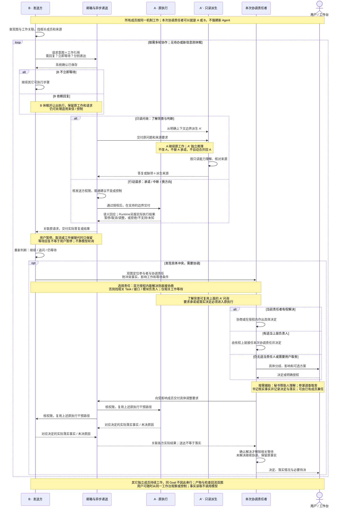

# 编排状态机与执行协议

2026-09-26：跨阶段用户行为与验收场景见 [MVP-BEHAVIOR](../MVP-BEHAVIOR.md)。T2/T4/T9、A3 已按既有白板纠偏同步；未来意图可先入图，无 ready 不代表完成，正式完成不得以空义务或空证据为满足。

状态：2026-09-23 的目标设计；与 [核心数据结构和操作](CORE-DATA-OPERATIONS.md) 配套。本文定义业务选择、核心提交与执行观察之间的行为契约，不声明下文新增能力已经实现，不要求每个状态机各建一个 Module。关键文件与完整接口见[详细骨架](skeleton/README.md)。真实延续需完成Runtime骨架规定的Kernel公开接口扩展及稳定存储映射；原生compact目前为unsupported。

> **2026-09-24 纠偏：** Task 图承担协作白板/历史索引，Agent 决定编排；预期关系和未知语义影响不生成启动禁令。取消所有 Task/Query 统一 scope/reservation 预占前置；具体操作检查适用权限、版本和原子性。下文表格按此解释；更早的资源草案不得直接冻结为代码。2026-09-24 当时关系/候选代码的差异见[审阅](reviews/task-graph-orchestration-intent-2026-09-24.md)。

## 0. 多 Agent 协作、项目判断与状态

2026-09-28：根据用户补充的通信双方、A′ 只读派生与协调责任意见，以及[分享讨论](https://chatgpt.com/s/cx_6aba1c9f70488191a198f921433c82d9)，将原四图替换为下面**一张协作主图**。用户已认可这张图的行为方向；这不等于生产实现或E2E验收完成。当前继续补充 §0.5 的调查、全局判断与决定回流，以及 §0.6 的 Agent 状态/转换表，保留一张主图。已有与缺口见 §0.3、§0.7；AG1–AG5 用场景验共同机制，不各建专用生产流程。

### 0.1 一次通信怎样成为持续协作

**B 是本次发送方，A 是接收方，身份可以互换；A′ 是从 A 上下文派生的只读回答者。** 基本活动视图只保留“工作／休眠”，通信类型不是新 Agent 状态。等待回复、用户暂停、归档等原因与既有 Session/Run/控制事实仍分别保留。

从上往下读同一张泳道图：先看发送方继续/等待，再看只读与干预两条接收路径，最后看冲突如何找到责任者并落实决定。每列是通信参与方，不是新增模块；本次协调责任可以由A/B直接承担，也可以交给适当负责人。递送只做机械处理，不能替Agent作语义决定。

**看图时抓住三个连接：只读问题去 A′；行动承诺与干预去原 A；协调决定也通过同一通信链交付，收到实际落实结果才收口。** 查已保存事实可直接读取，无需派生或调用模型。A′ 的回复返回请求方，不自动并回 A；需要 A 改变工作，另发明确行动请求。

### 0.2 工作、休眠与通信的边界

| 行为维度 | 目标语义 |
| --- | --- |
| 接收方：只读问询 | 由 A 上下文派生 A′，A′ 独立推理和回复；保留源 Session、上下文边界与原请求关联。只读限制其影响范围，不是让 B 代读历史后冒充 A′。A 原上下文和方向不变，也不向工作区写入 |
| 接收方：中断 / 换方向 | 干预须核发送方权限。暂停/取消交给原执行并确认实际结果；换方向把新输入交给原上下文，在支持的边界调整，必要时先停当前动作。普通建议不因消息类型或“上级”称谓自动获得控制权 |
| 发送方：需要回复 / 是否等待 | 两者独立：可要求回复同时继续工作，也可保留原工作及请求后休眠。等待应让出执行、允许适用来信/控制；不依靠常驻模型轮询，双方互等不应阻断来信处理 |
| 回复到达 | 系统负责关联、去重和适用交付，Agent 判断答案够不够、继续还是追问。用户暂停、取消、工作被替代时不自动恢复；原 Run 仍活跃与原 Session 新 Run 接续如实区分 |
| 确认层次 | 消息已保存、已交付、实际答复、相关行动已落实分别记录。传输与执行确认由系统产生，语义回答由 Agent 产生；不增加模型版 TCP 握手。未知不能写成已执行 |
| 并行与恢复 | A′ 是隔离派生上下文，不是在 A 原 Session 同时运行第二个写执行。其它独立成员继续。中断后先核对可获得的原事实，不承诺任意瞬间均有快照，不重跑未知副作用或用随机新 Session 掩盖失败 |

协调事项需能追溯冲突事实、受影响工作、参与者、本次协调责任、等待条件、决定和落实情况；先映射已有 Task/消息/来源关系，不据此立即新增独立状态库。秘书、参谋、书记是按需组合的辅助职责，“本次协调负责人”由具体工作关系与授权选择，不意味着启动四个常驻 Agent。了解背景可问 A′；协商承诺必须进入原 A。

普通工具继续在 Kernel 内执行，由工具维护操作边界；图与正式事实沿原 owner 更新。上图不要求每次工具重新经过 Workflow、全图校验或模型审批。未来意图仍保留；Run 成功、消息回复、协调回复都不自动完成 Task，正式完成仍按既定义务和证据判断。

### 0.3 当前实现与新目标的差异

| 主图位置 | 当前落点与证据 | 判断 |
| --- | --- | --- |
| 双图定位成员与责任 | [发现工具](../../src/core/agent-runtime/session-discovery-tools.ts)、[工作关联](../../src/contracts/core/identity.ts)已有 `responsible / participates / investigated` | 可复用当前开放关联查询；责任关联不自动授予协调决策权，也不是完整升级层级 |
| 保存消息、原请求回执与回复关联 | [邮箱](../../src/core/work-graph/communication/mailbox-service.ts)、[咨询消费者](../../src/business/workflow/consultation.ts)、Runtime 输入观察 | 原消息、回复和实际 `input_accepted` 可关联。accepted 只证明进入执行；消费执行的正式结果也不证明建议已落实或语义正确 |
| A′ 只读派生 | [咨询消费者](../../src/business/workflow/consultation.ts)、Query 的 `sessionBasis` 与 Kernel 历史派生 | 已接隔离子 Session，固定原 Session 已完成轮次的历史边界并保留来源；原 A 可继续工作，不把运行中未完成轮次冒充即时快照。旧 AG2a 原 idle Session 咨询不是这条新路径的证据 |
| 原执行干预、等待让出与回复继续 | [Runtime 控制](../../src/core/agent-runtime/execution-control.ts)、[Workflow](../../src/business/workflow/workflow.ts)、[Host 驱动](../../src/app/collaboration-driver.ts) | Work 的 pause/cancel/resume/steer 已接实际入口；显式等待可 yielded 释放占用，回复沿原 Task/Session 由新 Run 接续。用户暂停不被回复唤醒；Query 不因此取得 Work 控制能力 |
| 独立推进、输入及机械通知 | [Host 驱动](../../src/app/collaboration-driver.ts)、[Host](../../src/app/host.ts)、[注意力观察](../../src/app/attention-observer.ts) | 同 Goal 可显式选择不同 Task 独立推进；配置的普通输入消费者复用原 idle Session Query，忙碌执行用输入安全点。文件/双图变化按显式配置递送，送达不推进处理水位；不存在默认全局语义调度器 |
| 冲突定位、决策交付与落实闭环 | [行为表](AGENT-ROLE-ACTIONS.md)、现有双图、邮箱和正式 owner | 通信与控制机制可复用，但通用决定提交、持续架构修订消费者及完整落实核对仍未接齐；回复不自动采用决定或完成工作 |

历史 AG1/AG2a/AG2b 证据保留原义，原持续通信证据见[AG2b 限定验收](reviews/evidence/agent-behavior-2026-09-28/ag2b/README.md)。本轮代码已导入主仓：工程验证的 15 个文件、134 项检查中 131 项通过，另外 3 项旧 AG2 fixture 迁移后独立通过；真实 DeepSeek 14 次请求、两次让出续接、正式检查/Goal 完成与浏览器原历史复验通过，最终结果统一记录到[共同机制验收](reviews/evidence/orchestration-2026-09-28/README.md)。这不等于整个 MVP 完成。

### 0.4 主图的认可范围与后续实施

审阅观察：A′ 回答时 A 原工作继续；要求承诺确实进入原 A；发送方继续或休眠均能收到适用回复；多轮问询与反问不形成执行互等；冲突能找到有权负责者并确认决定落实；无关工作不被阻塞；用户停止和未知结果不被消息绕过。

用户已认可通信与协调主图，不重复索要认可。最新实施要求是**以整套状态/事件/副作用为实现单位，再统一验收**，不按AG编号、问答次数或单条成功链分步补生产流程。既有owner与Kernel能力统一对账，接通真实派生、让出、输入续接、控制及独立推进；内部编码有依赖顺序，产品契约和完成判断保持完整。具体范围见[统一实现任务](tasks/ORCHESTRATION-common-mechanism-2026-09-28.md)。下方设计细化不是新增能力完成报告，也不因多写一张表就新增管理模块。

### 0.5 调查、全局判断、决定与双图回流

主图回答“成员怎样协作”，项目推进还需要**用户目标／新事实 → 有界调查 → 取舍与决定 → 正式采用及工作调整 → 实际结果 → 再核对整体方向**。这些步骤复用同一通信与执行机制；能由当前成员完成就直接做，不必依次转给秘书、参谋、书记三个不同 Agent。

#### 各职责在什么事件下工作，交付什么

| 职责与触发 | 输入与判断 | 动作、产出及停止条件 |
| --- | --- | --- |
| 秘书：用户提问、表达目标、纠偏或需要掌控进度 | 原始目标、当前计划、双图摘要、待决和正式来源；判断人实际需要理解/决定什么 | 解释、可视化、文档、改进提示词；明确请求交现有入口，真正缺少的语义信息才调查/咨询。说明完成或等待答复后休眠，不把每次沟通升级为计划变更 |
| 参谋：用户/相关Agent明确请求、阶段结果报告，或文件/双图变化达到机械触发条件 | 目标与约束、变更统计及来源引用、相关成员的判断；收到后才判断哪些假设/取舍需要调查 | 先界定未知，再查源码/材料、问 A′ 或做已授权实践；比较方案与 trade-off，形成建议、适用条件、风险及重审触发。证据够作当前决定就收口；缺信息则说明缺项和下一触发，不无限调查 |
| 本次协调责任者：具体冲突、分工或接口约定无法由一方独立处理 | 受影响工作、参与者、责任关联和真实授权；判断谁可以协商/决定 | 沿主图直接协商或交适当负责人；把具体决定交给相关原上下文，核对实际落实。仅相关步骤等待，结束后不保留一个必经协调层 |
| 书记：明确决定、采用回执、成员提交的事实更新、交接或历史核查请求 | 原始发言/消息、Query Answer、版本及回执、实际产物；判断事实/推断/候选/已采用是否混淆 | 核查并整理历史、设计文档、审查材料与派发依据；保留出处、过时说明、未决项和替代关系。缺正式来源就标待核，不能靠摘要批准决定；整理完成或等待证据后休眠 |
| 执行者：明确工作、已允许的后续步骤或适用调整 | 交付要求、当前决定、必要输入与工具权限 | 真实实施、自检、报告结果及具体偏差；需要变更约定时反馈参谋/责任人。工具和 Runtime 回流执行事实；Run 结束不自动完成 Task |
| 审查者：具体审查委托或已采用的独立审查义务 | 被审版本、计划/架构约定、产物与问题来源 | 按委托核对复杂度、架构、计划符合性或实际完成；给有来源的结论和返工依据。范围内结论形成就结束，不把每项调查/决定都强制送审 |

#### 参谋怎样把握全局

全局把握依靠**相关Agent的反馈、双图和文件变化线索，以及触发后的定向调查**。带来源的项目概览是参谋每次实际判断后的整理结果，不是平台持续生成的语义摘要，也不保证始终理解全仓。承担该次判断的成员有明确项目/目标范围；“参谋”不自动取得所有工作的审批权。

| 要持续掌握的内容 | 来源与处理方式 |
| --- | --- |
| 为什么做、不能偏离什么 | 用户目标、范围、明确约束和当前采用计划；保留未细化未来节点，避免只盯当前 ready 工作 |
| 工程的大轮廓与关键边界 | 架构根到相关模块的职责、接口与依赖，以及已知未覆盖/过时部分；不把图当完整源码证明 |
| 当前与后续工作、谁负责、哪里等待 | Task 图的进行中、检查中、失败/阻塞、未来意图及成员关联；按需要查对应 Run/Session 原记录，不搬入所有历史 |
| 已决定什么，依据是否仍适用 | 正式采用版本、关键决定的原始来源、替代关系、未决取舍和重审条件；参谋概览只引用，不另存一份权威决定 |
| 自上次判断后发生什么 | 文件增删行统计、双图结构/状态变化记录，相关Agent的产物/失败/冲突报告及用户纠偏；记录概览实际采用的来源版本和覆盖范围，未看过/未核实的变化明确标出 |
| 哪些地方需要再深入 | 根据目标影响和当前证据选择局部调查、问 A′、委托独立审查或咨询责任人；只有需要承诺/调整才进入原执行 |

冷启动先获得粗粒度概览与当前必要事实，再逐步调查；不以双图完整为前置，也不等待已有项目先产生新改动。之后采用下面的低成本触发方式，替代未定义的“平台发现关键变化”。

| 触发线索 | 机制直接观察什么 | 何时交给参谋 |
| --- | --- | --- |
| 心跳补查 | 原消息/事件位置、文件及图版本、尚未处理的变化和等待条件 | 到期机械检查；发现明确请求、量达到阈值或已有待处理变化超过合并期限时递送。无变化不调用模型 |
| 文件行数变化 | 在项目关注范围内，对明确基线的新增/删除行数、涉及文件/模块；不能只看净行数，同样大小的替换也有变化 | 变化量达到项目配置的数量或比例阈值后，发送统计及diff/文件引用；不预先解释修改语义，不每次扫描重复累加相同diff |
| 双图较大变化 | 相对已处理版本的节点/边增删改数量、涉及模块/Task范围、正式状态转移记录 | 达到配置的数量/比例/范围阈值后合并通知；已明确约定需通知的状态事件可直接递送。“大”是可配置计量，不是平台判断重要性 |
| 相关Agent或用户主动反馈 | 明确提交的调查、接口/约束影响、失败、冲突、决定或纠偏，附实际来源 | 请求无需等待数量阈值。正在工作的Agent利用已有上下文报告小改动的大影响，参谋收到后核对；报告仍是有来源的判断，不自动成为正式决定 |

**阈值决定何时值得看，参谋在收到线索后判断意味着什么。** 一行接口修改可能影响全局，大量格式调整也可能没有设计影响；计数不证明影响大小，低于阈值也不代表无风险。这里不新增一个模型替平台筛选“关键性”。双图只提供已有结构/事实及定位线索，未记录的影响由实际工作者反馈或后续调查发现。

心跳周期、关注文件范围、变化量阈值与最大合并等待已有显式 Host 配置与消费者接线，没有默认全局语义策略。文件按实际内容版本比较新增/删除行，读取未知保留基线；双图读取正式节点、边和状态。通知送达不推进处理位置：需关联实际接受输入的执行及其正式完成结果，再推进对应来源水位；这仍不证明语义判断正确。忙碌时按输入安全点交付，用户暂停不因阈值或心跳自动恢复。具体策略见[行为计划§6](AGENT-BEHAVIOR-PLAN.md#6-对齐注意力与异步感知)，真实模型与界面证据以本轮统一验收记录为准。

一次对齐留下简短的：当前判断、实际依据/版本、已覆盖与未知范围、重要变化、建议下一步及需要人决定的具体问题。沿已有文档/Artifact/Session 保存带来源的材料；它是方便重新定位的概览，正式状态仍查 owner。上下文不够时定向读回或明确交接，不假称自动压缩已可用。秘书把这个结果变成人可理解的视图，书记核对其来源与历史，参谋据此做取舍；三者可由同一成员承担。

#### 调查和决定怎样进入双图与历史

**双图记录工程/工作的正式状态及关联，不替 Agent 作决定，也不需要各存一份完整决策正文。** 参谋给建议，有权的人或 Agent 在既有授权内决定；书记整理依据，正式采用由对应 owner 提交。保存了材料、回复了消息、记录了决定、修改已落实是不同事实。

| 阶段 | 应留的来源与关联 | 正式落点与边界 |
| --- | --- | --- |
| 调查/实践 | 原问题、范围、所读版本、Query/Run/工具观察、备选及未知 | 现有 QueryJob/Answer、Artifact、文件/Session 来源；事实、推断与建议分开。普通小问询不强制创建 Task；会持续追踪的调查可关联已有工作或形成未来意图 |
| 提议与决定 | 原始请求、选项/理由、决定者与授权依据、所选方案、影响范围、未决项和重审条件 | 复用消息/历史/候选/回执及材料引用；提议不自动成为已采用决定。通用决定写入消费者尚未接齐，不能捏造已提交的 DecisionRef；已有明确授权的正常细化不重复请示 |
| 架构调整 | 决定引用、受影响模块/接口/依赖、采用前后版本 | 正式 Catalog/Baseline 及活动指针；源码观测 capture 不是设计采用。只更新相关范围，旧约定及替代来源保留；持续修订的实际消费者仍有缺口 |
| 任务调整 | 同一决定的引用、受影响工作、Plan 版本、分工/输入/义务变化 | 正式 Proposal/PlanRevision 与 Task 关联；当前 Agent 工具仅支持授权内 future-only 修改。已运行工作不能借“整理文档”绕过其控制与变更入口 |
| 决定交付与落实 | 各受影响原 Session/工作、消息请求、实际控制/执行结果、检查和未决原因 | 沿主图交付并核对；两图涉及不同操作时分别保留回执，未提交/未落实部分继续可见，不虚构一个跨对象原子成功或用重跑工具补账 |
| 历史与再判断 | 原决定、后续版本、实际结果、未完成项、过时/被替代原因 | 书记维护有来源文档与索引；参谋据真实变化重审。旧失败与旧决定不删除，摘要不覆盖权威图状态，决定达成不等于 Task/Goal 已完成 |

最小示例：调查发现两个模块的接口约定不一致 → 参谋列出实际来源、影响和取舍 → 双方或有权负责人决定适用约定 → 正式架构修订与相关任务调整分别提交并关联同一依据 → 向受影响原执行交付调整 → 取得实际改动与适用检查后确认落实。若只修正一份说明文档，不需要凭空生成架构修订或新验收义务。

### 0.6 每个 Agent 的状态、标志与转换

**秘书、参谋、书记、协调、执行和审查共用同一套生命周期，不按职责分别造状态机。** “调查中”“写说明”“协商中”是工作内容；“需要回复”“立即等待”是通信意图。基本活动可显示为工作/休眠，但必须由实际事实支持；启动未确认、停止请求中、状态未知不能强塞成“已工作”或“已休眠”。以下是组合展示和目标转换，不新增可独立写入的 Agent 状态库。

#### 状态依据：复用现有正式事实

| 维度 | 当前正式字段/事实 | 用途与不能混淆的含义 |
| --- | --- | --- |
| 身份与上下文 | Session 引用、Kernel 映射、工作关联、当前 executionRef | 定位是谁、在哪个上下文、做哪项工作。角色名称不能代替身份，换 Run 不必换 Session |
| 生命周期与健康 | Session `lifecycle=active/archived`；`health=available/recoverable/unavailable` | 归档与不可用是独立原因；可恢复不等于已经恢复，读取归档历史不激活执行 |
| 占用 | `occupancy=null` 或 `execution/maintenance`，各有原引用与 generation | `busy` 可指执行也可指维护；有占用不证明模型正在思考，无占用也不能推翻仍未核对的旧执行 |
| 实际执行 | Work Run `starting/running/ended` 与 outcome；Query execution `claimed/prepared/entering/entered/unknown/settled` | 启动受理与已进入分别表达。Run失败/取消/成功是本次执行结果，不是 Agent 永久失败/消亡或 Task 已完成 |
| 控制 | ControlIntent `queued/applied/superseded/outcome_unknown` 及实际 `paused/cancelled/terminal_without_cancel/outcome_unknown` 观察 | Work 已接 pause/cancel/resume/steer 与实际执行观察。期望 paused 不代表实际暂停；Query 没有同等公开控制入口 |
| 等待与唤醒依据 | 原请求/回复、工作/Run 引用、等待原因、实际交付/处理位置及控制事实 | 原 Run 的 yielded 终态与 continuation 保存等待关联，后继 Run 记录 consumedWait；回复接入原 Task/Session。Host 句柄仍在内存，持久关联不等于进程重启后自动续跑 |

字段来源：[Session](../../src/contracts/core/session.ts)、[SessionCard](../../src/core/work-graph/sessions/contracts.ts)、[Work Run](../../src/contracts/dispatch.ts)、[Query](../../src/contracts/query-job.ts)、[控制](../../src/contracts/control-intent.ts)。当前卡片 availability 的归约是：archived/health unavailable → unavailable；否则有占用 → busy；否则 health recoverable → recoverable；否则 idle。它是**可用性**，不能直接代替下面的活动状态。

#### 用户看到的状态应该由什么证明

| 展示状态/标志 | 判定依据与保留内容 | 当前实现边界 |
| --- | --- | --- |
| 准备/启动待确认 | 已受理创建/执行、尚无进入或明确未进入的观察；保留原操作与执行引用 | 已有相关 phase。不能因请求已保存就显示工作开始，不能因响应丢失就新建替代执行 |
| 工作中 | 对应执行已实际进入且没有已知终态/停止观察；显示当前 Task/Query、Run及活动来源 | 正式 Work/Query 执行与历史已有；工具等待仍属于这个执行中的等待标志，不是假装模型持续思考 |
| 休眠·待命 | 活跃可用、没有未核对的执行或占用，暂时无适用工作 | 当前 idle 事实可复用；Run结束不证明目标完成，也不自动取消未来责任 |
| 休眠·等回复/条件 | 原工作与等待引用保留，**实际已让出执行**；可处理适用输入/控制 | 当前路径有 yielded 结果并释放占用；存活 Host 等待器或显式 Workflow 请求可沿持久关联接续。只有工具尚在等待、未确认让出时仍显示执行中等待 |
| 休眠·用户已暂停 | 相关停止请求有实际 paused 观察，明确暂停作用范围；原工作/历史保留 | Work 已接真实 pause/resume；暂停中的原执行与已经 yielded 的后继新 Run 接续不同。Query 暂停/恢复没有公开入口，不能复用 Work 的显示声称支持 |
| 停止请求中 | 最新适用控制已受理但未得到实际观察；原实际状态仍可见 | queued 不等于停止。拒绝/不支持就报告并保留实际状态；结果不明显示待核对 |
| 已归档 | 正式 lifecycle=archived；没有可自动启动的当前执行；历史与来源保留 | 正式 archive/reactivate 入口及界面已接；占用中的执行不能借归档清除，读取历史不激活 Session |
| 状态待核对 / 不可用 | 创建/执行 unknown、恢复未确认、明确 health 不可用或读取不足 | 与正常休眠分开显示；不据超时、缺记录或进程失联自动释放占用、判失败或重新启动 |

#### 允许怎样转换，需要什么输入与事实

下表只描述触发时检查相关边界，不是每次工具调用的额外审批；不要求为每一行新增测试或处理器。

| 从 → 到 | 触发及最小输入 | 条件、实际动作与确认标志 |
| --- | --- | --- |
| 未创建 / 待命 → 准备 → 工作中 | 明确工作或适用问询；所选 Session/新建意图、目标/材料及当前授权 | 沿原创建、占用与执行入口。真正 entered 才标工作中；确认未进入可退回待命，可能已进入但不明则待核对，不盲重启 |
| 工作中 → 工作中 | 普通工具结果、适用新输入或已授权改向 | 增量交付原上下文，记录实际消费位置；不中断无关工作。改向须 Kernel 真支持相应边界，否则保留待处理/返回不支持，不伪造生效 |
| 工作中 → 休眠·等待 | Agent 选择立即等待，给原请求/工作、缺什么及唤醒条件 | 保留等待关联并实际让出；得到让出依据才转换。只有进入轮询工具等待时仍显示执行中等待 |
| 休眠·等待 → 准备/工作中 | 匹配回复、所等条件变化或适用来信 | 当前控制允许、原工作仍适用、无未核对冲突执行；沿原上下文交付。原Run接回或新Run接续如实区分；Agent决定足不足够，仍缺信息可再次等待 |
| 休眠·待命 → 准备/工作中 | 已授权新工作、明确请求或符合策略的实际事件 | 核对该事件尚待处理并取得适用执行资格；不因查状态、重复回执或无变化心跳唤醒，不默认新建 Agent |
| 工作/等待/待命 → 停止请求中 → 已暂停或已知终态 | 有权操作者提交 pause/cancel，绑定范围与原执行 | 先受理与投递，后由真实观察更新。未运行的待办可直接停止派发，无须创建Run；已结束保持原终态。取消不回滚历史或已写文件 |
| 用户已暂停 → 准备/工作中 | 明确继续意图，原工作/执行引用 | Work 沿正式 resume 入口恢复受支持的原执行；若原 Run 已 yielded，则显式 resume 解除控制限制后，匹配回复由同 Task/Session 新 Run 接续。不能以新随机 Session 顶替，也不能由普通回复擅自触发 |
| 用户已暂停 → 已知取消结果 | 明确取消受控工作 | 不需要先恢复工作；确认本次取消/停止事实，保留历史。无对应能力时如实报告，不把已受理显示为已落实 |
| 工作中 → 休眠·待命 / 待核对 | 真实终态及结果来源 | 记录本次 outcome并依原事实收尾；确认释放本次占用且可用才待命。取消/失败的工作不会自动重新派发；未知先核对。检查/Task完成是后续独立事实 |
| 待命 / 已暂停 → 归档 | 显式归档意图和交接/保留依据 | 没有未结束执行或占用，需承接的责任已交接或明确处置；正式提交 lifecycle后显示归档。仍占用的暂停执行不能靠归档清除 |
| 归档 → 待命 / 可恢复或不可用 | 显式重新启用请求、原Session映射与当前授权 | 核对原上下文真实能力后更新；成功也不自动恢复旧任务授权。新接任Session须明确为交接，不冒称原Session恢复 |
| 任一相关状态 → 待核对 → 有证据支持的实际状态 | 启动/控制/工具结果不明、进程中断或读取不足 | 按原操作/Run/历史核对；可确认则接回运行、保留已暂停或补已发生结果并收尾；无证据则保持未知，不通过重复副作用探测成功 |

所有职责使用上表，区别在于 §0.5 的工作触发和产出，不在状态枚举。维护占用另显示“维护中”，不假装正在做Task；原生compact仍按实际能力为unsupported。A′是一次隔离派生咨询：源A的引用与上下文边界贯穿其执行，完成后保留答案/来源并结束该次执行，原A状态不因此变化；当前已接子 Session 创建、固定已完成历史边界、只读 Query 与正式 Answer 来源关联；不包含原 A 未完成轮次的即时快照，真实模型隔离效果仍以本轮统一验收记录为准。

### 0.7 本轮补充机制的实现对账

| 机制 | 当前已接部分 | 保留的能力边界 |
| --- | --- | --- |
| 秘书/参谋/书记工作约束 | [秘书](../../resources/skills/platform-secretary/content.md)、[参谋](../../resources/skills/platform-adviser/content.md)、[书记](../../resources/skills/platform-scribe/content.md)资源与AG6装配；沟通、调查/取舍、事实核查已有指令 | 复用角色 Skill 与共同装配；指令加载不等于语义判断正确，也不自动完成决定回流 |
| 调查→初始计划与未来细化 | 正式Query/Answer、[计划服务](../../src/core/work-graph/tasks/plan-contracts.ts)的初始候选与采用、[白板工具](../../src/core/agent-runtime/whiteboard-tools.ts)的future-only修订 | `needs_decision`只返回问题；Agent apply的decisionRefs由平台置空，不能当通用决定登记或修改运行中工作 |
| 架构、政策与决定来源 | [Catalog/Baseline契约](../../src/core/work-graph/architecture/catalog-contracts.ts)、初始采用/读取、CompletionPolicy安装/启用、Artifact和消息来源 | 持续架构修订对外消费者、通用决定提交、适用双图调整与实际落实链未接齐。政策安装不等于激活，正文保存不等于决定已采用 |
| 全局对齐与状态驱动 | 双图/成员查询、A′、yield 后同 Session 接续、Work 控制、archive/reactivate、同 Goal 多 Task 句柄，以及显式配置的文件/双图通知和输入消费者 | Host 句柄不持久，重开后须显式请求沿正式关联续接；无默认角色调度器、Query 公开控制或原生 compact。机械变化通知不代替项目语义判断，处理结果不自动成为正式决定 |

本轮共同机制生产代码已导入主仓，工程检查及旧 fixture 迁移结果见 §0.3；真实模型与界面限定验收已通过：14 次请求、两次让出/回复续接、正式检查与 Goal 完成，错误为 0；刷新及原历史展开未新增模型调用。各职责复用同一执行、通信和控制机制，不新增按角色划分的管理器；通用决定提交、原生 compact、Query 控制和整个 MVP 均未因此宣告完成。

## 1. 设计决定与适用范围

1. 业务策略读取有版本的数据，输出明确意图；核心工具核对并提交操作，执行适配调用 Kernel，实际结果再维护任务、Session、文件与图。普通查询不经过规划、检查轮次或模型审批。
2. 不建设一个全局状态大枚举。Goal/Plan、Task、Run、Session、检查轮次和邮箱各有小状态机，通过稳定引用关联。状态可以再次到达，执行事件只追加；历史因果边指向后继事件，任务前置依赖保持 DAG，通信允许往返。
3. 原 Task phase、Run status/outcome、ControlIntent、PlanRevision 的公开协议尽量复用；本文的“待暂停”“准备中”等界面语义由现有字段组合解释，不能据此顺手重命名全部存量状态。
4. 生命周期决策以延续相关 Session 为默认；新 Run 不自动等于新 Session，不自动触发全量上下文重建。角色配置可复用，不增加永久 Agent 人格或另一套 Kernel 日志。
5. Kernel 负责模型执行、工具安全点、会话恢复与压缩的具体能力；平台保存关联、控制意图与观察结果。适配不支持时明确返回，不把 Fake adapter 的能力当成真实能力。
6. 用户确认目标/重大计划变更的语义仍然保留；已经明确授权的实施、自动放行的计划细化、普通工具事实记录不重复请示。确认的是具体候选版本或明确范围，不把“用户没反对”作为批准。
7. 数据结构维护、索引更新、版本核对和幂等属于核心实现。业务不手动同步多份图，也不逐项重做同一批结构检查。
8. 首版不新增分布式协调器或常驻控制模型。沿用当前宿主、持久待执行记录与按事件触发的驱动；协调者负责已授权范围的正式策略提交，执行 Agent 可以经工具领取已批准工作和直接通信。
9. 同一工作区允许实际范围不冲突的多个写执行。`可选 assessParallelism → Agent/策略修正 → claimTask → 工具执行核对 → 结果更新` 是并行闭环；明确的分工可直接claim，省去单独预检查；检查在核心工具，选择在业务，不保留全工作区单 writer 规则。注释：模块边界只是判断依据，共享文件和命令副作用仍须解析。

依据：[产品主回路（§5.1）](../history/before-2026-09-22/PRODUCT.md)、[连续执行与角色复用](../history/before-2026-09-22/PRODUCT.md#74-连续执行)、[已决人类回复](../history/before-2026-09-22/agent-platform-user-replies-numbered.md)。最新用户讨论明确了“数据结构/原子操作→业务行为→状态机→模块划分”的设计顺序；本文不以旧 Module 数量反推流程。

## 2. 状态对象与不同含义的环

| 对象 | 状态及独立维度 | 哪些信息不放进同一个枚举 |
| --- | --- | --- |
| Goal | 复用 `PLANNING/RUNNING/NEEDS_DECISION/BLOCKED/FAILED/COMPLETED/ACCEPTED_PARTIAL/CHANGE_PENDING/PAUSED/CANCELLED` 的归约展示 | 正式目标正文、活动计划引用、待决变更、控制意图分别保存；Goal phase 不是执行命令 |
| Plan | 候选、采用、拒绝、被后续版本替代；采用是活动版本指针变化 | 人的授权依据与计划结构版本分开；候选不自动改变当前任务 |
| Task | 保留 `pending/ready/running/verifying/blocked/satisfied/failed`；`disposition=active/deferred/cancelled/superseded` | required/optional、work/gate、承担范围、阻塞原因、当前 Attempt/Run 均独立 |
| TaskAttempt | 保留 `claimed/started/ended`，一个业务执行尝试关联一个 Run | 同一次启动前机械重试不创建新 Attempt；返工开始新的执行尝试 |
| Run | 保留 `starting/running/ended` 与 outcome；控制意图独立为 running/paused/cancelled/steered | 排队来自待执行记录；暂停请求不是已暂停；`outcome_unknown` 不是失败已确认或成功 |
| Session | 目标新增正式卡片：`lifecycle=active/archived`；`health=available/recoverable/unavailable` 与 occupancy；由两者派生 `availability=idle/busy/recoverable/unavailable` | occupancy为Run/QueryRun执行或维护Operation的互斥联合，维护也属于busy；availability不单独可写；归档不是删除，压缩不是新建Session；进程不存在不等于不可恢复 |
| 检查轮次 | 复用 `incomplete/rejected/running/interrupted/completed`；结论独立为 PASS/FAIL/INCONCLUSIVE/null | `completed` 只说明本轮处理结束，不保证 PASS；PASS 也不自动代替 Task/Goal 完成 |
| 消息 | 已持久发送、可读取、已确认接收；正式回复关联原请求 | 送达/已读/处理/完成请求不能混为一谈；收件人忙不等于消息失败 |

`ready` 是候选提示，不是自动调度命令或未来无冲突证明。候选查询和领取可复用适用的数据规则，但不得把未知语义相关、计划排序或前驱整体完成当统一门槛。明确输入要求检查具体采用条件；领取维护当前身份、权限、版本及 Session 一致性。工具结果只更新受影响关系和状态。

例如，状态可以反复经过“执行 → 检查 → 失败返工 → 执行”；实际事件仍按因果向前追加为“Run 1 → 检查 1 失败 → Run 2 → 检查 2 通过 → 完成提交”。这不要求在任务依赖图里添加回边。

任务可以保持同一身份，新增 Attempt/Run/检查轮次即可表达返工；若范围和验收义务发生变化，则通过计划版本处理任务替代。不得为表达返工在同一任务依赖子图中加回边。并发事件以因果引用、对象版本和各流序号排序，UI 可提供全局显示顺序；不以机器时间戳假装所有事件都有先后因果。

## 3. 所有转换共用的提交与执行规则

### 3.1 输入、回执与事务边界

操作名采用 [核心操作](CORE-DATA-OPERATIONS.md) 的 camelCase 术语。下表中出现的内部组合函数可以复用现有端口，不要求全部暴露为模型工具。

每个写意图包括：操作身份/幂等键、操作者与授权范围、目标对象、必要的预期版本、参数及结果来源。读操作返回资料范围、实际来源版本和续读游标。业务策略只携带它依赖的版本，不把全仓每个对象版本都装入命令。

核心回执区分：已提交、同一操作的原回执、冲突/已过期、非法转换、不支持、暂不可用。涉及外部执行时，再返回持久操作引用与执行阶段，明确区分“已受理”和“已执行”。具体字段由核心操作契约统一，本文不新增第二套回执协议。

| 情况 | 核心行为 | 允许的后续动作 |
| --- | --- | --- |
| 同幂等键、同输入重复 | 返回原结果；不再写关联、不再投递、不再启动 | 调用方读取操作进度 |
| 同幂等键、不同输入 | 拒绝冲突 | 业务明确这是新操作后使用新身份 |
| 依据已过期或抢占失败 | 不提交该业务变更，不调用 Kernel | 只重读受影响对象，重新判断；不无条件重放旧决定 |
| 事务内写入失败 | 回滚任务、占用、意图及必要关联 | 可以按同一操作重试 |
| 提交成功、执行尚未进入 | 驱动从持久待执行项继续，同一身份交付 | 确认尚未进入 Kernel 后才重试启动 |
| 是否进入 Kernel 不明 | 保留待核对状态/执行占用，调用恢复查询 | 找到同一 Run 则接回；无法确认则报告 unknown，不盲目再次启动 |
| 已有工具副作用、结果写入失败 | 保存/恢复原始结果引用，再按同身份入账 | 不能为了补账重新运行原工具 |
| 索引尚未更新 | 返回读取水位或直接读受影响的正式记录 | 不要求等待无关索引；精确写入判断不依赖旧索引 |

目标不是宣称外部副作用“恰好一次”。能保证的是一次有效受理、重复身份去重、可确认的执行结果不重复入账、未知情况不伪造终态。数据库事务不包住模型或命令执行。

多驱动者消费同一意图时，授权先绑定唯一consumer/entryGeneration，真正调用Kernel前再fresh-commit beginRuntimeEntry；只有新提交且replayed=false可以实施该次调用。此时是“可能已进入”，不是已观察到模型运行；实际Kernel观察到达才recordExecutionEntered。缺日志、超时和旧consumer失联均不能单独证明没有执行。Session占用代际与消费者入口代际分开，完整接口见[WorkGraph §6.3](modules/core/work-graph.md)。

### 3.2 驱动模式

一次驱动处理：读取已变化对象 → 更新必要派生结构 → 有明确机械续办动作则直接执行 → 有业务取舍时调用对应策略 → 提交意图 → 等待真实结果。没有变化不重新调用模型、重扫图或反复装配材料。

这里需要业务选择的驱动由Host/Workflow承接；AgentRuntime只消费已受理意图、处理确定性的执行和恢复，并返回结果或待决原因。WorkGraph不回调AgentRuntime/Workflow。执行通过`prepareExecution → startRun/continueSession`消费已有领取；维护用`compactSession/regroupSessions`受理操作后执行；控制用`setRunControl → Runtime.applyControl`。各路径均在Kernel实际实施后向WorkGraph记录观察，不能在WorkGraph事务内调用Kernel。

Session 历史读取明确分两段：WorkGraph 查询平台关联和历史引用；AgentRuntime 的 `readSessionHistory` 通过 Kernel Store 只读桥接取原记录，不创建 Run、不启动模型。Workflow/Host 可以组合这两类查询；WorkGraph 不能为打开 Kernel 原文注入一个反向 Runtime 依赖。已保存的平台 Artifact 则由 WorkGraph 的正文读取能力直接提供。

`need_user_input`、材料暂缺、依赖未完成、Session 忙分别记录原因与唤醒条件。普通外部信息等待不占用持续模型运行；不因等待自动建新 Session。查询不要求调用正在繁忙的写入 Session：可直接读持久记录，必要时向其邮箱提问并明确回答尚未到达。

## 4. Goal 与 Plan：目标、草案、确认、变更

下列转换表中“失败/恢复/无副作用”包括没有进入执行时不得创建 Run、修改工作区或隐式改变活动图的要求。只读探索可以在用户已授权的调查范围内进行；初始化目录等写入需要在当前授权范围内，首个 baseline 不作为探索或形成草案的前置条件。

| 转换 | 进入条件与输入 | 业务选择与核心操作 | 成功后的状态/关联 | 失败、恢复与无副作用 |
| --- | --- | --- | --- | --- |
| G1 接收目标 | 用户给出目标、范围或具体实施指令 | 交互业务整理已明确内容；`createGoal` 保存意图与原始输入引用 | Goal 进入规划；已有明确实施授权作为范围记录 | 缺必要信息只生成待决项；不默认开始未授权执行。重复输入返回原 Goal/提议 |
| G2 调查与草案 | 目标存在；材料和约束可读取；允许没有正式架构 baseline | 业务用 `readWorkspace/queryArchitecture/readSessionHistory` 和必要研究工具；`proposePlan` 保存候选 | 候选引用目标版本、任务义务、关系、假设和变更范围；活动计划保持原状 | 查询失败保留缺项和已有材料；不以空白材料伪造计划完成，不因下一轮追问重新取全部材料 |
| G3 反馈/解释/修订 | 用户针对某候选或已有方案反馈 | 解释复用候选和来源；变化时再次 `proposePlan`，形成新候选版本 | 历史候选可回查；待确认对象指向具体新版本 | 纯解释不生成新方案、不改图；过期反馈可记录，采用前重新核对当前版本 |
| G4 采用计划 | 人已确认该候选，或细化明确落在既有自动放行授权内；依赖 DAG 和义务有效 | 正式策略提交者调用 `applyPlanChange`；核心校验结构、依据及授权 | 原子切换活动计划、任务与正式关系；更新就绪索引；需要时进入运行 | 版本冲突或越界不部分应用；返回具体差异。不得把每次领取/工具结果当成重新确认点 |
| G5 执行中改目标/计划 | 用户直接修改，或 Agent 提出超出当前授权的具体变更 | 先形成候选与影响说明；用户已直接授权的内容可执行 `updateGoalIntent/applyPlanChange`，否则进入待决 | 改变相关计划/义务，标记受影响旧 Run 和证据；未受影响工作可以继续 | 只暂停/取消受影响工作，且等 Kernel 确认；候选阶段不能偷偷使旧计划失效；旧结果按旧版本归档 |
| G6 完成或部分接受 | 当前 required 任务/义务/检查满足，执行副作用已知；部分接受有明确取舍依据 | `completeGoal` 内部复用完成归约；人部分接受与完整完成分开 | `COMPLETED` 或 `ACCEPTED_PARTIAL`，保留理由与证据引用 | 无活动计划、缺义务、未知结果或 required 被取消不能自动算完成；归约重复无重复完成事件 |
| G7 暂停/取消目标 | 人或已授权策略要求目标暂停/取消 | 核心先阻止新领取，再对相关 Run 调 `requestRunStop`；记录范围 | 期望状态立即可见；每个 Run 的实际状态随确认更新 | 某 Run 无法暂停/取消则明确显示 unsupported/unknown；不能在 UI 显示全已停。取消不撤销已写文件、不删除历史 |

已授权范围内的普通图来源更新、任务状态更新、消息和检查结果不属于重新制定目标。架构采集观察更新与正式架构约定变更分开处理：前者由工具事实维护，后者走相应已授权变更操作。

例如，人已要求“修复这个问题并验证”，为完成该要求建立调查/实现/验证任务属于已授权工作的细化，无须再等待一次同义确认；若方案新增无关功能、改变验收目标或要求未授权副作用，则确认具体差异后采用。产品主回路中的“确认唯一生效点”约束尚未授权的方案，不能被实现为所有自动推进都再过一轮审批。

## 5. Task：领取、依赖、并行、返工与完成

| 转换 | 进入条件与输入 | 业务选择与核心操作 | 成功后的状态/关联 | 失败、恢复与无副作用 |
| --- | --- | --- | --- | --- |
| T1 查询就绪 | 目标允许推进；指定计划/任务范围 | `queryReadyTasks` 返回候选、阻塞和依据；策略选择任务及候选 Session | 只读；必要时核心增量刷新 ready 缓存 | 旧索引不得发放执行许可；不能因当前无 ready 就宣告目标完成 |
| T2 领取 | Task 在活动计划中、active、当前分配与执行请求有效；Session 可用 | `claimTask` 核对真实身份、授权和局部版本，一次正式提交任务/Session、Attempt、Run 意图及占用；具体已采用输入条件按消费点检查 | 已领取、Run 待启动；当前任务/Session 关系可查询 | 同一 Task/Session 竞争只有一个有效提交，失败无部分 Attempt/Run；不要求完整未来范围证明或等待生产者整个 Task 完成 |
| T3 开始执行 | 领取有效；相关版本/权限仍有效；输入准备完成；无暂停/取消 | `startRun` 或选中 Session 的 `continueSession`，先登记启动再进入 Kernel | Kernel 确认后 Run running，Task running；记录本轮实际输入和 Session 引用 | 输入不足可重试准备，无模型调用；进入状态未知则核对原 Run，不能新开一个掩盖失败 |
| T4 并行推进 | Agent/策略已选独立工作，符合各自当前执行资格 | 按需要查询已有范围/结构事实再修正分工；可直接分别 claim；预测影响不升级为统一资源预占，具体工具处核实际冲突 | 同一工作区多个 Session/Run 推进，真实结果局部回流；只对相关冲突步骤协调或等待 | 不按模块/工作区机械串行；不同模块仍可能冲突。查询不是执行许可，一项失败不回滚其他独立领取；目标 assessParallelism 未装配时不得假称已有 |
| T5 接收执行结果 | Run 的实际工具/终态可核对，有顺序与版本 | `recordRunResult` 保存来源；必要时 `captureSourceChanges` 更新受影响结构 | Run ended；结果、文件版本、任务和 Session 关联更新；Task 进入 verifying 或记录失败/阻塞 | Run completed/exitCode 0 不等于 Task satisfied；重复事件不重复追加事实；旧计划结果保存历史但不推进新计划 |
| T6 进入检查 | 有待验收产物、当前版本及既定要求 | `openVerification` 冻结检查范围和要求；进入 §7 | Task verifying；检查引用这次产物版本 | 普通查询/普通事实记录不创建验收轮次；缺材料明确列出，不猜通过 |
| T7 失败后返工 | 检查 FAIL 或执行失败，已有具体缺陷；义务仍适用 | 策略选择补做、换工具、换 Session 或修改计划；同义务返工可 `requeueTask` 后重新 claim | 原 Task 保留身份，phase 回到 pending/ready，新 Attempt；旧失败和检查保留 | 不把 failed 改成 satisfied；结果未知先恢复核对；范围/验收改变走 G5，不能借返工消除义务 |
| T8 阻塞与解除 | 明确材料、决定、依赖、运行恢复或资源阻塞 | 核心保存 blocker 和唤醒依据；条件变化后重新计算资格 | blocked→pending/ready，或继续 verifying；不丢失原执行记录 | 收到普通消息不自动解除硬依赖；没有新依据不重复启动相同失败动作 |
| T9 完成任务 | 当前非空完成要求有适用证据覆盖，相关执行状态已知，版本一致 | `completeTask` 复用核心归约，核对覆盖、来源和局部提交条件 | Task satisfied；刷新相关任务/输入条件与 Goal 进度，唤醒业务选择下一动作 | 缺定义、缺检查、过期证据和未知副作用均不能完成；不把完成事件作为所有后继的统一启动闸门，不全图重算 |
| T10 取消/替代/延期 | 有相应授权及影响说明 | `applyPlanChange` 更新 disposition；相关运行需 `requestRunStop`，真实终态由 `recordRunResult/reconcileRun` 归约释放 | Task 历史保留；替代关系显式；required 义务仍由活动计划解释 | 删除节点不能抹掉未完成义务；取消请求未确认前不能释放正在写的运行占用 |

`releaseTaskClaim` 只撤销已证实未消费启动资格/未进入的领取；已执行的实际终态由 recordRunResult/reconcileRun 同事务归约和释放，不再另走一遍 release。单凭超时不能把仍可能写入的 Session/工作区资源转交给另一个 Run。独占范围按当前可证明的隔离能力实现，不要求为此引入分布式锁。

Workflow先选择/创建Session、调用`claimTask`或`beginQueryExecution`获得admission，再调用Runtime的`prepareExecution → startRun/continueSession`。`continueSession`消费已有领取，不在内部再claim。普通文件/状态/历史读取不伪造Task或Run；需要模型作答时使用真实QueryRun，其查询能力不会自动变成任务写权限。

## 6. Session 与 Run：延续、重组、控制和恢复

### 6.1 选择、准备与生命周期

| 转换 | 进入条件与输入 | 业务选择与核心操作 | 成功后的状态/关联 | 失败、恢复与无副作用 |
| --- | --- | --- | --- | --- |
| S1 找候选 | 新任务/返工需要执行；任务、模块和历史范围已知 | `findSessions` 查询关联和能力，业务优先选相关 Session；不要求模型每次重新搜索全图 | 候选含关联依据、忙闲、来源版本与可恢复性；选择本身只读 | 无候选可以新建；busy 是等待/另选的依据，不能并发写同一 Session |
| S2 新建 | 无适用 Session、需独立研究/审查、明确隔离或原会话不可用 | `createSession` 带角色/Skill 版本、预期任务关联和创建身份；先受理创建操作、再桥接 Kernel ID，不要求此前已 claimTask | 完成映射后 Session active/idle，平台引用与 Kernel 引用可追溯；准备中只表示创建操作进度，不视为可领取 Session | 创建响应丢失按同身份查找/重试；不创建第二会话充数；不启动模型、不自动复制全 transcript |
| S3 延续 | 所选Session可用，任务相近，权限/角色适用且成功占用 | `prepareExecution`准备新增要求/变更/必要引用，再由`continueSession`进入Kernel；历史由Kernel按绑定边界处理 | 保持Session身份，新增Run与实际输入记录；活动关系更新 | 前缀/角色变化重新核对；平台不全量复制历史或重复实现Context选择 |
| S4 压缩 | 实际容量/结构需要整理，Kernel 支持，当前处于可安全操作点 | 策略选择压缩；`compactSession` 调 Kernel/现有能力，保存原记录引用和压缩版本 | 同一 Session 的压缩记录可追溯；义务、未知项、来源和新旧授权区分保留 | 压缩失败保留原可用状态；不能删除原记录后才验证结果，不把推断提升为事实；不可与进行中的写入交叉 |
| S5 重组/拆分/合并职责 | 当前会话承担范围不合适，或需要独立并行；有具体交接和后续责任 | `regroupSessions` 组合原语：准备交接→建立接任 Session→在相关状态一致时切换活动承担关系 | 新旧 Session/任务/模块有明确 successor/handoff 关联；只保留当前真实负责人 | 这是可恢复的多步操作，不宣称跨 Kernel 原子事务；新会话失败则原关系不切换；切换前旧写者必须停妥。旧历史不复制成新“原始记录” |
| S6 归档 | 没有活跃 Run、占用、未接手责任或未处理的必须交接事项 | `archiveSession` 退出活跃选择，记录原因 | lifecycle archived，身份、记录、产物和索引保留；图显示历史承担关系 | 活跃工作拒绝直接归档；不删除模块、Task 或 Skill；不为归档重读全部历史 |
| S7 重新启用 | 历史 Session 仍有价值、当前能力/授权适用 | `reactivateSession` 核对真实恢复能力；必要时执行 S8 | 可以真实恢复则 active/idle；否则建立 successor 并保留 archived 原记录 | 不将“创建新会话读取摘要”称为原 Session 恢复；不自动恢复旧任务授权 |
| S8 进程重启/会话恢复 | 平台或Kernel中断，有待处理运行/会话引用 | Runtime.reconcile查询原Kernel状态并向WG.reconcileRun补账；真正可恢复时沿原Run恢复；新Run接续需另受理 | 分别记录原Run恢复、结果回收、新Run接续或unavailable；更新受影响关联 | 不重建第二套Kernel checkpoint/log；旧写者未确认终止不启动冲突写者；只核对活跃/未完成引用 |

“图/Skill/记忆装配”由`prepareExecution`的材料读取及Kernel输入适配承担，输入为已领取执行、当前任务和推荐来源；默认只给必要资料与检索入口。推荐范围不是新的硬读取权限，权限仍由实际能力/授权和既定Skill约束。记忆读写可作为普通工具，不要求每次Session延续整理知识库或建立长期领域专家身份。

### 6.2 运行控制：期望与实际分开

| 转换 | 进入条件与输入 | 核心操作及业务责任 | 状态更新 | 失败/恢复/不发生副作用 |
| --- | --- | --- | --- | --- |
| R1 请求暂停 | 有待启动或运行中的工作；指定范围和原因 | `requestRunStop(kind=pause)` 保存期望；驱动停止新启动并投递 Kernel 控制 | 先显示 pause_requested；安全点确认后才显示 paused | Kernel 不支持则返回 unsupported；既有执行仍未确认暂停。排队项可直接暂停，不创建 Run 来接收暂停 |
| R2 请求取消 | 已授权终止指定工作 | `requestRunStop(kind=cancel)`；禁止该范围后继派发 | cancel_requested→实际 cancelled/其他已知终态 | 已完成时保留 completed，不改写成取消成功；写入文件不自动回滚；确认未知保留 unknown |
| R3 恢复 | 已确认暂停，控制意图未被更近取消/变更替代 | WG.setRunControl受理resume；Runtime.applyControl核对能力后恢复原Run | 控制期望running，实际确认后显示运行 | 不支持明确拒绝；核对当前任务/计划；不能把新Run接续称为原Run恢复或以受理回执显示成功 |
| R4 运行中补充指令 | 指令在原目标范围内，绑定具体 Run/Session | 复用 control steer/消息投递，在 Kernel 支持的边界加载 | 记录指令摘要、实际投递游标与确认 | 改目标/验收条件必须 G5；过期 ack 不能覆盖较新指令；重复投递不能重复插入 Context |
| R5 终态与迟到事件 | 有 Kernel 终态或恢复观察，绑定 Run 和事件序号 | `recordRunResult/reconcileRun` 核对并提交 | 正式 outcome，清理本 Run 可释放占用；刷新相关任务/Session | 终态后的重复观察返回原结果；冲突终态留待核对，不以最后收到者直接覆盖；旧 Run 事件不修改继任 Run |

## 7. 检查、语义判断与完成

| 转换 | 进入条件与输入 | 操作 | 成功状态 | 失败、恢复与无副作用 |
| --- | --- | --- | --- | --- |
| V1 建立轮次 | 已有产物身份、目标/计划版本、既定验收要求 | `openVerification` 冻结检查定义、覆盖关系与来源版本 | 轮次 incomplete 或 running；单项有独立 requestId | 缺来源/定义返回缺项；不创建“空 PASS”；检查选择只覆盖必要范围 |
| V2 单项执行与记录 | 检查未完成、依据仍适用、有执行权限和必要占用 | 具体检查工具执行，`recordCheckResult` 存报告/观察/来源 | 单项 PASS/FAIL/INCONCLUSIVE；报告保留 | 测试失败与工具未能执行分开；未知副作用先 reconcile，不为了生成报告再次跑命令 |
| V3 语义审阅 | 正式要求包含人工/独立审阅；有当前资料 | 业务选择合适 Reviewer，读取必要资料后提交具来源的判断 | 该义务有语义结论与依据 | 没要求独立审阅时不强制新增 Reviewer；被审查者自述不自动满足明确要求的独立审阅 |
| V4 汇合 | 已登记检查均有已知结果或明确缺项 | `finalizeChecks` 核对覆盖和版本，生成本轮结论 | 所有必要结果通过才 PASS；明确失败为 FAIL；缺项为 INCONCLUSIVE/未完成 | 两个 PASS 不能掩盖第三项缺失；来源过期不挪用到当前产物，不静默扩大检查集合 |
| V5 提交完成 | V4 的适用结果覆盖当前义务且当前状态可提交 | `completeTask`，必要时 `completeGoal` | 任务/目标归约；更新直接后继就绪状态 | 检查 completed≠Task satisfied；版本冲突只重读相关依据，仍适用的结果可复用，不能无理由重跑全部检查 |
| V6 中断后恢复 | 轮次 interrupted，存在单项执行记录 | 读取原记录，先核对未决执行，再只补未执行/过期项 | 同轮次恢复或明确新版本轮次，原报告保留 | 不重跑已确认适用项；不能以“恢复”名义重复未知副作用 |

验收条件由业务/产品规定，适用性和覆盖检查由共同核心实现。角色模板中的建议产物，不自动升级为所有任务的必需验收项；工具不替业务发明新门槛。

## 8. 邮箱、咨询与协作

| 转换 | 进入条件与输入 | 操作与策略 | 状态更新 | 失败、恢复与无副作用 |
| --- | --- | --- | --- | --- |
| M1 发信 | 收件地址存在；主题、关联 Task/Session/版本明确 | `sendMessage`，正文有界，大份产物用引用 | 消息持久化并加入收件索引；返回 messageId | 重复发送同身份不产生第二消息；不直接改任务依赖或启动模型 |
| M2 读取 | 收件人按游标查询；可以繁忙、空闲或归档 | `readInbox` 提供增量消息；普通状态查询优先直接读数据 | 读取游标/实际加载记录按需要保存 | 已读不等于处理；忙时不把全文反复插入运行中 Session；历史可读不等于会话已重启 |
| M3 接收、处理与回复 | 消息关联仍适用；接收方具备处理范围 | `ackMessage` 仅确认接收/已读；业务处理后用 `respondMessage` 提交正式回复，暂缓时保留等待 | 接收确认与请求响应分别记录；回复关联原请求并推进适用等待 | 不知道时明确缺项，不伪造来自原 Agent 的回答；读取/接收确认不能解除等待或算请求完成；正式响应重复入账去重 |
| M4 需要正式前置条件 | 咨询结果被判断为任务执行必需输入 | 策略以 `applyPlanChange` 或正式 blocker 操作明确建立条件 | 被批准的任务依赖/阻塞生效，必要时检查 DAG | 一条“请回答我”的消息不会自动成为 dependsOn；无授权时只形成候选 |
| M5 超时/失联/重定向 | 消息未处理，原 Session 不可用或等待失去意义 | 确定性检测提醒策略；选择查持久记录、转交、取消等待或请求决定 | 明确 routing/等待处置记录；原消息保留 | 无新证据不增加监督模型链；不得仅为轮询邮箱常驻调用 LLM |

多人意见可并行产生；正式计划/角色分配变更仍按当前已授权的提交责任执行。成员领取一个已批准 ready 任务，可以是核心工具的确定性提交，不要求协调者逐次人工式批准。

## 9. 有反馈而无进展的处理

时间线增长只能证明发生了事件。每次业务决定保存：相关输入版本、待解决问题、选定动作、预期能获得的新信息/变更和停止条件。无需另建全局“聪明度评分”或给用户新增任意 Token 预算。

| 再次触发时发现 | 处理 |
| --- | --- |
| 同一动作、同一来源版本、同一已知失败，且没有新输入 | 不自动再次执行；返回已有失败与“没有新依据”的业务解释，策略换方法或等待条件变化；这不是另增通用 CoreError |
| 失败是明确可重试的暂时故障，且未进入外部副作用 | 使用已有配置的重试/退避规则；同操作身份重试，不新增 TaskAttempt |
| 已运行但结果未知 | 先 reconcile；不能以重试计数掩盖可能仍在执行的旧 Run |
| 返工有实际修改、变更策略或新证据 | 新 Attempt，链接原问题和改变的依据；可继续同 Session |
| 多轮讨论没有新证据，只重复意见 | 由现有负责人采用一个方案或记录真实待决事项；不再加一层监督者 |
| 真正超出已授权范围或存在无法自主处理的取舍 | 展示具体方案、影响和推荐后向人提出一个可回答问题；不重复确认已授权动作 |

动作去重依据应局部且可解释，例如“问题引用＋源版本＋操作/参数摘要”。它不能把有新输入的合法重试误判成重复，也不新增所有请求都要计算的全仓指纹。

## 10. 现有代码复用与缺口

本节是 **2026-09-23 旧工程迁移对照**，保留当时路径与判断供追溯；下面的“当前”“新增”指当时，不能用来判定独立仓库今日缺失。2026-09-28 的有限源码对账见 §0.3，完整当前落点见 [IMPLEMENTED-CAPABILITIES](IMPLEMENTED-CAPABILITIES.md)。

| 行为 | 可复用实现 | 迁移/补齐要求 |
| --- | --- | --- |
| Task 维度与依赖语义 | [contracts/plan.ts](../../coding-platform/src/contracts/plan.ts) | 保留 phase/disposition、parentOf 与 dependsOn 区分；优化索引不改变语义 |
| 资格和原子领取 | [task-eligibility.ts](../../coding-platform/src/control/control-engine/policies/task-eligibility.ts)、[claim.ts](../../coding-platform/src/control/control-engine/claim.ts) | 当前资格实现包含计划/边数组扫描；迁移到共享索引和同事务核对，避免读查询与领取各写一套规则 |
| 受理后启动、重复交付防护 | [dispatch-engine.ts](../../coding-platform/src/control/dispatch-engine/dispatch-engine.ts)、[dispatch.ts](../../coding-platform/src/contracts/dispatch.ts) | 保留 outbox-before-side-effect 和启动身份；去掉每次 Run 必经全量材料编译，接入 Session 延续选择 |
| 暂停/取消/补充指令与期望分离 | [control-intent.ts](../../coding-platform/src/contracts/control-intent.ts) | 保留迟到 ack 防护；按真实适配能力接线。Fake 生命周期/恢复 adapter 仅作契约样本，不作产品已完成证据 |
| Kernel 执行 | [coding-agent-runtime.ts](../../coding-platform/src/execution/worker-runtime/coding-agent-runtime.ts) | 当前注册 Run 时生成随机 Session ID；目标要采用平台持久引用与 Kernel Session 映射，不能只改图标签宣称复用 |
| Task/Goal 完成归约 | [task-reducer.ts](../../coding-platform/src/control/control-engine/task-reducer.ts)、[goal-phase.ts](../../coding-platform/src/contracts/goal-phase.ts) | 复用已存在的完成规则；普通操作不强制走完整归约链，相关状态变化时增量触发 |
| 检查覆盖与中断恢复 | [verification-rounds.ts](../../coding-platform/src/control/verification-engine/verification-rounds.ts)、[verification-round.ts](../../coding-platform/src/contracts/verification-round.ts) | 保留缺项/FAIL/未知状态语义；正文读取去除与模型 Context 编译的无关耦合 |
| 通信与正式任务关系 | [coordination.ts](../../coding-platform/src/contracts/coordination.ts)、[mailbox-view.ts](../../coding-platform/src/control/control-engine/coordination/mailbox-view.ts) | 复用已实现投递/去重行为，简化普通消息路径；通信不自动升级为完整调度变更 |
| 持久提交 | [sqlite-ledger.ts](../../coding-platform/src/data/state-ledger/sqlite-ledger.ts) | 复用事务、幂等和版本提交；新增 Session 正式卡片及关联应与相关状态原子更新，正文仍可独立存储 |

新增语义操作 `createSession/compactSession/regroupSessions/archiveSession/reactivateSession` 是需落地的目标，不凭本文认定已有。`openVerification/finalizeChecks/requeueTask/releaseTaskClaim/completeGoal` 等可以首先作为已有处理器的明确能力入口，不以新名称为理由复制旧实现。

## 11. 最小验收场景与可观察结果

这里的“最小”指覆盖必要行为的场景集合，不指只补一个绕开重构的临时闭环。代码实施时优先复用现有集成测试，补真实缺口；不为每个表格格子编写镜像测试。

| 场景 | 必须观察到的结果 |
| --- | --- |
| A1 同一模块连续实现→测试→返工 | Session ID 保持；Run/Attempt 分轮；只加入增量输入；旧失败保留，最终满足才完成 |
| A2 同任务/Session 领取竞争与实际工具冲突 | 同一 Task/Session 竞争只有一个有效提交与启动，失败无部分 Attempt 或占用；不同 Session 的已知共享写冲突在具体操作处处理，不统一禁止两个 Run 启动。此前独立创建的闲置 Session 不因领取失败删除 |
| A3 具体产物输入与普通消息 | 已采用的必需输入缺失时，依赖该输入的动作明确等待；消息往返/已读不绕过条件。输入已合法满足而生产者 Task 尚未整体完成时，不机械阻塞；预期关系不自动成为硬前置 |
| A4 领取/发信/记录结果重复与响应丢失 | 同身份得到原回执；Kernel 启动、消息和结果写入次数不增加 |
| A5 计划在准备/执行/检查期间变化 | 受影响新启动被拒或重算；已发生结果按原版本保存；旧 PASS 不完成新义务；无关任务无需全局停止 |
| A6 无 baseline 新项目 | 可调查、形成草案和在授权范围内创建目录；正式计划生效前不误触发未授权工作；不会循环要求一个尚不存在的 baseline |
| A7 pause/cancel 支持、拒绝、迟到 ack | 请求与实际分别显示；不支持明确；迟到旧 ack 不覆盖新控制；取消不自动撤销文件修改 |
| A8 重启发生在启动前/启动响应丢失/结果入账前 | 前者可安全续办，中者核对原 Run，后者补原结果；无重复副作用；无法确认如实 unknown |
| A9 压缩、重组中途失败与归档再启用 | 原记录可读；未成功交接不换负责人；实际恢复与新会话接续区分；未决事项和现行授权不丢失 |
| A10 检查有两 PASS 一缺项，或检查执行中断 | 不完成任务；恢复只处理未决/未执行项，不能重复未知命令 |
| A11 连续收到相同失败且无新依据 | 不无限创建 Attempt/模型调用；明确进入等条件、换策略或真实待决 |
| A12 查询与分页、状态更新性能路径 | 一次捕获对应同一续读来源；已知引用直读；局部变更只刷新受影响索引；普通查询无模型规划/验收前置 |

性能验收记录本场景的结构读取次数、全文捕获次数、历史正文加载量、Kernel 启动次数、上下文增量与持久写入量；这些指标说明机制是否去重。端到端时延另行测量，不根据 Module 数量或代码行数直接宣称性能提升。代码精简验收比较旧流程删除量、重复判据和调用跳转是否减少，不仅统计新增文件数。

## 12. 实施顺序

以下保留早期迁移顺序作为历史实施索引。**§0 主图已获用户认可，共同机制代码已导入主仓；本轮有界真实模型/界面验收和证据记录已完成，不重复索要审图批准，也不按此旧清单自动派发新的施工。** 现阶段工程结果与明确限制见 §0.3、§0.7 和[统一验收记录](reviews/evidence/orchestration-2026-09-28/README.md)。

1. 固定核心操作的读取依据、回执和写入约束；以现有状态协议作兼容映射。
2. 补正式 Session 引用、Run 关联及索引，贯通查候选→占用→增量延续→结果记录；复用原 Kernel 和事务机制。
3. 将执行驱动改成上面的“已受理→实际执行→结果确认”，统一暂停/恢复与接续；删去旧重复准备路径。
4. 将架构读取、查询、差分与普通消息移出不必要的规划/上下文编译/验收链；完善受影响结构的增量维护。
5. 接入任务返工、检查恢复和目标完成；按 A1–A12 覆盖交叉故障路径。
6. 依据共同实现与变化边界落地 Module 图。本文状态机之间有业务反馈，不代表代码模块必须互相 import；组合根/应用流程通过端口调用核心能力即可。
