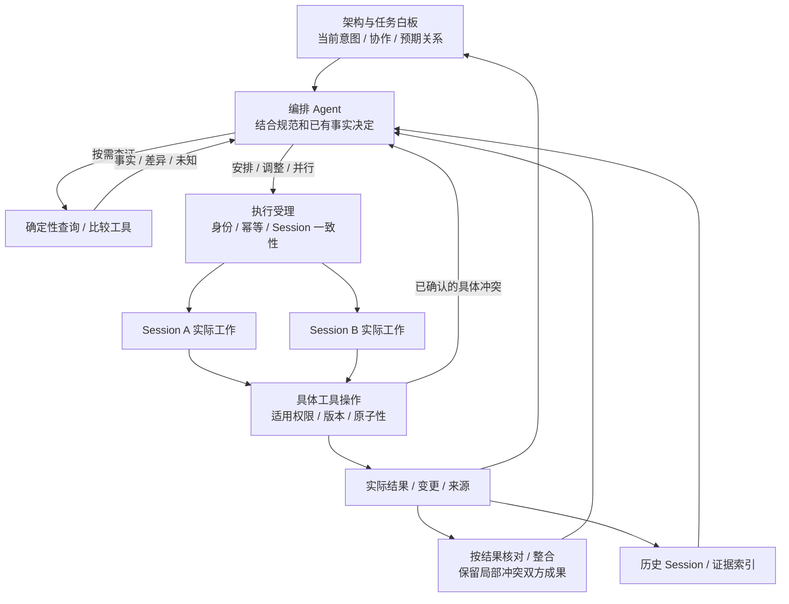
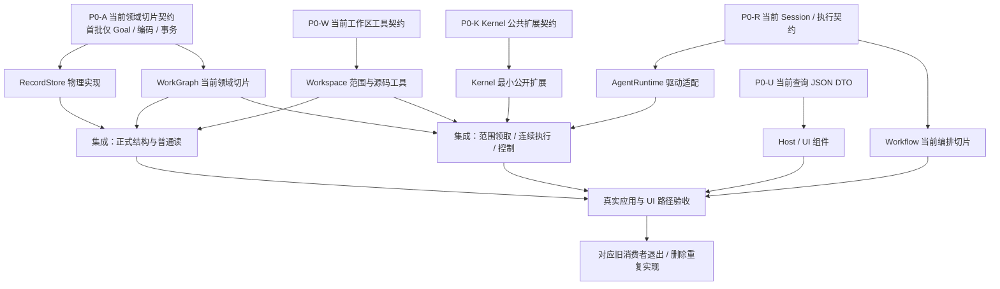

# 并行协作接口审阅与结构图

更新：2026-09-24。状态：§1、§3 为最新意图；§2、§4–5 的统一范围预占协议已撤回为普遍执行前置，保留审计，不能按旧代码块直接施工。真实执行/合并尚未交付，具体源码状态以逐批验收为准。模块仍是 5 个、允许源码依赖仍是 8 条，见 [module-dag](module-dag.md)。

## 1. 用户已确定的方向

用户本轮明确：

> 多agent是一定要并行的，但是一个工作区（项目）里面根据架构图区分了比较开，可以并行的就可以并行，事实上这一点的检查应该包含在数据结构的工具当中，由agent，编排agent进行决策/修正，之后再决定是否并行。而不是死板的规则必须限制。（不过要写上注释）

据此撤销旧目标中的“同一工作区一个 writer”。同一项目、同一工作目录可以有多个 Agent 同时工作；不以独立 worktree 为必备条件。工具负责查询关系、实际状态与差异，并在适用操作处维护权限和数据一致性；Agent/编排策略决定拆分、继续、协调、改范围或等待。图上的未知/预期影响不自动拒绝启动。普通机械检查不需要另启模型。

**注释：架构图提供职责和范围的依据，不直接等于互斥锁。** 模块不同可能共用接口、配置、构建目录；模块相同也可能有互不影响的工作。AST 依赖是影响分析线索，不把所有传递依赖都升级成写锁。图提供实际路径、共享副作用、依赖、Session 与版本等信息；模型决定编排，工具核对适用操作的机械约束，不把这些信息全做成运行前必经门槛。已知冲突需要调整操作或顺序，不能用模型一句“允许并行”跳过；策略可以改变分工，核心必须重新核对变化后的操作。

Project 是业务组织，Workspace 是登记的工作目录；用户所说的“一个项目里并行”不应被偷换成“只有不同 workspaceId 才可并行”。不同登记指向同一实际目录也不能绕过冲突检查。

### 1.1 2026-09-24 补充：依赖驱动编排，局部冲突保留成果

本补充针对产品运行时 Session/任务并行，不是 DSH 开发施工隔离。用户原话见[并行补充 §3](intent/2026-09-23-PARALLEL-AND-PRODUCT.md)。五模块边界和数据职责可继续复用；下述语义按更新的 §1.2 限定，不另拆 Module。

| 依据 | 决定什么 | 不应推导什么 |
| --- | --- | --- |
| Task 意图/预期依赖与明确消费条件 | 提醒 Agent 安排和修正；仅具体输入消费受已采用条件约束 | 不能从一条关系或前驱未整体完成自动推出禁止开始 |
| 架构职责、接口和源码依赖 | 候选分工、共享接口步骤、影响核对范围和调度优先级 | 不锁住所有传递依赖，也不要求所有关联任务串行 |
| 实际执行 footprint 与隔离位置 | 本次文件/输出/Git 等副作用是否真正相交 | 预测会改同一逻辑文件，不等于两个隔离根正在写同一物理文件 |
| 已产出的变更与共同基线 | 哪些内容可机械合并、哪些冲突需局部协调和再验证 | 一个冲突不使两个 Session 的全部成果失效 |

Session occupancy 保护同一会话的执行/维护；Task owner 防止同一正式任务被重复领取，两者独立。不同 Session 可以并行；独立备选调查或方案应有各自明确工作身份。不可用 Task owner 替代 Session 槽，亦不可用 Session 槽锁住整个 Workspace。

在同一物理目录里，不冲突的实际范围直接并行。需要重叠编辑时，策略可选择受管 worktree/overlay 等隔离；不为每个普通读取或互不相交任务强制创建分支。隔离位置、共同 base、实际 delta/文件摘要及产生它的执行身份由核心工具记录，业务决定何时集成；暂称 ChangeSet，只表达产物证据，不另建可独立修改的任务真相。共享 Git 元数据/输出/进程仍按实际副作用处理。

集成先做有共同基线的三方比较：无冲突部分可复用，冲突范围保留各分支并交给编排修正；不重跑整项任务。无文本冲突是机械合并结果，不能冒充编译/接口/验收已经成立。集成推进仅影响实际变更相关的状态和检查；该路径尚待 R4p/R5 实装，不以本页文字宣称已有自动合并工具。

性能约束：图与历史复用已有索引，按需查证；不强制先全量预扫再在领取中重复复查，也不要求先补齐所有未来副作用。实际采用范围索引的工具只核对相关依据，无关记录追加不制造重试。业务结合预期依赖、已知事实和隔离/集成成本安排顺序，不把预测依赖当已证实的关键路径。

### 1.2 2026-09-24 最新纠偏：白板、编排与操作边界

[用户原话 §4](intent/2026-09-23-PARALLEL-AND-PRODUCT.md#4-2026-09-24任务图不是事前并行安全证明)与历史 PRODUCT §7.2.5 确认：任务图是监测、可编辑白板及 Session/证据检索入口，编排判断由 Agent 结合规范、架构和事实作出。此前 §1.1 把“Task 前置决定何时可领取”写得过强，已修正。

- 预期顺序、架构关联、可能重叠与未知语义风险是提示，不自动成为硬依赖、失败或禁止并行。明确采用的具体产物消费条件检查实际所需输入；不机械等待提供方整个 Task satisfied。
- `claimTask` 维护责任、正式执行身份和同 Session 状态的一致性；不证明未来无冲突。撤销“每个 Task/Query 必须提交完整 ScopeProposal 并创建 ResourceReservation”的普遍要求，普通冻结/记录读取也不为满足协议而创建空资源占用。
- 权限/身份、幂等、原子提交及实际文件更新的一致性继续由相应工具维护。对确定性操作可低成本确认的冲突，返回具体事实；不能将无法证明全部 shell/后续步骤的影响扩成全项目锁或模型预审。
- 需要某个共享操作协调、文件版本比较或隔离时，按该操作的实际需求使用工具。不同工具的保证应如实表达；不宣称未检查的共享编辑安全，不把没有资源占用记录等同“已证明没有冲突”。
- 执行后记录实际变更、来源、Session 和结果，局部核对与整合；冲突保留双方成果。结果核对不能因做过预评估而省掉。

§4–5 留下的 DTO 可作为局部工具实现参考，**其必填 scope/reservationRef 和全流程预占契约不再冻结**。先从实际工具与消费者推导最小接口，再交 Sol/DSH；不先造通用锁系统再寻找用途。当前 Store 的同步资源分区新骨架已暂停且未落码；已完成的 CAS/claim/lookup 和 Session 能力继续复用。源码细节见[审阅报告](reviews/task-graph-orchestration-intent-2026-09-24.md)。

### 1.3 后续执行前后检查复用已有工具

按[最新讨论原话 §5](intent/2026-09-23-PARALLEL-AND-PRODUCT.md#5-2026-09-24复用架构数据结构做执行前后机械分析)，前后检查优先复用 Workspace 的文件比较，以及 WorkGraph 现有 observed 邻域/差分/反向影响。执行前用已知事实作提示；执行后按共同基线和实际变更定位需整合/核对部分。确定性事实不再交模型重复推导；不新增同义 ConflictGraph/ResourceGraph 及同步链。

当前文件比較只支持可比的冻结 captures；observed 图差分是节点/边变化，cycles是after图的SCC成员，未实现changedSymbols、专用SCC变化、跨隔离根对齐或三方合并。结构影响和文件相交不直接判为冲突/禁止并行；真实文本冲突由实际差分/合并工具报告，语义兼容由相应检查或Agent核对。准确复用矩阵见[WorkGraph §4.0](modules/core/work-graph.md#40-执行前后静态分析的实现复用2026-09-24)。

## 2. 先前范围协议的审计记录（不作为新的必经流程）

已有基础：窄 Port 的提供者/消费者、统一身份与错误、RecordStore 的 CAS/幂等/索引分区守卫、Task/Session 原子领取、outbox、执行受理与实际观察分离、Mailbox 的直接通信。它们支持并行设计，但目前不能据此声称并行协议已经闭合或源码已经支持。

| 编号 | 实质缺口与触发例子 | 本次处置 / 尚需实现 |
| --- | --- | --- |
| P1 | 核心数据与 WorkGraph 正文要求保留每工作区单写者；两个分离模块也被串行化 | 撤销为目标约束；改为本页的范围检查与原子占用。旧代码作为迁移事实保留 |
| P2 | 只有 module/path 标签不足以描述实际读写和共享命令；两任务改不同源码，却共同改 lockfile 或清理同一个输出目录 | 新增版本化范围方案、冲突报告、范围调整及执行入口核对；模块归属与资源占用分开 |
| P3 | 预检查和真正提交之间会有竞争；两个调度者都读到无占用后同时启动 | 预检查是解释性读取，claim 才原子取得 Task、Session、资源和 outbox。范围集合使用同步索引版本守卫，不能只 guard 已返回的行 |
| P4 | Session generation 与消费 outbox 的执行者身份没有充分分开；同一 admission 被两 Runtime 同时取走 | 补充唯一执行入口、consumer 绑定与未知启动窗口；重复受理回执不是再次调用 Kernel 的指令 |
| P5 | 公开面尚未编译闭合；范围翻页可能混版本、关系 cursor 无绑定协议、Catalog 与 baseline 主键重叠、HTTP options 泄漏 AbortSignal | 已补分页版本守卫、机械 cursor 绑定、Catalog 独立身份和 JSON 边界；仍需 P0 编译与实际实现，不把“文档有代码块”写成“已可机械编译” |
| P6 | dsh 文档用“始终串行写入”和阶段编号代替开发依赖；UI 只读工作也被写成等待全部业务 | 新增开发依赖图、契约负责人和共享文件集成规则；分清内部实现、真实接线、退役的前置 |
| P7 | WG 要更新 Session 历史边界，结果入账却只接运行事件，Runtime 保存的 Kernel position 没有传入 | 补 KernelObservationSource、CompletedHistoryBoundary 及稳定绑定；WG 不反查 Runtime/Kernel、不猜最后历史位置 |

生产代码仍有具体限制：[`workspace-lease.ts`](../../coding-platform/src/contracts/workspace-lease.ts) 的单 writer 索引及到期规则；[`leased-worker-runtime.ts`](../../coding-platform/src/control/dispatch-engine/leased-worker-runtime.ts) 的全工作区租约；[`coding-agent-runtime.ts`](../../coding-platform/src/execution/worker-runtime/coding-agent-runtime.ts) 对可写执行要求 `writeScope` 包含 `*`。更改一个租约字段或删文档一句话不足以交付并行。旧 `ConflictScopeV1.kind=module` 实际按路径前缀比较，不能把正式 ModuleRef 直接塞入它当完成了架构范围解析。

本轮直接修订的持久接口在 [RecordStore §3–4](modules/core/record-store.md)，入口、身份和历史来源在 [WorkGraph §5–6](modules/core/work-graph.md)及 [AgentRuntime §7](modules/core/agent-runtime.md)。这些是已补的设计，公开类型尚未完成全量编译、范围并行尚未源码验收。P0 不是新增产品批准步骤，而是实现前消除供需双方的类型和语义歧义。

### 容易误读的几个词

| 用词 | 本文精确定义 |
| --- | --- |
| 模块独立 | 可以分开负责实现；仍可能共享公开契约或实际文件，不自动等于所有操作可同时写 |
| 允许并行 | 工具给出当前冲突事实，Agent选择/修正，原子受理后各执行独立推进；没有全工作区单writer前提 |
| 已领取 / entering / 实际运行 | 资源和任务已受理 / 一次入口已消费且可能已执行 / 有真实Kernel观察；三个时点分别记录 |
| generation | Session owner代际与消费者entryGeneration分开；换驱动者不新建一个Kernel Turn |
| 历史 cursor | 平台提交位置与Kernel历史完成边界属于不同来源；都不由业务猜数字或靠时间戳代替 |
| 文件负责人 | 开发协作时某个共享文件的集成责任；不等于产品只能有一个全局调度者或一个写Agent |

## 3. 当前运行时协作图：模型编排，工具操作，结果反馈



箭头表示行为与反馈，不是 import 或强制调度 DAG。查证按需进行，不要求每个任务先走一次全量评估。受理不证明未来安全；具体输入实际被需要时检查其采用条件，不能仅因关联 Task 尚未整体完成就禁止调查或独立部分推进。结果核对与图更新复用同一份实际记录，避免再让模型重复转述全部历史。

## 4. 先前范围结构与冲突解释（仅供局部工具选用）

| 结构 | 保存什么 / 谁负责 | 核心操作与约束 |
| --- | --- | --- |
| ScopeProposal | 本次任务、模块依据、明确路径读写、共享工具资源、理由；调用者给出候选 | 不授予权限、不占用；WorkGraph 根据正式图、Host 路径与工具配置解析 |
| ResolvedFootprint | 规范化实际资源集合、架构/配置版本、源码依据、无法覆盖的部分 | 同一物理目录别名归一；rename 涉及新旧路径，删除目录涉及子树；文件级写不因不同函数就自动可并行 |
| ResourceReservation | 正式执行或命令检查的 owner、代际、占用 revision、范围、实际阶段 | 一项执行可占多个范围；不同范围可共存；与 Task/Session/outbox 同事务更新需要同时成立的部分 |
| Resource overlap index | 物理根/共享资源→活跃范围→owner；路径前缀索引与反向 owner 索引 | WG 定义重叠；Store 维护行与分区版本。无占用也是受 guard 保护的范围结论 |
| ParallelAssessment | 各候选的冲突对象、资源、原因、依据、缺口、影响提示 | 只读建议；不能作为持久通行证。冲突变化后只重算受影响部分 |
| Runtime entry record | 完整 ExecutionRef、Session generation、consumer、entry revision、input digest、实际进入/未知状态 | 原子绑定一个有效驱动者；换手须核对原执行，不能因心跳超时启动第二个副作用 |

占用规则只表达资源事实，不硬编码哪个角色必须先做：

- **冻结来源读取**不因当前写入被阻塞；返回真实冻结版本，当前性要求单独 verify。
- **现场一致性读取**与相交写入不能同时承诺同一稳定来源；可改读冻结版本，或仅等相交范围。读者之间可并行。
- **相交写入**先由策略协调：缩小/分开实际文件、把共享改动交给某个参与者、串行共享步骤，或选择明确隔离。其他范围继续推进。首版不宣称同文件不同 AST 节点天然支持原子并行编辑；未来有明确原子合并或隔离语义的工具时可按其真实保证细化冲突，不把文件粒度写成永久业务限制。
- **命令副作用**包括生成文件、共享输出/缓存、Git 元数据和已登记的进程资源。由可信工具适配描述并限制；未知任意 shell 不能靠 Agent 自报一个窄路径获得许可。可以收窄命令、独立输出、隔离或暂时占用其真实较宽范围；不把所有任务永久改成全项目锁。
- **任务前置**约束所需产出，不由一次文件争用自动生成。短暂资源等待单独记录，避免图不断增加伪依赖。
- **同一 Session**仍只有一条修改对话的执行/维护操作；并行 Agent 使用不同 Session，独立于文件范围是否重叠。

## 5. 先前公开接口草案（普遍范围预占要求已撤销）

以下代码块是纠偏前的设计快照，保留便于核对撤回的要求，不是当前可直接冻结的契约。不能仅将 scope 改为空或伪造 reservationRef 绕过语义问题；应按 §1.2 拆开工作受理与具体资源操作。共同资源 DTO 归 `src/contracts/core/resources.ts`；任务侧方案/检查 DTO 归 `src/core/work-graph/tasks/contracts.ts`。资源 ID 由 Host/WorkspaceTools 登记和归一，模型不能传绝对物理路径伪造它。

```ts
// 共享 DTO；不从 contracts 反向导入模块实现。
export type ResourceTarget =
  | { kind: 'path'; rootId: string; path: string; extent: 'file' | 'subtree' }
  | { kind: 'shared'; namespace: 'git' | 'output' | 'process'; resourceId: string };
export type ResourceAccess = { target: ResourceTarget; mode: 'read' | 'write' };
export type ResourceReservationRef = {
  aggregateType: 'ResourceReservation'; projectId: string; reservationId: string;
};
// 注释：架构模块用于解释与候选范围，不是全模块独占锁。
// read 表示需要保护的现场读取；冻结 capture 另以 SourceCaptureRef 引用。
```

```ts
// WorkGraph 所有；复用既有 TaskRef、ModuleRef、WorkspaceScope 等精确类型。
export type ScopeProposal = {
  workspace: WorkspaceScope;
  architectureRef: ArchitectureBaselineRevisionRef | null;
  modules: ModuleRef[];
  paths: { path: string; extent: 'file' | 'subtree'; mode: 'read' | 'write' }[];
  shared: { target: Extract<ResourceTarget, { kind: 'shared' }>; mode: 'read' | 'write' }[];
  frozenReads: SourceCaptureRef[];
  reason: string;
};
export type ParallelCandidate = {
  candidateId: string; taskRef: TaskRef; sessionRef: SessionRef | null;
  scope: ScopeProposal;
};
export type ParallelIssue = {
  candidateId: string; otherCandidateId: string | null;
  reservationRef: ResourceReservationRef | null;
  kind: 'task_dependency' | 'session_busy' | 'resource_overlap'
      | 'stale_basis' | 'unresolved_effect' | 'forbidden';
  resource: ResourceTarget | null; reason: string;
};
export type ParallelAssessment = {
  sourceCursor: CommitCursor;
  candidates: { candidateId: string; resolved: ResourceAccess[];
    status: 'admissible' | 'conflict' | 'needs_resolution';
    issues: ParallelIssue[]; impactNotes: string[] }[];
};
export type ScopeWriteResult<T> =
  | Extract<WriteResult<T>, { status: 'committed' }>
  | (CoreRejection & { issues: ParallelIssue[]; sourceCursor: CommitCursor | null });
export type ResourceReservationRecord = {
  ref: ResourceReservationRef; revision: number; workspace: WorkspaceScope;
  owner: { kind: 'execution'; executionRef: ExecutionRef; generation: number }
    | { kind: 'check'; scope: VerificationScope; requestId: string };
  resources: ResourceAccess[];
  basis: { architectureRef: ArchitectureBaselineRevisionRef | null;
    permissionRevision: string; toolConfigurationRevision: string };
  phase: 'held' | 'unknown' | 'released'; createdAt: string; observedAt: string;
};
```

`shared` 声明请求使用的登记资源及读写模式；与paths一样只是候选。核心按真实授予与Host工具配置核对，执行前再按实际工具及参数解析footprint，不能自报read却启动write，也不接受任意字符串就授予资源。没有正式架构仍可在已授权范围内按显式路径做调查；缺失映射如实返回，不能从文件夹猜职责。`impactNotes` 表示共享接口等语义风险，Agent 可以决定协作方案；权限、实际资源重叠、Session 占用则在执行点重新检查。

`rootId` 指可信物理冲突域，不是模型提供的 workspaceId，也不能简单取每个登记根的 realpath：`/repo` 与 `/repo/pkg` 中同一文件必须转换到共同冲突域与相同规范路径，或查询并 guard 所有重叠根分区。解析链接、目录别名、嵌套根、Git共享元数据及配置变更后重核；如果适配不能证明真实写范围，则返回缺口。这个域只组织查找，域内不同路径仍可并行。

**已撤销的普遍前置（仅保留审计）：** QueryRun 的 beginQueryExecution 同样传 ScopeProposal，返回带 reservationRef 的 QueryClaim。仅平台/冻结读取使用空 resources 记录，不占文件范围；需要稳定现场读取才请求相应 read 范围，Query不得借它取得写权限。普通无模型读取仍不创建任何Run。

ScopeWriteResult 保留共同 committed/rejected 判别；资源、Session和前置冲突必须返回对应 issues，权限/输入等与资源无关的拒绝可以为空。存储物理冲突经 WG 映射到实际资源/参与者，不解析 reason 文本、不把 Store 原始 claim key 暴露给模型。普通 Goal 写仍使用 WriteResult，避免把范围协议强加给 R3a。

| Port / 操作 | 输入 → 输出 | 状态、失败与恢复 |
| --- | --- | --- |
| TaskPort.assessParallelism | `ctx, {candidates: ParallelCandidate[]}, options?` → `ReadResult<ParallelAssessment>` | 可选解释/批量比较，无写入；不要求每次 claim 前调用。schema 限制候选数与范围大小；过大返回 capacity，不以截断的结果认定可并行 |
| TaskPort.claimTask（旧必填协议，不再冻结） | 既有 task/plan/session/role/budget 加 `scope: ScopeProposal` → `ScopeWriteResult<TaskClaim>`，claim 增加 `reservationRef` | 当前正式资格、权限、映射与范围检查；原子写 Task/Attempt/Run/Session/资源/outbox。失败不残留部分占用；busy 给出当前冲突信息 |
| RunStatePort.reviseExecutionScope | `GraphWrite<{admission, expectedReservationRevision, next: ScopeProposal}>` → `ScopeWriteResult<ResourceReservationRecord>` | 原子调整范围，失败保留原范围。缩减前 Runtime 必须证明相应工具已结束/停止；扩展不得超过既有授权，新增授权走已有业务入口 |
| RunStatePort.readExecutionResources | `ctx, ExecutionRef, options?` → `ReadResult<ResourceReservationRecord>` | 精确读取本执行当前范围、版本、owner，供工具入口与 UI 使用；没有旧映射返回明确缺口，不虚构范围 |
| RunStatePort.acquireCheckResources | `GraphWrite<{scope: VerificationScope, requestId: string, resources: ScopeProposal}>` → `ScopeWriteResult<ResourceReservationRecord>` | 检查有独立 owner，工具配置解析真实模式；不能与被检查 Run 共用一个“可重入 writer”规避互斥。真实检查不伪造 Task/Session |
| RunStatePort.releaseCheckResources | `GraphWrite<{ref: ResourceReservationRef, expectedRevision: number, observationRef: ArtifactRef}>` → `ScopeWriteResult<ResourceReservationRecord>` | 从 Runtime 已登记的真实检查结束观察核对 owner/版本/工具停止；未知结果不释放；不凭任意正文说“结束”即放行 |

类型化 check owner 引用既有 `src/contracts/verification-import.ts::VerificationScope`；不把局部 runId/requestId 当全局键。check 请求中的 requestId 属于既有检查身份，meta.requestId 属于本次资源命令，两者不能混作任意新执行。真实旧租约命令适配及工具边界能力在 P0 一起编译核对，两个实现 Agent 消费本页同一契约。

范围修订由Agent提出方案，经Runtime适配进入核心操作。缩减或交还范围时，Runtime先暂停该执行的新工具准入并排空/核对有关在途操作，保持这个边界直到WG提交结果；失败恢复原范围下的准入。不能一边放行新的旧范围工具，一边提交缩减。WG不为此反向调用Runtime；真实执行入口不向模型直接暴露任意释放资源的方法。

**首个范围实现切片：** 实现初始占用、同授权内的原子扩展和真实终态释放即可交付范围并行；不要求同时实现运行中缩减。尚无上述工具排空边界时，`reviseExecutionScope` 对任何减少占用保护的提案（含删除资源、缩小子树、write降为read）明确返回 `unsupported` 且不变更状态。由共同的范围覆盖判定区分等价、纯扩展和缩减，不按数组长度猜测。完整在线缩减仍是后续能力，不能误报已完成；旧占用在执行终态可靠确认后正常释放，不因此永久占用。

**旧 reservation 协议的执行点说明（仅供实际选用该机制的工具参考）：** 范围预检查不是授权缓存。Runtime/Kernel 工具真正进入文件或命令操作前，核对实际 footprint 在当前 reservation/权限内及当前驱动者身份；动态发现越界先停在工具边界，返回具体扩展需求。受影响范围仍有在途工具时不得缩减/释放，记录代际也不能撤销已在 OS 中运行的命令。到期/心跳丢失只触发对账，不能据此放出可能仍写入的资源；unknown 只保留实际受影响占用，其他范围可继续。

## 6. 开发协作图：冻结契约后并行内部实现



箭头表示交付依赖；图中实现可以借助明确的测试替身开发，生产接线只能用实际支持能力。每个实现框仅承诺当批能力：Goal 切片完成不代表已经具有 Session 或资源领取能力；J2 还需要这些对应切片的真实实现。源码 Module DAG 仍保持原来的单向依赖，图中的集成节点不成为新模块。P0 按本批真实消费者需要的契约分别闭合，并非所有模块等待同一个全量门禁；不重新讨论已定数据/业务方向，也不先造会返回假成功的五个空模块。

| 工作包 | 可独立负责的文件范围 | 冻结后才共享的接口 / 集成条件 |
| --- | --- | --- |
| 存储 | `core/record-store/*` | PreparedCommit、codec registry、index 协议；不自行命名 WG 领域 schema |
| 工作区 | `core/workspace/*` | WorkspaceToolsPort、范围/来源 DTO；不直接更新平台任务 |
| 工作图 | `core/work-graph/*` 内按 persistence、tasks/sessions、architecture、materials/evidence、communication 分工 | 同一事务编译器、session-state、scope 冲突算法各一个负责人；不同服务不得复制规则 |
| 内核与执行 | `vendor/coding-agent/*` 与 `core/agent-runtime/*` 分别负责 | 稳定 execution identity、历史与控制 hook、范围执行能力；实际合同版本一致后接线 |
| 业务 | `business/workflow/*` | 使用窄 Port 与可核对结果，不在业务复制锁或图索引 |
| Host / UI | `app/core-*`、UI API/组件 | 明确 JSON DTO、错误/状态分支；普通查询界面不等待全部写流程，真实数据路径按所需能力验收 |

`src/contracts/core/*`、各模块 `ports.ts`、Host composition、`scripts/module-map.mjs`、公共测试 fixture 是共享接点，由本轮契约/集成负责人统一修改并通知受影响消费者。模块内部实现可并行；不是所有代码统一交给一个串行写者。共享文件需要协调编辑，不能以“两个模块独立”推定同一个文件也独立。当前未验收 WIP 先建立清单和明确所有者，不覆盖原批差异。

P0 的完成条件只适用于**当前切片公开的方法**：类型可编译闭合；输入/结果/错误/状态归属明确；提供者与消费者用同一版本；有与该方法相关的边界样例；JSON DTO 不泄漏 AbortSignal/Map/内部句柄；变更列出受影响消费者。Goal 不需要先定义 Runtime 的未知启动窗口，UI 普通读取不需要等待完整写协议。实现包的验收和生产接线仍沿 R 系列真实路径，不要求等整个下层模块完成才编写上层内部实现。具体首批分工和可直接交给 dsh 的指令见[并行实现任务书](tasks/DSH-PARALLEL-IMPLEMENTATION.md)。

## 7. 必须验证的并行场景

1. 同一目录、不同 Session、互不相交的实际写范围同时进入执行，不被全工作区 writer 槽阻塞。
2. 不同模块共同修改一个接口/lockfile，工具给出具体冲突；调整共享步骤后不相关任务继续。
3. 同一个模块的独立文件工作可并行；AST 依赖提示影响，但不无条件锁所有传递依赖。
4. 两个调度者依据同一“当前无占用”结论竞争相交范围，只一方提交；不相交范围重读后均可提交，无残留 Attempt/outbox。
5. 执行中需要扩展范围，原子调整失败时保留旧范围；禁止未受理的越界工具。相交在途命令未结束时不能缩减。
6. 同一 admission 被两个 Runtime 消费、启动响应丢失、旧 consumer 回报，都不造成第二个有效 Kernel 执行；原 Session 和实际资源未知时保留占用。
7. 冻结页在其他 Agent 修改文件后继续返回原来源；需要当前证据时显式检出 stale。
8. 共享构建输出/Git 元数据、相同实际目录不同登记、路径别名、目录删除/rename 都纳入实际 footprint；未知副作用不能伪成空范围。
9. 范围索引翻页时发生新增/删除，不能拼出漏项集合后放行；显示投影落后不参与准入。
10. UI 区分“建议并行”“已经领取”“实际运行”“冲突待修正”“结果未知”，可定位冲突资源、来源和相关 Agent。

这些是待实现行为验收，不是本轮已经通过的源码测试。性能目标是增量范围查询、短事务和局部唤醒；不把串行 SQLite 提交等同于串行 Agent 执行，也不承诺尚未测量的提速。
