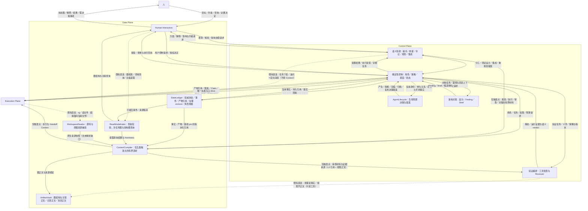
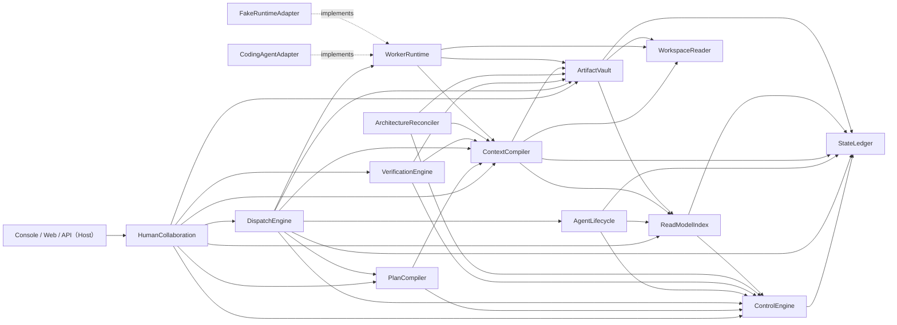
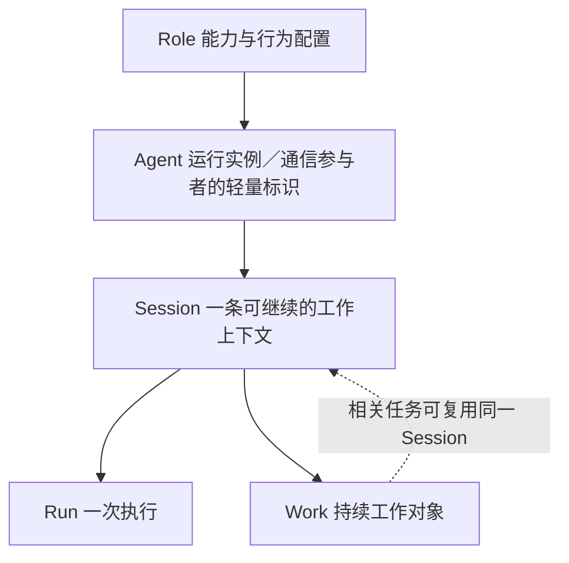

# Agent Platform Architecture Map（重构稿）

```yaml
status: draft-for-review（已按 2026-09-21 用户裁决修订；本稿不是仓库权威版）
updated: 2026-09-21
本轮修订: 按 `docs/agent-platform-user-replies-numbered.md`（原话 01–14）与 `docs/agent-platform-open-decisions-recommendations.md` 的结论**撤回上一版新增的要求**：独立跨任务 Agent 主体与"单活跃工作线"、"身份登记→参与关系→绑定签发"作为所有工作的必经仪式、"继承历史准入／逐条材料授权系统"、"是否采用 Kernel"开放项、通用外部副作用对账与复杂自动接管、草案治理平台；不新增模块、不新增依赖边
scope: Plane 与分层、Module Registry、ModuleDependencyDAG、生命周期管理、两张图能力层、模块边界变更、接口演进、全局不变量、差异说明与文档路由
落点: docs/refactor/ARCHITECTURE.md（工作区根 /home/hyh001/projects/coding-platform）
回填目标: my-coding-platform-docs/agent_platform/ARCHITECTURE.md（由后续阶段按维护流程回填；本轮决定已在 §6.1 直接记录，A8）
改前基线（只读）: my-coding-platform-docs/agent_platform/ARCHITECTURE.md（369 行；12 Module / 34 条 Module 间依赖边 / 三类 DAG / 14 条全局不变量）
第一依据: docs/PRODUCT.md（2026-09-20 定稿）
审阅依据: docs/agent-platform-architecture-review.md（2026-09-20 架构交叉审查；本版按它的定位与最小修改建议逐处修订）
输入版本冻结: my-coding-platform-docs@78b0c2aba27ac99132e320e1086b6c9920d01003（按 dev_docs/decision/04-documentation-location.md §5.3）
禁止自引用: 本稿属新版本；引用"方向依据"时固定指向上述冻结版本，不得以本稿自身作为方向依据
```

本文是低分辨率地图。Module 内部机制、字段和状态转换只存在于对应 Module 或 Interface 文档。

---

## §0 本稿的地位、约束与阅读方式

### 0.1 相对改前基线的三处性质变化

| # | 改前基线 | 本稿 |
| --- | --- | --- |
| 1 | `ARCHITECTURE.md:11`「不代表已经改变 Module 边界」；`:13`「本轮保留 12 Module」 | 按 `dev_docs/decision/02-investigation-and-conclusion.md` §7.2 的 L1 修订与 §7 注记，读作「**截至目前**保留 12 Module」；**模块边界与接口按本稿正式演进** |
| 2 | 模块集合固定为 12，DAG 视为不变 | **模块集合会变**（本稿新增 1 个 Module，见 §6）；DAG 随之变更 |
| 3 | 接口摘要作候选保留 | 按 `decision/02` §9.1，**12 个既有 Module 接口全部需要变化（I1–I12），无一可原样保留**；同步给出抽象优化（A1–A6）与"确认不变"清单（§7.3） |

### 0.2 保留不变的硬约束（已确认，不得破坏）

来源：`docs/refactor-prompts.revised.md` §2.4，2026-09-20 人确认「保留不变」清单作为硬约束。本稿的模块边界变更与接口演进**都不触碰下列入口**。

| 类别 | 内容 | 验证方式（源码事实） |
| --- | --- | --- |
| 命令入口 | `pnpm build` / `pnpm start` / `pnpm test` / `pnpm typecheck` / `pnpm check:architecture`（以及 `check` / `gui` / `ui:*` / `kernel:*`） | `coding-platform/package.json` scripts |
| 监听地址 | 本机回环 `127.0.0.1`，默认端口 `4317`，`PORT` 可覆盖 | `src/app/server.ts:141-142`（`listen(port, '127.0.0.1')`；Host 头限 `localhost`/`127.0.0.1`） |
| 数据目录 | `PLATFORM_GUI_DATA`，默认 `.local/gui` | `src/app/server.ts:140` |
| HTTP 路由 | **只新增、不删除既有路由**（`docs/refactor-prompts.revised.md` §2.4「允许演进」范围限定：界面展示与视觉改版不需要迁移方案） | 与 §7.3 一致 |

### 0.3 术语口径

- 本文新增或使用的概念必须与 `my-coding-platform-docs/agent_platform/CONTEXT.md`（唯一领域词典）一致：**Plane / Module / Interface / Seam / ArchitectureBaseline / ArchitectureEvolutionPolicy / ArchitectureFinding / Decision / AgentInstance / AgentRun / WorkContext / ContextBundle / HandoffPacket / ReadModel / TodoView / CompletionClaim / Evidence**。
- **词典缺口（本阶段不改 CONTEXT.md，登记于此）**：词典中没有 `Session`、`Run`（只有 `AgentRun`）、`Skill`/`Prompt`、`架构图`、`任务图`、`产品图` 条目。本稿按 `docs/PRODUCT.md` §3.1 与 §7.2 的定稿口径使用这些词，并在 §11 登记"需在词条层补齐"。
- `拆解`（生命周期四动作之一）指**把一个角色的职责分解为可指派给多个子 agent 的工作单元**，**不是**销毁或拆除。销毁语义由"结束终态 + 归档"承担（§4.5）。

### 0.4 证据分级约定（贯穿全文）

| 标记 | 含义 |
| --- | --- |
| **【代码】** | 已在 `coding-platform/src/**` 中存在（含契约类型、命令、事件、表结构） |
| **【契约未接】** | 契约或端口已存在，但生产装配处未接（返回 `unsupported`/`UnavailableState`，或无生产者） |
| **【设计新增】** | 本稿提出的目标归属，尚无实现与既有契约 |
| **【待人裁决】** | 讨论没说清、但架构必须表态的点；本稿给立场与备选，不替人决定。**本轮用户裁决（原话 01–14）之后，本稿不再有这一类条目**：原 U 系列各项已在 §11.1／§11.1.1 逐条关闭或收窄为接口设计参数；如后续再出现该类点，仍按本标记登记（逐条见 §11） |

---

## §1 Plane 与分层

Plane 是按权责和运行角色组织 Module 的高层视图；Plane 本身没有 Interface，也不是代码包（CONTEXT.md）。

**本稿不新增 Plane。** 理由：两张图是**数据面的能力层**（`docs/PRODUCT.md` §7.2.2「这是"利用架构图、走数据面"的方式」）；生命周期决策属**控制面**（`decision/02` §8.1「它们不是数据面的问题，而是控制面的决策」）。新增 Plane 只会把同一批 Module 重新分组，不产生新的分责边界，且与 §7.2.7 的未决项（图的存在形式）混在一起更难裁决。



**图例（本图的读取规则，避免被读成"所有材料都经 ContextCompiler"）**

| 标注 | 含义 |
| --- | --- |
| **实线** | 长期依赖／既有流向，**本稿不变** |
| **本稿新增的 Module 依赖边** | 共 4 条：`DispatchEngine → AgentLifecycle`，以及 `AgentLifecycle → ControlEngine / StateLedger / ReadModelIndex`。**本图把它们画在职责流里（如 `Life ↔ Control`），不为线型另设样式；完整依赖关系与边数以 §3 为准** |
| **虚线 + 「既有直连」** | 机制**已存在**，本稿**明确它不经 ContextCompiler**（定向消息、静态搜索、按需读事实／正文）——见 §6.2.1 |
| **「仅触发点」** | 该路径被**收窄**：只在五类触发点发生，不再每轮无条件发生 |
| **本图不再画出的路径（即"减少"）** | ① 「每次 Run 全量重新装配」——语义已删除（§6.2）；② 「通信经 Context 中转」——§6.2.1 明确不经；③ 「审查材料整包正文」——改为 L3 引用 + 按需正文（§6.2.3）；④ 「RoleManager／MemoryStore 一类新中间层」——不新增（§2）；⑤ 「模型请求前逐条复核继承材料」——上一版新增的准入路径已按本轮裁决撤回（**不因此新增 `WorkerRuntime → ControlEngine` 边**，§6.2.1／§6.3） |

> **§1 与 §3 的分工（统一口径，避免把信息流读成源码依赖）**
>
> - **§1 只表达运行交互与信息流**：箭头表示请求、反馈与材料的传递关系，**不代表直接 import 或函数调用**，也不表示源码依赖方向。
> - **§3 专门表达 Module 的源码依赖**：箭头表示"调用者长期依赖被调用 Module 的 Interface"。
> - 因此 §1 中 **`Life ↔ Control` 是职责之间的请求与反馈**（产生／拆解／压缩／归档／复用决策的提案与身份／容量事实的回流），**不能读成"它本身就是 §3 新增的那 4 条 Module 依赖边"**；两者的对应关系以 §3 的边表为准。
> - 同理，§1 中 `Control → Context` 是**请求受理与策略输入的信息流**，**不能被读成"ControlEngine 直接调用 ContextCompiler"**：按 §3，`ControlEngine` 只有 `→ StateLedger` 一条出边；而 `ContextCompiler` 既不被 Control 调用、也不调用 Control（§6.2「收缩后仍然不做」，`runtime-collaboration.md:110`）。
> - 这是**图的解释问题，不需要因此新增模块**，也不改变 §3 的边集（34 条既有 + 4 条新增 = 38 条）。**38 是如实核对的结果，不是要守住的指标**：接口设计时发现已无必要的依赖应当删除，而不是为了保住边数保留（§6.3 末行）。

| Plane | 责任（本稿口径） |
| --- | --- |
| Human Interaction | 统一图文展示、对话、查询、需求／架构讨论、控制与决定入口；图检索与统一侧栏的**读**侧入口（D-6） |
| Control | 语义协调负责澄清、分工、耦合／测试设计与集成；确定性控制负责授权、版本、预算、路由、派发、状态归约、架构对账，**以及 Agent/Session 生命周期决策** |
| Execution | 完成一次 Worker Run 并报告事实；把内核声明的持续执行、压缩与恢复能力**如实**适配上来（capabilities 不得虚报） |
| Data | 持久事实与产物引用；查询投影（含任务图）；五类触发点的有界选材；图结构与关联正文的持久与检索；原生来源捕获 |

**分层规则（沿用并收紧）**

1. 只有 ControlEngine 能接受并推进长期状态（不变量 #1）；AgentLifecycle、PlanCompiler、DispatchEngine 只提案／决策／执行。
2. Data Plane 承担信息组织，Control Plane 持有状态转换与授权责任（改前基线口径，本稿保留）。
3. Module 不反向依赖宿主（`scripts/check-module-boundaries.mjs` 强制）；Contracts 不反向引用实现；生产代码不消费 `fixtures`/`testing`。
4. ContextCompiler **不依赖** PlanCompiler／DispatchEngine，也不被 ControlEngine 反向调用——以保持"检索 → 启动 Agent → 再检索"不形成源码环（`runtime-collaboration.md:110`、`modules/data/context-compiler.md:74`）。

---

## §2 Module Registry

**13 个 Module（12 既有 + 1 新增）。** 目录名即 Module（`scripts/module-map.mjs` 的 `owner()` 按路径前缀判定，是归属的唯一可判定来源）。

| Plane | Module | 一句话职责 | 对外接口摘要 | 契约状态 | 实现现状（【代码】依据） |
| --- | --- | --- | --- | --- | --- |
| Human Interaction | [HumanCollaboration](dev_docs/modules/interaction/human-collaboration.md) | 面向人的统一入口：目标／决定／查询／架构协商与接管**读**侧 | `createGoal(request)`、`goalView(query)`、`query(request)`、`amend` | first-slice draft | 【代码】`interaction/human-collaboration/`（5 文件）；完整秘书／参谋对话与跨工作包协调仍缺 |
| Control | [PlanCompiler](dev_docs/modules/control/plan-compiler.md) | 有界协调：初始协调、人工计划、修订提案、机械返工提案 | `request(intent)`、`requestInitial(intent)`、`accept(resultRef)` | extension draft | 【代码】`control/plan-compiler/`（8 文件）；自动规划入口 `PlanCompilerImpl`，人工来源 `OperatorPlanCompiler` |
| Control | [ControlEngine](dev_docs/modules/control/control-engine.md) | 唯一的状态推进者与守卫：授权／CAS／幂等／归约／治理激活 | `submit(command)`；治理 `install/activate/applyPlan`；协调 `registerAgentInstance`、`startWorkParticipation`、`endWorkParticipation`、`mailboxView`、`grantMaterialAccess` | first-slice draft（扩展面极宽） | 【代码】`control/control-engine/`（95 文件，约 21,405 行） |
| Control | [DispatchEngine](dev_docs/modules/control/dispatch-engine.md) | 派发与运行准入：outbox 执行、准备与 claim 顺序、租约、运行事实对账 | `drive(trigger)`；`RuntimePreparationPort`；`HandoffDriveEngineImpl`；`issueMatrixRoleBinding`。**"唯一入口"是目标口径而非现状**：源码存在**普通／协作、Reviewer、Handoff 三条生产 `runtime.start` 路径**；必须二选一并给迁移清单——(a) 统一公开 `drive`，内部按运行类型分派；或 (b) 保留多入口，但共用不可绕过的准入、Session 占用、授权与租约逻辑（见 §11.2 C-13） | extension draft | 【代码】`control/dispatch-engine/`（28 文件）；`dispatch-engine.ts`、`reviewer-dispatch.ts`、`handoff/handoff-drive.ts` |
| Control | [VerificationEngine](dev_docs/modules/control/verification-engine.md) | 验证编排：检查生命周期、Evidence 受理、Reviewer 工作、探索报告资格 | `verify(intent) → verification ref`；`VerificationService.verify`；`reverifyRework` | planned（实现另有 `VerificationService`） | 【代码】`control/verification-engine/`（24 文件）；生产路径是 `VerificationService`，`VerificationEngineImpl.verify` 不是生产入口 |
| Control | [ArchitectureReconciler](dev_docs/modules/control/architecture-reconciler.md) | 架构对账：图差分 → Finding／Brief → 候选物化 | `inspect(intent) → assessment ref`；`computeArchitectureDelta`；`BaselineEvolutionPort` | planned | 【代码】存在但最薄（3 文件 / 263 行）；**未接产品 inspect 入口**、真实初始 sourceBinding 与 MigrationGate 仍缺 |
| Control | **AgentLifecycle（新增）** | **Agent/Session 生命周期决策与提案**：是否复用、产生、拆解、压缩、归档、重新启用；**决定用哪个角色配置、创建／解析哪条 Session、关联哪些必要任务**（执行启动仍由 DispatchEngine 派发） | `decide(request) → reuse_deferred / reuse_selected / needs_material / rejected`（候选）；`propose(action) → proposal / rejected`（候选）。**候选结果集不完整**（审阅 §4.2）：还须表达**没有可复用 Session 时如何创建、复用范围作为推荐线索如何交给 ContextCompiler、何时只读分叉、返回 `needs_material` 后由谁解除等待**，并定义与 `propose(action)` 之间的协议 | **【设计新增】proposed（无实现、无契约）** | 无目录、无契约；现有承载见 §4.1。**创建路径不再以"身份登记→参与关系→绑定签发"为所有工作的必经仪式**（A5 收窄，§4.1 阶段 1） |
| Execution | [WorkerRuntime](dev_docs/modules/execution/worker-runtime.md) | 一次真实内核运行：启动、取消、能力探测、公开观察与快照 | `capabilities/start/control/events`；可选 `snapshot`；`RunPort`、`RuntimeReconciliationPort`、`HandoffControlPort` | extension draft | 【代码】`execution/worker-runtime/`（17 文件）；**契约中无名为 `WorkerRuntime` 的接口**，能力面分散在多个端口 |
| Data | [StateLedger](dev_docs/modules/data/state-ledger.md) | 原子提交 snapshot + Event；CAS、幂等、事件页 | `load/commit/events` | first-slice draft | 【代码】`data/state-ledger/`（29 文件）；SQLite 表 `events/snapshots/idempotency/identity_claims` |
| Data | [ArtifactVault](dev_docs/modules/data/artifact-vault.md) | 不可变正文持久化与材料授权适用性 | `put(record)`、`open(ref, accessScope)`；`MaterialAccessResolver` | planned | 【代码】`data/artifact-vault/`（5 文件）；表 `artifacts(key, record)` |
| Data | [ReadModelIndex](dev_docs/modules/data/read-model-index.md) | 从已提交事件重建查询投影（含**任务图**与**架构图查询**） | `advance(page)`、`goal(query)`、`planGraph(query)`、`mailboxView()`、`governanceView()` 等 27 项 | first-slice draft | 【代码】`data/read-model-index/`（23 文件，47 张表）；`plan_graph` 表已存任务图（`stages/tasks/task_hierarchy/execution_dag` 为 JSON 列） |
| Data | [ContextCompiler](dev_docs/modules/data/context-compiler.md) | **五类触发点**的有界选材（边界本稿收缩，见 §6.2） | `assemble(request) → ready/needs_material/rejected`（生产走 `TaskContextPort`）；12 个按消费者的 `assemble*` 端口 | extension draft | 【代码】`data/context-compiler/`（37 个 `.ts`）；**契约无名为 `ContextCompiler` 的接口**，实际公共面是 12 个并行端口 |
| Data | [WorkspaceReader](dev_docs/modules/data/workspace-reader.md) | 路径边界内的源码与原图来源捕获 | `read(query) → sourced/unsupported/stale/rejected`；`ArchitectureSourceCapturePort` | extension draft | 【代码】`data/workspace-reader/`（18 文件）；`FakeWorkspaceReaderAdapter` 仍是默认装配 |

**Module 升级判据（本稿沿用并用来判定新增）**：一个流程方框只有在拥有独立 Interface、隐藏实质复杂度、且能通过该 Interface 验证时才升级为 Module。

- `AgentLifecycle` 满足三条：接口小（复用决策 + 四动作提案）；隐藏实质复杂度（Session 身份与容量、压缩记录、归档与重新启用、可解释的复用决策）；可通过接口验证（给定任务与角色目录 → 复用决策及其排除理由）。**且当前没有任何 Module 拥有这套决策**（`decision/02` C10 当时记为"落点待定"；**本轮 U1 已定为新增本模块**）。**新增理由按审阅 §5.1 收紧为"职责与变化边界"**：不把"文件数量"或"放进 ControlEngine 就不可独立测试"当作论据——**内部纯策略同样可以独立测试**，因此 U1 的取舍依据是职责边界，而非可测试性口号。**落地标准是职责迁移，不是演示闭环**：旧的重复选择、重复身份推导与重复取材路径必须迁出或删除，加一层 wrapper 让演示跑通不算完成（A3，§9.2）。
- 本稿**不新增**图模块：架构图的节点/边/快照与差分契约已存在，缺的是**生产者与关联**而不是新能力；任务图的类型、生成函数、投影表与视图**都已存在**。再建一个图模块会与 ReadModelIndex 的投影职责重复，并触碰"不要新建第五个机制去实现图索引编排"的既有禁令。备选方案见 §11-U2。
- **不新增**能力注册／技能市场模块：`docs/PRODUCT.md` §7.6 明写「不建设独立技能市场、自动生成技能工厂或新的注册体系」；能力与 skill 承载在 `RoleSpec` + 既有治理路径 + ArtifactVault。

---

## §3 ModuleDependencyDAG

箭头表示**调用者长期依赖被调用 Module 的 Interface**，不表示开发顺序。

**本节与 §1 不是同一张图**：§1 表达运行交互与信息流（箭头不代表 import 或函数调用），本节表达源码依赖；两者不可互相替代，也不可互相推断。



**边数**：改前基线 34 条 Module 间依赖边（不含 `Apps → HumanCollaboration` 的宿主边，与 `scripts/module-map.mjs` 的 `allowedModuleDependencies` 逐条一致）；本稿 **38 条**（新增 4 条：`DispatchEngine → AgentLifecycle`，以及 `AgentLifecycle → ControlEngine / StateLedger / ReadModelIndex`；**本轮撤回的历史准入要求不产生任何新边**，见 §3.1 末条）。**"34 条不动"不是目标约束，38 条也不是要守住的数字**：接口设计时重新核实实际仍需的依赖，已无必要的边应当删除（A3，§6.3 末行；§11.2 C-10）。

### 3.1 无环说明

- 该 DAG 的**唯一强制判据**是 `coding-platform/scripts/module-map.mjs` 的 `allowedModuleDependencies`，由 `scripts/check-module-boundaries.mjs` 做「未声明依赖 + DFS 环检测」两项机械检查（`pnpm check:architecture`），并由 `tests/contracts/module-ownership.test.ts` 重复断言目录归属。
- **拓扑顺序**（审阅 §4.7 复核为无环，一组合法层次；同层不表示开发顺序）：① `StateLedger`、`WorkspaceReader` → ② `ControlEngine` → ③ `ReadModelIndex` → ④ `ArtifactVault`、`AgentLifecycle` → ⑤ `ContextCompiler` → ⑥ `PlanCompiler`、`VerificationEngine`、`WorkerRuntime`、`ArchitectureReconciler` → ⑦ `DispatchEngine` → ⑧ `HumanCollaboration` → Host。注意 **`PlanCompiler` 排在 `DispatchEngine` 之前**（因存在 `DispatchEngine → PlanCompiler`）——本稿此前把两者顺序写反，已按审阅更正。
- 新增的 `DispatchEngine → AgentLifecycle` 不构成环：`AgentLifecycle` 的三个出边（`ControlEngine`、`StateLedger`、`ReadModelIndex`）都在其下游，且它**只被 DispatchEngine 依赖**——没有任何其他 Module 依赖它。
- 运行时可以形成 `Control → outbox → Worker → Fact → Control` 的反馈循环，但源码依赖保持无环（基线口径，保留）。
- **已有的运行控制依赖如实声明，不为已撤回的要求新增边**：`DispatchEngine → WorkerRuntime`（派发与租约执行）、`DispatchEngine → ControlEngine`（运行事实受理与归约）已在本表中；上一版为"模型请求前复核继承材料"补的 `WorkerRuntime → ControlEngine` 准入边**随该要求一并撤回，不再新增**（§6.2.1）。平台暂停/恢复走的是向 Kernel 提交控制请求与接收结果，不需要新的模块依赖边。

**三种边必须分开（审阅 §4.7）**：本节的箭头是**模块级逻辑依赖（架构规则）**，不是源码 import 事实，也不是装配事实。

| 边 | 证明什么 | 由谁验证 |
| --- | --- | --- |
| 模块允许依赖另一模块的接口 | **架构规则**；每条边要有具体 Port、owner 与调用理由 | 本节 + `module-map.mjs` 的 `allowedModuleDependencies` |
| 文件实际 import 另一模块的实现／类型 | **源码事实** | `scripts/check-module-boundaries.mjs` 静态扫描（**观测结果**，不作为规则本身） |
| Host 把某个 provider 注入 consumer | **生产装配事实** | 组合根（`app/service.ts`、`composition/**`、`harness/**`）与装配验证 |

**没有跨模块 import 不代表没有模块逻辑依赖**（共享 Contracts 与 DI 是正常方式）。因此：**保留逻辑 Module DAG，另补"端口与装配位置"表**；实际 import 图作为观测结果。检查器的已知盲区（`vendor/**`、动态导入、白名单路径、`.py` 只做归属不解析）必须显式登记，并**明确允许的 Kernel 边与例外范围**（见 §11.2 C-13／C-14）。

### 3.2 边的含义（新增／变更部分）

| 调用者 → 被调用者 | 消费的 Interface 与原因 | 状态 |
| --- | --- | --- |
| **DispatchEngine → AgentLifecycle** | **派发前取"用哪个角色配置、创建还是复用哪条 Session、关联哪些必要任务"的决策**；派发结果记录复用决策与其排除理由（`decision/02` C1 要求）。决策不改变派发权：**"唯一派发入口"按 §2 的目标口径收口**（统一 `drive` 或共用不可绕过的准入与租约逻辑） | **【设计新增】** |
| **AgentLifecycle → ControlEngine** | 把产生／拆解／压缩／归档／重新启用的动作作为**提案**提交，由 ControlEngine 归约（不变量 #1/#3）；AgentLifecycle 不写 canonical | **【设计新增】** |
| **AgentLifecycle → StateLedger** | 只读 canonical 生命周期事实：`AgentInstanceV1`、`WorkParticipationV1`、`RoleSpecRevision`／矩阵 pin、WorkContextBinding | **【设计新增】** |
| **AgentLifecycle → ReadModelIndex** | 只读忙闲、当前工作、任务与角色视图（`ActiveAgentView`、`MailboxViewV1`、角色视图）以判断复用是否可行 | **【设计新增】** |
| HumanCollaboration → ReadModelIndex | **新增**：工作卡片／角色名册／统一侧栏所需的 Session 与运行视图（`decision/02` C8、I6、I11）。图检索也走投影：任务图已有 `planGraph`，架构图查询面见 §5.4 | 既有边，**消费内容扩展** |
| ArchitectureReconciler → ContextCompiler | 获取相同版本的规范、代码关系、图材料与证据以做对账（基线口径，保留） | 既有边，语义收紧：对账材料由 ContextCompiler 按 §6.2 的有界选材提供 |
| ContextCompiler → ReadModelIndex | 消费已有查询结果，不重新实现状态归约（基线口径，保留） | 既有边，语义收紧 |

---

## §4 生命周期管理（专章）

本章回答两件事：**五阶段**（创建／初始化／运行／挂起·恢复／销毁）与**四动作**（产生／拆解／压缩／归档）各自**谁负责、边界在哪、状态归谁、进入与退出条件**。

### 4.0 起点：现状已经有的一半（不要把 greenfield 当成重构对象）

| 已有承载 | 位置 | 覆盖了什么 |
| --- | --- | --- |
| `AgentInstanceV1` / `AgentInstanceStatus = "active" \| "retired"`；`AgentInstanceRef`、`AgentPrincipalRefV1`、`WorkParticipationV1 {status: "active" \| "ended"}` | `src/contracts/coordination.ts` | **运行实例与参与关系的实体**【代码】（本轮口径：它是可寻址标识，**不必承载长期主体人格**，§4.5） |
| `registerAgentInstance`（CAS@0）、`startWorkParticipation`、`endWorkParticipation`，经 `CoordinationControl` 暴露 | `control-engine/coordination/participation-operations.ts`、`contracts/modules.ts` | **身份的正式写路径**（经 ControlEngine）【代码】 |
| `RoleSpecRevision` / `ProjectRoleSpecActive` / 角色矩阵 `CoordinationRoleMatrixV1`（可选字段 `roles?`）；per-`(projectId, roleId, revision)` 独立 CAS@0 | `contracts/role-spec.ts`、`contracts/human-role-collaboration.ts` | 角色规格的版本化治理（第 5 个治理种类）与"哪些角色存在"的目录【代码】 |
| `WorkContextBinding` / `workId` | `contracts/context-continuity.ts` | **工作维度**的跨 Run 身份（"A Run is NOT a work identity"）【代码】 |
| `HandoffPacketV1`、`recordHandoff`／`claimReplacement`、`HandoffRecorded`／`ReplacementClaimed` | `contracts/handoff.ts`、`control-engine/handoff.ts` | 换手与接续【代码】 |
| `ContextContinuationResult`：`restored_original`／`took_over`／`unsupported`／`rejected` | `contracts/context-continuity.ts` | **恢复路径的如实观测**（能力由适配器声明，Control 不编造）【代码】 |
| `ExecutionNote`（不可变、有界 16 KiB、body-first） | `contracts/context-continuity.ts` | "先落盘再生效"的记录承载雏形【代码】 |
| `MailboxViewV1`、`mailboxView()`、`coordination_mailbox` 工具 | `contracts/coordination.ts`、`control-engine/coordination/mailbox-view.ts`、`worker-runtime/coordination-tools.ts` | 定向消息的查询与投递面（本产品**自有**机制）【代码】 |
| `LifecycleControlPort`、`ContextContinuationPort`、`HandoffControlPort` | `worker-runtime/*`、`contracts/*` | 三个生命周期端口**都在、都可注入**，但真实装配写死成"未配置"【契约未接】 |
| `RecoveryCoordinator`、`SessionStorePort`、`CheckpointStorePort`、`sessionRecordSchema`、`checkpointSchema` | `vendor/coding-agent` | **内核已声明**会话恢复与检查点能力【代码·内核】 |

**明确缺失（本稿不得假装已有）**：

| 缺失项 | 事实 |
| --- | --- |
| **Session 作为平台侧一等实体** | `SessionV1`、session 聚合、session 命令／事件／投影 **全部不存在**；`sessionId` 只在 `RuntimeRecord.sessionId`（prepare 时 `randomUUID()`）与 `producerSessionId`/`reviewerSessionId` 两个裸字符串里出现。**本轮口径（L-2）**：平台只需 Session 的**身份、关联与引用**，**不复制 Kernel 正文**，也不要求平台侧重建整套 session 聚合 |
| **退役写路径** | `"retired"` 与 `retiredAt` 字段存在，但**没有任何命令／事件写入它们** |
| **压缩** | 平台层无压缩策略；`compact*` 命中全是注释；容量溢出是**失败**（`ContextCapacityExceeded`），不是压缩 |
| **归档** | 无实现、无状态机；观察 journal 无删除／修剪／归档路径 |
| **运行期控制能力** | 生产 `lifecycleControl.capabilities()` = `{safePointDelivery:false, pause:false, cancel:false, steer:false, maxSteerPayloadBytes:0}`，**无配置入口** |
| **续跑** | 生产 `contextContinuation` 返回 `unsupported`，`unsupportedCapabilities: ['session_restore','context_resume','takeover_run']` |
| **责任接管（首版不作为要求）** | `run.lock` 在 `outcome_unknown` 时**故意不释放**（设计正确）；平台**不建设责任移交／自动接管平台**（A4 撤回首版扩大项）；同一 Session 是否还能运行主要由 Kernel 判断 |
| **跨 Run 的复用决策** | 没有"给定任务，从角色目录与既有 Session 里选一个配置／会话"的检索或匹配器 |

### 4.1 五阶段归属矩阵

每格写：参与模块 ／ 谁负责 ／ 边界 ／ 状态归谁 ／ 进入与退出条件。

#### 阶段 1 · 创建

| 项 | 内容 |
| --- | --- |
| 参与模块 | AgentLifecycle（决策与提案）、DispatchEngine（触发与按矩阵 pin 签发绑定）、ControlEngine（归约与守卫）、StateLedger（原子提交）、ReadModelIndex（视图） |
| 谁负责 | **决策**：AgentLifecycle 判断"用哪个角色配置、创建还是复用哪条 Session、关联哪些必要任务"；**执行**：DispatchEngine 启动执行（唯一 `drive` 的目标口径）；**正式登记**：只在确需独立责任、并行调查或可寻址通信时，由 ControlEngine 归约 `registerAgentInstance`／`startWorkParticipation` 一类命令，并按当前生效矩阵 pin 签发绑定（`issueMatrixRoleBinding`），签发不代替守卫 |
| 边界 | AgentLifecycle **不写状态**；DispatchEngine **不自造身份**；ControlEngine **不自行选人**（依据来自 AgentLifecycle 决策 + 矩阵 pin）。**不再要求"身份登记 → 参与关系 → 绑定签发"作为所有工作的额外必经仪式**（A5）：普通工作按"创建／解析 Session → 选择配置 → 关联必要任务 → 启动执行"进行，轻量实例标识只服务于收件、运行与记录区分 |
| 状态归谁 | 按实际需要：canonical 的 `AgentInstanceV1`／`WorkParticipationV1`／`RoleBindingRefV1`【代码】（需要时才登记）；Session 引用与其 Kernel 映射见 §11.1.1 L-2；投影：ReadModelIndex 的"工作卡片"视图；运行态：WorkerRuntime 的 `RuntimeRecord` |
| 进入条件 | **按 `docs/PRODUCT.md` §7.1 与 D-7 的产品已决触发执行**（不再标为"非人确认"）：新工作确需独立责任或并行调查，而现有合适角色／Session 无法承担。工程侧仍需在消费者设计时定的是**实体字段与事务边界**（主键、绑定基数、CAS 目标）——属接口参数，不属未决决定 |
| 退出条件 | 执行已受理并启动（需要时：身份登记成功、参与关系 active、绑定已签发）。**本轮不再把"现状无判据"登记为待人裁决**；判据按上面这条可观察事实 |
| 本阶段与其他阶段的分界 | **"创建"与"初始化"的分界已由 U9 分开**：本阶段确定的是**这条工作用哪个角色配置、哪条 Session、关联哪些任务**，阶段 2 建立的是**项目认知**（项目指引、代码地图、候选架构图）。**Session 的创建／解析归属已定**：由 AgentLifecycle 决策、经 Kernel 适配接口创建或打开，平台只保存引用与映射（§11.1.1 L-2／R-5）；剩余的是承载字段与 Port 形状——属接口设计参数 |

#### 阶段 2 · 初始化＝项目认知初始化（U9 已收口）

**这里必须先分两个概念**（U9）：

| 概念 | 内容 |
| --- | --- |
| **项目认知初始化**（本阶段） | 首次接触项目时建立**可持续使用**的项目说明、操作说明、代码地图与架构图 |
| **Run 准备**（不属本阶段，属派发与运行） | 权限、租约、工作区、Runtime 能力与**本次**需要的材料（`prepare + preflight + assemble`） |

| 项 | 内容 |
| --- | --- |
| 参与模块 | DispatchEngine（派发**只读探索运行**）、WorkerRuntime（执行探索）、ArchitectureReconciler（形成**候选结构**）、ContextCompiler（必要的材料编译）、ControlEngine（**接受**候选并落正式状态）、ArtifactVault／ReadModelIndex（正文与投影） |
| 谁负责 | 派发：DispatchEngine；执行：WorkerRuntime；结构化：ArchitectureReconciler；接受：ControlEngine。**首版不新增 Module** |
| 边界 | 产出的是**项目指引与候选架构图**，不是 baseline（§5.1）；**两条路径必须分开**（L-5）：已有代码库的认知初始化先只读探索，**新项目创建目录、说明文件与模块／接口文档需要普通工作区权限**——两者不能混成一个"探索永远只读"的流程；**不把整库装入 Context**，按探索预算取材 |
| 状态归谁 | 候选结构与来源 pin：ArtifactVault 正文 + canonical 引用；图查询：ReadModelIndex；正式 baseline 只在人确认后安装激活（§5.1／#13） |
| 覆盖内容 | ① 项目用途与主要目标；② 技术栈与关键约束；③ 构建／启动／测试／验证命令；④ 主要模块及职责；⑤ 模块与目录、入口文件的映射；⑥ 关键跨模块依赖；⑦ **尚未理解或无法解析的区域**（`unresolved`，永不呈现为"没有依赖"） |
| 探索深度 | **默认 3 层**；无法判断模块边界的局部区域展开到 **5 层**；必要时可突破 5 层。**深度只控制探索与展示预算，不作为完成的唯一条件** |
| 完成条件 | **主要业务区域能定位到模块 + 关键运行与验证入口已识别 + 重要依赖可追踪 + 未覆盖区域被明确记录**（不按目录层数单独判断） |
| 草案与启动（L-5 已收口） | **没有 baseline 不阻止开始工作**。正常路径：主 Agent 按需求与相关 Skill 形成草案 → 在**普通工作区权限**下创建目录／说明／模块接口文档 → 分配角色与 Session → 开始开发并按反馈修订 → 某版被采用后登记为第一份基线。**不建草案治理平台**；草案不是当前实际代码的证据，图可区分"计划中"与"已实现" |
| 剩余接口参数 | 草案的**承载形态**（Vault 正文 + 引用，还是同时落 canonical）与转换门禁的判定者（门禁本身已定，见 §5.1／I10）；探索计划当前"UI 无入口、不能原地替换"是否开入口——**属接口／界面参数，不是未决决定** |

#### 阶段 3 · 运行

| 项 | 内容 |
| --- | --- |
| 参与模块 | DispatchEngine（唯一 `drive`）、WorkerRuntime（承载执行）、ControlEngine（状态与租约权威）、StateLedger、ContextCompiler（材料）、AgentLifecycle（运行中不介入，除容量决策） |
| 谁负责 | 派发与顺序：DispatchEngine；执行与公开观察：WorkerRuntime；状态归约与租约：ControlEngine；**运行期的压缩／更换决策**：AgentLifecycle（见四动作·压缩） |
| 边界 | WorkerRuntime 不编排、不规划、不归约；租约持有者是 **Run 而不是 Agent**（`TaskLeaseSnapshot.holderRunId`）；MSG 类普通消息**不是** `RuntimeExecutionDAG` 的阻塞边 |
| 状态归谁 | `RunSnapshot.status`（running/ended）由 ControlEngine 的纯函数 fold 归约；幂等、CAS、事件由 StateLedger 原子提交；**"工作中／待命"这类运行状态由 §4.6 描述 Session 与工作卡片，不要求写进持久 AgentInstance** |
| 进入条件 | 【代码】`capabilities()` 声明 + `preflight` 通过 + 唯一 Writer 租约可用 |
| 退出条件 | 【代码】五种终态之一：`completed`／`cancelled`／`budget_exhausted`／`failed`／`outcome_unknown`；只有非 `outcome_unknown` 才在 `finally` 释放 `run.lock` |
| 实现缺口（非未决决定） | 生产路径的 pause/cancel/steer/safePointDelivery **当前全部为 false 且无配置入口**——这是"接上 Kernel 实现并确认适配结果"的实现工作（B 组，§11.4），不再作为产品待决；安全点确认的宽松行为是**已登记的延期缺口**（无已发现生产消费者） |

#### 阶段 4 · 挂起·恢复

| 项 | 内容 |
| --- | --- |
| 参与模块 | WorkerRuntime（能力探测与适配）、AgentLifecycle（恢复哪条 Session 的决策与提案）、DispatchEngine（恢复入口与后继 Run）、ControlEngine（控制请求归约与自身状态同步）、ContextCompiler（恢复触发的选材）、StateLedger、ArtifactVault（正文） |
| 谁负责 | **暂停**：平台做两件事——在指定范围内**停止新派发**，并把已运行实例的**控制请求交给 Kernel**；**Kernel 负责执行停止、暂停边界与恢复点**，平台接收成功／失败并同步调度状态与显示（A6）。**平台直接信任 Kernel 的停止契约**（承诺"成功返回即已达停止边界"就直接采信；只返回"收到请求"时适配器等待最终结果），**不逐个复查工具或子进程是否停下，也不复制 Kernel 的取消机制**；**失败如实显示，不把失败显示成成功**。暂停整个任务分支时不停止项目中无关分支。**恢复（重启后）**：平台只处理自己拥有的状态——读取必要映射 → 向 Kernel 查询／恢复 → 消费已有结果与未同步事件 → 更新任务、两图关联与展示；DispatchEngine 只补齐未落账事件、把未终结 Run 记为 `outcome_unknown`，**不重跑、不续跑**。**续跑／接续**：由 WorkerRuntime 适配内核能力，观测结果如实公开（`restored_original`／`took_over`／`unsupported`／`rejected`） |
| 边界 | 平台**不承诺同会话热恢复**，也**不建设第二套执行恢复系统**：通用外部副作用对账系统、复杂自动接管平台与逐工具／子进程停机复查都是上一版扩大的首版项，**本轮删除**（A4）。能力缺失时必须返回 `unsupported` 并指名缺失能力，**不得用 Fake 适配器的行为冒充真实内核**；前驱的验读**不继承**为后继许可。**内核"已导出恢复能力"只证明存在接入线索，不等于暂停、压缩、撤权后恢复等目标语义已完整可用**——必须由真实连续任务验收，不能据公开导出推断 |
| 状态归谁 | 平台只维护自己拥有的运行关联、调度状态与两张图状态：canonical 的 Run/TaskAttempt/outbox 与 `ControlIntentReconciled`；`ContextContinuationResult` 记录**观测到的**路径；投影：ReadModelIndex。**Kernel 持有的会话日志、检查点、压缩与恢复不进平台**（§11.1.1 L-2） |
| 进入条件 | 重启后扫描到未终结 Run；或显式恢复／换手请求（仅 canonical `ended` 的普通来源可申请） |
| 退出条件 | 成功：Kernel 恢复／控制结果已消费，平台的任务、关联与展示已同步，正常继续。失败：**显示失败原因并保留可查询记录**，按能力重试或重新开始；未终结 Run 记 `outcome_unknown`。**不承诺还原全部崩溃现场、不做通用外部事务补偿**；仍未知的执行**不自动标为完成**，也不因平台没收到结果就盲目重复提交同一项操作 |
| 本阶段事项的状态 | **是否使用内核 `RecoveryCoordinator`／`SessionStorePort`／`CheckpointStorePort`：本轮已定＝使用（U7）**，平台提供适配接口（用户原话 02："内核实现，但是平台要有接口"）；**该开放项删除**。接受后受"同一 Session 同时一个活动 Run"的串行约束（内核在已有活动 Run 时抛错）。**pause 属首批承诺范围**（`docs/PRODUCT.md` §4 承诺 5、§5.6、§8；结论见 §11-U6／§11.1.1 L-3）；"取消 + 续跑"只能作**过渡实现**，对外必须表现为暂停语义并如实标注粒度。真实桥接验证属于实现责任 |

#### 阶段 5 · 销毁＝归档（Session／工作卡片状态之一，§4.6）

| 项 | 内容 |
| --- | --- |
| 参与模块 | AgentLifecycle（归档提案）、ControlEngine（归约）、StateLedger、ArtifactVault（保留记录与产物）、ReadModelIndex（投影随之更新） |
| 谁负责 | 提案：AgentLifecycle；归约：ControlEngine；**不删除**任何模块或图节点 |
| 边界 | **归档 ≠ 删除**：退出普通候选、普通搜索与默认图展示，**只读保留**；`docs/PRODUCT.md` §7.1「归档更新活跃状态与责任关联，不删除模块；模块撤销另按结构变更处理」。**读取归档内容不会自动解除归档**；**解除归档后重新检查权限、工作范围与材料有效性** |
| 状态归谁 | `archived` 是 §4.6 中描述 **Session／工作卡片**的状态（退出普通调度与默认展示、只读保留）；**不再要求把 `working`／`paused` 等四态强塞进持久 `AgentInstanceStatus`**（L-2／U10）。归档事实经既有记录与查询落账 |
| 进入条件 | 该工作线退出日常使用；由**显式操作**触发（首版**显式归档**，不做自动回收） |
| 退出条件 | 经专门的 `unarchive`（`unarchiveSession`／`unarchiveAgent`）**重新检查权限与材料有效性后**恢复 |
| 图上的表现 | 隐藏的是 **Agent／Session 的活跃关联**；**仍存在的代码模块必须保留**，其负责人被归档时显示"**当前无活跃负责人**"，不得把模块从图上删除 |
| 本阶段事项的状态 | **"销毁"不是可观察状态**（参考分层：disposal removes the agent from its registry; it is not a third observable status）。归档后**身份与名称的具体处置、投影更新的实现方式**属模块设计参数（§11.4），不是未决决定 |

### 4.2 四动作归属

| 动作 | 定义（不改写） | 参与模块 ／ 谁负责 | 状态归谁 | 进入条件 | 退出条件 |
| --- | --- | --- | --- | --- | --- |
| **产生** | 在需要时为一个角色（`RoleSpec` 的实例化）建立**可寻址的运行实例标识**并绑定承担范围；**普通工作不以此为必经仪式** | AgentLifecycle（决策与提案）／ ControlEngine（需要时归约 `registerAgentInstance`、`startWorkParticipation`）／ DispatchEngine（按矩阵 pin 签发绑定并启动执行） | 按实际需要：`AgentInstanceV1`（canonical）、`WorkParticipationV1`、`RoleBindingRefV1`；工作上下文本身由 Session 承载（A1／A5） | **产品已决**（`docs/PRODUCT.md` §7.1「产生」：新工作确需独立责任或并行调查，而现有合适角色／Session 无法承担）；拆解／压缩／归档同理按 §7.1 已决触发执行 | 执行已受理并启动；需要登记时：身份登记成功 + 参与关系 active + 绑定已签发 |
| **拆解** | 把一个角色的职责**分解**为可指派给多个子 agent 的工作单元（**不是销毁**） | PlanCompiler（工作分解与提案）／ AgentLifecycle（承担角色与复用决策）／ DispatchEngine（派发）／ ControlEngine（受理与义务） | PlanRevision 的任务集与指派、`TaskHierarchy.parentOf`、`RuntimeExecutionDAG` | 目标确认且任务图生成后（**阈值型触发尚无给定值——属接口参数**，不是未决决定） | 任务集与指派已受理并可派发（现状即此判据） |
| **压缩** | 在不破坏**可复用前缀**的前提下缩小角色当前持有的会话工作集，并留下可追溯记录 | AgentLifecycle（在延续／压缩／重组／归档中选择，§4.7）／ WorkerRuntime・Kernel（**实际执行**压缩并如实报告）／ ControlEngine（接受结果、归约正式状态）／ ArtifactVault（记录正文）／ ContextCompiler（**仅在必要时**做初始化或重组） | 压缩记录（正式事实）；`ExecutionNote`（不可变、有界、body-first）是可用的既有承载；**Kernel 已完成的有效压缩直接使用，不再二次编译** | **同一工作未完成、历史决策与过程仍有明显价值**，且容量不足或噪声增加（任务目标已变、历史大部分失效时应走**重组**，§4.7） | 压缩结果已如实记录并被接受。**"压缩后如何度量前缀"属测量口径（U12 的参数），不是未决决定**；判据是"处置方式是否与功能匹配"（§4.3 第 3 条） |
| **归档** | 让角色退出**当前装配**，但保留身份与可检索的记录 | AgentLifecycle（提案）／ ControlEngine（归约）／ ArtifactVault（保留正文）／ ReadModelIndex（更新投影） | `archived`（§4.6 描述 Session／工作卡片的状态之一）；经既有记录落账 | 该工作线退出日常使用；由**显式操作**触发 | 经 `unarchive` 且在**重新检查权限与材料有效性**之后恢复（§4.1 阶段 5） |
| **重新启用**（`docs/PRODUCT.md` §7.1 列为第五个动作） | 新请求需要该角色且配置与责任范围仍合适时，**优先恢复合适的原 Session**，补充期间变化；确需新 Session 时保留交接来源 | AgentLifecycle（决策与提案）／ DispatchEngine（派发与换手）／ WorkerRuntime（能力适配）／ ContextCompiler（新 Session 接续触发的选材） | canonical 走既有 handoff／continuation 路径；`ContextContinuationResult` 如实记录实际路径 | 新请求到达，且既有配置与范围仍合适、原 Session 的上下文仍适用 | **与"创建"的分界已明确**：重新启用＝**复用既有 Session／角色配置**（优先恢复合适的原 Session，确需新 Session 时保留交接来源）；只有不存在合适 Session 时才走"创建"。剩余待接口设计的是恢复入口与 `ContextContinuationResult` 观测路径的绑定 |

### 4.3 四个动作必须携带的硬约束（不变量化，见 §8 #18）

**先把四种"复用"分开（审阅 §2.3 的更正，本文采纳）**：① **业务复用**（身份、责任、历史成果、关键理由仍可用）；② **会话复用**（Kernel 能继续原 Session）；③ **本地制品复用**（避免重复读取、解析与装配）；④ **模型提示词缓存命中**（取决于实际请求、缓存规则与有效期）。四者有关联，**但不能互相推出**：同一 Session 不保证命中，新 Session 也不必然失去可共享的稳定前缀。

1. **先落盘再生效**：压缩与归档都是**有记录的写操作**，不是内存里的临时整理。
2. **压缩不得**把推断写成事实、不得丢弃关键的不确定性、不得把历史授权带入新任务。
3. **压缩应尽量保持系统规则、工具定义与角色指令的稳定部分**；历史段缩短后可能需要重新写入缓存，**这个代价要核算，但不能作为禁止压缩的理由**。判据是"是否划算"，不是"是否保住了前缀"。
4. **归档**是"当前不参与装配"的部分，不是装配要用的稳定前缀；归档省下的存储不能换来更大的输入成本。
5. **复用不得沿用旧授权**：沿用既有 `MaterialAccessGrantV1` 的判定，与本 Run 的读写权限正交；**执行端真实权限不能由 prompt 绕过**。**首版不新增普遍逐材料授权系统，也不把"每轮继承历史复核"设为新增必经门禁**（L-1 撤回，§6.2.1）。
6. **跨项目复用首版不做**：跨项目请求**显式拒绝并说明原因，不静默降级**。
7. **可解释**：复用决策必须能说明——为何选中该角色配置与 Session、复用了哪些**推荐范围**、哪些因过期或撤权被排除。
8. **不得**以"固定常驻 Agent 数量"或新增进程管理器代替需求分析；**身份持续不要求进程常驻**，也**不是**"所有工作共享一个无限增长的上下文"。
9. **成本的比较口径**：**连续复用为默认**；在满足质量、授权、容量与恢复要求后，比较**整个任务的费用与延迟**，**允许有依据地牺牲一次命中**。记录模型输入、缓存读写、输出、压缩、咨询次数、准备时间与恢复成本。产品给定的 **50 倍价差是"指定条件下的参数"，不外推到所有提供方**；本地 I/O 影响时间与资源，**只有改变实际模型输入与命中情况才改变相应 Token 账单**。

### 4.4 与既有不变量的关系

| 既有不变量 | 生命周期的影响 |
| --- | --- |
| #1 Planner 只提案，ControlEngine 才推进长期状态 | 生命周期四动作**全部**走"AgentLifecycle 提案 → ControlEngine 归约" |
| #3 ControlEngine 生成 snapshot/Event，StateLedger 原子提交 | 新增的 Agent/Session 生命周期事件必须走同一路径与同一幂等／CAS 语义 |
| #6 每个执行／Evidence／Handoff／Decision 绑定 revision 与来源 | 复用 Session 时，verdict 与 Evidence 必须能追溯"**哪条 Session、哪次 Run** 在哪个来源版本下产出" |
| #7 同一 checkout 同时最多一个 Writer | **首版保持租约绑定 Run**（`TaskLeaseSnapshot.holderRunId` 不改）：复用同一 Session 不等于让 Session 常驻持锁，**后继 Run 重新获取租约**；**不得仅凭超时就把写权交出去**。原"延续／转移／重新获取"待选已按此收口（§11-U5） |
| #11 治理种类只在有首个消费者时建立 | 若引入"Session 复用策略"等新治理种类，须遵守同一条（无内置默认值、显式 install/activate） |
| #13 ArchitectureBaseline 不可改写，须 CAS activation | 模块边界变更后 baseline 必须同步演进，否则 Reconciler 会把**有意变更**误报为漂移 |

### 4.5 术语分层与实体关系（接口冻结前必须唯一解释）

审阅要求"身份与生命周期表"成为冻结接口前的第 2 项输出。**先定术语，再定关系**，否则各模块会各自发明一套（U11 已按此收口；物理字段与少量基数约束留到消费者接口设计，属接口参数）。

> **本轮口径（A1／U11，用户原话 01／14）**：**首版不要求独立跨任务 Agent 主体**。角色／能力配置可复用并**并行实例化**；**Session 承载具体工作上下文**；**Agent ≈ 运行实例／通信参与者的轻量标识**（用于收件、运行与记录区分），**不默认要求跨任务持久主体**。长期领域专家＝角色配置 + 知识库 + 可积累记忆的**扩展预留**：只写接口与积累方案，**明确声明未交付**（§6.4）。

**术语（本稿口径；后续需回填 `CONTEXT.md`，见 C-6）**

| 概念 | 定义 |
| --- | --- |
| **Role** | 可复用的**能力与行为配置**：模型、系统指令、工具、Skills、默认权限与职责说明 |
| **Agent** | 按某种角色配置工作的**运行实例／通信参与者的轻量标识**；有消费者时可保留实例标识，**不默认要求跨任务的独立持久主体** |
| **Session** | **一条可继续的工作上下文**：对话、工具结果、必要历史及 Kernel 恢复记录；可由相关任务先后复用 |
| **Run** | Session 中一次有开始与结束的**执行** |
| **Work** | 需要持续跟踪、恢复、协作、交接或验收的**工作对象**；优先使用任务图已有标识 |
| **Memory** | 从一次或多次工作中提炼、**可跨 Session 按需使用**的稳定知识（**扩展预留，未交付**） |
| **Context** | 某一时刻**真正提供给模型的有限材料集合** |



**基数与并发（首版，A1／R-3）**

- 一个 Role 可实例化**多个**运行实例，**同一角色可同时启动多条独立 Session**并行工作。
- 一个 Session 可包含**多个顺序 Run**；**首版并发限制（以产品口径为准）**：① **同一 Session 只允许一个拥有执行控制权的活跃 Run**（`docs/PRODUCT.md` §3.1.1／:126；新要求默认排队，独立并行调查或独立审查用子 Session／同角色的另一条独立 Session）——内核在已有活动 Run 时抛错，与此一致；② **同一共享工作区的写入沿用现有协调机制**（唯一 Writer 写租约，不变量 #7）。**"同一 Agent 单活跃工作线"已撤回**（限制在 Session 上，不在 Agent 上）。
- 一个 Session 可**先后关联不同的相关 Work**：**不因 Work ID 变化强制新建**（R-3，§4.7）。
- 一个 Work 可跨多个 Run；多角色并行时**各自使用独立 Session**。
- **不默认把某个 Work 的完整上下文带到另一个无关 Work**；跨工作继承的是角色配置与持久事实，不是上一轮的原文装配结果。
- **避免把"一实例一 Work"写成永远不变的数据库基数**：是否复用既有 Session／是否需要新的轻量实例标识，取决于两张图显示的工作相关性、上下文是否适用／混乱／将满。
- **长期领域专家方向**（用户原话 14）：在角色配置上接入知识库与可积累记忆即领域专家形态；**长期可以做，当前只留接口与积累方案，不声明已包含该能力**（§6.4）。

**标识的取舍（A5 收口：哪些 ID 真有必要）**

| 标识 | 作用 | 首版处置 |
| --- | --- | --- |
| role／配置引用 | 这次用什么能力与规范 | **保留、可复用**；不是独占主体 |
| `sessionRef` | 消息发往哪里、继续哪段上下文 | **保留**；多 Kernel 时能定位 provider 与原生 Session ID |
| `runId` | 区分这一次执行、结果与重试 | **保留**（沿用可满足需求的现有表示） |
| `taskId` | 任务图上做什么、依赖谁、产物属于哪里 | **保留**；有协作、换手或重试时仍须追踪任务 |
| `workId` | 是否存在独立于图节点的一项持续工作 | **不先宣布必需**：**若仅重复 `taskId` 就合并**；若跨计划／任务仍有明确消费者再保留。**合并前必须确认**：若 `workId` 正在维系跨 Run 或换手后的连续性，删除时要把该关系移到任务图或等效既有记录，**不能把"删掉 ID 字段"与"去掉开销"直接画等号** |
| `agentId` | 标记运行实例或通信参与者 | **有消费者时保留轻量标识**；不为它扩建跨任务长期身份体系 |

> 配置、会话与任务是**不同维度**，但**不需要为每个维度再造一套审批、注册和全量校验**。工具与能力默认来自角色／运行配置；任务必要时可附本次目录、资源或工具限制；**不要求所有消息都先验证 Work 身份**。`workId`／`taskId` 是否合并**按真实消费者与语义检查执行**（属 §11.4.2 的迁移工作，不是产品待决项）；现有 `bindWorkContext` 会扫描账本（上限 200,000 条，SOURCE §7.2 P10），应重构为**直接键查询、必要索引与稳定关联**。

**跨工作默认继承 / 不继承**

| 默认继承 | 默认不继承 |
| --- | --- |
| Role 配置；工具与 Skills；编码规范；**经整理的项目或模块记忆（接入后）**；新工作**明确需要**的历史决定、Evidence 与交接引用 | 旧任务的完整对话；临时假设；大量工具输出；已失败的探索细节；与新任务无关的状态 |

**实体关系与转换**

| # | 关系 | 结论 | 状态 |
| --- | --- | --- | --- |
| R-1 | 运行实例标识的来源 | 保留已有 `AgentInstanceV1.agentInstanceId` 作为平台侧标识；**不要求为守旧写法继续由 `(work, run)` 派生**，但**也不把"迁移到稳定新主体"当作强制方向**（§9.3） | **已定**；承载字段属接口参数 |
| R-2 | Work 与 Session 的关系 | Work 是**长期责任**，Session 是**执行历史载体**；复用 Session 后仍可创建新的 Run | **已定**（§8 #15） |
| R-3 | 一个 Session 如何关联前后不同 Work | **相关任务可以顺序复用同一 Session，不因 Work ID 变化强制新建**。判断依据：**两张图显示的工作相关性 + 上下文是否适用／混乱／将满**（延续／压缩／重组／归档，§4.7）；任务关联及时更新即可 | **已定**（R-3 收口） |
| R-4 | 多条 Session 中哪个可恢复／只读／已归档 | 由 §4.6 的**Session／工作卡片状态**判定（`working`／`standby`／`paused`／`archived`）；归档为**显式操作**，不做自动回收 | **已定**（状态模型见 §4.6） |
| R-5 | Kernel Session ID 与平台 Session 引用的映射 | 平台保存引用（L3），**不复制 Kernel 正文**。**映射本身不是幂等；"创建请求重试不产生两份会话"才是幂等问题**：用同一创建请求标识重试能找回原结果；映射保持轻量，明确谁发起创建、谁产生原生 ID、平台何时记录，**不新增跨系统事务框架** | **已定**（R-5 收口；结论见 §11.1.1 L-2） |
| R-6 | 平台 Session 元数据与 Kernel 记录的权威划分 | **Kernel 拥有执行记录与恢复（含压缩）；平台拥有运行关联、调度与正式事实引用** | **已定**（§11.1.1 L-2 / §4.7 / #22） |

**转换表的最小要求**：创建／复用／上下文处置／归档各自的**进入与退出条件、状态归属与失败语义**，以及 Session 的**恢复／只读分叉／归档**判定，都要能被唯一解释；**不新增管理框架**，落到既有记录、聚合与命令即可（L-2／L-4）。

### 4.6 生命周期状态模型（Session／工作卡片，首版四态）

不要继续只用 `active | retired`——它无法区分正在执行、暂时空闲、主动暂停与长期退出（U10 已按此收口）。**首版区分四态，但它们描述的是 Session／工作卡片的状态，不是持久 AgentInstance 的人格状态**（L-2／L-4 收口）：

| 状态 | 普通架构视图 | 能否接收新任务 | 是否允许写入 | 恢复方式 |
| --- | --- | --- | --- | --- |
| `working` 工作中 | 可见 | 受并发约束 | 是 | 无需恢复 |
| `standby` 待命 | 可见 | 是 | 获得任务后写入 | 普通调度 |
| `paused` 暂停 | 可见 | 否 | 否，或只允许收尾记录 | `resume`（控制请求交 Kernel，§4.1 阶段 4） |
| `archived` 归档 | **默认隐藏** | 否 | **只读** | 专门的 `unarchive` |

- **待命**＝该 Session／工作卡片仍属当前协作体系，只是没有执行中的任务；**暂停**＝工作尚未结束，保留明确恢复点与未完成义务；**归档**＝退出普通候选、普通搜索与默认图展示。
- **读取归档内容不会自动解除归档**；**解除归档后必须重新检查权限、工作范围与材料有效性**。
- **归档不删除**身份、Session、产物与来源关系（§8 #19）。
- 需要分别支持（**候选接口**，属 I4 命令面与 I6 查询面扩展）：`archiveSession(sessionId)`、`archiveAgent(agentId)`、`readArchived(...)`、`unarchiveSession(...)`、`unarchiveAgent(...)`。
- **架构图中隐藏的是 Agent／Session 的活跃关联**；**仍存在的代码模块必须保留**，其负责人被归档时显示为"**当前无活跃负责人**"，而不是把模块从图上删掉。
- 与既有字段的关系：**撤回"把 `working`／`paused` 等四态强塞进持久 `AgentInstanceStatus`"**。四态由 **Session 元数据与工作卡片**（角色／模型／工具／Skills、当前任务与关联模块、使用哪条 Session 与当前 Run、运行／空闲／暂停／归档、产物与继续入口）用**现有记录与查询生成**（§6.2.3 三种记录的既有承载、§9.3 兼容映射）；`AgentInstanceStatus` 的字段扩展不再是首版要求。

### 4.7 上下文处置策略（延续／压缩／重组／归档）

U8 原表述（"压缩的决策落点"）过窄。真正要决定的是：**当前工作上下文应该继续、压缩、重新组装，还是退出活跃范围？**

| 行为 | 使用条件 | 结果 |
| --- | --- | --- |
| **延续** | 历史仍相关、上下文状态健康（**相关任务也可以接着用同一 Session**，不因 Work ID 变化强制新建，R-3） | 继续原 Session（**默认动作**） |
| **压缩** | 同一工作**仍未完成**，历史决策与过程**仍有明显价值**，但容量不足或噪声增加 | 压缩原 Session 后继续 |
| **重组** | 工作目标明显改变，或历史大部分失效，**当前文件、规范与少量正式记录更可靠** | 新建或重构工作上下文 |
| **归档** | 该工作线退出日常使用 | 从普通调度与展示中移除，保留只读历史 |

**判据是功能差别，不是"前缀是否变化"**：任务未完成、历史的决策与状态仍起作用 → **压缩**；任务目标变了、过去上下文不再适用、不如直接基于当下文件状态 → **重组**；两张图显示后续工作与已有上下文相关 → **延续**。**一个例外必须写明**：即使任务没有改变，**若执行已持续混乱、重复错误，或多次压缩后质量下降，也可以重组**。

**模块职责（保留该分工）**

| 职责 | 归属 |
| --- | --- |
| 判断是否需要平台主动干预、选择延续／压缩／重组／归档 | **AgentLifecycle** |
| 调用 Kernel 能力，实际执行压缩与 Session 恢复，并**如实报告结果** | **WorkerRuntime / Kernel** |
| 执行必要的上下文初始化或**重组** | **ContextCompiler** |
| 接受结果、更新平台正式状态（通过既有记录保存） | **ControlEngine** |
| 确有材料缺口时补充工作上下文 | **ContextCompiler** |

**Kernel 已经完成有效压缩时，平台直接使用其结果**——不再让 AgentLifecycle 二次决定一次，**也不需要 ContextCompiler 再整理一遍**（与 §6.2.1 场景表"Kernel 已完成压缩并提供可继续的上下文 → 不调用"一致；执行记录、压缩与恢复主要由 Kernel 管理，见 §11.1.1 L-2）。

---

## §5 两张图能力层（专章）

两张图是 **Agent session 的结构化管理与可视化机制**，与生命周期管理直接相关：图变了，角色的产生、压缩、归档与回收策略跟着变（`docs/PRODUCT.md` §7.2）。本节写清**是什么、怎么被检索、怎么反向决定编排、与三类 DAG 的权威关系**。

### 5.1 架构图：生成方、存在形式、版本化

| 项 | 内容 |
| --- | --- |
| **生成方** | **agent 探索项目后生成**；人参与、与 agent 讨论，不是人自己手写（`docs/PRODUCT.md` §5.2、§5.3）。落点路径（已有代码库，与 §4.1 阶段 2 同一组参与者）：DispatchEngine 派发只读探索运行 → WorkerRuntime 执行 → **ArchitectureReconciler 形成候选结构**（ContextCompiler 做必要的材料编译）→ VerificationEngine 见证报告资格 → **ControlEngine 接纳** → 结构与关联落账（ArtifactVault 正文、ReadModelIndex 查询）。**新项目没有 baseline 时按 L-5 的正常路径建目录与草案**（§5.1 首次建立行） |
| **存在形式** | **"工具 + 摘要信息 + 图结构"**（`docs/PRODUCT.md` §7.2.4）：<br>• **正式模块结构与关联持久保存**：`CodeGraphSnapshotV1` 为版本化快照契约（`src/contracts/architecture-inspection.ts`），已含 `planRef`、`baselinePin`、`gitRef{commitHash,treeDigest}`、`nodes`、`edges`、`indexCapabilities`、可选 `sourceSnapshot`、`bodyRef`；正文入 ArtifactVault<br>• **查询索引、展示布局与部分摘要可重建**，但**不得据此把整张架构图视为可丢弃的派生物**（`docs/PRODUCT.md` §7.2.4）<br>• 节点 `CodeGraphNode.kind` = `module`/`interface`/`type`/`function`/`file`；边 `CodeGraphEdge.kind` = `module_dependency`/`interface_uses`/`type_references`/`calls` |
| **关联** | **module ↔ 文件夹 ↔ Agent ↔ session 的关联是本轮新增的正式事实**（今天不存在任何承载；这里的 Agent 指轻量运行实例标识，§4.5）。它以显式映射为准：`ArchitectureSourceMapping = {id, kind:'module'\|'interface', paths}`，契约注释原话：*"Explicit, versioned mapping; a directory name is not implicitly a product Module."*。**承载形态 = 日常事实按普通记录路径落账，不进 install/activate 审批**（结论见 §11-U3 / §11.1.1 L-4；"只存 Vault 不落账"会让图变成可丢弃投影，已否） |
| **首次建立 vs 后续演进（两条路径必须分开，审阅 §3.6）** | 既有正式图要求 `planRef + baselinePin`，而新项目**还没有 baseline**；**不得为草案虚构 baseline 来满足类型**。<br>• **首次建立（L-5 已给正常路径）**：主 Agent 按需求与相关 Skill 形成草案 → **在普通工作区权限下创建目录、说明文件与模块／接口文档** → 分配合适的角色／Session → 开始开发并按反馈修订 → 某版被采用后**首次安装与激活**为第一份基线（**不要求一个不存在的"旧 baseline"**；**无 baseline 不阻止开始工作**）。已有代码库的认知初始化可以先**只读探索**；**新项目创建目录与写草案需要普通写权限**——两者不能用一个"探索永远只读"的流程混为一谈<br>• **后续演进**：已有基线 → 候选变更 → 影响／迁移检查 → 决定 → **CAS 激活**（不变量 #13）<br>• 草案有自己的来源约束：**不参与漂移裁决、不产生正式关联**；正式图仍绑定基线（#20／#21）。**不建草案治理平台**；草案不是当前实际代码的证据 |
| **版本化** | 结构身份：`structuralKey`（确定性身份，不可重复）+ `contentDigest`（归一化内容 sha256，用于变更检测）；版本绑定：`planRef` + `baselinePin`（契约原话：*"The ONLY admissible baseline input: the plan pin (invariant #12)"*）+ `workspaceRevision` + `gitRef`；freshness：`CodeGraphIndexCapabilities.graphRevision`（工作区版本变化后为 stale） |
| **容量上限（最硬的约束）** | 来源绑定：`mappings ≤ 512`、`nodes ≤ 512`、`edges ≤ 1024`、`unresolved ≤ 2048`、`JSON ≤ 240 KiB`（`architectureSourceIssues`，`nodes` 只允许 `module`/`interface`，`edges` 只允许 `module_dependency`/`interface_uses`）；快照正文：`INSPECTION_SNAPSHOT_MAX_BYTES = 256 KiB`；差分：`INSPECTION_MAX_DELTA_CHANGES = 256` |
| **不得隐藏缺口** | `unresolved: string[]` 契约原话：*"Unknown imports/unmapped sources are evidence gaps, never absent dependencies."*——未解析关系**永不**呈现为"没有依赖" |
| **现状对照** | 【契约未接】`CodeGraphSnapshotV1` 等契约齐备，但**生产者未接**：`WorkspaceReader` 的图读取返回 `unsupported`；`ArchitectureView` 的实现是 `UnavailableState`；`ArchitectureReconciler` 契约状态 `planned`；图端口能力仅 TS/JS 语义导入（C++/Python 必然 unsupported）。**把探索报告转成 baseline 而丢掉 `unresolved`，会把推断固化成权威架构**——这是已登记的失败模式 |
| **本稿立场** | 不新增图模块：生成与关联作为**既有 Module 的职责扩展**（WorkspaceReader 捕获、ContextCompiler 校验与保存、ArchitectureReconciler 差分与 Finding、ReadModelIndex 查询、Vault 正文、ControlEngine 归约） |
| **源码落点（U2 追问：不建独立 Module，但要有独立源码单元）** | 图能力**必须有独立源码文件／子目录**，落在**拥有它的 Module 目录内**（"目录名即 Module"，子目录不产生新的 DAG 边）：<br>• `data/workspace-reader/architecture-source.ts`（已有）——原生来源捕获 Port<br>• `data/context-compiler/source-graph-context.ts`、`architecture-context-compiler.ts`（已有）——图正文与来源绑定<br>• `control/architecture-reconciler/**`（已有，3 文件）——差分／Finding／Brief／候选物化<br>• `data/read-model-index/` 内的图查询视图（**规划中**）＋ `data/artifact-vault/` 的图正文承载（已有 `artifacts` 表）<br>• **关联（module↔文件夹↔Agent↔session）的读写单元**（**规划中**，落点见下）<br>**硬规则**：跨模块只能经**声明 Port** 消费，**不得像 `control-engine/policies/**` 那样被别的 Module 直接 import**（C-10 的教训）；子目录不是新 Module，但**子目录里的公共面必须登记为某个 Port**，否则检查器只能看到"没有 import"，看不到真实逻辑依赖（§3.1 三种边）。<br>**升级判据（预留）**：若图能力继续变大、需要独立可验证 Interface 与独立版本节奏，按 §2「Module 升级判据」重新评估是否升为独立 Module——**首版不新建**（U2） |
| **关联的落点（规划中）** | 结构真相在 ArchitectureBaseline（治理，不可改写）；**关联是日常事实**（§11-U3／L-4），按普通记录路径落账。规划落点：**写入**经 ControlEngine 的既有协调／记录命令族，**读取**由 ReadModelIndex 的图查询视图提供；两者都在既有 Module 目录内新增独立源码单元，**不新增 Module、不新增 DAG 边** |

### 5.2 任务图：生成方、存在形式、版本化

| 项 | 内容 |
| --- | --- |
| **生成方** | **人确定目标之后由 agent 生成**（`docs/PRODUCT.md` §5.2）；人的确认是**唯一生效点**。落点路径：HumanCollaboration（人确认目标）→ PlanCompiler（生成候选计划）→ **ControlEngine 接受为 PlanRevision**（正式结构）→ ReadModelIndex 投影任务图 |
| **存在形式** | **monitor + 可编辑的参谋部白板**：`task 编排确认之后跟踪任务状态`；确认之前属于人与各 agent 协作、辅助确认 task 的环节，**可以自动放行**。<br>**两种关系分别表达**：任务依赖子图**保持 DAG**（调度顺序）；Agent 之间的咨询、反馈与讨论**可以往返**（通信关系） |
| **不是 to-do list** | 判据：任务图还要标注 agents 之间的协作关系，以及"agent 从哪里得到相关状态、到哪里去请求相关状态"（`docs/PRODUCT.md` §7.2.5）。**现状差距**：今天的任务图只有"状态 + 层级"，**没有"这件事动的是哪个模块"这一维度**，因此退化成 `TodoView` |
| **版本化** | 随 PlanRevision 与目标变更产生新版本：任务依赖子图属 PlanRevision（每 Goal 一版）；目标变更后**按受影响范围**修订并展示差异，**保留未变任务的身份与可复用证据**，旧版本保留可追溯、不被覆盖 |
| **现状对照** | 【代码】任务图**已端到端存在**：类型 `RuntimeTask`／`TaskHierarchy{parentOf}`／`RuntimeExecutionDAG{dependsOn}`（`contracts/plan.ts`）；生成 `deriveExpectedTaskGraph → RewiredTaskGraph`；存储 SQLite 表 `plan_graph`（`stages`/`tasks`/`task_hierarchy`/`execution_dag` 为 JSON 列）；视图 `PlanGraphView` + `ReadModelIndex.planGraph` + UI `src/ui/src/features/task-graph.tsx` |
| **缺口** | ① **Task → 模块归属**：**U4 已定＝允许**（可选字段，探索类任务可空但须显式表达"尚未判定／不适用"）；待接口设计落地 `moduleId` 与 `PlanTaskSetDeltaV1`／投影；② Agent 间协作关系尚未进入任务图（`CoordinationIssue`、`MailboxViewV1`、`communication-view` 契约已存在，需要的是投影与展示，不是新机制） |
| **本稿立场** | **不新增模块**。任务图是"编排结果与状态的集合视图"：结构权威在 PlanRevision，状态权威在已提交事实，投影在 ReadModelIndex。给它单独立模块会把"投影"升级成"真相源"，与不变量 #4/#5 冲突 |

### 5.3 图作为可检索索引：记忆搜索链路

**链路（五步，`docs/PRODUCT.md` §5.4 是验收用例）**

| 步 | 做什么 | 依托 | 成本属性 |
| --- | --- | --- | --- |
| 1 | 人提问（"某模块是怎么回事"） | 主 Agent 面 | — |
| 2 | **架构图检索**：定位候选模块（取该模块的**邻域**：节点 + 直接边，不是整张图） | 架构图查询面（§5.1） | **命中友好**：检索结果进入请求，前缀不变 |
| 3 | **路由**：候选模块 → 负责该模块的 Agent／角色 | 图上的"模块 → 负责人"关联 + 角色矩阵 + 角色视图 | 本地查询 |
| 4 | **问该 Agent**（发定向消息，不是全量重读） | 定向邮箱与有界消息（`MailboxViewV1`、`Delivery`、`Wait`） | 复用其已持上下文 → **避免未命中输入** |
| 5 | **返回 + 事实校验**：回应用户，并附来源与校验结果 | 该 Agent 的记录 + 来源／版本／适用性 | 校验不通过时**显式说不确定，不补全** |

**两类索引（必须分开）**

| 索引 | 承担什么 | 对应检索 |
| --- | --- | --- |
| **agent 的索引** | 哪个 agent 负责哪个模块、它对哪个模块有认识 | 角色咨询：按模块路由到 agent，直接问它 |
| **事实的索引** | 事实落在哪个模块、来自哪次状态或哪段历史 | 状态／记忆查询：按模块与版本取回事实与校验结果 |

**静态搜索不强制归属这两类**：`rg`/文件读取直接面向当前文件，架构图只提供**路径范围与候选模块**。

**现状对照（不得假装已有）**：模块边界**目前不参与选材**（把 `ArchitectureSourceMapping` 作为 `material-selection` 的筛选维度只是建议）；没有"给定任务从角色目录选角色"的匹配器；没有 agent／role 维度的记忆 scope；没有"生成一个持有子图的 Agent 来回答问题"的实现。**图检索工具本身也是缺失的**——这是 §5.1 生产者缺口的直接后果。

**"问负责人"不等于"打断负责人"（审阅 §3.2）**：链路第 4 步在负责人忙碌时不能只靠排队或插入当前 Run。必须区分三条路径：

| 场景 | 行为 | 是否动用该 Agent 的执行控制权 |
| --- | --- | --- |
| 查进度、阻塞、已接受决定 | **直接读持久状态与投影**，返回来源与更新时间 | 否 |
| 需要解释，且负责人空闲 | **续用其 Session**，通过既有派发路径运行 | 是（正常派发） |
| 需要解释，但负责人忙碌 | 用**已有只读查询能力／同一角色的新的独立 Session**，读取已落盘记录与有限来源；给原 Session 的咨询**异步等待**（A1：同一角色可并行多条独立 Session） | 否（只读路径） |

**不可假装查询副本已经看到原 Worker 尚未落盘的内部状态**；未知信息仍可答"缺少什么、正在等谁"。**复用既有 QueryRun 即可，不新增问答模块。**

**失败与降级必须显式**：没有图能力时使用允许的源码／文本检索降级并**标明覆盖不足**；离线 Agent **不等于**该模块或图节点消失——仍可利用它的 session、图上的引用与当前文件继续调查。

### 5.4 图反向决定 agent 编排

三条规则（`docs/PRODUCT.md` §7.2.3「编排依据是模块边界划分与角色划分，图承载这些划分」）：

1. **模块 → 角色**：`ArchitectureSourceMapping` 的每个模块映射到"负责该模块的角色"；边（`module_dependency`／`interface_uses`）决定角色之间**谁需要向谁请求状态**。
2. **任务 → 角色**：任务图上的每个工作单元显式声明它落在哪些模块上 → 由此确定承担角色；**一个单元跨多模块时声明多个模块，不拆成多张图**。
3. **目标变更 → 重生成**：目标变更后任务图重生成、架构图按需增量更新；两者都产生**新版本**，旧版本进历史（可追溯，不覆盖）。

**反向编排的落地边界（重要）**

- 反向编排**不改变派发权**：`DispatchEngine.drive` 是**目标口径下的公开入口**（现状多入口的取舍见 §2／§11.2 C-13）；图给的是**范围与依据**（谁承担、向谁要状态、改到哪一层），不是绕过控制面的通道。
- 反向编排**不替代编排决策**：任务图承载编排结果与状态，编排决策仍由模块边界与角色划分决定（`docs/PRODUCT.md` §7.2.5）。
- **三个范围不能混同（审阅 §3.4，`docs/PRODUCT.md` §7.10 / D-10）**：① **角色的长期责任范围**（领域／模块组，便于复用认识）；② **本次委托与验收范围**（可跨模块的工作包，**有唯一交付负责人**）；③ **执行资源范围**（本次涉及的目录、接口与工具）。
- **责任分配规则**：一个跨模块工作包有**唯一交付负责人**；其他模块负责人**提供意见**；**实际 Writer 由资源约束（写租约）决定**。**不得按模块数自动生成同等数量的执行任务与主负责人**；`Task → moduleId` 对探索类任务**可以为空，但必须显式表达"尚未判定／不适用"**，不能把缺字段当成"不受任何模块影响"（见 §11-U4）。
- **任务／参与关系契约必须包含**：交付 owner、关联模块、协作角色、结果回流位置、负责人替换规则。
- 结构变更按影响处理：新增责任边界、拆分／合并模块、改变跨模块接口 → 说明依赖、任务、目录与责任影响，超出已定范围时提交具体决定事项；删除模块 → 先确认代码、依赖、未完成任务与责任的处理方式，记录迁移／替代关系与删除理由，保留历史引用。
- **"隐藏一个视图节点 / Agent 结束一次运行 / 删除代码目录 / 撤销模块"是四个不同操作**，界面上必须明确区分。

### 5.5 与三类 DAG 的关系，以及不变量 #5 的权威声明

| 结构 | 所有者 | 稳定性 | 表达 |
| --- | --- | --- | --- |
| ModuleDependencyDAG | ArchitectureBaseline | 长期 | Module 对 Interface 的依赖（本稿 §3） |
| DevelopmentTicketDAG | 当前开发计划 | 临时 | Ticket 的 blocking edges |
| RuntimeExecutionDAG | PlanRevision | 每个 Goal 一版 | Runtime Task 的真实输入输出前置关系 |
| **架构图**（能力层） | 能力层，版本化快照 | 随 baseline／工作区版本 | 模块／接口节点、依赖边、**module ↔ 文件夹 ↔ Agent ↔ session 关联**、两类索引 |
| **任务图**（能力层） | 能力层，集合视图 | 随 PlanRevision 与目标变更 | 任务依赖子图（DAG）+ Agent 协作关系（可往返）+ 状态 |

**不变量 #5 的核对结论：需要显式声明权威。** 改前基线只说"三类 DAG 不互相充当真相源"；本稿让两张图参与编排，因此必须把权威写清（同时进入 §8 的不变量 #24）：

1. **已接受的模块／接口／依赖的权威 = ArchitectureBaseline revision**（revision 不可改写，candidate 须经 Decision + migration Gate + CAS activation，不变量 #13）。架构图的正式结构**必须 pin 到某个已接受的 baseline revision**，**不得自行成为第二权威**——`CodeGraphSnapshotV1.baselinePin` 的既有契约注释就是这条。
2. **事实的权威 = 账本与 session 记录**（session 记录已发生的事情；架构图提供编排入口）。**图上的摘要不是事实本身，摘要必须能回到来源核验。**
3. **任务结构的权威 = PlanRevision**；任务图是它的版本化集合视图，**不替代编排决策本身**。
4. **module ↔ 文件夹 ↔ Agent ↔ session 的关联**：**今天没有权威，是本轮需要新增的正式事实**（若不落账，图就真的成了可丢弃投影）。**承载形态已收口**：**结构入治理、关联不入治理**——已接受的模块／接口／依赖走 ArchitectureBaseline；"谁负责哪个模块、当前关联哪些 Session"按普通记录路径及时落账，不进 install/activate 审批（§11-U3 / §11.1.1 L-4）。
5. **三类 DAG 仍互不充当真相源**；两张图与三类 DAG 之间同样**只互映、不互为真相源、不合并成一张图**（合并还会击穿 512 节点／1024 边／240 KiB 的容量上限）。
6. 图上结论引用对应 session 片段、执行记录或文件版本；**架构约定与当前代码不一致时，保留差异及其依据**（不以"代码更新"自动覆盖规范）。

---

## §6 模块边界变更（专章）

### 6.1 本次新增的模块

| 新增 | Plane | 一句话职责 | 对外接口摘要（候选） | 契约状态 |
| --- | --- | --- | --- | --- |
| **AgentLifecycle** | Control | Agent/Session 生命周期**决策与提案**：是否复用、产生、拆解、压缩、归档、重新启用；**决定用哪个角色配置、创建／解析哪条 Session、关联哪些必要任务**（执行启动仍由 DispatchEngine 派发，见 §6.1 边界表） | `decide(request) → reuse_deferred \| reuse_selected \| needs_material \| rejected`；`propose(action) → proposal \| rejected` | **【设计新增】proposed（无实现）** |

**它做什么**

1. 在派发前回答"**用哪个角色配置、创建还是复用哪条 Session、关联哪些必要任务**，以及**复用范围作为推荐线索**交给执行者（复用哪段工作、推荐的来源范围、预算与触发原因；**范围是提示不是白名单，具体选了哪些材料由 ContextCompiler 产出**，见 §11-L1 与本表边界行）"，产出可解释的决策给 DispatchEngine。
2. 回答 `decision/02` C10 的容量决策：**压缩还是更换 Session**。
3. 把四动作作为**提案**提交 ControlEngine，并给出进入／退出条件的判据与证据引用。
4. 维护"重新启用"的判定：既有角色配置与责任范围是否仍合适，原 Session 的上下文是否适用，是否需要新 Session 并保留交接来源。

**它不做什么（边界）**

| 不做 | 归属 |
| --- | --- |
| 不写 canonical 状态、不生成 snapshot/Event | ControlEngine + StateLedger（不变量 #1/#3） |
| 不派发、不建立 Run、不签发角色绑定 | DispatchEngine（唯一 `drive`；`issueMatrixRoleBinding`） |
| 不取材、不组装 ContextBundle | ContextCompiler（五类触发点选材） |
| **不产出 `selectedRefs`／`gaps`／manifest**（**L-1 收口**）：只输出**复用决策与推荐范围**——选哪个角色配置／Session、复用哪段工作与哪些来源范围、预算与触发原因；**具体选了哪些材料只由 ContextCompiler 产出** | ContextCompiler（`assemble` 的三态结果）；`selectedRefs`／`gaps` 的唯一生产者 |
| 不读源码正文 | WorkspaceReader（经 ContextCompiler 取用） |
| 不执行压缩、不调用内核 | WorkerRuntime（能力探测与适配；**如实**返回 supported/unsupported） |
| 不裁决完成、不制造 Evidence | VerificationEngine + ControlEngine |
| 不新增独立记忆存储或每角色常驻进程 | `docs/PRODUCT.md` §7.5、§7.15 |

**为什么必须是 Module 而不是 ControlEngine 内部策略**

- 它有独立 Interface 与可验证性（给定任务 + 角色目录 → 复用决策及其排除理由）。
- 它隐藏的复杂度是真的：Session 身份与容量、稳定前缀与复用判据、压缩记录、归档与重新启用、跨项目拒绝语义。
- 今天**没有任何 Module 拥有这套决策**（`decision/02` C10 当时记为"落点待定（可能在新模块或 ControlEngine）"）；**本轮 U1 已定为新增本模块**，不再作为开放项。
- 备选方案（不新增模块，全部并入 ControlEngine 内部 `policies/`／`records/`）见 §11-U1 的"备选／代价"列。

**对既有 ADR 与决策记录的处理（直接记录，不再问"要不要写 ADR"）**

- **ADR 0002**（三类图分离、tracer-bullet）：**不冲突**。本稿新增第 4／5 类结构化视图时仍声明"可以引用彼此但不能互相替代"，并把不变量 #5 扩展而非推翻。
- **ADR 0003**（角色规格实体化；`decision/02` §8.3 明确列出需一并处理）：其中「**不新增 Module**：规格登记属 ControlEngine，取材与组装属 ContextCompiler」与 RW-18「后续产出核对属于现有 12 Module 内的记忆能力，**不能据"记忆模块"新增第 13 个 Module**」是**针对角色规格登记、取材组装与产出核对这三个具体范围的决策**，不是"永久冻结模块数量"的全局约束；同时 `decision/01` 维度 8 已把"无法为 lifecycle 相关能力新增模块而不破坏既有依赖 DAG"记为**不达标**项。
- **本轮处理方式（A8／C-8）**：文档决定**直接记录**，由维护者按现有文档流程写入并统一名称与引用；**副本降为指针、索引与编号都属维护工作，不再作为产品待决项**。依据文档（`docs/agent-platform-open-decisions-recommendations.md`）§10 给出的决策记录正文可直接回填，**编号由 `dev_docs/decisions/INDEX.md` 的现有索引顺序确定**（不再是待决问题）。记录内容必须包含：模块边界变更的理由、与 ADR 0003 上述条款的关系、RW-18 的记忆类禁止仍有效（**本稿不以"记忆模块"为名新增任何模块**）。
- ADR 的优先级按 `decisions/INDEX.md`：ADR 只保存决策及其原因；当前术语、接口和施工状态以顶层地图、Module、Interface 与当前 Ticket 为准。

**决策记录（本轮已明确的方向，可直接回填；正文见 `docs/agent-platform-open-decisions-recommendations.md` §10）**

1. 首版不要求独立跨任务 Agent 主体；角色／能力配置可复用并并行实例化，Session 承载具体工作上下文（§4.5）。
2. 相关任务可以复用已有 Session；是否延续依据工作关系和上下文适用性，**不由 Work ID 变化决定**（§4.7／R-3）。
3. Kernel 实现执行记录、暂停、压缩与恢复；平台提供跨 Kernel 适配、任务编排、图关系与结果同步（§4.1 阶段 4／U7／L-2）。
4. AgentLifecycle 正式落地并接收目标职责；重构同时替代旧的重复路径，**不能以长期 wrapper 叠加完成**（A3／§9.2）。
5. 复用范围表达推荐资料和检索入口；Skill／prompt 指导阅读，真实访问沿用执行端权限；**首版不新增普遍逐材料准入体系**（L-1／§6.2.1）。
6. 从无 baseline 状态可正常形成草案、创建目录、编写模块接口文档并启动开发；基线记录第一份**已采用**架构，**不作为开始工作的先决条件**（L-5／§5.1）。
7. 允许吸收外部项目概念与选择性移入实现，与运行时依赖分别处理；文档副本、索引与本决策记录直接维护（A7／A8／§11.2 C-1）。
8. 长期领域专家可以做，方向是角色配置接入知识库与可积累记忆；**当前只预留接口、接入位置与积累方案，不声明具备已接入知识库、自动记忆积累或长期专家能力**（用户原话 14／§6.4）。

**模块变更必须同步的机械面（否则检查器与测试会分叉）**

| 位置 | 动作 |
| --- | --- |
| `coding-platform/scripts/module-map.mjs` | 新增 `moduleDirs` 前缀；在 `allowedModuleDependencies` 增加 `AgentLifecycle` 与其出边 |
| `coding-platform/tests/contracts/module-ownership.test.ts` | 同步 `MODULE_DIRS`（该表与 `module-map.mjs` 是**故意重复**的两份） |
| `coding-platform/src/README.md` | 模块索引 |
| `dev_docs/modules/control/agent-lifecycle.md` | 新增模块文档（五要素：职责／对外接口／依赖／被依赖／状态归属） |
| 本文件 §2／§3 | Module Registry 与 ModuleDependencyDAG |

### 6.2 ContextCompiler 边界收缩

**收缩后的职责（正列举）**

ContextCompiler 负责**五类触发点**的有界选材。**"触发点"只表示可能需要调用 ContextCompiler 的场景，不等于发生一次就必须编译一次**——是否真的调用、以及调用到什么范围，按 §6.2.1 的场景表执行：

| # | 触发点 | 现状锚点 |
| --- | --- | --- |
| 1 | **首次启动** | 今天无条件执行（无"上次已组装"检查）；`ContextBundle` 是"为一次初始化或接续编译的有界材料" |
| 2 | **恢复** | 恢复路径由 `ContextContinuationResult` 如实观测（`restored_original`／`took_over`／`unsupported`／`rejected`） |
| 3 | **材料变化** | 目标／计划／规范变化时计算受影响工作并刷新或重建材料；旧假设保留适用性说明 |
| 4 | **压缩后重建** | 压缩在安全点发生；容量与压缩次数只是**诊断信号**，不证明任务失败 |
| 5 | **新 Session 接续** | 后继 Run 用持久事实与有界交接接续；**旧授权、旧完成状态不被继承** |

> 触发点名称的口径差异（登记，不改写他人文档）：接口契约 `dev_docs/interfaces/context-lifecycle.md` §生命周期事件列的是**8 行**触发（正常回复／等待暂停／恢复／容量压力压缩 rollover／目标计划规范变化／故障转交／完成取消／后续相关新任务），其中**没有**"首次启动"这一行，也没有"压缩后重建"的独立名称。本稿以 `decision/02` §8.1 的五类触发点为准（它是本轮前提），并要求在接口层把五类触发点与 8 行触发表**显式对齐**。

**收缩后明确不做的（移出清单）**

| 移出项 | 新归属 |
| --- | --- |
| **选人**（选角色／选 Agent／选 Session） | AgentLifecycle 决策 + DispatchEngine 签发 + ControlEngine 守卫 |
| **调度**（何时派发、顺序、租约、安全点） | DispatchEngine（唯一 `drive`）+ ControlEngine |
| **正式状态归约**（Task／Goal／义务／Evidence 适用性） | ControlEngine（归约路径与 CompletionPolicy 不变） |
| **「何时该启动／该恢复哪个 Session／该不该重建材料」这三个问题** | 控制面（AgentLifecycle 决策，ControlEngine 归约）——`decision/02` §8.1 的原话是"它们不是数据面的问题，而是控制面的决策" |

**收缩后仍然不做（既有禁止，保留）**

不启动模型、不写正式状态、不裁决任务完成、不调用 Control、不被 Control 反向调用、不签授权、不把调查结果当 Evidence、不重新计算完成资格、不成为第二个完成归约器。

**两个维度必须分开表达（触发点不是分组键）**

| 维度 | 回答的问题 | 取值 |
| --- | --- | --- |
| **触发点**（trigger） | 为什么**现在**需要处理 | 首次启动／恢复／材料变化／压缩后重建／新 Session 接续 |
| **消费用途**（consumer） | 选出的材料**给谁、怎么用** | 执行者开工、Reviewer 独立审查、规划提案、查询回答、对账取材…… |

两者**不是同一维度，也不能互相替代**。三个例子说明为什么不能按触发点把接口合并成五个：

| 例子 | 触发点 | 消费用途 | 材料要求（关键差异） |
| --- | --- | --- | --- |
| 执行者首次启动 | 首次启动 | 执行 | 任务与义务、写入范围、直接前驱产物 |
| **Reviewer 首次启动** | **首次启动**（与上例触发原因**相同**） | 独立审查 | 被审对象的**原始见证**、独立性与来源资格要求、结论格式约束 |
| 执行者恢复工作 | **恢复**（与前两例触发原因**不同**） | 执行 | 工作前沿、未处置义务、压缩／交接后的续用材料 |

按五类触发点直接合并，会**丢掉 Reviewer 这类消费者的必要要求**（独立性、原始见证、结论约束），最后得到一个包含大量分支的通用函数。正确做法是：**复用共同的材料读取、引用与增量处理逻辑；请求分别表达触发原因与消费用途；按实际重复情况合并端口，不预先规定最终恰好有几个接口。**

#### 6.2.1 明确**不经过** ContextCompiler 的路径

这是"目前经过它的比较多"的正面回答：把默认路径从"必经装配"改成"默认直连、只在触发点装配"。

| 场景 | 走哪条路 | 依据 |
| --- | --- | --- |
| **编排 agent → 执行 agent 的任务下发与追问** | **定向通信（邮箱）**：消息正文先入 ArtifactVault，ControlEngine 校验并登记引用与路由事实；大正文不进入 reducer | 【代码】`DeliveryV1.bodyRef` + `sourceRefs{kind,refId,revision}`；`CommunicationAdmission`；`MailboxViewV1`。`docs/PRODUCT.md` §7.15 四类共享载体之"定向邮箱" |
| **连续工作的日常推进** | **在既有 session 上追加消息 + 查询工具 + 补局部材料**；不因一次 Run 结束或一次派发就重建整套上下文 | `docs/PRODUCT.md` §7.5、§7.15；**首版不建设"每轮决定如何重组上下文"的通用编排器** |
| **静态搜索与文件读取** | `rg`/文件读取**直接面向当前文件**；架构图只提供**路径范围与候选模块** | `docs/PRODUCT.md` §7.2.3、§7.2.4 |
| **按需读取事实** | 只读事实工具直接读（已有实现：单次运行的事实引用有上限，合并来源清单有上限） | 【代码】`read_query_fact`（≤24 条事实引用/run，合并来源 manifest ≤64） |
| **材料缺口的追查** | 缺料由 Control 路径创建短生命周期工作，**ContextCompiler 不自行启动 Agent** | 既有禁止（保留） |

**边界要写准的一条（本节收口项）**

- 普通消息通过**既有身份、路由和访问检查**之后，**直接追加到 Session**，**不因此重新选取已有材料**。
- **确需初始化或重新构造工作上下文时**，才调用 ContextCompiler。
- **正式任务的建立与改派仍走既有调度接口**（DispatchEngine 唯一 `drive` + ControlEngine 守卫）；本节规则不改变调度权，也不新增派发入口。
- **必要的消息检查可以保留**（身份、路由、访问、去重、投递确认），但这些检查**不必同时承担上下文编译**。

所以"消息进入模型输入"的正确读法是：**默认追加**；只有当该 Session 需要初始化、或工作上下文确实需要重新构造时，才做一次有界选材。按场景落实：

| 场景 | 行为 | 是否调用 ContextCompiler |
| --- | --- | --- |
| 日常追问、工具返回、普通消息 | 追加到既有 Session | **否**（只做既有身份／路由／访问检查） |
| Kernel 成功恢复原 Session | 直接续用；有实际材料缺口再补充 | **否**（仅在出现真实缺口时按需补充） |
| Kernel 已完成压缩并提供可继续的上下文 | 使用其结果；避免平台再整理一次 | **否** |
| 新 Session 初始化或跨 Session 交接 | 按需要准备材料 | **是**（有界选材） |
| 目标、规范发生变化 | 更新受影响部分 | **是（局部）**——只更新受影响部分，不重建全部 |

**这五类场景就是"五类触发点"的落地含义：它们是"可能触发一次 ContextCompiler 调用"的场景清单，不是"每次发生都要编译一次"的清单。**

**授权与 currentness 复核没有因此取消，但也没有被扩大**：它们落在既有消息检查（身份、路由、访问、去重、投递确认）与"确实需要编译时的那一次有界选材"里（材料不足在模型调用之前失败关闭），以及既有的 `MaterialAccessGrantV1` 判定上。区别只在于复核的**发生方式**：不再作为每轮装配的附带动作，而是按场景发生；#25 的金额判据依旧适用于任何"重新装配"的改动。

**复用范围＝推荐线索，不是硬白名单（L-1 收口，撤回上一版新增的准入要求）**

- **复用范围表达"推荐从哪里拿已有资料"**：Skill／prompt 指导阅读（先看哪个模块、需要时看哪些提交／diff、设计理由在哪份说明、仍有疑问再查关联 Session 的历史），并**推荐材料与检索入口**。执行者能用工具自主查找、按需扩大阅读，**不被一个固定 `selectedRefs` 白名单卡住**。
- 因此**上一版新增的两项要求本轮撤回**：① **不新增平台的逐条材料授权系统**；② **不把"每轮继承历史复核"设为新增必经门禁**（也**不为此新增 `WorkerRuntime → ControlEngine` 边**，§6.3）。
- **保留的两条边界**：① **执行端的真实权限不能由 prompt 绕过**——能不能读某目录由 Kernel／工具／沙箱与既有授权规则决定；② 文档**不同时承诺**"只靠 Skill"与"形式化保证撤权材料永不再次进入模型"。若将来确实出现跨用户资料隔离或严格撤权需求，再针对真实需求设计历史处理，而不是现在预设一套普遍准入。
- 需要区分的只有两层：**阅读建议与注意力控制**（Skill／prompt／推荐索引，允许合理扩展）与**实际工具访问边界**（沿用 Kernel／工具／沙箱已有规则）。

#### 6.2.2 材料的三个等级（不得互相冒充）

"直接附路径"在**一部分**材料上成立，在另一部分上会破坏可追溯性。实现必须按等级区分：

| 等级 | 形态 | 能证明什么 | **不得**用于 | 适用来源 |
| --- | --- | --- | --- | --- |
| **L1 路径级** | 路径 + 内容版本／摘要（`workspaceSnapshot`、stale 判定） | "去哪里取、取的是哪个版本" | 完成归约、授权判定、审批 | 当下项目文件／代码（**【代码】已有**：role `code` 通道为受权限有界读取，索引 ≤512 条、正文 ≤8 文件 × 32 KiB，超限进 `gaps`） |
| **L2 摘录级** | 短摘录／结论 + 链接 + 取用日期 + "未经验证"标注 | 参考与解释 | 充当项目事实 | 网络资源、知识库／文档库、模型自身知识（`docs/PRODUCT.md` §7.14 五类来源表） |
| **L3 引用级** | **版本化引用**：`kind` + `refId` + `revision` + `digest` | 来源适用性、幂等与 CAS 复核、撤权后的再判定、完成归约 | — | 契约／计划、Evidence、Decision、历史材料、图结构与关联（**【代码】`SourceRefV1` 已是这个形状**） |

> **L3 的现状限定（审阅 §4.6；SOURCE §6.4）**：**不能把 L3 宣称为"已经完整实现"**——源码中存在 `digest` 被填成 `planId`、或 `digest` 缺失的情况。因此进入接口设计前必须先定义：**`digest` 与 `revision` 各自是什么含义**（内容摘要 vs 版本标识）、**旧数据的兼容规则**、以及**校验失败时的拒绝规则**（缺 digest 不是"匹配"）。

三条配套规则：

1. **给出索引 ≠ 原文已被消费**：manifest **只标记实际读入的内容**；聚合报告内未展开的嵌套引用仍是索引，不算对应原文已经被消费。
2. **图上的摘要不是事实本身**：摘要必须能回到来源核验（不变量 #22）。
3. **L1/L2 不能提升授权级别**：检索到事实不自动提升该材料的授权；能不能读仍由既有授权与执行端权限决定（**不新增逐条材料授权系统**，§6.2.1）。

**普通消息不要求先转成正式引用（U13 收口）**：消息本身走 Session 与定向邮箱，**不必先变成 L3 引用**。

| 材料 | 表示方式 |
| --- | --- |
| 当前代码与项目文件 | **路径 ＋ 工作区版本或摘要**（L1） |
| 外部参考 | **URL ＋ 摘录 ＋ 取用时间**（L2） |
| Evidence、Decision、契约、历史状态 | **版本化引用**（L3） |
| 普通消息 | **Session 消息**，不要求先转成正式引用 |

**关键一句**：**版本化引用可以通过邮箱直接传给 Agent；这不意味着消息必须经过 ContextCompiler。** ContextCompiler 只在需要把引用**解析、筛选并装入新上下文**时介入（§6.2.1 场景表）。

#### 6.2.3 「事实校验」的准确边界（避免职责被误扩）

ContextCompiler 在事实相关工作上**只做两件事**：把材料的**来源、版本、适用性、缺口**如实带上，以及在必要材料缺失时返回 `needs_material` 并**在模型调用之前**失败关闭。

它**不裁决**事实真假与完成状态：`材料被选入 Context 不等于材料中的判断被接受`；Evidence 的适用性与完成归约在 ControlEngine（不变量 #2/#6），验证结论由 VerificationEngine 组织。因此本稿把它写成"**事实与证据的来源适用性检查与如实报缺**"，而不是"事实校验"。

**审查材料（Reviewer／Verification）的收口方向**：审查不再以"把证据正文全部装进来"为默认，而是——① 正式 Evidence／Decision／契约走 **L3 引用**；② 当下代码与外部参考走 **L1/L2**（路径 + 短摘录）；③ 需要正文时按需经授权打开（`open(bodyRef, {requesterRunRef, usage, currentBasis})`），并把实际读入的内容与缺口写进 manifest。这样审查链路的有界性由**引用 + 按需正文**保证，而不是由"多装材料"保证。

**三种记录必须分开（审阅 §4.2）**：`selectedRefs`／`gaps`／manifest 的唯一生产者是 ContextCompiler，但**"初始化选材清单"不能冒充"整个 Session 的消费历史"**；反之，为了维护清单也**不能让每次读取都重新经过 Compiler**。**三者复用既有承载，不新增三个数据库**（L-1 收口）：

| 记录 | owner | 含义 | 首版承载（既有，不新建） |
| --- | --- | --- | --- |
| **初始化选材清单**（`selectedRefs`／`gaps`／manifest） | **ContextCompiler** | 本次编译选择了哪些材料、哪些缺失 | 本次初始消息／编译结果中的引用，必要时记录配置版本 |
| **运行中实际读取记录** | **Kernel／WorkerRuntime 记录，平台保存引用** | 工具实际打开了什么、哪次调用消费了什么 | Kernel 已有会话与工具日志；**平台不重复抄一份** |
| **当前可用历史材料索引** | **由已发生读取与失效信息形成的可重建视图** | 需要更多背景时到哪里找 | Git、文档索引、两张图、Session 查询入口；**优先使用现有检索能力** |

> 初始清单可以精简，但**目标、已经确认的重要限制及未完成事项不能只藏在一条"自己去找"的链接里**——这几项应直接说清，细节再按索引展开。

**接口侧的变化方向**（与 §7 的 I1 一致）：输入增加**触发点**与**增量基线**；输出增加**复用／增量语义**；新增**稳定前缀 vs 动态尾部**的分离契约；材料载体从"每次全量"变为"声明式触发 + 增量刷新 + 必要时重建"。

### 6.3 切断与新增的依赖边

| 类别 | 边 | 说明 |
| --- | --- | --- |
| **新增** | `DispatchEngine → AgentLifecycle` | 派发前取复用决策；派发结果记录复用决策与其排除理由 |
| **新增** | `AgentLifecycle → ControlEngine` / `→ StateLedger` / `→ ReadModelIndex` | 提案；只读 canonical 生命周期事实；只读忙闲与角色视图 |
| **切断（语义）** | ContextCompiler 的"**每次 compile 全量取料**" | 不再因 A3 的旧策略隐式依赖全部材料来源的当前版本；改为五类触发点的有界选材 + 增量刷新 |
| **切断（语义）** | ContextCompiler 的"**选人／调度／正式状态归约**" | 这三项**本来就不在它的文档职责内**；本稿把它们写成**禁止**，防止实现继续承载 |
| **不新增（有意为之）** | 没有 `ContextCompiler → 角色目录/AgentLifecycle` 的边 | 选人不经 Context；避免"检索 → 选人 → 再检索"的环 |
| **不新增（有意为之）** | **没有 `WorkerRuntime → ControlEngine` 的边** | 上一版为"模型请求前复核继承材料"设想的准入边**随该要求一并撤回**（L-1／§6.2.1）；已有的运行控制依赖（`DispatchEngine → WorkerRuntime`、`DispatchEngine → ControlEngine`）如实保留，不新增别的边 |
| **不新增（有意为之）** | 没有图模块，也没有 `X → 图模块` 的边 | 架构图能力由既有 Module 扩展承担（§5.1） |
| **保留但语义收紧** | `ArchitectureReconciler → ContextCompiler`、`ContextCompiler → ReadModelIndex` | 对账与选材材料统一走 §6.2 的有界选材；ReadModel 仍是"查询投影"而非完成判定器 |
| **保留（边数不是目标）** | 既有全部 34 条 Module 间依赖边**在本稿中不变** | 与 §3 边表一致。**但"一条不删"不是目标约束（审阅 §4.7），38 条也不是要守住的数字（A3）**：外部命令与 HTTP 路由的兼容**不要求内部依赖永远保留**，也**不得为守住模块数／边数保留已无必要的依赖**。接口设计时应重新核实每条边是否仍有真实消费者，尤其 `ReadModelIndex → ControlEngine`（共享 helper 的由来）与 PlanCompiler／DispatchEngine 对 `control-engine/policies/**` 的直引，**应决定"公开窄接口"还是"下移纯函数"，而不是只加一条注释**（见 C-10／C-14） |

**边界合法性自检**：本稿的新增边不改变 `StateLedger → {}`、`WorkspaceReader → {}` 两个汇；不改动 Contracts／Host 的既有规则（Contracts 不反向引用实现、Module 不反向依赖宿主、生产代码不消费 fixtures/testing）；不触碰 §0.2 的保留不变清单。**禁止为了得到漂亮 DAG 把逻辑塞进 Contracts**（Contracts 中的值与类型也要有归属），**也不必为了消除每条逻辑边而新增模块**。

### 6.4 资产与记忆的归属（skill／prompt 与记忆）

审阅 §3.7 指出这两项此前只落到 `RoleSpec` 与 `ArtifactVault`，缺少"如何被选择、如何记录版本、改动影响谁、怎样撤回"的归属。**不新增技能市场，也不新增记忆模块**：

| 事项 | 归属与最小要求 |
| --- | --- |
| **skill／prompt 资产** | **资产本体与版本**＝ArtifactVault（版本化产物，记录来源、版本、适用范围、已验证的真实任务与失败例）；**这次选了谁**＝`RoleSpec` 引用 + 运行记录（Run 记录所用版本，可回退）；**改动影响**＝由引用了该版本的 `RoleSpec`／Session 反查；**撤回**＝显式版本失效，**不静默放开**（`docs/PRODUCT.md` §7.6） |
| **能力边界与执行边界** | **收紧口径（审阅 §3.7）**：**skill 表达行为规范**（"这次准不准"）；**真实工具授权与沙箱负责执行边界**（"物理上能不能"）。**仅靠提示词不构成可验证的权限控制**；落点是既有 Kernel 授权与沙箱，**不叠加新的细粒度审批体系** |
| **记忆（查看／纠正／移除）** | 定位到既有 `HumanMemory`／历史记录路径；**区分"停止未来使用"与"删除审计事实"**——前者是可撤回的适用性，后者受不变量 #14（归档文档不是当前状态来源）与证据保留约束。可**分阶段交付**，但范围必须显式 |

**长期领域专家的扩展预留（A1／U11，用户原话 14：长期可以做，当前只留接口与积累方案，不声明包含能力）**

领域专家的目标形态是**角色／能力配置 + 领域知识库 + 可积累的记忆**；具体任务过程仍属于 Session，**不默认把整段旧任务历史带入新任务**。**本稿只写接口与积累方案，明确声明未交付**：

| 预留项 | 需要说明的内容（设计接口） | **当前交付边界（明确未交付）** |
| --- | --- | --- |
| **知识读取接口** | 按当前任务查询资料，返回相关片段、位置与必要来源信息 | **只定义接口及接入位置**；不宣称已有知识库提供方 |
| **记忆读取接口** | 按项目、模块或角色的适用范围读取经验，供当前 Session 按需使用 | **不宣称已有自动记忆检索或完整跨任务记忆能力** |
| **积累与维护方案** | 在工作结束或关键节点提炼候选经验、保留来源；整理、去重、修正后供后续使用，并能更新或移除 | **是后续实施方案**，不宣称已经自动执行 |
| **启用与能力状态** | 接入实际提供方后，按真实实现声明可用范围 | **未接入时标为未配置／未实现**；类型、占位接口或配置项**不等于能力已启用** |

**不为接口预留提前建设独立数据库、长期主体状态机或完整记忆模块**；现有相关代码（`HumanMemory.maintain`、`MemoryContextCompiler`、记忆读取路径）可作为后续复用线索，但**代码存在与完整能力成立分别说明**。只有实际接入并验证后才更新产品能力清单与验收范围（`docs/PRODUCT.md` §7.8；§11.4）。

---

## §7 接口演进（专章）

依据：`decision/02` §9.1（I1–I12）与 §9.2（A1–A6）。**统一表述：从「无状态、每次重建、一揽子材料、隐式缓存」走向「有身份、可复用、可显式失效、分层材料（稳定／动态）」。**

### 7.1 会变的接口（I1–I12）

| # | 接口（模块） | 现状签名（**源码事实**） | 目标候选（**未冻结**） | 为什么必然 |
| --- | --- | --- | --- | --- |
| I1 | **ContextCompiler.assemble** | `assemble(request) → ready/needs_material/rejected`（`extension draft`） | 输入增加**触发原因**与**增量基线**；输出增加**复用／增量**语义；**选人／调度／正式状态归约移出**；新增"稳定前缀 vs 动态尾部"的分离契约。**不要求一个模块只有一个接口**：实际公共面是多个 Port（生产走 `TaskContextPort`），应列出各 Port 的 owner／消费者／替换关系 | 边界收缩（§6.2）+ 前缀复用双重驱动 |
| I2 | **DispatchEngine.drive** | `drive(trigger)`（`extension draft`）；源码另有 Reviewer、Handoff 启动路径（§2） | 结果包含**角色配置／Session 复用决策与推荐范围**（用了哪个配置、延续还是新建 Session、为什么、推荐哪些来源入口）；trigger 语义扩展；**并声明多入口的收敛方式**（统一 `drive` 或共用准入逻辑） | C1；审阅 §4.5 |
| I3 | **WorkerRuntime 能力面** | `capabilities/start/control/events`；可选 `snapshot`（`extension draft`）；契约中**无同名接口**，能力面分散在 `RunPort`／`RuntimeReconciliationPort`／`HandoffControlPort` | **新增 Session 恢复／压缩的能力探测与调用**；能力必须**如实**声明，不支持返回 `unsupported` 并指名缺失能力 | C10 的执行侧 + 生命周期的执行承载 |
| I4 | **ControlEngine 命令面** | `submit(command)` 目前只接 CreateGoal 一类的首切片命令；源码实际有**大量命名方法**（治理 `install/activate/applyPlan`、协调 `registerAgentInstance`／`startWorkParticipation`／`mailboxView`／`grantMaterialAccess` 等） | **必须明确选择**：采用**命名命令端口**，还是迁移到**统一命令入口**；**不得由生成模型自行补一条命令总线** | C3、C10；审阅 §4.6 |
| I5 | **StateLedger.load/commit/events** | `load/commit/events`（`first-slice draft`） | **新增 commitKind 与事件类型**（Agent/Session 生命周期、复用、压缩、归档） | 不变量 #3：新事实必须经同一原子提交路径 |
| I6 | **ReadModelIndex.advance/goal** | `advance(page)`、`goal(query)`（`first-slice draft`） | **新增 Agent/Session 投影与查询**（角色卡片；已有 `ActiveAgentView` 是按 `(project,goal,task)` 查询，**不是按 agentId**） | C8 |
| I7 | **VerificationEngine.verify** | `verify(intent) → verification ref`（`planned`）；生产路径其实是 `VerificationService.verify` | **verification ref 绑定 Agent/Session 身份与来源版本**；返回形状以源码摘要为准标为"现状"，目标另列 | 不变量 #6；审阅 §4.6 |
| I8 | **ArtifactVault.put/open** | `put/open`（`planned`） | **Work/Session 记录正文 body-first 持久化**（已有 `work-record` 雏形与 `ExecutionNote` 承载，需扩展 owner 与范围） | "保留原始记录及纠正链供追溯" |
| I9 | **RoleSpec / RoleBinding（领域类型，非独立 Module）** | `contracts/role-spec.ts`（`first-slice draft`） | 从"角色规格 + 绑定"扩展为"**可复用的角色／能力配置 + 角色绑定 + 负责范围 + 运行实例的轻量标识**"；**不默认扩建跨任务长期主体**（A1／U11）；精确基数关系与持久字段**属接口设计参数** | ADR 0003 + 生命周期方向；C2 |
| I10 | **ArchitectureReconciler.inspect** | `inspect(intent) → assessment ref`（`planned`） | **baseline 演进后重新定义"漂移"判据**；接入真实图来源与产品入口；**首次建立与后续演进分两条路径**（§5.1） | C7；审阅 §3.6 |
| I11 | **HumanCollaboration.createGoal/goalView** | `createGoal(request)`、`goalView(query)`（`first-slice draft`） | **新增工作卡片与 Session 视图查询**（角色名册、统一侧栏）；**秘书恢复与方案解释的最小读接口先做薄实现**（§7.4.1） | C8；审阅 §3.5 |
| I12 | **PlanCompiler.request/accept** | `request(intent)`、`accept(resultRef)`（`extension draft`） | **新增"材料触发声明"**（何时需要重组材料）；**解释 ≠ 重新提案**：解释不得再触发一次 `requestInitial` | C5；审阅 §3.5 |
| **I-补** | **WorkspaceReader.read**（**I1–I12 未覆盖的 Module，本稿补齐**） | `read(query) → sourced/unsupported/stale/rejected`；`ArchitectureSourceCapturePort`（`extension draft`） | **一次不可变捕获对应多页读取**（避免分页 query 重复捕获整树）；变更检测失败时显式重试／标 `stale`；能力差异与允许的 Kernel 边显式登记 | 审阅 §4.6／§5.2 |

> 结论（按审阅 §4.6 收紧）：**"12 个 Module 接口全部变化"不是"每个方法签名都要改"。** I1–I12 覆盖 **11 个既有 Module + 1 组领域类型**（RoleSpec／RoleBinding）；**WorkspaceReader 由 I-补 覆盖**，AgentLifecycle 是新模块（无既有接口可改）。核心完成策略、Work 身份、通用存储方法与可兼容的查询接口**应当保留**，以控制重构范围。
>
> **每个关键接口至少要有**：owner／消费者、输入输出、前置条件、授权与版本依据、写入事实及原子边界、幂等／并发、失败／重试／取消、容量、兼容策略；字段细节写在接口文档，本图**链接它**即可。

### 7.2 抽象优化（A1–A6）

| # | 被优化的抽象 | 现状 | 优化方向 | 解决什么问题 |
| --- | --- | --- | --- | --- |
| A1 | **ContextBundle 作为唯一材料载体** | 单一有界材料集合 | 拆为**稳定前缀**（系统规则、角色 Skill、工具定义）+ **动态尾部**（事实、材料、版本、用户输入） | 提示词缓存前缀复用；也是 I1 的实体 |
| A2 | **Run 作为执行单元** | Run 是主要执行单位 | **Session 为连续载体，Run 为 Session 内一次执行**；WorkContext 跨 Session | 五阶段归属 |
| A3 | **"每次重新组装"的材料策略** | 每次 assemble 全量 | **声明式触发 + 增量刷新 + 必要时重建** | 性能；也是 I1 |
| A4 | **角色绑定** | Role → Task 绑定 | **可复用的角色／能力配置 + 角色绑定 + 负责范围 + 运行实例的轻量标识**（不默认扩建跨任务长期主体，A1／U11） | C2、I9 |
| A5 | **选择结果缓存（digest）** | **当前实现证据以源码为准（审阅 §4.6 更正）**：源码分析明确否定"每次先校验 revision 再复用 digest"这一旧描述——**缓存命中发生在底层读取之后**，省不了 I/O | **版本化不可变事实制品复用 + 显式失效条件**（权限、撤权、来源更新、freshness 变化） | 让缓存真正省 I/O；同时不绕过 currentness 检查 |
| A6 | **material 授权一次性** | 授权按 Run 签发 | **复用时的授权复核抽象**（沿用既有 `MaterialAccessGrantV1`；**不新增逐条材料授权系统**，L-1） | C9；不得把历史授权带入新任务 |

### 7.3 确认不变的接口与入口

**先说清一件事**：按 I1–I12 的结论，**"确认不变"的清单里不包含任何模块接口签名**。不变的是外部入口、领域词义、语义义务与既有原子提交路径。

| 类别 | 内容 | 依据 |
| --- | --- | --- |
| **命令入口** | `pnpm build` / `pnpm start` / `pnpm test` / `pnpm typecheck` / `pnpm check:architecture`（另含 `check`、`gui`、`kernel:*`、`ui:*`） | §0.2；`docs/refactor-prompts.revised.md` §2.4 |
| **监听地址与数据目录** | `127.0.0.1` + 默认 `4317`（`PORT` 可覆盖）；`PLATFORM_GUI_DATA` 默认 `.local/gui` | §0.2 |
| **HTTP 路由** | 既有路由**只新增不删除**；界面展示与视觉改版不需迁移方案 | §0.2 |
| **领域词义** | CONTEXT.md 既有条目（Plane／Module／Interface／Seam／ArchitectureBaseline／AgentInstance／AgentRun／WorkContext／ContextBundle／HandoffPacket／ReadModel／TodoView 等） | 唯一领域词典 |
| **完成语义** | CompletionPolicy 的完成归约义务、`CompletionClaim` 不是完成事实、Task/Goal 不由 Run 结束推进 | `dev_docs/interfaces/completion-policy.md`；不变量 #2 |
| **原子提交路径** | 命令 → ControlEngine 守卫 → StateLedger snapshot+Event 原子提交 → 投影；`committed` 回执只在 Event 持久提交后返回；幂等与 CAS 语义 | 不变量 #1/#3；`command-event.md` |
| **既有事件负载语义** | `GoalCreated` 等既有事件**不可原地改变 v1 含义**，演进必须新增 `schemaVersion` 与兼容策略；未知版本继续拒绝 | `command-event.md` |
| **单写者与授权规则** | 同一 checkout 同时最多一个 Writer；写租约与工作区权限沿用既有 Kernel 规则，**不新增平台级细粒度权限／审批体系** | 不变量 #7；`docs/PRODUCT.md` §7.6 |
| **保留不变量** | §8 的 #1／#2／#3／#6／#7／#12／#13 编号与文本不变 | ADR 0003「保持不变」清单 |

### 7.4 四条关键接口交互

本节把 §6.2 的边界写成**可直接支撑实现判断**的四条交互：每条标明**调用者、输入输出、状态归属、是否调用 ContextCompiler**。四条都走既有边，不新增模块、不新增依赖边。

#### 交互 1 · 连续 Session 收到消息

| 项 | 内容 |
| --- | --- |
| **调用者** | 编排 agent（语义协调）发起定向消息；ControlEngine 受理并登记路由事实；投递到目标 Work 的既有 Session |
| **输入** | 消息正文（先入 ArtifactVault，得到 `bodyRef`）、`sourceRefs{kind,refId,revision}`、发送者／接收绑定、所属工作、correlation、响应要求、有限预算 |
| **输出** | 投递记录与等待／时间线视图（`Delivery`／`DeliveryRecorded`、`MailboxViewV1`、`CommunicationViewIndex`）；**不产生新的 ContextBundle** |
| **状态归属** | 消息与投递事实 = canonical（ControlEngine 归约 + StateLedger 原子提交）；正文 = ArtifactVault；投影 = ReadModelIndex |
| **是否调用 ContextCompiler** | **否**。只做既有身份／路由／访问／去重／投递确认检查。**唯一的例外**：该 Session 需要初始化或重建工作上下文，或消息带来必须走正式材料的缺口时，才显式触发一次有界选材。**不为它新增逐条材料授权或"每轮继承历史复核"门禁**（L-1 撤回，§6.2.1）；能不能读仍由既有授权与执行端权限决定 |

#### 交互 2 · 原 Session 恢复

| 项 | 内容 |
| --- | --- |
| **调用者** | DispatchEngine（恢复入口 `drive`）；能力探测由 WorkerRuntime 如实声明；"恢复哪个 Session"的决策属控制面（AgentLifecycle 决策 + ControlEngine 归约） |
| **输入** | 恢复请求（`workContextRef`、`originalRunRef`、`requestedByRunRef` 一类）、内核能力声明、当前 canonical Run／Task／Plan／Workspace 与授权 |
| **输出** | `ContextContinuationResult`：`restored_original`／`took_over`／`unsupported`／`rejected`（**如实观测，不编造**）；成功时直接续用该 Session |
| **状态归属** | Run／TaskAttempt／outbox = ControlEngine + StateLedger；`RuntimeRecord` = WorkerRuntime；续用路径的观测 = 正式记录 |
| **是否调用 ContextCompiler** | **Kernel 成功恢复原 Session 时不调用**（直接续用；出现实际材料缺口再按需补充）。**Kernel 不支持恢复**时不得假装恢复，转入交互 3（新 Run 接续），此时**调用**。**恢复结果如实显示**：`unsupported`／`rejected` 不得显示为成功；**不逐个复查工具或子进程是否停下**（Kernel 负责执行停止与恢复点，§4.1 阶段 4） |

#### 交互 3 · 新 Session 初始化或跨 Session 交接

| 项 | 内容 |
| --- | --- |
| **调用者** | DispatchEngine（唯一 `drive` 的目标口径；在派发收口落实 Session 的创建／打开与配置、任务关联，并启动执行）；Session 的**创建／解析决策**由 AgentLifecycle 作出、经 Kernel 适配接口创建或打开；材料由 ContextCompiler 编译；执行由 WorkerRuntime 承载 |
| **输入** | 已受理的任务与义务、**按需签发的**角色绑定（矩阵 pin）、`workspaceSnapshot`、permissions、预算，以及**触发原因**（首次启动／新 Session 接续）；交接时含 `HandoffPacket` 的有界字段（`noFullTranscript`） |
| **输出** | 有界 `ContextBundle`（稳定前缀 + 动态尾部）＋ manifest（`selectedRefs`、`gaps`、`freshness`）；结果三态 `ready`／`needs_material`／`rejected`；**`needs_material` 在模型调用之前失败关闭** |
| **状态归属** | 材料正文 = ArtifactVault；Run／Attempt／Lease／Outbox = StateLedger（ControlEngine 归约）；envelope 绑定与 manifest = 派发事实 |
| **是否调用 ContextCompiler** | **是**（这是五类触发点里真正需要编译的一类）。边界：**旧授权与旧完成状态不被继承**（不变量 #17）；消费者要求（执行 vs Reviewer）由请求分别表达（§6.2 两维度表） |

#### 交互 4 · 目标变更后的局部更新

| 项 | 内容 |
| --- | --- |
| **调用者** | HumanCollaboration（人的确认是**唯一生效点**）→ PlanCompiler（提案）→ ControlEngine（接受为新 PlanRevision，含增量）→ DispatchEngine（按新 revision 派发） |
| **输入** | 目标／计划／规范的新版本与变更范围；受影响工作集合（**无法确定影响范围时先暂停该 Goal 的新派发**——不能把"暂时不知道"当作"没有影响"） |
| **输出** | 新 PlanRevision（任务集与指派的增量，如 `PlanTaskSetDeltaV1`）；受影响的材料**局部刷新或重建**；未变任务的身份与可复用证据保留；旧版本可追溯、不被覆盖 |
| **状态归属** | PlanRevision 与任务／义务 = ControlEngine + StateLedger；投影 = ReadModelIndex；受影响工作的记录 = 对应 Session |
| **是否调用 ContextCompiler** | **是，但只更新受影响部分**，不是全量重建；未受影响的工作继续执行（§6.2.1 场景表最后一行） |

**四条交互的边与不变量影响**：四条全部走既有边（交互 1 走 ArtifactVault + ControlEngine + ReadModelIndex，交互 2／3 走 DispatchEngine + WorkerRuntime + ContextCompiler，交互 4 走 PlanCompiler + ControlEngine）。**唯一新增的依赖边仍是 §3 的 4 条**；不新增模块。

#### 7.4.1 四条交互不能停留在成功路径（审阅 §4.4）

下列结果必须在同一组契约里决定，**继续复用既有 outbox、Delivery、Wait、游标与幂等机制即可**——不引入消息中间件，也不必承诺外部副作用的 exactly-once。

| 事件 | 必须决定的行为 |
| --- | --- |
| 收件人忙碌／归档／失联 | 排队、恢复、只读分叉，还是明确不可投递（对应 §5.3 的三条路径） |
| 消息落盘后进程崩溃 | 从**哪个游标**继续、在**何处去重** |
| 收到重复完成回报 | 消息可重放，**任务状态不得重复推进** |
| 旧计划的消息晚到 | 仍可保存为历史，**不得执行已失效动作** |
| 两个调度尝试选中同一 Session | **选择不是占用**；只有 Control 原子受理才取得执行权（同一 Session 不接受互相冲突的并发执行，§4.5） |
| 双方互相等待 | 有限等待、超时／阻塞反馈——**不能因模块 DAG 无环就假定通信不会死锁** |
| 投影落后 | 读返回游标／更新时间；派发以 **canonical 事实**复核 |

#### 7.4.2 秘书恢复、方案解释与确认的最小路径（审阅 §3.5）

四条交互覆盖会话与取材，但**没有交代"打开应用恢复秘书 → 追问已有方案 → 确认方案"**。缺这条路径会出现：人问"为什么这么设计"，系统却**再触发一次 `requestInitial` 生成新方案**，而不是解释原方案。最小要求：

| 项 | 要求 |
| --- | --- |
| **方案引用与版本** | 方案必须有**稳定引用与版本**（提案版本），并记录**所用来源**与**未决项** |
| **解释 Session 的关联** | 解释与追问发生在**关联到该方案版本**的 Session 上，可追溯 |
| **解释 ≠ 修订** | **两个不同操作**：解释不产生新提案；修订走 `request`／`accept` 的正式路径 |
| **确认绑定版本** | 确认必须绑定**具体方案版本**；**确认时版本已变化则不能静默接受旧内容**（人的确认仍是唯一生效点） |
| **交付顺序** | **秘书恢复入口与 Agent 侧栏读接口可以先做薄实现**，**不应一并后置到 UI 完整改版** |

---

## §8 全局不变量

**编号稳定：#1–#14 与改前基线逐字一致（后续环节引用这些编号）；#15–#28 为本稿新增。**

| # | 不变量 | 现状标注 |
| --- | --- | --- |
| 1 | Planner 只提出 Proposal/Patch；ControlEngine 才能接受并推进长期状态。 | 【代码】有守卫；生命周期四动作纳入本条 |
| 2 | Worker 和 Reviewer 只提交事实、Claim 或 Verdict，不能直接完成 Task。 | 【代码】 |
| 3 | ControlEngine 从版本校验后的 transition 生成 snapshot/Event；StateLedger 只原子提交两者。 | 【代码】 |
| 4 | UI、Todo、Plan Matrix 和 Timeline 都是 ReadModel，不接受直接状态写入。 | 【代码】 |
| 5 | ModuleDependencyDAG、DevelopmentTicketDAG 与 RuntimeExecutionDAG 不互相充当真相源。 | 【代码】+ 本稿由 #24 扩展 |
| 6 | 每个执行、Evidence、Handoff 和 Decision 都绑定明确 revision 与来源。 | 【代码】 |
| 7 | MVP 中同一目标 checkout 同时最多一个 Writer。 | 【代码】+ 复用续跑已收口：**首版保持租约绑定 Run，后继 Run 重新获取**（§11-U5） |
| 8 | GateTask 参与完成归约；只有显式 Runtime dependency 才阻塞调度。 | 【代码】 |
| 9 | 可激活 Plan 的 required executable Task、active required GoalGateTask、required AcceptanceObligation 与 required VerificationRequirement 集合都非空；空集合不能证明完成。 | 【代码】 |
| 10 | Workspace bootstrap 只从版本化 source 建立 Project/Workspace identity 与 manifest，不顺带创建治理 revision 或 Project active governance ref。 | 【代码】 |
| 11 | 五种治理种类（CompletionPolicy、ArchitectureBaseline、CoordinationPolicy、ArchitectureEvolutionPolicy、RoleSpecRevision）只在存在首个消费者的切片中，由显式版本化 source 经 install/activation contract 建立；local fixture 必须走同一正式路径，revision 持久且不可变，Project active ref 可审计，不存在内置默认值。 | 【代码】；新增治理种类受同一约束 |
| 12 | PlanRevision 在接受时固定解析出的 ArchitectureBaseline 与 CompletionPolicy revision；Project 默认 ref 后续移动不改写既有 Plan。 | 【代码】 |
| 13 | ArchitectureBaseline revision 不可改写；candidate 的 source ref 必须仍等于 Project 当前默认 ref，才能经显式 Decision、migration Gate 与 CAS activation 演进；否则必须基于新默认 ref 重新提案。 | 【代码】 |
| 14 | 归档文档永远不是当前状态来源。 | 【代码】 |
| **15** | **Session 是一条可继续的工作上下文，可包含多次 Run；首版并发限制以产品口径为准：① 同一 Session 只允许一个拥有执行控制权的活跃 Run（`docs/PRODUCT.md` §3.1.1；并行调查用子 Session 或同角色的另一条独立 Session）；② 同一共享工作区的写入沿用现有协调机制（唯一 Writer 写租约）。同一角色可同时启动多条独立 Session；"同一 Agent 单活跃工作线"已撤回。** | 【设计新增】内核已有"同一 Session 存在活动 Run 则拒绝"的行为 |
| **16** | **Agent/Session 生命周期事实只由 ControlEngine 归约、StateLedger 原子提交；生命周期决策者（AgentLifecycle）只提案与决策，不写 canonical。** | 【设计新增】 |
| **17** | **复用既有 Session 不沿用旧授权：沿用既有 `MaterialAccessGrantV1` 判定，执行端真实权限不能由 prompt 绕过。复用范围是推荐线索（Skill／prompt 指导阅读 + 推荐材料与检索入口），不是硬白名单；首版不新增逐条材料授权系统，也不把"每轮继承历史复核"设为新增必经门禁（L-1 撤回）。** | 【部分代码】`MaterialAccessGrantV1` 已实现；**上一版"继承历史准入检查点"已撤回** |
| **18** | **上下文处置按功能区分：历史仍相关（含相关任务接着用同一 Session）→延续；未完成且历史有价值但容量／噪声有问题→压缩；目标或适用材料显著变化、或上下文质量下降→重组；退出日常使用→归档。压缩与归档都是有记录的写操作；压缩不得把推断写成事实、不得丢弃关键不确定性、不得把历史授权带入新任务；Kernel 已完成的有效压缩直接使用，不再二次编译。** | 【设计新增】 |
| **19** | **归档 = 退出活跃装配（Session／工作卡片四态之一），不是删除；归档对象退出普通调度与默认展示、仅允许经专门入口只读访问，解除归档后重新检查权限与材料有效性；归档保留身份、Session、产物与来源关系，不删除模块或图节点。四态描述 Session／工作卡片，不要求扩展持久 `AgentInstanceStatus`。** | 【部分代码】归档写路径仍缺；四态承载见 §4.6 |
| **20** | **架构图的正式模块结构与关联持久保存；查询索引、展示布局与部分摘要可重建，但不得据此把整张架构图当作可丢弃的派生物。** | 【契约未接】 |
| **21** | **架构图的正式结构必须 pin 到一个已接受的 ArchitectureBaseline revision；图不成为模块／接口／依赖的第二权威。** | 【契约未接】`baselinePin` 注释已如此规定 |
| **22** | **事实的权威是账本与 session 记录；图上的摘要不是事实本身，摘要必须能回到来源核验。** | 【代码】部分 |
| **23** | **任务图的权威是 PlanRevision 与已提交状态；任务图承载编排结果与状态，不替代编排决策本身。** | 【代码】投影已存在 |
| **24** | **三类 DAG 不互为真相源；两张图与三类 DAG 之间同样只互映、不互为真相源、不合并成一张图。**（#5 的扩展） | 【设计新增】 |
| **25** | **"重新装配上下文"的改动必须给出金额判据，且比较口径是"整个任务的费用与延迟"（连续复用为默认，允许有依据地牺牲一次命中）；不得用缓存绕过 currentness 检查（权限、撤权、来源更新、freshness）；50 倍价差是"指定条件下的参数"，不外推到所有提供方。** | 【设计新增】 |
| **26** | **吸收外部项目概念、选择性复制实现、依赖外部包是三种不同接法：前两种不需要额外审批——把少量实现移入本项目后由本项目维护，保留必要来源说明；运行期依赖外部实验包单独按该包的实际使用限制处理（不默认引入）。不把 dsh 的术语（Lead／teammate／roster／task board）搬进本产品领域词典；未找到的实现不写成已确认可复制。** | 【设计新增】 |
| **27** | **跨项目复用首版不做；跨项目请求显式拒绝并说明原因，不静默降级；跨项目检索后置。** | 【设计新增】 |
| **28** | **材料的三个等级不得互相冒充：路径级与摘录级只用于检索与解释；完成归约、授权复核与审批必须基于版本化引用（`kind`+`refId`+`revision`+`digest`）；manifest 只标记实际读入的正文，给出索引不等于原文已被消费。** | 【部分代码】`SourceRefV1` 与 manifest 已具备；等级规则为**设计新增** |

---

## §9 与现状架构的差异说明

| 维度 | 改前基线 | 本稿 | 性质 |
| --- | --- | --- | --- |
| 模块数 | 12 | **13**（+`AgentLifecycle`） | 边界变更 |
| 分层 | Human Interaction / Control / Execution / Data | **不变**（明确不新增 Plane，并写明理由） | 口径收紧 |
| Module 间依赖边 | 34 | **38**（+4：`DispatchEngine → AgentLifecycle`、`AgentLifecycle → ControlEngine／StateLedger／ReadModelIndex`；**已撤回的准入要求不新增边**）。**边数如实核对，不作为要守住的指标** | 边界变更 |
| 生命周期 | 未作为架构专题；散在常量、文件锁与可选端口 | **独立专章**：五阶段 × 四动作的归属矩阵；**原"未定义/待人裁决"格已按本轮裁决关闭，剩余格均为接口参数** | 新增专章 |
| 两张图 | 只出现在后续设计讨论与产品文档；架构文档无位置 | **独立专章**：能力层、生成方、存在形式、版本化、检索链路、反向编排、权威声明 | 新增专章 |
| ContextCompiler | 有界选材 + 隐性承担"每次 compile 全量取料"；通信与日常推进也容易绕到它 | **边界收缩**：五类触发点；选人／调度／归约**明文禁止**；**明确列出不经它的路径**（通信直连、默认延续、静态搜索、按需读事实）；材料按 L1/L2/L3 分级（§6.2.1–§6.2.3）；**复用范围为推荐线索，不新增逐材料准入** | 边界变更 |
| 全局不变量 | 14 条 | **28 条**（#1–#14 编号与文本不变；#15–#28 新增，其中 #15／#17／#19／#26 按本轮裁决改写） | 扩展 |
| 三类 DAG | ModuleDependencyDAG / DevelopmentTicketDAG / RuntimeExecutionDAG | **不变的三类**，另加"两张图能力层"，并显式声明权威链 | 扩展 |
| 接口 | 摘要列作候选保留 | **12 个接口全部列出变化方向**（I1–I12）+ 抽象优化（A1–A6）+ 明确"确认不变"清单 | 新增专章 |
| 「不新增 Module／不改 DAG」 | 基线自述为约束 | **撤销**：按 `decision/02` §7.2 L1/L3 与本轮前提，读作"截至目前" | 前提修订 |
| 与 ADR 的关系 | 未处理 | 显式处理 ADR 0002／0003；**决策直接记录、副本降为指针，编号与索引属维护工作（A8），不再问"要不要写 ADR"** | 维持工作，非产品待决 |

### 9.1 实现改动总账（按模块：新增／替换／删除／收窄）

> **为什么必须有这张表**：上表只统计"架构描述面"（模块数、边、不变量、专章），因此读起来**纯是加法**。本表把实现面上的新增、替换、清理候选与收窄显式列出，避免"这次只做加法、复杂度只增不减"的误读。
>
> **这张表登记的是"去向与候选"，不是工作量估算**：真正要比较的是**减少了哪些重复职责、处理步骤和读取**（重复的选材分支、重复的状态读取、重复的来源核对），而不是删了多少文件。
>
> **口径边界**：本表是**面**级别（哪些对象新增／替换／值得清理／收窄及其文件锚点），**不给行数级增删**——精确到行的破坏性变更与迁移方式属重构计划（Prompt 6）。

| 模块 | 新增 | 替换（改接法） | 清理候选（需先确认） | 收窄 | 主要文件锚点 |
| --- | --- | --- | --- | --- | --- |
| HumanCollaboration | **工作卡片**与 Session 视图查询（角色卡片、统一侧栏） | — | — | — | `interaction/human-collaboration/**`（5 文件）、`contracts/console-views.ts` |
| PlanCompiler | 材料触发声明 | — | — | — | `control/plan-compiler/**`（8 文件）、`contracts/planning.ts` |
| ControlEngine | 生命周期命令与 reducer 输入（**创建／解析 Session、选择配置、关联任务**）；容量决策；两图状态同步所需的归约 | **迁出旧的重复选择、重复身份推导与重复取材路径**（A3） | — | **不再承担 AgentLifecycle 的目标职责**（创建／复用／上下文处置的唯一决策落点） | `control/control-engine/**`（95 文件 / 约 21,405 行，**改动量最大的一方**） |
| DispatchEngine | `drive` 返回复用决策与推荐范围 | 派发收口按 **Session** 组织（而不是每次重建工作身份） | — | **不再要求每条消息先做身份登记／绑定签发**（A5） | `dispatch-engine.ts`、`work-identity.ts`、`role-spec-read.ts`、`successor-run-preparation.ts` |
| VerificationEngine | verdict 绑定 Session 与来源版本 | — | — | 审查材料从"装正文"改为 **L3 引用 + 按需正文** | `control/verification-engine/**`（24 文件）、`contracts/review-context.ts` |
| ArchitectureReconciler | 接真实图来源与产品 inspect 入口 | 重定义"漂移"判据 | — | — | `control/architecture-reconciler/**`（3 文件 / 263 行）、`baseline-evolution.ts` |
| **AgentLifecycle（新）** | 全部（新目录 + 新契约 + 新命令/事件） | — | — | — | 新目录 `control/agent-lifecycle/`、候选契约 `contracts/agent-lifecycle.ts` |
| WorkerRuntime | Session 恢复／压缩能力探测 | **接入可配置能力提供方，同时保留未配置／不支持时的真实返回**（当前 `pause/cancel/steer/safePointDelivery=false`、continuation `unsupported` 是"未配置"，不是"不支持"） | — | — | `execution/worker-runtime/unconfigured-capabilities.ts`、`coding-agent-runtime.ts` |
| StateLedger | 新 commitKind 与事件类型 | — | — | — | `contracts/ledger.ts`（1063 行）、`data/state-ledger/**`（29 文件）；**是否迁移按实际持久字段、表与索引判断——增加事件类型不必然要求改变数据库结构**；旧 Agent／Work 标识**保留历史可查或兼容映射**（§9.3） |
| ArtifactVault | Work/Session 记录 body-first；owner 与范围扩展 | — | — | — | `data/artifact-vault/**`（5 文件） |
| ReadModelIndex | **工作卡片查询**（Session 投影）+ 图查询 | **先按职责拆分、提取共同逻辑并扩展必要投影**；是否整体重写依据具体耦合问题决定 | —（大文件拆分与死代码确认见末行） | — | `data/read-model-index/**`（23 文件 / 47 张表；`sqlite-read-model-index.ts` 4231 行、`read-model-index.ts` 3262 行） |
| ContextCompiler | 触发点与增量基线输入；稳定前缀／动态尾部分离 | 校验式缓存 → **显式失效的制品复用** | 全量取料路径；选人／调度／归约的承载（若有实现）；**上一版设想的逐材料授权／继承历史复核路径不再建设** | **复用共同的材料读取／引用／增量处理逻辑；请求分别表达触发原因与消费用途，按实际重复情况合并端口——不预先规定最终接口数量**（§6.2）；审查材料体量下降 | `data/context-compiler/**`（38 文件，17 个带 `assemble`） |
| WorkspaceReader | 图来源捕获接生产 | 默认 `FakeWorkspaceReaderAdapter` → 真实适配器 | — | — | `data/workspace-reader/**`（18 文件） |
| **跨模块清理** | — | — | 旧版前端 `app/public/**`（17 文件）；生产对 `fixtures/**`、`testing/**` 的直接依赖（**5 个文件存在该依赖，通常意味着移除或替换这些依赖，不等于删除这 5 个文件**）；`denied-prefixes` 字面量 3 处 → 1 处；`createScopedGuiService`（862 行，位于 1047 行的 `app/service.ts`） | `control-engine/policies/**` 被 PlanCompiler／DispatchEngine 直接 import → 收口为显式接口（C-10） | 可读性负债：8 个 >1000 行文件、38 个 ≥120 行函数、**18.7% 疑似死代码导出（调查候选：确认动态加载、注册与外部使用后再决定删除）** |

**净账（诚实版）**

| 面 | 净变化 |
| --- | --- |
| **架构描述面** | +1 模块、+4 依赖边、+14 不变量、+2 专章 → 看起来纯增 |
| **实现面** | 以**接入式替换**（能力提供方、材料读取／引用／增量逻辑复用）与**拆分扩展**（ReadModel 按职责拆分并补投影）为主；清理项是**候选**（旧版前端、fixture 生产依赖、重复字面量、大文件与疑似死代码导出，均需先确认）；新增最大的一块是 ControlEngine 的命令与 reducer、ReadModelIndex 的拆分与扩展、AgentLifecycle 全量。**本行不含工作量或行数估算** |

一句话：**"增加"落在架构描述面；实现面的变化以"接入式替换、拆分与收窄"为主，删除项是调查候选**。真正要比较的是**减少了哪些重复职责、处理步骤和读取**，而不是删了多少文件。

### 9.2 本次收窄是否成立，以及 §9.1 的最小改动范围

**判断依据（三条判据，逐条对 §7.4 的四条交互）**

| # | 判据 | 结论 |
| --- | --- | --- |
| 1 | **边界判据**：不调用 ContextCompiler 的场景是否真的是多数路径 | **成立**。交互 1（连续 Session 收消息）、交互 2（Kernel 成功恢复）、以及 Kernel 完成压缩后的继续使用，**都不调用**；只有交互 3（新 Session 初始化／交接）与交互 4（目标变更局部更新）**调用** |
| 2 | **不矛盾判据**：消息路径不接入编译后，授权与 currentness 是否仍有落点 | **成立**。既有身份／路由／访问／去重／投递确认保留；授权与适用性复核落在"进入模型输入的实际材料"上（`needs_material` 在模型调用之前失败关闭），不再依附于每轮装配（§6.2.1 末段） |
| 3 | **不丢要求判据**：收窄是否吞掉消费者的必要要求 | **成立，但有前提**。触发点与消费用途**分开表达**（§6.2 两维度表）：Reviewer 的独立性、原始见证与结论约束不能被"按触发点合并"吞掉。前提是**按实际重复情况合并端口，不预设数量** |

**结论：收窄成立，可以进入接口设计。** 依据是它不新增模块、不新增依赖边（§7.4），且把"必经装配"改为"按场景装配"——减少的是**重复的处理步骤与重复的状态／来源读取**，与 §9.1 的正向改动不冲突。

**据此确定 §9.1 的最小改动范围**（进入实现前必须先做的部分）

| 类别 | 项 | 为什么是最小集 |
| --- | --- | --- |
| **必须先改** | 1. `ContextCompiler.assemble`：输入表达**触发原因**与**增量基线**，输出保持三态并增加复用／增量语义（I1） | 没有它，交互 3／4 与"默认追加"无法区分 |
| **必须先改** | 2. **消息路径不接入 `assemble`**：确认既有消息与投递路径（ArtifactVault + ControlEngine + 投影）不需要 ContextCompiler；只在交互 3／4 两处接入（§7.4） | 这是收窄的核心，改的是**接线与判定**而非新能力 |
| **必须先改** | 3. `DispatchEngine.drive`：结果区分"直接续用"与"需要编译"，并携带复用决策（I2） | 交互 1／2／3 的分叉点在派发入口 |
| **必须先改** | 4. `WorkerRuntime` 能力面：**如实**暴露 Session 恢复／压缩是否受支持（I3） | 交互 2 的"不调用"以"Kernel 真的恢复了"为前提；谎报会让平台跳过必要编译 |
| **必须先改** | 5. `ControlEngine`：Session 复用与容量决策的命令与归约（I4） | 决策必须有正式落账路径（不变量 #1/#3/#16） |
| **必须先改（审阅 §5.2 补入）** | 6. **长期运行的成本链**：模型调用准入（`run-facts` 的 Delivery 扫描）、运行日志增长（`runtime-observation-journal` 每事件累计重写）、状态查询反复触发 currentness 与全工作区快照（`project-source-index` 分页重复捕获） | 这三项**属于产品核心路径**（"随时问状态"、连续长 Run），**不是"以后有空再优化"**；须在真实连续任务验收前验证 |
| **可以后置** | 端口合并本身（按实际重复情况再做）；`ReadModelIndex` 的拆分与投影扩展（I6）；审查材料全面改为 L3 引用 + 按需正文（I7）；架构图来源接入与漂移判据（I10）；`HumanCollaboration` 的工作卡片与 Session 视图（I11） | 不阻塞"收窄成立"，属于后续模块设计的工作面 |
| **按依赖分阶段（审阅 §5.2）** | 大文件拆分、界面改版、疑似死代码删除 | 与核心路径的成本链不同类，可分批 |
| **明确不做** | 新增模块（除已定的 `AgentLifecycle`）；新增依赖边（除 §3 的 4 条，且**撤回的准入要求不新增边**）；**预先规定接口数量**；为收窄而重写既有消息路径；引入消息中间件；承诺外部副作用 exactly-once；**新增逐条材料授权系统或"每轮继承历史复核"门禁**（L-1 撤回）；**通用外部副作用对账系统、复杂自动接管平台、逐工具／子进程停机复查**（A4／A6 撤回） | 与 §6.2、§7.4 的结论一致；后两项为本轮撤回项 |
| **已撤回（原第 6 项）** | 上一版把**"继承历史的准入"**列为必须先改项：WorkerRuntime 在模型请求前对接 Control 准入路径、撤权时检查历史与衍生摘要 | **本轮撤回该新增要求**（L-1，§6.2.1）：复用范围是推荐线索而非硬白名单，不新增普遍准入系统；执行端真实权限仍不能由 prompt 绕过 |

**下一步产出的四份契约内容（§9 输出，冻结接口前的输出）**

不再把 A 组八项逐条做成"请用户批准"的流程；直接产出下面四份契约内容，可放入已有文档。原"清理决定／身份表／运行契约／取材契约／首基线／端口边表"六类内容仍被覆盖，但**不机械变成六套新机制，也不照搬旧字段**。

| 次序 | 输出 | 必须覆盖的内容与验收条件 |
| --- | --- | --- |
| 1 | **对象与关系表**（覆盖原第 2／5 项） | Role、Session、Run、任务图节点；**逐项说明哪些旧 Agent／Work 字段保留、合并或移除以及消费者去向**（§4.5／§9.3）；附长期领域专家的知识／记忆接口预留与积累方案，**明确其未交付状态**（§6.4）；基数、状态与 Kernel 映射可唯一解释 |
| 2 | **Kernel 适配契约**（覆盖原第 3 项） | 创建／打开、消息、执行、控制、状态与增量事件；**明确哪些由 Kernel 保证、平台只做结果映射**（U7／L-2）；暂停与恢复的成功／失败如实返回（A6）；普通／Reviewer／Handoff 的入口与守卫可追踪 |
| 3 | **上下文与工作关联契约**（覆盖原第 4 项） | 相关任务复用、压缩与重组分支、**推荐材料与检索入口**（不新增准入系统）、工作卡片查询与三种记录的既有承载（L-1／L-4／§6.2.3）；默认追加，初始化 manifest 与运行读取记录不混淆 |
| 4 | **模块接口与迁移表**（覆盖原第 1／6 项） | 目标 owner、真实 Port、装配点、**旧路径删除点**（A3），以及涉及两图、初始建项目与性能改动的依赖；每条逻辑依赖有 Port、消费者与检查方式；**真实接口签名与源码对齐**（§3.1／§7.1） |

> 审阅的提醒（本稿采纳）：**继续加模块、加不变量或扩写历史说明，不能替代这一步。**

**重构完成判据（A3 收口；不以演示闭环代替）**

1. 创建／复用／上下文处置在目标模块有**唯一职责落点**。
2. 普通执行、Reviewer、Handoff 等生产路径**采用同一套必要运行规则**。
3. **旧的重复选择、重复身份推导和重复取材路径迁出或删除**；兼容层有明确终点。
4. 不再因普通消息、模型每轮调用或状态查询**重复全账本／全工作区扫描**。
5. Kernel 能力通过**实际适配器**工作；新的职责分工确实支撑完整产品路径。

可以分批实施，但最终交付按目标架构验收：**不能以"又加了一层 wrapper、演示可以运行"代替重构，也不能为守住模块数或边数（本稿相对基线的 12→13 个模块、34→38 条边）而保留已无必要的依赖**——这两个数字是**本轮核对结果**，不是要守住的指标。

**本轮保留的少量真实验证（用于发现真问题，不是再加一套测试框架）**

| # | 验证项 | 依据 |
| --- | --- | --- |
| 1 | **同一角色三条独立 Session 并行** | 同角色可并行实例化（§4.5／#15） |
| 2 | **相关任务在既有 Session 上续用** | R-3：不因 Work ID 变化强制新建 |
| 3 | **普通消息不触发重编译** | §6.2.1 场景表第一行 |
| 4 | **Kernel 控制失败被准确显示**（不显示成成功） | A6／§4.1 阶段 4 |
| 5 | **创建请求重试不产生两份会话** | R-5 幂等口径 |
| 6 | **从空项目创建目录与草案** | L-5 首次建立 |
| 7 | **重构后实际扫描／读取次数下降，且产物质量不退化** | §9.2 第 6 项成本链；按调用计数与耗时判定，**不以删掉多少文件证明性能提高** |

**测试边界**：测试平台对 Kernel 的适配与图状态更新，**不重复为 Kernel 已承担的每个内部故障编一套平台恢复测试**；未实际测量的性能收益**明确标为待测**。

**实现前提（不是产品待决项）**：`WorkerRuntime` 生产装配当前把恢复／压缩写死为"未配置"，且没有配置入口；`pause` 同理。这些按 B 组处理方式**接上 Kernel 实现并确认适配结果**（§11.4），否则交互 2 只能一直返回 `unsupported`。

### 9.3 旧 Agent／Work 标识的最小迁移规则（审阅 §5.4；按新目标简化）

当前数据中的 Agent 由 `(work, run)` 推导。**本轮不把"迁移到稳定新主体"当作强制方向**：旧标识**保留历史可查或提供兼容映射**，按新目标**简化**——**不把过去多个主体无证据地合并成一个"始终存在的 Agent"**，也不为了新身份体系重写历史。

| # | 规则 |
| --- | --- |
| 1 | **旧事件语义不变**（既有事件不可原地改变 v1 含义）；旧 Agent／Work 标识**保留可查**，需要时提供兼容映射 |
| 2 | 新运行使用**显式关联**：标识服务收件、运行与记录区分；**不要求**把每条历史工作迁移成"稳定主体"（§4.5 R-1） |
| 3 | 需要映射的历史关系**记录来源**（映射本身也是可追溯事实） |
| 4 | 老 Session 缺乏可恢复记录时，**明确只支持查询或有界交接**，不假装可恢复 |
| 5 | **投影能重建**；升级失败仍能继续读取旧数据 |
| 6 | `schemaVersion`、切换点与回滚方式写在**接口／重构计划**中（不在本图） |
| 7 | **Kernel 原始记录落盘与平台正式状态提交不是同一事务**：先有可定位的 Kernel 结果，再**幂等**接纳为平台事实；**创建请求重试以"不产生两份会话"为幂等判据**（R-5）；中断按事件 ID／游标对账，副作用未知就核对，**不自动重跑**（不新增第二套事件框架、不新增跨系统事务框架） |

**相对上一版生命周期方向（`2026-09-18-agent-lifecycle-session-reuse.md`）的变化**

| 上一版 | 本稿 |
| --- | --- |
| 候选设计方向，明确"不代表已经改变 Module 边界" | 正式模块边界变更（+1 Module）；**决策与文档副本按 A8 直接记录** |
| 概念表：Role／Agent／WorkContext／Session／Run／执行记忆 | 落到具体承载：`RoleSpec`／`AgentInstance`（**轻量实例标识**）／`WorkContextBinding`／内核 session／Run／`ExecutionMemory`；**并指出 Session 在平台侧尚无一等实体**，本轮定其归属（§11.1.1 L-2） |
| "不预先增加独立 Module 或平行状态系统"（L2） | **撤销**：先设计再新增仍是流程要求，但"不新增"不再是结论 |
| "不在本建议中直接修改 Module DAG"（L3） | **部分撤销**：DAG 按本稿正式变更；但**边数不是目标**，无必要的依赖要删除 |
| 五类触发点首次提出，ContextCompiler 收缩为方向 | 收缩为**可核对的禁止清单**，并与接口契约的 8 行触发表显式对齐 |
| 设想以"继承历史准入／逐材料授权"补撤权缺口 | **本轮撤回该新增要求**（L-1）：复用范围＝推荐线索；执行端权限不由 prompt 绕过 |

---

## §10 文档路由

| 需要什么 | 去哪里 |
| --- | --- |
| **本稿（重构稿，已按本轮裁决修订）** | `docs/refactor/ARCHITECTURE.md`（工作区根） |
| **仓库权威架构版（回填目标）** | `my-coding-platform-docs/agent_platform/ARCHITECTURE.md`（现为"改前"只读基线） |
| 产品结果与非目标 | `docs/PRODUCT.md`（2026-09-20 定稿）→ 回填目标 `.../agent_platform/PRODUCT.md` |
| 领域词义 | `.../agent_platform/CONTEXT.md`（**需新增 Session／架构图／任务图／产品图词条**，本阶段不改） |
| 模块文档 | `.../agent_platform/dev_docs/modules/<plane>/<module>.md`（新增模块按 `decision/04` §5.2 扩展） |
| 跨模块契约（接口变更主要落点） | `.../agent_platform/dev_docs/interfaces/**` |
| 完成语义 | `.../agent_platform/dev_docs/interfaces/completion-policy.md` |
| 决策理由与决策记录 | `.../agent_platform/dev_docs/decisions/INDEX.md`；本轮决定**直接记录**（正文见 `docs/agent-platform-open-decisions-recommendations.md` §10），**编号按现有索引顺序确定**，属维护工作（A8） |
| 阶段决策与证据 | `.../agent_platform/dev_docs/decision/`（`01` 评估标准、`02` 调查与结论、`04` 文档落点、`05` 参考解析） |
| 本轮用户原话与裁决依据 | `docs/agent-platform-user-replies-numbered.md`（原话 01–14）、`docs/agent-platform-open-decisions-recommendations.md`（结论与 §10 决策记录正文） |
| 生命周期与两张图的方案素材 | `.../agent_platform/dev_docs/design/2026-09-19-agent-platform-lifecycle-orchestration-plan.md`、`2026-09-19-agent-lifecycle-management-investigation-R2.md`、`2026-09-18-agent-lifecycle-session-reuse.md` |
| 当前实现状态（唯一现状入口） | `.../agent_platform/human/module-status.md` |
| 文档职责与权威关系 | `.../agent_platform/dev_docs/document-ownership.md` |
| 源码事实 | `coding-platform/src/**`（模块归属判据：`coding-platform/scripts/module-map.mjs`） |

---

## §11 决策状态、接口参数与冲突登记

**本轮用户裁决（原话 01–14）之后，本节不再有"待人裁决"的未决项。** 原 U 系列与 L 系列已逐条关闭；剩下的条目只有两类：① **接口设计参数**（字段、Port 形状、装配点、迁移切换点——由接口设计确定，**不是未决决定**）；② **实现与维护工作**（接 Kernel、迁移调用点、编号与文档同步）。下面每行都标出它属于哪一类；**若后续出现两份依据文档都未覆盖的真正决定，按 §0.4 的【待人裁决】标记重新登记**。

> **状态总表（本轮收口后）**：**U1／U2／U3／U4／U5／U6／U7／U8／U9／U10／U11／U12／U13 全部关闭**——其中 U1／U7 由用户原话 03／02 直接裁决，U11 由原话 01／14 与 R-3 裁决（**首版不要求独立跨任务 Agent 主体；同一角色可并行多条 Session；"单活跃工作线"撤回**）。**没有任何一项仍是"待用户拍板"的产品决定。**

### 11.1 U 系列的关闭状态

| # | 事项 | 本稿立场 | 备选／代价 |
| --- | --- | --- | --- |
| **U1** | 生命周期的承载：新增 Module 还是并入 ControlEngine | **已关闭（用户原话 03）：新增 `AgentLifecycle` 正式落地并接收目标职责**（§2／§6.1 全篇按此写）；依据是**职责与变化边界**——审阅 §5.1 已否掉"放进 ControlEngine 就失去独立可验证性"这一理由（**内部纯策略同样可以独立测试**）。**同时必须迁出旧的重复职责**：旧的重复选择、重复身份推导与重复取材路径由它替代，**不以演示闭环或 wrapper 叠加作为完成标准**（A3，§9.2） | 并入 `ControlEngine/policies`：不动模块集合，但把控制面最重的决策塞进已 95 文件 / 约 21,405 行的模块，且无法把旧职责迁出；**"是否新增"不再是开放项** |
| **U2** | 两张图是否各建独立 Module | **不新增 Module（已定）**，但**必须有独立源码单元**：图能力的各段落进拥有它的 Module 目录（含规划中的图查询视图与关联读写单元），跨模块只经**声明 Port** 消费（§5.1「源码落点」）。**升级判据预留**：图能力继续变大时按 §2 的 Module 升级判据重评 | 建 `GraphIndex`：单点 owner 更清晰，但与 ReadModelIndex 的投影职责重复，触碰"不要新建第五个机制去实现图索引编排"的既有禁令 |
| **U3** | module ↔ 文件夹 ↔ Agent ↔ session **关联**是否进入治理流程 | **已收口（见 §11.1.1 L-4）**：**结构入治理，关联不入治理**——已接受的模块／接口／依赖走 ArchitectureBaseline（#13）；"谁负责哪个模块、当前关联哪些 Session"是**日常事实**，按普通记录路径及时落账，不进 install/activate 审批 | 剩余的是**接口参数**：承载形态（既有记录 + 投影，还是轻量新聚合）与 L-2 一起在接口设计时定。原备选①"新增治理种类"**已被否**（会把日常事实变成审批动作） |
| **U4** | Task 是否声明 `moduleId`（任务 → 模块归属） | **允许（已定）**：可选字段，不破坏既有计划；**探索类任务可以为空，但必须显式表达"尚未判定／不适用"**（审阅 §3.4）——不能把缺字段当成"不受任何模块影响" | 代价：影响 `plan.ts`、`goal-change.ts` 的 `PlanTaskSetDeltaV1` 与 ReadModel 投影。**同时需要交付 owner／关联模块／协作角色／结果回流位置／负责人替换规则**（§5.4） |
| **U5** | 复用 Agent 续跑时的写租约语义 | **已收口（审阅 §3.3，本稿采纳）：首版保持租约绑定 Run**——`TaskLeaseSnapshot.holderRunId` 不改，**后继 Run 重新获取租约**；**不得仅凭超时就把写权交出去**；也**无需为了稳定身份让 Session 常驻持锁** | —（原"延续／转移／重新获取"三选已按此结论关闭） |
| **U6** | 挂起（pause）是否进首批 | **已收口（见 §11.1.1 L-3）：撤回原建议**。pause **属首批承诺范围**（`docs/PRODUCT.md` §4 承诺 5、§5.6 统一侧栏动作、§8 MVP 三处都写了"暂停"）；"取消 + 续跑"只能作**过渡实现**，对外必须表现为暂停语义并如实标注粒度；平台发控制请求、**信任 Kernel 的停止契约**，失败如实显示（A6，§4.1 阶段 4） | **实现工作（非产品待决）**：生产 `lifecycleControl.pause=false` 且无配置入口——按 B 组"接上 Kernel 实现并确认适配结果"处理（§11.4） |
| **U7** | 是否使用内核 `RecoveryCoordinator` / `SessionStorePort` / `CheckpointStorePort` | **已关闭（用户原话 02）：使用——内核实现、平台提供适配接口**。**删除"是否采用 Kernel"这一开放项**；真实桥接验证属实现责任。按审阅 §5.3 保留一条如实口径：公开导出与恢复接入线索**只证明存在接入路径**，**不等于**暂停、压缩、撤权后恢复等目标语义已完整可用——必须由真实连续任务验收 | 接受"同一 Session 同时一个活动 Run"的串行约束；适配接口形状属接口参数 |
| **U8** | **上下文处置决策**（原"压缩的决策落点"） | **已定原则（详见 §4.7）**：**连续工作默认延续；容量不足且历史仍有价值时优先压缩；目标、适用材料或上下文质量发生显著变化时重组；退出日常工作时归档。** AgentLifecycle 选择处置方式，WorkerRuntime／Kernel 执行，ContextCompiler **仅负责必要的初始化或重组**，ControlEngine 归约正式状态。判据是**功能差别**（任务未完成、历史仍起作用→压缩；目标变了、不如基于当下文件→重组）；**例外**：任务未变但持续混乱／重复错误／多次压缩后质量下降，也可重组。**Kernel 已完成有效压缩时平台直接使用结果，不再二次编译** | 原"放 ControlEngine"备选（同 U1 的代价）已不再是主选 |
| **U9** | **项目认知初始化**（原「初始化」是否需要独立阶段契约） | **已重新定义（详见 §4.1 阶段 2）**：它是**首次接触项目时的认知初始化**（项目指引、运行与验证入口、代码地图、候选架构图、未解析区域），**不是每次 Run 的准备阶段**（`prepare + assemble` 属派发与运行）。默认扫描／展示深度 **3 层**，边界不明区域可扩展到 **5 层或更深**；完成标准按**关键区域覆盖、可导航性与缺口显式化**判断，**不按目录层数单独判断**。它与 Run 准备分开，**首版不新增 Module**（路径：DispatchEngine 派发探索 → WorkerRuntime 执行 → ArchitectureReconciler 形成候选结构 → ControlEngine 接受）。**没有 baseline 不阻止开始工作**：主 Agent 按需求与 Skill 形成草案 → 普通工作区权限下建目录与说明／接口文档 → 分配角色与 Session → 开发并按反馈修订 → 某版被采用后登记为第一份基线（L-5，§5.1） | —（原"未定义/待决策"已关闭） |
| **U10** | **生命周期状态模型**（原"归档状态机与销毁后身份处置"） | **已定原则（详见 §4.6）**：首版区分 **`working`／`standby`／`paused`／`archived`**。归档对象退出普通调度与默认展示，**仅允许经专门入口只读访问**；解除归档后才能重新启用。归档**保留身份、Session、产物及来源关系，不删除模块结构**；图上隐藏的是活跃关联，模块显示"当前无活跃负责人" | 完整自动回收仍不做（首版显式归档）。**四态描述 Session／工作卡片，不要求扩展 `AgentInstanceStatus`**（L-2 撤回上一版的强塞口径）；卡片的字段与投影属接口参数 |
| **U11** | **Role／Agent／Session／Run／Work 的分层定义与基数** | **已关闭（用户原话 01／14，详见 §4.5）**：**首版不要求独立跨任务 Agent 主体**；角色／能力配置可复用并**并行实例化**；**Session 承载工作上下文**；Agent ≈ 运行实例／通信参与者的轻量标识。**同一角色可同时启动多条独立 Session**；首版并发限制只有「同一 Session 不接受互相冲突的并发执行」与「同一共享工作区的写入沿用现有协调机制」——**"同一 Agent 单活跃工作线"撤回**。长期领域专家＝角色配置 + 知识库 + 可积累记忆的**扩展预留**：只写接口与积累方案，**明确声明未交付**（§6.4） | 原"仍需真正裁决的两项"**均已关闭**：① 长期身份不再作为首版前提；② 并行实例明确允许。剩余的是**物理字段与基数约束**（接口参数） |
| **U12** | **性能测量口径**（原"缓存命中率基数的三组数字"） | **已定原则**：**所有缓存与上下文性能结论必须绑定代码版本、任务样本、模型、运行配置与统计公式**；架构比较以**任务总成本、时间与质量为主，缓存命中率仅作为诊断指标**。统一指标表见下 | 77.48% **只能标注为历史诊断数据**，不能用来证明重构收益；三组数字并存不得择一当结论 |
| **U13** | "编排→执行"是否绕开 ContextCompiler、以及"直接附路径"的适用范围 | **已定边界（详见 §6.2.1／§6.2.2）**：普通消息与任务追问**直接进入对应 Session**；静态文件检索直接访问工作区；Agent 按需读取文件，**不先把整个代码库装入 Context**；ContextCompiler 只在**初始化、重组、跨 Session 交接或局部材料更新**时参与；正式任务的建立、改派、权限变更仍走控制与调度接口。材料表示：代码与项目文件＝路径＋工作区版本／摘要；外部参考＝URL＋摘录＋取用时间；Evidence／Decision／契约／历史状态＝版本化引用；**普通消息＝Session 消息，不要求先转成正式引用** | **版本化引用可以通过邮箱直接传给 Agent，这不意味着消息必须经过 ContextCompiler**；若要求 L3 也降级为路径，将失去来源适用性复核、撤权后再判定与幂等/CAS 依据，**与不变量 #6/#22 冲突** |

**U12 的统一指标表（测量规范，防止某个百分比决定架构）**

| 指标 | 说明 |
| --- | --- |
| `token cache hit rate` | 缓存命中 token ÷ 总输入 token |
| `request cache hit rate` | 命中缓存的请求 ÷ 总请求 |
| `reused prefix bytes/tokens` | 实际复用的稳定前缀 |
| `total task input tokens` | 完成同类任务的总输入量 |
| `wall-clock time` | 完成任务的实际时间 |
| `task success/quality` | 任务成功率或验收结果 |

#### 11.1.1 L 系列的关闭状态

这五项在本轮**全部关闭**。每项给出结论、影响范围与"剩下的只是接口参数"的说明——**不再留"到时候再决定"的产品决定**。

| # | 事项 | 结论（本轮） | 影响范围 | 剩余项（全是接口参数） |
| --- | --- | --- | --- | --- |
| **L-1** | **AgentLifecycle 判断"复用哪些材料"与选材职责重叠** | **已关闭**：AgentLifecycle 只输出**复用决策与推荐范围**（用哪个角色配置／哪条 Session、推荐哪些来源入口、预算与触发原因），**不产出 `selectedRefs`**；**初始化选材清单**（`selectedRefs`／`gaps`／manifest）**只由 ContextCompiler 产出**。**复用范围＝推荐线索（Skill／prompt 指导阅读 + 推荐材料与检索入口），不是硬白名单**；**撤回上一版新增的"逐条材料授权系统"与"每轮继承历史复核作为新增必经门禁"**（用户原话 11；§6.2.1 已改写）。保留：执行端真实权限不能由 prompt 绕过。**三种记录复用既有承载**（§6.2.3）：初始化清单＝本次初始消息／编译结果中的引用；实际读取＝Kernel 已有会话与工具日志；可用历史索引＝Git／文档索引／两张图／Session 查询入口——**不新增三个数据库，不要求每次读取回送 ContextCompiler** | AgentLifecycle 接口（§2／§6.1）；I1 与 I2 的字段划分——`drive` 的复用决策结果只带意图与理由，材料清单仍来自 `assemble`；§6.2.3 三种记录 | 字段命名与 Port 形状（§9.2 第 1／3 份契约） |
| **L-2** | **平台与 Kernel 的 Session 记录归属** | **已关闭**：**Kernel 拥有 Session 的执行记录与恢复**（session 事件日志、检查点、压缩与续用；U7 已定"内核实现、平台提供适配接口"）；**平台拥有自己的运行关联、调度与正式事实引用**（哪条 Session 关联哪些任务／Run、哪些记录被采纳为正式事实）。平台**不复制 Kernel 的记录正文**，只保存引用（L3）。**R-5 一并收口**：映射本身不是幂等，**"创建请求重试不产生两份会话"才是幂等问题**；映射保持轻量，**不新增跨系统事务框架** | I6（工作卡片投影）、I8（ArtifactVault 的 Work/Session 正文范围）、不变量 #20／#22；与 `docs/PRODUCT.md` P-17 一致 | Session 身份的承载形态（新增轻量记录 vs 既有聚合字段扩展）——与 L-4 的承载决策**一起定**（§9.2 第 1 份契约） |
| **L-3** | **U6：pause 与产品承诺不一致** | **已关闭**。pause **属首批承诺范围**（`docs/PRODUCT.md` §4 承诺 5、§5.6、§8）。**平台发控制请求 + 在范围内停止新派发；Kernel 负责执行停止、暂停边界与恢复点；平台接收成功／失败并同步显示，失败如实报出**（A6）。**不逐个复查工具／子进程，不复制 Kernel 的取消机制**；"取消 + 续跑"只能作**过渡实现**并如实标注粒度 | U6、§4.1 阶段 4、I3／I4 的能力面 | **实现工作（非产品待决）**：生产 `lifecycleControl.pause=false` 且无配置入口——按 B 组"接上 Kernel 实现并确认适配结果"（§11.4）；暂停请求／结果的字段形状属契约内容 |
| **L-4** | **模块／Agent／Session 关联是否进入治理流程** | **已关闭**：**结构入治理，关联不入治理。** 已接受的模块／接口／依赖走 ArchitectureBaseline（不可改写、CAS 激活，#13）；**"谁负责哪个模块、当前关联哪些 Session"属日常事实**，按普通记录路径及时落账（`docs/PRODUCT.md` §7.2.4：「不把记录事实变成审批动作」），**用现有记录与查询生成"工作卡片"式展示**；只有**新增责任边界、拆分／合并模块、改变跨模块接口**才提交决定事项 | §5.1「关联」、§5.5 权威声明第 4 条、U3（原备选①被否）、#20／#21 | 卡片字段与查询接口（§9.2 第 1／3 份契约） |
| **L-5** | **首个 ArchitectureBaseline 形成之前的探索与草案路径** | **已关闭**：**没有 baseline 只是"还没有第一份被采用的架构"，不阻止开始工作**。正常路径：主 Agent 按需求与 Skill 形成草案 → **普通工作区权限下**创建目录／说明／模块接口文档 → 分配角色与 Session → 开始开发并按反馈修订 → 某版被采用后登记为第一份基线。**区分"已有代码库只读探索"与"新项目需要普通写权限"**；**不建草案治理平台**；保留 **3 层／可展开 5 层**的探索预算；草案**不参与漂移裁决、不产生正式关联**，正式图仍绑定基线（#20／#21） | §5.1「首次建立 vs 后续演进」、I10（Reconciler 漂移判据）、#20／#21、C-5 | 草案的承载形态（Vault 正文 + 引用，还是同时落 canonical）与转换门禁判定者；探索计划的 UI 入口是否开——**界面／接口参数**（§9.2 第 1／4 份契约） |

### 11.2 冲突登记（需处理，本阶段不改他人文档）

**本轮处理口径（A7／A8 与 B／C 项）**：下列冲突**没有产品待决项**；C-2／C-3／C-5／C-6／C-7／C-12 属**维护工作**（同步决定、口径与索引），C-4 修正编号缺口，C-9／C-13 对照**真实生产调用点**迁移普通／Reviewer／Handoff 路径，C-10 改窄接口或下移纯计算，C-11 按**实际消费者**清理（不按文件数宣称收益），C-14 **如实声明检查器盲区**。

| # | 冲突 | 事实 | 处理建议 |
| --- | --- | --- | --- |
| C-1 | **agent-team 复用范围 vs 依赖禁令** | 意图侧（§2.2 意图 3、方案稿 §6）写"复用 Roster／mailbox 通信模型 + 编辑机制"；但 `docs/agent-team-dsh-research.md` §7.1 结论是 dsh 明文「**组外已发布产品不得依赖实验性包**」，且其术语（Lead／teammate／roster／task board）**不能直接搬**；该文档 §7.2 还指出本产品**已有自己的对应物**（角色矩阵、`AgentInstance`/`WorkParticipation`、`MailboxViewV1`） | **本轮处理（A7，已关闭）**：**吸收概念、选择性复制实现、依赖外部包是三种不同接法**——前两种不需要额外审批，把少量实现移入本项目后由本项目维护（保留来源说明）；**运行期依赖外部实验包单独看待，不默认引入**；**不搬术语**（不变量 #26）。**不再要求写"覆盖禁令"决定，也不设泛化审批**。**"编辑机制"在来源文档中未找到任何机制描述**（只有限制与警告），故**不得写成"已确认可复制"** |
| C-2 | **ADR 0003「不新增 Module」** | ADR 0003 D4 与 RW-18 明写"不新增 Module"、"不能据记忆模块新增第 13 个 Module"；而 `decision/01` 维度 8 把"无法为 lifecycle 新增模块"记为不达标；L1–L6 的撤销清单**不含 ADR 0003** | **维护工作**：按 A8 **直接记录**本次边界变更的理由与范围，并声明 RW-18 的记忆类禁止仍有效（§6.1 决策记录）；**"要不要写 ADR"不再是产品待决项**，编号按 `decisions/INDEX.md` 现有顺序确定 |
| C-3 | **自我限定条款残留** | `dev_docs/interfaces/context-lifecycle.md` 仍写「不新增 Memory Module、Provider 注册系统或源码依赖」与「保持当前 ModuleDependencyDAG」；`docs/PRODUCT.md` §14 仍留旧版"保持 12 Module"表述 | 与 L2/L3 同属**自我限定**，**维护工作**：按本轮决定同步旧限制与口径；**本阶段不改动这些文件**，登记待后续维护处理。**图权威的 PRODUCT 内部不一致另见 C-12** |
| C-4 | **C11 编号缺口** | `decision/02` §8.2 表只有 C1–C10，但 C10 与 §8.2 小结两处引用"C11"（WorkerRuntime 能力扩展） | **维护工作**：**修正来源清单的编号缺口，避免与另一份文档的 C-11 混淆**；本稿按 C10 的语义描述这块而不使用 C11 编号 |
| C-5 | **五类触发点 vs 8 行触发表** | `decision/02` §8.1 的五类触发点来自设计文档；`dev_docs/interfaces/context-lifecycle.md` 列的是 8 行触发，**无"首次启动"行、无"压缩后重建"名称** | **维护工作**：§6.2 已要求在接口层显式对齐；对齐结果写回接口契约 |
| C-6 | **CONTEXT.md 词条缺口** | 词典无 `Session`、`Run`、`Skill`/`Prompt`、`架构图`、`任务图`、`产品图` | **维护工作**：在词条层补齐（CONTEXT.md 由 Agent 维护，产品含义歧义时人参与）；本稿按 PRODUCT.md 口径使用 |
| C-7 | **不变量 #5 的引用行号不一致** | 方案稿引 `ARCHITECTURE.md:285`，R2 调研引 `:256`，另有对文档根版本的引用差异 | **维护工作**：回填权威版时统一为实际行号；不变量本身编号不变 |
| C-8 | **两份文档副本已分叉** | `my-coding-platform-docs/agent_platform/ARCHITECTURE.md`（369 行）vs `coding-platform/ARCHITECTURE.md`（340 行）；ADR 索引缺 0003 | **已关闭（A8）**：文档决定**直接记录**；**副本降为指针、保留独有内容与历史，索引与编号属维护工作**，不再作为产品拍板事项。本稿只以文档仓副本为基线 |
| C-9 | **实现与文档的接口形状不一致** | `WorkerRuntime` 与 `ContextCompiler` **在契约中没有同名接口**（前者分散在 `RunPort`/`RuntimeReconciliationPort`/`HandoffControlPort`，后者公共面是 12 个 `assemble*` 端口）；生产路径的 Verification 走 `VerificationService` 而非 `VerificationEngineImpl` | **迁移工作**：对照**真实生产调用点**迁移普通、Reviewer 与 Handoff 路径（§9.2 第 2 份契约），**不留两套语义**；本稿在 §2「实现现状」列如实标注，不在本阶段"对齐" |
| C-10 | **`control-engine/policies/**` 被跨模块直接引用** | PlanCompiler 与 DispatchEngine 直接 import `control-engine/policies/**`（属控制面内部策略，非声明接口） | 属边界气味（分析已登记）；本稿不改边，处理方式＝**有权威业务含义的内部策略改为窄接口；共用纯计算下移到合适归属**（不堆进 Contracts）；已作为**收窄项**登记在 §9.1 |
| C-11 | **代码清理与重写的排期没有落点** | `decision/02` §11 列出的"应当放弃或重写"清单（4231／3262 行 read-model 文件、862 行 `createScopedGuiService`、17 文件旧版前端、5 文件 fixture 依赖、3 处重复字面量）与可读性负债（8 个 >1000 行文件、38 个 ≥120 行函数、18.7% 疑似死代码导出）在架构文档里**没有归宿**：架构文档按 `document-ownership` 只写分责与边界，不排实现工作 | 已登记在 §9.1 的"替换（改接法）／清理候选"列——**清理按实际消费者与重复职责进行，明确迁移与切换，不按文件数宣称重构收益**；**要求 Prompt 6（重构计划）为每一条给出阶段、迁移方式与回滚点** |
| C-12 | **PRODUCT 内部：图的权威一处"未决"、一处"已决"** | `docs/PRODUCT.md` §7.2.7 仍写"谁生成、落在哪里、谁是权威"是待批阅项（P-2），而 §12.2 P-2 已裁决为"session 记录事实，架构图持久保存正式结构与关联" | **维护工作**：审阅 §3.1 要求明确 **§12 的裁决覆盖前文旧段**；本稿按已决口径写（§5.5／#20／#21），**PRODUCT.md 的正文同步不在本阶段范围**，登记待后续维护处理 |
| C-13 | **"唯一派发入口"与源码不一致** | 源码存在**普通／协作、Reviewer、Handoff 三条生产 `runtime.start` 路径**（`dispatch-engine.ts`、`reviewer-dispatch.ts`、`handoff/handoff-drive.ts`），而本稿此前把 `DispatchEngine.drive` 写成现有唯一入口 | **迁移工作**：已按审阅 §4.5 改为**目标口径**：统一 `drive` 并由内部分派，或保留多入口但**共用不可绕过的准入／Session 占用／授权／租约逻辑**；**对照真实生产调用点给出迁移清单**，且不能只把普通 Worker 改成 Session 复用而让 Reviewer／Handoff 留在旧语义 |
| C-14 | **依赖检查器的覆盖范围小于文档所声称的保障范围** | `scripts/check-module-boundaries.mjs` 只走 `src`、只解析相对 import；**遗漏 `vendor/**`、动态导入、白名单路径约束**；`.py` 只做归属不解析 | 已按审阅 §4.7 在 §3.1 写明"三种边分开"并**如实声明检查器的语言与动态调用盲区**；需补充**允许的 Kernel 边与例外范围**，并把检查器结论限定为"文件归属与 import/export 的机械证据" |

### 11.3 本稿的验证状态（不夸大）

| 项 | 状态 |
| --- | --- |
| 依赖 DAG 无环 | ✅ 与 `scripts/module-map.mjs` 的 34 条既有边逐条一致，+4 条新增边 = **38 条**（本轮重新核对；撤回的准入要求**不新增边**）；环检测由 `pnpm check:architecture` 机械执行（新增边落地时须同步该文件与 `module-ownership.test.ts`） |
| 模块注册表与 DAG 一致 | ✅ 13 个 Module，边只引用注册表内的 Module |
| 生命周期五阶段 + 四动作落点 | ✅ 每格给出参与模块／负责／边界／状态归属／进入退出条件；**原"未定义/待裁决"格已按本轮裁决关闭，剩余格均为接口参数**（§11.4.3） |
| 两张图"是什么 + 怎么检索 + 怎么反向编排" | ✅ §5.1–§5.4；并核对了不变量 #5 的权威声明需求（§5.5 + #24） |
| 模块边界变更与接口演进 | ✅ §6 与 §7；能看出哪些接口会变（I1–I12 全部）、哪些不变（§7.3） |
| ContextCompiler 的"必经路径"是否被削减 | ✅ §6.2.1 用场景表写准边界（默认追加到 Session；只有初始化／重建上下文与目标变更局部更新才调用），并保留既有消息检查与授权／currentness 复核的落点；§6.2.2 给出材料三级；§6.2.3 收紧"事实校验"口径（裁决权仍在 ControlEngine／VerificationEngine） |
| 触发点是否被当成接口分组键 | ✅ §6.2 新增"两个维度必须分开表达"：触发点回答"为什么现在"，消费用途回答"给谁、怎么用"，并用执行者首次启动／Reviewer 首次启动／执行者恢复工作三个例子说明不能按五类触发点直接合并端口 |
| 首图（§1 Plane 图）与 §3 的解释是否统一 | ✅ §1 只表达运行交互与信息流（箭头不代表 import 或函数调用），§3 专门表达源码依赖；`Life ↔ Control` 是职责请求与反馈、`Control → Context` 是信息流，二者都不被读成源码依赖；无需新增模块 |
| 四条关键接口交互 | ✅ §7.4 逐条给出调用者／输入输出／状态归属／是否调用 ContextCompiler；四条全部走既有边 |
| 收窄是否成立与最小改动范围 | ✅ §9.2 用三条判据判定**收窄成立**，并列出"必须先改 5 项／可以后置／明确不做／已撤回"，附实现前提（能力配置入口，非产品待决） |
| 上轮遗留关键项是否收口 | ✅ §11.1.1 L-1～L-5 **全部关闭**（L-1／L-3／L-5 的"下一步输入"已降为接口参数）；U3／U6 两行已按收口结论改写 |
| U8–U13 本轮收口 | ✅ U8→§4.7 上下文处置（延续／压缩／重组／归档 ＋ 例外）；U9→§4.1 阶段 2 项目认知初始化（含 3／5 层深度与完成条件）；U10→§4.6 四态模型（含归档只读与 `unarchive`）；U11→§4.5 术语分层／基数／继承默认；U12→§11.1 统一指标表；U13→§6.2.2 材料表示与"引用可经邮箱传递" |
| U2 追问（图能力是否要有独立源码文件） | ✅ §5.1 新增「源码落点」与「关联的落点」：独立源码单元落在拥有它的 Module 目录内，跨模块只经声明 Port，子目录不产生 DAG 边；升级判据预留 |
| 审阅 §2.3（成本推理） | ✅ §4.3 补"四种复用"区分与第 9 条比较口径；#18／#25 已按"允许有依据地牺牲一次命中""50 倍不外推"改写 |
| 审阅 §3.1（产品已决项被重新开放） | ✅ §4.1 创建／§4.2 产生的触发改为产品已决；pause 前文旧建议已删并同步 §4.1 阶段 4；U1 状态唯一化（避免与 §9.2 冲突） |
| 审阅 §3.2／§3.4／§3.5／§3.6／§3.7 | ✅ 分别落到 §5.3（忙碌负责人三条路径）、§5.4（三个承担范围与交付 owner）、§7.4.2（秘书解释与确认最小路径）、§5.1（首次建立 vs 后续演进）、§6.4（skill／记忆归属） |
| 审阅 §4.1（继承历史准入） | ❌ **本轮撤回**：§6.2.1 的四条最小要求已删除；交互 1／2 已删除该门禁；#17 改写为"复用范围＝推荐线索、不新增逐材料准入、执行端权限不由 prompt 绕过" |
| 审阅 §4.2／§4.3／§4.4 | ✅ §6.2.3 新增三种记录分离；§4.5 新增实体关系表；§7.4.1 新增七类非成功路径结果 |
| 审阅 §4.5／§4.6／§4.7 | ✅ §2／§3.2 把"唯一派发入口"改为目标口径（C-13）；§7.1 改为"现状／目标候选"两列并补 WorkspaceReader 行；§7.2 A5 按源码更正；§3.1 更正拓扑顺序并新增"三种边"表（C-14） |
| 审阅 §5.1／§5.2／§5.4 | ✅ §6.1 新增理由收紧为职责与变化边界；§9.2 把三条长期成本链补入"必须先改"；§9.3 按本轮裁决改为**旧标识保留可查、按新目标简化**，不强制迁移到稳定新主体 |
| 审阅 §6（修改次序） | ✅ §9.2 改为**四份契约内容**（对象与关系表／Kernel 适配契约／上下文与工作关联契约／模块接口与迁移表），并给出 A3 完成判据 |
| 上轮点到的两处旧正文残留 | ✅ §6.1 改为"复用决策与推荐范围"；§4.1 阶段 4 删除"首批不配 pause"的旧建议并按 A6 改为"信任 Kernel 停止契约" |
| 本轮用户裁决是否全部落地 | ✅ 原话 01–14 逐条落到 §4.1（创建／阶段 4）、§4.5、§4.6、§5.1、§6.1、§6.2.1、§6.4、§9.2、§9.3、§11.1、§11.1.1、§11.2、§11.4；**撤回项见 §11.4.1 末行** |
| "只看到增加"的误读风险 | ✅ §9.1 按模块列出 新增／替换（改接法）／清理候选／收窄 四列，并写明**本表不含工作量估算**——真正要比的是减少了哪些重复职责、处理步骤与读取；§11.2 C-11 要求重构计划为清理项排期 |
| 本稿未做的事 | ❌ 未改任何源码；❌ 未改 `my-coding-platform-docs/` 下任何文件；❌ 未改 `docs/PRODUCT.md`、`docs/refactor/source-analysis.md` 与两份本轮依据文档；❌ 未把设计新增的模块、接口、字段写成既有实现；❌ 未给出行数级增删或工作量估算（属 Prompt 6） |

### 11.4 本轮关闭清单、B／C 项处理方式与剩余项

#### 11.4.1 已关闭（不再作为产品待决）

| 组 | 项 | 结论 | 落点 |
| --- | --- | --- | --- |
| 用户原话 | 01／14 · A1／U11 | 首版不要求独立跨任务 Agent 主体；角色配置可复用并并行实例化；Session 承载工作上下文；长期领域专家只留接口与积累方案、**声明未交付** | §4.5／§6.4／U11 |
| 用户原话 | 02 · A2／U7 | Kernel 实现执行记录、暂停、压缩与恢复，平台提供适配接口；**删除"是否采用 Kernel"开放项** | §4.1 阶段 4／U7／L-2 |
| 用户原话 | 03／04／06 · A3／A4／A6 | AgentLifecycle 正式落地并迁出旧职责；平台只处理自己拥有的状态；暂停＝停派发 + 交控制请求给 Kernel，**信任其停止契约**，失败如实显示 | §4.1 阶段 4／§6.1／§9.2 |
| 用户原话 | 05 · A5 | 创建／解析 Session、选择配置、关联必要任务、启动执行；**删除"身份登记→参与关系→绑定签发"作为所有工作的必经仪式** | §4.1 阶段 1／§4.2 |
| 用户原话 | 07 · A7／C-1 | 概念吸收／选择性复制／包依赖是三种接法；不写"覆盖禁令"决定、不搞泛化审批；未找到的实现不得写成已确认可复制 | §11.2 C-1／#26 |
| 用户原话 | 08 · A8／C-8 | 文档决定直接记录；副本降为指针、索引与编号属维护；**不再问"要不要写 ADR"** | §6.1 决策记录／§10／C-8 |
| 用户原话 | 09／10 · R-3／R-5 | 相关任务可顺序复用同一 Session，不因 Work ID 变化强制新建；幂等＝创建请求重试不产生两份会话，映射轻量、不新增跨系统事务框架 | §4.5 R-3／R-5 |
| 用户原话 | 11 · L-1 | 复用范围＝推荐线索（Skill／prompt + 推荐材料与检索入口）；撤回逐条材料授权系统与"每轮继承历史复核"门禁；三种记录复用既有承载 | §6.2.1／§6.2.3／#17 |
| 用户原话 | 12 · L-2／L-4 | Session 元数据与普通关联＝工作卡片式展示，用现有记录与查询生成；四态描述 Session／工作卡片，**不扩写 `AgentInstanceStatus`** | §4.6／§11.1.1 L-2／L-4 |
| 用户原话 | 13 · L-5／U9／I10 | 无 baseline 不阻止开始工作；草案→建目录→分配角色与 Session→开发→采用后登记基线；区分只读探索与新项目写权限；不建草案治理平台 | §5.1／§4.1 阶段 2／L-5 |
| 收口 | U1–U13、L-1–L-5、R-1–R-6 | 全部关闭（U11 的"两项待裁决"与 L-1／L-3／L-5 的"下一步输入"均按用户原话关闭或降为接口参数） | §11.1／§11.1.1／§4.5 |
| 撤回 | 上一版新增项 | "单活跃工作线"；"继承历史准入／逐材料授权"；"身份登记→参与关系→绑定签发"必经仪式；"是否采用 Kernel"；通用外部副作用对账系统／复杂自动接管平台／逐工具停机复查；草案治理平台；把四态强塞持久 `AgentInstanceStatus`；**不新增 `WorkerRuntime → ControlEngine` 边** | 见各行落点 |

#### 11.4.2 B／C 项的处理方式（本轮裁决；不是产品待决）

| 原项目 | 处理方式 | 类别 |
| --- | --- | --- |
| 能力开关、continuation、pause ack | **接上 Kernel 实现并确认适配结果**，不再列为产品待决，也不以 Fake 行为冒充已接通 | 实现工作 |
| C-2／C-3／C-5／C-6／C-7／C-12 | 同步决定、旧限制、触发点、词典、引用与产品已决口径 | 维护工作 |
| C-4 | 修正来源清单编号缺口，避免与另一份文档的 C-11 混淆 | 维护工作 |
| C-9／C-13 | 对照真实生产调用点迁移普通、Reviewer 与 Handoff 路径；不留两套语义 | 迁移工作 |
| C-10 | 有权威业务含义的内部策略改为窄接口；共用纯计算下移到合适归属，不堆进 Contracts | 收窄工作 |
| C-11 | 按实际消费者与重复职责清理，明确迁移与切换；**不按文件数宣称重构收益** | 清理工作 |
| C-14 | 如实声明检查器的语言与动态调用盲区；核实本轮改动涉及的实际依赖 | 维护工作 |
| L-1／L-2／L-4、阶段 5 | 按 §6.2.1／§6.4／§4.6 采用推荐材料、Kernel 日志及轻量工作卡片；归档保留历史 | 已关闭 |
| U12 | 测任务总成本、时间和结果；缓存指标用于诊断；采集增量完成，不为统计再扫整库 | 已关闭（测量口径） |
| I1–I12／I-补 | 先按新对象模型精简端口，再冻结输入输出；不把旧十二个入口逐个包一层当作设计完成 | 接口设计 |
| 图 producer、`moduleId` 与协作投影 | 按两图产品要求接真实数据；任务可关联多个模块；未知区域显式标注 | 实现工作 |
| 长期扫描、日志重写、快照重复 | 作为本次重构的实际性能问题处理：直接查询、增量事件与快照复用 | 实现工作 |

#### 11.4.3 剩余项：只有接口参数，没有未决决定

**结论：没有仍待用户拍板的产品决定。** 下面列出剩余项，全部是**接口设计参数或实现前提**——它们由 §9.2 的四份契约内容确定，**不是"未决的决定"**：

| 剩余项 | 类别 | 由谁／在哪定 |
| --- | --- | --- |
| 持久字段、主键与基数约束（Session 承载形态、Agent 实例标识、旧标识兼容映射） | 接口参数 | §9.2 第 1 份契约（对象与关系表） |
| 各 Port 的精确形状、字段命名、装配点（含 Kernel 适配面"创建／打开、消息、执行、控制、状态、增量事件"的具体划分） | 接口参数 | §9.2 第 2／4 份契约 |
| 工作卡片与三种记录的查询接口、筛选字段 | 接口参数 | §9.2 第 3 份契约 |
| 迁移切换点、删除顺序与回滚方式（含普通／Reviewer／Handoff 调用点） | 接口参数 | §9.2 第 4 份契约；重构计划（Prompt 6） |
| 草案承载形态与转换门禁判定者；探索计划的 UI 入口是否开 | 接口参数 | §9.2 第 1／4 份契约 |
| 度量口径的具体采集实现（前缀度量、扫描次数） | 实现参数 | 按 U12 指标表；标为"待测"，不得以文件数证明收益 |
| 生产 `lifecycleControl`／continuation 能力开关的放开与 Kernel 接线验证 | 实现前提 | §11.4.2 第一行；真实连续任务验收 |

**若后续发现两份依据文档都未覆盖的真正决定**（例如新的数据隔离要求或跨项目范围变化），按 §0.4 的【待人裁决】标记重新登记；**本稿当前没有这样的条目**。
