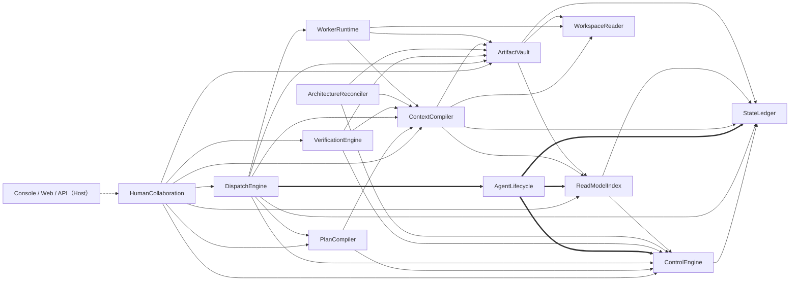

# 模块分工与依赖 DAG（Prompt 4 产物）

```yaml
status: draft-for-review
updated: 2026-09-22
产物: Prompt 4（模块分工与 DAG）
上位产物: docs/refactor/ARCHITECTURE.md（2026-09-21，Prompt 2）；docs/refactor/modules/**（2026-09-22，Prompt 3）
现状 DAG（基线）: 12 Module / 34 条 Module 间依赖边 —— my-coding-platform-docs/agent_platform/ARCHITECTURE.md:193-243，与 coding-platform/scripts/module-map.mjs 的 allowedModuleDependencies 逐条一致
目标 DAG（本稿）: 13 Module / 38 条边（净 +4；切断的边 0 条，语义切断 2 类）
性质: 文档层结论。本轮不改源码、不改 module-map.mjs；目标 38 条边尚未进入机械检查范围
回填目标: my-coding-platform-docs/agent_platform/dev_docs/**（由 Prompt 7 按维护流程执行）
```

> **读法（三条，避免把本表读成别的东西）**
>
> 1. **箭头方向＝调用者 → 被调用者**，含义是"调用者长期依赖被调用 Module 的 Interface"（见架构稿 §3）。本稿与架构稿 §1 的 Plane 信息流图**不是同一张图**，两者不可互推（见架构稿 §1 末注）。
> 2. **三种边必须分开**（见架构稿 §3.1）：模块允许依赖某接口＝**架构规则**；文件实际 import＝**源码事实**；Host 注入 provider＝**装配事实**。本稿边表用「**边种类**」列标注三者，**不因某条边没有源码 import 就删边**。
> 3. 分责与边界以架构稿为准；本稿只做**边的登记与差异核算**，不复述架构稿正文——需要背景时读 `见架构稿 §X.Y`。

---

## 1. 重构后的模块划分（13）

| Plane | Module | 一句话职责 | 代码目录 | 本次处置 |
| --- | --- | --- | --- | --- |
| Human Interaction | **HumanCollaboration** | 面向人的统一入口：目标／决定／查询／架构协商与接管**读**侧 | `coding-platform/src/interaction/human-collaboration/` | 保留（原名原目录） |
| Control | **PlanCompiler** | 有界协调：初始协调、人工计划、修订提案、机械返工提案 | `coding-platform/src/control/plan-compiler/` | 保留（原名原目录） |
| Control | **ControlEngine** | 唯一的状态推进者与守卫：授权／CAS／幂等／归约／治理激活 | `coding-platform/src/control/control-engine/` | 保留（原名原目录） |
| Control | **DispatchEngine** | 派发与运行准入：outbox 执行、准备与 claim 顺序、租约、运行事实对账 | `coding-platform/src/control/dispatch-engine/` | 保留（原名原目录） |
| Control | **VerificationEngine** | 验证编排：检查生命周期、Evidence 受理、Reviewer 工作、探索报告资格 | `coding-platform/src/control/verification-engine/` | 保留（原名原目录） |
| Control | **ArchitectureReconciler** | 架构对账：图差分 → Finding／Brief → 候选物化 | `coding-platform/src/control/architecture-reconciler/` | 保留（原名原目录） |
| Control | **AgentLifecycle** | Agent/Session 生命周期决策与提案：复用／产生／拆解／压缩／归档／重新启用；决定用哪个角色配置、创建／解析哪条 Session、关联哪些必要任务 | 规划 `coding-platform/src/control/agent-lifecycle/`（**当前无目录、无契约、无实现**） | **新增** |
| Data | **StateLedger** | 原子提交 snapshot + Event；CAS、幂等、事件页 | `coding-platform/src/data/state-ledger/` | 保留（原名原目录） |
| Data | **ArtifactVault** | 不可变正文持久化与材料授权适用性 | `coding-platform/src/data/artifact-vault/` | 保留（原名原目录） |
| Data | **ReadModelIndex** | 从已提交事件重建查询投影（含**任务图**与**架构图查询**） | `coding-platform/src/data/read-model-index/` | 保留（原名原目录） |
| Data | **ContextCompiler** | **五类触发点**的有界选材（边界本稿收缩） | `coding-platform/src/data/context-compiler/` | 保留（原名原目录） |
| Data | **WorkspaceReader** | 路径边界内的源码与原图来源捕获 | `coding-platform/src/data/workspace-reader/` | 保留（原名原目录） |
| Execution | **WorkerRuntime** | 一次真实内核运行：启动、取消、能力探测、公开观察与快照 | `coding-platform/src/execution/worker-runtime/` | 保留（原名原目录） |

**处置统计**

| 处置 | 数量 | 说明 |
| --- | --- | --- |
| **新增** | **1** | `AgentLifecycle`（Control plane）。理由＝**职责与变化边界**：生命周期决策今天没有任何 Module 拥有（架构稿 §6.1／§11.1 U1）；**不是**"可测试性"论据 |
| **保留** | **12** | 全部**原名、原目录**，无改名、无改目录 |
| 合并 | 0 | —— |
| 拆分 | 0 | `ContextCompiler` 收缩的是**职责**不是模块（架构稿 §6.2）；仍在原模块原目录内 |
| 删除／归档 | 0 | —— |

**计数核对**：control 6（PlanCompiler／ControlEngine／DispatchEngine／VerificationEngine／ArchitectureReconciler／**AgentLifecycle**）、data 5、execution 1、interaction 1 = **13**，与架构稿 §2 Module Registry 逐条一致。两张图能力**不新增 Module**，由既有 Module 的职责扩展承担（架构稿 §5.1／§11.1 U2）。

**归属口径**：`coding-platform/scripts/module-map.mjs` 的 `owner()` 按**路径前缀**判定，是模块归属的**唯一可判定来源**。`src/contracts/`、`src/app/`、`src/harness/`、`src/composition/`、`src/ui/`、`src/storage/`、`src/fixtures/`、`src/testing/` 是共享面与组合根，**不是 Module**。

---

## 2. 依赖 DAG（13 Module / 38 条边）

**箭头方向：调用者 → 被调用者。**



| 线型 | 含义 | 条数 |
| --- | --- | --- |
| `-->` | 保留的既有边（架构稿 §1 图例：长期依赖／既有流向） | 34 |
| `==>` | **本次新增**的 Module 依赖边 | 4 |
| `-.->` | 宿主边（`Apps → HumanCollaboration`）；**不计入 38 条** | 1 |

### 2.1 等价文本边表（正向邻接，与上图逐条等价）

| 调用者 | 被调用者 | 条数 |
| --- | --- | --- |
| HumanCollaboration | PlanCompiler、ControlEngine、ReadModelIndex、DispatchEngine、ContextCompiler、VerificationEngine、ArtifactVault | 7 |
| PlanCompiler | ContextCompiler、ControlEngine | 2 |
| ControlEngine | StateLedger | 1 |
| DispatchEngine | ControlEngine、ContextCompiler、WorkerRuntime、ArtifactVault、StateLedger、PlanCompiler、**AgentLifecycle** | 7 |
| VerificationEngine | ControlEngine、ContextCompiler、ArtifactVault | 3 |
| ArchitectureReconciler | ControlEngine、ContextCompiler、ArtifactVault | 3 |
| **AgentLifecycle**（新增） | ControlEngine、StateLedger、ReadModelIndex | 3 |
| WorkerRuntime | ContextCompiler、WorkspaceReader、ArtifactVault | 3 |
| ContextCompiler | StateLedger、ArtifactVault、ReadModelIndex、WorkspaceReader | 4 |
| ArtifactVault | StateLedger、ReadModelIndex、WorkspaceReader | 3 |
| ReadModelIndex | StateLedger、ControlEngine | 2 |
| StateLedger | （无：`StateLedger → {}`，DAG 的**汇**） | 0 |
| WorkspaceReader | （无：`WorkspaceReader → {}`，DAG 的**汇**） | 0 |
| **合计** | | **38** |

§3 是同一 38 条边的逐条详解表；两个表与上图**互为等价**（邻接表可逐行展开为 §3 的行）。

### 2.2 无环说明

| 项 | 内容 |
| --- | --- |
| **唯一强制判据** | `coding-platform/scripts/module-map.mjs` 的 `allowedModuleDependencies` |
| **机械检查** | `scripts/check-module-boundaries.mjs` 做两项检查：**未声明依赖**（Module→Module 且非 type-only）＋ **DFS 环检测**（`checkDag`，`Declared Module dependency cycle`）；命令 `pnpm check:architecture`；`tests/contracts/module-ownership.test.ts` 另以 `MODULE_DIRS` 重复断言目录归属（与 `module-map.mjs` 是**故意重复**的两份） |
| **两个汇** | `StateLedger → {}`、`WorkspaceReader → {}`（出度 0；本稿的 4 条新增边**不改变**这两个汇） |
| **新增边不成环（逐条判据）** | `DispatchEngine → AgentLifecycle` 不成环，因为 `AgentLifecycle` 的三条出边（`ControlEngine`、`StateLedger`、`ReadModelIndex`）都在其下游，且它**只被 `DispatchEngine` 依赖**——没有任何其他 Module 依赖它。反向不可能出现 `AgentLifecycle → … → DispatchEngine` 的回路：`ControlEngine → {StateLedger}`、`StateLedger → {}`、`ReadModelIndex → {StateLedger, ControlEngine}`，三条路径都在汇处终止，均到不了 `DispatchEngine` |
| **运行期反馈环 ≠ 源码环** | 运行时可形成 `Control → outbox → Worker → Fact → Control` 的反馈循环，但源码依赖保持无环（基线口径，保留；架构稿 §3.1） |
| **检查器盲区（如实声明，C-14）** | 只走 `src`、只解析**相对** import；遗漏 `vendor/**`、动态 `import()`、白名单路径；`.py` 只做归属不解析；type-only 不计入未声明依赖。因此检查器结论只能限定为"**文件归属与 import/export 的机械证据**"，不等于完整依赖图 |

---

## 3. 边表（38 条正向，逐条）

**列口径**：`传递内容`／`理由`／`不变量` 逐条对齐 13 篇模块文档的 §3（依赖）／§4（被依赖）／§7（本次接口变化方向）；`不变量` 列取该边**直接服务**的不变量编号，模块级全量清单见各篇 §7，本列不重复列出该模块的全部编号。

### 3.1 HumanCollaboration 的出边（7 条，全部保留）

| # | 调用者 → 被调用者 | 传递内容 | 边种类 | 本次动作 | 理由 | 不变量 |
| --- | --- | --- | --- | --- | --- | --- |
| 1 | HumanCollaboration → PlanCompiler | `request(intent)`／`requestInitial(intent)`／`accept(resultRef)`；`amend` 经其产生有界提案与影响 → 计划／修订提案、所用来源与未决项 | DI 装配（D-1） | 保留（消费内容扩展：I12） | 人的变更意图必须落成有界提案并**绑定具体方案版本**；**解释 ≠ 重新提案**，解释不得再触发一次 `requestInitial`（架构稿 §7.4.2／§7.1 I12） | #1／#25 |
| 2 | HumanCollaboration → ControlEngine | `submit`／`bootstrap`／`install`／`activate`／`applyPlanChange`／`recordUserDecision`；`grantMaterialAccess`／`revokeMaterialAccess`；`recordArchitectureReview` → 人的目标／决定／授权请求与 `CommandReceipt` | DI 装配（D-1） | 保留 | 人的决定必须经**唯一状态推进者**受理并落账；成功只以正式 Control 回执为准 | #1／#3／#6 |
| 3 | HumanCollaboration → ReadModelIndex | `goal`／`planGraph`／`mailboxView`／`console*`／`unifiedStatusView`；目标候选 `WorkSessionProjectionPort.query`／`ArchitectureGraphQueryPort.neighborhood` → 状态、图、时间线、工作卡片／角色名册 | DI 装配（D-1） | 保留（**消费内容扩展**：I6／I11） | 正式显示来自投影；**图检索也走投影**；归档对象默认隐藏、只读保留 | #4／#19／#22 |
| 4 | HumanCollaboration → DispatchEngine | `SnapshotPort.snapshot`（已有契约，默认 Host stub，**真实转发未接**）；`ExplorationContextDrivePort.prerequisites`；人的控制请求经既有 `drive` 路径执行 | DI 装配（D-1） | 保留 | 派发权在 DispatchEngine；**控制请求的受理与实际执行结果分开**（不承诺转发已实现） | #1／#15 |
| 5 | HumanCollaboration → ContextCompiler | `ExplorationSessionContextPort`、`HistoryMaterialContextPort`；查询材料 → 有界材料与来源清单；历史入口交其解析来源与精确授权依据 | DI 装配（D-1） | 保留（语义收紧：只在触发点发生；**图检索不经它**） | 历史材料的来源与精确授权依据只能由 ContextCompiler 解析；复用范围是推荐线索而非白名单 | #17／#22／#28 |
| 6 | HumanCollaboration → VerificationEngine | `ExplorationReportPort`、`RecordedVerificationPort` → 探索报告的来源资格核验与正式 Evidence 请求 | DI 装配（D-1） | 保留 | 报告资格由 VerificationEngine 判定；交互面**不裁决完成** | #2／#6 |
| 7 | HumanCollaboration → ArtifactVault | `ArtifactPort.put`／`open(ref, accessScope)` → 交互正文（人的请求／审阅）先入 Vault 得到 `bodyRef` | DI 装配（D-1） | 保留 | 正文承载与授权适用性判定归 Vault；交互面不复制正文 | #17／#28 |

### 3.2 PlanCompiler 的出边（2 条，全部保留）

| # | 调用者 → 被调用者 | 传递内容 | 边种类 | 本次动作 | 理由 | 不变量 |
| --- | --- | --- | --- | --- | --- | --- |
| 8 | PlanCompiler → ContextCompiler | `PlanningMaterialPort`（`amendment`／`initialRequest`／`initialResults`／`initialPlan`／`initialCurrentness`／`acceptedInitialPlans`）、`OperatorPlanningContextPort`、`ExecutionFeedbackContext` → 规划／人工计划／反馈材料、版本核对与显式缺口 | 源码 import（**type-only**：`execution-feedback-compiler.ts:3`、`feedback-decision-compiler.ts:5`） | 保留 | 规划只提案；取材、`selectedRefs`／`gaps`／manifest 的唯一生产者是 ContextCompiler | #1／#28 |
| 9 | PlanCompiler → ControlEngine | `InitialPlanningControl = Pick<ControlEngine,'submitQueryJob'\|'closeQueryJob'\|'applyPlan'>`；`Pick<ControlEngine,'resolveTaskWorkIdentity'>`；另复用 `control-engine/policies/initial-plan-admission.ts` 的规范化纯函数（C-10／U2） → 只读 QueryJob 意图与关闭、计划受理请求、权威工作身份 | 源码 import（`initial-plan-compiler.ts:5`、`rework-proposal.ts:9`） | 保留（**消费内容扩展**：影响报告改读权威工作身份） | 提案必须由 Control 受理才算结构权威；`PlanRevision` 接受时固定 `ArchitectureBaseline` 与 `CompletionPolicy` revision | #1／#3／#12 |

### 3.3 ControlEngine 的出边（1 条，保留）

| # | 调用者 → 被调用者 | 传递内容 | 边种类 | 本次动作 | 理由 | 不变量 |
| --- | --- | --- | --- | --- | --- | --- |
| 10 | ControlEngine → StateLedger | `load`／`commit`／`events`；治理引用只读解析 `resolveProjectArchitectureBaseline`／`resolveProjectCompletionPolicy`／`loadProjectArchitectureBaselineActive` → canonical snapshot 与 EventPage 读取；snapshot + Event + 幂等回执 + outbox intents 的**原子 commit** 与 CAS expected-version 集合 | 源码 import（`goal-change.ts:60`、`baseline-evolution.ts:65`、`plan-acceptance.ts:48`） | 保留 | 唯一状态推进者 + 唯一原子提交路径；`StateLedger` **只提交、不 fold**；新增 commitKind 与事件类型走同一路径（I5） | #3／#11／#16 |

### 3.4 DispatchEngine 的出边（7 条：6 条保留 + **1 条新增**）

| # | 调用者 → 被调用者 | 传递内容 | 边种类 | 本次动作 | 理由 | 不变量 |
| --- | --- | --- | --- | --- | --- | --- |
| 11 | DispatchEngine → ControlEngine | `dispatchReadiness`／`claimTask`／`closeQueryJob`、`startRun`／`runFact`／`authorizeModelRequest`、`submitControl`／`reconcileControlIntent`／`reconcileRun`、`bindWorkContext`／`linkWorkRun`／`resolveTaskWorkIdentity`、`acceptReworkProposal`、`grantMaterialAccess` → 派发准入与**唯一领取**、运行启动与事实回交、控制意图对账、工作身份权威解析、返工受理、材料授权与模型调用许可 | 源码 import（`role-spec-read.ts:17,21`、`coordination-drive.ts:72`） | 保留 | 顺序与准入必须由**守卫那一份**唯一决定；派发结果承载复用决策与来源绑定 | #1／#3／#7／#15 |
| 12 | DispatchEngine → ContextCompiler | `TaskContextPort`／`QueryContextPort`／`ReviewerContextPort`；`PlanningMaterialPort.acceptedInitialPlans`；`WorkRunMaterialCompiler`／`FeedbackMaterialCompiler`／`DeliveryMaterialCompiler`／`OrdinaryPredecessorMaterialCompiler`；`ExplorationContextCompiler.prerequisites／select／assemble`；`RuntimeContextMaterials` → 有界材料与三态结果 | 源码 import（`work-material-drive.ts:27/32/33`、`leased-worker-runtime.ts:6`） | 保留（语义收紧 ＋ I2：trigger 区分"**直接续用**"与"**需要编译**"） | 只有需要编译的分支才取材；直接续用与普通消息**绕过编译**；缺口作为持久退避原因回传 | #17／#25／#28 |
| 13 | DispatchEngine → WorkerRuntime | `RunPort.capabilities`／`start`；`RunHandle.pollFreshEvents`／`pollModelRequestEvidence`；`RuntimePreparationPort.all`／`preflight`／`prepare`；`RuntimeReconciliationPort.cancel?`／`all`／`markUnknown`；`ReadOnlyQueryPort`；`HandoffControlPort`；`LifecycleControlPort`／`ContextContinuationPort`（生产接线待完成） → 真实启动与事件／调用证据、准备与对账、控制与接续结果 | 源码 import（**type-only**：`leased-worker-runtime.ts:9`） | 保留 | 租约持有者是 **Run**（`TaskLeaseSnapshot.holderRunId`）；执行侧不归约、不编排 | #7／#15 |
| 14 | DispatchEngine → ArtifactVault | `ArtifactPort.put`／`open` → 消息／报告／delta 正文持久化与按授权读取；admission 前的精确验读 | DI 装配（D-2） | 保留 | 正文与授权判定归 Vault；复用必须**在读取时重核**授权 | #17／#28 |
| 15 | DispatchEngine → StateLedger | `load`／`events`／`pendingDispatchIntents`；`consumeDispatchedRun` 的可选 `ledger` 用于完整 scope 与恢复校验 → canonical 记录、pending outbox 与协调扫描页 | DI 装配（D-2） | 保留（**本模块不 `commit`**） | 读取事实与 outbox 用于准入；正式提交一律经 ControlEngine | #1／#3 |
| 16 | DispatchEngine → PlanCompiler | `ReworkPlanCompiler`；`resolvePlanningWorkIdentities`；`ExecutionFeedbackCompiler.validate` → 从源计划与问题机械推导的返工提案、按权威身份取材、执行反馈资格校验 | 源码 import（`rework-drive.ts:14/15`） | 保留 | 返工提案由规划方产生；身份取材以权威解析为准 | #1／#22 |
| 17 | **DispatchEngine → AgentLifecycle** | `decide(request)`（候选）→ 派发前取"用哪个角色配置、创建还是复用哪条 Session、关联哪些必要任务"的决策与推荐范围；派发结果记录**复用决策与其排除理由** | 逻辑依赖（**设计新增**；源码 import 与 DI 装配点未定） | **新增** | 派发前的选人／选 Session 决策必须有唯一落点（架构稿 §3.2／§7.1 I2）；"唯一派发入口"按目标口径收口（统一 `drive` 或共用不可绕过的准入与租约逻辑） | #16／#17／#27 |

### 3.5 VerificationEngine 的出边（3 条，全部保留）

| # | 调用者 → 被调用者 | 传递内容 | 边种类 | 本次动作 | 理由 | 不变量 |
| --- | --- | --- | --- | --- | --- | --- |
| 18 | VerificationEngine → ControlEngine | `VerificationControlPort = Pick<ControlEngine,'submitEvidence'\|'reduceTask'\|'reduceGoal'\|'recordPatch'>`；`ReworkDispositionPort`（`ControlReworkDisposition.projectIssues`） → 正式 Evidence 请求与 Task／Goal 归约请求；义务处置的只读解释 | DI 装配（D-3） | 保留 | Verification 只提交事实与 verdict，**不直接完成 Task**；verdict 必须绑定 revision 与来源 | #2／#6 |
| 19 | VerificationEngine → ContextCompiler | `VerificationContextPort`＋`RunOutputMaterialPort.runOutputWitness`；`resolveRound` 提供轮次所需完整身份，`openReport` 按授权开报告正文 → 精确版本材料、canonical 运行产出见证、政策／baseline 解析 | DI 装配（D-3） | 保留（语义收紧：审查材料＝**L3 引用 ＋ 按需正文**） | 审查链路的**有界性由"引用 + 按需正文"保证**，不由"多装材料"保证 | #6／#28 |
| 20 | VerificationEngine → ArtifactVault | `ArtifactPort.put`／`open`；授权适用性由 `MaterialAccessResolver` 判定 → 原始检查报告、审阅报告与 problem 材料的正文持久与按授权读取 | DI 装配（D-3） | 保留（语义收紧） | 原始检查报告先入 Vault；复用**不得沿用旧授权**；授权判定只有 Vault 一份 | #6／#17／#28 |

### 3.6 ArchitectureReconciler 的出边（3 条，全部保留）

| # | 调用者 → 被调用者 | 传递内容 | 边种类 | 本次动作 | 理由 | 不变量 |
| --- | --- | --- | --- | --- | --- | --- |
| 21 | ArchitectureReconciler → ControlEngine | `Pick<ControlEngine,'recordArchitectureInspection'\|'recordArchitectureFinding'\|'recordArchitectureDecisionBrief'>` → 检查、Finding、DecisionBrief 的**逐次落账回执**，只有 committed 才继续 | DI 装配（D-5） | 保留 | 候选生产者不得因共享契约获得**决定或激活**的权力；`ArchitectureBaseline` 不可改写 + CAS 激活 | #13／#20／#21 |
| 22 | ArchitectureReconciler → ContextCompiler | `ArchitectureContextPort.assemble(intent)`；`BaselineEvolutionContextPort.assemble(proposalRef)` → 相同版本的规范、代码关系、图材料与证据；精确 plan pin 与真实 reader run 核对 | DI 装配（D-6） | 保留（**语义收紧**：对账材料走有界选材） | 对账材料与选材统一走五类触发点；正式图必须 pin 到一个已接受的 baseline revision | #12／#21／#28 |
| 23 | ArchitectureReconciler → ArtifactVault | `ArtifactPort.put`／`open`（图正文 `bodyRef`） → baseline／当前图、真实 delta、Brief 正文的保存与读取；**保持 reader owner** | DI 装配（D-5） | 保留 | 图结构与关联正文持久保存，但**不判定正文业务结论**、不成为第二权威 | #20／#22 |

### 3.7 **AgentLifecycle** 的出边（3 条，全部 **新增**）

| # | 调用者 → 被调用者 | 传递内容 | 边种类 | 本次动作 | 理由 | 不变量 |
| --- | --- | --- | --- | --- | --- | --- |
| 24 | **AgentLifecycle → ControlEngine** | 产生／拆解／压缩／归档／重新启用的**提案**（含进入／退出条件判据与证据引用） | 逻辑依赖（**设计新增**） | **新增** | 四动作全部走"**提案 → 归约**"；ControlEngine 是唯一状态推进者（见架构稿 §4.4） | #1／#3／#16／#18 |
| 25 | **AgentLifecycle → StateLedger** | **只读** `load(ref)`／`events(query)`：`AgentInstanceV1`、`WorkParticipationV1`、`RoleSpecRevision`／矩阵 pin、`WorkContextBinding` | 逻辑依赖（**设计新增**） | **新增** | 决策依据必须是 **canonical 事实**而非投影；Ledger 仍是唯一原子提交方 | #3／#16／#22 |
| 26 | **AgentLifecycle → ReadModelIndex** | **只读** `activeAgent`／通信视图；【目标候选】`WorkSessionProjectionPort.query`（I6）：忙闲／当前工作／任务与角色视图（`ActiveAgentView`、`MailboxViewV1`、角色视图） | 逻辑依赖（**设计新增**） | **新增** | "复用是否可行"需要**跨聚合视角**；投影只读、不作权威 | #4／#16 |

### 3.8 WorkerRuntime 的出边（3 条，全部保留）

| # | 调用者 → 被调用者 | 传递内容 | 边种类 | 本次动作 | 理由 | 不变量 |
| --- | --- | --- | --- | --- | --- | --- |
| 27 | WorkerRuntime → ContextCompiler | `assembleRuntimeContext`；`QueryExecutionMaterialPort.readFact` → envelope、精确运行范围与材料访问能力 → 运行输入与 manifest；Query 按需读取事实及来源（≤24 条事实引用／QueryRun） | 源码 import（`coding-agent-runtime.ts:11`） | 保留 | manifest **只标记实际读入**的内容；`TaskContextPort` 产出由 Dispatch 传入 | #6／#28 |
| 28 | WorkerRuntime → WorkspaceReader | `read(query) → sourced／unsupported／stale／rejected`；role `code` 通道；`denied-prefixes` owner → 路径边界内受限源码与来源材料 | 源码 import（`exploration-tools.ts:5-8`、`coding-agent-runtime.ts:12`、`observed-model-run.ts:9`） | 保留 | 变化明确拒绝，**不声称多文件原子快照**；来源读取不改变写权 | #7／#28 |
| 29 | WorkerRuntime → ArtifactVault | `ArtifactPort.put`／`open`；`RuntimeObservationJournal` → **公开观察的原子保存**与正文承载；执行记录正文 body-first | 源码 import（`coding-agent-runtime.ts:1`、`read-only-query-runtime.ts:1`、`query-answer-audit.ts:2`） | 保留 | 公开观察**不是正式完成**；归档 ≠ 删除，正文与来源关系保留 | #19／#22 |

### 3.9 ContextCompiler 的出边（4 条，全部保留 + 语义切断①）

| # | 调用者 → 被调用者 | 传递内容 | 边种类 | 本次动作 | 理由 | 不变量 |
| --- | --- | --- | --- | --- | --- | --- |
| 30 | ContextCompiler → StateLedger | `load(ref)`（`feedback-materials.ts` 用 `Pick<StateLedger,'load'> & Partial<Pick<StateLedger,'events'>>`）；`ScopeCatalogPort.jobs` → 精确 canonical 记录、`TaskReduction`／effective Evidence、GoalPhase 等来源事实 | 源码 import（`verification-context.ts:17`、`baseline-evolution-context.ts:5`、`verification-migration-context.ts:4`） | 保留（**语义切断①**：不再"每次 compile 全量取料"） | 只读正式事实；**不 fold、不写 canonical**；事实权威在账本 | #3／#22 |
| 31 | ContextCompiler → ArtifactVault | `open(ref, accessScope)`（含可选 `currentBasis` 与 `MaterialAccessResolver`）、`put(record)`；`RuntimeObservationJournal` 的独立读对象 → 材料正文与摘要 | DI 装配（D-7） | 保留（**语义切断①**） | 授权与适用性**由 Vault 判定**，本模块不自建授权判定 | #17／#28 |
| 32 | ContextCompiler → ReadModelIndex | `goal(query)`／`planGraph(query)`／架构审查视图；目标候选 `ArchitectureGraphQueryPort.neighborhood` → 公开投影与图查询结果 | DI 装配（D-7） | 保留（**语义切断①**；见架构稿 §3.2 语义收紧） | 消费已有查询结果，**不重新实现状态归约** | #4／#23 |
| 33 | ContextCompiler → WorkspaceReader | `read(query)`；`ArchitectureSourceCapturePort`；role `code` 通道与 `denied-prefixes` → 路径边界内的源码、Git 差异、可用代码／测试索引与图来源 | 源码 import（`exploration-session-context.ts:9`、`operator-planning-context.ts:5`、`reviewer-context.ts:14`） | 保留（**语义切断①**；I-补：一次不可变捕获对应多页读取） | 源码取材一律交 WorkspaceReader；来源 pin 与原义保留 | #7／#22／#28 |

### 3.10 ArtifactVault 的出边（3 条，全部保留）

| # | 调用者 → 被调用者 | 传递内容 | 边种类 | 本次动作 | 理由 | 不变量 |
| --- | --- | --- | --- | --- | --- | --- |
| 34 | ArtifactVault → StateLedger | `load(ref)`（经解析器与 policy 复核 canonical） → canonical 的授权事实、撤销与版本；`currentBasisValid` 所需的账本持有版本（计划／工作区） | DI 装配（D-8：**仅为契约类型**） | 保留 | 权限解析在**读取时**重核 canonical grant；Vault **不 fold、不写 canonical** | #3／#17 |
| 35 | ArtifactVault → ReadModelIndex | `materialAccessCandidates({reader, material})`（**完整候选，不截断**）／`materialAccessGrants(query)`（有界展示 ≤256 条，**不得当作授权候选**） → 候选发现 | DI 装配（D-8：**仅为契约类型**） | 保留 | Vault 拿到候选后**自己判定**；投影不是完成判定器，也不得成为授权候选 | #4／#17 |
| 36 | ArtifactVault → WorkspaceReader | `SourceApplicabilityPort`（`materialSourcePinIsCurrent` 一类来源校验） → 原生来源适用性与来源 pin 核对 | 源码 import（`material-access-policy.ts:5`） | 保留 | 方向是 **Vault → Reader，Reader 不反向调用 Vault**；来源 pin 可核验 | #17／#22 |

### 3.11 ReadModelIndex 的出边（2 条，全部保留）

| # | 调用者 → 被调用者 | 传递内容 | 边种类 | 本次动作 | 理由 | 不变量 |
| --- | --- | --- | --- | --- | --- | --- |
| 37 | ReadModelIndex → StateLedger | catch-up／rebuild 使用 `events`；治理与 Memory 查询按需只读 canonical active／revision；`InitialPlanningView` 使用 `load` 与 `ScopeCatalogPort.jobs`；积压查询使用 `pendingDispatchIntents` → 已提交事件页、精确 canonical 事实、目录与积压记录 | DI 装配（D-9） | 保留 | 投影只从**已提交事件**重建、不接受直接状态写入；各自保持游标和缺口语义 | #3／#4／#22 |
| 38 | ReadModelIndex → ControlEngine | `PolicyExplanationPort`（`ControlPolicyExplanation`）；`work-identity-resolution.ts` 的 `dedupeTaskWorks` → 本模块传投影材料，换回证据适用性／有效集合与计划变更解释 | 源码 import（`read-model-index.ts:19`、`sqlite-read-model-index.ts:18`）＋ DI 装配（`PolicyExplanationPort` 构造注入同一实现） | 保留（**显式 ReadModel→Control 依赖，不能因 DI 从图上省略**；U3） | 解释与权威归并规则只有 Control owner 一份；复用**纯归并规则**，不调用该文件内会扫描 Ledger 的异步 `resolveTaskWorkIdentity` | #1／#4／#22 |

### 3.12 出度为 0 的模块（两个汇）

| Module | 出边 | 说明 |
| --- | --- | --- |
| StateLedger | 0 | DAG 的汇之一：不依赖任何 Module；不 fold、不做语义裁决（架构稿 §3.1） |
| WorkspaceReader | 0 | DAG 的汇之一：不调用 Ledger 或 Vault；**不反向调用 Vault**（方向是 `ArtifactVault → WorkspaceReader`） |

### 3.13 反向表（38 条，与正向逐条对称）

| 被调用者 | 被谁依赖（反向边） | 条数 |
| --- | --- | --- |
| StateLedger | ControlEngine、DispatchEngine、ContextCompiler、ArtifactVault、ReadModelIndex、**AgentLifecycle** | 6 |
| WorkspaceReader | ContextCompiler、ArtifactVault、WorkerRuntime | 3 |
| ControlEngine | HumanCollaboration、PlanCompiler、DispatchEngine、VerificationEngine、ArchitectureReconciler、ReadModelIndex、**AgentLifecycle** | 7 |
| ContextCompiler | HumanCollaboration、PlanCompiler、DispatchEngine、VerificationEngine、ArchitectureReconciler、WorkerRuntime | 6 |
| ArtifactVault | HumanCollaboration、DispatchEngine、VerificationEngine、ArchitectureReconciler、ContextCompiler、WorkerRuntime | 6 |
| ReadModelIndex | HumanCollaboration、ContextCompiler、ArtifactVault、**AgentLifecycle** | 4 |
| PlanCompiler | HumanCollaboration、DispatchEngine | 2 |
| VerificationEngine | HumanCollaboration | 1 |
| DispatchEngine | HumanCollaboration | 1 |
| WorkerRuntime | DispatchEngine | 1 |
| **AgentLifecycle** | DispatchEngine | 1 |
| ArchitectureReconciler | （无 Module；当前仅 harness 可调用 `inspect`） | 0 |
| HumanCollaboration | （无 Module；Host／UI 调用**不计入 38 条**） | 0 |
| **合计** | | **38** |

**对称核对**：6+3+7+6+6+4+2+1+1+1+1+0+0 = **38** ＝ 正向表 38 条。13 篇模块文档的 §3／§4 与本节逐条一致。

### 3.14 边种类的判定口径（新列的证据来源）

证据来源：`docs/refactor/source-analysis.md` §2.2（14 条实现边）、§2.3（越界与共享面依赖）、**§2.4 差异表 D-1…D-19**。34 条既有边的分类结果：

| 边种类 | 条数 | 具体边 |
| --- | --- | --- |
| **源码 import** | **14** | #8、#9、#10、#11、#12、#13、#16、#27、#28、#29、#30、#33、#36、#38（其中 #8、#13 为 **type-only**） |
| **DI 装配**（无源码 import） | **20** | #1–#7（D-1，HumanCollaboration 全部 7 条出边）、#14／#15（D-2）、#18／#19／#20（D-3）、#21／#22／#23（D-5／D-6）、#31／#32（D-7）、#34／#35（D-8：**仅为契约类型**）、#37（D-9） |
| **逻辑依赖（设计新增，无 import 与装配事实）** | **4** | #17、#24、#25、#26 |

- 14 ＋ 20 ＝ 34（既有边按"**有无源码 import 事实**"的完整划分）；#38 同时存在 `dedupeTaskWorks` 的源码 import 与 `PolicyExplanationPort` 的构造注入，上表按"有源码 import"归类，并在 #38 单元格内注明并存事实。
- 机械旁证（本轮实跑）：`node scripts/check-module-boundaries.mjs` 在**现状源码**上报告 **12** 条非 type-only 的 Module→Module 实现边，与上表 14 条中去除 2 条 type-only（#8、#13）后的结果一致。
- **`source-analysis.md` §2.4 判定原话**（可引用）："22 条真实依赖里，只有 14 条被声明表覆盖；其中 8 条是运行期 DI（无源码边），4 条指向内核副本或 Storage，2 条指向 Fixtures。" —— 该句统计的是**§2.3 的 22 条真实依赖**（其中未覆盖部分含 8 条 DI），**不是**本节对 34 条声明边的分类；本节按 §2.2／§2.4 逐条复核后给出 14 ＋ 20 的划分。
- 架构稿 §3.1 已要求"**三种边必须分开**"（模块允许依赖某接口＝架构规则；文件实际 import＝源码事实；Host 注入 provider＝装配事实），故本列只标注证据种类，**不得据此删边**（无源码 import 不等于无逻辑依赖；共享 Contracts 与 DI 是正常方式）。

---

## 4. 本次要切断的边

**结论**：**切断的边 0 条（边数不变）**；本次切断的是 **2 类语义**。方向、条数与声明均保持 38 条中的对应行；边表已把受 ① 影响的边标注为"保留（语义切断①）"，② 是禁止条款、**不对应任何声明边**。

| # | 切断什么 | 为什么 | 原功能由谁承接 | 边表影响 |
| --- | --- | --- | --- | --- |
| ① | ContextCompiler 的"**每次 compile 全量取料**"——不再因一次 Run／一次派发／一条消息而无条件重新装配，也不再隐式依赖全部材料来源的当前版本 | 成本与边界双重驱动：A3 要求"声明式触发 + 增量刷新 + 必要时重建"；#25 要求重新装配有金额判据且**不得绕过 currentness 检查**；§6.2.1 明确"默认直连、只在触发点装配" | **仍是 ContextCompiler**（模块内部改法）：共用材料读取／精确引用／manifest／缺口保真／增量处理；触发声明由 **PlanCompiler**（I12"材料触发声明"）与派发侧显式给出；分叉点在 **DispatchEngine** 的 `drive`（I2：trigger 区分"直接续用"与"需要编译"）；普通消息与 Kernel 成功恢复**不调用**（#18：Kernel 已完成的有效压缩直接使用） | **0 条边删除**。受影响＝ContextCompiler 的 **4 条出边**（#30–#33，语义收紧）＋ **6 条入边**（#5、#8、#12、#19、#22、#27，触发方式收紧） |
| ② | ContextCompiler 的"**选人／调度／正式状态归约**"——这三项本来就不在它的文档职责内，本稿把它们写成**禁止**，防止实现继续承载 | 选人属控制面决策（`decision/02` §8.1 原话："它们不是数据面的问题，而是控制面的决策"）；调度必须唯一 `drive`；正式状态归约只能 ControlEngine（#1） | **选人**→ AgentLifecycle（决策）＋ DispatchEngine（签发）＋ ControlEngine（守卫）；**调度**（何时派发、顺序、租约、安全点）→ DispatchEngine（唯一 `drive` 的目标口径）＋ ControlEngine；**正式状态归约**（Task／Goal／义务／Evidence 适用性）→ ControlEngine（归约路径与 `CompletionPolicy` 不变） | **0 条边**：该禁止不对应任何声明边；并**不新增** `ContextCompiler → 角色目录／AgentLifecycle` 的边（架构稿 §6.3 已按"**有意为之**"登记：选人不经 Context，避免"检索 → 选人 → 再检索"的耦合） |

**保留的边与不变**：ContextCompiler 的 4 条出边与 6 条入边**全部保留**——收缩的是**职责与触发方式**，不是依赖关系（`runtime-collaboration.md:110`、`modules/data/context-compiler.md:74` 的既有禁止一并保留：不启动模型、不写正式状态、不裁决完成、不调用 Control、不被 Control 反向调用）。

**替代方案与代价**：

| 替代方案 | 代价 | 结论 |
| --- | --- | --- |
| 激进切断：删掉部分材料来源边（如 `ContextCompiler → ReadModelIndex`） | 有界选材仍需要查询投影（架构稿 §3.2 明确"保留但语义收紧"）；删边会迫使它自行重算状态归约，反而制造第二份规则 | 否 |
| 只给现有全量取料加一层缓存，不切语义 | 消息路径仍会全量装配；且 #25 要求金额判据、不得用缓存绕过 currentness；与 A1／A3 的目标相反 | 否 |
| 本轮取"语义切断 ＋ 分步落地"（本稿） | 需要接口侧同时改 I1／I2／I12 的输入语义；收益按 U12 指标表**标"待测"**，不以文件数证明 | **采用** |

---

## 5. 本次要新增的边（4 条）

### 5.1 汇总

| 新增边 | 为什么必须新增 | 不新增会怎样 | 有无更小的替代方案 |
| --- | --- | --- | --- |
| **#17 `DispatchEngine → AgentLifecycle`** | 派发前的"用哪个角色配置、创建还是复用哪条 Session、关联哪些必要任务"必须有**唯一落点**（架构稿 §3.2／§7.1 I2）；生命周期决策今天没有任何 Module 拥有（§6.1／U1） | "连续复用为默认"没有落点：复用判断会散落在 DispatchEngine 的启动分支里，或退回"每次新建工作身份／重建材料"；派发结果也无法记录复用决策与其排除理由 | 有（3 个），逐条否证见 §5.2 |
| **#24 `AgentLifecycle → ControlEngine`** | 四动作（产生／拆解／压缩／归档／重新启用）**全部**走"提案 → 归约"；ControlEngine 是唯一状态推进者（架构稿 §4.4／#1／#16） | 生命周期提案没有正式落账路径与 committed 回执；要么由其他模块自行写 canonical（违反 #16），要么决策做完无法生效 | 有（2 个），逐条否证见 §5.2 |
| **#25 `AgentLifecycle → StateLedger`** | 决策依据必须是 **canonical 生命周期事实**（`AgentInstanceV1`、`WorkParticipationV1`、`RoleSpecRevision`／矩阵 pin、`WorkContextBinding`）而非投影（#16／#22） | 只能凭投影判断复用，投影落后时会把**已撤销／已归档**的 Session 当作可复用；与 §7.4.1"派发以 canonical 事实复核"的口径冲突 | 有（2 个），逐条否证见 §5.2 |
| **#26 `AgentLifecycle → ReadModelIndex`** | "复用是否可行"需要**跨聚合视角**（忙闲、当前工作、任务与角色视图；`ActiveAgentView`、`MailboxViewV1`、角色视图）；投影只读、不作权威 | 要么无法判断忙闲与当前工作（复用判据不完整），要么在 AgentLifecycle 内重算一份投影，制造第二份同义规则 | 有（2 个），逐条否证见 §5.2 |

### 5.2 更小替代方案的逐条否证

| 新增边 | 更小的替代方案 | 代价 | 结论 |
| --- | --- | --- | --- |
| #17 | ① 决策内联进 DispatchEngine：0 新边、不建新模块 | 与 U1 已定的"**职责与变化边界**"冲突；且 DispatchEngine 没有 `→ ReadModelIndex` 边，复用的忙闲判断要么再新增一条边、要么让它读 canonical 全量事实 | 否 |
| #17 | ② 决策并入 ControlEngine：0 新边 | 架构稿 §4.1 明确"**ControlEngine 不自行选人**"（依据来自 AgentLifecycle 决策 + 矩阵 pin）；把守卫与选择耦合，U1 的备选已登记该代价（架构稿 §11.1 U1） | 否 |
| #17 | ③ 由 HumanCollaboration 转达决策（借道既有 `HumanCollaboration → DispatchEngine`） | 人不是每个派发点的参与者；决策还需要 canonical ＋投影的只读依据，把读侧塞进交互面会新建第二套读侧并绕过 #1 的"目标／决定／授权"口径 | 否 |
| #24 | ① 借道 `DispatchEngine → ControlEngine` 转交提案：0 新边 | 压缩／归档提案**不都由派发触发**，借道会让"提案"与"派发"耦合；提案的守卫拒绝与回执无法与派发结果区分 | 否 |
| #24 | ② 由 ControlEngine 主动轮询 AgentLifecycle | 会新增 `ControlEngine → AgentLifecycle`，与 #24 构成**环**，直接违反本 Prompt"不得产出带环的 DAG" | 否（硬约束） |
| #25 | ① 只读 ReadModelIndex 投影，不新增此边 | 决策依据变成投影，违反 #22／#16；投影落后即误判可复用 | 否 |
| #25 | ② 经 #24 的提案往返间接读 canonical | 把只读查询混进命令面（I4 命令面形状尚未冻结），且 #24 是**提案**边、不承载读取语义 | 否 |
| #26 | ① 只在 StateLedger 上重算视图，不新增此边 | 忙闲／当前工作／任务与角色视图是跨聚合视角；在 AgentLifecycle 内重算＝建第二份投影，违反 #4 的投影 owner 唯一 | 否 |
| #26 | ② 由 DispatchEngine 取视图再传给 AgentLifecycle | 决策输入与决策者被拆开，"可解释"无法回答"依据哪次视图"；且 DispatchEngine 没有 `→ ReadModelIndex` 边，需**再新增一条更大的边** | 否 |

### 5.3 有意**不新增**的边（并列登记，避免被读成遗漏）

| 不新增的边 | 理由 |
| --- | --- |
| 无 `WorkerRuntime → ControlEngine` | 上一版为"模型请求前复核继承材料"设想的准入边**随该要求一并撤回**（L-1／§6.2.1）；运行事实经 **DispatchEngine** 的 fact 路径回流 Control；已有的 `DispatchEngine → WorkerRuntime`、`DispatchEngine → ControlEngine` 如实保留 |
| 无 `ContextCompiler → 角色目录／AgentLifecycle` | 选人不经 Context；避免"检索 → 选人 → 再检索"的耦合（§6.3） |
| 无图模块，也无 `X → 图模块` 的边 | 架构图能力由既有 Module 扩展承担（§5.1／§11.1 U2）；**图能力必须有独立源码单元**，落在拥有它的 Module 目录内（子目录不产生 DAG 边） |
| 无 `DispatchEngine → VerificationEngine` | 验证经既有正式任务／派发事实执行；宿主**不是 Dispatch 的回调通道**（`verification-engine.md` §3／§4） |
| 无 `Apps → HumanCollaboration` 计入 | 宿主不是 Module，**不计入 38 条** |

---

## 6. 新增模块的落点：`AgentLifecycle`

| 项 | 内容 |
| --- | --- |
| **叫什么** | `AgentLifecycle`（Control plane；**不新增 Plane**，见架构稿 §1） |
| **代码目录** | 规划 `coding-platform/src/control/agent-lifecycle/`。**当前无目录、无契约、无实现**（本轮实查：`coding-platform/src/control/` 下只有 5 个既有模块目录） |
| **契约状态** | 【设计新增】proposed；候选契约路径 `contracts/agent-lifecycle.ts`（架构稿 §9.1 主要文件锚点）；**无同名 Port，名称未冻结** |
| **对外候选接口** | `decide(request) → reuse_deferred／reuse_selected／needs_material／rejected`（候选）；`propose(action) → proposal／rejected`（候选）。结果集**不完整**（还须表达"没有可复用 Session 时如何创建／何时只读分叉／返回 `needs_material` 后由谁解除等待"），见 `agent-lifecycle.md` §2／§8 |
| **新增理由（按审阅 §5.1 收紧）** | **职责与变化边界**：生命周期决策今天没有任何 Module 拥有；**不采用**"放进 ControlEngine 就不可独立测试"这类可测试性论据——内部纯策略同样可以独立测试 |
| **需要哪些新边** | **4 条**：1 条入边 `DispatchEngine → AgentLifecycle`（#17）＋ 3 条出边 `AgentLifecycle → ControlEngine／StateLedger／ReadModelIndex`（#24／#25／#26）。**不新增这 4 条以外的任何边**（尤其不新增 `→ WorkerRuntime` 边） |
| **是否成环** | **否**。`AgentLifecycle` 的 3 条出边都落在其下游（层 ②／①／③），且它**只被 `DispatchEngine` 依赖**；不存在从 `AgentLifecycle` 回到 `DispatchEngine` 的路径（见 §2.2 逐条判据） |
| **现有 `allowedModuleDependencies` 是否允许** | **不允许**：现状表有 12 个键、**没有 `AgentLifecycle` 键**，也没有任何指向 `AgentLifecycle` 的值。**必须改**（见下方改法） |
| **不做什么（边界摘要）** | 不写 canonical、不生成 snapshot／Event；不派发、不建立 Run、不签发角色绑定；不取材、不组装 `ContextBundle`、**不产出 `selectedRefs`／`gaps`／manifest**；不读源码正文；不执行压缩、不调用内核；不裁决完成、不制造 Evidence；不创建／打开 Session、不保存 Kernel 正文与检查点；不产出工作卡片／角色名册投影；不新增独立记忆存储或每角色常驻进程；跨项目复用**显式拒绝并说明原因，不静默降级**（#27） |

### 6.1 `allowedModuleDependencies` 的改法（目标改动，**本轮未落地**）

```js
// coding-platform/scripts/module-map.mjs（目标；本轮不改，属实现阶段／Prompt 6）
const moduleDirs = [
  ['src/control/control-engine/', 'ControlEngine'],
  ['src/control/plan-compiler/', 'PlanCompiler'],
  ['src/control/dispatch-engine/', 'DispatchEngine'],
  ['src/control/verification-engine/', 'VerificationEngine'],
  ['src/control/architecture-reconciler/', 'ArchitectureReconciler'],
  ['src/control/agent-lifecycle/', 'AgentLifecycle'],   // ← 新增前缀
  // …其余既有前缀不变
];

export const allowedModuleDependencies = {
  // …
  DispatchEngine: ['ControlEngine','ContextCompiler','WorkerRuntime','ArtifactVault','StateLedger','PlanCompiler','AgentLifecycle'], // ← 追加
  AgentLifecycle: ['ControlEngine','StateLedger','ReadModelIndex'],                                                            // ← 新增键
  // …其余 11 个键不变（StateLedger 与 WorkspaceReader 仍为 []）
};
```

| 改动点 | 内容 |
| --- | --- |
| `moduleDirs` | 追加 `['src/control/agent-lifecycle/', 'AgentLifecycle']`（目录名前缀唯一，不与既有前缀冲突） |
| `allowedModuleDependencies` | 新增键 `AgentLifecycle: ['ControlEngine','StateLedger','ReadModelIndex']`；在 `DispatchEngine` 数组**追加** `'AgentLifecycle'` |
| 改后条数 | 12 键 / 34 值 → 13 键 / **38 值**（`StateLedger: []`、`WorkspaceReader: []` 两个汇不变） |

### 6.2 模块变更必须同步的机械面（否则检查器与测试会分叉）

| 位置 | 动作 |
| --- | --- |
| `coding-platform/scripts/module-map.mjs` | `moduleDirs` 新增前缀；`allowedModuleDependencies` 新增 `AgentLifecycle` 与其出边、并在 `DispatchEngine` 追加 |
| `coding-platform/tests/contracts/module-ownership.test.ts` | 同步 `MODULE_DIRS`（与 `module-map.mjs` 是**故意重复**的两份） |
| `coding-platform/src/README.md` | 模块索引 |
| 仓库模块文档 `dev_docs/modules/control/agent-lifecycle.md` | 新增（本轮已在 `docs/refactor/modules/control/agent-lifecycle.md` 产出草案，回填属 Prompt 7） |
| 架构稿 §2／§3 | Module Registry 与 ModuleDependencyDAG（本轮已按 13／38 写好） |
| 本表（Prompt 4） | 边表、反向表、拓扑序（本稿） |
| **边界合法性自检** | 4 条新增边不改变两个汇；不改动 Contracts／Host 既有规则（Contracts 不反向引用实现、Module 不反向依赖宿主、生产代码不消费 `fixtures`／`testing`）；**不新增治理种类**（#11）；不建图模块、不建记忆模块。**禁止为了得到漂亮 DAG 把逻辑塞进 Contracts** |

---

## 7. 两张图与记忆搜索的承载

切分依据：`docs/refactor/modules/ownership-map.md` §1（两张图）／§1.2（两类索引）＋ 架构稿 §5.1–§5.5。

### 7.1 架构图链路（各环节落在哪个模块、依赖哪些边）

| 环节 | 承载模块 | 依赖哪些边（编号见 §3） |
| --- | --- | --- |
| 原生来源捕获 | **WorkspaceReader** | 被 #33（ContextCompiler）、#28（WorkerRuntime）、#36（ArtifactVault）消费；**自身出度 0** |
| 图正文与来源绑定 | **ContextCompiler** | 入边 #5／#8／#12／#19／#22／#27；出边 #31（正文入 Vault）、#33（取原生来源）、#30／#32 |
| 差分／Finding／Brief／候选物化 | **ArchitectureReconciler** | 出边 #21（逐次落账）、#22（同版本材料）、#23（正文） |
| 结构归约与关联写入 | **ControlEngine** | 入边 #21；出边 #10（原子提交）；关联按**普通记录路径**落账，**不进 install／activate 审批** |
| 图正文承载 | **ArtifactVault** | 入边 #7／#14／#20／#23／#29／#31；出边 #34／#35／#36 |
| 图查询投影与关联读取 | **ReadModelIndex** | 出边 #37（事件页）、#38（解释与归并规则）；被 #3／#32／#26 消费 |
| 图检索的读侧入口 | **HumanCollaboration** | 出边 #3（**既有直连、不经 ContextCompiler**） |

### 7.2 任务图链路（与架构图不同源）

`人提出需求` → **PlanCompiler** 生成候选计划（`requestInitial`） → **HumanCollaboration** 收"绑定方案引用与版本"的确认（**人的确认是唯一生效点**） → **ControlEngine** 核对确认与候选一致后接受为 `PlanRevision`（结构权威） → **ReadModelIndex** 投影任务图（`planGraph`）。

| 环节 | 依赖哪些边 |
| --- | --- |
| 人确认目标／计划（唯一生效点） | #1（→ PlanCompiler）、#2（→ ControlEngine） |
| 候选生成与材料 | #8（→ ContextCompiler）、#9（→ ControlEngine 受理） |
| 接受为 `PlanRevision` ＋ 原子提交 | #9 入、#10（→ StateLedger） |
| 任务图投影与查询 | #37（事件页）、#38（解释）；查询经 #3 给到读侧 |
| 目标变更后的局部更新 | 同链：`PlanCompiler → ControlEngine → DispatchEngine`（交互 4，见架构稿 §7.4）；受影响材料**局部刷新或重建**，未变任务保留身份与可复用证据 |

### 7.3 记忆搜索链路（五步，架构稿 §5.3）与边

| 步 | 做什么 | 承载 | 依赖哪些边 |
| --- | --- | --- | --- |
| 1 | 人提问 | HumanCollaboration | #2／#3／#4 |
| 2 | **架构图检索**：定位候选模块（取该模块**邻域**：节点 + 直接边，不是整张图） | ReadModelIndex 的图查询视图 | #3（读侧入口）、#37（事件页）、#35（Vault 候选发现） |
| 3 | **路由**：候选模块 → 负责该模块的 Agent／角色 | ReadModelIndex（"模块 → 负责人"关联 + 角色视图）＋ ControlEngine 的角色矩阵治理 | #38（解释与归并）；角色矩阵与 `RoleSpecRevision` 经 #10 持久 |
| 4 | **问该 Agent**（定向消息，不是全量重读） | ControlEngine 登记路由事实 ＋ ArtifactVault 存正文 ＋ DispatchEngine 投递 | #2／#7（正文先入 Vault）、#14、#4；**不经 ContextCompiler**（#5 不参与） |
| 5 | **返回 + 事实校验** | 该 Agent 的记录与来源／版本／适用性 | #37（canonical 事实）、#6（verdict 来源资格）、#35（授权适用性）；校验不通过时**显式说不确定，不补全** |

### 7.4 两类索引必须分开（§5.3／ownership-map §1.2）

| 索引 | 承担什么 | 检索 | 本 DAG 中的位置 |
| --- | --- | --- | --- |
| **agent 的索引** | 哪个 agent 负责哪个模块、它对哪个模块有认识 | 角色咨询：**按模块路由到 agent**，直接问它 | 关联写入经 #21／#2（ControlEngine 记录路径），读取经 #3／#38（ReadModelIndex 图查询视图）；复用判断经 #26 |
| **事实的索引** | 事实落在哪个模块、来自哪次状态或哪段历史 | 状态／记忆查询：**按模块与版本取回事实与校验结果** | #37（账本事件页）、#22（事实权威）、#6（来源绑定） |

**静态搜索（`rg`／文件读取）不强制归属这两类**：它直接面向当前文件，架构图只提供**路径范围与候选模块**（对应 #28／#33 的只读来源路径）。

### 7.5 权威声明与源码落点约束

| 声明 | 内容 | 相关不变量 |
| --- | --- | --- |
| 结构权威 | ＝ **ArchitectureBaseline revision**（不可改写 + CAS 激活）；架构图的正式结构必须 pin 到某个已接受的 baseline revision，**不成为第二权威** | #13／#20／#21 |
| 事实权威 | ＝ **账本与 session 记录**；图上的摘要不是事实本身，摘要必须能回到来源核验 | #22 |
| 任务结构权威 | ＝ **PlanRevision**；任务图是它的版本化集合视图，不替代编排决策本身 | #23 |
| 不合并 | 三类 DAG 不互为真相源；两张图与三类 DAG 之间**只互映、不互为真相源、不合并成一张图**（合并还会击穿 512 节点／1024 边／240 KiB 的容量上限） | #24（#5 的扩展） |
| **无独立图 Module，但必须有独立源码单元** | 图能力落在**拥有它的 Module 目录内**（`data/workspace-reader/architecture-source.ts`、`data/context-compiler/source-graph-context.ts`、`control/architecture-reconciler/**`、`data/read-model-index/` 的图查询视图、`data/artifact-vault/` 的图正文承载、关联读写单元）；**子目录不产生 DAG 边**；跨模块**只能经声明 Port 消费**，不得像 `control-engine/policies/**` 那样被别的 Module 直接 import（C-10 的教训）；升级判据预留，首版**不新建** | #20／#21；U2 |

---

## 8. 与现状 DAG 的差异汇总

### 8.1 汇总

| 维度 | 现状（基线） | 目标（本稿） | 净变化 |
| --- | --- | --- | --- |
| Module 数 | 12 | **13** | **+1**（`AgentLifecycle`；无合并／拆分／删除／改名） |
| Module 间依赖边 | **34** | **38** | **+4**（#17／#24／#25／#26） |
| 删除的边 | —— | **0 条** | 0 |
| 语义切断 | —— | **2 类**（§4） | 边数不变 |
| 两个汇 | `StateLedger → {}`、`WorkspaceReader → {}` | **不变** | 0 |
| 边种类分布 | 14 条源码 import ＋ 20 条 DI 装配 | 同左 ＋ **4 条设计新增**（无 import／装配事实） | +4 |
| 有意不新增 | —— | `WorkerRuntime → ControlEngine`、`ContextCompiler → 角色目录／AgentLifecycle`、图模块边、`DispatchEngine → VerificationEngine`、宿主边 | 0 |
| 宿主边 | `Apps → HumanCollaboration` | 不变（**不计入 38 条**） | 0 |

### 8.2 逐条差异

| 类别 | 边 | 本条差异的性质 |
| --- | --- | --- |
| **新增 4 条** | #17 `DispatchEngine → AgentLifecycle`；#24 `AgentLifecycle → ControlEngine`；#25 `AgentLifecycle → StateLedger`；#26 `AgentLifecycle → ReadModelIndex` | 均为【设计新增】；理由／替代方案见 §5 |
| **保留 34 条** | §3 中 #1–#16、#18–#23、#27–#38 | 边数与方向不变。其中标注"语义收紧"：#12／#19／#20／#22／#30／#31／#32／#33；标注"消费内容扩展"：#1／#3／#9；`ReadModelIndex → ControlEngine`（#38）为**显式保留**的 ReadModel→Control 依赖 |
| **切断 0 条** | —— | 2 类**语义**切断见 §4，不改变任何边的存在性 |
| **改向 0 条** | —— | 无一条边改变方向 |

### 8.3 拓扑序列表（一组合法层次；同层不表示开发顺序）

| 层 | Module | 备注 |
| --- | --- | --- |
| ① | `StateLedger`、`WorkspaceReader` | 两个汇（出度 0） |
| ② | `ControlEngine` | 出边仅 → ① |
| ③ | `ReadModelIndex` | 出边 → ①② |
| ④ | `ArtifactVault`、**`AgentLifecycle`** | `AgentLifecycle` 的三条出边 → ②①③，均在其下游 |
| ⑤ | `ContextCompiler` | 出边 → ①④③ |
| ⑥ | `PlanCompiler`、`VerificationEngine`、`WorkerRuntime`、`ArchitectureReconciler` | 出边 → ②④⑤ |
| ⑦ | `DispatchEngine` | 出边 → ②（ControlEngine）／⑤（ContextCompiler）／⑥（WorkerRuntime、PlanCompiler）／④（ArtifactVault、**AgentLifecycle**）／①（StateLedger） |
| ⑧ | `HumanCollaboration` | 出边 → ⑥（PlanCompiler、VerificationEngine）／②／③／⑦／⑤／④ |
| （Host） | `Console / Web / API` | 宿主不是 Module；`Apps → HumanCollaboration` **不计入 38 条** |

**顺序核对**：每条边都严格指向**更低的层**，故该分层是一组合法拓扑序。**注意 `PlanCompiler`（⑥）排在 `DispatchEngine`（⑦）之前**（因存在 `DispatchEngine → PlanCompiler` #16）；`AgentLifecycle`（④）必须早于 `DispatchEngine`（⑦）（因 #17），且晚于 `ReadModelIndex`（③）（因 #26）——三者一致，无矛盾。

---

## 9. 未决与移交

### U1 · S09 路径拒绝政策（**本轮不定，保持 38 条**）

| 项 | 内容 |
| --- | --- |
| **现状事实** | `VerificationEngine` 的 `command-check-provider.ts:58` 内联了与 `workspace-reader/denied-prefixes.ts:31-33` **集合完全相同**的 7 项拒绝前缀（另见 worker-runtime 两处，**共 4 处字面副本**，D-19）；**文档无该边** |
| **候选 A** | 新增 `VerificationEngine → WorkspaceReader`（Reader 开**窄公开政策面**）→ **39 条**。技术上**无环**：`WorkspaceReader` 是汇（`WorkspaceReader → {}`，出度 0），任何入边都不会成环。**Host 注入不消除这条逻辑依赖** |
| **候选 B** | 只把**经确认稳定的共同拒绝值**上移 Contracts，**不加边**；路径规范化／符号链接／穿越判定／沙箱执行仍留 Reader（／执行适配器） |
| **采用条件** | A 仅当能证明 Verification 需要"**随 Reader 政策一起演进**"而非仅需要那几个值；B 仅当能证明集合确实**同义**。不能仅为避免新边而选 B |
| **必须区分** | **安全拒绝**（不可访问）与**索引扫描忽略**（`cpp-source-index.ts:9`、`python-source-index.ts:12`、`project-source-index.ts:26` 的 3 份近似清单，额外含 `.venv`／`__pycache__`／`node_modules`，且互不相同）——两者**不得合并或共用同一错误码** |
| **本轮动作** | **不定**。保持 38 条；候选与采用条件记录在上表，精确实型、装配与旧数组删除顺序后置 |

### U2 · `control-engine/policies/**` 的消费形态（**分步，登记为 Prompt 6 迁移项**）

| 项 | 内容 |
| --- | --- |
| **现状事实** | `plan-compiler/initial-plan-compiler.ts:5`、`plan-compiler/rework-proposal.ts:9`、`dispatch-engine/role-spec-read.ts:17,21`、`dispatch-engine/coordination-drive.ts:72` **直接 import** `control-engine/policies/**` 的 **5 个文件**（D-18） |
| **性质** | **这不是边的问题**：`PlanCompiler → ControlEngine`（#9）与 `DispatchEngine → ControlEngine`（#11）**已声明**；这是**接口形态**问题（C-10） |
| **候选** | ① 公开**窄接口**；② 把**共用纯计算**下移到合适归属（结构深拷贝、编码等无业务权威的共同计算才可考虑下移；`normalizeInitialPlanProposal` 与角色准入判据**保留 Control owner**） |
| **分步** | 登记为 **Prompt 6 迁移项**；本轮**不改边、不改接口**（#9／#11 保持"保留"） |
| **删除条件** | 消费者**全部**迁到窄接口，且有契约测试 |
| **回滚点** | 保留原 `Pick<>` 面 |

### U3 · `ReadModelIndex → ControlEngine` 的 `PolicyExplanationPort`（**分步，登记为 Prompt 6**）

| 项 | 内容 |
| --- | --- |
| **性质** | 这是**显式 ReadModel→Control 依赖**，**不能因它是 DI 就从图上省略**（#38 已在边表中保留） |
| **候选** | ① 保留**公开窄接口**；② 把纯计算下移后**删除该边** |
| **要求** | 架构稿 §6.3 要求"**决定'公开窄接口'还是'下移纯函数'，而不是只加一条注释**" |
| **分步** | 登记到 **Prompt 6**；本轮**不改边** |

### U5 · C-13「唯一派发入口」（**只写二选一 ＋ 需要迁移清单，本轮不替你选**）

| 项 | 内容 |
| --- | --- |
| **目标口径** | 统一 `drive` |
| **现状事实** | **三条生产 `runtime.start` 路径**：`dispatch-engine.ts`、`reviewer-dispatch.ts`、`handoff/handoff-drive.ts`（D-14） |
| **必须二选一** | **(a)** 统一公开 `drive`，内部按运行类型分派；**(b)** 保留多入口，但**共用不可绕过的准入／Session 占用／授权／租约逻辑** |
| **附带要求** | 对照**真实生产调用点**给出**迁移清单**；**不能只把普通 Worker 改成 Session 复用而让 Reviewer／Handoff 留在旧语义** |
| **本轮动作** | **不替你选**。本表按目标口径把 #17 登记为新增边，`drive` 的入口收敛方式**不属于边的增删** |

### 另需登记的一条

图能力**没有独立 Module**，但**必须有独立源码单元**，落在拥有它的 Module 目录内（**子目录不产生 DAG 边**）；跨模块**只能经声明 Port 消费**（§7.5）。

---

## 10. 验证状态

| 项 | 状态 |
| --- | --- |
| 模块划分 13 个 | ✅ 与架构稿 §2 Module Registry 逐条一致；代码目录 12 个已存在（本轮实查 `coding-platform/src/{control,data,execution,interaction}`），`agent-lifecycle/` **不存在**（无目录、无契约、无实现） |
| 正向边 38 条 | ✅ 文档层逐条登记（§3 的 38 行） |
| 反向表 38 条 | ✅ 与正向表**对称**（6+3+7+6+6+4+2+1+1+1+1 = 38） |
| 无环 | ✅ 文档层给出拓扑分层，并逐边核验"每条边严格指向更低层"；新增边另有独立判据（§2.2） |
| **机械检查（本轮实跑，但只覆盖基线）** | ✅ `node scripts/check-module-boundaries.mjs`（即 `pnpm check:architecture` 的脚本本体）在**现状源码**上 `exit 0`、`issues: []`、`sourceFiles: 541`、**12 条非 type-only 的 Module→Module 实现边**、无未声明依赖、无环。⚠️ 这是**基线 12 Module / 34 条声明边**的结果：`module-map.mjs` 本轮**未改**，`AgentLifecycle` 尚无目录，因此 **38 条目标边未被机械验证** |
| 边种类分类 | ✅ 14 条源码 import（含 2 条 type-only）＋ 20 条 DI 装配 ＝ 34 条既有边；与 `source-analysis.md` §2.2（14 条实现边）／§2.4 D-1…D-9 逐条一致；§2.4 判定原话中的"8 条"属 §2.3 的 22 条真实依赖统计，**不是**本表分类（§3.14 已注明） |
| **哪些是设计新增** | `AgentLifecycle` 模块及其 4 条边；两张图的查询视图与关联读写单元；工作卡片／Session 投影（I6）；生命周期 commitKind 与事件类型（I5）；审查材料 L3 引用 + 按需正文（I7）；`moduleId` 与责任安排字段（U4）；四态与归档只读语义（#19）。以上**均无实现**；接口名（`decide`／`propose`／`WorkSessionProjectionPort`／`ArchitectureGraphQueryPort`／`WorkSessionViewPort`／`PlanExplanationPort`／`SessionControlPort`）**均为候选、未冻结** |
| **本轮未做** | ❌ 未运行产品测试、`pnpm test`、`pnpm typecheck`（本稿是文档层结论，**不验证实现**）；❌ 未改源码，**未改 `module-map.mjs`／`module-ownership.test.ts`**；❌ 未改 `docs/refactor/ARCHITECTURE.md`、`docs/refactor/modules/**`、`docs/PRODUCT.md`、`docs/refactor/source-analysis.md`；❌ 未改 `my-coding-platform-docs/**`；❌ 未做工作量／金额估算 |
| **待 Prompt 6 定** | U2（`policies/**` 消费形态与删除条件、回滚点）；U3（`PolicyExplanationPort` 保留还是下移）；U5 的**迁移清单**与（a）／（b）选择；旧路径删除顺序与兼容／回滚；`AgentLifecycle` 机械面同步（§6.2） |
| **待接口设计定** | `decide`／`propose` 的候选结果集与协议（"没有可复用 Session 时如何创建、`needs_material` 后谁解除等待、何时只读分叉"）；各 Port 的精确形状与装配点；`moduleId` 与 `PlanTaskSetDeltaV1` 投影；两张图查询视图的字段与筛选 |
| **待定（U1）** | **U1** 的候选 A／B 取舍与采用条件（见 §9）；**本轮保持 38 条**。其余各项均非新的产品待决项（见架构稿 §11.4.3） |
