# 模型图

> **lead 的说明（2026-10-08，放进仓库时加）。** 这是 Codex 第 1 步画的图（Mermaid，Codex 只核了格式，没有渲染过），对应 [MODEL.md](MODEL.md) 的对象和规则。只改了一处：CandidatePlan 图里“R59 放弃 → 未采用”这条边去掉了，改成一条说明（放弃以后存成什么正文没定，见 [AMBIGUITIES.md](AMBIGUITIES.md) 的 AMB-32）。行号和编号的约定同 MODEL.md 开头的说明。

这些图表示 MODEL 的对象和规则，不宣告提议已批准。`§9.1 #n` 是未批准提议。`AMB-n` 是分支参数。已有 Run、Task、Round、GoalPhase 只画成外部事实，不重新画它们的机器。读时派生的状态也画迁移，箭头表示导致读取结果变化的事实，不代表写新状态表。

## 对象关系：第 1、3、5 片优先

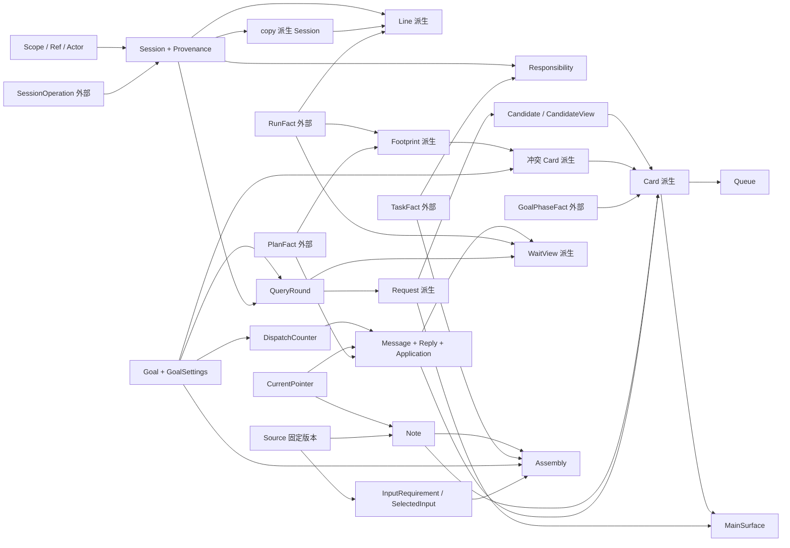
```mermaid
flowchart LR
  Scope[Scope / Ref / Actor] --> Session[Session + Provenance]
  Op[SessionOperation 外部] --> Session
  Session --> Link[Responsibility]
  Session --> Line[Line 派生]
  Session --> Copy[copy 派生 Session]
  Copy --> Line
  Run[RunFact 外部] --> Line
  Task[TaskFact 外部] --> Link
  Run --> Footprint[Footprint 派生]
  Plan[PlanFact 外部] --> Footprint
  Footprint --> Conflict[冲突 Card 派生]
  Goal[Goal + GoalSettings] --> Conflict
  Goal --> Query[QueryRound]
  Session --> Query
  Query --> Request[Request 派生]
  Request --> Candidate[Candidate / CandidateView]
  Candidate --> Card[Card 派生]
  Conflict --> Card
  Phase[GoalPhaseFact 外部] --> Card
  Note[Note] --> Card
  Message[Message + Reply + Application] --> Card
  Card --> Queue[Queue]
  Card --> Main[MainSurface]
  Request --> Main
  Message --> Wait[WaitView 派生]
  Run --> Wait
  Query --> Wait
  Goal --> Counter[DispatchCounter]
  Counter --> Message
  Pointer[CurrentPointer] --> Note
  Pointer --> Message
  Plan --> Message
  Note --> Context[Assembly]
  Task --> Context
  Goal --> Context
  Input[InputRequirement / SelectedInput] --> Context
  Source[Source 固定版本] --> Note
  Source --> Input
```

没有 MainSurface → Session 的一对一边。Request 不落新表。Line 不落新表。Card 也不落新表。接续与换手的区别依赖 Session.origin，不能按相同职责或相同任务名称拼线。

## 写入权威和提交边界

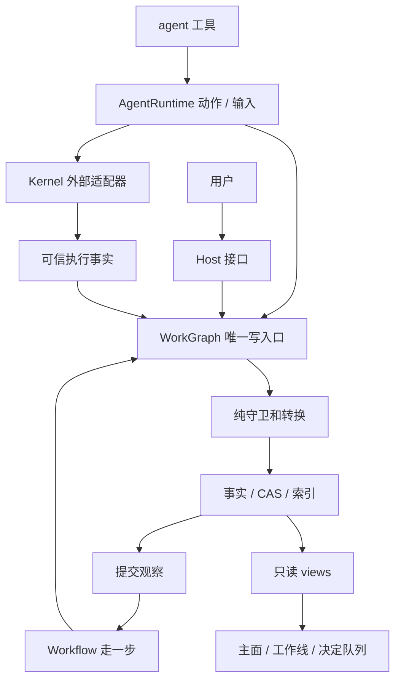
```mermaid
flowchart TD
  U[用户] --> APIs[Host 接口]
  Agent[agent 工具] --> Runtime[AgentRuntime 动作 / 输入]
  Runtime --> WG[WorkGraph 唯一写入口]
  APIs --> WG
  WF[Workflow 走一步] --> WG
  WG --> Pure[纯守卫和转换]
  Pure --> Store[事实 / CAS / 索引]
  Store --> Host[提交观察]
  Host --> WF
  Store --> Views[只读 views]
  Views --> UI[主面 / 工作线 / 决定队列]
  Runtime --> K[Kernel 外部适配器]
  K --> Observed[可信执行事实]
  Observed --> WG
```

工具不调用 Workflow。任务变更和消息落实分两次提交。派工消息与 sequence 加一是同一次提交。创建接任 Session 与责任转移不是跨 Kernel 原子事务。原机器完成归约继续由原 owner 执行。

## Session 与工作线

依据 §1.5、§4.2–4.9。决定 38 已定；来历表示、归档处置和等待例外为提议 #3、#20、#24。

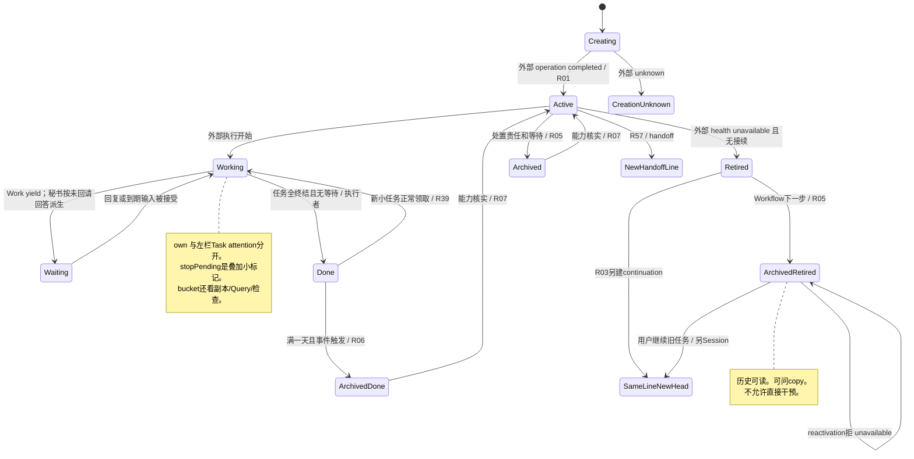
```mermaid
stateDiagram-v2
  [*] --> Creating
  Creating --> Active: 外部 operation completed / R01
  Creating --> CreationUnknown: 外部 unknown
  Active --> Working: 外部执行开始
  Working --> Waiting: Work yield；秘书按未回请回答派生
  Working --> Done: 任务全终结且无等待 / 执行者
  Active --> Retired: 外部 health unavailable 且无接续
  Waiting --> Working: 回复或到期输入被接受
  Done --> Working: 新小任务正常领取 / R39
  Done --> ArchivedDone: 满一天且事件触发 / R06
  Retired --> ArchivedRetired: Workflow下一步 / R05
  Active --> Archived: 处置责任和等待 / R05
  ArchivedDone --> Active: 能力核实 / R07
  Archived --> Active: 能力核实 / R07
  ArchivedRetired --> ArchivedRetired: reactivation拒 unavailable
  Retired --> SameLineNewHead: R03另建continuation
  ArchivedRetired --> SameLineNewHead: 用户继续旧任务 / 另Session
  Active --> NewHandoffLine: R57 / handoff
  note right of Working
    own 与左栏Task attention分开。
    stopPending是叠加小标记。
    bucket还看副本/Query/检查。
  end note
  note right of ArchivedRetired
    历史可读。可问copy。
    不允许直接干预。
  end note
```

## Request 和秘书归属

依据 §1.1、§2.11。请求生命周期和归属为提议 #24；AMB-17–20、32。processing 是四项或，不存状态。

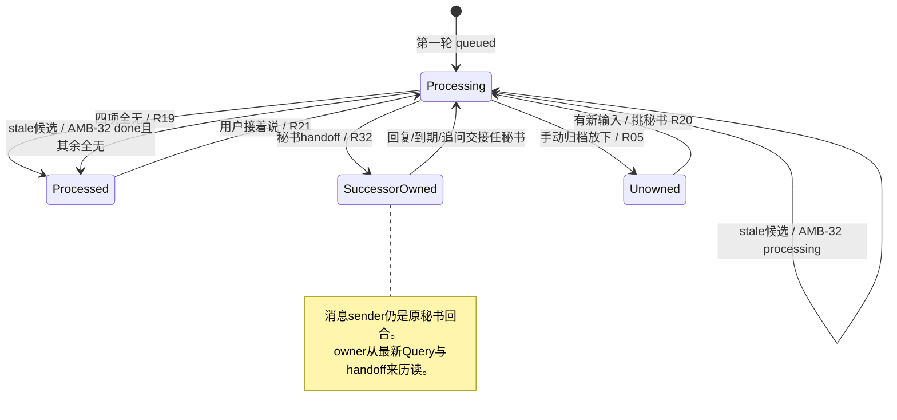
```mermaid
stateDiagram-v2
  [*] --> Processing: 第一轮 queued
  Processing --> Processing: running / open answer / awaiting release / pending candidate
  Processing --> Processed: 四项全无 / R19
  Processed --> Processing: 用户接着说 / R21
  Processing --> SuccessorOwned: 秘书handoff / R32
  SuccessorOwned --> Processing: 回复/到期/追问交接任秘书
  Processing --> Unowned: 手动归档放下 / R05
  Unowned --> Processing: 有新输入 / 挑秘书 R20
  Processing --> Processing: stale候选 / AMB-32 processing
  Processing --> Processed: stale候选 / AMB-32 done且其余全无
  note right of SuccessorOwned
    消息sender仍是原秘书回合。
    owner从最新Query与handoff来历读。
  end note
```

## CandidatePlan

依据 §1.1“候选计划按请求分开”、PLAN-06。提议 #23；stale 已有派生语义。

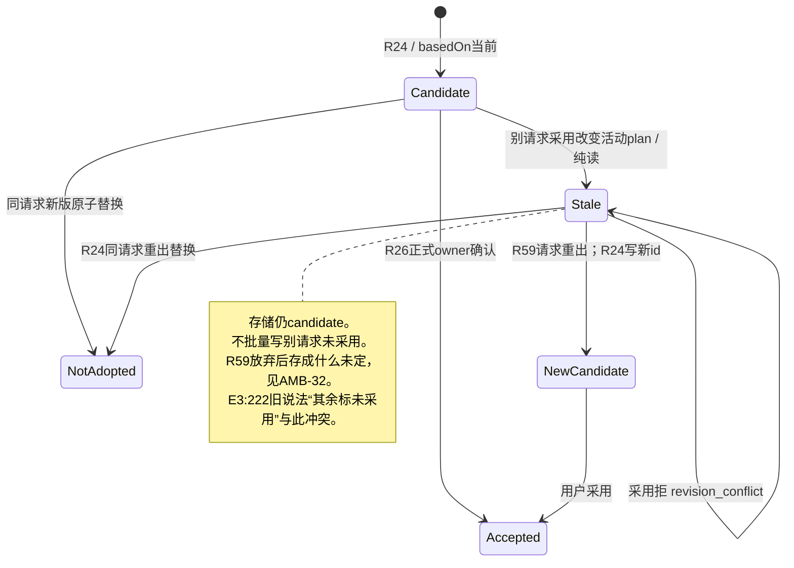
```mermaid
stateDiagram-v2
  [*] --> Candidate: R24 / basedOn当前
  Candidate --> NotAdopted: 同请求新版原子替换
  Candidate --> Accepted: R26正式owner确认
  Candidate --> Stale: 别请求采用改变活动plan / 纯读
  Stale --> Stale: 采用拒 revision_conflict
  Stale --> NotAdopted: R24同请求重出替换
  Stale --> NewCandidate: R59请求重出；R24写新id
  NewCandidate --> Accepted: 用户采用
  note right of Stale
    存储仍candidate。
    不批量写别请求未采用。
    R59放弃后存成什么未定，见AMB-32。
    E3:222旧说法“其余标未采用”与此冲突。
  end note
```

## DecisionCard

依据 §1.4、§2.6。决定 37、Q14、推出8已定；提议 #9、#13；AMB-11、12。

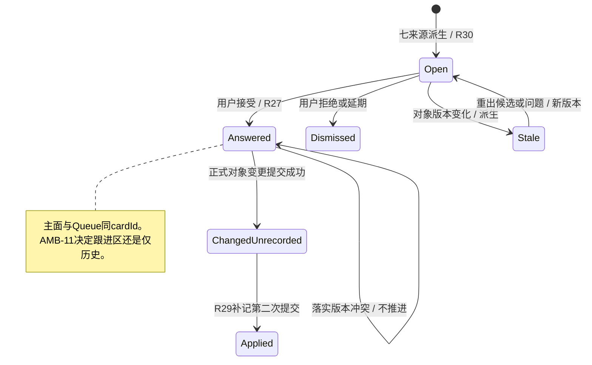
```mermaid
stateDiagram-v2
  [*] --> Open: 七来源派生 / R30
  Open --> Answered: 用户接受 / R27
  Open --> Dismissed: 用户拒绝或延期
  Open --> Stale: 对象版本变化 / 派生
  Stale --> Open: 重出候选或问题 / 新版本
  Answered --> ChangedUnrecorded: 正式对象变更提交成功
  ChangedUnrecorded --> Applied: R29补记第二次提交
  Answered --> Answered: 落实版本冲突 / 不推进
  note right of Answered
    主面与Queue同cardId。
    AMB-11决定跟进区还是仅历史。
  end note
```

## MessageWait 和消息处置

依据 §2.7、§2.11、§4.6；提议 #7、#20、#24、#25。release、delivery、response、expiry、application 是不同维度。

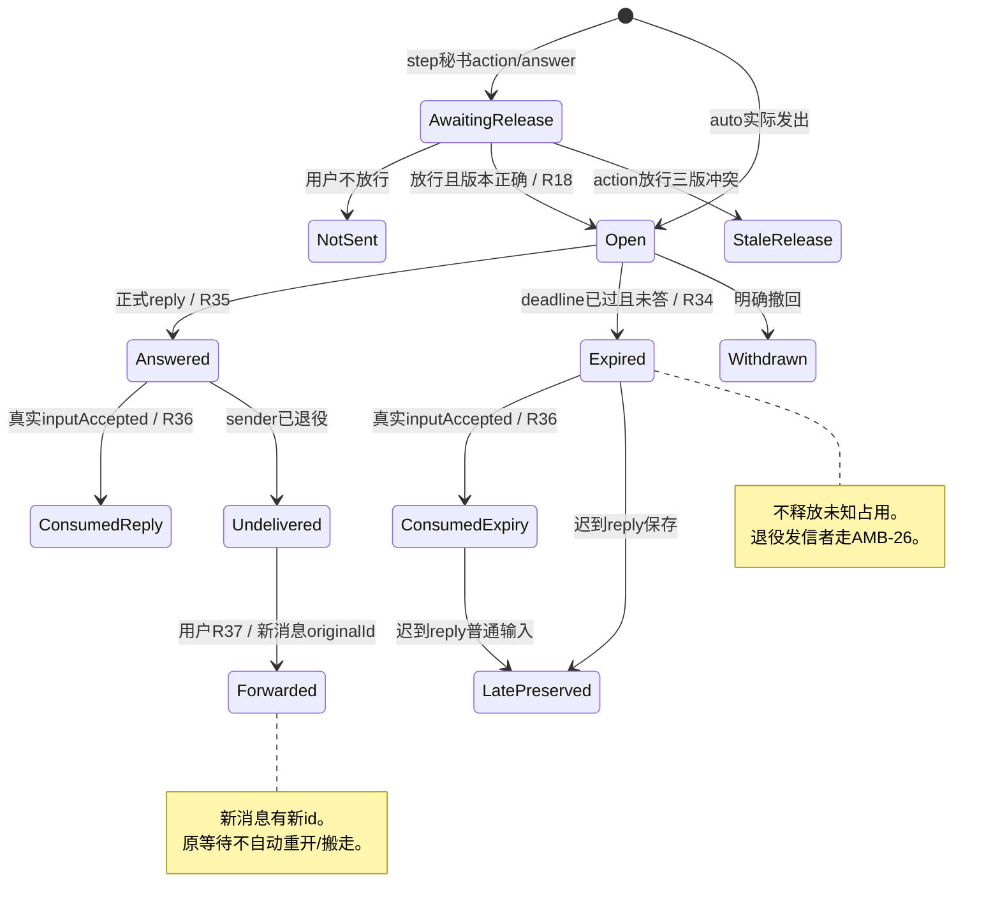
```mermaid
stateDiagram-v2
  [*] --> AwaitingRelease: step秘书action/answer
  AwaitingRelease --> NotSent: 用户不放行
  AwaitingRelease --> Open: 放行且版本正确 / R18
  AwaitingRelease --> StaleRelease: action放行三版冲突
  [*] --> Open: auto实际发出
  Open --> Answered: 正式reply / R35
  Open --> Expired: deadline已过且未答 / R34
  Open --> Withdrawn: 明确撤回
  Answered --> ConsumedReply: 真实inputAccepted / R36
  Expired --> ConsumedExpiry: 真实inputAccepted / R36
  Expired --> LatePreserved: 迟到reply保存
  ConsumedExpiry --> LatePreserved: 迟到reply普通输入
  Answered --> Undelivered: sender已退役
  Undelivered --> Forwarded: 用户R37 / 新消息originalId
  note right of Forwarded
    新消息有新id。
    原等待不自动重开/搬走。
  end note
  note right of Expired
    不释放未知占用。
    退役发信者走AMB-26。
  end note
```

### Message.delivery 与直接干预

这是消息的另一维度。等待结束、送达、落实不是同一件事。拒绝原因写在正式Reply里；字段映射是分析推断。

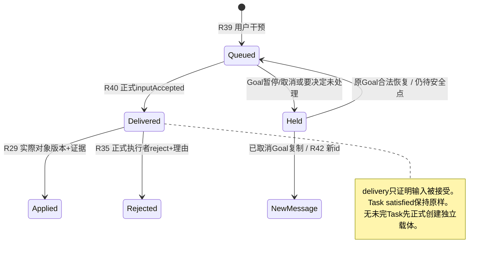
```mermaid
stateDiagram-v2
  [*] --> Queued: R39 用户干预
  Queued --> Held: Goal暂停/取消或要决定未处理
  Held --> Queued: 原Goal合法恢复 / 仍待安全点
  Queued --> Delivered: R40 正式inputAccepted
  Delivered --> Applied: R29 实際对象版本+证据
  Delivered --> Rejected: R35 正式执行者reject+理由
  Held --> NewMessage: 已取消Goal复制 / R42 新id
  note right of Delivered
    delivery只证明输入被接受。
    Task satisfied保持原样。
    无未完Task先正式创建独立载体。
  end note
```

## GoalSettings

依据 §1.2–1.3、§1.6；决定39保证取消终态。这是设置投影，GoalPhase仍是外部机器。

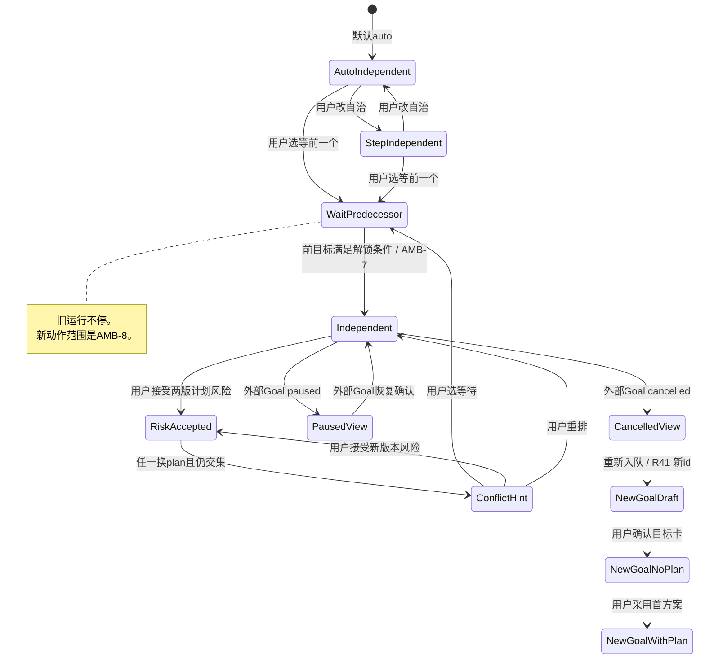
```mermaid
stateDiagram-v2
  [*] --> AutoIndependent: 默认auto
  AutoIndependent --> StepIndependent: 用户改自治
  StepIndependent --> AutoIndependent: 用户改自治
  AutoIndependent --> WaitPredecessor: 用户选等前一个
  StepIndependent --> WaitPredecessor: 用户选等前一个
  WaitPredecessor --> Independent: 前目标满足解锁条件 / AMB-7
  Independent --> RiskAccepted: 用户接受两版计划风险
  RiskAccepted --> ConflictHint: 任一换plan且仍交集
  ConflictHint --> WaitPredecessor: 用户选等待
  ConflictHint --> RiskAccepted: 用户接受新版本风险
  ConflictHint --> Independent: 用户重排
  Independent --> PausedView: 外部Goal paused
  PausedView --> Independent: 外部Goal恢复确认
  Independent --> CancelledView: 外部Goal cancelled
  CancelledView --> NewGoalDraft: 重新入队 / R41 新id
  NewGoalDraft --> NewGoalNoPlan: 用户确认目标卡
  NewGoalNoPlan --> NewGoalWithPlan: 用户采用首方案
  note right of WaitPredecessor
    旧运行不停。
    新动作范围是AMB-8。
  end note
```

## Note 与 CurrentUnderstanding

依据 §3.3–3.7。Q7/Q23、决定20–23已定；记录形状为技术提议，指针CAS提议 #25。

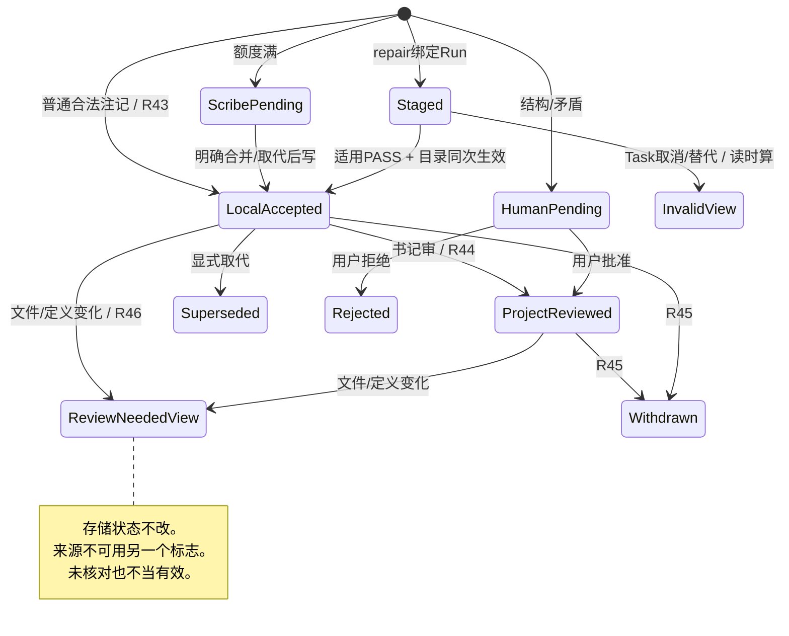
```mermaid
stateDiagram-v2
  [*] --> LocalAccepted: 普通合法注记 / R43
  [*] --> Staged: repair绑定Run
  [*] --> HumanPending: 结构/矛盾
  [*] --> ScribePending: 额度满
  LocalAccepted --> ProjectReviewed: 书记审 / R44
  HumanPending --> ProjectReviewed: 用户批准
  ScribePending --> LocalAccepted: 明确合并/取代后写
  Staged --> LocalAccepted: 适用PASS + 目录同次生效
  Staged --> InvalidView: Task取消/替代 / 读时算
  LocalAccepted --> ReviewNeededView: 文件/定义变化 / R46
  ProjectReviewed --> ReviewNeededView: 文件/定义变化
  LocalAccepted --> Superseded: 显式取代
  ProjectReviewed --> Withdrawn: R45
  HumanPending --> Rejected: 用户拒绝
  LocalAccepted --> Withdrawn: R45
  note right of ReviewNeededView
    存储状态不改。
    来源不可用另一个标志。
    未核对也不当有效。
  end note
```

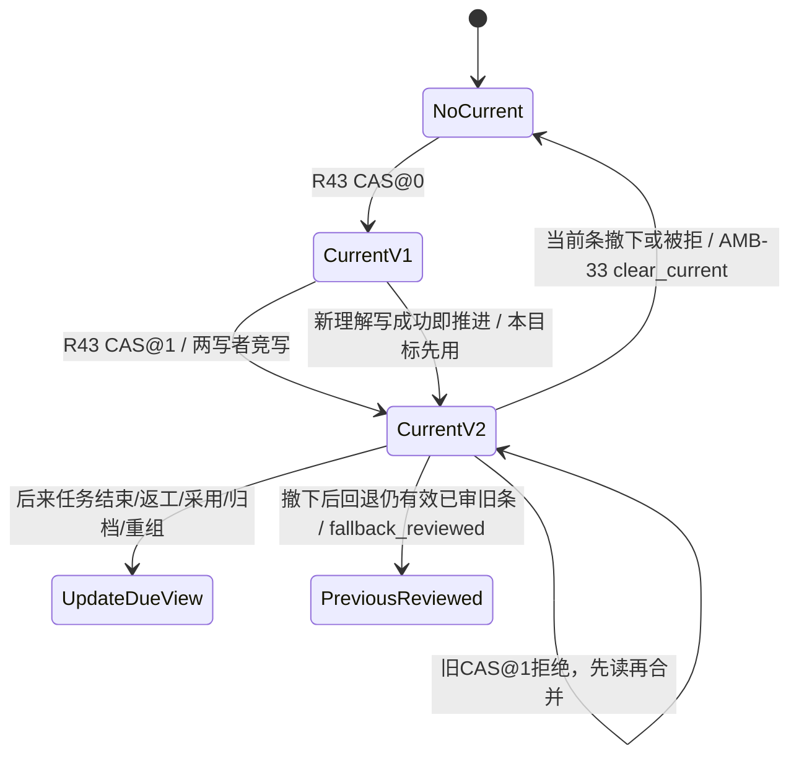
```mermaid
stateDiagram-v2
  [*] --> NoCurrent
  NoCurrent --> CurrentV1: R43 CAS@0
  CurrentV1 --> CurrentV2: R43 CAS@1 / 两写者竞写
  CurrentV1 --> CurrentV2: 新理解写成功即推进 / 本目标先用
  CurrentV2 --> CurrentV2: 旧CAS@1拒绝，先读再合并
  CurrentV2 --> UpdateDueView: 后来任务结束/返工/采用/归档/重组
  CurrentV2 --> NoCurrent: 当前条撤下或被拒 / AMB-33 clear_current
  CurrentV2 --> PreviousReviewed: 撤下后回退仍有效已审旧条 / fallback_reviewed
```

## 十二个组合时序

### 1. 两个秘书读相同三版后派工（S06；提议 #25）

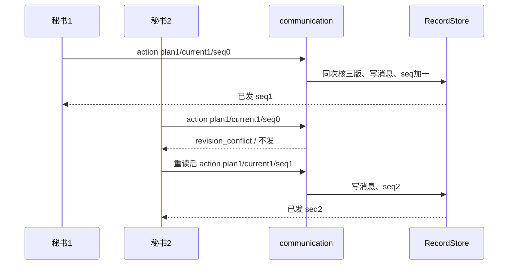
```mermaid
sequenceDiagram
  participant S1 as 秘书1
  participant S2 as 秘书2
  participant C as communication
  participant R as RecordStore
  S1->>C: action plan1/current1/seq0
  C->>R: 同次核三版、写消息、seq加一
  R-->>S1: 已发 seq1
  S2->>C: action plan1/current1/seq0
  C-->>S2: revision_conflict / 不发
  S2->>C: 重读后 action plan1/current1/seq1
  C->>R: 写消息、seq2
  R-->>S2: 已发 seq2
```

### 2. step待放行遇别人的派工（S06；R18）

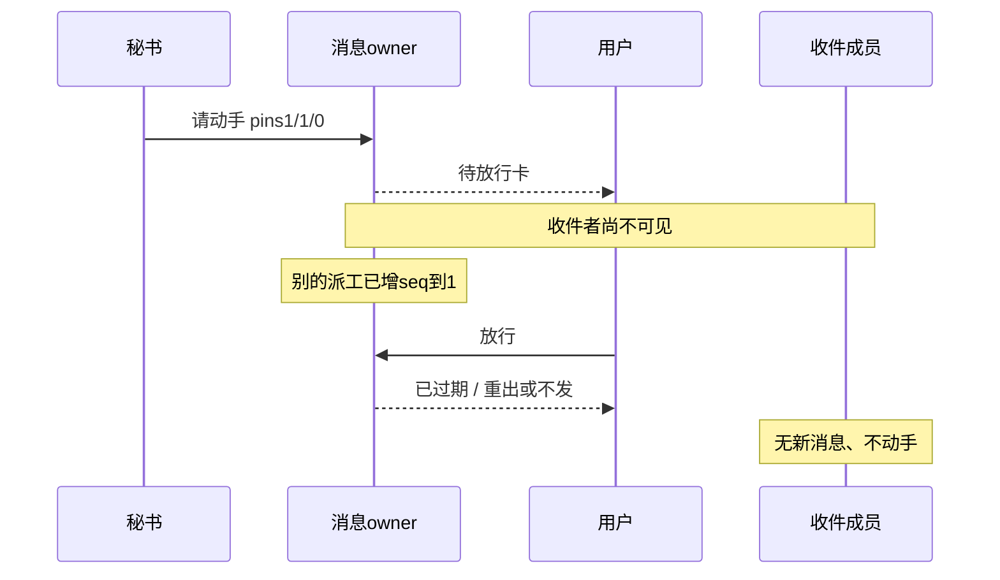
```mermaid
sequenceDiagram
  participant S as 秘书
  participant M as 消息owner
  participant U as 用户
  participant E as 收件成员
  S->>M: 请动手 pins1/1/0
  M-->>U: 待放行卡
  Note over M,E: 收件者尚不可见
  Note over M: 别的派工已增seq到1
  U->>M: 放行
  M-->>U: 已过期 / 重出或不发
  Note over E: 无新消息、不动手
```

### 3. 请回答未回时秘书换手（S07）

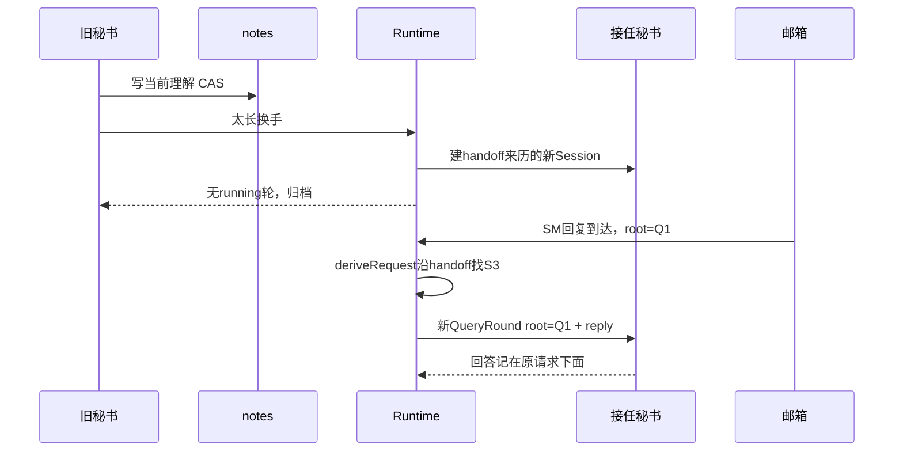
```mermaid
sequenceDiagram
  participant S1 as 旧秘书
  participant N as notes
  participant RT as Runtime
  participant S3 as 接任秘书
  participant M as 邮箱
  S1->>N: 写当前理解 CAS
  S1->>RT: 太长换手
  RT->>S3: 建handoff来历的新Session
  RT-->>S1: 无running轮，归档
  M->>RT: SM回复到达，root=Q1
  RT->>RT: deriveRequest沿handoff找S3
  RT->>S3: 新QueryRound root=Q1 + reply
  S3-->>RT: 回答记在原请求下面
```

### 4. 退役线放下任务，迟到回复手动转交（S02、S11、S66）

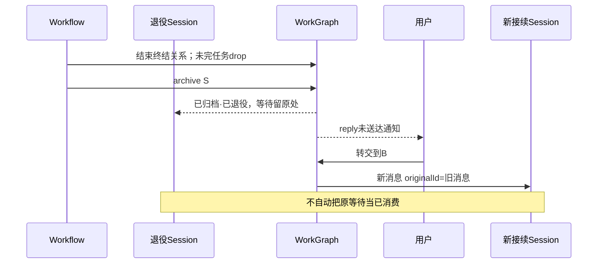
```mermaid
sequenceDiagram
  participant W as Workflow
  participant S as 退役Session
  participant G as WorkGraph
  participant U as 用户
  participant B as 新接续Session
  W->>G: 结束终结关系；未完任务drop
  W->>G: archive S
  G-->>S: 已归档·已退役，等待留原处
  G-->>U: reply未送达通知
  U->>G: 转交到B
  G->>B: 新消息 originalId=旧消息
  Note over S,B: 不自动把原等待当已消费
```

### 5. 别请求采用使候选过期（S08）

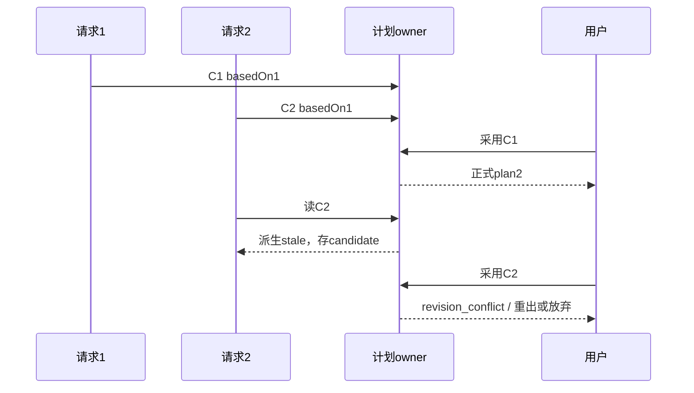
```mermaid
sequenceDiagram
  participant Q1 as 请求1
  participant Q2 as 请求2
  participant P as 计划owner
  participant U as 用户
  Q1->>P: C1 basedOn1
  Q2->>P: C2 basedOn1
  U->>P: 采用C1
  P-->>U: 正式plan2
  Q2->>P: 读C2
  P-->>Q2: 派生stale，存candidate
  U->>P: 采用C2
  P-->>U: revision_conflict / 重出或放弃
```

### 6. 已答复、变更成功、补记失败（S10；AMB-11）

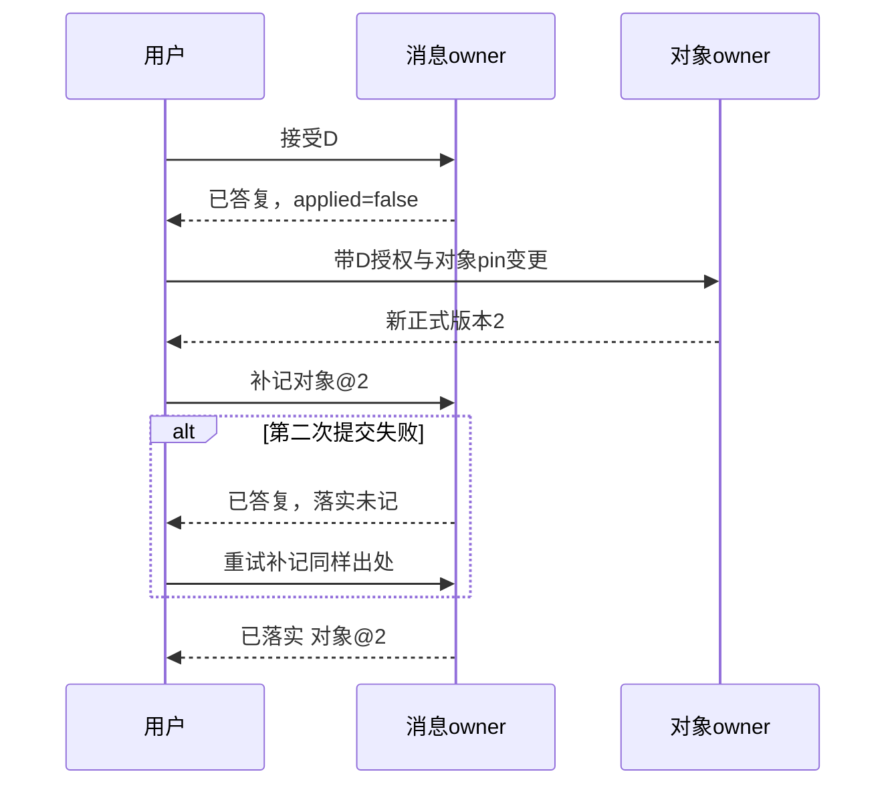
```mermaid
sequenceDiagram
  participant U as 用户
  participant M as 消息owner
  participant P as 对象owner
  U->>M: 接受D
  M-->>U: 已答复，applied=false
  U->>P: 带D授权与对象pin变更
  P-->>U: 新正式版本2
  U->>M: 补记对象@2
  alt 第二次提交失败
    M-->>U: 已答复，落实未记
    U->>M: 重试补记同样出处
  end
  M-->>U: 已落实 对象@2
```

### 7. 到期后消费，迟到回复（S11）

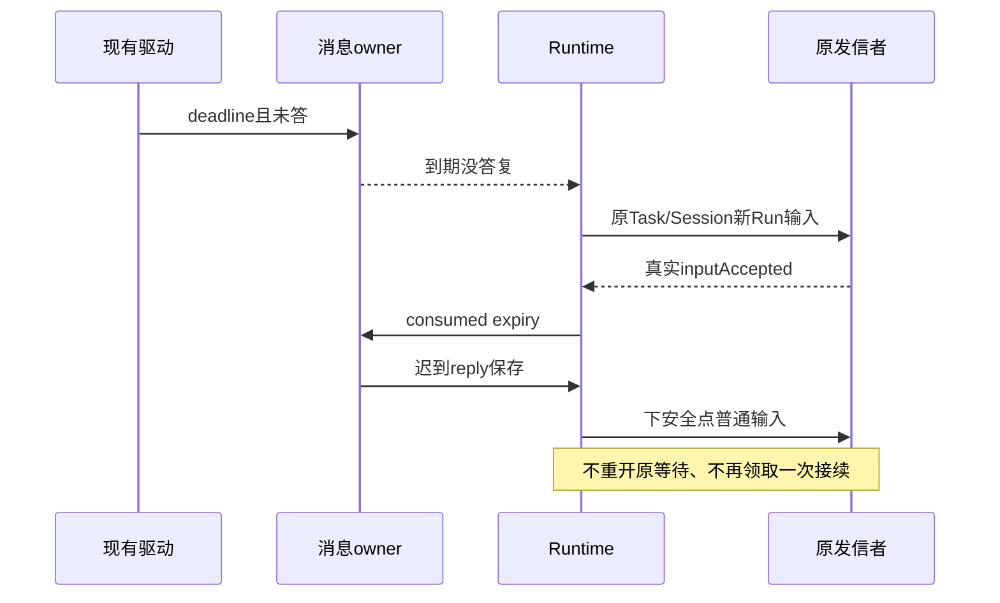
```mermaid
sequenceDiagram
  participant H as 现有驱动
  participant M as 消息owner
  participant RT as Runtime
  participant A as 原发信者
  H->>M: deadline且未答
  M-->>RT: 到期没答复
  RT->>A: 原Task/Session新Run输入
  A-->>RT: 真实inputAccepted
  RT->>M: consumed expiry
  M->>RT: 迟到reply保存
  RT->>A: 下安全点普通输入
  Note over RT,A: 不重开原等待、不再领取一次接续
```

### 8. 取消目标复制，勾选干预（S12；提议 #22）

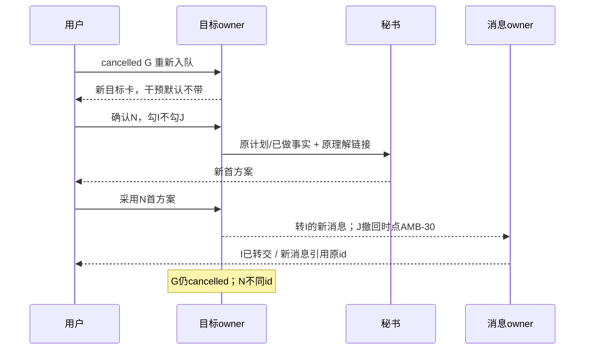
```mermaid
sequenceDiagram
  participant U as 用户
  participant G as 目标owner
  participant S as 秘书
  participant M as 消息owner
  U->>G: cancelled G 重新入队
  G-->>U: 新目标卡，干预默认不带
  U->>G: 确认N，勾I不勾J
  G->>S: 原计划/已做事实 + 原理解链接
  S-->>U: 新首方案
  U->>G: 采用N首方案
  G-->>M: 转I的新消息；J撤回时点AMB-30
  M-->>U: I已转交 / 新消息引用原id
  Note over G: G仍cancelled；N不同id
```

### 9. 当前理解竞写与复查（S09、S74）

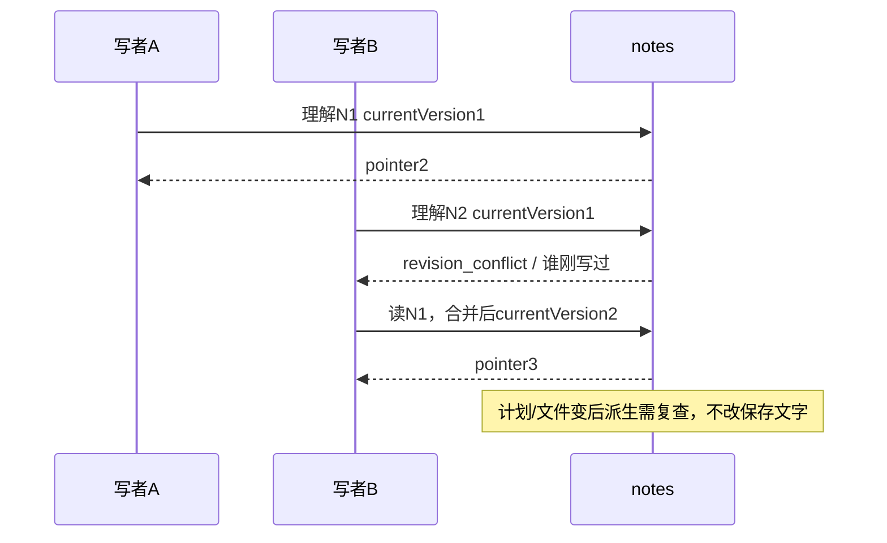
```mermaid
sequenceDiagram
  participant A as 写者A
  participant B as 写者B
  participant N as notes
  A->>N: 理解N1 currentVersion1
  N-->>A: pointer2
  B->>N: 理解N2 currentVersion1
  N-->>B: revision_conflict / 谁刚写过
  B->>N: 读N1，合并后currentVersion2
  N-->>B: pointer3
  Note over N: 计划/文件变后派生需复查，不改保存文字
```

### 10. 已做完线接受干预（S13）

```mermaid
sequenceDiagram
  participant U as 用户
  participant M as 邮箱
  participant WF as Workflow
  participant P as 计划owner
  participant A as 已做完执行者
  U->>M: 直接干预A
  WF->>P: 没未完任务，提新小任务
  alt step
    P-->>U: 待确认
    U->>P: 确认采用
  else auto
    WF->>P: 范围内自动采用
  end
  WF->>A: 正常新Task领取执行
  Note over P,A: 原satisfied Task不修改
```

### 11. 上游未完成但产物已可用（S15；第3片）

```mermaid
sequenceDiagram
  participant RT as Runtime准备
  participant T as tasks
  participant M as materials
  participant A as 下游agent
  RT->>T: 下游已采用requirement
  T->>T: 对已有产物事实定版本
  T->>M: 核声明后的历史说明读取
  M-->>T: 固定产物@2
  T-->>RT: selected input@2 + 来源
  RT->>A: 任务/义务/输入与提醒
  Note over T,A: 不等上游整个Task satisfied
```

### 12. K中断关闭与K2轮间压缩（S20、S21）

```mermaid
sequenceDiagram
  participant WF as Workflow
  participant RT as Runtime
  participant K as Kernel补丁
  WF->>RT: kernel_turn_open，平台Run已结束
  RT->>K: K关闭悬空Turn
  alt 关闭成功
    K-->>RT: interrupted终态 / 活动Run清掉
    RT-->>WF: 原Session可开新Run
  else 无能力或关闭失败
    RT-->>WF: 另建continuation退路
  end
  Note over WF,K: K2是另一补丁，未批准且不算MVP门槛
  WF->>K: 空闲两轮间，超longTokens
  K->>K: 旧工具结果换桩，保最近3轮
  alt 桩还太长
    RT->>K: 固定五段摘要 / 来源校验，或AMB-40
  end
  K-->>WF: 原Session / 原历史保留 / 已压缩说明
```
