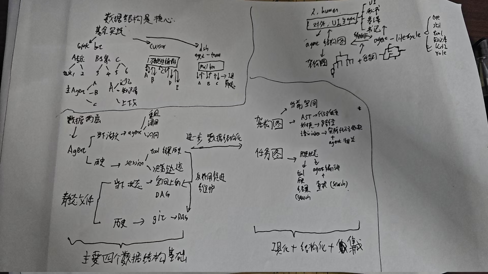
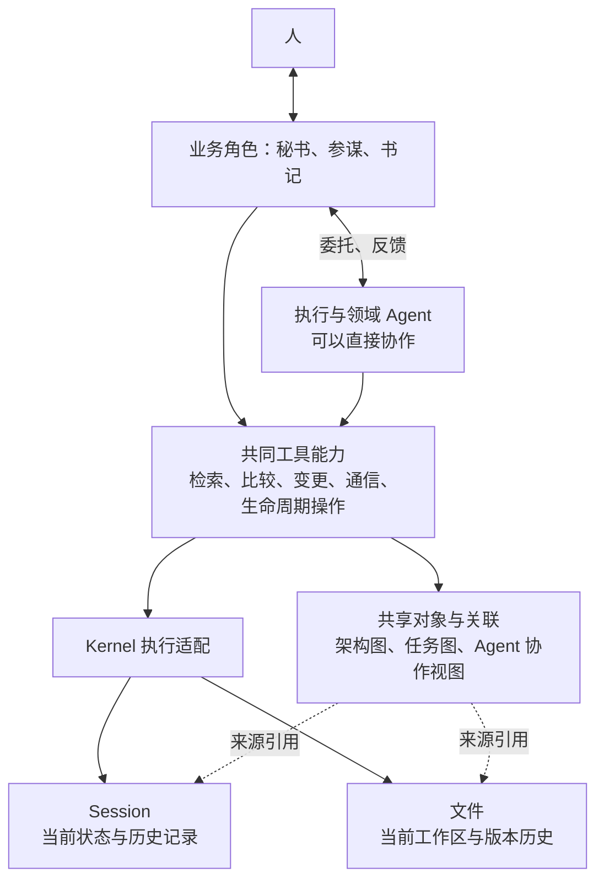
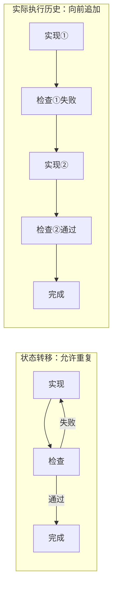

# 本轮架构讨论原始对话

状态：历史记录。导出于 2026-09-23；保留用户原话与助手当时最终回答，**助手旧回答不是当前设计约束**。最新理解与取舍见 [意图与决策](INTENT-AND-DECISIONS.md)，接手入口见 [HANDOFF](../HANDOFF.md)。

时间字段说明：会话导出提供轮次开始时间，本地记录提供消息记录时间；这些用于追溯，不表示已重建所有消息的精确发送时序。DLG-046 与 DLG-047 是启动请求的前后修订版本，当前范围使用后者。

范围：从 Prompt 4 合规/漂移审查到本次“详细骨架文档”要求。来自当前会话及其上游分支的公开消息；合并重复公开内容并保存全部来源。没有导出内部推理、系统指令或工具输出。原始文本与批注元数据见 [JSON 原文](original-dialogue.json)。

呈现规则：普通发言原文保留；批注把“选中的助手文字”和“用户意见”分开；UI 自动包装不当作用户原话。对话中的旧路径、行号、能力判断和外部产品解释反映当时状态，可能已被后续纠正，不据此覆盖当前文档。

原始草图（原文件复制，未修改）：

图片 SHA256：`fdbced13b507fb6e3c6e335c8b42d93a078a0e4928db449df234ef0864239136`。

## 导航

- [DLG-001 home/hyh001/projects/coding-platform/docs/refactor-prompts.revised](#dlg-001-用户)
- [DLG-003 目前存在哪些需要人类参与取舍的地方？或者你认为与前沿工程实践不一样，或者说可以改进的地方？](#dlg-003-用户)
- [DLG-005 批注：这个理论上来说对于架构来说规划得好就是又快又好](#dlg-005-用户)
- [DLG-007 接下来的修改本来将是prompt6,但是目前发现有漂移的问题，因此检查一下，目前的模块文档，架构文档，DAG是否存在漂移的问题？](#dlg-007-用户)
- [DLG-009 也就是说目前prompt3的还有很多遗漏？](#dlg-009-用户)
- [DLG-011 批注：它目前有哪些职责？是否与agent生命周期重复，是不是它属于是agent面的对于context进行处理的执行机构？它是否包含搜](#dlg-011-用户)
- [DLG-013 当下的。两张图和生命周期管理是否有联系？](#dlg-013-用户)
- [DLG-015 这个不应该是prompt的工作，应该是3的工作](#dlg-015-用户)
- [DLG-017 /home/hyh001/projects/coding-platform/docs/refactor/ARCHITECTURE.m](#dlg-017-用户)
- [DLG-019 批注：如果contextcompiler的消费者是agentlifecycle，那么确实可以搬走](#dlg-019-用户)
- [DLG-021 批注：也就是说保留审核的模块？这是冗余还是不冗余的？](#dlg-021-用户)
- [DLG-023 但是，为什么之前会有这些模块好像是因为想要用外部工具来进行约束，使用静态工具从session中查找事实？](#dlg-023-用户)
- [DLG-025 &#x20;如何不依赖agent得到事实？](#dlg-025-用户)
- [DLG-027 但是这些有必要分模块吗？我感觉从图，按图进行粗定位，然后调用工具得到事实即可？图本身是一个对于数据的索引，也是编排的一个引导，也是a](#dlg-027-用户)
- [DLG-029 那么我们是否需要改模块呢？就是，是不是需要改模块呢？就是现在有哪些支持，有哪些功能是支持保留现有这些模块的？我想要好好想一下，因为在](#dlg-029-用户)
- [DLG-031 从架构的角度来讲，业务行为与具体的代码实现复用如何trade-off？我想这是取决于我们要不要改模块的一个重要的点。也是我们重构的一](#dlg-031-用户)
- [DLG-033 那么业务和核心原子化工具实现进行隔离是否是合理的做法？原子化工具负责维护数据结构以及查询，对比，生成，更改等工具（CRUD），以及编](#dlg-033-用户)
- [DLG-035 &#x20;这是我的理解，你能够看的动这个图吗？](#dlg-035-用户)
- [DLG-037 那我描述一下这个图吧，就是首先，嗯，我们的计算机相关的工程数据结构和相关的算法是核心。然后对于多元音色编排，他们的主要结构是这样子的](#dlg-037-用户)
- [DLG-039 澄清回复](#dlg-039-用户)
- [DLG-042 状态机负责环，对于业务和agent编排的策略需要环？但是有timeline往前走。 我的理解是这样的，也就是说我的理解存在哪些问题？](#dlg-042-用户)
- [DLG-044 批注：你看一下我之前说的“工具的结果可以反过来促进状态，DAG的维护”其实我提到了，图片里面也有，不过图片你可能看不太清楚](#dlg-044-用户)
- [DLG-046 批注：我认为我的意图以及分析，你的知识已经足够去得出有哪些数据结构，该有哪些操作了](#dlg-046-用户)
- [DLG-047 批注：我认为我的意图以及分析，你的知识已经足够去得出有哪些数据结构，该有哪些操作了](#dlg-047-用户)
- [DLG-049 目前各个模块下面的小源码文件是否有设计？各自的内部关键逻辑，业务，对外的关键接口有没有存在？](#dlg-049-用户)
- [DLG-051 进行相应的详细的骨架级别的设计？写在文档里面，之后可能让没有相关记忆/理解的agent进行接手，需要把我的原始对话以及相应的架构，模](#dlg-051-用户)

## DLG-001 用户

记录时间：`2026-09-22T11:31:54+00:00`。原始来源标识见 JSON 对应条目。

home/hyh001/projects/coding-platform/docs/refactor-prompts.revised.md中的promp4 已经被执行
看它们是否符合/home/hyh001/projects/coding-platform/docs/refactor/ARCHITECTURE.md以及/home/hyh001/projects/coding-platform/docs/PRODUCT.md以及/home/hyh001/projects/coding-platform/docs 中的人类相关的文件

## DLG-002 助手当时回答

记录时间：`2026-09-22T11:31:54+00:00`。原始来源标识见 JSON 对应条目。

展开历史回答；可能已被后续用户纠正

**整体方向基本符合，但 Prompt4 尚不能完整验收。结论：需修订，不需重做。**

发现 3 项主要问题：

1. **记忆搜索链路的接口对应错误**：把授权候选查询用于图检索，把政策解释用于查找模块负责人，还把关联写入交给明确不负责该事项的模块。[位置](/home/hyh001/projects/coding-platform/docs/refactor/module-dag.md:440)
2. **依赖选择未完成**：模块文档明确要求在 Prompt4 决定路径拒绝政策的共享归属，产物仍写“本轮不定”。因此目标究竟是 38 还是 39 条边尚未定案。[位置](/home/hyh001/projects/coding-platform/docs/refactor/module-dag.md:509)
3. **新增模块的检查配置清单有遗漏**：漏掉模块注册表及测试计数、文件清单；照文档实施会漏检 AgentLifecycle 的越界依赖。[位置](/home/hyh001/projects/coding-platform/docs/refactor/module-dag.md:397)

通过项：13 个模块、38 条边的图表一致且无环；连续 Session 复用、上下文收缩、Kernel 分工等符合最新人类意见。现状源码边界检查通过，但不代表目标能力已实现。

[完整审查报告](/home/hyh001/projects/coding-platform/docs/refactor/reviews/module-dag-review.md)已保存，包含证据、修订建议及两项较小问题。本次未修改原设计稿或源码。

## DLG-003 用户

记录时间：`2026-09-22T11:43:43+00:00`。原始来源标识见 JSON 对应条目。

目前存在哪些需要人类参与取舍的地方？或者你认为与前沿工程实践不一样，或者说可以改进的地方？

## DLG-004 助手当时回答

记录时间：`2026-09-22T11:43:43+00:00`。原始来源标识见 JSON 对应条目。

展开历史回答；可能已被后续用户纠正

**目前没有必须重新由你拍板、才能继续推进的产品大方向。** 上一轮报告里的“未定”，主要表示工程设计尚未完成，不代表都要交给你选择。

生命周期正式落地、相关工作复用 Session、Kernel 负责执行与恢复、长期记忆当前只预留，这些已经确定，不应反复讨论。[已有决定](/home/hyh001/projects/coding-platform/docs/refactor/ARCHITECTURE.md:1340)

真正值得你参与的是：**在质量达到要求后，愿意用多少费用换多少等待时间。** 当前文档规定要比较费用、延迟和质量，但没有统一的金额与时间上限。应该先拿真实任务测出差异，再给你具体选项；现在让你抽象选择“性能优先还是成本优先”，价值不大。[验收口径](/home/hyh001/projects/coding-platform/docs/PRODUCT.md:717)

对于目前悬着的工程取舍，我有明确建议：

| 事项 | 我的建议 | 主要代价 |
|---|---|---|
| 路径拒绝政策放哪里 | **归 WorkspaceReader，公开窄接口，增加 Verification→WorkspaceReader 依赖**，目标变为 39 条边 | 同步架构和检查规则，删除其他位置的副本 |
| ReadModel→Control 是否删除 | **保留只读政策接口**，清除对私有实现文件的直接引用 | 整理公开边界和迁移消费者 |
| 派发是否统一入口 | **先统一不可绕过的准入、Session 占用和启动规则**；内部保留普通执行、Reviewer、Handoff 的区别，再收敛公开入口 | 迁移真实调用路径，处理兼容入口退役 |

第一项现在已有足够依据：源码明确要求运行、取材和命令检查采用同一政策，它们需要共同演进。因此我倾向直接选 WorkspaceReader，无需让你在“38 条还是 39 条”之间决定。[源码依据](/home/hyh001/projects/coding-platform/coding-platform/src/data/workspace-reader/denied-prefixes.ts:17)

关于前沿实践，我查了近期的一手工程文章和研究。**你的主要方向是相符的；更值得改进的是策略的适应性、重复工作的消除，以及实际效果的验证。** 具体有五点：

1. **Session 默认延续可以保留，但压缩、重组策略应随模型和任务调整。**  
   Anthropic 2026 年的实践中，同一个重置上下文机制，对较早模型有帮助，换模型后却成为额外负担。建议保留“延续／压缩／重组”的决策能力，用重复错误、上下文质量、剩余任务和实际成本决定切换，避免仅凭长度或缓存命中率决定。你现有架构已经允许这些情况，需要将其变成可验证的行为。[实践依据](https://www.anthropic.com/engineering/harness-design-long-running-apps)

2. **多 Agent 的投入应随任务变化，不固定让每项工作走完整角色链。**  
   Google Research 对 180 种配置的实验发现，多 Agent 的效果明显依赖任务能否并行；在其顺序规划任务中，协调开销会降低表现。这不能直接预测你的项目，但足以说明需要比较。我的建议是：连续修改同一模块优先复用现有 Session；独立调查、不同方案和独立审查按收益并行；必需的审查独立性继续保留。[研究依据](https://research.google/blog/towards-a-science-of-scaling-agent-systems-when-and-why-agent-systems-work/)

3. **把 Session 历史与当前模型上下文彻底分开，并支持按需回读。**  
   你的“Kernel 保存原始记录，平台保存引用”方向很好。Anthropic 2026 年的 Managed Agents 同样区分持久 Session 日志与上下文管理。这里最有价值的落地是：平台通过引用、游标读取必要历史，压缩后仍能找回原记录，避免平台再复制完整 transcript。先完成接口分离即可，不必照搬其服务部署方式。[实践依据](https://www.anthropic.com/engineering/managed-agents)

4. **重构验收应增加“完整任务效果”和“去掉某个额外步骤后的对照”。**  
   无环、类型检查和单元测试只能证明部分正确性。建议用真实任务比较：单长会话基线、目标编排、关闭某项可选编排步骤后的结果，同时记录成功率、金额、等待时间和人的无效介入。这里比较的是额外编排，不取消权限、状态和证据守卫。产品文档已有这个方向，下一步应兑现为任务集和测量结果。[本地要求](/home/hyh001/projects/coding-platform/docs/PRODUCT.md:713)、[Agent 评测实践](https://www.anthropic.com/engineering/demystifying-evals-for-ai-agents)

5. **优先消除已有的重复扫描和记录，再增加调度聪明程度。**  
   已确认的模型准入扫描、运行日志累计重写、分页重复捕获工作区，都处于连续执行的核心路径。应先改为必要索引、增量保存和一次捕获多页读取。否则即使 AgentLifecycle 的决策很好，每次继续工作仍会支付旧系统的重复成本。[已登记的问题](/home/hyh001/projects/coding-platform/docs/refactor/ARCHITECTURE.md:1111)

我建议下一步先定下上述三项工程取舍，修正错误的查询链路与模块注册清单，然后把真实任务对照验收纳入重构计划。**预算偏好等到有“多花多少、快多少、质量如何”的实际结果时，再交给你取舍。**

## DLG-005 用户

记录时间：`2026-09-22T12:08:23+00:00`。原始来源标识见 JSON 对应条目。

**批注 1：当时选中的助手文字**

> 性能优先还是成本优先

**用户意见（原话）**

> 这个理论上来说对于架构来说规划得好就是又快又好

**批注 2：当时选中的助手文字**

> 连续修改同一模块优先复用现有 Session；独立调查、不同方案和独立审查按收益并行；

**用户意见（原话）**

> 这个生命周期管理不是做了吗？产品中也有讨论？是不是架构以及后续模块跑偏了？

**批注 3：当时选中的助手文字**

> 重构验收应增加“完整任务效果”和“去掉某个额外步骤后的对照”。无环、类型检查和单元测试只能证明部分正确性。建议用真实任务比较：单长会话基线、目标编排、关闭某项可选编排步骤后的结果，同时记录成功率、金额、等待时间和人的无效介入。这里比较的是额外编排，不取消权限、状态和证据守卫。产品文档已有这个方向，下一步应兑现为任务集和测量结果

**用户意见（原话）**

> 可读性与代码量对比即可得到结果，另外就是UI的修改

**批注 4：当时选中的助手文字**

> 优先消除已有的重复扫描和记录，再增加调度聪明程度。已确认的模型准入扫描、运行日志累计重写、分页重复捕获工作区，都处于连续执行的核心路径。应先改为必要索引、增量保存和一次捕获多页读取。否则即使 AgentLifecycle 的决策很好，每次继续工作仍会支付旧系统的重复成本。已登记的问题 (line 1111)

**用户意见（原话）**

> 解释一下，另外看一下有没有依然存在的性能问题以及可能被认为不得不依靠该行为来实现功能导致的可能的重复行为，性能消耗行为

## DLG-006 助手当时回答

记录时间：`2026-09-22T12:08:23+00:00`。原始来源标识见 JSON 对应条目。

展开历史回答；可能已被后续用户纠正

复核后，我需要修正上一轮的判断：**已有的生命周期要求不应重新交给你取舍；当前不少性能问题，也可以在保留功能的同时降低开销。**

**1. 性能与成本：你指出的方向成立。** :codex-annotation{index="1"}

当前应先消除重复扫描、重复保存和不必要的串行等待。这些改进通常能同时改善速度、资源消耗和可维护性。

因此，“性能优先还是成本优先”不应成为这轮架构的前置问题。只有具体优化后仍出现实际冲突，才需要讨论取舍。

**2. 生命周期确实已经讨论并写进设计，上一轮把它当成新建议不准确。** :codex-annotation{index="2"}

[产品文档](/home/hyh001/projects/coding-platform/docs/PRODUCT.md:459)、[架构文档](/home/hyh001/projects/coding-platform/docs/refactor/ARCHITECTURE.md:510)和 [AgentLifecycle 模块稿](/home/hyh001/projects/coding-platform/docs/refactor/modules/control/agent-lifecycle.md:25)都要求：相关工作默认延续 Session，独立工作可以使用独立 Session。

目前的差距有两处：

- **契约没有完全落细**：模块职责提到“两图相关则复用”，但候选接口尚未明确任务、模块、Session 的关联及来源版本如何进入决策。这里应补齐，避免实现最后只看角色和忙闲。
- **生产代码尚未接上目标能力**：当前新 Run 仍[生成新 Session](/home/hyh001/projects/coding-platform/coding-platform/src/execution/worker-runtime/coding-agent-runtime.ts:124)，默认 continuation [仍未配置](/home/hyh001/projects/coding-platform/coding-platform/src/execution/worker-runtime/unconfigured-capabilities.ts:17)。

所以，**没有证据说明架构整体跑偏；准确结论是需求已定、设计基本承接、接口和实现待完成。** Prompt 4 完成的是模块分工和 DAG，并不意味着生命周期代码已完成。

**3. 这轮重构验收可以按你说的收紧。** :codex-annotation{index="3"}

主要比较：

- 可读性：职责是否集中，正常路径是否容易理解。
- 代码量：真正删除了哪些重复逻辑、旧入口和无用包装。
- UI：主对话、工作状态、相关工作和操作入口是否更清楚，详情是否按需展开。

上一轮提出完整任务、消融对照，扩大了本轮验收范围。无需把它们设成前置门槛。具体性能项核对读取次数、写入量即可确认重复是否消除；需要宣称具体加速倍数时，再测对应耗时。

**4. 仍存在的重复开销，已经沿源码确认。** :codex-annotation{index="4"}

共同问题是：**功能需要“完整、可靠、最新”，实现却多次采用“从头读一遍、整体写一遍”。前者必要，后者可以替换。**

| 问题 | 当前行为 | 保留功能的改法 |
|---|---|---|
| 协调派发重复扫描 | 正常一轮先后 **3 次从账本头扫描**；一次唤醒最多推进四轮 | 保留推进后的刷新，改为范围索引、增量游标和变化记录读取。[源码](/home/hyh001/projects/coding-platform/coding-platform/src/control/dispatch-engine/coordination-drive.ts:257) |
| 日志累计重写 | 每个公开事件追加后，把含历史 trace 的整条记录重新保存、同步落盘；累计工作量近似随事件数平方增长 | 追加事件，小型元数据单独更新；保留持久化、顺序和追溯能力。[源码](/home/hyh001/projects/coding-platform/coding-platform/src/data/artifact-vault/runtime-observation-journal.ts:52) |
| UI 概览仍读取过重 | 前台每 2.5 秒刷新；每次重建通信视图，还先深复制全部运行历史再筛目标 | 通信视图增量更新；概览读取摘要，日志正文按需分页。[源码](/home/hyh001/projects/coding-platform/coding-platform/src/app/service.ts:414) |
| 身份、接续关联定位重复 | 不同调用方为找到同一身份或受理关系分别扫描历史 | 在 Ledger 提供精确查询；保留 Control 的独立复核。[源码](/home/hyh001/projects/coding-platform/coding-platform/src/control/control-engine/work-identity-resolution.ts:169) |
| 源码分页重复计算 | 每页重新捕获源码两次、计算结果，最后才切页；5 页可能对应 10 次捕获 | 在固定快照上一次计算、多页读取，按契约复核来源有效性。[源码](/home/hyh001/projects/coding-platform/coding-platform/src/data/workspace-reader/project-source-index.ts:135) |

另外还确认了：独立只读查询共用日志写队列、返工按问题重复加载决定和提案、为了取得末游标遍历全账本、Goal 归约重复读证据，以及完成全部取料后才判断缓存命中等问题。

这里也需要纠正两个频率判断：**UI 概览已经跳过工作区适用性扫描**，仍有的是账本扫描和历史复制；接续关联扫描发生在 **Run 输入绑定阶段**，不能说成每次模型调用都会发生。异步操作前后的版本复查则有防止中途变更的作用，不能一概删除。

完整证据、必要语义和替代方式已写入[补充审阅记录](/home/hyh001/projects/coding-platform/docs/refactor/reviews/lifecycle-performance-followup.md)。这些主要是工程落实问题，无需重新征询产品取舍。本轮未修改产品代码，也未测量实际延迟。

## DLG-007 用户

记录时间：`2026-09-22T12:26:53+00:00`。原始来源标识见 JSON 对应条目。

接下来的修改本来将是prompt6,但是目前发现有漂移的问题，因此检查一下，目前的模块文档，架构文档，DAG是否存在漂移的问题？

## DLG-008 助手当时回答

记录时间：`2026-09-22T12:26:53+00:00`。原始来源标识见 JSON 对应条目。

展开历史回答；可能已被后续用户纠正

**存在局部漂移和交接缺口，建议先统一文档，再执行 Prompt 6。整体架构方向不需要推翻。**

我核对了架构、13 篇模块文档、ownership-map、DAG 和最新人类意见，并检查了 Prompt 6 的输入清单。

机械层面是一致的：**架构图、DAG、模块正向和反向依赖表都是同一组 38 条边，且无环。** 主要问题在职责和接口含义：

| 问题 | 当前不一致 | 应修正的方向 |
|---|---|---|
| **Prompt 6 混用新旧设计** | 输入仍主要指向旧架构、旧 12 模块及旧接口清单，可能重新带入长期 Agent 主体等旧要求。[位置](/home/hyh001/projects/coding-platform/docs/refactor-prompts.revised.md:600) | 本轮文档作为目标依据；旧文档仅用于现状与迁移对照 |
| **取材职责误归生命周期模块** | 架构 U1 写“重复取材路径由 AgentLifecycle 替代”，正文却明确它不取材。[位置](/home/hyh001/projects/coding-platform/docs/refactor/ARCHITECTURE.md:1214) | 生命周期选择归 AgentLifecycle，取材共用与去重归 ContextCompiler |
| **Control 被安排源码读取改造** | 模块稿把查询 currentness、全工作区快照交给 Control，但它禁止读源码，且只依赖 Ledger。[位置](/home/hyh001/projects/coding-platform/docs/refactor/modules/control/control-engine.md:27) | 按 Control、Context、Reader、查询调用方分别归责 |
| **DAG 场景链引用错误接口** | 图查询用了授权候选边，负责人查询用了政策解释边，关联写入指向不负责该工作的 Reconciler。[位置](/home/hyh001/projects/coding-platform/docs/refactor/module-dag.md:440) | 按实际提供接口重新对应链路 |
| **共享边界未定，边数却被固定** | S09 本应在 Prompt 4 决定，DAG 仍后置；Dispatch 验收又要求保持 38 条边。[位置](/home/hyh001/projects/coding-platform/docs/refactor/modules/control/dispatch-engine.md:179) | 完成分工选择，再同步边表；验收最终依赖集合，不固定数字 |
| **已定政策归属被重新悬置** | S02 已确定 Control 公共窄接口，DAG 仍列“下移纯计算后删除 ReadModel→Control”。[位置](/home/hyh001/projects/coding-platform/docs/refactor/module-dag.md:537) | 承接已定 owner，不能因一个辅助函数下移就删除整条依赖 |
| **“不重编译”被扩大成“不经过模块”** | Context 将按需事实读取列为“不经本模块”，同时又保留自己提供的 `readFact`。[位置](/home/hyh001/projects/coding-platform/docs/refactor/modules/data/context-compiler.md:55) | 明确“不触发重新选材／assemble”，保留窄读取接口 |
| **机械同步清单遗漏** | 漏了 `modules` 注册表、测试模块数和文件清单；遗漏同时出现在架构、模块和 DAG。[位置](/home/hyh001/projects/coding-platform/docs/refactor/module-dag.md:397) | 补齐计划输入，源码更新随实施阶段进行 |
| **现有审查接线登记不全** | 双向接口表遗漏已接入的审查生命周期、输出绑定和 Verification 租约端口。[位置](/home/hyh001/projects/coding-platform/docs/refactor/modules/control/verification-engine.md:85) | 补齐真实消费者和端口，避免迁移时漏掉审查路径 |

另有几处较小残留：架构首页仍说“所有接口无一可保留”；按需读取更新 manifest 的表述没有区分初始化清单与运行日志；归档、显式压缩的摘要条件不完整。也应一并清理。

**目前没有发现核心方向重新跑偏**：相关工作默认复用 Session、轻量身份、独立审查、Kernel 负责执行与恢复、普通消息不触发全量编译，三层文档总体一致。接口字段待设计、Kernel 尚未接线等属于后续工作，不算漂移。

建议修订顺序是：**职责与接口 → S09/S02 和 DAG → 迁移检查清单 → Prompt 6 输入优先级**。这些主要是工程校正，无须重新开启已关闭的产品取舍，也无需重跑全部 Prompt 2–4。

完整的双方证据和最小修订范围已写入[审阅记录](/home/hyh001/projects/coding-platform/docs/refactor/reviews/pre-prompt6-drift-review.md)。本轮仅新增审阅记录，尚未修改设计文档或代码。

## DLG-009 用户

记录时间：`2026-09-22T12:46:41+00:00`。原始来源标识见 JSON 对应条目。

也就是说目前prompt3的还有很多遗漏？

## DLG-010 助手当时回答

记录时间：`2026-09-22T12:46:41+00:00`。原始来源标识见 JSON 对应条目。

展开历史回答；可能已被后续用户纠正

**是，当前模块文档确实还有几处关键遗漏和错写，尚不适合直接作为 Prompt 6 的可靠输入。** 不过，上一轮的 9 项问题不能全部归到 Prompt 3。

属于当前模块文档的问题主要有：

- **职责写错**：Control 被安排了本不属于它的源码快照、来源检查改造。
- **接口漏记**：已经接入的独立审查、输出绑定和租约端口，没有完整进入提供方与消费方的对接表。
- **边界表述矛盾**：“不重新编译上下文”被写成“不经过 Context 模块”，与保留的读取接口冲突。
- **迁移清单不完整**：新增模块的注册表、测试数量和文件清单没有全部列入。
- **验收要求走样**：把当前 38 条边变成必须保持的数字。不过这条来自后来补充的 §9，不能都追溯为原 Prompt 3 执行时的遗漏。

另外，生命周期承担取材是**架构文档自身的问题**；DAG 错接接口、S09 未完成裁定是 **Prompt 4 的问题**；混用旧文档则是 **Prompt 6 输入的问题**。

所以准确评价是：**Prompt 3 的模块骨架基本齐全，但“职责—提供接口—消费接口—迁移与验收”没有充分交叉核对；Prompt 4 也没有把这些问题识别并统一。**

需要做的是一次跨文档修订，把各模块真正对接起来，无须全部重写，也不应把这些缺口留给实施阶段自行猜测。

## DLG-011 用户

记录时间：`2026-09-22T12:51:49+00:00`。原始来源标识见 JSON 对应条目。

**批注 1：当时选中的助手文字**

> ContextCompiler

**用户意见（原话）**

> 它目前有哪些职责？是否与agent生命周期重复，是不是它属于是agent面的对于context进行处理的执行机构？它是否包含搜索，图管理？

## DLG-012 助手当时回答

记录时间：`2026-09-22T12:51:49+00:00`。原始来源标识见 JSON 对应条目。

展开历史回答；可能已被后续用户纠正

**ContextCompiler 更准确的定位是：平台共用的“上下文取材、组装与读取服务”。** 你说的“处理 context 的执行机构”，对于初始化、补料和重组成立；但 Session 的消息历史、压缩和恢复由 Kernel 执行。它服务多个角色和用途，本身不是一个 Agent。 :codex-annotation{index="1"}

目前它主要承担这些工作：

| 职责 | 具体做什么 |
|---|---|
| 取材 | 读取任务、规则、已接受决定、证据、历史产物，以及所需源码和图材料 |
| 筛选 | 按任务相关性、角色要求、用途和容量选择材料，说明缺少什么 |
| 组装 | 为执行、规划、查询、Reviewer、验证、交接等用途生成输入 |
| 标注与检查 | 保留材料来源、版本、引用和适用性；不把模型报告直接认定为正式事实 |
| 按需读取 | 提供部分材料的窄读取接口，例如查询过程中读取已捕获事实 |

这些职责已有多种接口；**默认连续复用、局部增量刷新等目标尚未全部实现**。[模块说明](/home/hyh001/projects/coding-platform/docs/refactor/modules/data/context-compiler.md:19)

**它与 AgentLifecycle 应当分工，而非重复：**

| 模块 | 回答的问题 |
|---|---|
| AgentLifecycle | 用哪个角色、复用哪条 Session？延续、压缩、重组还是归档？ |
| ContextCompiler | 在已确定的工作和用途下，需要准备哪些材料，怎样组织？ |
| DispatchEngine | 怎样把决定落实到派发与执行？ |
| WorkerRuntime／Kernel | 怎样实际运行、追加消息、压缩和恢复 Session？ |

例如，生命周期模块决定“新建 Session 接手这项工作”，ContextCompiler 才准备交接材料；如果原 Session 可以继续，就追加要求。Kernel 已完成有效压缩，也无需再让 Compiler 整理一遍。

因此，**架构里“重复取材由 AgentLifecycle 替代”的那句话确实写偏了**。另外，AgentLifecycle 当前尚无实现，不能说源码里已经存在两套重复的生命周期管理。[生命周期边界](/home/hyh001/projects/coding-platform/docs/refactor/modules/control/agent-lifecycle.md:55)

**搜索：它包含取材所需的检索与筛选，但不应包办全部搜索。**

- 源码列举、文件读取、符号和引用查询，由 **WorkspaceReader／执行工具**提供。
- 已提交事实和历史记录，由 **Ledger、ReadModel、Vault**提供相应读取能力。
- ContextCompiler 调用这些能力，挑选并组织本次所需材料。
- Agent 运行中自行搜索、读文件，不必每次重新组装上下文。

现有源码已经明确区分“WorkspaceReader 负责读工作区”和“ContextCompiler 负责取材”。[源码说明](/home/hyh001/projects/coding-platform/coding-platform/src/data/context-compiler/role-source-index.ts:1)

**图管理：它参与图材料加工，但不拥有整套图管理。**

| 图相关工作 | 归属 |
|---|---|
| 捕获源码关系与来源 | WorkspaceReader |
| 核对来源、版本，封装图材料并交 Vault 保存 | ContextCompiler |
| 图差分、漂移判断、候选结构 | ArchitectureReconciler |
| 正式结构接受、责任关联登记 | ControlEngine |
| 图索引、邻域查询和展示读取 | ReadModelIndex |

当前确有 `SourceGraphContextCompiler`，但它负责的是**图材料与来源绑定**，不等于图结构治理或图查询系统已经完整接通。[分工表](/home/hyh001/projects/coding-platform/docs/refactor/modules/ownership-map.md:18)

还有一个刚核实的细节：`readFact` 虽然只返回一小部分事实，内部仍会重新组装“已捕获材料＋当前偏好”的查询输入。它没有重新扫描全仓，但存在可优化的重复组装。因此，后续应同时收准模块边界和读取实现，不能只修改文档措辞。

## DLG-013 用户

记录时间：`2026-09-22T12:56:50+00:00`。原始来源标识见 JSON 对应条目。

当下的。两张图和生命周期管理是否有联系？

## DLG-014 助手当时回答

记录时间：`2026-09-22T12:56:50+00:00`。原始来源标识见 JSON 对应条目。

展开历史回答；可能已被后续用户纠正

**有，而且按当前设计，两张图应当是生命周期管理选择和复用 Session 的重要依据。只是这条联系目前还没有完整接入代码。**

这里的“两张图”指产品中的**项目架构图和任务图**：

| 图 | 给生命周期管理提供什么 | 影响哪些决定 |
|---|---|---|
| **架构图** | 工作涉及哪些模块、模块之间什么关系，以及关联的角色和 Session | 哪条已有 Session 熟悉相关工作，是否适合复用 |
| **任务图** | 当前任务、相关前后任务、进展、依赖和未完成事项 | 延续原 Session、独立开展工作、交接，或满足条件后归档 |

例如，“实现登录功能 → 修复测试 → 根据审查意见调整”，两张图能说明这些工作属于相关模块和连续任务，生命周期管理就应优先考虑延续原 Session。独立审查则仍需保留独立 Session，不能只因模块相同就复用执行者的上下文。

这条关系在 [AgentLifecycle 职责第 25 行](/home/hyh001/projects/coding-platform/docs/refactor/modules/control/agent-lifecycle.md:25)已经明确写了：**两张图显示后续工作与已有上下文相关时，默认延续。** 但图关系只是依据，还要结合 Session 的上下文质量、容量、忙闲和恢复能力。

反过来，生命周期选择经 Control 正式受理后，会更新任务、角色与 Session 的关联，再由查询投影展示到图中。**日常关联变化不需要重新审批架构基线。**

你选中的“**两张图是否各建独立 Module**”，讨论的是这些能力放在哪些代码模块里，和它们是否参与生命周期决策是两个问题。目前决定由既有模块分担图能力；AgentLifecycle 通过 Ledger／ReadModel 获取所需依据。

**现在真正缺的是把这条联系落实：**职责里已经要求参考两图，但接口还没明确相关任务、模块、候选 Session 及来源版本怎样传入，生产复用路径也尚未完成。这应成为 Prompt 6 中明确的一项接线工作。

## DLG-015 用户

记录时间：`2026-09-22T12:58:54+00:00`。原始来源标识见 JSON 对应条目。

这个不应该是prompt的工作，应该是3的工作

## DLG-016 助手当时回答

记录时间：`2026-09-22T12:58:54+00:00`。原始来源标识见 JSON 对应条目。

展开历史回答；可能已被后续用户纠正

**对，这是 Prompt 3 应完成的工作。我刚才把“设计没有交代清楚”和“设计完成后尚未接线”混在一起了。**

Prompt 3 已要求写清“接口名、方向、传递内容”，因此必须明确：

- 两张图分别向生命周期管理提供哪些关系与状态，由哪个模块、哪个接口提供。
- AgentLifecycle 如何使用这些依据选择复用、创建或交接，并如何处理信息缺失、过期。
- 决策结果怎样交给 DispatchEngine。
- 执行后的任务、模块、Session 关联由谁登记、由谁提供查询。

**仅在职责里写“两图相关则复用”，没有把提供方和消费方的接口对上，属于 Prompt 3 未完成。** 精确字段可以后续细化，但不能把上述分工留空。

阶段分工应是：**Prompt 3 完成模块设计，Prompt 4 核对依赖及传递内容，Prompt 6 安排实施、迁移和验收。**

我已将此项改列为 [Prompt 3 的设计遗漏 D10](/home/hyh001/projects/coding-platform/docs/refactor/reviews/pre-prompt6-drift-review.md)，不再归为正常留待 Prompt 6 的接线事项。

## DLG-017 用户

记录时间：`2026-09-22T13:22:01+00:00`。原始来源标识见 JSON 对应条目。

/home/hyh001/projects/coding-platform/docs/refactor/ARCHITECTURE.md你觉得它作为prompt2的产物有哪些不对的？

## DLG-018 助手当时回答

记录时间：`2026-09-22T13:22:01+00:00`。原始来源标识见 JSON 对应条目。

展开历史回答；可能已被后续用户纠正

**我的判断：总体方向可以保留，但它还不是一份内部一致、可以直接约束 Prompt 3 的架构稿。** 问题主要在于：职责规定相互冲突，部分已确定的产品条件没有完整落到架构中。

有五项属于 Prompt 2 自身应修正的问题：

1. **生命周期的触发条件被弱化了。**  
   [拆解条件](/home/hyh001/projects/coding-platform/docs/refactor/ARCHITECTURE.md:382)只写“目标确认且任务图生成后”，但产品已经要求存在可独立承担的子任务、明确接口和完成依据，以及结果回流。缺的不是数值阈值。  
   [归档条件](/home/hyh001/projects/coding-platform/docs/refactor/ARCHITECTURE.md:372)漏了产品规定的“没有未交接的活跃义务”。这些是**动作何时允许发生**，应该由 Prompt 2 写清。

2. **AgentLifecycle 的职责存在直接冲突。**  
   [边界定义](/home/hyh001/projects/coding-platform/docs/refactor/ARCHITECTURE.md:658)明确它不取材、不组装上下文；[U1 决定](/home/hyh001/projects/coding-platform/docs/refactor/ARCHITECTURE.md:1214)却要求重复取材路径“由它替代”。  
   正确分工应是：生命周期模块负责选择和处置决策；ContextCompiler 负责必要的取材与编译。消除重复职责，不等于把它们全部搬进生命周期模块。

3. **把“不重新编译”混成了“不经过 ContextCompiler”。**  
   [架构稿](/home/hyh001/projects/coding-platform/docs/refactor/ARCHITECTURE.md:746)将 `read_query_fact` 列为绕过 ContextCompiler 的现有路径；但它实际调用该模块的读取接口，而且[当前实现仍会调用 assemble](/home/hyh001/projects/coding-platform/coding-platform/src/data/context-compiler/query-execution-context.ts:31)。  
   应明确区分**模块归属、局部读取、上下文重编译**。优化目标是减少重复组装，不是为了绕过模块而迁移职责；这里也不能误称已经消除了重复开销。

4. **没有真正交付“确认不变的接口清单”。**  
   [第 898 行](/home/hyh001/projects/coding-platform/docs/refactor/ARCHITECTURE.md:898)要求保留通用存储方法和兼容查询接口；[第 915 行](/home/hyh001/projects/coding-platform/docs/refactor/ARCHITECTURE.md:915)又宣布不变清单不包含任何模块接口签名。  
   Prompt 2 应区分哪些接口原样保留、哪些兼容扩展、哪些替换。外部命令和端口地址不变，不能代替这个交付。

5. **“不新增依赖”的限制作用范围不清。**  
   [第 1114 行](/home/hyh001/projects/coding-platform/docs/refactor/ARCHITECTURE.md:1114)把额外新增模块和依赖列为“明确不做”，其他章节却说模块数、边数不是约束。  
   应限定为“本节这些交互无需额外依赖”，避免后续设计为了守住 13 个模块、38 条边而扭曲职责。当前 DAG 确实无环，但这只能证明拓扑合法。

此外，[“独立图模块会把投影升级成真相源”](/home/hyh001/projects/coding-platform/docs/refactor/ARCHITECTURE.md:561)这个论证不成立。**模块边界与数据权威是两回事**。可以继续选择不新增图模块，但理由应是现有职责足以承接、避免重复建设。

关于你前面追问的两图与生命周期：**Prompt 2 已经写出了两者的高层联系**，包括工作相关性、Session 复用、责任范围与上下文处置。不能说完全没设计。具体由哪个接口提供这些关系、双方传递什么、缺失时怎么处理，仍然是 **Prompt 3 应补齐的工作**。

完整证据和修订方向已整理到[审阅记录](/home/hyh001/projects/coding-platform/docs/refactor/reviews/prompt2-architecture-review.md)。应先修正这些架构冲突，再同步模块契约与 DAG；Prompt 6 负责安排实施，不应承担补定上游职责的任务。

## DLG-019 用户

记录时间：`2026-09-22T14:13:43+00:00`。原始来源标识见 JSON 对应条目。

**批注 1：当时选中的助手文字**

> 边界定义 (line 658)明确它不取材、不组装上下文；U1 决定 (line 1214)却要求重复取材路径“由它替代”。正确分工应是：生命周期模块负责选择和处置决策；ContextCompiler 负责必要的取材与编译。消除重复职责，不等于把它们全部搬进生命周期模块。

**用户意见（原话）**

> 如果contextcompiler的消费者是agentlifecycle，那么确实可以搬走

**批注 2：当时选中的助手文字**

> 没有真正交付“确认不变的接口清单”。第 898 行 (line 898)要求保留通用存储方法和兼容查询接口；第 915 行 (line 915)又宣布不变清单不包含任何模块接口签名。Prompt 2 应区分哪些接口原样保留、哪些兼容扩展、哪些替换。外部命令和端口地址不变，不能代替这个交付。

**用户意见（原话）**

> 这个应该是3各个模块具体做的事情

**批注 3：当时选中的助手文字**

> “不新增依赖”的限制作用范围不清。第 1114 行 (line 1114)把额外新增模块和依赖列为“明确不做”，其他章节却说模块数、边数不是约束。应限定为“本节这些交互无需额外依赖”，避免后续设计为了守住 13 个模块、38 条边而扭曲职责。当前 DAG 确实无环，但这只能证明拓扑合法。

**用户意见（原话）**

> 13个模块38条边即可，依赖这个看情况

**批注 4：当时选中的助手文字**

> 此外，“独立图模块会把投影升级成真相源” (line 561)这个论证不成立。模块边界与数据权威是两回事。可以继续选择不新增图模块，但理由应是现有职责足以承接、避免重复建设。

**用户意见（原话）**

> 具体说一下为什么

## DLG-020 助手当时回答

记录时间：`2026-09-22T14:13:43+00:00`。原始来源标识见 JSON 对应条目。

展开历史回答；可能已被后续用户纠正

这几条需要分别修正我的判断：

1. **ContextCompiler 可以成为 AgentLifecycle 的下游能力。** :codex-annotation{index="1"}

   你的条件成立。例如，Lifecycle 选择 Session、决定需要重组后，直接调用 ContextCompiler 准备材料，再把准备结果交给 Dispatch。这时，原先散落在其他模块里的**上下文准备流程可以迁入 Lifecycle**，编译实现仍由 ContextCompiler 承担。

   如果相关能力最终只服务生命周期，也可以考虑将它作为内部组件。当前需要处理的事实是：[ContextCompiler 还有六类消费者](/home/hyh001/projects/coding-platform/docs/refactor/modules/data/context-compiler.md:131)，包括规划、验证、架构对账和运行中的事实读取。因此整体搬入之前，需要明确这些用途的去向。

   **真正的问题是文档没有一致表达选定的调用关系，不是“职责绝对不能搬”。** 我之前把当前分工说成唯一正确方案，过于绝对。

2. **具体接口清单归 Prompt 3，我收回此前过细的阶段要求。** :codex-annotation{index="2"}

   Prompt 2 确定模块职责、边界和演进方向；Prompt 3 在各模块里明确哪些接口保留、扩展、替换或删除，以及双方如何消费。

   架构稿需要修正的是“所有接口无一可原样保留”这种过强结论，不必另维护一份逐方法清单。

3. **按当前 13 个模块、38 条边的方案继续，具体依赖看实际需要。** :codex-annotation{index="3"}

   不需要因此重新拆模块。后续模块设计明确消费者，DAG 如实表达这些依赖；必要调整时同步文档即可。

4. **独立图模块不必然成为第二个“真相源”，因为代码边界和事实决定权是两回事。** :codex-annotation{index="4"}

   - **模块边界**回答：哪些代码共同维护，对外提供什么能力。
   - **事实决定权**回答：哪个已接受的记录决定任务依赖、模块规范和完成状态。

   仓库里的 **ReadModelIndex 就是现成反例**：它是独立模块，有自己的投影和查询接口，但任务结构仍来自 PlanRevision，正式状态仍来自已提交事实。

   假设图能力独立出来，只读取这些记录、提供邻域查询、关联检索和可视化；用户编辑图后，仍将修改交给原来的受理流程，那么事实决定权没有变化。

   真正产生第二权威的是：**图自行修改任务依赖，调度直接照它执行，而 PlanRevision 没有接受这项变更**；或者图把节点标为“完成”，系统就绕过正式验收认定完成。问题出在这种行为，而非独立目录、接口或存储表。

   所以可以保持当前不新增图模块的选择，但理由应是“现有模块能够清楚承接这些职责”，不能说“独立模块必然破坏权威”。

这些修正已同步到[审阅记录](/home/hyh001/projects/coding-platform/docs/refactor/reviews/prompt2-architecture-review.md)。

## DLG-021 用户

记录时间：`2026-09-22T14:29:30+00:00`。原始来源标识见 JSON 对应条目。

**批注 1：当时选中的助手文字**

> 独立图模块不必然成为第二个“真相源”，因为代码边界和事实决定权是两回事。 注释 4模块边界回答：哪些代码共同维护，对外提供什么能力。事实决定权回答：哪个已接受的记录决定任务依赖、模块规范和完成状态。仓库里的 ReadModelIndex 就是现成反例：它是独立模块，有自己的投影和查询接口，但任务结构仍来自 PlanRevision，正式状态仍来自已提交事实。假设图能力独立出来，只读取这些记录、提供邻域查询、关联检索和可视化；用户编辑图后，仍将修改交给原来的受理流程，那么事实决定权没有变化。真正产生第二权威的是：图自行修改任务依赖，调度直接照它执行，而 PlanRevision 没有接受这项变更；或者图把节点标为“完成”，系统就绕过正式验收认定完成。问题出在这种行为，而非独立目录、接口或存储表。所以可以保持当前不新增图模块的选择，但理由应是“现有模块能够清楚承接这些职责”，不能说“独立模块必然破坏权威”。

**用户意见（原话）**

> 也就是说保留审核的模块？这是冗余还是不冗余的？

**批注 2：当时选中的助手文字**

> 你的条件成立。例如，Lifecycle 选择 Session、决定需要重组后，直接调用 ContextCompiler 准备材料，再把准备结果交给 Dispatch。这时，原先散落在其他模块里的上下文准备流程可以迁入 Lifecycle，编译实现仍由 ContextCompiler 承担。如果相关能力最终只服务生命周期，也可以考虑将它作为内部组件。当前需要处理的事实是：ContextCompiler 还有六类消费者 (line 131)，包括规划、验证、架构对账和运行中的事实读取。因此整体搬入之前，需要明确这些用途的去向。真正的问题是文档没有一致表达选定的调用关系，不是“职责绝对不能搬”。 我之前把当前分工说成唯一正确方案，过于绝对。

**用户意见（原话）**

> 如果所有涉及agent的工作都是它来管，然后context-compiler的使用者只有它那么可以？

## DLG-022 助手当时回答

记录时间：`2026-09-22T14:29:30+00:00`。原始来源标识见 JSON 对应条目。

展开历史回答；可能已被后续用户纠正

**审核是否冗余，要看它做的是不是同一件事，不能仅凭多了一个模块判断。** :codex-annotation{index="1"}

当前设计中，三种职责有区别：

| 职责 | 回答的问题 |
|---|---|
| VerificationEngine | 结果是否符合要求？测试、证据和独立审查说明了什么？ |
| ControlEngine | 这个结果属于当前任务和版本吗？满足条件后，如何正式更新状态？ |
| ArchitectureReconciler | 当前代码与架构约定有什么差异？它本身不批准变更 |

例如，测试已经执行过，Control 消费其结果并提交完成状态，**不需要再执行一遍测试**。提交前检查版本是否已经变化，也有独立作用。

但如果两个模块都重新读取同一批材料、执行相同检查、得出同样结论，其中一层就可能冗余。**上述职责有存在价值，不等于必须保留现有的全部模块划分，也不证明当前实现没有重复。**

另外，普通进度、Session 关联、图索引刷新，应按事实更新；[产品已经明确不把记录事实变成审批动作](/home/hyh001/projects/coding-platform/docs/PRODUCT.md:390)。我前面说的“受理”，通常是程序检查并提交状态，不是每次让人审核。

**你提出的统一 Agent 管理方案可以成立；在这个前提下，ContextCompiler 可以成为生命周期模块的内部组件。** :codex-annotation{index="2"}

可以这样划分：

- **规划、验证等业务模块**提出用途和要求：需要规划 Agent，或需要独立 Reviewer，处理什么问题、交付什么结果。
- **生命周期模块**统一处理角色配置、Session 创建与复用、暂停恢复、上下文处置，并调用内部 ContextCompiler 完成必要准备。
- **Dispatch／WorkerRuntime／Kernel**承担派发与实际执行。
- 结果返回业务模块，由它理解计划、审查报告或其他产出。

这样，各业务模块就不再自己装配 Agent 上下文，ContextCompiler 的唯一使用者自然变成生命周期模块。**现有六个消费者是需要迁移的调用关系，不是阻止这种设计的理由。**

需要同时收窄 ContextCompiler：它目前夹带的普通状态读取、报告取回、图材料查询，如果不需要创建或准备 Agent，就放回相应数据接口。否则，为了制造“唯一消费者”，所有查询都绕一次生命周期模块，反而增加中转。

这会把 AgentLifecycle 从当前的“生命周期决策模块”扩展为“Agent 会话管理与准备模块”。只要明确这个变化，并删除其他模块中的重复准备流程，就是实质性的职责整合。

## DLG-023 用户

记录时间：`2026-09-22T14:42:22+00:00`。原始来源标识见 JSON 对应条目。

但是，为什么之前会有这些模块好像是因为想要用外部工具来进行约束，使用静态工具从session中查找事实？

## DLG-024 助手当时回答

记录时间：`2026-09-22T14:42:22+00:00`。原始来源标识见 JSON 对应条目。

展开历史回答；可能已被后续用户纠正

**是，旧设计确实有这个重要动机：让模型之外的程序、工具和持久记录约束执行，避免系统只相信 Agent 的自述。** 我前面讨论模块合并时，没有把这条依据讲充分。

早期的[平台与执行内核分离决策](/home/hyh001/projects/coding-platform/my-coding-platform-docs/agent_platform/dev_docs/decisions/0001-separate-platform-from-execution-kernel.md:7)，就是为了避免聊天记录、Todo 和正式状态混在一起。这些模块分别承担：

| 能力 | 原来的作用 |
|---|---|
| 记录与查询 | 不依赖 Agent 回忆，程序直接找到对应任务、Session、运行和产出 |
| 材料组织与来源核对 | 明确材料来自谁、哪个版本、是否适用于当前工作 |
| 工具检查与独立审查 | 检查实际结果是否符合要求 |
| 正式状态提交 | 根据证据和规则更新任务状态，Agent 不能自己宣布完成 |

这些都是模型之外的软件能力，不意味着每一步都要再启动一个“审核 Agent”。[旧架构已经明确区分了这些责任](/home/hyh001/projects/coding-platform/my-coding-platform-docs/agent_platform/ARCHITECTURE.md:155)。

你说的“用静态工具从 Session 找事实”，如果指**不用再调用模型，通过程序检索已有记录**，这个理解是对的。后来的决策也明确要求按类型、对象和版本查询，避免每次让模型重新阅读完整会话、推断状态。[历史记录决策](/home/hyh001/projects/coding-platform/docs/agent-platform-decision-recommendations-revised.md:291)

但这里需要区分三件事：

- 找到“Agent 说测试通过”——证明它说过这句话。
- 找到对应代码版本的测试执行记录——证明那次测试返回了什么。
- 判断任务已经完成——还要看要求的检查是否齐全、证据是否仍适用。

所以，**Session 可以保存证据及其来源，搜索负责找到它，验证规则负责解释它能证明什么。** 旧架构对此已经有明确说明：[Session 中的“测试通过”只是报告，需要关联对应版本的测试 Evidence](/home/hyh001/projects/coding-platform/my-coding-platform-docs/agent_platform/ARCHITECTURE.md:139)。

这也解释了为什么不能仅凭“都与 Agent 有关”就把所有能力归入生命周期管理：

**Lifecycle 可以统一管理 Agent，并内聚上下文准备；事实查询、工具验证和状态提交仍要能够在不启动 Agent、不重建上下文的情况下工作。** 比如用户查看测试结果、界面刷新进度、程序检查任务依赖，都应直接消费已有记录。

不过，**独立于模型，不等于必须独立成一个顶层 Module。** 这些能力可以重新分组、合并实现。重构需要保住的是确定性的事实与约束机制，消除的是重复读取、重复检查和多余中转，而不是单纯保留或删除原来的模块名称。

## DLG-025 用户

记录时间：`2026-09-22T14:51:17+00:00`。原始来源标识见 JSON 对应条目。

&#x20;如何不依赖agent得到事实？

## DLG-026 助手当时回答

记录时间：`2026-09-22T14:51:17+00:00`。原始来源标识见 JSON 对应条目。

展开历史回答；可能已被后续用户纠正

**靠程序直接观察操作结果，并在发生时记录下来。这里的“不依赖 Agent”，指不需要让模型再次阅读、解释或转述，才能知道发生了什么。**

Agent 可以发起操作，但记录由执行工具或框架产生。例如：

| 要知道什么 | 程序从哪里取得 | 能确认的范围 |
|---|---|---|
| 文件当前是什么内容 | 文件系统、Git diff | 指定时点、版本的实际内容与差异 |
| 测试有没有运行、返回什么 | 测试执行器的退出状态和原始报告 | 那次测试的结果 |
| 人是否接受某版方案 | 确认入口保存的方案版本与操作记录 | 那一版方案被接受 |
| 某次运行是否结束 | Kernel 的运行记录 | 该次执行的状态与结果 |

以“测试通过”为例，流程可以是：

1. Agent 或人请求运行测试。
2. 执行器运行命令，记录**命令、代码版本、退出状态、报告、时间**。
3. Kernel 保存记录，平台保存必要引用。
4. 查询时按任务或运行标识找到这份记录，直接返回结果。

**第 4 步不需要再问 Agent：“你刚才测试通过了吗？”** 项目现在的[命令检查设计](/home/hyh001/projects/coding-platform/docs/refactor/modules/control/verification-engine.md:25)就包含直接执行检查、绑定工作树版本和保存报告这些机制。

Session 中也可以同时保存两种不同内容：

- 模型消息：“我已经测试通过了。”
- 工具记录：“这条测试命令在这个代码版本上执行，返回了这些结果。”

程序可以直接查询第二种结构化记录。若只有第一种自然语言陈述，程序最多确认“Agent 说过这句话”，无法据此确认测试真的通过。[产品文档也明确了这个区别](/home/hyh001/projects/coding-platform/docs/PRODUCT.md:344)。

不过，**程序只能直接确认有明确观察方式或判定规则的事实**。“测试通过”不自动证明“需求完全满足”；“代码改动了”不自动证明“设计合理”。后两类问题需要验收规则、进一步检查，或者 Agent／人的语义判断。

因此架构要支持两条路径：**已有记录直接查询；缺少记录或需要新判断时，再进行检查、调查或调用 Agent。** 如果每次都从完整 Session 文本重新推断状态，确实就无法做到这种分离。

## DLG-027 用户

记录时间：`2026-09-22T15:00:12+00:00`。原始来源标识见 JSON 对应条目。

但是这些有必要分模块吗？我感觉从图，按图进行粗定位，然后调用工具得到事实即可？图本身是一个对于数据的索引，也是编排的一个引导，也是agent结构的一个索引1

## DLG-028 助手当时回答

记录时间：`2026-09-22T15:00:12+00:00`。原始来源标识见 JSON 对应条目。

展开历史回答；可能已被后续用户纠正

**不必把这些步骤分别做成独立模块。你说的“图粗定位 → 调用工具取得事实”，可以成为默认读取路径，而且正是[产品文档已经规定的方向](/home/hyh001/projects/coding-platform/docs/PRODUCT.md:350)。**

我前面解释了这些功能为什么存在，但那些理由不足以证明现有模块拆分都有必要。

你对图的三个定位可以同时成立：

| 图的作用 | 提供什么 |
|---|---|
| **数据索引** | 相关文件、记录、报告、Session 在哪里 |
| **编排引导** | 工作涉及哪些模块、依赖谁、需要哪些协作 |
| **Agent 结构索引** | 谁负责什么、哪些 Session 已积累相关认识、可以复用谁 |

例如，询问“登录模块目前做到哪里了”：

1. 图定位登录模块、关联任务、负责人和 Session。
2. 工具按引用读取当前文件、执行记录和测试报告。
3. 已有记录足以回答，就直接展示；需要解释或进一步调查，再咨询对应 Agent。
4. 后续工作需要继续时，生命周期管理根据这些关联选择复用或创建 Session。

**这里不需要每次依次经过上下文编译、完整验证、架构对账等流程。** 已知文件路径或报告引用时，也可以直接调用工具，不必强制先查图。

对应的代码组织可以更轻：

- **图查询、关联索引、记录定位**：作为一组数据访问能力，内部按文件组织。
- **文件读取、Session 查询、报告读取、来源核对**：作为工具及其适配实现。
- **上下文准备**：作为生命周期管理内部的组件，仅在需要时执行。
- **测试和架构差分**：按需调用的检查能力，不成为普通查询的必经步骤。
- **正式状态变更**：保留明确的提交入口，就地处理必要的版本、权限和并发检查。

这些能力需要清楚的接口，但**有接口、有测试、能独立写成文件，都不自动意味着必须成为顶层 Module**。只有它确实隐藏了一块独立复杂度、拥有稳定职责，拆开后能减少耦合，独立模块才有充分理由。

图本身还要持久保存正式结构和关联；具体正文可以通过引用读取。这样它既能组织数据，也能帮助选择 Agent 和安排工作，无需承载所有原始内容。[产品中的结构与关联定义](/home/hyh001/projects/coding-platform/docs/PRODUCT.md:375)

因此，Prompt 2 更应该证明的是：**现有模块如何支持这条简短路径，以及每个独立边界为什么值得保留。** 仅仅说明“事实需要校验、状态需要可靠”，不能据此推出需要这么多层模块。

## DLG-029 用户

记录时间：`2026-09-22T15:27:11+00:00`。原始来源标识见 JSON 对应条目。

那么我们是否需要改模块呢？就是，是不是需要改模块呢？就是现在有哪些支持，有哪些功能是支持保留现有这些模块的？我想要好好想一下，因为在我的观念当中，把图这个数据结构维护好就差不多了。就比如说架构图，这是，其实有两类数据我们需要保存，一个是 agent，基于现在活动的 agent，还有历史的 agent；一个是工作目录的，一个是现在当下文件夹存在的文件，一个是历史的文件。然后对于 agent 的，就我们维护一个树来方便查找。然后对于静态的非代码的，就用 AST 来建立关系，用文件夹树来表示路径，存储路径，总之都是 Git 相关的操作，就管静态的文件；然后 agent 就是对于工作的结果保存，然后对于 session 也进行保存，就是按照时间线，动态的时间线以及架构这样子维护一个类似 Git 的工作树的这样一个东西。然后这样的话，我们就有图结构的数据基础。然后我们再建立起架构树和任务树。然后架构树和任务树，架构树是表示内容，表示静态的当下的；任务树呢就属于是 agent 的工作历史。然后他们两个就可以决定下面的编排，因为可以通过工具读取当前状态，然后再基于历史的状态的一些文本，还有 agent 来决定下一步该怎么走，怎么推进任务。所以说，如果是队长检查这些，就完全可以融合到这些要做的比较原子化的工具以及数据结构里面去了。所以说我需要你找到各个模块存在的理由。

## DLG-030 助手当时回答

记录时间：`2026-09-22T15:27:11+00:00`。原始来源标识见 JSON 对应条目。

展开历史回答；可能已被后续用户纠正

**需要调整，部分模块有明确的合并理由。** 我逐个核对后的判断是：现有代码证明了这些**功能需要存在**，但没有证明必须把它们拆成 **13 个顶层模块**。

你提出的“图数据＋原子工具＋Agent 编排”，可以承接目前相当多的职责。尤其是查询、来源绑定、架构比较、计划编辑，没有必要因为各自有一个操作，就各自成为一个模块。

这里的 13 个是目标设计；当前源码有 12 个，AgentLifecycle 尚未完整实现。

各个模块的理由和我的建议如下。详细实现与消费者证据已写入[逐模块审阅报告](/home/hyh001/projects/coding-platform/docs/refactor/reviews/module-necessity-review.md)。

| 模块 | 为什么需要这项能力 | 是否需要保留当前独立模块 |
|---|---|---|
| **AgentLifecycle** | 根据工作关联与历史，选择延续、新建、压缩、重组、归档 | **保留能力**，可与派发、输入准备共同组成 Agent 管理 |
| **DispatchEngine** | 真正启动、取消、回收执行结果，处理并发、重试与恢复 | **可以合入 Agent 管理**，作为内部执行驱动 |
| **WorkerRuntime** | 将平台操作转换为 Kernel 调用，处理执行事件与控制 | **值得保留清楚的适配边界**，避免内核细节散入编排 |
| **ContextCompiler** | 当前混合了 Agent 输入准备、报告读取、图来源绑定等工作 | **应拆分职责**：输入准备归 Agent 管理，其余归相应数据工具 |
| **WorkspaceReader** | 文件、Git、符号与关系读取，处理路径、版本和读取期间的变化 | **可以成为文件与源码工具组件** |
| **ReadModelIndex** | 高效查询任务图、状态、工作卡片和关联 | **可以成为图与数据访问的内部索引组件** |
| **StateLedger** | 持久保存状态，保证关联修改一起成功或失败，处理版本冲突与重试 | **事务能力必要**，可以合入共同数据存储 |
| **ArtifactVault** | 保存报告和材料正文，提供稳定引用、来源与完整性检查 | **可以成为数据存储的正文组件** |
| **ControlEngine** | 统一处理“这个修改现在是否允许”，避免冲突占用、旧版本覆盖等 | **共同规则必要**，可以放到原子写工具背后，不必保留现在的大门面 |
| **PlanCompiler** | 将规划回答和人工修改整理成任务图候选，区分候选与已生效计划 | **可以成为规划流程与任务图编辑工具的内部能力** |
| **ArchitectureReconciler** | 比较当前源码结构与采用的架构约定，列出差异和未知项 | **很适合变成架构图的比较、检查工具** |
| **VerificationEngine** | 汇合必要检查，识别遗漏、失败、版本不一致及尚未完成的审阅 | **单项检查工具化，汇合逻辑内部化**，不必独立成一个引擎 |
| **HumanCollaboration** | 接收人的目标、修改、确认，展示执行状态与冲突 | **保留薄的应用交互层即可**，可以归入现有应用服务 |

**最明显需要改的是 ContextCompiler。** 当前确实有一个 `SourceGraphContextCompiler`，主要工作是核对 Run、Plan、工作区版本，捕获图来源并保存正文，里面没有模型上下文编译。这些工作放到图读取组件更自然。它有六类消费者，部分原因就是普通数据访问也被放进了这个模块，不能因此反推“六类消费者都必须依赖一个上下文编译模块”。[源码依据](/home/hyh001/projects/coding-platform/coding-platform/src/data/context-compiler/source-graph-context.ts:17)

你说“把图维护好”，我认为可以进一步落实为：

**正式任务关系、架构关系直接保存成有版本的图数据，工具在这些数据上读写；搜索索引和展示视图按需要派生。** 不必永久保留“另一套正式记录 → 再完整投影出一套图”的结构。也不要求使用专门的图数据库，普通数据库的节点、关联和索引就可以承载。

不过，你描述的数据模型有三处需要补全：

- **任务树还要表达未来和当前工作。** 除了 Agent 的工作历史，还需要待执行任务、前置依赖、完成条件和负责人，才能指导下一步。树负责分组，跨任务依赖与协作关系用关联边表示。
- **架构图需要区分“实际结构”和“采用的约定”。** AST 能提取部分代码关系，不能直接确定业务职责；文档和配置需要对应解析或文本搜索。当前架构也需要保留历史版本。
- **Git 和 Session 各自保存自己的历史。** Git 不自动包含未提交修改，也不保存完整 Session 时间线。平台可以引用 Kernel 已有记录，再补充任务、模块、Session 之间的关联，避免复制一整套历史系统。这也符合现有[产品定义](/home/hyh001/projects/coding-platform/docs/PRODUCT.md:350)。

你说的“队长检查”也确实有很大一部分可以下沉为工具：查依赖、查当前状态、找缺失产物、比较结构、汇合检查结果，都不必分别建立一个模块。

但工具背后仍要实现具体行为。例如，两个执行者同时读到“工作区无人占用”，实际占用时必须有共同的条件更新，才能避免同时开始写。又如，两个检查通过，不能掩盖第三个必要检查尚未执行。这些逻辑可以就在原子工具及其共享组件里，**不需要为了保留这些行为而保留整个 ControlEngine 或 VerificationEngine 的现有外形。**

所以，我倾向于先做三项收敛：

1. **统一 Agent 管理**：生命周期选择、派发推进、必要的输入准备。
2. **统一图与数据访问**：正式结构、关联、历史引用、正文和查询索引，内部按需要区分。
3. **把规划、架构比较、单项检查做成工具或内部流程**，保留共同写入规则、检查结果汇合和 Kernel 适配边界。

这次只新增了[审阅报告](/home/hyh001/projects/coding-platform/docs/refactor/reviews/module-necessity-review.md)，没有改架构、DAG 或源码。当前应先确定这些职责边界，再由 Prompt 3 落实接口与迁移，不能让 Prompt 6 在实施时继续猜。

## DLG-031 用户

记录时间：`2026-09-22T16:05:19+00:00`。原始来源标识见 JSON 对应条目。

从架构的角度来讲，业务行为与具体的代码实现复用如何trade-off？我想这是取决于我们要不要改模块的一个重要的点。也是我们重构的一个点

## DLG-032 助手当时回答

记录时间：`2026-09-22T16:05:19+00:00`。原始来源标识见 JSON 对应条目。

展开历史回答；可能已被后续用户纠正

是，这应当成为本次重构的核心判据。**我上一轮证明了若干模块“可以合并”，还没有充分证明每一项合并“值得做”。** 需要把复用收益和改变边界的收益一起考虑。

我的判断原则是：**业务行为决定目标；实现复用降低达到目标的成本；模块边界应降低以后理解、修改和运行系统的成本。**

**首先，要区分保留什么。**

例如，“相关工作优先延续 Session”“重复请求不能造成重复执行”“历史结果必须能找到来源”，属于我们需要实现的产品行为。

至于“必须经过三个模块”“必须先构建某个 Bundle”“每次派发都重新读取全部材料”，属于实现方式。它们是否保留，要重新判断，不能因为旧代码已经这样写，就变成产品约束。

因此，复用可以分层进行：

| 当前情况 | 合适的处理 |
|---|---|
| 行为符合目标，模块边界清楚，调用也直接 | 保留模块和实现 |
| 实现符合目标，但放错了职责位置 | 移动、组合现有代码，调整接口和归属 |
| 底层能力有用，但整条流程与目标冲突 | 复用底层实现，重新组织流程 |
| 为复用旧实现，需要长期保留大量例外、重复状态和转换 | 缩小复用范围，局部重写 |

**改变模块和重写代码，是可以分开决定的。** 一个模块取消了，其中的解析器、事务、差分算法和执行适配，仍然可以完整复用。

放到我们当前项目里，有三个不同的例子：

- **ContextCompiler：优先重新划分职责，复用适用的实现。** 图捕获、摘要计算、必要的版本核对可以继续用。但现有图读取还绑定了 Run、Plan 和 baseline：这些条件是否适用于普通图查询，需要按用途判断。仅把整个类搬进“图模块”，可能连旧限制一起搬过去，并没有真正简化。[当前实现](/home/hyh001/projects/coding-platform/coding-platform/src/data/context-compiler/source-graph-context.ts:17)
- **Lifecycle／Dispatch：复用执行能力，改变连续工作的组织方式。** 启动去重、结果回收和 Kernel 适配有复用价值；Session 选择、何时补材料、何时新建，应按连续工作的目标组织。如果新的生命周期入口仍强制执行旧的每次全量准备，复用就妨碍了目标行为。[连续工作要求](/home/hyh001/projects/coding-platform/docs/PRODUCT.md:459)
- **Ledger／Vault／Index：目前应更谨慎地决定是否合并。** 它们可以共同服务图工具，但概念上能够归为“数据访问”，不足以要求立刻合并接口、修改数据库和迁移历史。需要先证明合并能消除重复状态、调用绕行或经常一起修改的成本。

**那么，独立模块什么时候值得保留？**

关键在于它能否隔离变化。例如，替换 Kernel 时，生命周期选择不需要跟着改；更换正文存储方式时，任务编排不需要了解。这种边界有实际价值。

反过来，如果一个业务决定必须在几个模块间反复传材料，各模块都知道对方内部状态，而且每次修改总要一起改，那么这条边界就在增加成本，值得重组。

这也适用于你的图方案：**大家可以复用同一套图查询实现，同时保留不同的业务判断。** 生命周期读取图来选择 Session，任务验收读取图来判断完成条件；共享数据读取，并不要求两种判断成为同一职责。它们可以是同一子系统内的不同组件，无须全部升级为顶层模块。

所以，每次决定“改不改模块”，我建议都看一份具体的前后对照：

1. **目标行为**：保留什么，纠正什么旧行为。
2. **实现复用**：哪些原样保留，哪些移动，哪些替换或删除。
3. **持续收益**：减少多少重复逻辑、材料转换、查找跳转和连带修改。
4. **迁移代价**：影响哪些调用方、历史数据，以及并发、失败和恢复行为。

可读性、代码量和 UI 行为是很直接的验收依据；其中还应看“理解一次继续任务需要追踪多少地方”。如果声称性能也改善，再检查实际减少的扫描、材料准备或模型调用。

这会使我们的重构目标更具体：**让目标业务有清楚的职责落点，尽量利用已有实现，并删除为旧切分服务的多余流程。** 我已将这套取舍标准补入[审阅报告第 7 节](/home/hyh001/projects/coding-platform/docs/refactor/reviews/module-necessity-review.md:108)，也把上一轮的合并建议收紧为需要逐项评估的方向。

## DLG-033 用户

记录时间：`2026-09-22T16:15:18+00:00`。原始来源标识见 JSON 对应条目。

那么业务和核心原子化工具实现进行隔离是否是合理的做法？原子化工具负责维护数据结构以及查询，对比，生成，更改等工具（CRUD），以及编排相关的？然后业务负责业务实现？

## DLG-034 助手当时回答

记录时间：`2026-09-22T16:15:18+00:00`。原始来源标识见 JSON 对应条目。

展开历史回答；可能已被后续用户纠正

**合理，这可以作为这次重构的主要方向。** 我建议把边界表述为：

> **业务负责决定当前目标需要做什么、怎样推进；核心工具负责执行明确的操作，维护数据与运行状态，并返回可核对的结果。**

其中，“编排相关”需要分成**编排决策**和**编排执行能力**。

| 能力 | 核心工具负责 | 业务负责 |
|---|---|---|
| 查询 | 查图、文件、Session、历史和满足条件的候选对象 | 判断哪些信息相关、还缺什么 |
| 对比 | 比较版本、结构、内容，返回差异及来源 | 判断差异是否合理、如何处理 |
| 生成 | 根据明确输入生成索引、快照、结构化记录等 | 确定任务拆分、架构方案和需要生成的内容 |
| 修改 | 按版本和约束提交节点、关联及状态变化 | 决定修改什么、为什么修改 |
| 编排 | 创建／打开 Session，启动、继续、取消、控制并发、回收结果 | 选择哪个任务先做、复用谁、何时并行、何时重组 |
| 检查与完成 | 执行检查、汇合结果、核对既定完成条件 | 确定验收要求，处理语义判断和未解决问题 |

这里的业务可以由确定性规则、Skill、Agent 和人工决定共同实现，并不意味着“业务都交给模型自由判断”。

**核心工具应当提供完整、有约束的操作，粒度可以高于裸 CRUD。**

例如，下面两种接口的含义不同：

- `update_task(status="done")`：只是修改字段，调用者需要自行保证完成条件、证据和版本都正确。
- `complete_task(evidenceRefs, expectedVersion)`：提交完成意图，工具核对既定条件和当前版本，再更新状态。

后者仍然可以是一个原子工具。它把共同规则封装起来，所有业务流程都能复用，不必各自实现检查。

因此，**核心可以理解 Task、Session、Run 等领域对象。** 没必要为了“业务隔离”，把核心压缩成完全不懂任务含义的通用数据库。它应当知道一个操作怎样才合法、怎样可靠完成；当前目标应该选择哪个操作，由业务决定。

“生成”也需要区分：从文件生成 AST 索引属于工具能力；根据需求生成任务方案涉及业务判断。即使把后者包装成工具，产出仍然是候选方案，需要按该业务流程处理。

以“继续修改登录功能，同时安排独立检查”为例：

1. 业务读取任务图、模块关联和 Session 历史，决定原 Session 继续实现，另开 Session 检查。
2. 核心工具落实继续、创建、启动和并发控制，执行中按需读取文件与历史。
3. 工具保存结果与来源，更新相关关联。
4. 业务根据结果决定返工或提交完成；完成工具核对既定条件后更新任务状态。

这里不需要再为每一步增加独立模块，也不需要每次都经过完整规划和审核流程。启动执行这类长操作还应明确区分“已受理、运行中、已完成”，通过重试与恢复核对结果，不能把它假装成一次数据库事务。

**这也给现有代码的复用提供了清楚的去向：**

- 图读取、差分、来源捕获、存储、Kernel 适配等实现，进入核心能力。
- Session 选择、任务拆分、并行安排、上下文处置策略，进入业务流程。
- Control、Dispatch、Verification 中的共同规则和执行机制可以继续复用，原有顶层模块边界则重新评估。

需要避免的是把所有工具塞进一个无所不包的“核心模块”。图操作、工作区读取、Session 执行、持久化仍可作为内部组件，按照变化原因划分。

**对我们这次重构，先确定这条业务—核心边界，比先决定保留几个模块更有价值。** 然后再看哪些内部组件确实值得独立，哪些只是旧流程遗留下来的包装。

## DLG-035 用户

记录时间：`2026-09-22T16:40:30+00:00`。原始来源标识见 JSON 对应条目。

&#x20;这是我的理解，你能够看的动这个图吗？

## DLG-036 助手当时回答

记录时间：`2026-09-22T16:40:30+00:00`。原始来源标识见 JSON 对应条目。

展开历史回答；可能已被后续用户纠正

**能看懂主要结构。** 右侧的数据分类比较清楚；中间少量手写字和箭头，我不能逐字确定。结合前面的讨论，我读到的是下面这条思路：

| 部分 | 我对图的理解 |
|---|---|
| **Agent 数据** | 当前活动的 Worker／Agent，以及历史 Session，构成工作的动态记录 |
| **静态数据** | 当前文件、代码结构，以及 Git 中的历史版本，构成项目内容的记录 |
| **结构与索引** | 通过文件树、AST、图关系组织这些数据，再建立架构图、任务图，并关联 Agent、Session、文件和历史 |
| **核心工具** | 对这些数据和关系进行查询、比较、生成、修改，同时提供生命周期和执行操作 |
| **业务与交互** | 编排业务组合上述工具来推进任务；UI 和人通过相应入口查看、调整和控制 |

**我理解你真正想表达的是：让业务建立在共同的数据结构和操作能力之上。**

例如，“继续哪个 Agent、让谁检查、下一步做什么”属于业务决策；查相关 Session、打开或继续执行、更新关联、保存结果，属于可复用的工具能力。架构图和任务图把这些操作需要的范围、对象和历史联系起来。

这里还有一个重要含义：**同一套数据和工具可以支持多种业务流程。** 规划、实现、审查、架构调整可以各自组织流程，同时复用图查询、文件读取、Session 操作和结果保存，不必分别建设一套基础能力。

我暂时没有把你画出的每个方框都理解为“必须独立的 Module”。它们更像是**数据对象、能力和业务之间的关系图**；最终哪些能力合成模块，可以在这个基础上再判断。

以上是我对整张图的理解，而不是逐字转录。中间几个框的准确名称仍有不确定，但这条主线我能读懂。

## DLG-037 用户

记录时间：`2026-09-22T16:54:52+00:00`。原始来源标识见 JSON 对应条目。

那我描述一下这个图吧，就是首先，嗯，我们的计算机相关的工程数据结构和相关的算法是核心。然后对于多元音色编排，他们的主要结构是这样子的，一个是grok BOT, 他是领域专家，拆得很开，然后再根据领域专家来进行编排的。主要的就是他的记忆和知识库可以积累，然后curse. Cursor的是通过确定性编排，然后agents之间各自独自领取确定性进行，然后进行分工，而不是一个主Agent管所有的子Agent来实现大的代码仓库的协作，然后是DH的agents team，它是通信机制，通过邮箱的通信地址来实现相应的交流，也是跟cursor差不多。但是它确定性的是工具，而不是其他的东西，相对灵活性要高一些

然后我是这么认为的，我们的数据有很多种，我把它分成四种，一个是agents，Agents的数据就是sesSiOn，它分两种sesSiOn，一种是当下活跃的sesSiOn，就是Agent，它可以被重组、调用、询问一种是历史的筛选，它主要包含的就是调用工具的结果、历史以及决策的轨迹，然后还有一个是静态文件的状态，一个是当下的状态，这个是空间上的有向无环图，一个是历史的状态的，这个就是GIS，它的tree也是一个有向无环图，一个是空间的，一个是时间的，然后这4个数据结构，这4个东西可以说是互相关联的，然后工具的结果，历史轨迹反作用促进维护当下状态，以及历史状态的静态文件的这两个有向无环图。

然后把这四个数据以及相关的东西进一步数据结构化，我们就得到了架构图和任务图。架构图是偏向当前的空间的，它的工具有AST，这个是做静态代码依赖分析的，有文件夹，这个是路径的，然后有语义的标签，语义的index，它是得到实际代码依赖以及Agent调用相关的东西

然后是任务图，任务图就偏向于历史的状态以及演进，它可以包括工具的历史结果。这样一个search的东西，主要是search，然后一个是agents编排状态的转变的历史状态，也可以进行查找search，这两个图就包含了时间上的历史演进以及空间上的一些结构。然后

然后是agents相关的一个基础的能力，就是Agent的生命周期的能力，就是关于内核的调用，skill的装配，图的装配，然后维护知识库，维护记忆，维护角色，也就是role

然后是agents的结构图编排图，这个是依赖于前面提到的架构图来进行活跃的维护。然后历史的就依赖于任务图，或者说，架构图和任务图都要包含这些Agent的编排，这样才好进行查找。然后，这个架构图和任务图，它暴露出来的一些数据结构的增删查改的工具。也可以反过来，让编排的agents做出相关的决策。然后这个编排的Agent就主要是秘书、参谋、书记这一部分暴露在外，负责架构决策以及和人类进行回应的东西。当然这个也可以说是一种智能化的东西，在这种情况下，我想我们的结构就比较清晰了，原子能力也暴露得差不多了，那么业务以及实际的核心的数据结构和算法实现也比较清晰了。这么来看是我的对于架构优化或者说项目架构解构的理解，如果你要进一步的认识可以指点我。

附件：[原始草图](assets/gimg.jpeg)。

## DLG-038 助手当时回答

记录时间：`2026-09-22T16:54:52+00:00`。原始来源标识见 JSON 对应条目。

展开历史回答；可能已被后续用户纠正

你提到的“grok BOT”和“DH 的 agents team”，分别指哪个产品或项目？我会先按“领域专家积累”和“邮箱协作”这两种模式继续分析你的架构。

## DLG-039 用户

记录时间：`2026-09-22T16:54:52+00:00`。原始来源标识见 JSON 对应条目。

当时的问题：
你提到的“grok BOT”和“DH 的 agents team”，分别指哪个产品或项目？我会先按“领域专家积累”和“邮箱协作”这两种模式继续分析你的架构。

**用户回复（原话）**

GrokBot 和deepseek-harness的agent-team

## DLG-040 助手当时回答

记录时间：`2026-09-22T16:54:52+00:00`。原始来源标识见 JSON 对应条目。

展开历史回答；可能已被后续用户纠正

我看过图了。**你的主线是合理的：以数据结构和工具形成稳定底座，让 Agent 根据这些数据组织工作；执行结果再更新数据，形成闭环。** 这也给“业务与核心能力隔离”提供了具体内容。

我会把它整理成下面的能力关系。这里的箭头表示调用或关联，**不是代码模块依赖 DAG，也不意味着每个框都要成为独立模块**。

要进一步落实，我建议修正和明确以下五点。

**1. 四块数据成立，但更适合理解为“两类对象 × 当前／历史”。**

也就是：

- 工作会话：当前可调用的 Session，以及既往消息、工具结果、决定与交接。
- 文件产物：当前工作区，以及 Git 版本和必要的未提交快照。

它们不需要成为四套独立存储。一个 Session 暂停后可以继续，当前文件也会成为下一次修改的历史版本，使用稳定身份和版本关系连接即可。

你把活跃 Session 视为 Agent 的主要载体，也符合这个项目的方向。实现中只要区分：**角色配置是什么、使用哪条 Session、当前是否正在执行。** 不必因此建立复杂的永久 Agent 身份系统。

**2. 架构图与任务图，应按关注点区分，两张图都具有时间维度。**

你说架构图偏空间、任务图偏演进，这个侧重点可以保留，但不能分别限定为“当前”和“历史”。

- **架构图**回答：系统由什么组成，职责和依赖是什么，涉及哪些文件，谁了解或负责这一部分。
- **任务图**回答：要达成什么，计划如何推进，当前谁在做，依赖什么，已经发生了什么，结果是什么。

因此，任务图还要容纳**未来计划与当前任务**；架构图也要保留**过去的结构和变更理由**。这与产品已有的两图定义一致。[产品定义](/home/hyh001/projects/coding-platform/docs/PRODUCT.md:373)

此外，图中几种关系不能全部要求无环：

| 关系 | 合适的结构 |
|---|---|
| 目录包含、任务分组 | 树 |
| Git commit 的父关系、任务前置依赖 | DAG |
| 实际代码依赖、Agent 咨询与反馈 | 一般有向图，可能有环 |

Git 的 **tree 描述某个版本的目录快照**；跨时间的演进主要由 **commit 的父关系**表达。AST 能提供语法结构，跨文件依赖还可能需要符号解析；语义标签可以帮助检索，但不能直接当作已核实的代码依赖。

**3. Agent 结构图最好是共享关联的一种视图。**

你已经意识到 Agent 的编排关系需要同时进入两张图，我赞成。

例如，同一组记录可以表达：

> Session S 承担任务 T；任务 T 涉及认证模块 M；S 使用编码角色配置 R；检查 Session V 与 S 协作。

从模块出发看，是架构图；从任务出发看，是任务图；从 Session 和协作关系出发看，是 Agent 结构图。

这样就不必维护三套各自宣称“谁负责什么”的数据。**共享对象和关联，按问题提供不同视图**即可。这也不要求把所有数据装进同一个数据库。

**4. 生命周期组织能力的使用，核心工具承载具体实现。**

你列出的内核调用、Skill 装配、角色、图、知识和记忆，确实都与 Agent 生命周期有关。不过，我会进一步分清：

- 生命周期操作负责创建、打开、继续、暂停、重组和归档。
- 图与知识工具负责存取、检索、比较、关联和版本维护。
- 业务策略决定选择哪个 Session、装配哪些能力、什么时候重组、哪些经验值得积累。

生命周期可以调用这些能力，普通 Agent 也应能直接使用相关查询工具。**不需要为了查询一条历史记录，再走一次生命周期流程。**

“图的装配”也应主要是装配相关模块、邻域、必要摘要和检索入口，避免把整张图或全部历史塞进上下文。

知识与记忆则应保留原记录、适用范围和版本。例如“某次测试在某版本通过”，不能在摘要后变成“这个模块一直正确”。决策轨迹保存明确表达的决定、理由和证据即可。

**5. 工具结果推动图更新，但更新应当局部、可核对。**

例如修改认证模块后：

> 保存执行结果及文件版本 → 更新受影响文件的结构关系 → 关联任务和检查结果 → 刷新相关视图。

不需要每次重新扫描整个仓库、重建全部摘要或询问所有 Agent。也要区分“准备修改”“修改成功”“结果经过检查”，避免日志里的意图提前变成当前状态。

对 Agent 暴露的操作可以高于裸 CRUD，例如“领取任务”“提交结构变更”“关联执行结果”“按既定条件完成任务”。这些工具共同处理版本冲突、重复请求和必要约束，业务负责选择操作。这样可以把你说的很多“队长检查”落实到工具中，同时保留需要语义判断的工作。

你提到的参考模式还需要一点校正：Cursor 官方实践也使用 Planner、Worker、Judge，不能概括为完全确定性、没有协调 Agent。[官方说明](https://cursor.com/blog/scaling-agents) DeepSeek Harness agent-team 则确实提供邮箱和共享任务板，同时仍有 Lead，成员之间可以直接通信。[本地一手说明](/home/hyh001/projects/deepseek-harness/deepseek-harness-master/packages/experimental/agent-team/README.zh.md:61)

所以，**知识积累、确定性执行工具、邮箱协作和协调角色，可以同时存在。** 秘书、参谋、书记可以作为对人的业务界面，但不必让每次工具调用、成员通信和进度更新都经过它们，也不必固定成三个常驻 Agent。

对当前重构，我建议先从你的图中确定三项内容：**核心对象有哪些、关系分别意味着什么、每种操作怎样改变状态。** 然后用它们逐项检查现有实现的复用与迁移。这样模块边界会从实际职责中产生，Prompt 2 的架构方向和 Prompt 3 的接口设计也更容易保持一致。

## DLG-042 用户

记录时间：`2026-09-22T17:04:22+00:00`。原始来源标识见 JSON 对应条目。

状态机负责环，对于业务和agent编排的策略需要环？但是有timeline往前走。
我的理解是这样的，也就是说我的理解存在哪些问题？我认为你的判断很模糊

## DLG-043 助手当时回答

记录时间：`2026-09-22T17:04:22+00:00`。原始来源标识见 JSON 对应条目。

展开历史回答；可能已被后续用户纠正

**你的理解可以成立：状态机允许状态反复，实际执行按时间和因果向前追加，形成无环的执行历史。编排策略不需要再单独建立一张有环图。**

我上一条没有明确每张图的“节点是什么、边是什么”，因此把几种不同意义的环混在一起了。

**先直接回答：业务需要反馈，但反馈不要求代码依赖或执行历史有环。**

例如“实现 → 检查 → 失败后返工”，可以这样实现：

> 策略读取当前状态 → 决定下一步动作 → 工具执行 → 状态机更新状态 → 再次调用策略。

策略可以是规则，也可以由 Agent 判断。它每次只决定下一步；状态机约束哪些转换合法；执行驱动落实动作。无需另外增加一个“循环编排模块”。

同一个过程，从两个角度看：

**状态类型重复，执行事件不重复。** 原任务可以一直是同一个 Task，不需要每次返工都创建新任务；不同执行轮次有不同记录即可。

你目前的理解，需要补充三个明确条件。

**第一，timeline 能让“执行事件图”无环，不能自动让所有关系图无环。**

成立条件是：节点表示具体事件或执行版本，因果边只指向后续事件。

例如：

- 消息历史：`A 发问① → B 回复② → A 处理③`，无环。
- 当前协作关系：`Agent A ↔ Agent B`，仍然有环。

两者都正确，因为节点和边的含义不同。给第二张图加上时间戳，并不会把它变成第一张图。

同理，当前代码中 `模块 A 依赖 B，B 又依赖 A` 是结构上的环，不能交给状态机处理。**如果你的目标架构规定模块依赖必须是 DAG，那么这个环就是要报告、修正的架构问题。** 我应该把“目标架构约束”和“实际代码可能违反约束”分开讲。

**第二，任务前置依赖与返工流程要分开表达。**

任务依赖图可以始终保持 DAG：

> 完成实现 → 才能执行某项检查。

检查失败后，状态机允许原任务进入下一次实现轮次，并产生新的执行记录。不要把它写成：

> 同一轮实现等待检查完成，同时检查又等待这轮实现完成。

后者产生的是互相等待。前者是正常反馈。

因此，你完全可以采用：

| 对象 | 约束 |
|---|---|
| 状态转移规则 | 允许回到以前的状态 |
| 任务前置依赖 | 保持 DAG |
| 实际执行事件的因果关系 | 保持 DAG |
| 目标模块依赖 | 如果产品如此规定，就保持 DAG |
| Agent 通信关系 | 允许往返；消息历史另行向前记录 |

**第三，时间向前不等于业务有进展。**

比如：

> 检查失败① → 没有有效修改 → 检查失败② → 没有有效修改 → 检查失败③……

历史仍然是 DAG，但系统陷入了无效重复。所以业务策略还需要明确：失败后依据什么改变行动，什么条件下结束、换方案或提交取舍。**状态机保证转换合法，timeline 保留过程，策略负责推进目标。**

所以，对你方案的明确判断是：

**“状态机承载反复的流程，策略按当前状态选择行动，历史按事件向前展开”是合理且一致的。** 需要纠正的是“有 timeline，所以全部图都可以视为 DAG”，以及“历史不断增长，所以任务就在推进”这两个推论。我们应当围绕这些具体关系定义约束，无须为了支持反馈而把整个架构改成有环依赖。

## DLG-044 用户

记录时间：`2026-09-22T17:11:39+00:00`。原始来源标识见 JSON 对应条目。

**批注 1：当时选中的助手文字**

> 工具结果推动图更新，但更新应当局部、可核对。

**用户意见（原话）**

> 你看一下我之前说的“工具的结果可以反过来促进状态，DAG的维护”其实我提到了，图片里面也有，不过图片你可能看不太清楚

**批注 2：当时选中的助手文字**

> “图的装配”也应主要是装配相关模块、邻域、必要摘要和检索入口，避免把整张图或全部历史塞进上下文。知识与记忆则应保留原记录、适用范围和版本。例如“某次测试在某版本通过”，不能在摘要后变成“这个模块一直正确”。决策轨迹保存明确表达的决定、理由和证据即可。

**用户意见（原话）**

> 这些应该把复杂度留给原始工具，原始工具很多复杂度取决于数据结构的维护，一些原子操作的定义。

**批注 3：当时选中的助手文字**

> . Agent 结构图最好是共享关联的一种视图。

**用户意见（原话）**

> 视图由什么定义--工具，为了更好的工具，那么就要维护数据结构，数据结构既是数据存储也是数据操作的一个东西。因此我觉得需要维护不同的数据结构。

**批注 4：当时选中的助手文字**

> 此外，图中几种关系不能全部要求无环：

**用户意见（原话）**

> 状态机，负责环？不过一个代码有时候出现循环依赖其实编译器会报错吧，不过确实不要强制DAG？

**批注 5：当时选中的助手文字**

> 你说架构图偏空间、任务图偏演进，这个侧重点可以保留，但不能分别限定为“当前”和“历史”。架构图回答：系统由什么组成，职责和依赖是什么，涉及哪些文件，谁了解或负责这一部分。任务图回答：要达成什么，计划如何推进，当前谁在做，依赖什么，已经发生了什么，结果是什么。因此，任务图还要容纳未来计划与当前任务；架构图也要保留过去的结构和变更理由。这与产品已有的两图定义一致。

**用户意见（原话）**

> 确实如此，架构图的历史需要存储，任务图本身其实就部分包含时序，你这个判断是对的

## DLG-045 助手当时回答

记录时间：`2026-09-22T17:11:39+00:00`。原始来源标识见 JSON 对应条目。

展开历史回答；可能已被后续用户纠正

**需要修正我的表述：你提出的是“多种专用数据结构及其操作共同构成核心”，我之前过度概括成了“共享数据＋视图”，也把你已经提出的闭环当成了补充建议。**

**工具结果反向维护状态，这本来就是你的设计。** 文字中明确说了，图片里也画了“反作用促进维护”。我的补充只涉及如何增量更新、对应版本等实现细节，不应该把这条闭环说成你的方案遗漏。:codex-annotation{index="1"}

**检索、装配、来源关联等复杂度，应该封装在核心工具和数据结构中。** 业务提出“查询哪个模块、需要什么信息、用于什么工作”；工具负责邻域展开、版本定位、去重、来源关联和结果组织。业务不应在每条流程里重新实现这些步骤。工具的契约需要说明结果的范围和含义，内部怎样维护索引则可以隐藏。:codex-annotation{index="2"}

这意味着原子能力的设计单位可以是：

> **数据结构＋操作集合＋必须维持的约束。**

例如，“按模块查找相关 Session”背后可以维护专门的关联索引；“查找可执行任务”背后可以维护依赖关系和就绪集合。它们不是每次临时拼一次查询。

**你主张维护不同的数据结构，是合理的。** “视图”只能描述对外看到的结果，不能代替底层结构设计。我撤回任何“只能保留一张通用图，其余都临时派生”的暗示。:codex-annotation{index="3"}

可以按操作需要分别维护：

| 数据结构 | 主要支持的操作 |
|---|---|
| 架构关系图及正向、反向关联 | 邻域查询、影响分析、结构比较 |
| 任务依赖 DAG、状态与就绪索引 | 查阻塞原因、领取任务、推进任务 |
| Session 时间线及任务／模块索引 | 查历史结果、定位决定、找到可继续的会话 |
| Agent 活跃集合与协作关系 | 找负责人、路由消息、查询协作状态 |

这些结构可以分别持久化、采用不同算法，也可以各自保存独有信息。**共享对象标识和来源引用，不等于只能有一种数据结构。**

需要明确的只是：同一个事实出现在多个结构中时，由哪个操作改变它、其他结构怎样更新。这个更新协议也应由核心实现，业务调用者无需手动同步几个索引。不同数据结构是否进一步成为独立模块，另按复杂度和变化边界判断。

**关于环，状态机与源码依赖处理的是两件事。** 状态机表达“实现→检查→返工”的流程回路；源码依赖图表达“哪个模块依赖哪个模块”，后者的环不能由状态机消除。:codex-annotation{index="4"}

编译器是否拒绝循环依赖，取决于语言及依赖类型：

- Go 禁止包直接或间接导入自身。[Go 规范](https://go.dev/ref/spec#Import_declarations)
- JavaScript 模块允许某些循环导入；过早读取尚未初始化的绑定才可能导致错误。[MDN 说明](https://developer.mozilla.org/en-US/docs/Web/JavaScript/Guide/Modules#cyclic_imports)

因此，我对本项目的具体建议是：**任务前置依赖保持 DAG；平台目标模块依赖也可以继续要求 DAG；采集到的实际代码关系要如实保留，包括发现的环；通信关系和状态转移允许往返。** 不把所有关系统一强制为 DAG，也不因为语言允许环就放弃架构约束。

**两张图的时间含义，我们已经达成一致。** 架构图以结构与职责为主，保存当前状态和历史版本；任务图以目标、行动及演进为主，包含计划、当前执行与历史结果。任务图自身包含时序，设计时再把“发生先后”和“前置依赖”分别表达清楚即可。:codex-annotation{index="5"}

下一步值得具体化的是每种核心数据结构的四件事：**保存什么、支持哪些操作、维持哪些约束、变化后更新哪些其他结构。** 这会比继续争论“它是图还是视图”“应该有几个模块”，更直接地确定工具边界和可复用实现。

## DLG-046 用户

> 此为较早分支版本；同一启动请求的后续修订见 [DLG-047](#dlg-047-用户)。

记录时间：`2026-09-22T17:16:25.718Z`。原始来源标识见 JSON 对应条目。

**批注 1：当时选中的助手文字**

> 下一步值得具体化的是每种核心数据结构的四件事：保存什么、支持哪些操作、维持哪些约束、变化后更新哪些其他结构。 这会比继续争论“它是图还是视图”“应该有几个模块”，更直接地确定工具边界和可复用实现。

**用户意见（原话）**

> 我认为我的意图以及分析，你的知识已经足够去得出有哪些数据结构，该有哪些操作了

**同条请求原文**

确定了数据结构，确定了行为设计之后，就可以进行整个的编排状态机设计，之后就是实际的代码实现模块的重构了。开始工作/实现。我认为这样会提高性能同时精简代码。

## DLG-047 用户

> 此为本轮采用的后续修订版本，明确要求“重构方案，模块图划分”。

记录时间：`2026-09-22T17:17:09.706Z`。原始来源标识见 JSON 对应条目。

**批注 1：当时选中的助手文字**

> 下一步值得具体化的是每种核心数据结构的四件事：保存什么、支持哪些操作、维持哪些约束、变化后更新哪些其他结构。 这会比继续争论“它是图还是视图”“应该有几个模块”，更直接地确定工具边界和可复用实现。

**用户意见（原话）**

> 我认为我的意图以及分析，你的知识已经足够去得出有哪些数据结构，该有哪些操作了

**同条请求原文**

确定了数据结构，确定了行为设计之后，就可以进行整个的编排状态机设计，之后就是实际的代码实现模块的重构方案，模块图划分了。开始工作/实现。我认为这样会提高性能同时精简代码。

## DLG-048 助手当时回答

记录时间：`2026-09-22T17:54:59.034Z`。原始来源标识见 JSON 对应条目。

展开历史回答；可能已被后续用户纠正

已依据你的意图完成设计链，并落地首个代码改动。:codex-annotation{index="1"}

- **[数据结构与操作](/home/hyh001/projects/coding-platform/docs/refactor/CORE-DATA-OPERATIONS.md)**：确定八类结构及其查询、修改、比较、约束和增量更新。
- **[编排状态机](/home/hyh001/projects/coding-platform/docs/refactor/ORCHESTRATION-STATE-MACHINES.md)**：明确任务、Session、运行、检查和通信的转换、失败与恢复。
- **[架构与模块划分](/home/hyh001/projects/coding-platform/docs/refactor/ARCHITECTURE.md)**：推导出 Workflow、WorkGraph、AgentRuntime、WorkspaceTools、RecordStore 五个模块，八条依赖，无环。旧方案已完整归档。
- **[实施方案](/home/hyh001/projects/coding-platform/docs/refactor/IMPLEMENTATION-PLAN.md)**：逐项列出旧实现的复用、迁移、删除条件及 UI 接入批次。

实际代码已消除完整架构读取中的分页重复分析：401 条导入场景，**捕获从 6 次降到 2 次，关系提取从 3 次降到 1 次**，保留来源变化核验。22 项相关测试、类型检查和源码架构检查通过。

**目前完成的是设计与首个实现改动。** 整体模块迁移、完整 Session 生命周期和 UI 联动仍待实施；本批生产代码净增加 4 行，已证明重复工作减少，尚不能宣称总代码量下降。

## DLG-049 用户

记录时间：`2026-09-22T17:56:43.018Z`。原始来源标识见 JSON 对应条目。

目前各个模块下面的小源码文件是否有设计？各自的内部关键逻辑，业务，对外的关键接口有没有存在？

## DLG-050 助手当时回答

记录时间：`2026-09-22T17:58:54.713Z`。原始来源标识见 JSON 对应条目。

展开历史回答；可能已被后续用户纠正

**部分已有，但尚未完成文件级详细设计。** 上一轮“设计完成”的表述范围过宽：完成的是总体架构、核心行为与状态机，还没有完整落实到各个 `.ts` 文件及可直接编译的接口契约。

| 模块 | 已有设计 | 尚缺的详细设计 |
|---|---|---|
| [Workflow](/home/hyh001/projects/coding-platform/docs/refactor/modules/business/workflow.md) | 人机、规划、Session 选择、检查与返工流程；关键入口名称和输入输出语义 | 各文件职责、策略判定顺序、内部调用关系与宿主接线 |
| [WorkGraph](/home/hyh001/projects/coding-platform/docs/refactor/modules/core/work-graph.md) | 架构、任务、Session、通信、证据、材料六组组件；查询与原子变更规则 | 具体文件划分、索引实现、事务写入集合、完整接口签名 |
| [AgentRuntime](/home/hyh001/projects/coding-platform/docs/refactor/modules/core/agent-runtime.md) | 创建、延续、控制、恢复协议；内部适配与驱动分工 | 具体 Kernel API 映射、驱动文件职责、事件处理与恢复接线 |
| [WorkspaceTools](/home/hyh001/projects/coding-platform/docs/refactor/modules/core/workspace.md) | 文件、来源、解析、索引职责；已有一个真实源码优化 | 完整目标文件映射、跨请求捕获复用及游标生命周期 |
| [RecordStore](/home/hyh001/projects/coding-platform/docs/refactor/modules/core/record-store.md) | 事务、正文、事件、索引的持久化边界与复用来源 | 拆分后的完整存储接口、新增索引和数据库迁移细节 |

**关键逻辑和业务行为已经存在。** 例如任务领取的并发约束、Session 创建与启动的顺序、返工、检查汇合、恢复和消息处理，都在[状态机文档](/home/hyh001/projects/coding-platform/docs/refactor/ORCHESTRATION-STATE-MACHINES.md)中明确了。

**对外接口目前主要是语义契约，只有部分完成类型定义。** [核心操作文档](/home/hyh001/projects/coding-platform/docs/refactor/CORE-DATA-OPERATIONS.md:115)已经定义了若干输入、引用和结果类型，但尚未形成覆盖所有关键操作的完整 `Port`、方法签名和请求／响应类型。

旧 12 模块已有实际代码可复用，新五模块目录尚未建立。接下来缺的这一层应具体交付：

**关键源码文件 → 职责与导出接口 → 内部算法和调用顺序 → 状态读写 → 旧实现迁入／删除位置。**

不必预先规定每个私有小函数，但主流程、共享算法、关键接口和事务边界需要确定，才能避免实施时重新切分职责、再次漂移。

## DLG-051 用户

记录时间：`2026-09-22T18:11:41.473Z`。原始来源标识见 JSON 对应条目。

进行相应的详细的骨架级别的设计？写在文档里面，之后可能让没有相关记忆/理解的agent进行接手，需要把我的原始对话以及相应的架构，模块设计尽量详细一些，分层次一些，少相互依赖/省略一些，不然可能agent理解不够，这样也方便我进行审阅。

