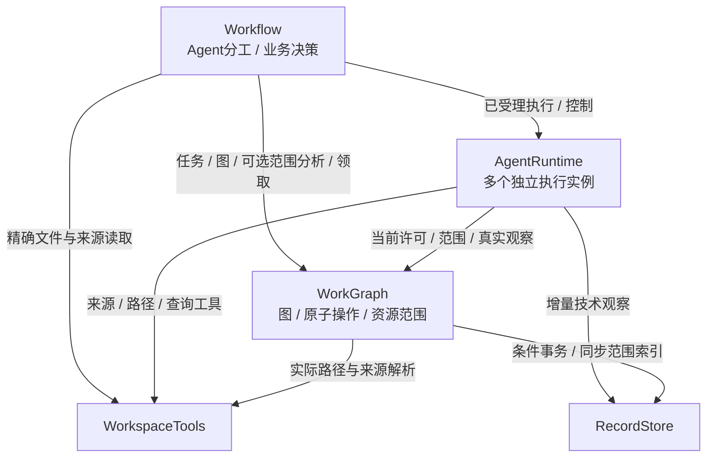
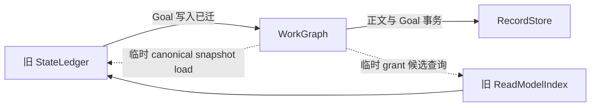

# 模块依赖图：业务策略与核心操作

当前独立仓库的实际装配、静态依赖与代码规模见 [2026-09-27 当前模块关系图](reviews/current-module-map-2026-09-27.md)。下文目标图与历史迁移记录保留原义，不代表当前全部实现状态。

状态：2026-09-24。目标 5 模块/8 条允许边，在独立工程 `coding-platform/next` 按[目标源码门禁](../../scripts/check-boundaries.mjs)检查；实际功能尚为子集，见[干净迁移记录](reviews/next-completed-migration-2026-09-24.md)。原[源码 map](../../coding-platform/scripts/module-map.mjs)描述旧参考工程，不能混计为 next 的模块数。依据：[架构](ARCHITECTURE.md)。

## 1. 目标 DAG

5 个模块、8 条边是职责划分结果，不是性能指标。箭头＝调用者长期消费提供者，包括注入的接口；运行消息往返不是源码依赖。Contracts 不导入实现；Host 装配不消除真实逻辑依赖。

| 调用者 | 提供者 | 消费能力 | 边界 |
| --- | --- | --- | --- |
| Workflow | WorkGraph | 图、任务、Session候选、候选计划、邮箱、证据；受理结构化意图 | 业务不逐表更新索引 |
| Workflow | AgentRuntime | 已受理工作的执行／控制／观察，Kernel Session历史只读桥接 | 已受理不等于已完成；只读历史不创建Run或启模型 |
| Workflow | WorkspaceTools | 人工查询、规划与检查所需精确文件、差异和来源 | 已知路径无需先查询全图 |
| AgentRuntime | WorkGraph | 运行占用、待执行意图、结果入账，执行中的图／历史引用工具 | 不另写正式任务或Session状态 |
| AgentRuntime | WorkspaceTools | 文件／符号／搜索／源码工具和来源核对 | 不建立第二套源码索引 |
| AgentRuntime | RecordStore | 平台自身观察、配置引用和持久适配 | Kernel日志和检查点仍在Kernel；正式业务状态走WorkGraph |
| WorkGraph | WorkspaceTools | 架构来源捕获、比较所需观测、材料来源核对 | 普通观测不强制绑定Run／baseline |
| WorkGraph | RecordStore | 条件事务、正文、事件页和持久索引 | 存储不决定业务策略，关联变更不能部分成功 |

合法拓扑序：Workflow → AgentRuntime → WorkGraph → WorkspaceTools／RecordStore。同层不代表开发必须并行或串行。机器声明见 [module-target.json](module-target.json)。

### 并行审阅时区分三种图

| 图 | 箭头含义 | 是否允许反馈环 / 并行解释 |
| --- | --- | --- |
| 本页源码 DAG | 调用者依赖提供者 | 保持无环；一个 Runtime 模块可以驱动多个 Agent 实例，不因图只有一个框而串行 |
| [运行时协作图](PARALLEL-COLLABORATION.md#3-运行时协作图工具检查agent-修正独立执行) | 图/资源检查→Agent决策与修正→领取→执行→结果 | 允许反馈；同工作区不冲突范围并行，真实冲突交回策略处理 |
| [开发任务依赖图](PARALLEL-COLLABORATION.md#6-开发协作图冻结契约后并行内部实现) | 契约及可验收交付的前置 | 公开契约冻结后内部实现并行，生产集成等待真正所需能力，不按层数全局串行 |

注释：架构模块不是排他锁，AST依赖不是一律加锁；核心数据工具解析实际范围与共享资源，由Agent/Workflow修正分工。Session自身对话占用与工作区文件资源分别管理。旧源码的单writer只列为待迁实现，不再成为目标限制。

## 2. 不允许的反向边

- 核心不依赖 Workflow；结果和待决意图由外层业务消费。
- WorkGraph 不依赖 AgentRuntime；只受理／记录，外层驱动Kernel并回报。`findSessions/searchHistory`返回平台关联与引用；`readSessionHistory`实际读取Kernel日志，由AgentRuntime只读适配提供。
- RecordStore 不依赖其他模块；文件来源政策在实际使用处执行，领域判据在WorkGraph。
- WorkspaceTools 不依赖 RecordStore；返回捕获结果，由调用方决定保存和关联。
- 普通查询不依赖生命周期策略；有执行方式／会话处置决定时才进入该流程。

## 3. 旧依赖的处置

| 旧边／切分 | 目标 |
| --- | --- |
| 六类消费者 → ContextCompiler | 拆为Workflow的输入需求、WorkGraph的材料定位和来源读取、AgentRuntime的输入适配；删除总门面 |
| ReadModelIndex → ControlEngine | 解释、资格和完成判据同归WorkGraph内部，不再跨模块传递 |
| ArtifactVault → Ledger／Index／Workspace | 正文存取归RecordStore；适用性归WorkGraph；文件来源通过WorkspaceTools |
| Dispatch → 新增AgentLifecycle | 选择策略归Workflow、机制归AgentRuntime、状态归WorkGraph，不再只加包装 |
| ArchitectureReconciler → Context／Vault／Control | 比较、候选、材料绑定归WorkGraph，消费底层存储与来源 |
| 普通／Reviewer／Handoff多套启动 | 统一执行协议，运行类型保留必要差异 |

## 4. 迁移期检查

目标 JSON 的路径相对 `coding-platform/next`，新工程目录及真实 import 由 `next/scripts/check-boundaries.mjs` 检查；原 map 留作旧工程事实。每批在 next 接通真实调用链和测试，不默认接回旧服务。N0 窄骨架必须返回 unsupported，不能为了边数凑出虚假功能；旧入口在最终产品切换后退役。

文档检查验证ID／目录唯一、依赖存在、无环、所有旧模块都有去向及模块页存在；源码检查验证当前实现。关键文件/Port/内部调用在[详细骨架](skeleton/README.md)，外层Host及Kernel边界在[贯通流程](skeleton/END-TO-END.md)。开发批次见[实施方案](IMPLEMENTATION-PLAN.md)，与本图分别维护。

### 旧参考工程 R3b 的注入关系（2026-09-24 历史）

下图是迁移现状，不改变上面的五模块目标。`load` 和候选查询即使通过窄类型注入，仍是实际依赖；不能因源码没有 import 旧模块便删掉这两条边。R3b 的功能接线与这项架构收口分别验收。

材料读取的当前实现直接读取同后端 snapshot 或投影，没有沿上述模块关系递归调用 Goal 写入，也不开始嵌套写事务。但模块级依赖已出现环；`check:architecture` 的 import/声明边检查成功，只证明该检查的范围，不能外推为完整逻辑图无环。

退出项：把精确 snapshot 读取、material-access 候选索引的物理读取归 RecordStore，共用现有连接和状态；WorkGraph 保留来源、grant、basis 与撤权规则，旧读入口改为薄适配。随 R3c 的数据/索引迁移先行小批关闭，不新造 DataEngine、不复制 SQL 或双写索引来美化图。R3b 验收报告必须保留此欠账，最终 R6c 不允许带着这两条临时边宣称目标 DAG 收敛。
