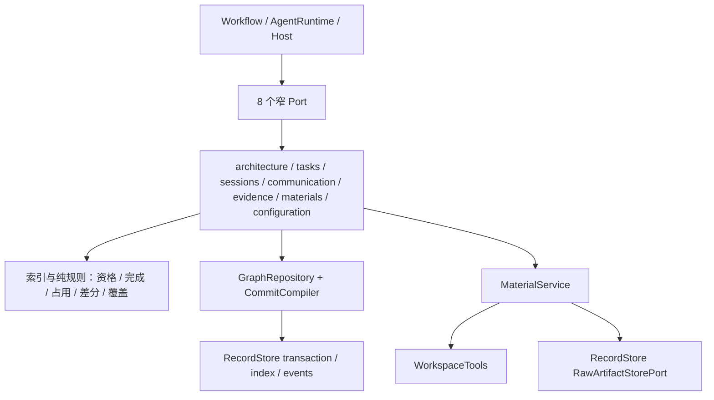
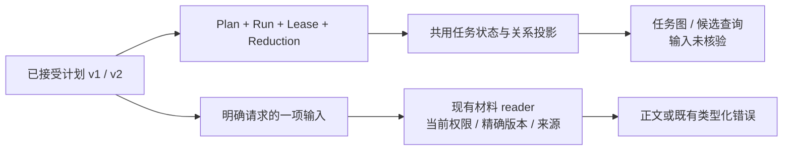
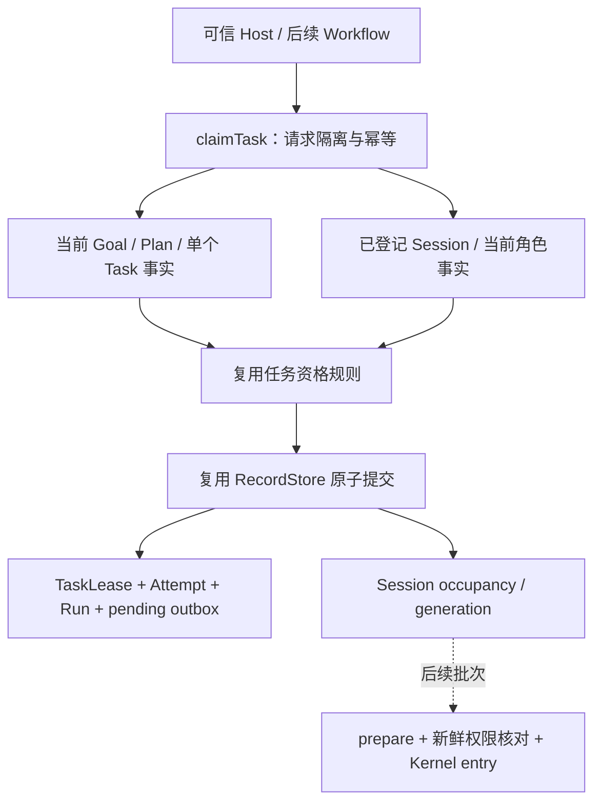
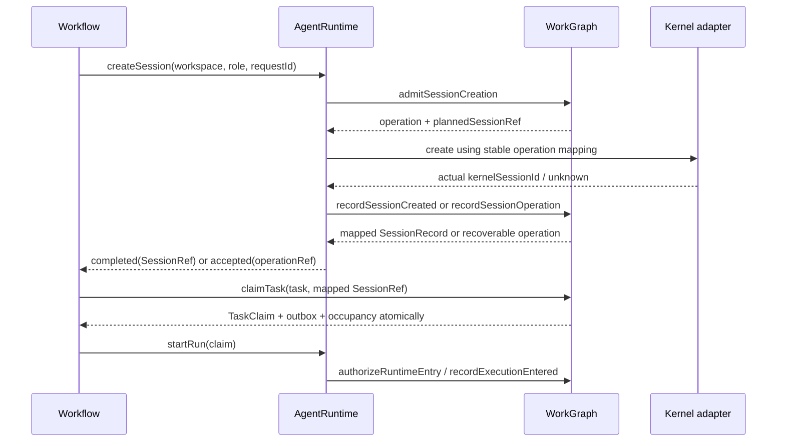

# WorkGraph：工作结构、原子变更与查询的实现骨架

> **2026-09-26 当前实现：** 正式Task执行状态、Session/图索引、通信、材料、Role、未来意图与公开初始化已接通；R3e注册检查及正式Task/Goal完成、Query受理/claim/终态Answer实现已独审导入。Query从原submission locator读请求事实，新的动作守当前权限/占用，终态保留已发生事实。R4.1仅为持久控制受理，物理投递/ack/resume仍待接；CoordinationPolicy writer、正式架构演进和完整治理继续。已有Plan的Workflow推进与初始Host、Session/mailbox已导入，初始Plan消费者及生产UI布局为当前下一批。最新增量、消费者和证据见[能力索引](../../IMPLEMENTED-CAPABILITIES.md)与[交接](../../HANDOFF.md)。最近完整物理隔离仍为R5a/R4.2的102文件/1,007项；后续专项通过不等于当前main或完整产品已全量验收。

> **2026-09-24 并行语义纠偏：** 任务图是协作白板、状态/历史与证据索引；预期依赖和架构影响不自动阻止执行。明确采用的具体输入条件在需要消费时检查，不以生产方整个 Task satisfied 代替。取消每次 Task/Query 领取必须预证明全部未来范围、预占资源的要求；身份、权限、幂等、同 Session 一致性及实际操作的原子性仍保留。下文尚含该旧方案的 scope/reservationRef 必填代码块，标记为**待按具体工具收窄的草案，不得直接冻结施工**。最新行为图见[并行设计 §1.2、§3](../../PARALLEL-COLLABORATION.md)；当前代码差异见[审阅报告](../../reviews/task-graph-orchestration-intent-2026-09-24.md)。


状态：目标详细设计形成于2026-09-23；当前实现根为 `/home/hyh001/projects/coding-platform/coding-platform/next`，下文目标 `src/...` 相对此根。Goal、Material及正式RecordStore reader已完成干净迁入，见[迁移验收](../../reviews/next-completed-migration-2026-09-24.md)。本轮初始Plan采用/任务事实查询、Session创建操作/目录/关联已通过专项主审并导入，最终装配与隔离验证见[next R3c/R4b报告](../../reviews/next-r3c-r4b-2026-09-24.md)。本轮另交付角色规格与持久observed图，已通过[372项隔离验收](../../reviews/next-r3d-r3g-2026-09-24.md)。本页完整接口仍含尚未实现的正式架构演进、记忆、完整通信路由/等待、证据及R4能力，不能根据代码块推断全部可用。旧入口、legacy reader注入及旧工程验收仅为迁移历史，不是next依赖。

## 1. 接手时先确认的边界

WorkGraph 保存和操作任务、正式架构、Session 目录、通信、证据、材料及有限角色/记忆记录。它不调用模型、Kernel、shell 或测试命令，也不选择业务方案。目标只依赖 WorkspaceTools 和 RecordStore；第13节保留原工程迁移依据，next 已用正式RecordStore reader替代其旧服务注入；Workflow/AgentRuntime/Host 消费它的窄 Port。

- Kernel 原始 Session 日志和 checkpoint 不复制到本模块；`readSessionHistory` 由 AgentRuntime 提供。这里返回平台历史引用。
- 正式架构、任务关系、消息及责任不是可丢弃投影；邻接/就绪/检索索引是由它们维护的结构。
- 任务完成依据采用的要求与适用证据；Run completed、单项 PASS、角色建议产物都不能单独宣布任务完成。
- 当前状态来自正式记录和归约。不可变 PlanRevision 内的任务定义不因运行而被重写；查询合并运行、处置和归约记录得到当前 phase。
- Session 创建先登记操作、由 AgentRuntime 创建 Kernel Session、再登记映射；映射完成才可领取。领取将 TaskAttempt、Run、Session 占用和 outbox 一起提交。
- 模型查询使用真实 QueryRunRef，不能伪造一个 Task。`ExecutionRef = RunRef | QueryRunRef`；原 RunRef/TaskAttemptRef 的键与历史格式保留。

共同类型的精确来源见 [公共契约骨架](../../skeleton/CONTRACTS.md)。本页重述调用所需含义，领域 Port 与 DTO 归本模块各 `contracts.ts`；机械持久编码协议归 `src/core/record-store/ports.ts`，共同业务身份仍归 `src/contracts/core/`；WorkGraph→RecordStore 是已允许依赖，不能让 RecordStore 反向导入本模块。

## 2. 文件与内部依赖

`ports.ts` 只导出下面的窄 Port 与 DTO；`index.ts` 只导出 `createWorkGraph`、依赖类型及 ports。工厂返回分组 Port，不创建转发所有方法的大类。消费者按能力注入，不获得数据库句柄。

| 目标文件（均在 src/core/work-graph/） | 导出与责任 | 直接依赖/状态所有权 |
| --- | --- | --- |
| `index.ts`、`ports.ts` | `createWorkGraph`、8 个公开 Port 的 re-export | 仅装配/类型导出，无状态 |
| `composition.ts` | `createWorkGraph(deps): GraphPorts` | 注入各服务；只在此连接组件 |
| `persistence/record-codecs.ts` | `decodeGraphRecord/encodeGraphRecord`，封闭 schemaId→记录类型映射 | 旧 contracts/新增共享 records；无业务选择 |
| `persistence/commit-compiler.ts` | `compileGraphChange/compileLegacyCommit`，领域更新→PreparedCommit | 编码、完整读集、唯一槽、索引增量；不执行事务 |
| `persistence/graph-repository.ts` | `GraphRepository`，类型化 load/loadMany/lookupCommit/commit/index 访问 | RecordTransactionPort/IndexStorePort；外部不可调用 |
| `persistence/legacy-adapter.ts` | 旧 LedgerCommit/receipt 与新仓库的逐 kind 兼容 | 未迁 validator 暂委托旧适配；有退出清单 |
| `architecture/contracts.ts` | ArchitecturePort 与图/候选 DTO | 共享 refs、旧 baseline/source 类型 |
| `architecture/architecture-service.ts` | 查询、草案、比较和正式接受 | repository、WorkspaceTools、MaterialService、graph-index |
| `architecture/graph-index.ts` | 邻域/反向闭包、环路径、图版本索引增量 | 纯数据算法；无数据库/模型 |
| `architecture/architecture-delta.ts` | 结构差异、规则违例和 unresolved | 纯算法；来源不足不制造空图 |
| `tasks/contracts.ts` | TaskPort、RunStatePort、任务/执行 DTO | 原 Task/Plan/Run/QueryRun 类型 |
| `tasks/task-service.ts` | Goal/Plan 候选与接受、领取/释放/返工/完成 | repository、eligibility、completion、session-state |
| `tasks/eligibility.ts` | `evaluateEligibility/affectedSuccessors` | 共用任务自身状态规则；候选不是执行授权，旧前驱整体完成过滤已撤回 |
| `tasks/task-index.ts` | taskById、正反关系索引；旧“前驱未完成即不就绪”语义已撤回 | 纯增量算法；索引版本不能替代提交核对 |
| `tasks/completion.ts` | Task/Goal 证据适用性与完成归约 | 纯规则及输入构造；不执行检查 |
| `tasks/execution-guards.ts` | `resolveWorkspaceCapabilities/authorizeModelCall`，旧租约迁移适配 | 复用权限与实际能力判据；全工作区单 writer 不是目标规则，不调用 Runtime |
| `tasks/resource-scope.ts` | 架构映射/显式路径到资源范围、重叠与影响解释 | WorkspaceTools 的真实路径身份、正式图、Host 工具配置；同模块不是锁，同工作区可多 writer |
| `tasks/resource-service.ts` | `assessParallelism/reviseExecutionScope/readExecutionResources` 及检查资源占用 | repository + 同一范围算法；Task claim 内共用变更构造，不另提交半套占用 |
| `tasks/run-state-service.ts` | 派发授权、观测入账、控制、QueryRun、核对结果归约 | repository、session-state、共享准入；不查询 Kernel |
| `sessions/contracts.ts` | SessionDirectoryPort、操作请求/结果 | 共享 Session/Operation/Execution refs |
| `sessions/session-service.ts` | 创建受理/完成、目录查找、重组/压缩结果、归档和关联 | repository、session-state、MaterialService |
| `sessions/session-state.ts` | 占用/释放/归档/换手规则，返回同事务变更 | 纯函数；TaskService/RunStateService 共用，不能各有一套锁规则 |
| `sessions/session-index.ts` | 任务/模块/角色/活跃性索引及映射唯一键 | 纯键/增量构造 |
| `communication/contracts.ts` | MailboxPort、消息/确认 DTO | 旧 request/delivery/wait 类型及新增 Ack 记录 |
| `communication/mailbox-service.ts` | 一次发信/响应的正文保存与正式受理、分页读取、ack | repository、MaterialService、routing-rules |
| `communication/routing-rules.ts` | 有界路由、等待满足、唯一后继、换手 | 旧协调纯规则迁入；不启动 Agent |
| `evidence/contracts.ts` | EvidencePort、检查轮次/结果 DTO | 旧 VerificationRound/Check/Evidence 类型 |
| `evidence/evidence-service.ts` | 建轮次、存结果、恢复未决、汇合与证据登记 | repository、coverage、MaterialService |
| `evidence/coverage.ts` | 要求覆盖、来源适用性、FAIL/缺项汇合 | 纯规则；不调用 Runtime 或完成任务 |
| `materials/contracts.ts` | MaterialPort、读取/选择/历史 DTO | Artifact/Source refs、可信 MaterialReader |
| `materials/material-service.ts` | 正文存取、精确来源读取、去重/有界选择 | repository、RawArtifactStorePort、WorkspaceTools、applicability |
| `materials/applicability.ts` | 当前/历史使用、权限、来源适用性规则 | 复用现有规则，剥离“必须有模型 Run”的门面前提 |
| `materials/history-index.ts` | 按任务/模块/Session/类型定位平台历史 | repository 索引；不打开 Kernel Store |
| `configuration/project-bootstrap-contracts.ts`、`project-bootstrap-service.ts` | R5a 已实现 ProjectRegistrationPort、CompletionPolicyConfigurationPort 与四个 Host writer | 同一 RecordStore；Project/Workspace 原 codec、政策原 schema/digest、局部 CAS 与原回执 |
| `configuration/project-bootstrap-record-codecs.ts` | 四种 R5a 操作事件和政策专用纯检查 | 仅新增事件 schema，不重注册 Project/Workspace/政策记录 |
| `configuration/contracts.ts` | RoleMemoryPort、现有角色/人工记忆 DTO | 原 RoleSpec/Memory 类型 |
| `configuration/role-memory-service.ts` | 角色查询/安装/激活、有限记忆读写和选择 | repository、MaterialService；不建长期专家引擎 |

同一文件可以包含同一操作族的多个函数，禁止为每个枚举或纯函数强行拆文件。大函数拆分依据上表责任，不依据旧模块名。



`TaskService` 可调用 `Evidence` 的纯适用性函数并读取既有轮次，不能反调 `EvidenceService` 去执行检查。`RunStateService` 与 `SessionService` 共享 `session-state.ts`，不彼此相互调用形成循环。

### 2.1 R5a 当前正式初始化消费者

[createProjectBootstrapServices](../../../../src/core/work-graph/configuration/project-bootstrap-service.ts) 已由唯一 [createTargetPlatform](../../../../src/composition/create-platform.ts) 装配为 `platform.projects` 与 `platform.completionPolicies`，四个公开方法使用同一 backend 并进入原 trackedCall/close。Project/Workspace 继续复用 `{ref,revision}` 快照，首次为 1；创建目标使用缺席 guard，登记另一项目或工作区不要求整库为空。Workspace 登记是领域事实，不打开/创建目录，不保存第二份 Host root；真正读目录再核 Host 权限，领域 revision 与 permissionRevision 独立。

政策 writer 从输入计算原版本化政策对象的 canonical digest；内容 revision=2 的不可变行仍为 revision=1。install 只安装，activate 核已安装的精确 ref/digest，并 CAS 项目默认指针；不生成 baseline，不改已接受 Plan 的 effectiveCompletionPolicy，也不重算 Task/Goal。原请求从事件恢复原 value/cursor，后续激活不覆盖旧回执；提交响应失联只有同键 receipt 和原事件实际恢复才确认 committed，无法确认时保持 unavailable，不声称未提交。取消在最终 commit 前检查原 signal，已成功提交不被晚取消抹去。

[真实空 SQLite 测试](../../../../tests/composition/R5a-project-bootstrap-platform.test.ts) 经公开 Project/Workspace、Goal、政策、初始 Architecture 和 Plan 端口完成采用与关闭重开，无 raw scope/governance 种子；单独验证已启用政策但缺架构、已有架构但缺政策仍拒绝采用。[领域测试](../../../../tests/work-graph/R5a-project-bootstrap.test.ts)覆盖精确 expected 引用、版本/摘要、四事件归因、同键竞争、实际读取取消和真实提交后回执丢失。证据为[独立专项 4 文件 / 26 项](../../reviews/evidence/next-b2-2026-09-26/r5a-repair-final-tests.log)、[最终导入](../../reviews/evidence/next-b2-2026-09-26/r5a-final-implementation-import.json)；[实现交付报告](../../../../.toolchain/dsh-refactor-runs/r5a-project-bootstrap-implementation-20260926/attempt-1790396802156038161/final.md)记录邻接合并 13 文件 / 85 项。上述实现已纳入[完整隔离结果](../../reviews/evidence/next-b2-2026-09-26/r5a-r4-isolated-result.json)和[日志](../../reviews/evidence/next-b2-2026-09-26/r5a-r4-isolated.log)，仍不能把本批当作 Query、CoordinationPolicy、Workflow/HostUI 或 R4 完整控制已交付。


R4.2 已在所属 Kernel 的唯一循环接通可选工具组 awaited barrier，实际组启动前检查、全部工具及必要结果持久化后检查，原 Turn 恢复不重跑已结算工具；见[真实公开 API 测试](../../../../tests/kernel/R4-tool-group-barrier.test.ts)和[独立 5 文件 / 68 项证据](../../reviews/evidence/next-b2-2026-09-26/r4-tool-group-final-tests.log)。这是 WorkGraph 后续控制可消费的 Kernel 子能力，WorkGraph 本批没有新增 durable control writer/ack 或 resume 许可，平台实际停止及恢复能力仍未开放。

## 3. 类型来源和调用约定

### 3.1 精确复用的类型

| 类型 | 真实源码 |
| --- | --- |
| TaskTriple、RunRef、TaskAttemptRef、RunSnapshot、TaskEligibility、DispatchOutboxRef、RuntimeEventV1、TaskBudgetV1、RoleBindingRefV1 | `src/contracts/dispatch.ts` |
| PlanRevisionDraft、PlanRevisionRef、PlanRevisionSnapshot、RuntimeTask、Phase、Disposition、PlanValidationError | `src/contracts/plan.ts` |
| GoalRef、GoalSnapshot、VersionedRef、LedgerCommit、AggregateSnapshot | `src/contracts/ledger.ts` |
| CommandIdentity、ActorRef、CommitCursor | `src/contracts/command-event.ts` |
| QueryJobRef、QueryRunRef、QueryJobSnapshot、QueryRunSnapshot、QueryExecutionBindingV1、QueryJobAnswerV1、SubmitQueryJobCommand/Receipt、CloseQueryJobCommand/Receipt | `src/contracts/query-job.ts` |
| ArchitectureBaselineContentV1/RevisionRef/RevisionSnapshot/Pin、CompletionPolicyPin、CompletionPolicyRevisionSnapshot、ProjectCompletionPolicyActiveSnapshot | `src/contracts/governance.ts` |
| CodeGraphNode/CodeGraphEdge、ArchitectureDeltaChange | `src/contracts/architecture-inspection.ts` |
| ArchitectureSourceSnapshotV1、ArchitectureSourceMapping | `src/contracts/architecture-source.ts` |
| ControlIntentRef、ControlIntentSnapshot、SubmitControlCommand/Receipt、RecordSafePointAckCommand/Receipt | `src/contracts/control-intent.ts` |
| DirectedRequestRef/Snapshot、DeliveryRef/Snapshot、WorkParticipationRef、WaitConditionRef/Snapshot/TermV1、ReportMaterialV1 | `src/contracts/coordination.ts` |
| WorkContextRef | `src/contracts/context-continuity.ts` |
| VerificationRoundRecord/View/ConfigurationInput、VerificationRegisteredCheck | `src/contracts/verification-round.ts` |
| VerificationRoundScope/MaterialIdentity/SourceProof | `src/contracts/verification-context.ts` |
| CommandCheckRecord | `src/contracts/verification-service.ts` |
| EvidenceRef/Snapshot/Outcome、RequirementKey | `src/contracts/evidence.ts` |
| ArtifactRef/Record/OwnerRunRef、SourceRefV1 | 前三者 `src/contracts/artifact.ts`；SourceRefV1 在 `src/contracts/dispatch.ts` |
| RoleSpecPinV1、RoleSpecRevisionSnapshot、RoleSpecPort | `src/contracts/role-spec.ts` |
| MemoryScope/Snapshot/Command/Receipt/Selection/Purpose、MemorySelectionPort | `src/contracts/memory.ts` |

下文引用这些原名时直接 `import type`，不复制其正文。新共享类型从 `src/contracts/core/{identity,call-context,results,operations,source,session}.ts` 导入：

- `TaskRef = TaskTriple`；`ExecutionRef = RunRef | QueryRunRef`；SessionRef 为 projectId/sessionId，Ledger 引用另加 aggregateType。
- `CoreCallContext`精确字段为projectId、workspaceId?、principal、materialReader、signal；由Host绑定身份与范围，使用时解析真实能力，不新增ctx.actor或ctx.capabilities。模型不能提交这个参数伪造身份。`CommandMeta`携带requestId和expected version pins。
- `ReadResult<T>` 区分 ready(value)、not_ready、not_found、rejected；`WriteResult<T>` 区分 committed(value/replayed/cursor) 与 rejected。失败保留原细分码/原因。
- `OperationRef={aggregateType:'CoreOperation',projectId,operationId}`。持久 operation phase 为 accepted/running/completed/failed/unknown；Kernel 观测作为结果字段。平台接受操作与 Kernel 完成分开。
- `SessionRecord.occupancy` 为 null、`{kind:execution,executionRef,generation}` 或 `{kind:maintenance,operationRef,generation}`；`lastExecutionRef` 支持 Run/QueryRun。Kernel 映射包含 adapter/store 实例 ID 与 kernelSessionId。currentClaim/lastRunRef 只是先前未实现的设计草案，不存在需要迁移这些字段的旧 Session 表。
- 临时来源是 `SourceCaptureRef`，持久化后为带 ArtifactRef 的 `PersistedSourceCaptureRef`；WorkspaceTools 不能凭空生成已保存正文。

### 3.2 本模块通用 DTO（persistence 以外均可使用）

```ts
export type GraphPageRequest = { limit: number; cursor?: string; atLeastCursor?: CommitCursor };
export type GraphPage<T> = { items: T[]; nextCursor: string | null; sourceCursor: CommitCursor };
export type ReadOptions = { signal?: AbortSignal };
export type ChangeReason = { text: string; sources: ArtifactRef[] };
export type GraphWrite<T> = { input: T; meta: CommandMeta };
export type GraphPorts = {
  architecture: ArchitecturePort; tasks: TaskPort; runs: RunStatePort;
  sessions: SessionDirectoryPort; mailbox: MailboxPort; evidence: EvidencePort;
  materials: MaterialPort; configuration: RoleMemoryPort;
};
```

所有方法的首参 ctx 为可信 CoreCallContext；读方法可取消；写方法只有明确未提交时才报告取消。已提交后取消等待不撤销事实，按 requestId 可取原回执。分页 limit 在 schema 中设明确上限并返回 continuation，不能静默截断完整性要求。事务提交不会包住文件、模型或正文网络 I/O。

读取上下文与协作参与分开：普通工作 Run 用真实 RunRef/RoleBinding，不要求先创建 WorkParticipation；通信发送、回复、等待、订阅和结束参与仍解析完整 AgentPrincipal，并核对当前工作地址。Agent 的 inbox/ack 限合法工作地址，Host 查看不伪造 Agent；现有 architecture_report 的 coordination grant 也不因归入图能力而删除。注册 AgentInstance、创建参与有原有引导资格，不能要求待创建的关系先存在；system 的投递/超时/后继受理继续使用真实机械执行身份。共用上下文的 agentPrincipal 可选不改变这些逐操作准入。

## 4. ArchitecturePort：正式架构、观测和关联

### 4.0 执行前后静态分析的实现复用（2026-09-24）

用户要求复用架构图的数据结构与方法，无模型完成可以机械确定的比较，见[原话 §5](../../intent/2026-09-23-PARALLEL-AND-PRODUCT.md#5-2026-09-24复用架构数据结构做执行前后机械分析)。本表基于实际 `next`，不是后文完整 ArchitecturePort 都已实现。

| 已有方法 / 实现落点 | 可直接复用的事实 | 不能据此宣称 |
| --- | --- | --- |
| WorkspaceTools.compareWorkspace；`workspace/capture.ts`、`workspace/workspace-read.ts`、`workspace/git-read.ts` | 同 scope/provider/indexVersion 的两份冻结 capture，按文件路径/digest给增删改和唯一同内容 rename；同授权根的两份完整Git commit按路径/OID/mode比较，含binary与mode-only差异 | working_tree直接比较、mixed capture/git、Git写版本、跨隔离根来源自动对齐、hunk冲突、三方合并、changedSymbols |
| ObservedArchitecturePort.queryArchitecture；`architecture/graph-index.ts` | 已持久 capture 的 node/file 锚点、dependency/interface 有界邻域与 unresolved | 正式职责采用、全语言或完整动态调用关系 |
| ObservedArchitecturePort.compareArchitecture；`architecture/architecture-delta.ts` | 两份观测的节点/边结构key与摘要差异；after 图的含环强连通分量成员集合 | SCC变化专用比较、按顺序的环路径、接口语义兼容、两份修改可直接合并 |
| ObservedArchitecturePort.queryImpact；`architecture/graph-index.ts` | 沿已采集边反向查影响节点和路径，保留缺口 | 必须串行、权限范围、运行时资源占用或未来写集合 |
| WorkspaceTools.querySource | 一份捕获中的符号/定义/引用等可用查询 | 自动跨版本符号差分 |

实际 observed 图目前由显式 mapping 折叠 TS/JS import 而来，返回 `noVerdict:true`；未映射/未解析项必须保留。不能把讨论里的理想“架构图”当成已经具备全部正式模块、符号和运行时能力。

**执行前**：只在已有路径/节点/材料需要比较时复用这些方法，返回已有相交和影响提示；不重捕全仓或先让模型推断全部未来修改来取得执行许可。**执行后**：保存实际来源与 Session/执行引用，比较 base→A、base→B 的实际文件变更，再按需复用结构差分和反向影响定位受影响结果。共同基线、scope/provider/索引版本或mapping不适用时说明比较缺口；当前跨 worktree 集成需补来源对齐，不能伪造同scope。

报告应分别保留“文件内容变化/相同路径”“已观测结构影响”“具体工具的版本或文本冲突”“尚待语义核对”，不要输出一个没有依据的 canParallel 布尔值。相同文件不等于同hunk冲突，没有相同路径也不证明语义无冲突。新消费者组合现有端口；仅当真实实现复用需要时提取已有内部纯函数，不复制图/索引/遍历器，不提前公开无消费者通用API。保持已有输入版本、分页和授权语义；分页不能重复捕获，缓存/索引优化也不能隐藏缺口。

**附件讨论复核（2026-09-24）：** 同文件双改只记为 overlap，不能命名为已确认的 DIRECT_CONFLICT；两边可能得到相同内容，也可能修改不同位置。没有发现关系只针对已检查的范围，未检查、未解析及覆盖不足分别保留，不能用 NONE 自动宣布安全。路径不相交只可短路已有依据证明无关的检查，不能跳过已明确要求的接口或共享输出核验。相同 Git HEAD 不能证明未提交内容的共同基线；同目录依次捕获 Base/A/B 也不能证明两条独立工作线。现有 compare 可组合成临时文件事实查询，但跨 worktree lineage、三方文本合并和正式整合消费者尚未实现。本轮不为没有消费者的比较另添公开 Port。

### 4.1 本轮任务关系与精确材料输入契约

本小节为 R3c 施工冻结语义，限定子集已通过[独立验收](../../reviews/next-r3c-relations-2026-09-24.md)。目标是减少全任务等待与重复材料核验，不扩展成新的调度器；完整 R3c 仍有授权变更/领取/归约待完成。

- `PlanRevisionDraft` / `PlanRevisionSnapshot` 显式区分 schemaVersion 1、2。版本2新增白板 `taskRelations`（coordination / expected_dependency）及 `inputRequirements`（本批仅 artifact，持久保存现有精确 ArtifactRef）。PlanProposal@2 的嵌套 draft 自带版本；沿用机械编码器标识 PlanRevisionSnapshot@1（Store 按 aggregateType 选择且不逐条存 schemaId）；正文 schemaVersion 明确区分1/2，拒绝未知版本和v1夹带新字段。旧正文不改写，不表示旧程序可以读取新正文。
- `TaskRow` 将真实任务状态、提示关系和输入核验分开。图查询与候选查询共用投影/资格规则；默认输入为 `not_checked`，不为显示图而打开材料。旧 executionDag/requires 原样保留为 `legacy_unverifiable`，不会根据 label 或生产 Task satisfied 推断输入可用。
- `PlanTaskPort.readTaskInput(ctx,{goalRef,planRef,taskId,requirementId})` 只选择已接受计划的指定需求，复用 `MaterialPort.openArtifact(..., usage:'current')`，返回现有 `ReadResult<ArtifactRecord>`。它同时完成本次实际读取与核验，不再叠加一层“先全量 check 再重复 consume”；调用方不能传入替代引用。后续独立消费需要重新核验当时的权限与适用性。显式历史 Plan 可以作为精确引用的选择来源；current 只表示材料对本次 reader 的当前适用性，不表示该历史 Plan 当前活跃或旧任务获准执行，因此不新增 selection Plan 必须等于 Run pin 的门槛。
- 当前材料实现的 Host 身份没有可信 current source pin 入口，因此会如实拒绝当前适用性；不能以历史读取成功替代。真实 Run/QueryRun、精确 grant 和来源 pin 的能力继续复用，既不扩权，也不把候选资格当执行许可。
- 候选查询删除“前驱整个 Task satisfied”门槛，保留 Plan/Run/Lease/Reduction 的完整事实读取，以及任务自身状态、身份和范围检查。缺事实不默认 pending/free。材料缺失或不能核验不自动禁止整项工作的调查；真正读取时保留缺失、无权、来源过期等明确结果。



后文完整正式架构接口仍是待实现目标，当前已交付范围由上述 ObservedArchitecturePort 限定。


以下新增 DTO 定义在 `architecture/contracts.ts`，旧 baseline 只有 description/constraints、可选 sourceBinding/dependencyRules；它不是已实现的完整模块注册表。因此新增正式结构需 schema 演进，旧记录允许 `catalog=null`，不能从目录猜出职责。

```ts
export type ModuleDefinition = {
  ref: ModuleRef; name: string; responsibility: string; paths: string[];
  interfaces: { id: string; description: string; paths: string[] }[];
};
export type AdoptedArchitecture = {
  modules: ModuleDefinition[];
  dependencies: { from: ModuleRef; to: ModuleRef; reason: string }[];
  requireDag: boolean;
};
export type ArchitectureCatalogRef = Omit<ArchitectureBaselineRevisionRef, 'aggregateType'> & {
  aggregateType: 'ArchitectureCatalog';
};
export type ArchitectureCatalogRecord = {
  ref: ArchitectureCatalogRef; revision: 1;
  baselineRef: ArchitectureBaselineRevisionRef; schemaVersion: 1;
  catalog: AdoptedArchitecture; // 随 baseline 同事务写入，不可变，无独立 active 指针
};
export type ArchitectureRevision = {
  baseline: ArchitectureBaselineRevisionSnapshot;
  catalog: ArchitectureCatalogRecord | null; // 历史 baseline 缺失明确保留
};
export type ArchitectureDraftRef = { aggregateType: 'ArchitectureDraft'; projectId: string; draftId: string };
export type ArchitectureDraft = {
  ref: ArchitectureDraftRef; revision: number;
  basedOn: ArchitectureBaselineRevisionRef | null;
  catalog: AdoptedArchitecture; legacyContent: ArchitectureBaselineContentV1;
  reason: ChangeReason; status: 'candidate' | 'accepted' | 'rejected';
};
export type ArchitectureSelection =
  | { kind: 'current'; projectId: string }
  | { kind: 'revision'; ref: ArchitectureBaselineRevisionRef }
  | { kind: 'draft'; ref: ArchitectureDraftRef; revision: number }
  | { kind: 'observed'; capture: PersistedSourceCaptureRef };
export type GraphAnchor =
  | { kind: 'module'; ref: ModuleRef }
  | { kind: 'file'; workspace: WorkspaceScope; path: string }
  | { kind: 'session'; ref: SessionRef }
  | { kind: 'task'; ref: TaskRef };
export type WorkModuleSubject = { kind: 'task'; ref: TaskRef } | { kind: 'work'; ref: WorkContextRef };
export type WorkModuleLinkRef = {
  aggregateType: 'WorkModuleLink'; projectId: string; subject: WorkModuleSubject;
  moduleId: string; relation: 'implements' | 'investigates' | 'affects';
};
export type WorkModuleLinkRecord = {
  ref: WorkModuleLinkRef; revision: number; since: CommitCursor; until: CommitCursor | null;
};
export type ModuleLinkRequest =
  | { kind: 'session'; sessionRef: SessionRef; moduleRef: ModuleRef;
      relation: WorkLinkRelation; active: boolean }
  | { kind: 'work'; subject: WorkModuleSubject; moduleRef: ModuleRef;
      relation: WorkModuleLinkRef['relation']; active: boolean; expectedLinkRevision: number | null };
export type ModuleWorkLink = SessionWorkLink | WorkModuleLinkRecord;
export type DeclaredTaskModuleScope = { taskRef: TaskRef; moduleRef: ModuleRef; planRef: PlanRevisionRef };
export type ArchitectureNeighborhood = {
  selection: ArchitectureSelection; modules: ModuleDefinition[];
  nodes: CodeGraphNode[]; edges: CodeGraphEdge[]; links: ModuleWorkLink[];
  planScopes: DeclaredTaskModuleScope[];
  unresolved: string[]; nextCursor: string | null;
};
export type ArchitectureComparison = {
  before: ArchitectureSelection; after: ArchitectureSelection;
  changes: ArchitectureDeltaChange[]; cycles: string[][];
  ruleViolations: { ruleId: string; from: string; to: string }[];
  unresolved: string[]; noVerdict: true;
};
export interface ArchitecturePort {
  queryArchitecture(ctx: CoreCallContext, input: {
    selection: ArchitectureSelection; anchor?: GraphAnchor; depth: number;
    relations: ('dependency' | 'interface' | 'work_link')[]; page: GraphPageRequest;
  }, options?: ReadOptions): Promise<ReadResult<ArchitectureNeighborhood>>;
  queryImpact(ctx: CoreCallContext, input: {
    selection: ArchitectureSelection; changed: GraphAnchor[]; page: GraphPageRequest;
  }, options?: ReadOptions): Promise<ReadResult<{ affected: GraphAnchor[]; paths: string[][]; unresolved: string[]; nextCursor: string | null }>>;
  compareArchitecture(ctx: CoreCallContext, input: {
    before: ArchitectureSelection; after: ArchitectureSelection;
  }, options?: ReadOptions): Promise<ReadResult<ArchitectureComparison>>;
  proposeArchitectureChange(ctx: CoreCallContext, request: GraphWrite<{
    basedOn: ArchitectureBaselineRevisionRef | null; catalog: AdoptedArchitecture;
    legacyContent: ArchitectureBaselineContentV1; reason: ChangeReason;
  }>): Promise<WriteResult<ArchitectureDraft>>;
  applyArchitectureChange(ctx: CoreCallContext, request: GraphWrite<{
    draftRef: ArchitectureDraftRef; expectedDraftRevision: number;
    authorization: { kind: 'initial' } | { kind: 'evolution';
      candidateRef: CandidateArchitectureBaselineRef;
      decisionRef: ArchitectureChangeDecisionRef; gateRef: MigrationGateTaskRef };
  }>): Promise<WriteResult<ArchitectureRevision>>;
  captureSourceChanges(ctx: CoreCallContext, request: GraphWrite<{
    workspace: WorkspaceScope; mappings: ArchitectureSourceMapping[];
    previous: PersistedSourceCaptureRef | null;
  }>): Promise<WriteResult<PersistedSourceCaptureRef>>;
  linkWorkToModule(ctx: CoreCallContext, request: GraphWrite<ModuleLinkRequest>): Promise<WriteResult<ModuleWorkLink>>;
}
```

`CandidateArchitectureBaselineRef/ArchitectureChangeDecisionRef/MigrationGateTaskRef` 均导入 `src/contracts/baseline-evolution.ts`。initial 只适用于没有正式 baseline 的初始接受；evolution 必须校验真实 candidate、已接受 decision 和 pass gate 的完整来源链，不因 authorization.kind 的字符串直接放行。旧目录缺失时可逐版补入正式 catalog，但不能猜历史职责。

`captureSourceChanges` 先由 WorkspaceTools 捕获并验证，后存正文，再登记引用；工作区变化失败时不更新“当前观测”指针。任务未分配 Session 也可直接通过 WorkModuleLink 关联模块；WorkContext 同理。现有 Task.scope.kind=module 的“计划归属”仍从不可变 Plan 解释，不另写同义可修改归属记录；implements/investigates/affects 是不同的显式工作关联。session 分支委托同一 SessionWorkLink 写者，不创建第二条 Session→Module 真相。propose/apply 是完整结构替换的版本化命令，组件内部计算增量；不暴露任意节点属性 patch。依赖闭包用 visited 集，正式 DAG 增边检测逆向可达性；requireDag 必须符合当前适用结构策略，调用者不能改成 false 绕过正式模块 DAG 约束。observed 图保留真实环。架构比较不得要求普通读取先存在 Plan/Run；若请求的是某 Run 的基线，则使用其既有 Plan pin，不能偷换为当前默认基线。

**2026-09-24 observed 子集的编码与生命周期：** 不可变 Observation 记录引用已持久正文，Workspace 当前观测指针与事件同事务提交；临时 capture 无论提交成功、失败或取消都进入释放清理。取消不能阻止清理自身，释放仍保留原身份和作用域。发布约束使用 Project、Workspace、当前观测和新 Observation 的精确 CAS；无关事件追加不构成本操作失效条件，不额外锁住全局 ledger 水位。

历史读取核对 record/capture 的 project、workspace、captureId，以及正文/summary/capture 的来源版本、引擎、配置与摘要。先核当前 Host 访问再读正文，包含 previous 的比较也复用此路径。现行逐文件权限针对冻结正文中的实际文件与配置输入。显式 mapping 可以指目录，或由多个路径共同匹配；node.path 是首个代表路径，并不承诺该路径是一份实际文件。节点须关联相符的 mapping 且有真实 source member，不能因为首路径缺失拒绝其他路径命中的合法映射，也不能以删掉真实 source member 绕过鉴权。上述 observed 记录及机械影响仍不等于正式 baseline 或执行授权。

observed 邻域按指定关系作 depth 有界的双向邻接遍历，边随 fromNode 页返回，跨页端点通过节点 ID 定位。影响查询沿反向依赖遍历；比较的 cycles 表示 after 图中含环的强连通分量成员集合，按 ID 排序，不是首尾可直接相连的路径，更不是枚举所有简单环。所有结果保留 unresolved 与 noVerdict。

节点成员证据使用 WorkspaceTools 在同一次分析中已有的 `indexedSources[{path,digest}]`；该字段在通用源码快照中可选以兼容旧调用者，本批新持久 observed 正文必须提供。每个 indexed member 必须与 frozen files 同路径同摘要，节点摘要按 mapping 匹配的 indexed 成员序列重算核对。不得用文件 kind/扩展名猜是否已索引：TypeScript 的 resolveJsonModule 可使 JSON 成为真实 indexed source，普通配置则不会仅凭后缀成为图节点。携带这一已有清单不增加源码捕获或分析次数。

## 4.2 R4c.1 当前冻结的 Task 领取接口（2026-09-24）

施工状态：已通过Astra骨架/测试审核、DSH实现、独立审阅与物理隔离验收；60文件/422项PASS，见[验收报告](../../reviews/next-r4c-claim-2026-09-24.md)。当前窄接口以 `next/src/core/work-graph/tasks/claim-contracts.ts` 为准；本节覆盖下文旧 `scope` / `reservationRef` 必填草案。整体 R4c 仍需 prepare、真实 entry、Query、观察与释放。



- 正式输入不要求预测范围/资源预占，也不检查前驱整个 Task 完成；实际材料在需要消费时验证。不同 Task、不同 Session 可在同一工作区并行。
- 定向 Run 索引、Lease/Reduction 精确读取复用现有 canonical fold / eligibility；不为单任务读取整 Goal，也不把全局账本水位作为提交锁。
- 同一事务保存五种记录；TaskLease 不存在 CAS 防重复首次领取，Session revision CAS 防同 Session 并发。generation 取 Session 新 revision，不另造计数表或重复唯一槽。新平台后续领取/结束路径必须与这些正式记录同事务协调，不能绕过它们另写 Run。
- 角色解析保持同一实现，内部额外返回版本 guards；公开查询不变。领取确认身份和当前配置，不能把空权限检查解释成执行授权。
- 重放恢复原事件中的领取结果；读取 outbox 可查原领取。当前不发布自动释放：旧 TaskLease@1 没有 released 状态，过期时间不能假装释放。
- 复用 Session/Run/Lease codec、Memory/SQLite 事务与索引；仅补 Attempt/outbox/领取事件编码和领取服务，不增加模块/存储层。批次准确范围与反例见 [R4c.1 施工要求](../../tasks/R4c-next-claim-skeleton-prompt.md)。

## 5. TaskPort：目标、计划、领取、完成

**2026-09-24 实施澄清：** `next` 当前 Goal 已实装，计划子接口落在 `tasks/plan-contracts.ts`，本轮冻结范围见 [R3c任务书](../../tasks/R3c-next-plan-skeleton.md)。PlanProposal 沿既有 workspace 作用域完整键，Goal 为 body 关联；v1 只有 patch，读视图明确无完整 draft。`queryReadyTasks` 是 task_state 候选，领取时再核验真实角色、Session、资源和预算；查询不创造许可。新 v2 全量草稿已支持初始受理及 §5.1 的 W1/W2 窄未来修订，不能靠非空 decisionRefs 绕过其 source/delta 与局部事实检查。单 Goal 邻接与注册lookup已足以支撑本轮；同步ready分区索引另批实现，不以当前读lookup冒充。TaskGraph 始终保留全部 Plan 任务；运行/归约事实只更新状态，不能过滤掉没有执行记录的任务。候选 lookup 与 canonical 复读须同水位，否则重读或 not_ready，不能给漏项集合贴较新水位。已有 ended Run 但未有正式归约/重新入队依据时不得退回首次 pending/free。

DTO 定义在 `tasks/contracts.ts`。TaskGraph 的 definition 保留 PlanRevision 中的原值，effectivePhase 从正式 reduction/Run/处置解释。下列 Goal/Plan 命令不自动启动任何执行。

```ts
export type GoalDetail = { goal: GoalSnapshot; phase: GoalPhaseSnapshot | null; pendingPlan: PlanProposal | null };
export type PlanProposalRef = { aggregateType: 'PlanProposal'; projectId: string; workspaceId: string; proposalId: string };
export type PlanProposal =
  | { kind: 'candidate_v2'; schemaVersion: 2; ref: PlanProposalRef; revision: number;
      goalRef: GoalRef; basedOn: PlanRevisionRef | null; draft: PlanRevisionDraft; reason: ChangeReason;
      status: 'candidate' | 'accepted' | 'rejected'; issues: PlanValidationError[] }
  | { kind: 'legacy_v1'; schemaVersion: 1; ref: PlanProposalRef; revision: 1;
      goalRef: GoalRef; basedOn: PlanRevisionRef; draft: null; legacy: PlanProposalSnapshot;
      status: 'candidate'; issues: PlanValidationError[] };
export type TaskRow = {
  ref: TaskRef; definition: RuntimeTask; effectivePhase: Phase;
  disposition: Disposition; currentAttempt: TaskAttemptRef | null;
  execution: ExecutionRef | null; eligibilityScope: 'task_state'; eligibility: TaskEligibility;
};
export type TaskGraph = {
  plan: PlanRevisionSnapshot; tasks: TaskRow[]; links: ModuleWorkLink[];
  sourceCursor: CommitCursor;
};
export type ReadyTask = { task: TaskRow; planRef: PlanRevisionRef; expected: VersionPin[] };
export type TaskClaim = {
  taskRef: TaskRef; planRef: PlanRevisionRef; attemptRef: TaskAttemptRef;
  runRef: RunRef; outboxRef: DispatchOutboxRef; sessionRef: SessionRef;
  roleBinding: RoleBindingRefV1; generation: number;
  reservationRef: ResourceReservationRef;
};
export type TaskCompletion = { taskRef: TaskRef; phase: Phase; reductionRef: TaskReductionRef; revision: number; affectedSuccessors: TaskRef[] };
export interface TaskPort {
  queryGoal(ctx: CoreCallContext, goalRef: GoalRef, options?: ReadOptions): Promise<ReadResult<GoalDetail>>;
  readPlanProposal(ctx: CoreCallContext, ref: PlanProposalRef, options?: ReadOptions): Promise<ReadResult<PlanProposal>>;
  createGoal(ctx: CoreCallContext, request: GraphWrite<{ goalId: string; workspace: WorkspaceScope; objective: string }>): Promise<WriteResult<GoalSnapshot>>;
  updateGoalIntent(ctx: CoreCallContext, request: GraphWrite<{ goalRef: GoalRef; objective: string; reason: ChangeReason }>): Promise<WriteResult<GoalDetail>>;
  queryTaskGraph(ctx: CoreCallContext, input: { goalRef: GoalRef; planRef?: PlanRevisionRef; atLeastCursor?: CommitCursor }, options?: ReadOptions): Promise<ReadResult<TaskGraph>>;
  queryReadyTasks(ctx: CoreCallContext, input: { goalRef: GoalRef; roleIds?: string[]; includeBlocked: boolean; page: GraphPageRequest }, options?: ReadOptions): Promise<ReadResult<GraphPage<ReadyTask>>>;
  proposePlan(ctx: CoreCallContext, request: GraphWrite<{ goalRef: GoalRef; basedOn: PlanRevisionRef | null; draft: PlanRevisionDraft; reason: ChangeReason }>): Promise<WriteResult<PlanProposal>>;
  applyPlanChange(ctx: CoreCallContext, request: GraphWrite<{ proposalRef: PlanProposalRef; expectedProposalRevision: number; decisionRefs: VersionedRef[] }>): Promise<WriteResult<PlanRevisionSnapshot>>;
  // 可选的解释/批量比较；明确范围可直接 claimTask，两者共用解析与冲突算法。
  assessParallelism(ctx: CoreCallContext, input: { candidates: ParallelCandidate[] }, options?: ReadOptions): Promise<ReadResult<ParallelAssessment>>;
  claimTask(ctx: CoreCallContext, request: GraphWrite<{ taskRef: TaskRef; planRef: PlanRevisionRef; sessionRef: SessionRef; role: RoleConfigurationRef; budget: TaskBudgetV1; scope: ScopeProposal }>): Promise<ScopeWriteResult<TaskClaim>>;
  releaseTaskClaim(ctx: CoreCallContext, request: GraphWrite<{ claim: TaskClaim; reason: string }>): Promise<WriteResult<{ released: boolean; task: TaskRow }>>;
  requeueTask(ctx: CoreCallContext, request: GraphWrite<{ taskRef: TaskRef; failedRunRef: RunRef; reason: ChangeReason }>): Promise<WriteResult<TaskRow>>;
  completeTask(ctx: CoreCallContext, request: GraphWrite<{ taskRef: TaskRef; planRef: PlanRevisionRef; roundRef: VerificationRoundRef }>): Promise<WriteResult<TaskCompletion>>;
  completeGoal(ctx: CoreCallContext, request: GraphWrite<{ goalRef: GoalRef }>): Promise<WriteResult<GoalPhaseSnapshot>>;
}
```

`GoalPhaseSnapshot` 来源 `src/contracts/goal-phase.ts`，`TaskReductionRef` 来源 `src/contracts/reduction.ts`。预算使用用户/项目已有配置，不因新入口自行增加数字。实际权限由角色/当前授权解析，模型不能传一个 tools 数组自行扩大权限。

`ScopeProposal/ParallelCandidate/ParallelAssessment/ResourceReservationRecord` 的目标字段及操作语义见 [并行协作 §4–5](../../PARALLEL-COLLABORATION.md)，领域 DTO 同归 `tasks/contracts.ts`；共享 ResourceTarget/Access/ReservationRef 归 `src/contracts/core/resources.ts`。注释：预检查只提供解释，不能用其成功结果替代 claim 时对当前集合的原子核对。不同模块共享接口属于影响提示，实际路径重叠才按操作模式判断资源冲突。工具返回具体冲突/缺口后由 Agent 修正分工，不自动把任务判失败。

`updateGoalIntent` 复用现有 goal-change 受理规则；只是目标文字变化不自动使全部旧证据有效或无效。PlanProposal 是目标统一候选外形，迁移器适配已有初始规划/计划变更提案引用，不复制保存第二个活动计划。原接受计划必须检查政策、义务、引用和 DAG；首个 baseline 前的调查/草案可用，但任务真正执行仍需完成其适用正式前置条件。

### 5.1 W1：未来任务白板的窄修订（已验收，2026-09-25）

**2026-09-26 显式未来意图已接通：** v2 work 节点可声明 `executionIntent: 'plan_only' | 'request_execution'`，缺省继续原完整执行定义语义，v1 不接受新字段。初始图可以只有无分配、无验收、无依赖的 `plan_only`；显式 optional+active、required+deferred 意图也可采用，唯一 required+active 意图可经真实未来修订改为 deferred。节点存在、任务候选、领取/执行权及正式完成分别解释，不新建成熟度状态或未来任务系统。完全未标新字段的旧空图、optional-only 非法形状仍拒绝。见[已审核导入](../../reviews/evidence/next-b2-2026-09-26/w2-future-intent-implementation-20260926-import.json)。

`validatePlanDraft/validatePlanAssignments` 与同一 `applyPlanChange` 已区分规划缺项和执行请求：已有未分配意图可首次补合法 assignment，新增显式节点也可首次声明源计划未出现的角色；已有非空 assignment 不可改派或删除。补 assignment 不激活 `plan_only`，必须明确改为 `request_execution`；省略源显式字段不能隐式激活。执行请求必须有合法 role/instruction，仍可没有完整验收，真实 claim 再核当前角色、绑定与预算。只读 Task/Goal diagnostics 从已读取的 Plan 和任务事实解释待细化、缺验收及 required 未完成项，不额外读取政策、材料或权限；`completionEvaluation: 'not_evaluated'` 不授权完成，Run ended 也不等于 Task complete。必要引用、局部 CAS、幂等和硬依赖无环检查保留，R5/R6 自动细化与展示仍是后续消费者。

**W1 Host future-only 修订已通过独立物理隔离验收**，见 [B1/W1 报告](../../reviews/next-b1-w1-2026-09-25.md)。施工经过骨架/测试中审、DSH 实现和独立返修，范围见 [W1 任务记录](../../tasks/W1-future-plan-skeleton.md)。现有 `PlanTaskPort.proposePlan/applyPlanChange` 已支持 active source 上的 v2 窄候选：从可信源 Plan 和候选计算局部差异，并以原事务采用；未新增白板 Port、Task 状态表或编排总管。W2 Agent 委托复用同一未来采用编排，C2 已接真实 Runtime 工具消费者；完整授权变更和 Workflow 自动规划推进仍未完成，不能扩大为任意 basedOn 变更。

**可改什么。** 执行定义仅可修改从未领取/执行、没有正式归约的未来任务：有界标题/指令、具体输入引用、延后/取消、已授权范围内的新增/拆分。展示分组和提示关系另按下段规则维护。已领取或执行过的任务保留全部执行定义、assignment、inputs、关联的验收语义与状态依据；编辑未来 B 不要求正在运行的 A 停下。取消使用 disposition，不物理删除旧 taskId。已有任务角色重分配、Role/Skill 配置变更、目标/验收义务正文或治理 pin 变化、预算授权增量不属于 W1；reviewAdmissionProtocol 保持原值，原 origin 保留且不能被候选替换。新增任务必须 phase=pending；未标显式意图的 legacy 新节点仍受源计划角色集合约束，显式节点首次声明角色按本节 W2 增量处理，不产生新的权限或预算；实际预算仍由后续真实 claim/Runtime 接受，不能从白板编辑得到。

差异以执行定义为边界：RuntimeTask 字段、该 task 的 assignment/inputRequirements/所承担义务语义进入未来性检查和 basis 更新集合。纯提示的 taskRelations、展示用 parentOf 不进入该集合，允许编辑连接运行 A 的提示关系而不要求 A 未执行、不重置 A 的 basis。比较 A 的义务语义时排除其他 taskIds 成员变化；给未来 B 调整承担映射不能因此认定 A 被修改。关系结构、legacy 完整定义与原承诺覆盖仍按各自适用规则校验。

**验收不能被编辑削弱。** source obligations 的身份、标题、requirementLevel、verificationRequirements 保持不变；可为新增/拆分/取消未来任务重算 taskIds 承担映射。已有执行任务的义务集合不变；每项原有义务仍保留有效承担者和相应 required 覆盖，原 gate 及其验收关系不删改。取消唯一承担者须在同一修订提供有效替代，不能因新 draft 仍然“非空”就通过。W2 允许给尚未执行的未来节点追加新 obligation，并新增承担该新义务的 gate；仅存在新增 obligationId 时，apply 读取源 Plan 固定的 CompletionPolicy 精确 ref/digest、核适用要求并把该记录 guard 合入原事务。无新增义务的未来细化不读取政策；propose 的当前政策诊断不替代采用时的源 pin。结构、承诺保护与局部未来性校验仍复用原实现，不要求无关任务停止。

**跨 Plan 保留执行依据。** 只在 accepted schemaVersion=2 Plan 增加一个版本化、compiler-only 字段：

```ts
taskStateBasis?: {
  schemaVersion: 1;
  entries: { taskId: string; planRef: PlanRevisionRef }[];
};
```

旧 Plan 无该字段时，每个 task 的 basis 就是自身 planRef；W1 新字段完整覆盖该 Plan 的 taskId、无重复且按 taskId 稳定排序。未改 task 继承 source 的有效 basis；新任务或通过 future-only 校验的改动任务指向新 Plan 自己。这个引用表示执行定义的来源，不是另一份状态。候选 draft 不接受这个字段，采用 compiler 根据正式 source 生成，禁止信任模型或调用者自报的 basis。

Run/Reduction 的历史 planRef 不变。reader 对选中 Plan 与实际 Run/Reduction 所属的不可变 Plan 解析 basis，只在同 Goal、相同 taskId、相同 basis 且事实所属 Plan 不晚于选中 Plan 时接纳；W1 接受必须严格 source=当前 active、planRevision=source+1，形成可核对的线性采用版本。按具体不同 planRef 批量读必要 Plan，不逐任务重复读、不递归追完整祖先链。显式查询旧 Plan 保留旧定义，不吸入后续 Plan 新领取的 Run；任何 basis 损坏/指向别的 Goal/定义不一致必须 unavailable，不能回落 pending。完整要求及历史版本限制见任务书。

同样过滤按 Task 全局保存的 TaskLease：只有 selected Plan 接受的 holderRun 才能映射为该 Plan 的租约、runId 和 leased 原因；不能 Run 已过滤，却从全局 Lease 把 P2 新执行泄漏给 P1。历史版不适用某 Lease 只是投影边界，不表示当前资源真实 free。queryReadyTasks/claimTask 仍核对 active Plan，旧图不能授予执行许可；不为此复制历史 Lease 表。

**局部竞争与事务。** 差异计算得到受改 taskId，复用 RUN_BY_TASK 索引和精确 TaskLease/TaskReduction 读取证明其从未执行；未改任务不必为本次编辑重新扫描全历史。commit guard 当前 Goal/source/proposal/new Plan 及受改任务的 Lease/Reduction 缺失，写新 Plan、Goal 指针、accepted proposal 和原采用事件。claim 原本 guard Goal revision 并原子创建 TaskLease：claim 先提交则受改任务的缺失 guard 失败，编辑先提交则旧 Plan claim 的 Goal guard 失败。无关 Run 历史追加不导致该修订失败；W1 不提交 ledgerHorizon，不以尚不存在的 Store indexGuards 假装有保障。

以上依赖“正式首次领取一定原子写 TaskLease，首次领取痕迹不可删除后重置为未领取”。当前 Claim 满足，当前尚无 release writer；后续 release 必须保留版本化已释放痕迹或等价的既有记录依据，不能造成 absent→claimed→absent 的 ABA。如果实现证据不能维持这条不变量，先向主审报告实际接缝，不能偷偷改成全账本水位锁。

W1 原验收仅含可信 Host 写入口；W2 已接真实 Run 身份的 Agent 委托，重复请求仍重放原采用结果。Workflow 自动推进和人用 UI 仍未交付；候选被保存或采用不自动启动模型。Memory/知识库不是此前置条件。

重放包括并发窗口：apply 的首次幂等 lookup miss 后，同 identity 的 peer 可能已提交，随后读取会见到 accepted proposal 或新 Goal revision。W1 在 post-lookup 拒绝返回前复用 A1 模式精确回查一次同 identity receipt/fingerprint；相同正文恢复原结果，不同正文冲突，没有 receipt 才返回原拒绝。不回放当前 Plan，不无限重试，不增加重放 Manager。

## 6. SessionDirectoryPort 与 RunStatePort

**2026-09-25 A1 已验收子集：** 图上 Agent 复用 SessionRecord/RoleConfigurationRef/SessionWorkLink；无永久 Agent 表。initial baseline/catalog 同事务采用、Module/Task 关联写操作、archive/reactivate 及目标索引驱动读取已接组合根，真实 SQLite/Kernel 重启路径通过；全量隔离验收 75 文件 / 719 项，见[A1 报告](../../reviews/next-a1-graph-session-2026-09-25.md)。`findSessions(target)` 合并目标与关系索引的三路有序结果，不再扫描工作区候选。正式模块目录不从 observed 源码图推断；没有 initialLinks 的 Session 创建不需要先有 baseline。后续正式架构演进、沿图咨询、实际执行装配及控制恢复仍未交付，不由本批结果宣布整个 A 路径完成。

archive 隐藏活跃发现而保留关联/历史；module responsible 不等于未交接 Task 责任。active link 关闭/重开保留原事件区间；目标发现只使用 until=null 的当前关联，includeArchived 只控制 Session lifecycle，历史关联由 readSession/events 回查。working/standby 由 occupancy/health 派生，不增第二状态源。Task 领取、关系变更与归档共同守住 Session revision；未来 mailbox/wait writer 也必须协调同一依据。

### 6.1 Session 目录及受理记录

`sessions/contracts.ts` 保存 Session 操作载荷；SessionRecord/SessionWorkLink/ExecutionRef 共享定义。创建意图存在时 Session 仅有 plannedSessionRef，不能凭此读取成 active/idle。

```ts
export type SessionAction =
  | { kind: 'create'; plannedSessionRef: SessionRef; kernelStore: { adapterId: string; storeKey: string }; workspace: WorkspaceScope; role: RoleConfigurationRef; recommendedRefs: ArtifactRef[]; initialLinks: { target: WorkLinkTarget; relation: WorkLinkRelation }[] }
  | { kind: 'compact'; sessionRef: SessionRef; throughCursor: string; preserve: ArtifactRef[] }
  | { kind: 'regroup'; sources: SessionRef[]; target: SessionRef; role: RoleConfigurationRef; handoffRef: ArtifactRef };
export type SessionOperationRecord = {
  ref: OperationRef; revision: number; action: SessionAction;
  phase: 'accepted' | 'running' | 'completed' | 'failed' | 'unknown';
  requestedAt: string; updatedAt: string;
  observation: null | {
    observedAt: string; adapterId: string; kernelSessionId: string;
    beforeCursor: string | null; afterCursor: string | null; resultRef: ArtifactRef | null;
  };
  failure: { code: CoreError; reason: string } | null;
};
export type SessionCard = {
  record: SessionRecord; availability: 'idle' | 'busy' | 'recoverable' | 'unavailable';
  links: SessionWorkLink[]; recommendationReasons: string[];
};
export type SessionCreationResult = {
  operationRef: OperationRef; sessionRef: SessionRef; adapterId: string;
  kernelSessionId: string; historyCursor: string | null; observedAt: string;
};
export interface SessionDirectoryPort {
  findSessions(ctx: CoreCallContext, input: { workspace: WorkspaceScope; target?: WorkLinkTarget; role?: RoleConfigurationRef; includeArchived: boolean; page: GraphPageRequest }, options?: ReadOptions): Promise<ReadResult<GraphPage<SessionCard>>>;
  readSession(ctx: CoreCallContext, ref: SessionRef, options?: ReadOptions): Promise<ReadResult<SessionCard>>;
  admitSessionCreation(ctx: CoreCallContext, request: GraphWrite<{ kernelStore: { adapterId: string; storeKey: string }; workspace: WorkspaceScope; role: RoleConfigurationRef; recommendedRefs: ArtifactRef[]; initialLinks: { target: WorkLinkTarget; relation: WorkLinkRelation }[] }>): Promise<WriteResult<SessionOperationRecord>>;
  recordSessionCreated(ctx: CoreCallContext, request: GraphWrite<SessionCreationResult>): Promise<WriteResult<SessionRecord>>;
  admitSessionOperation(ctx: CoreCallContext, request: GraphWrite<Exclude<SessionAction, { kind: 'create' }>>): Promise<WriteResult<SessionOperationRecord>>;
  recordSessionOperation(ctx: CoreCallContext, request: GraphWrite<{ operationRef: OperationRef; phase: 'running' | 'completed' | 'failed' | 'unknown'; observation: SessionOperationRecord['observation']; failure: SessionOperationRecord['failure'] }>): Promise<WriteResult<SessionOperationRecord>>;
  getSessionOperation(ctx: CoreCallContext, ref: OperationRef, options?: ReadOptions): Promise<ReadResult<SessionOperationRecord>>;
  linkSessionWork(ctx: CoreCallContext, request: GraphWrite<{ sessionRef: SessionRef; target: WorkLinkTarget; relation: WorkLinkRelation; active: boolean }>): Promise<WriteResult<SessionWorkLink>>;
  archiveSession(ctx: CoreCallContext, request: GraphWrite<{ sessionRef: SessionRef; reason: string }>): Promise<WriteResult<SessionRecord>>;
  reactivateSession(ctx: CoreCallContext, request: GraphWrite<{ sessionRef: SessionRef; reason: string }>): Promise<WriteResult<SessionRecord>>;
}
```

`admitSessionCreation` 在操作载荷里保存 initialLinks 和 Host 固定的 kernelStore(adapterId/storeKey)；路由建议不参与业务幂等指纹，重放使用首次持久 action。登记的 adapter 必须匹配该 pin。尚未映射时不能把这些链接当“已开始负责”。`recordSessionCreated` 校验操作的预分配引用、目标 workspace、真实适配实例与唯一 Kernel 映射，写 Session 与初始链接、索引并将操作完成。失败/unknown 保留操作可恢复，不再随机创建另一会话掩盖原操作。

SessionRecord 的完整字段在公共契约中定义：ref/revision、kernel(adapterId/kernelSessionId)、workspaceId、role、lifecycle(active/archived)、health(available/recoverable/unavailable)、occupancy、lastExecutionRef、historyCursor、createdAt/archivedAt。SessionWorkLink 保存 ref/revision/since/until，ref 内含 Session、target 与 relation；until 非空表示已经结束，不删除历史。

SessionWorkLink 与 WorkModuleLink 的 since/until 需要本次真实提交 cursor 时，CommitCompiler 发出 RecordStore 的白名单 commitCursorBindings，Store 在同一事务绑定后完整验证编码。不能由 WG 预猜 cursor，或提交成功后另改关系记录。Catalog 使用独立 aggregateType/key/schema，不能与原 baseline 快照以同一 refKey 竞争。

压缩/重组需要占用 Session 的维护槽，不能与修改会话的 Run 并发；occupancy.kind=maintenance，持有 OperationRef，与 execution 共用同一独占唯一键。归档只修改平台生命周期，要求无运行/维护占用、无未交接责任和等待；历史正文不移动。重新启用不等于 Kernel 已恢复，health 仍按实际能力显示。

### 6.2 执行状态及 QueryRun 兼容

**2026-09-25 R4c.2a 已验收子集（[报告](../../reviews/next-r4c-execution-reads-2026-09-25.md)）：** 已实现 Task 的 `ExecutionReadPort.readExecution`，具体签名见 [execution-read-contracts.ts](../../../../src/core/work-graph/tasks/execution-read-contracts.ts)。下方联合契约是完整目标；本子批不对 Query、入口授权、启动或结束作已实现承诺。

`run-state-service.ts` 复用既有 Run / Attempt / TaskClaimOutbox / Plan / Session / TaskLease 编码：先由 Run 定位 outbox，再由其不可变 claim 定位 Session，最后一次 `RecordStore.readMany` 返回六者的同窗口事实。发现阶段用于定位键，不要求其全局水位与最后读取相等；只在相关引用变化时有界重试。读取成本不随无关任务增长，无全图扫描、写入或新锁。既有 pending outbox 不是旧 `DispatchOutboxEntrySnapshot` 完整类型，当前使用真实 `TaskClaimOutbox`，以后状态迁移须版本化扩展。

Run 在满足请求水位后确证缺失才是 `not_found`；Run 已存在而必需关联缺失为 `incomplete`，损坏/错链为 `unavailable`。Lease 明确缺失可返回 null，新领取的 Session 不可缺失。Session 和 Lease 返回当前事实，已释放或被后续执行占用不妨碍查阅历史；该查询不产生进入许可，不再次执行角色/材料准入，也不以当前 Goal 的 activePlan 隐藏旧执行。结果 `readThrough` 仅是本次读水位。

**R4c.2b 已验收契约（2026-09-25，[报告](../../reviews/next-r4c-history-and-source-2026-09-25.md)）：** 细粒度历史定位直接保存到 `RunSnapshot.executionHistory`，见 [版本化字段](../../../../src/contracts/core/execution-history.ts)及[写契约](../../../../src/core/work-graph/tasks/execution-history-contracts.ts)。字段包含从原 claim 取得的 SessionRef、固定 Kernel adapter/session/run/turn、包含式 startPosition、连续核验水位 observedThroughPosition、可空 endPosition。缺字段是尚未索引，不能推断从未执行；一次 Task 的多次 Run 分别保存区间。起点来自真实进入记录，终点来自完整终态证据；不能用下发时间、当前尾部或消费水位冒充。

`recordExecutionHistory` 复用既有 WG11 与 Store 条件事务，只更新完整保留旧字段的 Run（revision+1）、一个来源事件和 Kernel 执行身份的唯一归属槽；没有新图/聚合/历史库。固定身份和起点不可更换，水位单调，终点一旦记录不可清除或改动；原请求重放返回原事件结果。Run/Attempt/Session 的业务状态不由这一定位操作改变，历史补录不要求仍占用当前 Session。Runtime 从真实来源提供事实；后续进入/观察归约应复用这组校验和维护逻辑，在需要同时更新业务状态时编译进同一事务，不复制一套区间维护。

读取直接复用 `readExecution` 返回的 Run 字段，由 Runtime 将区间交给已有原历史读取器；继续分页固定查询上界，不能因新追加历史而扩大本次结果。底层利用现有 `(session_id, position)` 主键；没有定位时明确返回缺口，不悄悄退回从头搜索。测试同时覆盖定位写入、图查询消费和实际读取量，不能以三个独立接口各自 PASS 代替贯通验收。

**R4c.2c 已验收的精确源码事实组件：** [source-authority-reader.ts](../../../../src/core/work-graph/source-authority-reader.ts) 复用已装配 `MaterialAuthorityReads.load`，Workspace/Run/QueryRun 每次只读一个完整键；不重新开库、注册第二套 codec 或扫事件。`SourceSnapshotReads` 不带 events，Work consumer 只依赖该窄端口；Query origin 仍需真实 events。ReviewWork/QueryJob 缺 provider 时为 unsupported，损坏为 unavailable，真正缺失为 not_found。组件链已经真实 SQLite / WorkspaceTools 验证，正式 Runtime prepare/entry 仍未完成。

QueryRun也有独立 ResourceReservationRecord；仅查平台记录/冻结内容时 resources=[]，不产生文件占用。需要保护现场读取时加入明确 read 范围，动态扩展用同一 reviseExecutionScope；Query权限拒绝任何write/shared写副作用。普通无模型查询仍不创建QueryRun。这个联合由真实Query授予和工具能力解析，不能把empty范围解释为可无约束读写整个根。

以下定义是由 WorkGraph 持有的**完整目标接口草案**，不是当前 `tasks/contracts.ts` 的已实现导出清单。当前精确读入口以 WG11 `execution-read-contracts.ts`、历史写入口以 WG12 `execution-history-contracts.ts` 为准；B 下一批按 §6.3 冻结增量接口。WorkGraph 不查询 Kernel；reconcile 的 input 必须由 AgentRuntime 从真实日志/句柄取得。平台入账返回 WriteResult；AgentRuntime 对用户返回长操作 OperationReceipt。

```ts
export type QueryClaim = { kind: 'query'; queryJobRef: QueryJobRef; queryRunRef: QueryRunRef; sessionRef: SessionRef; generation: number; reservationRef: ResourceReservationRef };
export type ExecutionAdmission = { kind: 'task'; claim: TaskClaim } | QueryClaim;
export type PreparedExecution =
  | { kind: 'task'; envelope: TaskEnvelopeV1 }
  | { kind: 'query'; binding: QueryExecutionBindingV1 };
export type EntryPermit = {
  admission: ExecutionAdmission; generation: number; // Session占用代际
  consumerId: string; entryGeneration: number; // 消费者的执行入口代际，独立于Session
  authorizationRevision: number; inputDigest: string;
};
export type RuntimeEntryRecord = {
  executionRef: ExecutionRef; revision: number; consumerId: string;
  sessionGeneration: number; entryGeneration: number; inputDigest: string;
  kernel: KernelExecutionBinding | null; // authorized未begin时可空；entering及其后必须有绑定
  phase: 'authorized' | 'entering' | 'observed' | 'unknown' | 'revoked';
};
export type KernelExecutionBinding = {
  adapterId: string; kernelSessionId: string; runId: string; turnId: string;
};
export type KernelObservationSource = KernelExecutionBinding & { position: number };
export type CompletedHistoryBoundary = { source: KernelObservationSource; cursor: string };
export type ExecutionObservation =
  | { kind: 'task'; event: RuntimeEventV1 }
  | { kind: 'query_answer'; answer: QueryJobAnswerV1; eventId: string; sequence: number }
  | { kind: 'query_closed'; ref: QueryRunRef; eventId: string; sequence: number; outcome: 'failed' | 'cancelled' | 'timeout' | 'gap'; reason: string; observedAt: string };
export type ReconciledObservation = {
  executionRef: ExecutionRef; sessionRef: SessionRef; generation: number;
  consumerId: string; entryGeneration: number;
  source: ArtifactRef; observedAt: string;
  kernelSource: KernelObservationSource | null;
  completedHistoryBoundary: CompletedHistoryBoundary | null;
  result: { kind: 'terminal'; observation: ExecutionObservation }
    | { kind: 'not_entered' }
    | { kind: 'unknown'; reason: string };
};
export type ExecutionRecord =
  | { kind: 'task'; run: RunSnapshot; attempt: TaskAttemptSnapshot;
      outbox: DispatchOutboxEntrySnapshot; plan: PlanRevisionSnapshot; session: SessionRecord | null }
  | { kind: 'query'; run: QueryRunSnapshot; job: QueryJobSnapshot; session: SessionRecord | null };
export interface RunStatePort {
  readExecution(ctx: CoreCallContext, ref: ExecutionRef, options?: ReadOptions): Promise<ReadResult<ExecutionRecord>>;
  readControl(ctx: CoreCallContext, ref: ControlIntentRef, options?: ReadOptions): Promise<ReadResult<ControlIntentSnapshot>>;
  readExecutionResources(ctx: CoreCallContext, ref: ExecutionRef, options?: ReadOptions): Promise<ReadResult<ResourceReservationRecord>>;
  reviseExecutionScope(ctx: CoreCallContext, request: GraphWrite<{
    admission: ExecutionAdmission; expectedReservationRevision: number; next: ScopeProposal;
  }>): Promise<ScopeWriteResult<ResourceReservationRecord>>;
  acquireCheckResources(ctx: CoreCallContext, request: GraphWrite<{
    scope: VerificationScope; requestId: string; resources: ScopeProposal;
  }>): Promise<ScopeWriteResult<ResourceReservationRecord>>;
  releaseCheckResources(ctx: CoreCallContext, request: GraphWrite<{
    ref: ResourceReservationRef; expectedRevision: number; observationRef: ArtifactRef;
  }>): Promise<ScopeWriteResult<ResourceReservationRecord>>;
  // 迁移兼容接口；V1 单 writer/到期腾占用不得作为新范围并行协议。
  acquireReadLease(ctx: CoreCallContext, command: AcquireWorkspaceReadLeaseCommand): Promise<AcquireReadLeaseReceipt>;
  acquireWriteLease(ctx: CoreCallContext, command: AcquireWorkspaceWriteLeaseCommand): Promise<AcquireWriteLeaseReceipt>;
  releaseLease(ctx: CoreCallContext, command: ReleaseWorkspaceLeaseCommand): Promise<ReleaseLeaseReceipt>;
  authorizeModelRequest(ctx: CoreCallContext, command: AuthorizeModelRequestCommand): Promise<AuthorizeModelRequestReceipt>;
  recordRunFact(ctx: CoreCallContext, command: RunFactCommand): Promise<RunFactReceipt>;
  submitQueryJob(ctx: CoreCallContext, command: SubmitQueryJobCommand): Promise<SubmitQueryJobReceipt>;
  closeQueryJob(ctx: CoreCallContext, command: CloseQueryJobCommand): Promise<CloseQueryJobReceipt>;
  pendingDispatch(ctx: CoreCallContext, input: { workspace: WorkspaceScope; page: GraphPageRequest }, options?: ReadOptions): Promise<ReadResult<GraphPage<ExecutionAdmission>>>;
  beginQueryExecution(ctx: CoreCallContext, request: GraphWrite<{ queryJobRef: QueryJobRef; sessionRef: SessionRef; role: RoleConfigurationRef; scope: ScopeProposal }>): Promise<ScopeWriteResult<QueryClaim>>;
  authorizeRuntimeEntry(ctx: CoreCallContext, request: GraphWrite<{ admission: ExecutionAdmission; prepared: PreparedExecution; consumerId: string }>): Promise<WriteResult<EntryPermit>>;
  beginRuntimeEntry(ctx: CoreCallContext, request: GraphWrite<{ permit: EntryPermit; kernel: KernelExecutionBinding }>): Promise<WriteResult<RuntimeEntryRecord>>;
  recordExecutionEntered(ctx: CoreCallContext, request: GraphWrite<{ permit: EntryPermit; enteredAt: string; kernelSource: KernelObservationSource }>): Promise<WriteResult<RunSnapshot | QueryRunSnapshot>>;
  recordRunResult(ctx: CoreCallContext, request: GraphWrite<{
    admission: ExecutionAdmission; entry: Pick<EntryPermit, 'consumerId' | 'entryGeneration'>;
    observation: ExecutionObservation; kernelSource: KernelObservationSource | null;
    completedHistoryBoundary: CompletedHistoryBoundary | null;
  }>): Promise<WriteResult<RunSnapshot | QueryRunSnapshot>>;
  setRunControl(ctx: CoreCallContext, command: SubmitControlCommand): Promise<SubmitControlReceipt>;
  recordControlAck(ctx: CoreCallContext, command: RecordSafePointAckCommand): Promise<RecordSafePointAckReceipt>;
  reconcileRun(ctx: CoreCallContext, request: GraphWrite<ReconciledObservation>): Promise<WriteResult<RunSnapshot | QueryRunSnapshot>>;
}
```

`TaskEnvelopeV1` 来源 `src/contracts/task-envelope.ts`。同一个 admission 的类型、project、workspace、Session、generation 必须与 prepared/observed 类型一致；不能将 QueryRun 结果塞进 RunSnapshot。QueryRun 增量支持 Session 关联及入口授权记录，保留旧 query-job 持久形状；必要新字段版本化，不把缺失历史授权解释为允许重跑。

### 6.3 多驱动者的实际进入边界

RuntimeEntryRecord是既有Run/QueryRun执行授权的公开结果，持久层复用或版本化executionAuthorization及Query对应入口记录，不新建另一份可独立写的运行真相；Kernel标识只保存核对所需映射，不复制内核日志。

**B 下一批的持久收敛与兼容要求（2026-09-25，尚未实现/验收）：** 当前 [ExecutionAuthorizationV1 / RunSnapshot](../../../../src/contracts/dispatch.ts) 已有 consumerId、generation、phase 和可选 executionHistory/inputBinding；下一批优先在这一 Run 绑定内补齐版本化的 Kernel 身份、输入引用及 fresh-begin 证据，不另建 RuntimeEntry 真相表。下方 entering/observed 等词表达协议阶段，不能直接当作旧 V1 的已实现枚举；旧 V1 只有 authorized/entered/revoked/quarantined/settled，保持其读取与历史解释兼容。新协议须通过可区分的版本/绑定及 codec 验证，旧记录缺少新绑定时明确返回缺口，不把旧 authorized、缺字段或成功重放当成新版启动许可。不得删除旧 schema，或用强制类型转换让损坏/旧授权绕过新入口条件。

Prepared 由 Runtime 组装，但不是调用者自授执行权的凭据。WG 的新准入写操作必须根据现有 Artifact 正文、Run.envelope/inputBinding 的固定引用与摘要重读可信装配，并复核正式 Claim、当前 Session 占用代次、角色和材料绑定；不能只接受调用者回传的 Prepared 或 digest。沿已有 Store 条件事务维护输入与进入绑定，不新建 Prepared 数据库。历史正文仍留在 Kernel，WG 只维护定位及正式事实。当前正文 schema 与这些写操作尚需骨架冻结；本段不宣称实现已存在。

Session 占用 generation 与消费者 entryGeneration 是两种代际。authorizeRuntimeEntry 同事务为完整 ExecutionRef 绑定唯一当前 consumerId/entryGeneration/inputDigest；另一个消费者不能因读取到同一 outbox 就获得第二份启动权。改变输入、撤销未进入授权或换手按当前 entry revision CAS，不能只改 Runtime 技术表。

真正调用 Kernel **之前**必须 fresh-commit `beginRuntimeEntry`，核对当前控制、权限、资源、Session 和消费者代际后 authorized→entering。只有本进程收到该提交的 committed 且 replayed=false 才可执行这一次外部调用；重放原回执不授予再次启动权。recordExecutionEntered 保留“已取得真实 Kernel 进入观察”的含义，不能代替前置 begin。该规则延续旧 `src/contracts/execution-authorization.ts` 的 fresh-begin 保证。

entering 不表示模型已经启动，而表示已进入可能执行的窗口；响应丢失/进程崩溃转入对账，不能把“Kernel暂时查不到”单独作为从未执行证明。只有 authorized 且旧入口已被 CAS 撤销时，后续 begin 才必然失败；entering/observed/unknown 不因到期重置。恢复先核对/停止旧驱动者及在途工具，再沿原 Kernel 身份恢复，不能仅增加 entryGeneration 就宣称旧外部副作用被阻断。

结果按真实 Kernel 事件身份/序列归因，核对原 entryGeneration 与 Session generation；旧入口的观察可保留供对账，不释放新占用、不覆盖当前期望。Runtime事件须通过可信观察记录带入入口身份，不能让模型自报 consumerId 或凭墙钟决定哪份终态获胜。首版范围仍是现有宿主与可核对的执行实例，不以本协议宣称跨主机恰好一次。

beginRuntimeEntry 同时保存 Runtime 预先固定的 KernelExecutionBinding，并核对真实 Session 的 adapter/session 映射；重复/恢复不换 kernel runId/turnId，不因 consumer 换代重新生成。recordRunResult/reconcileRun 必须把技术观察的 kernelSource 与 completedHistoryBoundary 一起传入，事件指纹包含这些来源。WG 对照该绑定和位置核对，不反调Kernel。只有 Runtime 根据完整已结束 Turn 得到的边界才推进 Session.historyCursor；非终态/缺口为null，不能用“最近看见的位置”或平台事件序号代替。旧未映射执行、证实未进入的拒绝等无Kernel来源时明确null；实际进入后的terminal缺来源不能据此释放未知占用。opaque cursor由Runtime按同一历史读取协议构造，WG保存引用，不自行解析字符串大小。

**进入事实的真实生产者：** Runtime 下一批复用 Kernel 已 await 的公开 before_model Hook，在 Kernel 已持久化 turn.started/run.started 后读取并提供精确来源，复用 WG12 定位校验，再确认 entered；确认成功才让模型继续。`onConfiguration` 未被 await，best_effort observer 又不能传播持久化失败，不能单独作为屏障。WorkGraph 仍只接收、核对正式来源，不导入 Kernel。B1 已提供 Runtime 来源工具 first_use 惰性打开组件，正式 driver 后续使用它消除“先读源码才进 Kernel、源码又要求 entered”的接线环，不能由 WG 提前写 running 来放行。源码时序证据与待验证行为见 [AgentRuntime §7.1](agent-runtime.md#71-b-下一批的接线冻结与验证要求2026-09-25)。这条生产链尚未实现，现有 WG12 可写 locator 不等于自动维护已经完成。

**结果与待命仍是 B 的必要后续消费者：** 实际观察驱动 Run/Attempt 归约及同一 owner/generation 的占用释放；复用原历史区间，不再扫全 Session。旧代次终态只能补历史，不能释放新占用。确认结束并释放占用后，Session 保持 active 及有效架构关联；health=available 时派生 availability 回到 idle，支持后续沿图咨询，其他健康状态按目录规则如实表达。不自动归档，也不把结果未知当作可咨询的空闲。Run 结束、Task 完成和 Session 归档分别处理。缺少观察、归约、释放、目录/图查询消费者任意一项，都不能把整个执行生命周期标为完成。

readExecution 的 session=null 仅表示旧执行尚无已核对平台目录；新受理执行必须有映射，不能据 null 创建/认领新的历史身份。TaskAttemptSnapshot/DispatchOutboxEntrySnapshot、AuthorizeModelRequestCommand/Receipt、RunFactCommand/Receipt 导入 `src/contracts/dispatch.ts`；三个租约 Command/Receipt 导入 `src/contracts/workspace-lease.ts`。读控制/执行只返回该身份的正式记录，不向 Runtime 暴露通用 Ledger。

资源范围占用与 Session 占用约束不同：前者约束实际文件/共享副作用，后者约束同一会话变更。按用户最新决定，同一工作区支持不冲突范围的多个 writer，不保留全工作区独占目标。ConfiguredWorkspaceCapabilityPolicy 迁移保留真实支持与授权的交集；模型不能自报扩大范围。旧 V1 租约及 `ConflictScope.module` 路径前缀语义只做显式兼容，不能把 ModuleRef 冒充路径。新旧写者在混用期纳入同一资源查询：旧全根 writer 是实际全根占用；未退出旧 writer 时不能仅在新索引宣称根空闲。

当前 claim 只将 Task/Session/Attempt/Run/outbox 一次提交，不要求多资源 reservation 或预证明完整未来范围；先前将其统一列作领取前置的草案已被用户纠正。后续具体工具若确有共享副作用约束，应在该操作处核实际权限、文件版本及资源所有权，并保留无冲突成果。需要缩减已存在的实际占用保护时，先核对应在途工具已结束；资源到期/心跳丢失只触发对账，不证明进程停止。unknown 保留实际受影响占用，不阻塞无关范围。注释与完整反馈图见 [并行协作设计](../../PARALLEL-COLLABORATION.md)。

ModelCallAccess 的现行公开方法只有 bind/beforeCall；前者受理 RuntimeInputBinding，后者签发一次性 permit 并记录实际调用尝试，复用 authorizeModelRequest/recordRunFact。实际 provider 收到或完成并无这里可伪造的 ack。原 RunFactReceipt 明确 replayed=false 且以 duplicate/stale/conflict_event 表达重复，兼容入口保持原样，不能强套 GraphWrite 的幂等回执。QueryRun 保留其独立实际入口守卫，不强转普通Run的调用许可。

原 SubmitControlCommand 只支持其既有 Run/目标范围；对 QueryRun 的控制先沿 QueryJob close/cancel 正式路径，不把 QueryRun 强转成 RunRef。现行 QueryJobEngine.close 会把 QueryRun 协议状态写 closed；这表示查询协议已关闭，不能证明 Kernel 已停止，不能仅据此释放 Session。新适配保留原查询协议，并由 Runtime 观察关闭请求执行实际 abort，再以真实 terminal observation 释放当前占用；未知状态继续 busy。要暴露 QueryRun pause 必须适配真实能力并扩展契约，首批 unsupported，不捏造已暂停。

**R4.1 当前持久受理已交付。** `platform.controls.submitControl/readControl` 复用唯一Run authority、RecordStore和ControlIntent codec；queued pause/cancel与Run.controlState同事务提交，不释放Session/Lease，不表示Kernel已停。同identity双lookup miss后若另一调用已提交，恢复原receipt；真实commit后失联及eventAt暂时不可读保持可恢复/未知边界，不伪造未提交。authorize/begin/shared admitEnteredRun（model issue/consume）消费fresh控制屏障，原回执及已发生entered/terminal不被阻止。见[领域测试](../../../../tests/work-graph/R4-control-intent.test.ts)、[组合读取/关闭排空](../../../../tests/composition/R4-control-platform.test.ts)及[独审导入](../../reviews/evidence/next-b2-2026-09-26/control-intent-implementation-import.json)。物理投递/ack、原身份恢复和预算保留仍属后续R4.3–5。

## 7. MailboxPort：工作主体、投递、响应与等待

### 7.1 当前 C 路径：定向 Session 咨询

2026-09-25 重新核对后采用：`findSessions(module) → SessionRef → send/readInbox/ack/respond → Runtime 消费`。Session 是即时收件地址，发送方从可信 Host 或真实执行绑定解析；消息保留关联 Task/Run 与来源引用。正文可以复用材料/正文存储，大段原历史只传已有定位。WorkGraph 提交消息和处理状态，Runtime 只在可实际占用时送入会话；busy 先投递，不抢占同一 Session；archived 不自动唤醒。读取不标已读，收到/阅读/答复均不等于任务完成。

首批内部文件仍沿用本模块 `communication/contracts.ts`、消息操作与 mailbox 查询组件；存储复用 RecordStore 按收件 Session/状态的 lookup，不另建消息中间件。旧 `coordination/mailbox-view.ts` 从事件头最多扫描 200×1000 条再读快照的实现不迁入热路径。可复用旧纯 fold、严格工具参数和正式提交后返回成功的机制，不搬旧模块总门面。

C1 的 `SessionMailboxPort` 与 C2 的真实 Runtime 工具消费者已接通，见[本批审阅](../../reviews/next-b2-c1-middle-review-2026-09-26.md)。fresh work_run 写入先查原回执，未命中才核真实执行绑定、当前 Host/Role 及 Session/Lease 局部 guards；历史读取和原回执恢复仅按原 Run、claim outbox、Session 核身份，不因无关 Plan/Attempt/Lease 或当前源码授权阻塞历史。ack/respond 的同身份并发也恢复原回执，读 inbox 不自动 ack。正文先存再同事务发布引用，真实调用上下文固定 Run/Session 与工具 callId；仅调用平台工具不额外要求源码读取权限。

next 不为此新增 WorkContextBinding、WorkParticipation、AgentInstance 的生产链，也不把 sessionId 冒充 workId。跨 Session 工作连续路由、等待/订阅和自动后继仍未由这批投递与工具调用实现；消息到达不等于自动启动模型或完成任务。

### 7.2 原 Work 地址兼容草案（非 next 首批施工契约）

以下保留旧方案用于行为追溯；不能直接按其中 registerAgentInstance/startWorkParticipation 生成 next 首批依赖。`communication/contracts.ts` 若接入旧地址兼容，须核对旧 identity 与 ctx，WorkParticipation/WorkContext/Session 不能合并为一个 ID；普通 Session 咨询按 §7.1 实施。

```ts
export type MessageBody =
  | { kind: 'text'; text: string; contentType: string; sources: SourceRefV1[] }
  | { kind: 'artifact'; ref: ArtifactRef };
export type MessageAckRef = {
  aggregateType: 'MessageAck'; projectId: string; workspaceId: string;
  deliveryId: string; workId: string;
};
export type MessageAckRecord = {
  ref: MessageAckRef; revision: number; deliveryRef: DeliveryRef;
  recipient: WorkContextRef; state: 'received' | 'read'; at: string;
};
export type InboxEntry = {
  delivery: DeliverySnapshot; ack: MessageAckRecord | null;
  request: DirectedRequestSnapshot | null;
};
export interface MailboxPort {
  registerAgentInstance(ctx: CoreCallContext, command: RegisterAgentInstanceCommand): Promise<CommunicationWriteReceipt>;
  startWorkParticipation(ctx: CoreCallContext, command: StartWorkParticipationCommand): Promise<CommunicationWriteReceipt>;
  endWorkParticipation(ctx: CoreCallContext, command: EndWorkParticipationCommand): Promise<CommunicationWriteReceipt>;
  sendMessage(ctx: CoreCallContext, request: GraphWrite<{
    to: WorkContextRef; expectedParticipation: WorkParticipationRef | null;
    statement: string; body: MessageBody;
  }>): Promise<WriteResult<DirectedRequestSnapshot>>;
  readInbox(ctx: CoreCallContext, input: {
    recipient: WorkContextRef; unreadOnly: boolean; page: GraphPageRequest;
  }, options?: ReadOptions): Promise<ReadResult<GraphPage<InboxEntry>>>;
  ackMessage(ctx: CoreCallContext, request: GraphWrite<{
    deliveryRef: DeliveryRef; recipient: WorkContextRef; state: 'received' | 'read';
  }>): Promise<WriteResult<MessageAckRecord>>;
  respondMessage(ctx: CoreCallContext, request: GraphWrite<{
    requestRef: DirectedRequestRef; body: MessageBody;
  }>): Promise<WriteResult<DirectedRequestSnapshot>>;
  waitFor(ctx: CoreCallContext, command: RegisterWaitCommand): Promise<CommunicationWriteReceipt>;
  subscribe(ctx: CoreCallContext, command: SubscribeCommand): Promise<CommunicationWriteReceipt>;
  cancelCommunication(ctx: CoreCallContext, command: CancelCommunicationCommand): Promise<CommunicationWriteReceipt>;
  claimDeliveryIntent(ctx: CoreCallContext, command: CommunicationClaimCommand): Promise<CommunicationClaimReceipt>;
  settleDeliveryIntent(ctx: CoreCallContext, command: CommunicationSettleCommand): Promise<CommunicationSettleReceipt>;
  reconcileDeliveryIntent(ctx: CoreCallContext, command: ReconcileCommunicationIntentCommand): Promise<CommunicationSettleReceipt>;
  admitWaitSuccessor(ctx: CoreCallContext, command: AdmitWaitSuccessorCommand,
    session: { ref: SessionRef; expectedRevision: number }): Promise<AdmitWaitSuccessorReceipt>;
}
```

所有未在上文表中展开的通信类型都直接来自 `src/contracts/coordination.ts`，包括上述 Command 与对应 Receipt，不另造弱类型副本。`cancelCommunication.payload.target` 已区分 request/subscription/wait，故不增加三个重复 wrapper。AgentRuntime 机械消费路由 intent 并调用 claim/settle；本模块完成有界路由规则与原子状态更新，不自行启动 Agent。

send/respond 的工作主体、当前参与者、Run、RoleBinding 从可信 work_run 及现存关联解析。正文先存、后将正文引用与 request/response 和投递意图同事务提交；不能先发布消息再补正文。旧 v1 ReportMaterial 的作者是 RunRef，因此首批新门面同样要求真实工作 Run。host/query_run 不借用工作 Run 伪造身份；已有 HumanRequest 走 Workflow 的人类交互入口，未来若支持非工作主体直接发送，应明确升级通信契约。

`readInbox` 只读，不写已读。旧 DeliverySnapshot 是 revision=1 的不可变记录；新增 MessageAckRecord 保存接收/阅读，不能修改 Delivery 结构假装原来已有 ack。ack 不满足 request_responded；只有 respondMessage 正式接受响应后才满足该条件。等待以 Work 为所有者，参与者换手后按当前参与关系继续；已结束的 Run 不继续占用 Session 等信。admitWaitSuccessor 在既有唯一后继受理事务中加入真实 Session 占用与版本条件，不先创建 Run 再抢 Session。

## 8. EvidencePort：轮次、检查记录和证据

`evidence/contracts.ts` 保留已有 VerificationRoundRecord/View、CommandCheckRecord 和 Evidence 的语义。当前轮次由 VerificationJournal 保存，**不是已实现的 Ledger 聚合**；下面 RoundSnapshot 是目标正式存储外壳，迁移前读取旧 journal，不假装已有 round 表。

```ts
export type VerificationRoundRef = {
  aggregateType: 'VerificationRound'; projectId: string; workspaceId: string;
  goalId: string; taskId: string; runId: string; roundId: string;
};
export type RoundSnapshot = {
  ref: VerificationRoundRef; revision: number; round: VerificationRoundRecord;
};
export type VerificationRead = { snapshot: RoundSnapshot; view: VerificationRoundView };
export type CheckResultInput = {
  roundRef: VerificationRoundRef; expectedRoundRevision: number; checkId: string;
  record: CommandCheckRecord; sourceProof: VerificationRoundSourceProof;
};
export type FinalizedChecks = {
  snapshot: RoundSnapshot; outcome: EvidenceOutcome;
  evidence: EvidenceSnapshot[]; applicable: boolean; gaps: string[];
};
export interface EvidencePort {
  openVerification(ctx: CoreCallContext, request: GraphWrite<{
    scope: VerificationRoundScope; configuration: VerificationRoundConfigurationInput;
    materialIdentity: VerificationRoundMaterialIdentity;
    sourceProof: VerificationRoundSourceProof; plan: VerificationPlanV1;
  }>): Promise<WriteResult<RoundSnapshot>>;
  readVerification(ctx: CoreCallContext, ref: VerificationRoundRef,
    options?: ReadOptions): Promise<ReadResult<VerificationRead>>;
  recordCheckResult(ctx: CoreCallContext, request: GraphWrite<CheckResultInput>): Promise<WriteResult<RoundSnapshot>>;
  submitEvidence(ctx: CoreCallContext, command: SubmitEvidenceCommand): Promise<SubmitEvidenceReceipt>;
  finalizeChecks(ctx: CoreCallContext, request: GraphWrite<{
    roundRef: VerificationRoundRef; expectedRoundRevision: number; reviewerEvidence: EvidenceRef[];
  }>): Promise<WriteResult<FinalizedChecks>>;
}
```

`VerificationPlanV1` 来源 `src/contracts/verification.ts`；`SubmitEvidenceCommand/Receipt` 来源 `src/contracts/evidence.ts`。`VerificationRoundSourceProof/MaterialIdentity` 是 `src/contracts/verification-context.ts` 中的完整名称。输入须验证真实 Run/Task/Plan pin、配置 digest、轮次 fingerprint、检查身份与来源版本；调用方不能通过随意填写 identity 为另一任务认领 PASS。读轮次将旧 record 与执行记录组合为 view，不写回仅用于显示的 current 字段。

Workflow 选择既有配置并请求检查，AgentRuntime 执行命令/只读审阅，WorkGraph 受理结果。只读审阅使用真实 read witness 和证据引用，不伪造成运行过 shell。recordCheckResult 保留中断/未知影响与原始拒绝细节；同 check/request 指纹重放一致，异内容拒绝。finalizeChecks 依据冻结计划逐 requirement 汇合，缺项/过期/失败均保留；它登记正式 Evidence，但不隐式 completeTask。TaskPort.completeTask 再核对当前采用计划与证据集并归约。

角色 requiredOutputs 的现行含义是审计性产出期望；缺少角色建议产物不能新变成完成门禁。旧轮次 reduction.withheld 仅历史可读，新写入不得复活这条已撤回规则。

## 9. MaterialPort：精确来源读取与有界材料选择

`materials/contracts.ts` 定义材料定位与选择，不包含业务角色提示词，不保存第二份 Kernel transcript。按引用读取应跳过不必要的图搜索；需要发现位置时才使用图邻域和历史索引。

```ts
export type MaterialWriteOrigin =
  | { kind: 'execution'; ref: ExecutionRef }
  | PlatformMaterialOrigin;
export type MaterialLocator =
  | { kind: 'artifact'; ref: ArtifactRef; usage: 'current' | 'historical_explanation' }
  | { kind: 'workspace'; workspace: WorkspaceScope; path: string;
      range: { startLine: number; endLine: number } | null; capture: SourceCaptureRef | null }
  | { kind: 'platform'; ref: VersionedRef; usage: 'current' | 'historical_explanation' };
export type ResolvedMaterial = {
  artifact: ArtifactRecord; source: SourceRefV1;
  usage: 'current' | 'historical_explanation'; truncated: boolean;
};
export type MaterialSelectionRequest = {
  workspace: WorkspaceScope; purpose: MemoryPurpose;
  candidates: MaterialLocator[]; maxBytes: number; maxItems: number;
};
export type SelectedMaterials = {
  materials: ResolvedMaterial[];
  excluded: { locator: MaterialLocator; reason: 'duplicate' | 'budget' | 'stale' | 'forbidden' | 'unavailable' }[];
  totalBytes: number;
};
export type HistoryEntry = {
  id: string; target: WorkLinkTarget | null; sessionRef: SessionRef | null;
  at: string; kind: 'decision' | 'tool_result' | 'verification' | 'message' | 'run' | 'session_history';
  label: string;
  material: { kind: 'artifact'; ref: ArtifactRef }
    | { kind: 'platform'; ref: VersionedRef }
    | { kind: 'kernel_session'; sessionRef: SessionRef; cursor: string | null };
};
export type StoreArtifactResult =
  | { status: 'stored'; ref: ArtifactRef; replayed: boolean }
  | { status: 'rejected'; code: CoreError | 'size_exceeded' | 'missing_source'; reason: string };
export interface MaterialPort {
  storeArtifact(ctx: CoreCallContext, input: {
    contentType: string; body: string; sources: SourceRefV1[]; origin: MaterialWriteOrigin;
  }): Promise<StoreArtifactResult>;
  openArtifact(ctx: CoreCallContext, input: {
    ref: ArtifactRef; usage: 'current' | 'historical_explanation';
  }, options?: ReadOptions): Promise<ReadResult<ArtifactRecord>>;
  resolveMaterials(ctx: CoreCallContext, input: MaterialSelectionRequest,
    options?: ReadOptions): Promise<ReadResult<SelectedMaterials>>;
  searchHistory(ctx: CoreCallContext, input: {
    workspace: WorkspaceScope; target?: WorkLinkTarget; sessionRef?: SessionRef;
    kinds: HistoryEntry['kind'][]; text?: string; page: GraphPageRequest;
  }, options?: ReadOptions): Promise<ReadResult<GraphPage<HistoryEntry>>>;
}
```

PlatformMaterialOrigin 及 MaterialReader 是公共契约；MaterialWriteOrigin.kind=execution 在内部映射到 RecordStore 的 MaterialOrigin.kind=run/owner，legacy origin 仅用于旧记录解码、不能由写请求伪造。origin 由可信身份核对，不由 Agent 自报 host。正文只有存储效果时返回 stored，不能伪造一条 Ledger commit cursor。storeArtifact 不等于正式证据接受；sendMessage/captureSourceChanges/finalizeChecks 等操作负责随后提交其正式关联，调用业务不用手动同步索引。

open/resolve 使用 ctx.materialReader。工作 Run/QueryRun 保留现有 exact grant、MaterialBasis 和来源适用性；合法 host 可直接读取项目/工作区材料，不创建虚假 Run。需要给 Artifact 元数据补 platform origin 时采用附加来源记录及版本化 codec，不改写原内容引用/原 owner，不令 raw body API 变成越权通道。内容去重不能将另一个 owner 的读取资格自动赠送给新读者。

resolveMaterials 解析明确 candidates，按请求给出的顺序和预算去重/截取，返回被排除项及原因；它不自行决定业务上需要哪份方案。若截取正文形成新产物，保留原引用与范围来源，不把截取摘要标成完整材料。当前性验证失败不得自动降成 historical；由调用方明确请求历史解释。历史结果指向 Kernel 时交 AgentRuntime.readSessionHistory 精确读取，WorkGraph 不打开 Kernel Store。平台只索引必要调用结果/明确决定与依据，不复制模型隐含推理或累计原始对话。

## 10. RoleMemoryPort：保留现有有限能力

此组件管理正式角色规格及现行 profile/project 人工记忆；实际 skill 文件装配、Kernel 角色输入格式归 AgentRuntime。领域专家长期知识库与自动经验学习是后续扩展，本文不把它们描述成已完成服务。

```ts
export interface RoleMemoryPort {
  resolveRoleBinding(ctx: CoreCallContext, input: {
    roleBinding: RoleBindingRefV1; declaredPermissions: { tools: string[]; writeScope: string[] };
  }): Promise<ReadResult<RoleSpecResolutionV1>>;
  readRoleSpec(ctx: CoreCallContext, input: { pin: RoleSpecPinV1 },
    options?: ReadOptions): Promise<ReadResult<RoleSpecRevisionSnapshot>>;
  installRoleSpec(ctx: CoreCallContext, command: InstallRoleSpecRevisionCommand): Promise<InstallRoleSpecRevisionReceipt>;
  activateRoleSpec(ctx: CoreCallContext, command: ActivateRoleSpecRevisionCommand): Promise<ActivateRoleSpecRevisionReceipt>;
  readMemory(ctx: CoreCallContext, scope: MemoryScope,
    options?: ReadOptions): Promise<MemoryReadResult>;
  updateMemory(ctx: CoreCallContext, command: MemoryCommand): Promise<MemoryReceipt>;
  selectMemory(ctx: CoreCallContext, input: {
    workspace: WorkspaceScope; purpose: MemoryPurpose; maxChars?: number;
  }, options?: ReadOptions): Promise<MemorySelection>;
}
```

**2026-09-24 实施补充：** [R3d/R3g 当前子批](../../tasks/R3d-R3g-next-skeleton.md) 的角色解析外层使用 ReadResult；真正无矩阵才 absent，有矩阵未登记为 inadmissible，读取未知/损坏不得降级。policyRevision 是来源标记，不是授权凭证；resolved 只证明规格相容，不替代执行许可。

RoleSpecResolutionV1 来源 `src/contracts/role-spec-materials.ts`，resolveRoleBinding 复用其中 RoleSpecReadPort.resolve 的准入判据；declaredPermissions 取真实信封授予，不能由模型自报扩大。精确读取 readRoleSpec 不替代该解析。Install/ActivateRoleSpecRevisionCommand/Receipt 来源 `src/contracts/role-spec.ts`，MemoryReadResult 来源 `src/contracts/memory.ts`。角色 spec 的读取/激活不能改写已有 Run 的 role pin。旧 legacy_template 仍由真实模板注册/读取路径解析，claim 的角色准入兼容它；不为统一名称伪造一条 RoleSpecRevision。迁移时将当前实际模板配置读取接到 Runtime 的配置适配，不增加 WorkGraph 对 Runtime 的反向查询。

Memory 更新保留 human/system 限制、entry revision、条件/过期、容量、来源验证与删除正文语义；query/work principal 不能通过 wrapper 改成 human。selectMemory 内部取注入时钟，按现有 purpose/source/governance 条件过滤，返回明确 excluded；已删除内容不进入审计正文。自动从工作笔记提出候选继续按已有规则，不能默认为用户正式记忆。

## 11. 持久结构、索引与事务

### 11.1 目标持久键与真相来源

当前真实 SQLite Ledger 使用 events/snapshots/idempotency/identity_claims，ReadModel 有其既有投影表；**本节 Session/操作/关系/确认/轮次与索引结构是目标新增或增量扩展**，不是宣称仓库已有这些表。可复用 snapshots 与 identity_claims，物理表由 RecordStore 适配，领域不能依赖裸 SQL 表名。

| 记录/索引 | 键与最少定位字段 | 更新与重建约束 |
| --- | --- | --- |
| 正式 baseline + ArchitectureCatalogRecord | 原 baselineRef 与对应 ArchitectureCatalogRef，aggregateType 不同 | 同事务接受；目录 ref 除 aggregateType 外与 baselineRef 同源，记录 revision=1 不可变；唯一 active baseline 使用原指针，目录不另有 active；旧目录缺失为 null |
| 任务定义与运行状态 | 旧 PlanRevisionRef/TaskTriple/TaskAttemptRef/RunRef | 原身份保留；Plan 不可变；phase 由正式归约及现行运行解释 |
| task adjacency / reverse / readiness | project+goal+plan，taskId→邻接/反向/未满足数 | 接受计划建立 O(V+E)，变化只处理受影响任务及直接后继；derived cache 不能替代 claim 校验 |
| SessionRecord | projectId+sessionId；包含 workspace/kernel/role/lifecycle/health/occupancy/historyCursor | 新增记录；只存平台目录和指针，原历史留 Kernel |
| Kernel 映射唯一槽 | adapterId 实例+kernelSessionId→SessionRef | 不能只用供应商名；同一 Kernel 会话重复登记返回原映射或冲突 |
| Session 占用唯一槽 | session-occupancy:[projectId,sessionId]→typed owner+generation | execution/maintenance 共用；与 Session 和执行/操作记录同事务 |
| WorkModuleLinkRecord | task/work subject+moduleId+implements/investigates/affects；since/until | 无需Session；正式关联与work_module_by_subject/work_module_by_module索引同事务，历史段保留；Plan.scope归属由Plan解释，不重复持久化 |
| SessionWorkLink | Session+target(kind/ref)+relation；since/until | 正式责任关联不能从索引凭空恢复；关闭旧段保留历史，多对多合法 |
| Session 检索索引 | workspace+lifecycle、target、role、executionRef、kernel mapping | 同事务维护；按索引交集选候选再核对目录，不能用文本相关性决定占用 |
| SessionOperationRecord | OperationRef、request identity、planned SessionRef | 受理先于 Kernel 副作用；unknown 保留可恢复关联，不自动释放维护占用 |
| 消息/参与/等待/投递 | 沿用 DirectedRequest/WorkParticipation/WaitCondition/Delivery 等旧 ref | 消息正文只引用；正式响应/等待/唯一后继具领域约束 |
| MessageAckRecord / mailbox索引 | delivery+recipient；inbox按 recipient+event cursor 排序 | ack 独立且单调；消息/响应事务内同步必要等待和收件索引 |
| RoundSnapshot / check绑定索引 | scope+roundId、check requestId+fingerprint | journal逐轮迁移；冻结配置和来源保留；结果 admission 可重放 |
| history/material索引 | project/workspace+target/session+kind+时间、artifact digest | 文本检索是有水位的派生能力；不能凭摘要更新正式状态 |
| role/memory | 现有 RoleSpec/active pin、MemoryScope/entryId/revision | 沿用原来源/删除/容量规则，不建立永久人格ID |

`SessionCard.availability` 为派生字段：archived 或 health=unavailable → unavailable；任一占用 → busy；无占用且 health=recoverable → recoverable；其余 active/available → idle。不额外保存可与 occupancy 矛盾的 busy 布尔值。

### 11.2 WorkGraph 与 RecordStore 的精确交接

目标 GraphRepository 用 RecordTransactionPort.read/readMany/lookupCommit/readIndex/events/eventAt/commit；R3a 仅消费其中 readMany/lookupCommit/commit/eventAt 的 GoalRecordTransactionPort。准入前 lookupCommit(identityKey,fingerprint) 命中原回执就按原正式事件/不可变版本还原结果，不从最新状态重算；字段无法由这些稳定来源完整重建的命令，在同一提交保存其最小冻结结果（明确 codec，与幂等身份关联），不能生成另一份可变业务状态。Store.commit 内仍再次幂等检查，封闭 lookup 后的并发窗口。领域服务生成闭合的读集和领域变化；CommitCompiler 编码为共享 `PreparedCommit`：records(EncodedRecord)、guards(refKey/expectedRevision)、claims(claimKey/expectedOwner/nextOwner)、indexChanges、indexGuards(index/partition/revision)，及必要过渡 ledgerHorizon。Store 不导入本模块 contracts；机械持久 protocol 类型归 `src/core/record-store/ports.ts`，领域 codec 在本模块持有封闭 schemaId 清单。R3a 的 PreparedCommit 不发布 ledgerHorizon，claims/indexGuards/indexChanges 如保留只接受空元组，不能假装该批已实现索引或占用事务。

只 guard 读到的行不足以证明“没有其他活跃参与者/占用/候选”；依赖范围不存在或全集时加入对应 index partition revision，Store 对分区真实变更原子递增 revision。尚未迁到同步索引的读取以 ledgerHorizon 保守防 phantom，不能把无保护的事件扫描当事务输入。异步全文索引不能参与领取/完成的关键判据；其 waterline 落后时查询明确 not_ready，或走已定义的准确读路径。

旧 LedgerCommit 按 commitKind 转换；未完成读集、范围、身份与唯一约束证明前，保留该 kind 原 validator。禁止先移除 SQLite 中所有领域 validator 再声称上层“已经检查过”。迁移完成后相同规则只留一份领域实现，Store 保留通用 CAS/唯一性/事务执行。

### 11.3 领取与派发的原子步骤

```text
claimTask(ctx, input, meta):
  1. 解析可信调用者与请求指纹；查原 identity 回执，同内容立即返回原回执。
  2. 读取 Goal 当前采用 Plan、目标任务、前驱归约/处置、适用 policy/role、
     当前 attempt/控制状态、SessionRecord 和其占用槽，保存精确读集/索引分区版本。
  3. 用 queryReadyTasks 同一 evaluateEligibility；核对 role、workspace、Session 映射、
     active/available、无 execution/maintenance 占用；不接受缓存 eligible=true 直接放行。
  4. 从已保存受理记录或规范化命令 identity 派生稳定 AttemptRef/RunRef/outboxRef，generation 按现行独占版本递增；
     生成 TaskAttempt+Run(starting)+outbox+Session(occupancy=execution)+必要关联索引。
  5. 编译 guards/claims/indexGuards，在一事务提交事件、快照、占用、outbox、幂等回执。
  6. 返回 TaskClaim；不执行 Kernel。冲突整批回滚，返回 current pins，业务重新查询后决定。
```

releaseTaskClaim 只释放确认尚未进入执行的当前 generation，并同步终结待派发记录；运行中改走 request control 与实际观测。不能把“worker没有回复”解释为“没有执行”。recordRunResult 对 eventId/sequence、运行代际和 exact admission 去重；terminal 已确认后释放当前匹配占用，并记录 lastExecutionRef/history cursor。旧代际迟到结果可以保留历史观察，但不能释放新占用或覆盖新运行状态。Run.completed 不调用 completeTask。

QueryRun 用同一占用函数、独立 QueryJob/QueryRun 协议和授权记录。beginQueryExecution 原子受理 QueryRun 与占用；authorizeRuntimeEntry 才绑定实际 QueryExecutionBinding。pendingDispatch 同时查询正式 outbox 与 Query 待执行 intent，不扫描所有 Session 历史。

### 11.4 创建、维护及恢复的跨模块顺序



compact/regroup 先以一致排序读取全部 source/target Session，并一次占用所有必要维护槽，后调用 Kernel；完成时同事务写已验证映射/历史 cursor/责任移交，释放对应维护槽。重组不能让一个 Session 被部分迁移而另一个被再次执行。此首版 regroup 输入的 target 必须已完成真实映射；需要新 target 时先完成 createSession，再受理 regroup，不能把 plannedSessionRef 伪装成可占用 Session。创建新 target 不自动转移源责任。若当前适配只支持 compact 而无 regroup，Runtime 应返回 unsupported，不能以新建空会话伪装为已重组。

外部副作用不能和 SQLite 同事务。因此恢复查询操作与 Kernel 映射，再提交观测；创建回包丢失时先查实际 idempotency/映射，不能盲目重建。无法证明已执行/未执行则保留 unknown 和必要占用，交 Runtime 可用的核对能力；业务决定何时介入，不由 WorkGraph 猜结果。

### 11.5 接受计划、完成、消息及来源的关键算法

- applyPlanChange：取旧/新任务索引→检验引用、政策 pin、任务身份、义务和 DAG→比较受影响任务→校验在运行项的允许变更→提交新不可变 Plan 与唯一 active 指针、task index 增量。不能把所有旧 completed 自动带到新需求；证据按来源与要求重算适用性。
- completeTask：读当前采用计划与目标义务、受理证据、未决 reviewer/适用政策/Run事实→纯归约→同事务写 reduction 和就绪后继变化。completeGoal 使用完整适用任务集合及必要 scope guard，不能仅数缓存 satisfied 数量。适用性变化同样触发逆向依赖索引的必要更新。
- send/respond：身份与参与关系核对→正文保存→正式请求/响应及 routing intent 原子提交→有界 intent 页推动 Delivery 与等待观察。大量订阅分批时续页 cursor 与变更同事务，处理失败不提前推进游标；一次报告至多产生原规则允许的后继。
- finalizeChecks：复核冻结 fingerprint/来源→逐 requirement 汇合有效检查与 reviewer verdict→写有界 aggregate 正文→证据 admission、轮次状态及幂等映射同事务。正文已保存、事务冲突只留下可识别未引用正文，不产生已接受 PASS；安全重放复用正文。
- captureSourceChanges：Workspace 捕获/分析/verify→exportCapture→保存不可变来源正文→提交前按实际用途再核验当前捕获，并复核正式源记录版本后提交 PersistedSourceCaptureRef 和观察索引。来源变化返回 source_stale，不能重用一半旧页一半新页。正式架构改变只经 applyArchitectureChange，观测更新不会偷偷改正式职责/依赖。

### 11.6 失败与恢复契约

| 失败 | 返回/保留 | 允许恢复 |
| --- | --- | --- |
| 同 requestId 异内容 | idempotency_conflict | 调用者使用真实新意图/ID；不覆盖原回执 |
| CAS/范围并发冲突 | revision_conflict + current pins，零提交 | 重新读相关结构并重算，不无条件覆盖 |
| Session 已被执行/维护占用 | busy，保留 owner/generation | 等待实际释放或控制当前操作，不能抢锁 |
| Kernel 已受理但平台未知 | operation unknown；占用保留 | Runtime 查实际状态后提交带来源的观测 |
| 检查中断且影响未知 | interrupted/reconciliation_required | 核对实际产物；不得自动重放有副作用命令 |
| 材料过期/拒绝/来源不足 | source_stale/forbidden/incomplete | 精确重新取材或显式历史解释，不伪造当前证据 |
| 索引落后/捕获过期 | not_ready/原 capture_expired 细分错误 | 追到要求水位或新捕获；不返回空集合装作不存在 |
| 正文已存而事务失败 | 未接受业务事实；保留可识别孤立正文 | 同请求安全重试，后续按引用可达性清理，不能删被其他内容去重复用的正文 |

## 12. 旧源码迁移和删除条件

所有旧路径均相对 `src/`。先迁纯规则与真实调用者，保持命令/ref/payload/结果适配，最后删旧文件；文件移入目标目录不等于该功能迁移完成。

| 旧文件/符号 | 目标与保留内容 | 原实现退出条件 |
| --- | --- | --- |
| `control/control-engine/claim.ts::claimTask`、`start-run.ts::startRun`、`run-facts.ts::runFact` | tasks/task-service、run-state-service；准入、代际、原事实与回执保留 | Run/Query/Session 并发与重放验收通过；旧调用全部适配 |
| `control/control-engine/run-reconciliation.ts` | 实际 runtime observation 读取迁 AgentRuntime；观测归约迁 run-state-service | WorkGraph 不再读 Runtime Store；unknown 不误释放 |
| `control/control-engine/workspace-lease.ts`、`policies/workspace-capability.ts::ConfiguredWorkspaceCapabilityPolicy`、`run-facts.ts::authorizeModelRequest` | tasks/execution-guards 与 run-state-service，原租约/能力/调用许可 | 真实检查和模型调用均接新入口，原拒绝/范围/一次许可只消费一次语义通过 |
| `control/control-engine/control-intent.ts::ControlIntentEngineImpl`、`query-job.ts::QueryJobEngineImpl` | 控制与 Query 领域受理迁 run-state-service；实际驱动迁 Runtime | 原命令/结果/取消与 QueryRunRef 原身份保持 |
| `control/control-engine/plan-acceptance.ts::applyPlanGuardIssues` | tasks/task-service + task-index，保留 policy/义务/DAG 判据 | 初始规划和计划变更两类真实调用均经过新入口 |
| `control/control-engine/task-reducer.ts::reduceTask`、`goal-reducer.ts::reduceGoal` | tasks/completion + task-service；复用纯归约，不复制第二套完成规则 | 旧 fixture/历史证据与新入口结果一致，范围读集完备 |
| `control/architecture-reconciler/architecture-reconciler.ts::ArchitectureReconcilerImpl` | 架构来源和机械差分迁 architecture 组件；策略流程迁 Workflow | 普通查询无 Plan/Run 门槛，正式接受仍守原规则 |
| `control/control-engine/architecture-inspection.ts`、`baseline-evolution.ts` | architecture-service 保存检查/提议/决策/接受；业务顺序迁 Workflow | 原 finding/decision/gate/activation 引用不丢；不以新 draft 替掉所有旧治理记录 |
| `control/control-engine/coordination/directed-request-operations.ts`、`waiting-successor-operations.ts`、`participation-operations.ts` | mailbox-service + routing-rules；旧 request/wait/participation 规则 | 回复、换手、超时/取消、唯一后继与新 Session 占用同时验证 |
| `control/control-engine/coordination/mailbox-view.ts::readMailboxView` | 增量 mailbox/history 索引；原重建逻辑仅作为迁移/核对工具 | 普通收件箱不再全事件扫描；历史和水位可对账 |
| `control/verification-engine/verification-rounds.ts::VerificationRounds` | 纯覆盖/入账迁 evidence；执行与调度分别迁 Runtime/Workflow | 旧 journal 可读，轮次/命令/result/source 绑定等价，中断恢复保持 |
| `data/context-compiler/source-graph-context.ts`、`architecture-context-compiler.ts` | architecture/materials 读取与冻结来源；业务选择归 Workflow | Host/工作/Query 三类来源授权均有真实适配，无反向调用 |
| `data/context-compiler/material-selection.ts::selectContextMaterials`、`history-materials-context.ts`、`run-output-materials.ts` | materials 的确定性选择/历史引用/输出事实 | 不再混入角色业务策略；完整原来源与授权结果保留 |
| `data/artifact-vault/material-access-policy.ts::createMaterialAccessResolver` | materials/applicability；raw body 存取迁 RecordStore | 非 Run host 桥接具明确权限，旧 exact grant/currentBasis 不放宽 |
| `control/control-engine/role-spec.ts::RoleSpecEngineImpl`、`memory.ts::MemoryControlEngine`、`data/context-compiler/memory-context.ts` | configuration 的领域规则/选择；最终模型输入格式迁 Runtime | pin、人工记忆删除/来源/条件等原行为保持，无长期知识假实现 |
| `data/state-ledger/sqlite-ledger.ts` 中各 commitKind validator | persistence/legacy-adapter 按 kind 迁 CommitCompiler 的领域读集/规则 | 所有对应版本/范围/身份/唯一条件能由 PreparedCommit 原子保证后才删该 validator |

以下精确兼容方法在 `architecture/contracts.ts` 导出 `ArchitectureLegacyPort`，仅迁移期由旧业务/Host 适配器消费；迁移组合根另以明确的兼容适配对象装配给旧入口，目标 GraphPorts 的 8 个 Port 不依赖它。它们调用同一 ArchitectureService 判据，不能有第二套规则：

```ts
export interface ArchitectureLegacyPort {
  recordArchitectureInspection(ctx: CoreCallContext, command: RecordArchitectureInspectionCommand): Promise<RecordArchitectureInspectionReceipt>;
  recordArchitectureFinding(ctx: CoreCallContext, command: RecordArchitectureFindingCommand): Promise<RecordArchitectureFindingReceipt>;
  recordArchitectureDecisionBrief(ctx: CoreCallContext, command: RecordArchitectureDecisionBriefCommand): Promise<RecordArchitectureDecisionBriefReceipt>;
  recordCandidateBaselineProposal(ctx: CoreCallContext, command: RecordCandidateBaselineProposalCommand): Promise<RecordCandidateBaselineProposalReceipt>;
  materializeCandidateBaseline(ctx: CoreCallContext, command: MaterializeCandidateBaselineCommand): Promise<MaterializeCandidateBaselineReceipt>;
  recordArchitectureChangeDecision(ctx: CoreCallContext, command: RecordArchitectureChangeDecisionCommand): Promise<RecordArchitectureChangeDecisionReceipt>;
  recordMigrationGate(ctx: CoreCallContext, command: RecordMigrationGateCommand): Promise<RecordMigrationGateReceipt>;
  recordBaselineActivation(ctx: CoreCallContext, command: RecordBaselineActivationCommand): Promise<RecordBaselineActivationReceipt>;
}
```

前四组 Command/Receipt 精确导入 `src/contracts/architecture-inspection.ts`，后四组导入 `src/contracts/baseline-evolution.ts`。新 applyArchitectureChange 与原 activation 复用一次接受实现及一次 active 指针变更；不能先用兼容方法激活再让新方法重复激活。移除兼容 Port 的条件是所有原业务均以新 typed 输入覆盖、原历史与拒绝细分仍可读，不能以“只有旧名字”为理由删除这些业务动作。

本页接口未复制这些旧治理命令的整套 payload。迁移保留其原类型和 legacy-adapter 注册表，ArchitectureService 的新 propose/apply 应调用相应正式受理步骤；**不能为了更短 Port 跳过现有 inspection/finding/decision/gate 语义**。根交接清单列逐 kind 消费者与退出状态；未覆盖的旧入口持续可用而不能偷偷回落通用数据库写。

## 13. 工厂、真实消费者与验收

### 13.1 R3a 的最小服务与实际接线（已实现并通过独立验收）

[R3a 任务书](../../tasks/R3a-goal-record-store.md) 首批仅实现 `GoalTaskPort.createGoal`，与 TaskPort 同方法签名。以下子服务是任务组件自身的实际子集，不先创建包含其它操作空壳的 createWorkGraph：

```ts
// tasks/contracts.ts：Command/Receipt 从 ../../../contracts/command-event.js 导入；
// Goal/旧 batch 从 ../../../contracts/ledger.js，Store 从 ../../record-store/ports.js 导入。
export interface GoalTaskPort {
  createGoal(ctx: CoreCallContext, request: GraphWrite<CreateGoalInput>): Promise<WriteResult<GoalSnapshot>>;
}
export interface LegacyGoalCommandPort {
  submit(command: CreateGoalCommand): Promise<CommandReceipt>;
}
export interface LegacyGoalCommitPort {
  commit(batch: GoalCreateLedgerCommitV1): Promise<LedgerCommitReceipt>;
}
// tasks/task-service.ts；已有 Goal/旧命令字段不重新定义。
export type GoalServiceDependencies = {
  records: GoalRecordTransactionPort; now(): string; eventId(): string;
};
export function createGoalService(deps: GoalServiceDependencies): {
  tasks: GoalTaskPort; legacyCommands: LegacyGoalCommandPort;
};
// persistence/legacy-adapter.ts
export function createLegacyGoalCommitAdapter(deps: {
  records: GoalRecordTransactionPort;
}): LegacyGoalCommitPort;
```

`persistence/record-codecs.ts` 唯一导出 `GOAL_RECORD_SCHEMAS`：Project/Workspace/Goal 三种 snapshot 编码及 GoalCreated@1 事件 selector。Host/旧 Ledger 兼容构造注册给 Store；Store 不 import WG、不执行领域事务回调。Goal 当前 revision2+ 仍可解码；replay 通过原 receipt.cursor 的 eventAt 恢复原 Goal@1，不能读取当前 Goal 近似替代。

正式 `composition/persistent-platform.ts` 和 `harness/in-memory-harness.ts` 先同步创建 RecordStore 窄 backend，再把同一个 backend 作为第二个可选参数交给原 Ledger，同一 backend.records 创建 Goal 服务。ControlEngineDeps 必需 `goalCommands: LegacyGoalCommandPort`，submit 纯委托；不保留旧 Goal body fallback。旧单参 Ledger 构造仍同步自行创建相同后端，StateLedger.commit(goal-create) 在旧 SQLite 外层 BEGIN 前交给本模块 legacy adapter。旧其它 kind 的 validator/事务和公开 GUI/人机/Control wire 保留。

R3a 子集的临时真实边为 ControlEngine→WorkGraph、StateLedger→WorkGraph/RecordStore、WorkGraph→RecordStore；R3a 本身不引入 WG→StateLedger。R3b 材料集成另有已明确登记的 legacy snapshot/candidate reader 注入，形成临时反向依赖；见 [迁移期真实图](../../module-dag.md#r3b-集成期的真实注入关系2026-09-24)。这不是目标允许边，须在后续物理读取/索引迁移中消除。旧 ledger.close 只委托唯一 backend，现有平台关机入口不变。共享物理状态、schema 注册和精确 connect 见 [R3a §3](../../tasks/R3a-goal-record-store.md#3-文件分工与真实接线)。本节保留该窄子集的施工契约；实现和测试通过范围见[2026-09-24独立验收](../../reviews/R3a-R4a-sol-dsh-acceptance.md)，不覆盖以下全量目标工厂。

### 13.2 全量目标工厂与后续验收

```ts
// composition.ts；Port/机械持久 DTO 来自提供模块 ports.ts，共同身份来自 contracts/core。
export type WorkGraphDependencies = {
  records: RecordTransactionPort; bodies: RawArtifactStorePort;
  indexes: IndexStorePort; workspace: WorkspaceToolsPort;
  executionSupport: { workspaceRead: boolean; workspaceWrite: boolean;
    scopedWorkspaceWrites: boolean;
    maxWriteScope: ConflictScopeV1 | null } | null;
  now: () => string;
  newId: (kind: 'goal' | 'plan' | 'attempt' | 'run' | 'session' | 'operation'
    | 'message' | 'round' | 'draft') => string;
};
export function createWorkGraph(deps: WorkGraphDependencies): GraphPorts;
```

迁移阶段工厂可额外显式注入 legacy 适配组合，目标工厂不依赖整个 PlatformService。ConflictScopeV1 精确导入 `src/contracts/workspace-lease.ts`；executionSupport 是 Host 真实静态能力配置，null 表示 unsupported；scopedWorkspaceWrites必须来自实际工具/沙箱接线能力，不因新Port存在就设true。maxWriteScope是能力上限，不是每次执行必须持有的全根锁。依赖的 now/newId 仅用于首次受理的机制，不作跨进程身份判定；重复请求从既存受理记录或规范化 identity 派生稳定 ID，不再次随机生成。旧命令已有 ID 时原样沿用。Workspace 工厂返回的 tools（WorkspaceToolsPort）注入此处，所有工作区操作使用 ctx.signal，不额外传第三份取消信号。

| 实际入口/消费者 | 新消费能力 | 不可退化的交接 |
| --- | --- | --- |
| `src/app/service.ts` 与 `src/composition/persistent-platform.ts` 装配 | GraphPorts 窄注入；Host 绑定 CoreCallContext | 不给 UI/模型 RecordStore 句柄 |
| 初始规划/计划变更业务及目标页面 | ArchitecturePort/TaskPort | 草案→接受→查询已采用版本，不只内存返回草案 |
| AgentRuntime 派发/恢复/控制 | RunStatePort、SessionDirectoryPort、必要 MaterialPort/MailboxPort/EvidencePort | 真实 Kernel 副作用与平台受理分开；只报告实际结果 |
| Workflow Session 选择/继续/重组策略 | findSessions/readSession/queryReadyTasks 等 | 业务只选候选和意图，工具维护关联/占用/增量索引 |
| 图/任务/消息/角色/记忆 UI 与普通 Host 查询 | 对应 read Port | 无模型 Run 前置，来源/水位/unknown 明确显示 |
| 现有验证业务 | EvidencePort + TaskPort | 运行检查与受理结果分开，最终证据完成判据保持 |

接手实现时先做以下有判别力的验收，不为每个转发器镜像写测试：

1. 两个进程争同一 Session（一条 Run、一条 QueryRun 或维护操作）只能一方提交；失败方无孤立 Attempt/outbox。旧 generation 的迟到完成不能释放新占用。
2. 创建操作受理后崩溃、Kernel 创建后回包丢失、映射登记后领取失败均能精确恢复；unknown 不盲重建、不显示 idle。
3. 分叉依赖的一个前驱完成仅更新实际后继；计划被同时修改时 claim/complete 拒绝旧依据；状态回环不改写已接受 Plan 或历史事件。
4. 不存在范围被并发插入占用/参与/证据时 indexGuards 阻止陈旧提交；故意移除一个 range guard 的用例应能复现错误，从而证明验收覆盖真实竞争。
5. ack 与 respond 不混淆，等待归 Work 换手继续，唯一后继与 Session 领取同事务；分页路由崩溃不漏信、不重复有效投递。
6. 同一材料以 current/historical、Run/Query/Host 读取产生正确结果；无权消费者不能因内容去重继承权限；普通源查询没有 Plan/Run 也可执行。
7. 中断检查不自动重跑；过期证据/局部 PASS/角色建议缺项不能错误宣布任务完成；旧真实 fixture 与新归约结果可对比。
8. 老数据库、旧 ArtifactRef、历史 QueryRun 和 VerificationJournal 可读；索引重建只读正式记录，不创造责任/完成；水位落后与空结果不同。
9. 对相同任务/图规模记录实际读取量、事务写入量和源码捕获次数，确认由受影响子图/有界页决定；不要以文件数变少代替性能证据。

旧工程 R3a/R3b 结果只作迁移历史。[2026-09-24 回归](../../reviews/next-r4c-continuity-2026-09-24.md)不是当前整体验收结论；新增能力以页首及各节的专项审阅/导入记录为准。Workflow 自动推进、完整授权变更、正式架构演进、证据/完成归约、完整通信路由与记忆仍未全部实现；任务关系/资格和旧范围协议按页首纠偏收窄，不能因历史测试通过而原样扩大施工。
