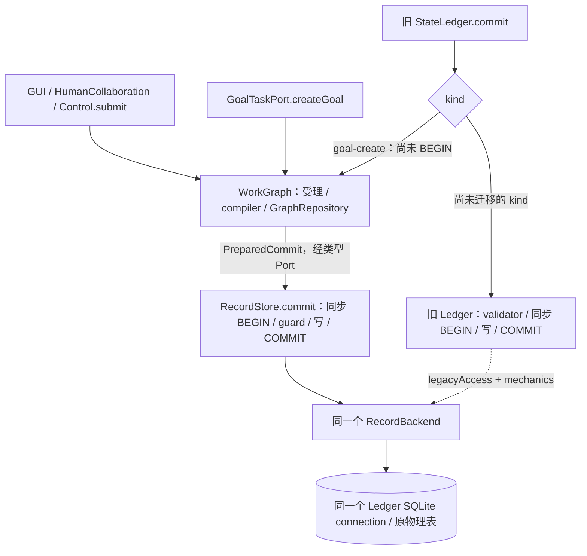

# R3a / R4a 独立验收与事务边界审阅

> 后续状态（2026-09-24）：这些缺陷已修复并通过[新的独立验收](R3a-R4a-sol-dsh-acceptance.md)。下文保留 9 月 23 日失败快照的事实，不代表最新状态。

日期：2026-09-23。状态：**两批实现均已存在，但独立验收未通过，需返修。** 本轮由主 Agent 和三个独立审阅 Agent 核对源码、运行本地测试；没有修改生产实现，没有启动付费模型，没有提交工作树。结论只对应本轮记录的源码指纹，不覆盖后续修改。

本报告同时回应用户引用的“SQLite超时回归调查”。该对话中的嵌套事务、连接归属和额外数据层是调查假设；以下结论来自实际代码和本机运行，不能反过来把假设写成已确认根因。

## 1. 结论与范围

已确认四类实现问题，六个独立失败用例：

| 编号 | 批次 / 级别 | 已复现问题 | 结果 |
| --- | --- | --- | --- |
| F1 | R3a / P2 | 提交时只核对存储记录的 revision，未核对记录身份 / schema | SQLite、Memory 各一个用例失败；损坏 scope 仍创建 Goal |
| F2 | R4a / P1 | 重放旧 Run 身份却恢复 Session 最新 Run | 请求 run-A，返回 run-B |
| F3 | R4a / P1 | 暂停恢复跳过原执行约束核对 | 可以提高原模型调用上限；省略原限制后能读取原禁止路径 |
| F4 | R3a / P2 | 输入复制失败后保留调用方可变引用 | 特定非 JSON 程序化输入可在等待期间改变提交目标 |

另有一项验收证据缺口：真实旧库的读取、投影和重启测试已经存在，但尚缺 R3a 要求的“新 Goal 接口重放真实旧命令、返回原创建结果、随后继续新提交”完整验证。没有证据表明旧库一定不兼容，也不能把该验证写成已完成。

当前结果支持**保留既定模块分工、修复具体实现与恢复协议**。不支持因这些失败新增 DataEngine、替换 SQLite、删除领域隔离，或将目标 DAG 重新拆分。R4b/c 的依赖能力尚未验收；与这些能力无依赖的工作仍可按文件和接口范围并行。

共同依据：[PRODUCT](../../PRODUCT.md)、[目标架构](../ARCHITECTURE.md)、[用户原话](../intent/ORIGINAL-DIALOGUE.md)、[并行补充](../intent/2026-09-23-PARALLEL-AND-PRODUCT.md)、[R3a 精确任务书](../tasks/R3a-goal-record-store.md)、[Runtime §6](../modules/core/agent-runtime.md)。可直接交付 dsh 的修复范围见[返修任务](../tasks/R3a-R4a-acceptance-fixes.md)。

## 2. 已复现缺陷

### F1：最终 guard 没有验证事务内记录的身份与 schema

位置：[SQLite currentRevisionOf](../../../coding-platform/src/core/record-store/sqlite-record-store.ts)、[Memory currentRevisionOf](../../../coding-platform/src/core/record-store/in-memory-record-store.ts)。本次审阅定位分别为 311–325、181–188 行。

独立用例先让真实 Goal 服务读到合法的 Project / Workspace / Goal 快照，再在 read 与 commit 之间暂停。通过共享 backend 的底层测试入口，把 Workspace 正文的 `ref.workspaceId` 改为另一个值，但保持数据库 key 和 revision 不变，然后放行提交。SQLite 使用真实库；Memory 使用同一组正式状态。

预期：Store 返回 `rejected/corrupt`，Goal Port 返回 `rejected/unavailable` 并保留原因；没有新 Goal / 事件。实际：两种 backend 均返回 committed。最后的 CAS 只取 revision，没有验证它对应的记录是否仍为该 key 所声明的合法对象。

这是损坏 / 不一致存储的反例，不声称正常合法 writer 会不增版本改身份。任务书 §7 已要求 guards 碰到未知或不一致 schema 返回 corrupt。实现应在事务内复用既有机械 codec 校验，不增加第二份 Goal 领域规则，也不能把校验前移到事务外替代最终守卫。

测试：[R3a-goal-record-store.test.ts](../../../coding-platform/tests/data/R3a-goal-record-store.test.ts)，`transaction-time stored identity guard` 两项。

### F2：身份幂等命中了旧 Run，却把恢复目标丢失了

位置：[composition-root.ts](../../../coding-platform/vendor/coding-agent/src/app/composition/composition-root.ts)，279–308 行；[resume-composition.ts](../../../coding-platform/vendor/coding-agent/src/app/composition/resume-composition.ts)，175 行选择最新 `turn.started`。

独立用例在同一 Session 顺序完成 A、B 两个 Run，然后以 A 的原 executionIdentity 和原输入再次调用公共运行接口。入口正确找到 A 并核对内容，随后却只携带 sessionId 调用 resume；resume 重新选了最新的 B。实际返回 `run-B`，预期为 `run-A`。

这会把另一次工作的结果当作本次幂等重放结果。应保持请求的 runId / turnId 直到实际投影或恢复完成。完成的旧 Run 重放不得调用模型、追加 Turn 或恢复另一个执行；无需因此扩展平台业务层或复制一套 Session 状态归约器。

测试：[independent-r4a-session-recovery.test.ts](../../../coding-platform/vendor/coding-agent/tests/review/independent-r4a-session-recovery.test.ts)，旧身份重放一项。

### F3：暂停恢复开始执行，却仍沿用了“不继续执行”的检查条件

位置：[recovery-coordinator.ts](../../../coding-platform/vendor/coding-agent/src/core/runtime/recovery/recovery-coordinator.ts)，133–147 行；[resume-composition.ts](../../../coding-platform/vendor/coding-agent/src/app/composition/resume-composition.ts)，110–122、321–324 行。

原 RecoveryCoordinator 的 `willContinue` 排除了 paused，因此不做兼容环境校验。R4a 新入口却会对该 paused 结果调用 `runner.resume`，让它真正继续执行。新沙箱又由调用方本次参数构造。独立反例：

1. 原 Run 的 `maxModelRequests=1`，暂停后以 4 恢复，未拒绝，实际继续到第 2 次模型请求。
2. 原 Run 禁止读取 `private`，暂停后省略 workspaceOptions；恢复后的 read 成功，合成的私有测试文本进入本地模型请求。预期是在执行前拒绝，或沿用原限制并使该 read 失败。

第二项使用临时目录与合成文本，不涉及真实凭据。现有测试直接证明的是 Workspace 限制丢失，不把 ProcessSandbox 所有选项也说成逐项已复现。

Runtime §6 已规定“resume 沿原配置与沙箱、预算重建”。返修需让实际继续执行前的校验覆盖 paused，并保存 / 重建足以约束恢复的原有效配置。只要求调用方再次传入相同参数、或声明暂停 Run 不支持限制恢复，均不能兑现该契约。旧日志缺少新字段时必须明确兼容边界，不能默认为无限制。

同一独立文件另外三项正常边界通过：最新身份重放不重复执行；同约束暂停恢复保持身份 / 用量 / 禁止路径；B 暂停时不能凭 A 的旧历史边界启动 C。由此可知问题集中于旧身份目标选择与改变 / 省略恢复约束，并非所有历史能力都没有实现。

### F4：复制失败不能退回原对象继续异步受理

位置：[task-service.ts](../../../coding-platform/src/core/work-graph/tasks/task-service.ts)，84–89 行 `cloneInput`。

原命令校验允许额外属性。给合法命令附加一个函数属性，即可让 structuredClone 抛错；catch 返回原对象。此后在幂等 lookup 的等待期间改变 aggregateId，实际 readMany 转向了修改后的 Goal，而非调用时的目标。

影响限于这类非 JSON 程序化输入；不是普通 JSON HTTP 请求的反例，也不推导权限绕过。任务书 §5 的输入隔离仍应覆盖该入口：按合法字段形成独立值，或在副作用前明确拒绝不可接受的输入。不能静默继续用原引用。

测试：[R3a-goal-input-isolation.test.ts](../../../coding-platform/tests/data/R3a-goal-input-isolation.test.ts)。

## 3. 当前事务 / connection 所有权

下面是**实际 R3a 迁移形态**，不是新增的目标模块图。虚线表示共享连接 / 物理辅助操作；两条提交分支在进入事务前分开。

| 对象 | 当前真正承担的职责 | 何时可删除 / 收敛 |
| --- | --- | --- |
| WorkGraph Goal service / compiler | 输入、身份、scope、领域 fold，生成明确 guards / writes / events | 后续复用共同规则，不能搬入 Store 形成业务重复 |
| GraphRepository | 三 ref 一致读取、领域解码；核对历史 receipt / event 身份并恢复原 Goal@1 | 是 WG 内部组件，当前不是空转发层；若后续重复再按代码证据合并 |
| GoalRecordTransactionPort | 领域代码所需的窄类型接口 | 编译期边界，不额外创建服务、事务或连接，不算运行时“多一层” |
| RecordStore backend | 唯一共享物理连接 / 状态；Goal 原子提交、schema 机械校验、幂等记录 | 后续接纳更多 PreparedCommit，不新造另一个物理 owner |
| LegacyRecordMechanics / legacyAccess | 未迁 kind 继续使用的物理辅助操作；辅助方法本身不开事务 | 未迁 kind 及消费者迁完后删除；不得暴露给业务 / Agent 作为任意写工具 |
| 旧 StateLedger | 未迁 kind 的旧领域规则与事务调用；Goal 在 BEGIN 前委托 | 按操作逐步退出，不保留第二份 Goal 创建算法 |

可核对位置：[persistent-platform](../../../coding-platform/src/composition/persistent-platform.ts) 546–560 行创建一次 backend，同时注入 Ledger 和 Goal 服务；[sqlite-ledger](../../../coding-platform/src/data/state-ledger/sqlite-ledger.ts) 225–227 行绑定该 connection、269–299 行分流与事务、330–333 行委托关闭；[sqlite-record-store](../../../coding-platform/src/core/record-store/sqlite-record-store.ts) 258–293 行事务包装、521 行附近幂等关闭。

新 Goal 写事务和旧 kind 写事务的 BEGIN 到 COMMIT / ROLLBACK 之间均为同步代码，没有 await 或 Promise 锁。Store 的 `readMany` 自己完成一致读事务后返回，领域 read 与最终 commit 之间依靠版本守卫检查变化。当前窄接口是 `commit(PreparedCommit)`，并不存在对话假设的层层 `transaction(tx => ...)` 调用。

**自己的数据结构与 SQLite 后端已经在实现中。** 平台定义 Goal / 版本 / 事件 / 原子操作，SQLite 提供持久化事务，Memory 提供同语义后端。减少多余层应针对重复解析、空转发和重复所有权的实际证据；本轮未发现需要再加一个数据引擎或改掉该模块边界的依据。

## 4. SQLite 超时调查的事实与限制

主 Agent 首次 scoped 回归运行 91 文件 / 822 项，810 通过、12 项失败，失败集中在 7 个 SQLite 场景文件，表现为超时。随后只降低测试 worker 数：其中 2 文件 / 10 项通过，其余 5 文件 / 35 项通过，原 12 项全部在重跑中通过。没有提高这些测试的 timeout 阈值，也没有改断言或生产实现。

进一步对原失败文件之一 `p1-02.integration.test.ts` 的完整 4 个真实测试临时记录 DatabaseSync.exec 的事务操作，4 项全部通过：

| 观察 | 本次数据 |
| --- | --- |
| BEGIN / COMMIT | 30 / 30 |
| 嵌套 BEGIN / SAVEPOINT / ROLLBACK | 0 / 0 / 0 |
| BEGIN 最长 / 总计 | 0.042 ms / 0.454 ms |
| COMMIT 最长 / 总计 | 8.284 ms / 168.819 ms |
| 测试执行耗时 | 2.572 s |

四个场景含多个组件及关闭重开，共观察到 15 个连接实例，**不是一个 Ledger 被同时偷偷创建了 15 个连接**。记录的是 exec 事务边界，不是完整 SQL / CPU profiler。追踪没有改生产代码，临时测试配置只用于这次观察。

结论：在这些真实路径上，没有观察到假设的嵌套事务或 BEGIN 等锁，降低并发后也未复现原超时。仍未完成改动前 / 后在相同负载下的比较，因此**不能证明性能未回退，也不能把超时全部盖章为环境原因**。后续若稳定复现，应保留相同机器、worker 数、测试集合和重复运行，分别测捕获、SQL、提交和事件循环耗时；不要靠扩大 timeout 取得通过。

## 5. 独立执行结果

全部使用本地 Node 24、仓库现有依赖、真实 SQLite 与本地模型替身。

| 检查 | 本轮实际结果 | 含义 |
| --- | --- | --- |
| 原独立 R3a 套件 | 12 / 12 通过 | 原有事务、重放、竞争、rollback 等路径有效 |
| 扩展后的 R3a 主套件 | 12 通过 / 2 失败 | F1 两后端失败 |
| R3a 输入隔离独立用例 | 1 失败 | F4，特殊程序化输入 |
| R4a 独立套件 | 3 通过 / 3 失败 | F2 一项、F3 两项失败 |
| Kernel 完整 vitest | 44 文件；193 通过 / 3 失败 / 1 跳过 | 失败为本轮独立反例；不是“190 自检通过所以验收通过” |
| 平台 scoped 首跑 | 91 文件；810 通过 / 12 失败 | 保留首跑事实，不能替换为全绿 |
| 上述 7 个失败文件重跑 | 45 / 45 通过 | 低并发重试结果，不等于完整重跑 822 项 |
| 事务追踪 p1-02 | 4 / 4 通过 | 对上述所有权分析的有界动态证据 |
| 真实 HTTP multi-workspace Host | 1 / 1 通过 | Goal 生产组合根确实接通，包括重启 |
| 平台类型、模块边界、完整构建 | 通过；边界 issues=[] | 包括 Kernel / 平台 / UI 构建，不证明行为已正确 |
| Kernel 类型、架构检查 | 通过；67 source files | 公共扩展能编译，行为仍需修复 |

本轮没有复跑平台全部 413 文件，因此不把 dsh 自报的全量数字写成主 Agent 实测。Kernel lint 的“5 个既有错误”也仅为 dsh 报告内容，本轮不以它作为独立验收证据。

## 6. 对 dsh 实现报告的核对

Goal 真实链已贯通，生产组合根没有使用会抛错的测试 double。原 Control 的 Goal 领域 body、旧 Ledger 的 Goal 规则和重复 bootstrap validator 已退出；`legacyAccess` 的保留符合本次只迁一个 kind 的范围，不自动等于重复事务。

环境失败报告需要更正：“14 项”与“11 + 2 + 2”的分类统计不能对应。两个外部目录 ENOENT 已独立复现且在 Host 初始化前失败，属于既存测试材料缺失。HOME 默认目录逻辑确实未被本批修改，但没有原 11 项的名称和栈，不能确认全部归因；报告所说两个 locale 失败也缺少明细。本轮定点跑了一个疑似 locale 路径并通过，不能据此确定原失败来自哪里。详细核对见[环境与装配报告](evidence/r3a-r4a-2026-09-23/environment-and-composition.md)。

代码精简需分范围陈述。R3a 新增的 13 个生产文件确为 4083 物理行；旧 Goal 路径删除了重复规则，但本批没有证明全项目总代码量减少，也没有证明端到端更快。GraphRepository / Port 的存在本身不构成性能问题；剩余迁移应继续核对重复校验、完整扫描、旧接口退出和实际净代码量。

## 7. 证据、未完成项与交接

证据目录：[r3a-r4a-2026-09-23](evidence/r3a-r4a-2026-09-23/README.md)。保存测试结果、失败栈、事务追踪、审阅源码指纹和冻结测试 hash；原先独立 12 项草稿与当前测试分开记录。主 Agent 不把实现方自行写的 selfcheck 当作独立验收。

真实旧库相关已有测试是 [historical-ledger-compatibility](../../../coding-platform/tests/integration/historical-ledger-compatibility.test.ts) 与 [historical-host-compatibility](../../../coding-platform/tests/integration/historical-host-compatibility.test.ts)。返修需补齐 R3a §8.7 的新 WG 原结果重放与后续提交序列，不得修改原证据库；只在临时副本上操作。

下一步为[两个可并行的返修范围](../tasks/R3a-R4a-acceptance-fixes.md)：R3a Store / WG 与 R4a Kernel；两者不相互等待，不改共享输出、不覆盖原 WIP，集成检查由 Lead 协调。此次仅交付验收和返修任务，尚未启动新的 dsh 实现。R2e.1 的独立验收、平台 Session 接线、范围并行与 UI 仍按各自批次推进，不能从本报告推导为已交付。
