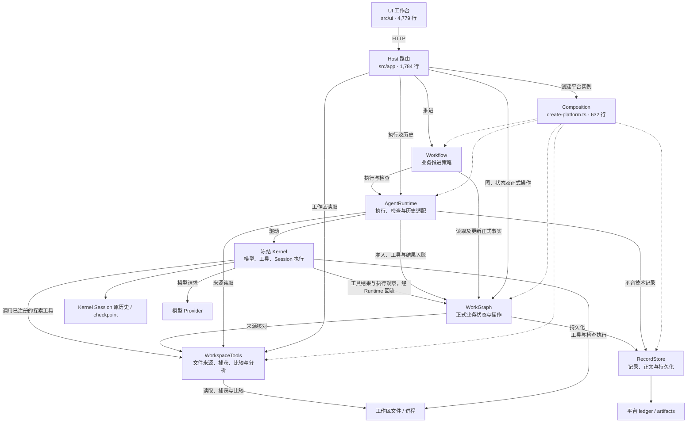
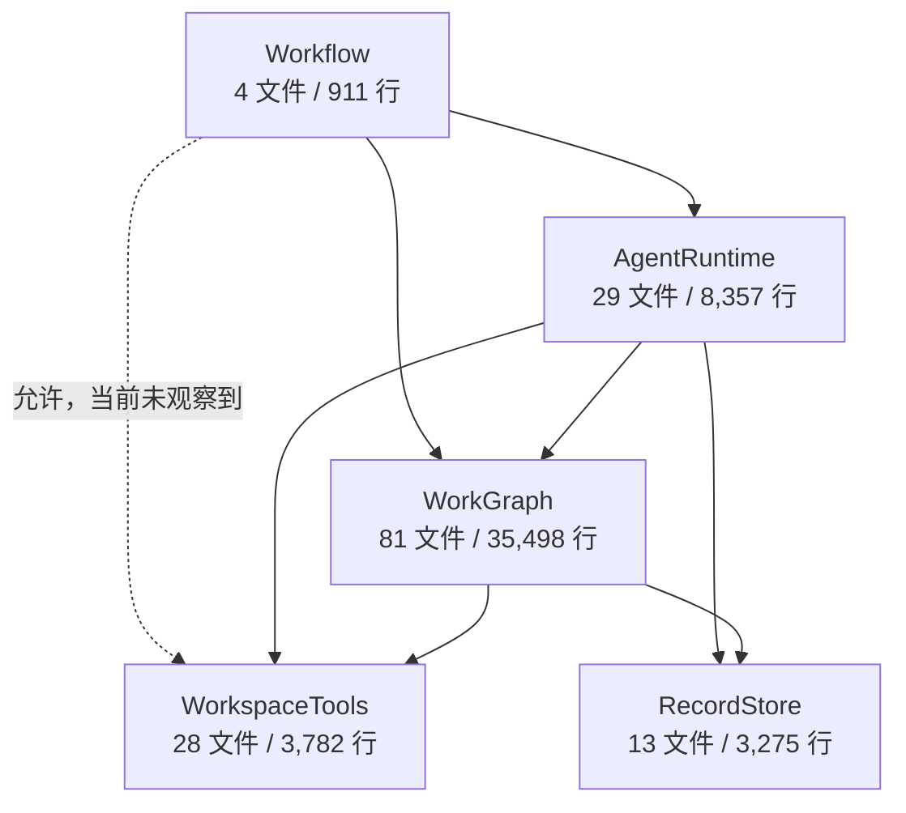
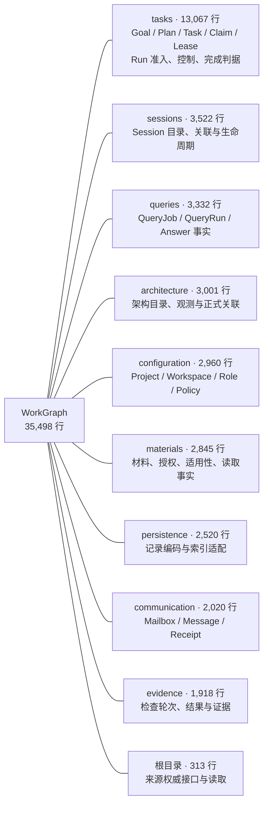

# 当前模块关系与代码规模

**后续AG1接线：** AgentRuntime已增加当前关联Session发现/卡片读取并消费原邮箱，沿原AgentRuntime→WorkGraph依赖，未新增模块或owner。真实模型已完成发现→选择→发送咨询；职责与后续顺序见[Agent行为计划](../AGENT-BEHAVIOR-PLAN.md)。本页原行数是AG1前快照，后续生产TS+307见[增量证据](evidence/agent-behavior-2026-09-27/ag1/verification.json)。

后续逐文件增量与逻辑见[新增代码清单](new-code-and-logic-2026-09-27.md)：覆盖B1到当前工作树的108个变化生产文件及58个变化测试文件。下文保留原提交快照的规模与关系，不用该旧快照替代新清单。

日期：2026-09-27。源码快照：`d0dc9d6cf4b914159a67578dd1de7265fa9bad9d`，独立仓库根即原 `coding-platform/next/`。本次只核对关系和规模，不施工、不扩展产品范围，也不代替 MVP completion audit。

**此前做过规模审查，且生产源码的大幅增长属实。当前 `src/**/*.ts` 为 225 文件、63,625 物理行，WorkGraph 占 55.8%。五模块边界检查通过，但这不能证明模块内部没有职责膨胀或重复实现。**

## 1. 从界面到执行：当前装配关系

下图是调用与装配概览，不是静态 import DAG。实线表示消费能力或访问数据，虚线表示装配。Host 可以直接调用正式查询/操作入口，并非所有操作都经过 Workflow。图中未逐条展开所有注入参数。



- WorkGraph 管 Session 的平台关联和状态；Kernel 保存原始 Session 历史。两者职责不同，不能仅因存在两种持久化就认定重复事实源。
- Query 的业务记录在 WorkGraph，实际模型执行经 AgentRuntime/Kernel；不是另一套独立模型循环。
- Evidence 收集/记录检查事实；注册检查的进程执行由 AgentRuntime/Kernel 承担。Evidence 不应再拥有一套材料、架构或策略管理器。
- WorkspaceTools 提供文件来源与分析能力；不能把它理解成全部文件编辑和进程执行的唯一入口。

### 阅读此图时的重要纠正

用户复核指出：原子能力应供 Agent 调用，工具结果/执行观察再维护图。上一版概览遗漏了 Kernel 调用扩展工具和结果回流的箭头，容易误读成平台在 Agent 之外独立读文件并推导业务图；上图已补出这两条概括关系，并不表示 WorkGraph 源码反向依赖 Kernel。

当前代码并非完全独立于 Kernel 重写文件读取：`observed-model-run.ts` 保留 Kernel 内置 `read`，并通过 `additionalTools` 注册探索工具；`workspace/access.ts` 的普通读取复用 Kernel 的 `WorkspaceSandbox.read`。但 Host 确有 `files/read`、`source/capture`、`source/query` 直接入口，捕获/查询还带有自己的 registry 与限制。这些入口的存在是实现事实，不自动证明都符合产品边界。

需要区分“用户在 UI 打开文件”“Agent 在 Kernel 内调用工具”“正式状态提交所需确定性来源核对”，不能把所有读取都画成独立业务执行引擎。后续审查应核对每个读取入口的实际消费者，以及是否在 Agent 工具结果之外重复分析或推导图；本次尚未证明这些直接入口均必要，也未证明所有工具观察均已完整回流。图维护应消费可追溯工具结果/结构化操作和确定性事实，不能仅凭 Agent 自述自动认定状态改变。

## 2. 五模块的实际静态依赖

本次用仓库的 [check-boundaries.mjs](../../../scripts/check-boundaries.mjs) 检查：**7 条已观察依赖，8 条允许依赖，检查通过**。该检查包含类型引用；实线不等同于每次运行都会发生的函数调用。虚线只表示设计允许但本次未观察到的边，不能当成交付能力。



`contracts/` 是共享契约，`composition/` 是装配层，`app/` 与 `ui/` 是外层消费者；它们不计为新增核心模块，但全部计入生产 TS 规模。当前 Workflow 注入 WorkGraph 与 Runtime 等正式端口，没有直接注入 WorkspaceTools。

这项检查说明没有观察到越过既定五模块边界的静态反向依赖，**不检查同模块内部重复逻辑、功能必要性或消费者是否完整交付**。

## 3. WorkGraph 内部到底装了什么

下图是目录包含关系，连线只表示“包含”，不是调用依赖，也不是新增十个架构模块。将这部分展开，是因为只看五个大框会掩盖 35,498 行内部的职责密度。



真实存储由 RecordStore 提供；图中 persistence 是领域记录适配。Task 节点存在、取得执行权、Run 结束、检查通过、Task/Goal 完成是不同事实，不能为了减行数直接合并这些语义。

## 4. 前后规模：哪些增长是真的

口径：`src/**/*.ts` 的物理行，含空行和注释；不是去注释逻辑 SLOC。排除 vendor、dist、依赖、文档、证据、脚本与测试。历史路径映射后沿用同一口径。

| 目录 | 9 月 25 日 B1/W1 | 9 月 26 日快照 | 当前 | 较 9 月 26 日 |
| --- | ---: | ---: | ---: | ---: |
| core/work-graph | 16,975 | 35,054 | 35,498 | +444 |
| core/agent-runtime | 3,254 | 7,667 | 8,357 | +690 |
| core/workspace | 2,889 | 3,782 | 3,782 | 0 |
| core/record-store | 3,275 | 3,275 | 3,275 | 0 |
| business/workflow | 36 | 911 | 911 | 0 |
| contracts | 3,810 | 4,607 | 4,607 | 0 |
| composition | 225 | 631 | 632 | +1 |
| app | 0 | 1,200 | 1,784 | +584 |
| ui | 0 | 3,485 | 4,779 | +1,294 |
| **合计** | **30,464** | **60,612** | **63,625** | **+3,013（5.0%）** |

相对 B1/W1，当前净增 **33,161 行（108.9%）**。早先增长主要集中于 WorkGraph；最近这个快照区间主要是 UI、Runtime 和 Host。当前测试 TS 另为 **134 文件 / 39,193 行**，不能混入生产体积。

已有两份审查：

1. [9 月 24 日规模与复杂度审查](code-size-and-complexity-2026-09-24-final.md)：旧工程加 Kernel 的口径，生产 120,817 行。**不能直接与当前独立 next 相减，宣称重构减少了多少代码。**
2. [9 月 26 日新增代码统计](evidence/next-b2-2026-09-26/new-code-inventory-20260926.md)：恢复 B1/W1 原文件并按哈希核对，已确认 30,464 → 60,612 行的增长。上表采用这份可比基线。

另外，当前提交 `d0dc9d6` 的 Git 摘要是 12,030 行新增，但其中 **11,422 行是 docs 新增**；`src` 为 +55/-6，即净增 **49 行**。其余新增为 tools 455、tests 84 及三个入口 Markdown 14 行。提交总行数会受验收记录显著影响，不能把最近这次提交理解成又新增一万多行平台实现；这也不否认此前生产源码翻倍的事实。

## 5. 是否存在过度扩展的嫌疑

**有值得审查的信号，但本次不足以认定哪些代码应删除。** 未观察到第六个核心模块；更明显的问题是 WorkGraph 内部集中承载了大量职责，以及多条执行路径可能重复实现同类机制。

| 优先检查位置 | 当前信号 | 下一次有界审查应回答的问题 |
| --- | --- | --- |
| WorkGraph/tasks | 13,067 行；plan-service 2,129 行、execution-entry-service 1,650 行 | 是否把未来任务的语义合理性做成了过强准入？每种状态/校验是否对应公开生命周期可达场景？ |
| Work 与 Query 的执行服务 | query-execution 1,474 行，另有 Work 执行准入 | 请求身份、幂等回执、状态推进是否重复？差异是否来自真实产品语义，而非复制一套通用平台？ |
| Session / mailbox / material grant | session-directory 1,474 行、mailbox-service 1,433 行、grant-service 968 行 | 是否反复验证不会合法变化的绑定？当前授权与已发生事实是否仍清楚分开？ |
| Plan 写入与读取 | plan-service 2,129 行、plan-readers 1,324 行 | 归一化、索引解释与状态推导是否被分别维护，形成重复事实解释？ |
| UI | main.ts 3,370 行、views.ts 1,409 行 | 是否仍有重复渲染和状态转换？大文件本身不证明新产品能力过多。 |

上述是审查问题，**不是已确认缺陷清单**。例如材料撤权是合法动态状态，当前动作准入不能简单删掉；运行中 Role 热切换不在既定生命周期内，不应为直接篡改持久数据的反例扩展正常路径。恢复、Reviewer、协调等是否必需仍依据既定 MVP 行为，不能凭体积自动移出范围。

本次没有逐函数重复检测、删除建议或复杂度降低结论。合适的下一步是按“既定用户行为 → 正式入口 → 唯一事实 owner → 必要状态/校验”逐项核对这些集中点，先证明冗余再删，不以行数指标驱动重构。

## 6. 源码依据与复核方式

- [平台装配](../../../src/composition/create-platform.ts)：五模块、Kernel、检查与历史适配的实际接线。
- [Host 路由](../../../src/app/core-routes.ts)、[Workflow 依赖端口](../../../src/business/workflow/ports.ts)、[检查执行](../../../src/core/agent-runtime/check-execution.ts)。
- [目标模块 DAG](../module-dag.md)、[当前能力索引](../IMPLEMENTED-CAPABILITIES.md)。目标图与本页源码快照应区分使用。

复核规模可在仓库根执行以下只读脚本；它不会启动模型或测试：

```python
from pathlib import Path
from collections import defaultdict

groups = defaultdict(lambda: [0, 0])
for path in sorted(Path('src').rglob('*.ts')):
    parts = path.parts
    key = '/'.join(parts[:3] if parts[1] in ('core', 'business') else parts[:2])
    groups[key][0] += 1
    groups[key][1] += len(path.read_text().splitlines())
for key, value in sorted(groups.items()):
    print(key, *value)
print('TOTAL', *(sum(v[i] for v in groups.values()) for i in (0, 1)))
```

静态边界复核使用本仓库 Node 24 执行 `node scripts/check-boundaries.mjs`。本次仅运行此项源码边界检查与只读统计；没有扩大测试范围。
