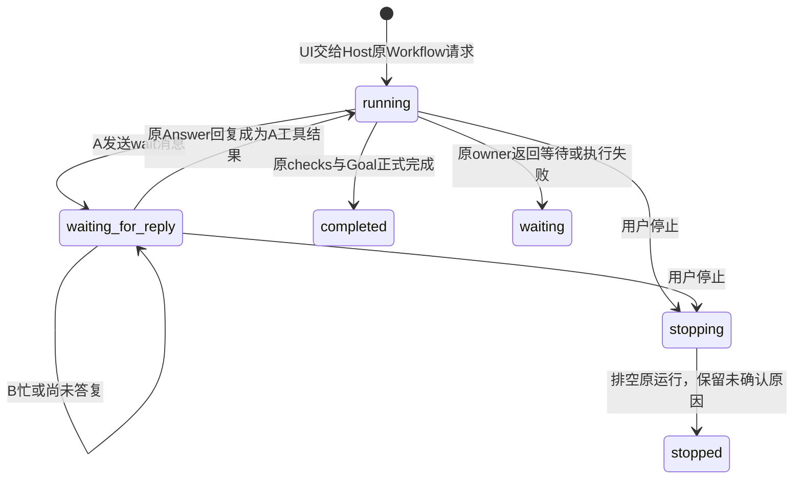

# AG2b：原 Run 持续通信、UI 与真实工程验收

2026-09-28。本批在当前未提交 AG1/AG6/AG2a 工作树上增量施工，沿两阶段 DSH 骨架/中审/实现/独审导入。没有提交、推送或修改三个候选真实工作区。契约与状态图见 [任务书](../../../../tasks/AG2b-continuous-communication-2026-09-28.md)，MVP 剩余范围见 [行为计划 §8](../../../../AGENT-BEHAVIOR-PLAN.md#8-到达-mvp-的路线与证据导航)。

## 本批结论

存活 Host 内：A 原 Work Run → 图发现 B → 显式 wait 消息 → B 原 Session 的 Query/Answer → 回复进入 A 原工具结果 → A 继续判断，可再次咨询 → 实际编辑 → 正式 checks/Task/Goal。实际跑通两轮，不是预先伪造答案或人工替 A 执行工具。浏览器刷新只重新读取句柄，不承担推进。



`waiting_for_reply` 是活动状态；`waiting` 是当前推进循环已经让出的状态。普通通知不自动启动咨询。每次等待最多300秒，并受原 Run 预算/deadline及正式控制约束。`stopped` 表示本 driver 排空停止，不替代原 Run 的取消确认。没有新 Task 状态库、中心 Supervisor 或通用心跳调度器。

本批**不包含** Host 崩溃后自动恢复等待工具/推进句柄，也不包含已 ended/paused Run 自动续跑。持久消息、Answer、原历史可重开读回，与恢复执行分开。整体 MVP、AG3 派发选择、返工/Reviewer、并行、治理和完整恢复/统一 UI 余项继续保留。

## 必要工程检查

- 11 个相关文件共105项通过。首次103项通过，另2项是 C1 内存/SQLite 两个变体的旧索引列表断言；同步既有断言后，仅重跑该文件50项，全部通过，没有继续扩局部矩阵。见 [初次日志](tests.log)、[定点复验](mailbox-regression.log)、[汇总](checks-summary.json)。
- 新增3个受控场景：两轮真实 owner 往返与工程完成；B busy 时等待及正式停止；数据库重开读原结果/原请求重放不增模型与跨 scope 拒绝。受控 provider 不冒充真实模型。
- Node 类型、UI 类型、模块边界、构建通过：[类型](types.log)、[UI 类型](ui-types.log)、[边界](boundaries.log)、[构建](build.log)。仓库使用 Node24.21.0 和本仓库依赖。
- Stage1 前置条件曾错误：无 usage 的受控模型预算预留不足、检查写文件改变被检查来源、把目录首项误当 B。由主审显式修正 fixture，生产条件未放宽，记录在 [修正1](stage1-fixture-amendment.json)、[修正2](stage1-fixture-amendment-2.json)和[中审](stage1-review.md)。DSH 对冻结测试没有写权限，scope audit 中这两个测试路径的差异有明确来源。

## 真实 DeepSeek 与工程结果

原始结构化证据：[live.json](live.json)；最终测试退出0、1项通过：[live.log](live.log)。独立审阅同时核对实际后续 provider 请求中的工具结果，非只数邮箱记录。

| 项目 | 实测 |
| --- | --- |
| 模型 | deepseek-flash，thinking disabled |
| 模型请求 | 13次：A Work 8次，B 两次咨询共5次 |
| 通信 | 两个独立 wait 消息，两次正式 Answer；同一原 A Run、同一原 B Session |
| A消费证据 | 两条回复分别出现在后续4次和3次 A请求中（历史累积，不是重复回复） |
| 工程变更 | `src/retry.mjs` 一次真实 edit，Kernel 报 confirmed；原检查与contract保持不变 |
| 工程检查 | 修改前2项失败，修改后2项通过；Work与gate两个正式 VerificationRound 均 finalized/PASS，sourceStatus=matched |
| 完成 | Task work/gate satisfied，正式 Goal COMPLETED |
| 成功轮错误 | transport/provider/tool错误均0 |
| 浏览器读后 | 仍13次模型请求，无新增调用 |

样本是临时隔离的 retry-library 小工程，不是已有十万行项目。模型需要修复1-based attempt、仅在剩余重试间sleep、成功返回和最终原Error传播。完整产物、约束与两项测试见 [sample-project](sample-project)。正式 sandbox 注册命令为 `/usr/bin/node --test checks/retry.test.mjs`，该已挂载解释器实际是 **Node18.19.1**；仓库、验收控制进程及外层前后检查用 **Node24.21.0**。没有为验收放宽 sandbox mounts。

两次回复进入 A 上下文并发生后续行为，不证明模型一定正确采纳全部建议。B 的回答仍有语义过强之处，例如对象恒等性不能证明对象未被修改，`node:assert/strict` 的 `equal` 也不是松相等。本批机制与工程产物通过，不据此宣称普遍语义可靠，也不继续为本批开展提示词评测循环。

## 浏览器验证

[操作记录](browser.json)：实际选择原 builder Session、填写已有 Goal 后“继续执行”立即可用；点击启动后刷新整页，填写相同 Goal并“刷新执行状态”，读取同一个 `flow-mukvbmd7`，状态为 waiting_for_reply。随后页面自动显示 completed、正式 complete_goal 回执、两条 responded消息。展开第二条回复正文与来源，查看正式 Task 图及 A 原历史，按需展开 position10 的真实保存记录。两个原成员回到待命；浏览器 warning/error记录为空。

修复了两处本批 UI 接线问题：旧 Goal 的待续请求不能在新 Goal 下误发；空页面输入已有 Goal 时能启用原读取/继续入口且保留输入焦点。证据分别见 [Goal归属导入](stage2-ui-guard-import.json)、[刷新入口导入](stage2-ui-restore-import.json)。完整示例 UI 其它交互不因本批通过而自动完成。停止路径通过受控真实 owner 场景验证，本次真实模型成功轮没有中途点击停止。

## 保留的失败与环境处理

- [首次](live-attempt-1.json)：4次请求，第4次 provider_request_failed，未发送 wait 消息；当时未采集底层网络原因，不强称已确认连接超时。
- [第二次](live-attempt-2.json)：3次请求，明确 `UND_ERR_CONNECT_TIMEOUT`，工具错误0；没有伪装完成或重开原失败 Run。
- [第三次启动](live-attempt-3-bootstrap.json)：0次模型请求，`NODE_OPTIONS=--use-env-proxy` 被本机旧Node继承而不识别，种子前中止。
- 最终进程使用已有本机代理 `HTTPS_PROXY=http://127.0.0.1:7890`、`NO_PROXY=127.0.0.1,localhost,::1`、`NODE_USE_ENV_PROXY=1`；未改系统网络、Kernel/provider生产实现或服务端认证。无需凭据的连通检查返回401（服务可达）后启动最终轮。
- 先前失败记录原样保留；最终零错误只描述成功轮。验收后释放保留句柄，Host正常关闭、测试退出0，无遗留模型任务。

## 代码增量与复现

相对本批开始的 dirty baseline，生产 TypeScript 净 **+1,451行**，两个新测试/fixture合计 **962行**；不是相对较早 Git HEAD 的全部增长，也不是减行。主要增加：Host driver637、UI369、mailbox172、communication tools91；其余为契约/控制/路由/装配。现有 C1 断言另有2行增量；文档与本目录真实验收脚本不计入上述生产/单元测试统计。精确文件哈希及前后行数见 [source-after.json](source-after.json)，差异见 [production.diff](production.diff)，导入见 [stage2-import.json](stage2-import.json)。

复现先构建，在仓库根使用Node24运行以下命令。密钥路径由本机自行指定，文件内容只进入正式provider认证，不输出或保存；不需要提交真实数据库。

```sh
node --run build
AG2B_LIVE=1 DEEPSEEK_API_KEY_FILE=/absolute/private/key.txt \
  node node_modules/vitest/vitest.mjs run \
  --config docs/refactor/reviews/evidence/agent-behavior-2026-09-28/ag2b/live-vitest.config.mjs \
  --configLoader=native
```

[脚本](live-harness.ts)走正式HTTP种子、真实provider、原工具/Workflow/checks；直接运行默认自动 start。要重现本次浏览器手动开始，另设 `AG2B_MANUAL_START=1 AG2B_KEEP_HOST=1`，从 `live-host.json` 读取临时地址，选原 builder并输入 `ag2b-goal` 后继续。`KEEP_HOST`只供完成后检查；验收结束向测试worker发送SIGINT即可解除保留并正常关闭。再次运行会生成新的临时项目并覆写本目录 live证据，留证时可设 `AG2B_EVIDENCE_DIR` 指向另一个目录。
