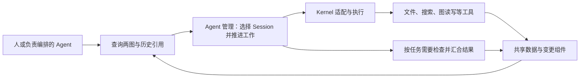

# 现有模块存在理由与合并可行性审阅

> 历史评审说明：本文保留对旧方案的评审结论，架构、DAG 和模块引用固定到 [2026-09-23 迁移前快照](/home/hyh001/projects/coding-platform/docs/refactor/archive/2026-09-23-before-core-design/README.md)；当前方案见 [架构入口](/home/hyh001/projects/coding-platform/docs/refactor/ARCHITECTURE.md)。

审阅日期：2026-09-23。依据：本轮用户提出的“图数据＋原子工具＋Agent 编排”方案、PRODUCT、最新人类意见、目标模块文档及当前源码。本文是设计审阅与建议，不是已采纳的新架构；本次没有修改架构、模块契约、DAG 或实现。

## 1. 结论

**需要重新收敛职责和调用关系；现有证据不足以要求保留全部 13 个顶层 Module。** 每项能力有用途，不等于每项能力都需要独立模块。可以让图负责组织正式结构、关联、来源与检索入口，让工具负责读取与修改，让 Agent 管理负责选择工作和 Session、推进执行。

当前[源码归属表](/home/hyh001/projects/coding-platform/coding-platform/scripts/module-map.mjs:3)实际有 12 个 Module；[目标架构](/home/hyh001/projects/coding-platform/docs/refactor/archive/2026-09-23-before-core-design/ARCHITECTURE.md:152)增加 AgentLifecycle 成为 13 个。AgentLifecycle 的完整决策与连续复用行为尚未实现，不能以“已有大模块不能动”为理由保留其独立地位。这些是进程内代码边界，并不是 13 个独立服务。

本轮应分开判断：

1. **必须保留的产品行为**：能找到真实材料、延续合适 Session、可靠执行、保留历史、处理并发修改、确认任务的完成条件。
2. **值得保留的内部边界**：平台和 Kernel 的适配、外部文件读取、共同写入规则、持久事务、检查结果汇合。
3. **尚未证明必要的顶层 Module 切分**：每类编译、检查、查询、存储都成为单独 Module，并要求普通工作依次经过这些模块。

这次用户重新询问各模块的必要性，因此重新评估边界；此前接受的“13 模块、38 条边”不作为本轮结论的预设。也不预先规定必须缩成几个模块。

## 2. 各模块的存在理由与处置建议

下表中的“保留”指保留行为或内部边界，不代表保留原类名、全部方法和所有历史机制。消费者存在只能证明迁移时有工作要做，不能单独证明模块划分合理。

| 模块 | 真实用途与消费者证据 | 能否进入图、工具或内部组件；建议 |
| --- | --- | --- |
| **AgentLifecycle** | 根据任务、模块、Session 关联选择延续、新建、压缩、重组或归档。产品要求[默认延续](/home/hyh001/projects/coding-platform/docs/history/before-2026-09-22/PRODUCT.md:459)，用户要求[按两图判断相关工作复用](/home/hyh001/projects/coding-platform/docs/history/before-2026-09-22/agent-platform-user-replies-numbered.md:88)。这是目标设计的新增能力，当前无完整实现。 | **保留能力，与 Dispatch 和 Agent 输入准备共同形成 Agent 管理职责。** 生命周期决策可以是其中的策略组件，不必另立只输出决定、不能推进执行的顶层模块。Kernel 仍执行模型循环、压缩与恢复。 |
| **DispatchEngine** | 将已接受的执行意图变为真实运行，处理准入、重试、并发、结果回收和恢复。源码[先受理再启动](/home/hyh001/projects/coding-platform/coding-platform/src/control/dispatch-engine/dispatch-engine.ts:201)，[真实宿主](/home/hyh001/projects/coding-platform/coding-platform/src/app/service.ts:234)使用它。 | **适合并入 Agent 管理，作为执行驱动。** 图能给出可做的任务，却不会自动完成启动、取消、结果回收和崩溃后的核对。可以合并边界，不能只删掉驱动。旧的重复组装策略不必随之保留。 |
| **WorkerRuntime** | 将模型、工具、权限、预算、工作目录、Session 和控制请求转换为 Kernel 调用，并返回事件与结果。[observed-model-run](/home/hyh001/projects/coding-platform/coding-platform/src/execution/worker-runtime/observed-model-run.ts:63)实际调用已有内核。 | **最值得保留的窄适配边界。** 可属于同一 Agent 管理子系统，但要隔离 Kernel 的具体接口，避免 Session 选择和调度依赖内核细节。不重建模型循环、Session 日志或恢复框架。 |
| **ContextCompiler** | 一部分准备 Agent 的有界输入，另一部分执行普通程序的数据读取。现有[六类消费者](/home/hyh001/projects/coding-platform/docs/refactor/archive/2026-09-23-before-core-design/modules/data/context-compiler.md:125)。[SourceGraphContextCompiler](/home/hyh001/projects/coding-platform/coding-platform/src/data/context-compiler/source-graph-context.ts:17)实际做 Run／Plan／Workspace 版本绑定、来源捕获和正文保存，不是在编译模型上下文。 | **当前混合边界应拆开，独立大模块的理由不充分。** Agent 输入准备进入 Agent 管理；图来源绑定进入图读取工具；报告、引用和状态读取进入共同数据访问；验证材料读取成为验证的数据适配。不让确定性查询为读一段材料绕经 Lifecycle。 |
| **WorkspaceReader** | 读取文件与源码、捕获版本、搜索符号和关系，并处理路径与读取期间变化。Runtime 工具实际使用[ProjectSourceIndex](/home/hyh001/projects/coding-platform/coding-platform/src/execution/worker-runtime/exploration-tools.ts:71)。 | **保留文件／Git／解析器适配，可作为事实工具组件。** 不必顶层独立。保留来源版本、路径边界、过期与不支持的表达；复用 Kernel 执行边界。整树捕获或分页重复扫描是待改实现成本，不是模块独立理由。 |
| **ReadModelIndex** | 提供目标、任务图、工作卡片、通信等查询视图；[Human 直接查询](/home/hyh001/projects/coding-platform/coding-platform/src/interaction/human-collaboration/human-collaboration.ts:77)，Context 读取[完成工作视图](/home/hyh001/projects/coding-platform/coding-platform/src/data/context-compiler/completed-work-context-compiler.ts:64)。现有实现处理增量、去重、游标与更新回滚。 | **适合进入图／状态查询内部组件。** 不要求永久保持独立投影系统；可按需使用直接表查询和数据库索引。保留高效查询、来源版本，以及“索引尚未更新”和“对象不存在”的区别。查询不能自行改写完成结论。 |
| **StateLedger** | 保存正式状态、事件与重试结果；Control 使用它提交变化。SQLite 实际在[同一提交中](/home/hyh001/projects/coding-platform/coding-platform/src/data/state-ledger/sqlite-ledger.ts:1073)核对版本、唯一身份、幂等并保存事件和快照。 | **事务持久化必要，独立顶层模块可合并。** 可成为图和工作记录背后的事务存储。也可以更换现有事件／快照实现，但须迁完消费者，保留原子性、版本冲突和重试语义；不要求仅为合并名称迁移数据库。 |
| **ArtifactVault** | 保存报告、图正文、材料等内容，按摘要去重、核对来源和读取适用性；[put／open 实现](/home/hyh001/projects/coding-platform/coding-platform/src/data/artifact-vault/artifact-vault.ts:79)，[验证报告消费者](/home/hyh001/projects/coding-platform/coding-platform/src/control/verification-engine/verification-reports.ts:14)。 | **可以成为共同数据访问里的正文存储组件。** 保留精确引用、来源、内容完整性和写入失败语义。不要求复制 Kernel 已有的全部 Session 日志，也不据此扩建一套逐材料授权系统。结构化状态与大正文可以共属一个模块，仍使用适合各自的存储。 |
| **ControlEngine** | 共享的正式变更规则：权限、状态转换、版本冲突、重试和并发占用。代码会[拒绝冲突 Writer](/home/hyh001/projects/coding-platform/coding-platform/src/control/control-engine/workspace-lease.ts:214)，并[按验证证据提交任务状态](/home/hyh001/projects/coding-platform/coding-platform/src/control/control-engine/task-reducer.ts:143)。派发、验证、计划与架构变更使用这些规则。 | **共同写入规则必要，当前巨大门面不必照留。** 可放在图／任务原子写工具背后的共享变更组件中。业务规则回答“能否这样改”，存储事务保证“检查和修改一起生效”；两者可以同属一个子系统，不需要每个工具复制一遍。 |
| **PlanCompiler** | 将规划回答、人工输入、失败问题转成任务／计划候选，检查来源、当前性和未解决事项。[初始规划实现](/home/hyh001/projects/coding-platform/coding-platform/src/control/plan-compiler/initial-plan-compiler.ts:61)规范化后申请生效；[真实入口](/home/hyh001/projects/coding-platform/coding-platform/src/app/service.ts:316)使用它。 | **可成为规划工作流和任务图编辑工具的内部能力。** 不必另立“编译器模块”。保留候选与已生效版本、变更影响和必要确认；让原子工具接收结构化变更不意味着任何模型回答都直接变成正式计划。 |
| **ArchitectureReconciler** | 比较实际源码关系与采用的架构要求，记录差异和未知项。[机械差分](/home/hyh001/projects/coding-platform/coding-platform/src/control/architecture-reconciler/architecture-reconciler.ts:47)有实现，[架构审阅](/home/hyh001/projects/coding-platform/coding-platform/src/interaction/human-collaboration/architecture-review.ts:96)有真实报告消费路径；不能称整个模块没有消费者。 | **很适合变成架构图的 compare／inspect 工具。** 保留实际结构与目标约定的区别，以及差异来源；结果经共同写入组件保存。图的普通更新不必经过完整架构审查。报告路径存在也不等于所有机械检查入口已完整落地。 |
| **VerificationEngine** | 单项检查之外，还确认必要检查是否齐全、是否对应同一版本、失败与缺项如何汇合、必要独立审阅是否完成以及中断后如何继续。[轮次汇合](/home/hyh001/projects/coding-platform/coding-platform/src/control/verification-engine/verification-rounds.ts:390)不会把缺项自动算 PASS；[真实宿主](/home/hyh001/projects/coding-platform/coding-platform/src/app/service.ts:253)使用 VerificationService。 | **工具化单项检查，保留任务完成工作流中的汇合组件。** 可以内部化，无需独立“验证引擎”门面，也无需每次图查询都运行验证。若只保存几个工具 PASS，会遗漏未执行的必要检查或混用不同版本结果。 |
| **HumanCollaboration** | 将人的目标、确认、修改与控制变成明确请求，展示受理、执行、失败与冲突。[createGoal](/home/hyh001/projects/coding-platform/coding-platform/src/interaction/human-collaboration/human-collaboration.ts:48)绑定请求身份；[架构确认](/home/hyh001/projects/coding-platform/coding-platform/src/interaction/human-collaboration/architecture-review.ts:138)绑定审阅版本。 | **保留薄的人工交互应用层，可并入 Host／应用服务。** 查询转发不充分证明独立 Module 的必要性。UI 展示和收集选择；编排、图算法与共享写入规则不搬进 UI。 |

因此，目前对保留“全部原模块边界”的支持偏弱，对保留“执行适配、共同变更规则、持久化、来源读取、检查汇合等内部能力”的支持明确。

## 3. 对“维护好图就差不多”的具体补全

用户的方向与[PRODUCT 的索引加数据、靠工具使用](/home/hyh001/projects/coding-platform/docs/history/before-2026-09-22/PRODUCT.md:350)一致。需要补全的是数据含义与操作行为，不是再加一批模块。

| 用户提出的部分 | 建议表达 |
| --- | --- |
| 当前与历史 Agent、Session | 作为有身份和时间／版本的工作记录与关联。当前状态和历史可以共用对象标识，不必建两套互不相连的 Agent 树。不强制把 Agent 建成永久员工实体。Session 正文优先沿用 Kernel 存储，平台保存必要映射与引用。 |
| 当前文件与历史文件 | 当前工作区＋Git 提交历史＋必要的未提交补丁／内容快照。Git tree 不自动保存尚未提交的变化，Session 时间线也不属于 Git 自动记录的范围。[产品依据](/home/hyh001/projects/coding-platform/docs/history/before-2026-09-22/PRODUCT.md:359) |
| 文件夹树、AST 关系 | 文件夹树负责路径；AST／语言服务提供受支持代码的结构关系；文档和配置使用对应格式解析或文本检索。关系绑定内容版本并说明覆盖能力。AST 不能自动确定产品模块的职责划分。[现有 AST 工具的能力限制](/home/hyh001/projects/coding-platform/coding-platform/src/execution/worker-runtime/exploration-tools.ts:150) |
| 架构树 | 展示当下采用的内容与职责结构，同时保留历史；区分“约定应该怎样”与“源码实际怎样”。两者差异可以由工具输出。模块依赖及文件／Agent／Session 关联需要跨树边。[产品依据](/home/hyh001/projects/coding-platform/docs/history/before-2026-09-22/PRODUCT.md:373) |
| 任务树 | 包含未来任务、当前状态、依赖、完成条件、分工及历史执行引用。它不能只记录过去发生的工作，否则无法决定下一步的前置条件。源码已区分[parentOf 与 dependsOn](/home/hyh001/projects/coding-platform/coding-platform/src/contracts/plan.ts:103)，并按[前驱状态判断可执行性](/home/hyh001/projects/coding-platform/coding-platform/src/control/control-engine/policies/task-eligibility.ts:78)。 |
| 树和图的关系 | 树适合导航和分组；跨模块依赖、协作通信、一个 Session 参与多个任务等用显式关联边。任务阻塞依赖保持 DAG，咨询与反馈可以往返；不强行压成同一棵树。 |

**正式的任务关系、架构关系可以直接成为有版本的图数据。** “图是索引”不要求它只能从另一套完整副本派生；“图成为正式结构的保存方式”也不天然产生第二权威。可以以一个事务存储保存正式节点／边及其决定、来源引用，再按需生成查询索引。若采用该方向，需要迁移当前 PlanRevision／baseline／投影的消费者并保留历史引用；这是后续设计选择，本轮没有执行。

同时，也不必把所有文件和 Session 原文复制进图。图负责关联与定位，原文继续从文件版本、Kernel Session 或已有正文存储按引用读取。普通查询已知道文件或引用时可以直接读取，不强制“先查图”成为额外步骤。

## 4. 可以收敛成的工作路径

下面是职责组织方向，不是另一个固定模块名单：

图中箭头是运行时数据流，不是源码 ModuleDependencyDAG。

- **读事实**：已知引用直接读；未知位置先查图，再读文件、报告或 Session 片段。不运行模型也能返回实际文本、工具记录与版本。
- **继续工作**：读取相关任务和 Session → 选择延续或新建 → 必要时补充输入 → 通过 Kernel 执行。无需每次重新规划、全量编译上下文或扫描项目。
- **修改关系**：图写工具提交版本与结构化变更 → 共用规则和事务一次处理 → 更新必要查询。普通进度与关联记录不变成审批；超出已授权范围的结构修改仍提出具体决定事项。
- **认定完成**：按这项任务的完成条件运行必要工具或审阅 → 汇合覆盖、版本、失败与未知 → 提交任务状态。不把所有检查都升格为独立模块，也不要求每次更新都执行这一流程。

“队长检查”中的查依赖、查状态、找缺失产物、比较图关系可以工具化。对方案取舍、实现语义与复杂需求的判断仍可由 Agent 或人完成；工具应提供明确证据，不凭有一条完成文本就宣布任务成功。

## 5. 原子工具需要共享什么，哪些重复可以删除

例如两个执行者都读到“当前没有 Writer”，如果工具分别查完再写，两边都可能开始写同一工作区。解决办法是在实际占用时做共享的条件更新或事务；不需要为了这条规则保留整个 ControlEngine 门面，也不能把它仅写在提示词里。

同样，重试启动时需要识别此前的执行意图，恢复时需要核对实际结果。图可以保存这些状态，执行驱动仍需落实它们。这是数据结构与操作实现的配合，不是新增第二套编排系统。

保留的应是提交时必要的版本、唯一性与状态条件；它们不等于每次都全库扫描、重建材料或复制日志。此前的[性能复核](/home/hyh001/projects/coding-platform/docs/refactor/reviews/lifecycle-performance-followup.md)已讨论相关重复行为。合并时优先检查：

1. 一个查询是否重复解析同一份已捕获材料；
2. 同一文件版本是否重复扫描／捕获，分页是否重做前置工作；
3. Kernel 已有日志是否被平台累计复制或重写；
4. 同一决定是否在多个组件里各自选择、推导再核对。

合并文件夹不自动减少这些工作。代码量和可读性可检验结构是否简化；本轮没有运行性能基准，不报告费用、延迟或成功率改善数值。

## 6. 对架构、模块文档和 DAG 的建议

**建议评估的边界方向：** ContextCompiler 分离 Agent 输入准备与普通数据读取；AgentLifecycle 与 Dispatch 的决策／推进形成统一职责；ArchitectureReconciler 内部化为图比较工具；PlanCompiler 内部化为规划与任务图编辑流程；Ledger／Vault／Index 可以作为共同数据访问的内部组件。Verification 保留汇合行为，Human 保留应用交互，Runtime 保留 Kernel 适配边界。上述是合并／内部化的可行性判断，是否值得实际改变顶层边界，还须按 §7 比较持续收益和迁移成本，不能从“能够合并”直接推出“全部应当合并”。

当前[ownership-map](/home/hyh001/projects/coding-platform/docs/refactor/archive/2026-09-23-before-core-design/modules/ownership-map.md:12)把同一事实“天然横跨 4–7 个 Module”作为承载说明。跨越这么多 Module 是当前切分的结果，不能反过来作为切分必要性的证据。图来源绑定放在 ContextCompiler 也是具体的可调整归属，不能因旧接口叫 assemble 就一直归上下文编译。

后续应先在 Prompt 2 层确定这些职责与合并方向；Prompt 3 再逐项列旧能力的保留、迁移、删除、消费者与失败语义；Prompt 4 根据真实接口重画依赖 DAG。Prompt 6 按已闭合设计安排实施，不继续背负这些未决边界。新的边数是设计结果，不作为先验目标。

本轮完成的是静态审阅与建议：核对产品、模块稿、关键实现及真实宿主消费者，没有运行产品流程，也没有执行模块合并。发现存在调用不等于整条功能已生产完备；提出可合并不等于当前代码已能直接删除。

## 7. 业务行为与实现复用的取舍

根据用户后续提出的重构判据补充：**以目标业务行为确定职责，以实现复用降低迁移成本；独立模块是否保留，要看它是否降低长期理解、变更与运行成本。** 本文上一轮证明了若干合并的可行性，尚未逐项证明实际合并的净收益。

首先区分三种东西：

| 层面 | 应如何处理 |
| --- | --- |
| 产品语义 | 以当前确认的产品要求为准，例如相关工作默认延续、历史有来源、过期依据不能覆盖新状态。旧实现特有的步骤不自动成为需要保留的产品行为。修复旧实现与产品目标的不一致应明确列为行为调整。 |
| 可复用实现 | 在输入、输出、失败与副作用语义仍适用时，复用已有算法、解析器、事务、执行适配和结果处理。可移动、组合或内部化；改变模块归属不要求重写这些实现。复用也允许补齐已知缺陷。 |
| 旧的流程组织 | 调用顺序、重复取材、身份推导、包装和数据搬运按目标重新审查。若复用整条旧流程必须长期保留重复操作、特殊分支或两套状态，就应缩小复用粒度，替换流程本身。 |

具体到本项目：

- **ContextCompiler**：图捕获、摘要计算和必要的版本检查可以复用；普通图读取是否必须依附真实 Run、Plan 和 baseline，要按查询用途重新确定。不能仅把整个旧类搬到图目录就宣布职责已改好，也不能为普通查询取消正式架构比较所需的精确版本绑定。
- **Lifecycle／Dispatch**：复用启动去重、结果回收和 Kernel 适配；将连续工作中的 Session 选择和输入刷新按目标重新组织。新的生命周期入口若仍强制走旧的每次全量准备，复用就妨碍了目标行为。
- **Ledger／Vault／Index**：先复用事务、正文保存与必要索引，不因为概念上可以归入一个数据子系统，就立即更换数据库、历史格式或全部模块接口。只有合并确实减少重复状态、调用绕行或共同修改成本时，再承担迁移代价。临时兼容入口必须有明确替换对象和移除条件；稳定、狭窄的存储适配接口可以长期保留。

判定是否改一个模块，应交付同一张前后对照：①目标行为与旧行为差异；②职责、状态和副作用归谁；③原样复用、移动复用、替换及删除的实现；④消费者和历史数据迁移范围；⑤减少了哪些重复读取、转换、理解跳转和共同修改；⑥保留哪些失败、并发、重试和恢复语义。没有明确收益，仅减少目录或节点数量，不足以启动大范围合并。

模块独立性的正面理由是：可以用稳定接口隔离独立变化，调用方无需了解其内部流程，且规则／状态归属清楚。频繁一起修改、相互泄露内部状态、为完成同一个决定反复传递材料，则是重新组合的理由。多个消费者读取同一张图，可以共享查询实现；这本身不要求生命周期决策和任务验收变成同一职责。

验收先比较代表性工作路径的可读性、代码量、重复逻辑和 UI 行为，并保留必要行为检查；若声称减少运行成本，再核实该路径的实际扫描、材料准备或模型调用次数。代码变短可以证明结构简化的一部分，不能单独证明并发与恢复行为等价或延迟下降。
