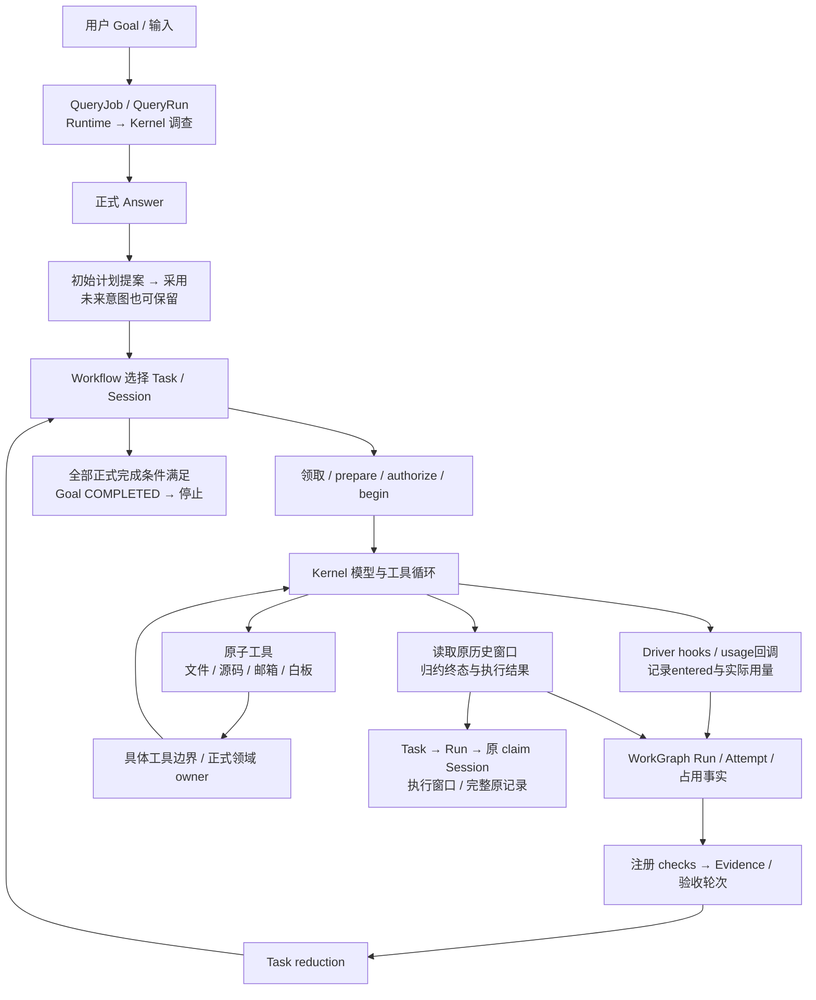

# B1/W1 之后新增代码与逻辑清单

**后续增量：** 下表保留AG1前的完整统计快照。此后按用户新要求开始Agent行为消费者接线，AG1生产TS净+307、测试+151行，逐文件增删及哈希见[该批证据](evidence/agent-behavior-2026-09-27/ag1/verification.json)。不要把本表原33,161行净增数当成后续所有版本的即时计数。

2026-09-27；当前独立仓库 `coding-platform-next`。本页回答“新增了哪些代码、增加了什么逻辑、由谁消费”，不把代码体量当作必要性证明，也不据此宣布完整 MVP 完成。

**生产 TS：30,464 → 63,625 行，净增 33,161 行；逐文件最终差分为 +33,649 / −488。60 个新增路径、48 个修改文件、117 个未变文件、0 个删除文件。测试 TS 另净增 18,560 行，不混入生产统计。**

阅读顺序：[口径与基线](#1-口径与基线) → [模块增长](#2-增长去了哪里) → [逻辑与调用链](#3-增加了哪些逻辑) → [全部生产文件](#4-全部新增与修改生产文件108项) → [测试代码](#5-测试代码单列) → [冗余与增长的区别](#6-这些增长与冗余清理是什么关系)。

## 1. 口径与基线

- 起点为 [B1/W1 验收](next-b1-w1-2026-09-25.md)，不是整个重构起点。原路径 `coding-platform/next/src` 映射为本仓库 `src`。
- 以[原 SHA-256 清单](evidence/next-b1-w1-2026-09-25/accepted-source-hashes.json)恢复 **165 个生产 TS 文件及 82 个测试 TS 文件**，全部逐字匹配，缺口 0。原文来源沿用[9月26日统计](evidence/next-b2-2026-09-26/new-code-inventory-20260926.json)的精确快照位置；这里只读历史原文，没有从旧 lane 导入源码。
- 终点是当前工作树：HEAD `d0dc9d6cf4b914159a67578dd1de7265fa9bad9d`，含尚未提交的首批角色准入复用。首批清理源码净行数为 0，测试净增 17；本次只新增文档与统计数据，没有继续修改生产或测试。
- 物理行包括空行、注释；不是逻辑 SLOC。逐行 `SequenceMatcher(autojunk=False)` 从基线到最终文件只比较一次，不累加骨架、实现、返修各批的改写量。净增长 = 新增行 − 删除行。
- **“新增路径”只证明 B1 没有这个文件，不证明内容全部从零创作。** 有些逻辑复用旧实现或沿用既有契约；无法证明作者来源的部分不标成原创。修改文件只算差分，不能把现有整文件当新增。
- 主表只含 `src/**/*.ts`。CSS/HTML、测试、Kernel 受管补丁、构建生成物、脚本、文档分开披露；不把 vendor/dist 或审阅日志复制量算成这三万行。
- [机器清单](evidence/code-growth-2026-09-27/inventory.json)包含全部 359 个生产/测试 TS 文件的基线/当前哈希、行数、原文恢复位置及增删区间。区间以“1起始行 + 长度”表示；长度0是插入/删除边界。导入证据列表仅沿用9月26日已记录批次，不假称覆盖其后的每次修改。

## 2. 增长去了哪里

### 2.1 按模块；以下九行互斥，可直接相加

| 模块 | B1 行 | 当前行 | 新增行 | 删除行 | 净增长 | 主要增加的内容 |
| --- | ---: | ---: | ---: | ---: | ---: | --- |
| `src/core/work-graph` | 16,975 | 35,504 | 18,888 | 359 | +18,529 | 执行/模型准入、Query、邮箱、Evidence、材料授权、计划与初始化 |
| `src/core/agent-runtime` | 3,254 | 8,357 | 5,177 | 74 | +5,103 | Work/Query 准备与执行观察、控制、Agent工具、检查与接线 |
| `src/ui` | 0 | 4,779 | 4,779 | 0 | +4,779 | Session/双图/历史/文件工作台及执行续步 |
| `src/app` | 0 | 1,784 | 1,784 | 0 | +1,784 | 本地Host、HTTP路由、模型配置与服务启动 |
| `src/core/workspace` | 2,889 | 3,782 | 908 | 15 | +893 | Git固定版本读取比较、材料来源provider与少量适配 |
| `src/business/workflow` | 36 | 911 | 890 | 15 | +875 | 消费正式Answer，推进初始计划、执行、检查与完成 |
| `src/contracts` | 3,810 | 4,607 | 807 | 10 | +797 | 准备输入、执行、Query、证据/检查、控制等公共类型 |
| `src/composition` | 225 | 626 | 416 | 15 | +401 | 上述owner和真实Runtime/Kernel/Host组合接线 |
| `src/core/record-store` | 3,275 | 3,275 | 0 | 0 | +0 | 本阶段无变化；不是这三万行的增长来源 |
| **合计** | **30,464** | **63,625** | **33,649** | **488** | **+33,161** | |

WorkGraph 与 Runtime 合计贡献净增 **23,632 行，占71.3%**。Host/UI 合计净增 **6,563 行，占19.8%**；不能把平台内部机制和可见界面增长混为一类。

### 2.2 WorkGraph 内部；这是上表 WorkGraph 一行的展开，不能再次加到总数

| 子目录 | B1 行 | 当前行 | 净增长 | 涉及逻辑 |
| --- | ---: | ---: | ---: | --- |
| `tasks` | 6,840 | 13,073 | +6,233 | 执行/模型入口、控制、Plan白板/初始Plan、正式Task/Goal完成 |
| `queries` | 0 | 3,332 | +3,332 | QueryJob/Run/Answer的writer、reader和codecs |
| `communication` | 0 | 2,020 | +2,020 | Session邮箱、消息回执及codecs |
| `evidence` | 0 | 1,918 | +1,918 | 检查轮次、结果、证据适用性/覆盖 |
| `materials` | 1,204 | 2,845 | +1,641 | grant/revoke、材料事实及读者扩展 |
| `configuration` | 1,371 | 2,960 | +1,589 | 项目/工作区/完成政策初始化；不是新建角色系统 |
| `persistence` | 1,314 | 2,520 | +1,206 | 执行、模型请求、控制的领域编码；不是另一数据库 |
| `architecture` | 2,551 | 3,001 | +450 | 目录修订及包含关系；已有来源分析不重算新增 |
| `root` | 173 | 313 | +140 | 正式来源authority读取适配 |
| `sessions` | 3,522 | 3,522 | +0 | 本阶段无变化；目录/生命周期主体早于B1 |

## 3. 增加了哪些逻辑

下面按职责说明增量用途，关联文件可能跨组引用；这些逻辑行不可再相加计数。`已接通`描述具体调用链，不等于完整多Agent产品验收。

| 逻辑组 | 输入 → 新增动作 → 产出 | 真实入口/消费者 | 状态与存储边界 |
| --- | --- | --- | --- |
| 项目初始化 | 项目/工作区/政策请求 → 正式登记、安装/启用 → 记录及回执 | Host → `project-bootstrap-service` | records保存正式配置；Host启动配置仍是固定快照 |
| 初始调查 Query | Goal/Query请求 → Job受理、Session占用、只读Kernel执行 → Answer与来源 | Host/UI → Query owner/Runtime | QueryJob/Run/Answer持久化；Kernel原历史另存；不是新增模型引擎 |
| 初始计划 | 正式Answer → 输出解析、提案、采用 → Plan/TaskGraph | `handleGoalInput`、Plan owner | 采用才形成正式计划，回答文本不自动等于图事实 |
| Agent未来白板 | Agent工具参数+绑定Run → 查询/提案/采用 → 新Plan或原回执 | `whiteboard-tools` → Plan owner | 允许无验收条件未来意图；正式写入仍有局部版本保护 |
| Work准备 | 已领取Run → 读Role/任务输入/材料/Host → 执行manifest | `runtime.prepareExecution` | 正文写ArtifactStore，不在准备阶段启动模型 |
| 执行受理与模型准入 | prepared/Run → authorize→begin、entered、每模型许可/消费 → 执行事实 | `startRun`、model-call adapter | Run/Attempt/lease等由WorkGraph提交；这里是阶段重复的重点审查面 |
| Kernel执行与观察 | 接线配置 → 真实模型/工具循环 → 历史、usage、terminal | Work/Query driver → `runObservedModel` → Kernel | 原历史归Kernel；平台保存身份/定位/结果；两条观察路径存在重复机制 |
| pause/cancel控制 | 持久控制请求 → 向本进程handle投递 → 真实观察确认 | control owner、Runtime control coordinator | 意图/ack持久化，AbortController/handle在内存；完整resume/崩溃恢复未交付 |
| Session通信 | 消息请求 → 正文、收件索引、确认/回复 → Message/receipt | Session页、Agent communication tools → mailbox owner | 邮箱事实不是主动多Agent调度器；等待后自动推进未由此证明 |
| 材料授权和读取事实 | grant/revoke写入；读取授权/适用性事实并返回版本guards | Runtime、Plan输入、通信、Evidence | 当前动作授权与已发生结果分开；材料facts reader自身不写读取日志 |
| 注册检查/Evidence | 固定验收要求 → 检查受理、Kernel命令、结果、覆盖计算 → Verification/Evidence | `runRegisteredCheck`、evidence owner | 不另建Policy/架构/材料owner；Reviewer完整消费未交付 |
| Task/Goal完成 | 正式检查与Evidence → 义务/当前执行状态判定 → reduction/Goal COMPLETED | Workflow → completion owner | Run结束不等于Task完成；失败后同Task新Attempt闭环仍缺 |
| 架构目录修订 | 正式目录变更 → 新版本/显式包含及历史 → 当前目录 | composition公开catalog owner | writer已有，修订尚缺Host/UI消费者；包含与依赖独立 |
| 文件来源/Git | Agent/UI版本读取请求 → 固定Git OID读取/比较 → 带来源结果 | `project_source`、Host Workspace接口 | 复用Kernel沙箱边界，capture为内存资源；不是所有文件操作都需图事务 |
| Workflow推进 | 当前事实与原receipt → 选择Task/复用Session/执行/检查 → next或waiting/completed | `advanceWork`，当前UI代为HTTP续步 | 无第二套持久业务状态库；未知/执行中/中断停止推进 |
| 工作台与历史 | 正式查询结果 → Session/双图/页签/文件草稿/展开历史 | `ui/main.ts`、`views.ts` → Host | UI状态是显示偏好/草稿；Task→Run→原Session→窗口已接，完整UI未完成 |
| codecs、契约、组合根 | 上述领域输入/记录 → 类型、持久结构检查、共享实例注入 | 各owner、RecordStore注册、Host | 是配套机制，不是额外的用户能力；需要单独审查重复校验/协议 |

### 3.1 限定正常路径与平台事实回流

这张图说明新增机制的位置，不为每个阶段的必要性背书。特别是 Work/Query 各自协议、模型许可两阶段、浏览器原样续发 next，都仍需按独立职责判断；`RecordStore`、Session目录等是已存在的底座。

## 4. 全部新增与修改生产文件（108项）

“新”=基线没有该路径；“改”=已有文件内容变化。`+ / −`为最终逐行差分，不能和净增长重复相加。“逻辑”描述变更涉及的职责，不把修改文件的所有原有功能归因于这次增长。精确增删位置见机器清单的 `hunks`。

### `src/core/work-graph`：54 个变化文件，净增 18,529 行

| 文件 | 新/改 | B1 → 当前行 | + / − | 净变化 | 增量涉及逻辑 |
| --- | --- | ---: | ---: | ---: | --- |
| [architecture/catalog-contracts.ts](../../../src/core/work-graph/architecture/catalog-contracts.ts) | 改 | 126 → 155 | 36 / 7 | +29 | 正式架构目录修订与显式包含关系契约扩充 |
| [architecture/catalog-record-codecs.ts](../../../src/core/work-graph/architecture/catalog-record-codecs.ts) | 改 | 370 → 555 | 189 / 4 | +185 | 目录修订、包含与事件的持久形状/解码增补 |
| [architecture/catalog-service.ts](../../../src/core/work-graph/architecture/catalog-service.ts) | 改 | 568 → 804 | 254 / 18 | +236 | 沿用已有目录增加修订与历史回执；不等于修订UI已接通 |
| [communication/contracts.ts](../../../src/core/work-graph/communication/contracts.ts) | 新 | 0 → 157 | 157 / 0 | +157 | 消息、收件索引、读取/确认/回复端口 |
| [communication/mailbox-service.ts](../../../src/core/work-graph/communication/mailbox-service.ts) | 新 | 0 → 1,433 | 1,433 / 0 | +1,433 | 受理消息、正文引用、Inbox、确认/回复及请求重放 |
| [communication/message-record-codecs.ts](../../../src/core/work-graph/communication/message-record-codecs.ts) | 新 | 0 → 430 | 430 / 0 | +430 | 邮箱领域记录和事件 schema/编解码 |
| [configuration/project-bootstrap-contracts.ts](../../../src/core/work-graph/configuration/project-bootstrap-contracts.ts) | 新 | 0 → 100 | 100 / 0 | +100 | Project/Workspace/完成政策初始化端口 |
| [configuration/project-bootstrap-record-codecs.ts](../../../src/core/work-graph/configuration/project-bootstrap-record-codecs.ts) | 新 | 0 → 449 | 449 / 0 | +449 | 项目、工作区及完成政策记录/事件编解码 |
| [configuration/project-bootstrap-service.ts](../../../src/core/work-graph/configuration/project-bootstrap-service.ts) | 新 | 0 → 1,040 | 1,040 / 0 | +1,040 | 正式创建项目/工作区、安装启用完成政策及幂等回执 |
| [evidence/contracts.ts](../../../src/core/work-graph/evidence/contracts.ts) | 新 | 0 → 98 | 98 / 0 | +98 | 检查轮次、结果、Evidence 与轮次收口端口 |
| [evidence/coverage.ts](../../../src/core/work-graph/evidence/coverage.ts) | 新 | 0 → 198 | 198 / 0 | +198 | 共享 Evidence 适用性和验收覆盖计算 |
| [evidence/evidence-record-codecs.ts](../../../src/core/work-graph/evidence/evidence-record-codecs.ts) | 新 | 0 → 450 | 450 / 0 | +450 | Evidence/Verification 记录与事件编解码 |
| [evidence/evidence-service.ts](../../../src/core/work-graph/evidence/evidence-service.ts) | 新 | 0 → 1,041 | 1,041 / 0 | +1,041 | 开启检查轮次、准入检查、记录结果/证据与汇合轮次 |
| [evidence/verification-plan.ts](../../../src/core/work-graph/evidence/verification-plan.ts) | 新 | 0 → 131 | 131 / 0 | +131 | 从既有要求/政策生成本轮检查计划及来源 |
| [materials/contracts.ts](../../../src/core/work-graph/materials/contracts.ts) | 改 | 18 → 36 | 18 / 0 | +18 | 扩充材料事实和正式读取接口 |
| [materials/grant-contracts.ts](../../../src/core/work-graph/materials/grant-contracts.ts) | 新 | 0 → 109 | 109 / 0 | +109 | 材料 grant/revoke 的公开输入与结果 |
| [materials/grant-record-codecs.ts](../../../src/core/work-graph/materials/grant-record-codecs.ts) | 新 | 0 → 291 | 291 / 0 | +291 | 材料授权记录与事件编解码 |
| [materials/grant-service.ts](../../../src/core/work-graph/materials/grant-service.ts) | 新 | 0 → 968 | 968 / 0 | +968 | 授权/撤权写入及作用域/当前来源核对 |
| [materials/material-facts-service.ts](../../../src/core/work-graph/materials/material-facts-service.ts) | 新 | 0 → 209 | 209 / 0 | +209 | 读取材料授权/来源事实并返回版本guards；自身不写读取日志 |
| [materials/record-readers.ts](../../../src/core/work-graph/materials/record-readers.ts) | 改 | 614 → 660 | 48 / 2 | +46 | 新增领域事实/授权读取映射；复用原材料读取机制 |
| [persistence/control-record-codecs.ts](../../../src/core/work-graph/persistence/control-record-codecs.ts) | 新 | 0 → 463 | 463 / 0 | +463 | 控制意图及确认的记录/事件编码和结构检查 |
| [persistence/execution-entry-codecs.ts](../../../src/core/work-graph/persistence/execution-entry-codecs.ts) | 新 | 0 → 496 | 496 / 0 | +496 | 执行受理、entered/result 记录及事件编码 |
| [persistence/model-request-codecs.ts](../../../src/core/work-graph/persistence/model-request-codecs.ts) | 新 | 0 → 247 | 247 / 0 | +247 | 模型许可、attempt、usage/result 持久结构 |
| [queries/contracts.ts](../../../src/core/work-graph/queries/contracts.ts) | 新 | 0 → 223 | 223 / 0 | +223 | QueryJob、执行受理、结果及状态读取端口 |
| [queries/query-execution.ts](../../../src/core/work-graph/queries/query-execution.ts) | 新 | 0 → 1,474 | 1,474 / 0 | +1,474 | Query 领取/准备/开始/模型调用/观察/答案的正式事实协议 |
| [queries/query-job-service.ts](../../../src/core/work-graph/queries/query-job-service.ts) | 新 | 0 → 873 | 873 / 0 | +873 | 提交与领取 QueryJob、Session 占用、Job/Answer 读取 |
| [queries/query-record-codecs.ts](../../../src/core/work-graph/queries/query-record-codecs.ts) | 新 | 0 → 762 | 762 / 0 | +762 | QueryJob/QueryRun/Answer 记录、事件与关联编解码 |
| [source-authority-ports.ts](../../../src/core/work-graph/source-authority-ports.ts) | 改 | 46 → 62 | 17 / 1 | +16 | 授权来源读取端口增补，供执行/材料消费 |
| [source-authority-reader.ts](../../../src/core/work-graph/source-authority-reader.ts) | 改 | 127 → 251 | 130 / 6 | +124 | 从同一 records/事件来源读取正式执行与权限事实 |
| [tasks/claim-contracts.ts](../../../src/core/work-graph/tasks/claim-contracts.ts) | 改 | 54 → 60 | 21 / 15 | +6 | 复用共享 TaskClaim 类型并补后续消费者契约 |
| [tasks/claim-record-codecs.ts](../../../src/core/work-graph/tasks/claim-record-codecs.ts) | 改 | 299 → 318 | 20 / 1 | +19 | 领取记录/事件配合正式执行协议的字段增补 |
| [tasks/claim-service.ts](../../../src/core/work-graph/tasks/claim-service.ts) | 改 | 672 → 678 | 12 / 6 | +6 | 领取前复用未来意图/缺分工诊断并调整校验顺序；净增6行 |
| [tasks/completion-policy.ts](../../../src/core/work-graph/tasks/completion-policy.ts) | 新 | 0 → 279 | 279 / 0 | +279 | 读取/核对固定完成政策及义务要求 |
| [tasks/completion-record-codecs.ts](../../../src/core/work-graph/tasks/completion-record-codecs.ts) | 新 | 0 → 311 | 311 / 0 | +311 | Task reduction 与 Goal completion 的持久结构 |
| [tasks/completion.ts](../../../src/core/work-graph/tasks/completion.ts) | 新 | 0 → 682 | 682 / 0 | +682 | 根据正式检查/Evidence 完成 Task/Goal并保存结果来源 |
| [tasks/contracts.ts](../../../src/core/work-graph/tasks/contracts.ts) | 改 | 63 → 90 | 29 / 2 | +27 | Task/Goal 完成等正式操作端口扩充 |
| [tasks/control-contracts.ts](../../../src/core/work-graph/tasks/control-contracts.ts) | 新 | 0 → 73 | 73 / 0 | +73 | 控制请求、读取与 Runtime 确认端口 |
| [tasks/control-service.ts](../../../src/core/work-graph/tasks/control-service.ts) | 新 | 0 → 613 | 613 / 0 | +613 | 控制意图持久受理/读取、投递/确认事实与原回执 |
| [tasks/eligibility.ts](../../../src/core/work-graph/tasks/eligibility.ts) | 改 | 65 → 78 | 14 / 1 | +13 | 区分未来 plan_only 意图、执行条件与已领取状态 |
| [tasks/execution-entry-contracts.ts](../../../src/core/work-graph/tasks/execution-entry-contracts.ts) | 新 | 0 → 124 | 124 / 0 | +124 | Run 授权/开始/entered/result 及受信 Host 准入契约 |
| [tasks/execution-entry-service.ts](../../../src/core/work-graph/tasks/execution-entry-service.ts) | 新 | 0 → 1,651 | 1,651 / 0 | +1,651 | Work 执行准入、版本/占用核对、entered/终止事实及同代次释放 |
| [tasks/execution-history-binding.ts](../../../src/core/work-graph/tasks/execution-history-binding.ts) | 新 | 0 → 171 | 171 / 0 | +171 | 执行事实与原 claim Session/Kernel 历史定位绑定校验 |
| [tasks/execution-history-service.ts](../../../src/core/work-graph/tasks/execution-history-service.ts) | 改 | 515 → 479 | 25 / 61 | -36 | 沿新共享历史绑定重用校验并收敛原历史写入；本阶段净减少36行 |
| [tasks/initial-plan.ts](../../../src/core/work-graph/tasks/initial-plan.ts) | 新 | 0 → 179 | 179 / 0 | +179 | 解析正式 Query Answer，形成可交原 Plan owner 的初始计划候选 |
| [tasks/model-call-contracts.ts](../../../src/core/work-graph/tasks/model-call-contracts.ts) | 新 | 0 → 81 | 81 / 0 | +81 | 模型请求授权、消费及结果记录契约 |
| [tasks/model-call-service.ts](../../../src/core/work-graph/tasks/model-call-service.ts) | 新 | 0 → 303 | 303 / 0 | +303 | 当前执行权核对、模型许可签发/消费与实际请求事实保存 |
| [tasks/plan-contracts.ts](../../../src/core/work-graph/tasks/plan-contracts.ts) | 改 | 61 → 162 | 105 / 4 | +101 | Agent/Host 计划写入、未来任务与初始计划端口 |
| [tasks/plan-readers.ts](../../../src/core/work-graph/tasks/plan-readers.ts) | 改 | 1,159 → 1,324 | 180 / 15 | +165 | 图投影增加输入/执行/完成诊断及未来意图读取 |
| [tasks/plan-record-codecs.ts](../../../src/core/work-graph/tasks/plan-record-codecs.ts) | 改 | 756 → 837 | 82 / 1 | +81 | 计划新字段及提案/采用事件的编解码适配 |
| [tasks/plan-service.ts](../../../src/core/work-graph/tasks/plan-service.ts) | 改 | 1,223 → 2,129 | 1,089 / 183 | +906 | 已有Plan owner扩展Agent白板准入、初始计划及采用处理 |
| [tasks/plan-validation.ts](../../../src/core/work-graph/tasks/plan-validation.ts) | 改 | 436 → 512 | 104 / 28 | +76 | 分工、任务输入及未来意图的局部结构/规则增补 |
| [tasks/plan-write-admission.ts](../../../src/core/work-graph/tasks/plan-write-admission.ts) | 新 | 0 → 384 | 384 / 0 | +384 | 把Agent计划变更绑定到当前Run/角色/作用域及正式提交 |
| [tasks/run-state-service.ts](../../../src/core/work-graph/tasks/run-state-service.ts) | 改 | 470 → 472 | 4 / 2 | +2 | 已有Run读取结果与新执行协议的少量适配 |
| [tasks/task-service.ts](../../../src/core/work-graph/tasks/task-service.ts) | 改 | 411 → 427 | 18 / 2 | +16 | Task/Goal正式操作与完成记录接线增补 |

### `src/core/agent-runtime`：20 个变化文件，净增 5,103 行

| 文件 | 新/改 | B1 → 当前行 | + / − | 净变化 | 增量涉及逻辑 |
| --- | --- | ---: | ---: | ---: | --- |
| [check-execution.ts](../../../src/core/agent-runtime/check-execution.ts) | 新 | 0 → 178 | 178 / 0 | +178 | 消费注册检查票据，经 Kernel 沙箱运行命令并记录正式检查结果 |
| [communication-tools.ts](../../../src/core/agent-runtime/communication-tools.ts) | 新 | 0 → 263 | 263 / 0 | +263 | 把 Agent 通信工具参数转为原邮箱 owner 调用和回执 |
| [execution-contracts.ts](../../../src/core/agent-runtime/execution-contracts.ts) | 新 | 0 → 216 | 216 / 0 | +216 | Runtime 依赖、Kernel 绑定、执行句柄和准备/观察内部类型 |
| [execution-control.ts](../../../src/core/agent-runtime/execution-control.ts) | 新 | 0 → 253 | 253 / 0 | +253 | 进程内执行句柄协调、控制投递与真实停机/清理观察 |
| [execution-driver.ts](../../../src/core/agent-runtime/execution-driver.ts) | 新 | 0 → 708 | 708 / 0 | +708 | 消费 prepared manifest，执行受理/开始，装配工具和真实 Kernel 执行 |
| [execution-observation.ts](../../../src/core/agent-runtime/execution-observation.ts) | 新 | 0 → 671 | 671 / 0 | +671 | 归约Kernel历史，记录terminal，推进Run历史定位和控制确认；entered由driver记录 |
| [execution-preparation.ts](../../../src/core/agent-runtime/execution-preparation.ts) | 新 | 0 → 402 | 402 / 0 | +402 | 读取领取/Role/任务输入及材料，组装并保存 Work 执行 manifest |
| [model-budget.ts](../../../src/core/agent-runtime/model-budget.ts) | 改 | 56 → 106 | 51 / 1 | +50 | 扩展模型调用计量、预算和 usage 记录配合 |
| [model-call-access.ts](../../../src/core/agent-runtime/model-call-access.ts) | 新 | 0 → 102 | 102 / 0 | +102 | Kernel模型调用前绑定身份，衔接正式模型许可签发与消费 |
| [observed-model-run.ts](../../../src/core/agent-runtime/observed-model-run.ts) | 改 | 259 → 328 | 116 / 47 | +69 | 在已有 Kernel 循环上补正式模型准入、控制组屏障及执行资源接线 |
| [ports.ts](../../../src/core/agent-runtime/ports.ts) | 改 | 14 → 72 | 65 / 7 | +58 | 公开 prepare/start/observe、控制、Query 和历史消费端口扩充 |
| [project-source-tool.ts](../../../src/core/agent-runtime/project-source-tool.ts) | 改 | 273 → 315 | 50 / 8 | +42 | 扩展项目源码工具的 Git/版本读取与比较参数和结果 |
| [query-execution.ts](../../../src/core/agent-runtime/query-execution.ts) | 新 | 0 → 459 | 459 / 0 | +459 | 只读 Query Kernel 执行、模型准入和 entered 事实回流 |
| [query-observation.ts](../../../src/core/agent-runtime/query-observation.ts) | 新 | 0 → 479 | 479 / 0 | +479 | 归约Query历史、抽取答案并保存观察/结果；usage由driver回调记录 |
| [query-preparation.ts](../../../src/core/agent-runtime/query-preparation.ts) | 新 | 0 → 403 | 403 / 0 | +403 | 从 Query 身份、来源与预算组装调查 manifest |
| [run-limits.ts](../../../src/core/agent-runtime/run-limits.ts) | 改 | 31 → 58 | 30 / 3 | +27 | Task/Host/模型预算到 Kernel limits 的约束映射 |
| [runtime.ts](../../../src/core/agent-runtime/runtime.ts) | 改 | 7 → 110 | 108 / 5 | +103 | 将原 unsupported 骨架装配为 Work/Query 执行、控制和历史入口 |
| [session-operations.ts](../../../src/core/agent-runtime/session-operations.ts) | 改 | 806 → 965 | 159 / 0 | +159 | 在已有Session历史上增加Runtime完成边界与固定位置窗口读取 |
| [source-capture-access.ts](../../../src/core/agent-runtime/source-capture-access.ts) | 改 | 736 → 770 | 37 / 3 | +34 | Query原始发起者改用精确提交定位读取，并保留旧事件扫描fallback |
| [whiteboard-tools.ts](../../../src/core/agent-runtime/whiteboard-tools.ts) | 新 | 0 → 427 | 427 / 0 | +427 | Agent 查询/提案/采用未来计划的工具封装；委托原 Plan owner |

### `src/ui`：2 个变化文件，净增 4,779 行

| 文件 | 新/改 | B1 → 当前行 | + / − | 净变化 | 增量涉及逻辑 |
| --- | --- | ---: | ---: | ---: | --- |
| [main.ts](../../../src/ui/main.ts) | 新 | 0 → 3,370 | 3,370 / 0 | +3,370 | 工作台交互状态、HTTP调用、执行续步、Session/双图/页签/文件草稿/历史导航 |
| [views.ts](../../../src/ui/views.ts) | 新 | 0 → 1,409 | 1,409 / 0 | +1,409 | 工作台、图节点/详情、执行与原历史、文件等视图渲染 |

### `src/app`：7 个变化文件，净增 1,784 行

| 文件 | 新/改 | B1 → 当前行 | + / − | 净变化 | 增量涉及逻辑 |
| --- | --- | ---: | ---: | ---: | --- |
| [core-call-context.ts](../../../src/app/core-call-context.ts) | 新 | 0 → 35 | 35 / 0 | +35 | 将受信 Host 身份与项目/工作区绑定为 CoreCallContext |
| [core-http-types.ts](../../../src/app/core-http-types.ts) | 新 | 0 → 323 | 323 / 0 | +323 | HTTP scope、请求/响应与 bootstrap 数据形状；复用领域类型 |
| [core-routes.ts](../../../src/app/core-routes.ts) | 新 | 0 → 378 | 378 / 0 | +378 | HTTP 路由白名单、参数解析、正式 owner 绑定与分派 |
| [host.ts](../../../src/app/host.ts) | 新 | 0 → 266 | 266 / 0 | +266 | 固定工作区权限/配置，创建平台并管理 Host 关闭 |
| [main.ts](../../../src/app/main.ts) | 新 | 0 → 194 | 194 / 0 | +194 | CLI 配置文件解析、路径解析和工作台启动入口 |
| [runtime-configuration.ts](../../../src/app/runtime-configuration.ts) | 新 | 0 → 300 | 300 / 0 | +300 | 真实模型 provider、模型预算、角色/Skill/Host 配置接线及输入检查 |
| [server.ts](../../../src/app/server.ts) | 新 | 0 → 288 | 288 / 0 | +288 | HTTP 服务、访问 token、请求中断和静态工作台资源 |

### `src/core/workspace`：6 个变化文件，净增 893 行

| 文件 | 新/改 | B1 → 当前行 | + / − | 净变化 | 增量涉及逻辑 |
| --- | --- | ---: | ---: | ---: | --- |
| [access.ts](../../../src/core/workspace/access.ts) | 改 | 90 → 110 | 25 / 5 | +20 | 沙箱访问增加固定Git版本读取所需可信能力适配 |
| [capture.ts](../../../src/core/workspace/capture.ts) | 改 | 547 → 588 | 46 / 5 | +41 | 已有capture registry增加Git读/比接线，复用冻结正文 |
| [git-read.ts](../../../src/core/workspace/git-read.ts) | 新 | 0 → 537 | 537 / 0 | +537 | 固定commit的真实文件读取/比较，child/root handle取消清理 |
| [material-source-provider.ts](../../../src/core/workspace/material-source-provider.ts) | 新 | 0 → 244 | 244 / 0 | +244 | 将正式材料来源类别接到真实源码pin及当前适用性读取 |
| [ports.ts](../../../src/core/workspace/ports.ts) | 改 | 187 → 238 | 54 / 3 | +51 | 文件版本、Git读取/比较与来源访问契约扩充 |
| [workspace-read.ts](../../../src/core/workspace/workspace-read.ts) | 改 | 163 → 163 | 2 / 2 | +0 | 实际文本读取/比较的局部适配，行数净变化0 |

### `src/business/workflow`：4 个变化文件，净增 875 行

| 文件 | 新/改 | B1 → 当前行 | + / − | 净变化 | 增量涉及逻辑 |
| --- | --- | ---: | ---: | ---: | --- |
| [contracts.ts](../../../src/business/workflow/contracts.ts) | 改 | 13 → 126 | 115 / 2 | +113 | Goal 输入、执行步骤、原回执及 next/waiting/completed 返回形状 |
| [index.ts](../../../src/business/workflow/index.ts) | 改 | 3 → 7 | 5 / 1 | +4 | 对外导出新增 Workflow 消费者及类型 |
| [ports.ts](../../../src/business/workflow/ports.ts) | 改 | 13 → 64 | 58 / 7 | +51 | 注入 Plan、Runtime、checks 与完成判定端口；Workflow不直接驱动Query |
| [workflow.ts](../../../src/business/workflow/workflow.ts) | 改 | 7 → 714 | 712 / 5 | +707 | 消费正式Answer→计划提案/采用→选择Task/Session→执行/检查/完成 |

### `src/contracts`：14 个变化文件，净增 797 行

| 文件 | 新/改 | B1 → 当前行 | + / − | 净变化 | 增量涉及逻辑 |
| --- | --- | ---: | ---: | ---: | --- |
| [control-intent.ts](../../../src/contracts/control-intent.ts) | 改 | 10 → 93 | 83 / 0 | +83 | 持久控制请求、目标、投递/确认相关事实类型 |
| [core/prepared-execution.ts](../../../src/contracts/core/prepared-execution.ts) | 新 | 0 → 95 | 95 / 0 | +95 | Work/Query 准备输入、manifest 与来源绑定形状 |
| [core/session-message.ts](../../../src/contracts/core/session-message.ts) | 新 | 0 → 16 | 16 / 0 | +16 | Session 邮箱消息引用 |
| [core/task-claim.ts](../../../src/contracts/core/task-claim.ts) | 新 | 0 → 26 | 26 / 0 | +26 | 统一 TaskClaim 引用与领取结果结构 |
| [dispatch.ts](../../../src/contracts/dispatch.ts) | 改 | 297 → 338 | 42 / 1 | +41 | 扩充执行/Attempt、授权与模型请求关联契约 |
| [evidence.ts](../../../src/contracts/evidence.ts) | 改 | 46 → 152 | 106 / 0 | +106 | Evidence producer、结果与验收来源绑定 |
| [goal-phase.ts](../../../src/contracts/goal-phase.ts) | 改 | 9 → 32 | 23 / 0 | +23 | Goal 完成事实与结果来源引用 |
| [governance.ts](../../../src/contracts/governance.ts) | 改 | 55 → 119 | 64 / 0 | +64 | 计划写入、分工/输入与治理相关契约；类型存在不表示治理已接通 |
| [initial-planning.ts](../../../src/contracts/initial-planning.ts) | 改 | 18 → 41 | 23 / 0 | +23 | 正式 Query Answer 到初始计划候选的输入/输出类型 |
| [ledger.ts](../../../src/contracts/ledger.ts) | 改 | 88 → 90 | 3 / 1 | +2 | 新增领域引用接入账本联合类型；没有新增数据库实现 |
| [plan.ts](../../../src/contracts/plan.ts) | 改 | 298 → 316 | 20 / 2 | +18 | 计划输入/任务定义、未来意图与采用相关结构增补 |
| [query-job.ts](../../../src/contracts/query-job.ts) | 改 | 217 → 315 | 103 / 5 | +98 | Query 执行身份、来源、状态/结果引用 |
| [reduction.ts](../../../src/contracts/reduction.ts) | 改 | 54 → 75 | 22 / 1 | +21 | Task 完成归约及验收来源引用 |
| [verification.ts](../../../src/contracts/verification.ts) | 改 | 18 → 199 | 181 / 0 | +181 | 检查要求、轮次、注册检查准入/结果及来源契约 |

### `src/composition`：1 个变化文件，净增 401 行

| 文件 | 新/改 | B1 → 当前行 | + / − | 净变化 | 增量涉及逻辑 |
| --- | --- | ---: | ---: | ---: | --- |
| [create-platform.ts](../../../src/composition/create-platform.ts) | 改 | 225 → 626 | 416 / 15 | +401 | 装配新增领域 owner、Runtime、Kernel 和 Workflow；共享 stores、生命周期及可信配置 |

未变化的117个生产文件仍保存在机器清单中，正文不重复罗列。CSS/HTML另有 `src/ui/styles.css` 156行、`index.html` 19行；它们不在上述TS统计中。Kernel受管补丁、Skill资源和工程脚本同样不能塞进33,161行；它们需要各自完整基线才可报净增，已有历史口径见[旧统计§6](evidence/next-b2-2026-09-26/new-code-inventory-20260926.md#6-kernel与生成物)。

## 5. 测试代码单列

测试 TS 从 **82文件/20,650行 → 134文件/39,210行**，最终差分 **+18,569 / −9，净增18,560行**；52个新路径、6个修改、76个未变、无删除文件。含fixture/helper，不等于测试用例数量，也不代表本次重新运行了这些测试。

| 目录 | B1行 | 当前行 | 净变化 | 主要覆盖对象 |
| --- | ---: | ---: | ---: | --- |
| `tests/work-graph` | 8,006 | 14,684 | +6,678 | 领域状态、准入、授权、白板、Query、检查与完成 |
| `tests/runtime` | 4,546 | 7,384 | +2,838 | 真实Kernel执行接缝、控制、Query、Agent工具 |
| `tests/composition` | 1,243 | 3,672 | +2,429 | 真实平台装配、owner/Runtime/Store集成 |
| `tests/helpers` | 968 | 2,888 | +1,920 | 共享执行/邮箱/白板/Evidence夹具 |
| `tests/app` | 529 | 2,167 | +1,638 | Host/工作台HTTP与UI消费者 |
| `tests/kernel` | 1,099 | 2,677 | +1,578 | 公开历史、terminal投影、工具组控制屏障 |
| `tests/data` | 3,365 | 4,307 | +942 | Workspace/Git/材料来源 |
| `tests/business/R5b-initial-planning-workflow.test.ts` | 0 | 361 | +361 | 已有组件测试，本阶段变化见下表 |
| `tests/business/R5c-workflow.test.ts` | 0 | 176 | +176 | 已有组件测试，本阶段变化见下表 |
| `tests/architecture` | 148 | 148 | +0 | 静态模块边界 |
| `tests/context` | 100 | 100 | +0 | 上下文材料组件（本阶段无增量） |
| `tests/record-store` | 646 | 646 | +0 | 已有组件测试，本阶段变化见下表 |

### 全部58个新增/修改测试文件

文件名可直接进入现有场景；此表仅统计源码，不把断言数量或旧绿灯当成当前全量验收。

| 文件 | 新/改 | B1 → 当前行 | 净变化 |
| --- | --- | ---: | ---: |
| [tests/app/R6-host.test.ts](../../../tests/app/R6-host.test.ts) | 新 | 0 → 972 | +972 |
| [tests/app/R6-workbench.test.ts](../../../tests/app/R6-workbench.test.ts) | 新 | 0 → 666 | +666 |
| [tests/architecture/boundaries.test.ts](../../../tests/architecture/boundaries.test.ts) | 改 | 148 → 148 | +0 |
| [tests/business/R5b-initial-planning-workflow.test.ts](../../../tests/business/R5b-initial-planning-workflow.test.ts) | 新 | 0 → 361 | +361 |
| [tests/business/R5c-workflow.test.ts](../../../tests/business/R5c-workflow.test.ts) | 新 | 0 → 176 | +176 |
| [tests/composition/A1-graph-session-platform.test.ts](../../../tests/composition/A1-graph-session-platform.test.ts) | 改 | 211 → 342 | +131 |
| [tests/composition/B2-runtime-platform.test.ts](../../../tests/composition/B2-runtime-platform.test.ts) | 新 | 0 → 79 | +79 |
| [tests/composition/C1-M1-platform.test.ts](../../../tests/composition/C1-M1-platform.test.ts) | 新 | 0 → 249 | +249 |
| [tests/composition/C2-runtime-platform.test.ts](../../../tests/composition/C2-runtime-platform.test.ts) | 新 | 0 → 223 | +223 |
| [tests/composition/R3e-command-check-platform.test.ts](../../../tests/composition/R3e-command-check-platform.test.ts) | 新 | 0 → 194 | +194 |
| [tests/composition/R3e-completion-platform.test.ts](../../../tests/composition/R3e-completion-platform.test.ts) | 新 | 0 → 148 | +148 |
| [tests/composition/R4-control-platform.test.ts](../../../tests/composition/R4-control-platform.test.ts) | 新 | 0 → 145 | +145 |
| [tests/composition/R4-control-runtime-platform.test.ts](../../../tests/composition/R4-control-runtime-platform.test.ts) | 新 | 0 → 234 | +234 |
| [tests/composition/R5a-project-bootstrap-platform.test.ts](../../../tests/composition/R5a-project-bootstrap-platform.test.ts) | 新 | 0 → 300 | +300 |
| [tests/composition/R5b-query-job-platform.test.ts](../../../tests/composition/R5b-query-job-platform.test.ts) | 新 | 0 → 244 | +244 |
| [tests/composition/R5c-workflow-platform.test.ts](../../../tests/composition/R5c-workflow-platform.test.ts) | 新 | 0 → 263 | +263 |
| [tests/composition/W2-future-intent-platform.test.ts](../../../tests/composition/W2-future-intent-platform.test.ts) | 新 | 0 → 219 | +219 |
| [tests/composition/platform.test.ts](../../../tests/composition/platform.test.ts) | 改 | 95 → 95 | +0 |
| [tests/data/M1-material-source-provider.test.ts](../../../tests/data/M1-material-source-provider.test.ts) | 新 | 0 → 235 | +235 |
| [tests/data/R2e-git-operations.test.ts](../../../tests/data/R2e-git-operations.test.ts) | 新 | 0 → 707 | +707 |
| [tests/helpers/B2-execution-fixture.ts](../../../tests/helpers/B2-execution-fixture.ts) | 新 | 0 → 377 | +377 |
| [tests/helpers/B2-runtime-fixture.ts](../../../tests/helpers/B2-runtime-fixture.ts) | 新 | 0 → 280 | +280 |
| [tests/helpers/C1-mailbox-fixture.ts](../../../tests/helpers/C1-mailbox-fixture.ts) | 新 | 0 → 231 | +231 |
| [tests/helpers/C2-runtime-platform-fixture.ts](../../../tests/helpers/C2-runtime-platform-fixture.ts) | 新 | 0 → 190 | +190 |
| [tests/helpers/R3e-evidence-fixture.ts](../../../tests/helpers/R3e-evidence-fixture.ts) | 新 | 0 → 440 | +440 |
| [tests/helpers/W2-whiteboard-fixture.ts](../../../tests/helpers/W2-whiteboard-fixture.ts) | 新 | 0 → 402 | +402 |
| [tests/helpers/task-claim-fixture.ts](../../../tests/helpers/task-claim-fixture.ts) | 改 | 432 → 432 | +0 |
| [tests/kernel/B2-history-public-export.test.ts](../../../tests/kernel/B2-history-public-export.test.ts) | 新 | 0 → 256 | +256 |
| [tests/kernel/R4-terminal-history.test.ts](../../../tests/kernel/R4-terminal-history.test.ts) | 新 | 0 → 293 | +293 |
| [tests/kernel/R4-tool-group-barrier.test.ts](../../../tests/kernel/R4-tool-group-barrier.test.ts) | 新 | 0 → 1,029 | +1,029 |
| [tests/runtime/B2-runtime-execution.test.ts](../../../tests/runtime/B2-runtime-execution.test.ts) | 新 | 0 → 570 | +570 |
| [tests/runtime/C1-communication-tools.test.ts](../../../tests/runtime/C1-communication-tools.test.ts) | 新 | 0 → 297 | +297 |
| [tests/runtime/C2-runtime-platform-tools.test.ts](../../../tests/runtime/C2-runtime-platform-tools.test.ts) | 新 | 0 → 233 | +233 |
| [tests/runtime/R2e-git-source-loop.test.ts](../../../tests/runtime/R2e-git-source-loop.test.ts) | 新 | 0 → 256 | +256 |
| [tests/runtime/R4-control-runtime.test.ts](../../../tests/runtime/R4-control-runtime.test.ts) | 新 | 0 → 558 | +558 |
| [tests/runtime/R5b-query-session-loop.test.ts](../../../tests/runtime/R5b-query-session-loop.test.ts) | 新 | 0 → 239 | +239 |
| [tests/runtime/W2-role-skills.test.ts](../../../tests/runtime/W2-role-skills.test.ts) | 新 | 0 → 282 | +282 |
| [tests/runtime/W2-whiteboard-tools.test.ts](../../../tests/runtime/W2-whiteboard-tools.test.ts) | 新 | 0 → 404 | +404 |
| [tests/runtime/source-binding-migration.test.ts](../../../tests/runtime/source-binding-migration.test.ts) | 改 | 241 → 240 | -1 |
| [tests/work-graph/B2-execution-entry.test.ts](../../../tests/work-graph/B2-execution-entry.test.ts) | 新 | 0 → 240 | +240 |
| [tests/work-graph/B2-execution-result.test.ts](../../../tests/work-graph/B2-execution-result.test.ts) | 新 | 0 → 150 | +150 |
| [tests/work-graph/B2-material-admission.test.ts](../../../tests/work-graph/B2-material-admission.test.ts) | 新 | 0 → 609 | +609 |
| [tests/work-graph/B2-model-request.test.ts](../../../tests/work-graph/B2-model-request.test.ts) | 新 | 0 → 133 | +133 |
| [tests/work-graph/C1-session-mailbox.test.ts](../../../tests/work-graph/C1-session-mailbox.test.ts) | 新 | 0 → 543 | +543 |
| [tests/work-graph/C2-mailbox-admission.test.ts](../../../tests/work-graph/C2-mailbox-admission.test.ts) | 新 | 0 → 223 | +223 |
| [tests/work-graph/M1-material-grants.test.ts](../../../tests/work-graph/M1-material-grants.test.ts) | 新 | 0 → 537 | +537 |
| [tests/work-graph/M2-material-read-facts.test.ts](../../../tests/work-graph/M2-material-read-facts.test.ts) | 新 | 0 → 495 | +495 |
| [tests/work-graph/R3c-task-graph.test.ts](../../../tests/work-graph/R3c-task-graph.test.ts) | 改 | 35 → 39 | +4 |
| [tests/work-graph/R3e-completion.test.ts](../../../tests/work-graph/R3e-completion.test.ts) | 新 | 0 → 263 | +263 |
| [tests/work-graph/R3e-evidence-coverage.test.ts](../../../tests/work-graph/R3e-evidence-coverage.test.ts) | 新 | 0 → 136 | +136 |
| [tests/work-graph/R3e-evidence.test.ts](../../../tests/work-graph/R3e-evidence.test.ts) | 新 | 0 → 262 | +262 |
| [tests/work-graph/R4-control-intent.test.ts](../../../tests/work-graph/R4-control-intent.test.ts) | 新 | 0 → 543 | +543 |
| [tests/work-graph/R5a-project-bootstrap.test.ts](../../../tests/work-graph/R5a-project-bootstrap.test.ts) | 新 | 0 → 492 | +492 |
| [tests/work-graph/R5b-initial-plan.test.ts](../../../tests/work-graph/R5b-initial-plan.test.ts) | 新 | 0 → 384 | +384 |
| [tests/work-graph/R5b-query-execution.test.ts](../../../tests/work-graph/R5b-query-execution.test.ts) | 新 | 0 → 208 | +208 |
| [tests/work-graph/R5b-query-job.test.ts](../../../tests/work-graph/R5b-query-job.test.ts) | 新 | 0 → 369 | +369 |
| [tests/work-graph/W2-agent-whiteboard.test.ts](../../../tests/work-graph/W2-agent-whiteboard.test.ts) | 新 | 0 → 516 | +516 |
| [tests/work-graph/W2-future-intent.test.ts](../../../tests/work-graph/W2-future-intent.test.ts) | 新 | 0 → 571 | +571 |

## 6. 这些增长与冗余清理是什么关系

**需要纠正归因：上一轮圈定的450行清理候选全部已存在于B1基线，不能用它们解释后来33,161行的增长。**

- 旧Plan validator、旧reader/helper、旧整树摘要等439行所在文件，与B1相同；重复issuer判断所在文件也完全相同。
- 无runtime分支8行虽位于后来净增34行的 `source-capture-access.ts`，但这8行原文也已在B1存在；不能把它算作本阶段新增错误。
- 同样，闲置角色reader及其契约184行、`role-memory-service`、WorkGraph `sessions/`、`RecordStore`主体不是这三万行的新增来源。清退旧冗余仍有意义，但不能拿它代替对新增长的解释。

真正值得继续核对的增长集中点：

| 对象 | 可核数字 | 审查问题 |
| --- | ---: | --- |
| Work执行受理与模型许可 | 新路径 `execution-entry-service` 1,651行 + `model-call-service` 303行 | authorize/begin及模型签发/消费是否各自有不可替代职责；提交/幂等语义与重复读取分开判断 |
| Work/Query准备、驱动、观察 | 六个新文件共3,122行 | 是否重复了相同装配、Kernel身份、事件归约机制；保留Task与Query语义后能否收敛 |
| Query领域协议 | 四个新文件共3,332行 | Job/Run/Answer必要，但是否复制过多Work执行协议、回执和编码 |
| 邮箱 | 三个新文件共2,020行 | 消息事实与执行准入耦合是否过重；邮箱交付不能冒充多Agent自动协调 |
| Evidence与完成 | Evidence新目录1,918行；完成policy/codecs/writer另1,272行 | 必需验收逻辑与重复领域读取/验证分离；不能另建事实owner |
| Plan增量 | plan-service净+906、plan-readers净+165、plan-write-admission新384行等 | Agent可编辑白板的必要写入与不必要语义强校验分离 |
| Host/UI | 新增6,563行TS | 真实消费者的增长与表单/显示状态/HTTP中继分别核对，不能全部叫平台核心膨胀 |

上表范围不是可删除量，也不额外计入总数。已有删改裁决与未完成证明见[DSH对照及主审量化结果](dsh-long-context-review-2026-09-27.md)。本页先把账列全，不因文件“有调用”就证明合理，也不因缺UI就撤销已确认需求。

## 7. 交付与验证边界

本次完成基线恢复、逐文件diff、逻辑/消费者核对、计数守恒和链接核对；没有运行模型、产品测试或扩大测试矩阵。108项生产表、58项测试表与机器清单一一对应；当前源码/测试哈希在统计后复核未变化。此前限定E2E和首批清理证据仍各自只证明原范围。

完整多Agent派生/并行协调、失败返工、恢复、Reviewer、治理及完整UI等是否已交付仍以[completion audit](completion-audit-2026-09-27.md)和[HANDOFF](../HANDOFF.md)为准；这份增长清单不将它们自动标为完成或移出MVP。
