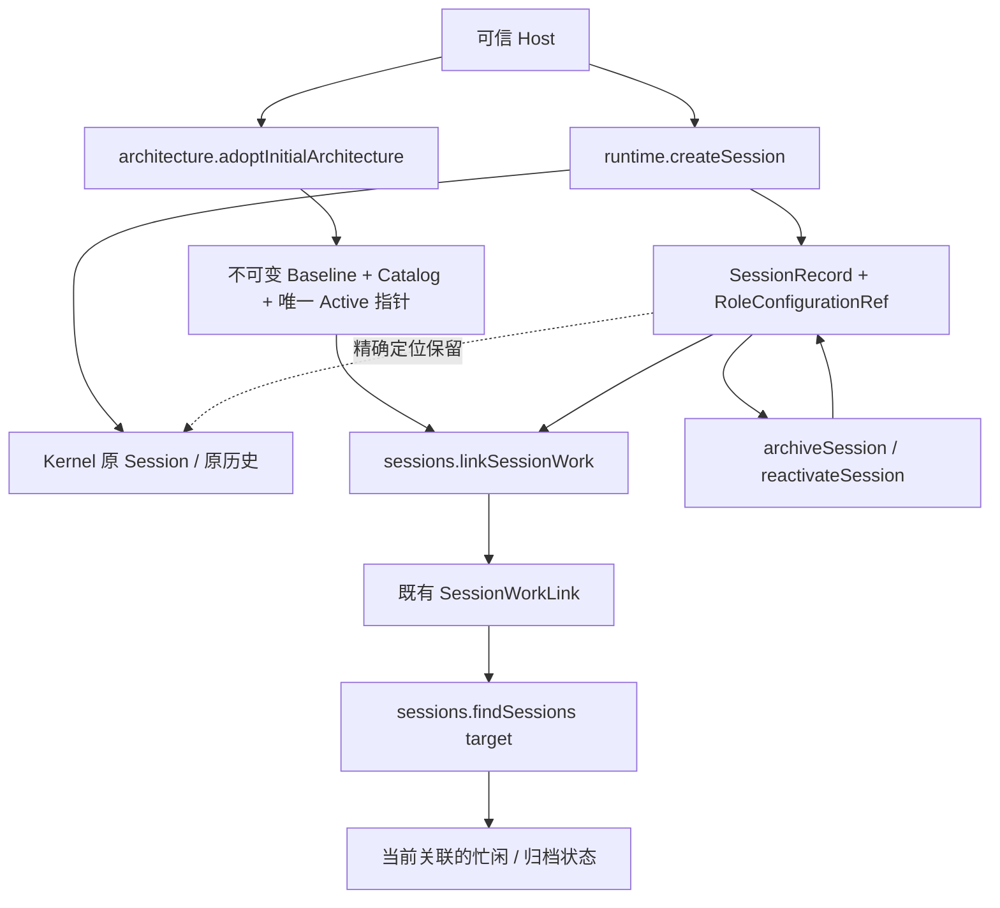

# A1：正式架构目录与 Session 图关联验收

日期：2026-09-25。范围：干净目标工程 `coding-platform/next`。结论：**A1 子集通过独立验收；75 个测试文件、719 项测试全部通过。完整 A 路径、Agent 执行、咨询、编排与控制恢复尚未完成。**

## 1. 本批解决的问题与完整目标

本批先复核用户指定的[双图/生命周期对齐稿](../../AGENT-GRAPH-LIFECYCLE-ALIGNMENT-2026-09-25.md)、[编号原话](../../agent-platform-user-replies-numbered.md)，以及当前 PRODUCT、ARCHITECTURE、原始对话。采用的约束已回填[实施方案 §0](../IMPLEMENTATION-PLAN.md)、[意图与决定](../intent/INTENT-AND-DECISIONS.md)和所属模块文档，不另造一套产品架构。

之前已有图算法、RoleSpec、Session 目录与历史定位，但 Module 关联缺正式写者，目标发现仍从工作区候选筛选，archive/reactivate 没有生产操作。因此“图结构已有”不能表示“Agent 已能在图上工作”。本批补齐这组具体接点，沿用 SessionRecord + RoleConfigurationRef + SessionWorkLink；没有新增永久 Agent 表、管理模块或第二套历史库。

完整工作保留四条路径，A1 只关闭其中已验收部分：

| 路径 | 本批后状态 |
| --- | --- |
| A：沿双图找到工作实体与事实 | 正式初始目录、Module/Task 关联开闭、定向发现、显式归档/重新启用和重启保留已交付；后续正式架构演进、完整图上使用路径仍开放 |
| B：装配并执行，回写事实与状态 | 已有 Task Claim、角色解析、材料读取、模型工具循环与历史定位供复用；实际 prepare/进入/观察归约/释放尚待接通 |
| C：沿图咨询与多 Agent 协作 | Session 定址消息、咨询受理、秘书/参谋/书记 Skill 与生产 Workflow 尚待实现；可以并行准备协议与 Skill |
| D：控制恢复与重组 | 暂停/取消/恢复、交接重组及相应图关联维护仍待实现；Kernel 内部已有能力不等于平台接线完成 |

图关系提供导航、事实索引和编排提示，不据关联本身新增执行权限或项目全局锁。组织决策留给受 Skill 约束的 Agent；WorkGraph 维护正式关系和状态；Runtime/Kernel 执行副作用。没有把 TaskGraph 改回事前证明并行安全的调度器。

## 2. 已交付的真实调用路径



图中是生产调用/数据关系，不是新增模块 DAG。目标仍为五模块、八条允许依赖边；当前实际静态依赖为五条。

| 入口 | 实现与行为 |
| --- | --- |
| `architecture.adoptInitialArchitecture` | [catalog-service.ts](../../../coding-platform/next/src/core/work-graph/architecture/catalog-service.ts) 复用 RecordStore，一次提交 baseline、catalog、active 指针与事件；精确 Project/Workspace 版本守卫，禁止覆盖已有 active。只支持初始采用 |
| `architecture.readArchitectureRevision` | current 或固定 revision 精确读取；当前指针与不可变记录核对一致读窗口。旧 baseline 没有 catalog 时返回 null，不猜空目录 |
| `sessions.linkSessionWork` | [session-lifecycle.ts](../../../coding-platform/next/src/core/work-graph/sessions/session-lifecycle.ts) 开闭 Module/Task 关联。新关联验证正式目标；关闭旧关联允许目标已从当前 Plan 移除。同事务递增 Session revision 和关系 revision，与 Claim/archive 协调 |
| `sessions.findSessions({target,...})` | [session-directory.ts](../../../coding-platform/next/src/core/work-graph/sessions/session-directory.ts) 使用 target + relation 复合索引，三条有序流合并并跨页去重。仅 until=null 的当前关联进入目标发现；includeArchived 独立控制 Session 生命周期 |
| `sessions.archiveSession/reactivateSession` | archive 拒绝当前占用或未交接的 active responsible Task/Work；Module 关联保留。归档后默认发现隐藏，精确读和包含归档的发现仍可用。reactivate 不清除健康状态，不创建 Kernel Session，不执行模型 |
| 组合根 | [create-platform.ts](../../../coding-platform/next/src/composition/create-platform.ts) 注册真实 schema、共享现有后端并装配全部新入口；新调用纳入关闭排空。没有让旧平台服务成为目标工程运行依赖 |

初始 Session 注册和后续关联变更共用 [session-targets.ts](../../../coding-platform/next/src/core/work-graph/sessions/session-targets.ts) 的 Task 目标核验，并共用正式 Module reader；没有两套不同的目标规则。没有 initialLinks 的 Session 仍可在正式架构建立前创建。新增/激活 WorkContext 关联仍明确 unsupported；既有关系允许显式关闭，不以缺少目标提供者阻止退出。

## 3. 骨架中审、并行施工与独立复核

实际遵循：**Astra 架构/接口 → DSH 4.1F 骨架和测试 → Astra 中审冻结 → DSH 并行实现 → Astra 独立复核 → 物理隔离测试。**

- [骨架任务](../tasks/A1-graph-session-skeleton-prompt.md)完成后，主审修正错误测试前提、精确版本 pin、重放/游标和读取成本要求。中审时类型检查通过，76 项骨架测试为 69 红/7 绿，失败是明确 unsupported；没有以红测试为实现通过证据。
- [中审记录](../tasks/A1-middle-review.md)批准后，DSH 分别在 [catalog](../tasks/A1-catalog-implementation-prompt.md) 与 [session](../tasks/A1-session-implementation-prompt.md) 两个不重叠写范围并行实现，契约和测试只读。主审负责真实组合根和独立反例，不接受实现者自称验收通过。
- 复核发现并修正：幂等首次 lookup 未命中之后另一请求已提交的重放窗口、后续归档/关闭使同请求错误遭拒、current 指针变化造成混合事实、查询读取水位不一致、JSON 转义身份排序与 Store 不一致、同字段重复创建多个索引。
- Session 重放最终统一在 attempt 拒绝出口精确复查原提交，避免每个错误分支逐个打补丁；正常成功路径不新增这次读取。不同输入仍维持幂等冲突，取消不被改成成功。

这次复核没有要求再造一层事务、Agent 目录、历史数据库或通用 Manager。DSH 的作用域审计没有越界；受控刷新和导入摘要保存在本批证据目录。

## 4. 验证结果

| 验证 | 结果 |
| --- | --- |
| 物理隔离测试 | **75 文件 / 719 项 PASS，0 failed**；旧基线为 68 文件 / 620 项，本批新增 99 项行为测试 |
| TypeScript / 独立 build / 编译入口实际加载 | 全部通过 |
| 模块边界 | 5 模块 / 8 条允许边；实际 5 条；通过 |
| Kernel 冻结补丁再现 | 四项构建产物哈希均一致；A1 没有改 Kernel 补丁 |
| Memory 与 SQLite | 初始采用、关系、生命周期、幂等/竞争、故障回滚和分页反例通过 |
| SQLite + 真实 Kernel 组合根 | 目录前创建、两种关联入口、归档/重启/重新启用、原事件重放与关闭排空通过 |
| 可运行演示 | build 后实际运行，退出 0；[演示日志](evidence/next-a1-graph-session-2026-09-25/demo.log) |
| 原工程保护 | **8,827 个受保护文件，0 变化**；包括旧源码/测试及旧 Kernel 参考范围 |

物理隔离命令：

```sh
source /home/hyh001/projects/coding-platform/.toolchain/env.sh
cd /home/hyh001/projects/coding-platform/coding-platform/next
node --run verify:isolated
```

验证器复制 next 到没有旧平台源码的临时目录，只连接已安装的第三方依赖，再完成全部检查。详细证据：[acceptance.json](evidence/next-a1-graph-session-2026-09-25/acceptance.json)、[完整日志](evidence/next-a1-graph-session-2026-09-25/isolated.log)、[源码/测试摘要](evidence/next-a1-graph-session-2026-09-25/accepted-source-hashes.json)、[保护与行数](evidence/next-a1-graph-session-2026-09-25/final-workspace-check.json)、[骨架冻结](evidence/next-a1-graph-session-2026-09-25/middle-freeze.json)。

关键独立测试：[catalog 竞争](../../../coding-platform/next/tests/work-graph/A1-catalog-independent.test.ts)、[关系/读取成本](../../../coding-platform/next/tests/work-graph/A1-independent-review.test.ts)、[Session 重放/查询窗口/排序](../../../coding-platform/next/tests/work-graph/A1-session-independent.test.ts)、[真实组合根](../../../coding-platform/next/tests/composition/A1-graph-session-platform.test.ts)。AT-06 的 A1 场景通过：空闲 Session 的模块关联、身份和已有 Session 历史保留；组合根没有实际执行 Run，包含执行后 Task/Run 证据链的完整 AT-06 仍待 B 补验。产品场景保持 partial 或未完整验收，不能用全量单元测试数替代产品路径验收。

## 5. 性能、代码量与适用边界

目标发现不再先枚举工作区所有 Session。每种 target 使用一个 target+relation 复合索引，按三种关系分别读有序流；游标只保存三路位置/结束标记和查询绑定，不保存无限增长的 seen 集。排序与 RecordStore 的 canonical JSON/UTF-8 键顺序一致。

独立读取计数用 64 个 Session、192 条目标关联、每页 5 项验证，单页 lookup 与 readMany 返回记录总量不超过 96。该断言包括所返回 Session 的关系卡片读取，是有限样本成本门禁，不宣称所有后端或所有历史规模都是常数时间。返回一个 SessionCard 时仍需读取该 Session 自身的关联；Memory 后端内部候选收集和未来更大历史仍可优化。

目标页要求相同 ledger 水位，数据变化时可返回 source_stale，由调用者重新查询；没有在本批新增 MVCC 快照服务。新数据库只注册每种 target 必要的一个复合索引；已有 SQLite 数据库可能保留旧表达式索引，本批没有声称完成旧索引清理或全库迁移。

| 统计口径 | A1 后 |
| --- | --- |
| next/src 生产 TypeScript | 164 文件 / **29,176 物理行** |
| 其中共享 contracts | 57 文件 / 3,789 行，包含在上项中 |
| next/tests TypeScript，包含 fixture/helper | 80 文件 / 19,235 行；实际测试文件为 75 个 |

相对上一批 26,716 行，生产源码增加 2,460 行，来源是新增已验收能力，不能宣称整个平台代码量下降。可证实的简化是目标查询消除工作区扫描、目标核验共用、幂等失败出口统一以及重复索引减少；没有据行数或局部计数宣称整体产品性能和复杂度都已降低。

## 6. 可运行演示

在 next 目录运行：

```sh
node --run build
node scripts/graph-session-demo.mjs
```

[演示源码](../../../coding-platform/next/scripts/graph-session-demo.mjs)只在自建临时目录 seed Project/Workspace，通过平台正式入口产生目录、Session、关系和生命周期记录。它展示同一模块发现两个独立 idle Session，归档后默认剩一个、包含归档仍为两个，重开数据库保留原历史，重新启用不改变 Kernel Session。默认仅清理自身临时目录，`--keep` 保留供查看。

演示使用模板角色引用，不调用模型，不声称 Role/Skill 已实际装配，也不提供完整产品 bootstrap。

## 7. 后续边界已经落入原模块文档

下一批 B 见 [AgentRuntime §7.1](../modules/core/agent-runtime.md)及 [WorkGraph §6.3](../modules/core/work-graph.md)：复用现有记录、原子工具和 Kernel，不让 DSH 自行补架构。源码核对确认以下接线需要在骨架/测试中表达，再经过中审进入实现：

1. 准备材料使用现有 Artifact/body 和 Run 引用/摘要，沿图精确读；不复制原 Session 历史，不让调用者传回的工具或根目录成为权限依据。
2. Kernel 已有可等待的 `before_model` hook，可作为实际进入与持久事实对齐的边界；`onConfiguration` 非等待回调、best_effort observer 都不能冒充可靠门禁。最终应由真实记录维护 WG12 定位，再推进正式进入。
3. 当前来源工具工厂要求 running/entered，而 RT3 先创建工具再启动 Kernel；需复用既有工具注册与惰性打开消除先后依赖，保留现有授权守卫，不新建工具系统。
4. Role/Skill 需要可信、版本化装配来源；现有 `ModelCallAccess` 的正式绑定/调用前检查也须实现，不因为参数可选就略过。
5. B 包含真实结束观察、Run/Attempt 归约和同 owner/generation 的释放，不能只停在一次 start。结束后仍能在架构图找到可咨询的 idle Session；Run 完成不等于 Task 已验收完成。

C 的 Session 定址消息与角色 Skill 可以并行准备；真正调用 B 的消费者在接口冻结后接入。D 控制恢复/重组、Memory、后续正式架构演进、Query 与 UI 等仍按完整计划推进。没有恢复永久 Work/Agent 身份、额外中间管理模块或“所有图依赖必须先满足才能并行”的旧限制。
