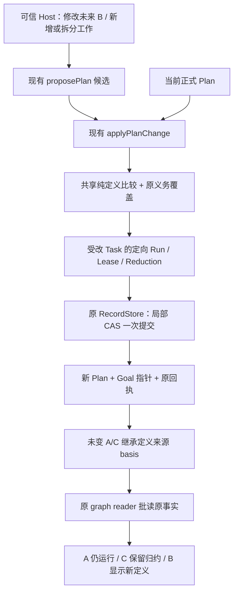

# B1 装配接缝与 W1 未来任务白板验收

日期：2026-09-25。范围：独立目标工程 `coding-platform/next`。**B1 与 W1 本批子集通过独立验收：78 个测试文件、726 项全部通过，物理隔离构建、类型、边界、Kernel 补丁再现和编译入口均通过。完整运行生命周期及 Agent 自动推进尚未完成。**

## 1. 本批完成的行为

按用户本轮收敛，继续使用现有五模块：生命周期、固定分组的角色/Context/工具，以及可编辑的未来任务白板。知识库和记忆不作为本批前置；不把 B/C/D 场景分别扩成新的管理系统。依据仍是 PRODUCT、ARCHITECTURE、原始对话和所属模块文档，实际复用入口维护在 [IMPLEMENTED-CAPABILITIES](../IMPLEMENTED-CAPABILITIES.md)。

| 子集 | 已实现并验证 | 尚不代表 |
| --- | --- | --- |
| B1 | 现有 `runObservedModel` 接受受信 Skill 配置与 Kernel Hook；冻结配置、保留缺省；源码工具可在第一次有效使用时打开，同一次执行复用并正确清理 | 正式 Role pin 已解析成 Skill、平台 prepare/start 已接通，或完整执行/释放完成 |
| W1 | 通过现有 propose/apply 接口修改、取消或拆分未来任务；新计划继承未变任务的执行状态与历史来源；旧图仍可读 | Agent 已能调用白板工具，或 Workflow 已自动生成、修改并推进任务 |
| 验收流程 | 两批均经过骨架与测试中审，再交 DSH 实现；独立反例与最终物理隔离由主 Agent 执行 | 以实现者自报通过代替独立验收 |

## 2. B1：复用真实 Kernel 装配与工具循环

生产修改限于 [observed-model-run.ts](../../../coding-platform/next/src/core/agent-runtime/observed-model-run.ts)、[exploration-tools.ts](../../../coding-platform/next/src/core/agent-runtime/exploration-tools.ts)、[project-source-tool.ts](../../../coding-platform/next/src/core/agent-runtime/project-source-tool.ts)。

- `skills` 复用 Kernel 现有配置：不传时保留 `coding-safety`，显式空列表保持为空。`controlHooks` 使用公开 HookPort，传入真实 Kernel 执行。
- 首次 await 前保存 Skill 参数、Hook 元数据及执行函数引用，保留函数 receiver；没有把函数或 Hook 闭包 JSON 克隆，也不承诺冻结闭包内部状态。
- `projectSource.openOn:'first_use'` 注册真实 `project_source`，有效调用时才通过原 factory/guard 打开。缺省仍保持既有打开时机；首次 Hook 暂停、不读源码、参数或路径被拒绝时不打开来源。
- 同一执行共享一次打开 Promise，同步抛错及异步失败均缓存；不因失败重试或回落另一源码工具。取消时排空在途操作，等待已开始的打开，再关闭实际来源一次。

独立测试 [B1-kernel-assembly](../../../coding-platform/next/tests/runtime/B1-kernel-assembly.test.ts)使用真实冻结 Kernel、SQLite 和本地模型替身，核对 Skill 内容进入实际请求、真实 Turn/Run 写入后的 awaited Hook、暂停零模型调用、配置并发修改、延迟打开与取消清理。首次候选被独立反例抓到同步 factory 重试、异步期间配置变动及取消后仍打开来源，已返修。主 Agent 另将 factory 调用安排到 Promise 回调，确保共享 pending 在调用前建立。

正式 `prepareExecution/startRun` 仍为 unsupported。下一步复用这些接缝装配真实 Role、TaskInput 和图引用，并接 WG entered、观察归约、相同 owner/generation 的释放；具体位置已写回 [Runtime §7.1](../modules/core/agent-runtime.md#71-b-下一批的接线冻结与验证要求2026-09-25)。

## 3. W1：未来、现在和历史共用原 Plan 结构



图是本批调用关系，不是新增模块 DAG。W1 只在可信 Host、active source、v2 候选的窄分支采用；新 Plan ID 未使用且计划版本为 source+1。首次计划、旧 v1/v2 读取和原接口保持兼容。

关键实现位于 [plan-service.ts](../../../coding-platform/next/src/core/work-graph/tasks/plan-service.ts)、[plan-validation.ts](../../../coding-platform/next/src/core/work-graph/tasks/plan-validation.ts)、[plan-readers.ts](../../../coding-platform/next/src/core/work-graph/tasks/plan-readers.ts)、[plan-commit-compiler.ts](../../../coding-platform/next/src/core/work-graph/tasks/plan-commit-compiler.ts)及唯一新增纯 helper [plan-task-basis.ts](../../../coding-platform/next/src/core/work-graph/tasks/plan-task-basis.ts)。

- 从未领取/执行且没有正式归约的任务才可修改执行定义。旧 taskId 保留，取消/取代由 disposition 表达；新增任务 phase 必须 pending。
- 原义务的身份、正文、强度和验证要求不变；required 义务继续有有效 required 承担者。既有任务不能换角色，新增任务只能选原已授权角色；验收协议、治理 pin 和原来源不被悄悄替换。
- 提示关系及展示层级不算执行定义，连接运行中的任务不会重置其状态来源，也不会变成并发锁。
- accepted v2 的内部 `taskStateBasis` 保存每个任务的绝对定义来源；未变任务继承，修改/新增任务指向新 Plan。Draft 不能填写它，不递归遍历全部计划历史。
- reader 批量核对实际 basis 来源和 Run/Reduction 所属 Plan，同 Goal、版本顺序、任务定义及验收语义一致才继承。缺失或损坏的声明来源返回 unavailable；旧不可解析执行事实保持保守阻塞，不猜成 pending/free。
- 显式旧图排除后来版本的 Run 及其全局 Lease；历史投影不提供当前领取许可。当前 ready/claim 仍消费 active Plan。
- 编辑与领取以 Goal revision 和受改 Task 的 Lease/Reduction 条件关闭竞争，不使用全账本水位作 W1 提交门槛；无关历史追加不会使编辑失败。同身份竞争通过一次精确回执复查恢复原结果，后续计划或重启不改变旧回执。

没有新增表、Store 事务层、公共 Port 或并发管理模块。Run、Reduction、Session 和原历史不复制、不改写。每 Plan 构建一次 basis/定义 Map，输入按 consumerTaskId 一次分组，避免每任务重扫整个计划；必要 Plan 按唯一引用批读。原整图 reader 的一致读重试策略保留，本批未声称消除所有全局水位影响或所有历史读取成本。

## 4. 审阅与测试去重

两条施工线均遵守 **Astra 定架构/接口 → DSH 骨架与测试 → Astra 中审冻结 → DSH 实现 → Astra 独立审阅 → 物理隔离测试**。DSH 宽读既有资料，写入由隔离文件 scope 限制。W1 的中审修正了错误的旧 Plan 断言、无效并发 fixture 和未真正覆盖原义务的反例；测试正常编译并因缺失行为失败后，才授权实现。

W1 第一版自检 8 项通过，独立补强既有 scenario 7/8 后发现角色改派与实际 basis 来源验证遗漏。并行源码审阅还发现平方级扫描、新任务 phase 和验收协议约束缺失，返修后再独立通过。没有据绿测试跳过接口语义审核。

本轮合并了 **6 个重复测试和 1 个无操作的 Memory reopen 分支**，保留各自独有风险的断言；新增 B1 6 个、W1 8 个场景。最终总数为 **719 − 7 + 14 = 726**。测试工具支持合并多个 next 检查集合，去重文件后只启动一次 Vitest；后续可直接使用 `next-kernel-assembly`、`next-future-plan`，不再为每批重复注册同套完整测试。

W1 的 C 归约与部分 Run/后续 Plan 是明确标注的只读夹具，不冒充结果归约 writer。SQLite 组合根的未来修订、再修订、旧回执重启重放及两种真实 Claim 竞争顺序使用正式入口。没有用这些夹具宣布平台自动执行完成。

## 5. 最终证据与规模

| 验证 | 结果 |
| --- | --- |
| 新工程物理隔离 | **78 文件 / 726 项 PASS，0 failed**；复制副本没有旧平台源码 |
| typecheck / build / 编译产物创建关闭平台 | 通过 |
| 模块边界 | 5 模块 / 8 条允许边，实际 5 条，通过 |
| Kernel 补丁再现 | 四项冻结产物哈希一致；本批未修改 Kernel |
| 原工程保护 | **8,827 个文件，0 变化** |
| next/src TypeScript | **165 文件 / 30,464 物理行**，其中 contracts 57 文件 / 3,810 行 |
| next/tests TypeScript（含 helper） | 82 文件 / 20,650 物理行；实际测试文件 78 个 |

相对 A1 的 29,176 行，生产源码增加 1,288 行，用于新增已验收能力。本批可以证明复用现有循环、图与事务，以及消除特定重复扫描；**不能据此宣称整个平台代码量或总体复杂度已经下降**。主审删除了两个无消费者的单任务包装函数及重复 basis 形状校验，保留一套分组实现。

运行入口：

```sh
source /home/hyh001/projects/coding-platform/.toolchain/env.sh
cd /home/hyh001/projects/coding-platform/coding-platform/next
node --run verify:isolated
```

证据：[acceptance.json](evidence/next-b1-w1-2026-09-25/acceptance.json)、[物理隔离日志](evidence/next-b1-w1-2026-09-25/isolated.log)、[最终源码摘要](evidence/next-b1-w1-2026-09-25/accepted-source-hashes.json)、[保护及行数](evidence/next-b1-w1-2026-09-25/final-workspace-check.json)、[B1 独立检查](evidence/next-b1-w1-2026-09-25/b1-independent.log)、[W1 独立反例](evidence/next-b1-w1-2026-09-25/w1-counterexamples.log)、[W1 修正后检查](evidence/next-b1-w1-2026-09-25/w1-independent.log)。

## 6. 下一步与未完成范围

下一施工面是既有 AgentRuntime/WorkGraph 的正式 Role 与本次 Context 装配、fresh 进入、原历史观察、状态归约及同代次释放；Lease 的 released 记录必须保留版本痕迹，不能删回 absent，使 W1 的未来任务竞争证明继续成立。需要一起核对每次模型调用的正式许可，不能因 RT3 可直接调用就省略该契约。

白板的基础编辑操作已可供后续工具封装复用；Agent 使用这些工具生成、调整和推进未来工作，以及定向通信、咨询、角色 Skill、控制恢复和人用入口，继续在现有模块实现。完整 B、R3c/R4、R5/R6 尚未关闭。知识库和记忆留接口与来源原则，按用户本轮要求不作这些交付的门禁。
