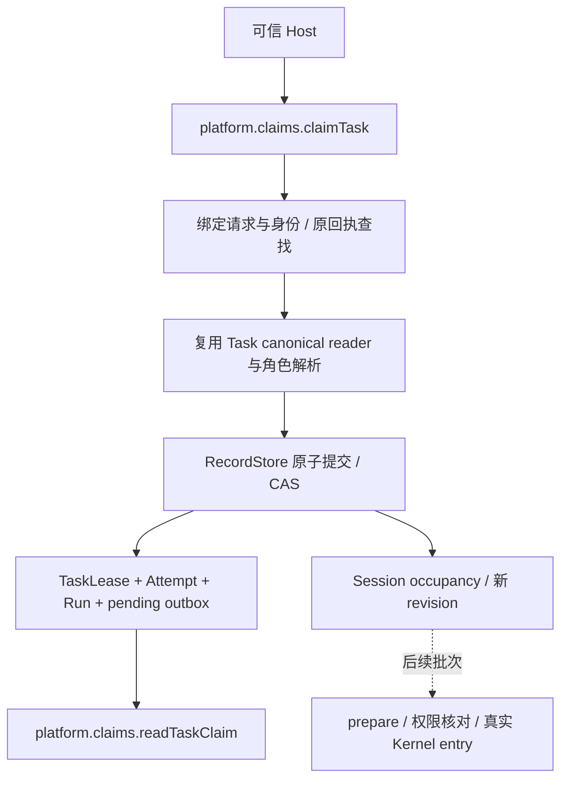

# next R4c.1 Task 原子领取：独立验收

日期：2026-09-24。施工位置：`coding-platform/next`。结论：**本批窄范围通过；完整 R4c 未完成。** 前序基线是 [R3c 关系与精确输入](next-r3c-relations-2026-09-24.md) 的 57 文件 / 383 项通过；本批物理隔离验收为 **60 文件 / 422 项通过**。

## 已交付的真实调用链

- `claimTask` 根据当前受理的 Goal/Plan、Task、角色和已有可用 Session 领取工作；同一事务写入五种记录，返回可持久读取的 `TaskClaim`。Run 初始为 `starting`，没有执行授权，也没有启动模型。
- TaskLease 的不存在 CAS 阻止首次重复领取，Session revision CAS 阻止同一 Session 被重复占用。不同 Task、不同 Session 可在同一工作区并行；不修改 Goal/Workspace/Plan，不以全局 ledger 水位作为提交锁。
- 不检查前驱整个 Task 完成，不查询预测范围，不预占未来资源，不全量打开未来材料。图继续提供关系与查找信息，真正消费时再验证输入。
- 同一请求重试恢复原事件里的 IDs、generation 和 cursor；同时首次提交的两个相同请求也返回同一原结果。后来 Session 状态或 deadline 改变，不影响合法原回执重放。
- `createTargetPlatform` 已提供 `claims`，关闭会等待正在进行的领取；真实 Kernel Session 创建后领取、关闭、SQLite 重开、读取原回执和占用已贯通。领取前后 Kernel 原历史仍只有创建事件。

## 具体复用与边界

| 已有能力 | 本批复用方式 |
| --- | --- |
| Plan canonical reader / eligibility | 只增加可选 Task 定向参数及 Run-by-task 精确索引，定向和整图查询共用同一归约；任何旧 Plan 的 Run 也阻止再次首次领取 |
| RoleConfigurationService | 同一解析流程内部额外返回精确版本 guards；保持公开解析接口，缺读不能当作记录不存在；不因空权限列表产生执行许可 |
| Session / Run / TaskLease codec | 直接复用；新编码仅限 TaskAttempt、DispatchOutboxEntry、TaskClaimed 事件 |
| RecordStore | 复用现有 Memory/SQLite 事务、CAS、幂等和索引；没有新增事务、Repository 或锁管理层 |
| 原 `revisionAssignments` | 迁入原纯函数，保留 `assignments ?? origin?.assignments ?? []`；显式空数组不会回退到历史 assignment |
| 现有装配/Session 测试 | 扩展真实创建、关闭排空、重开链，而非另造假装配 |

领取接口位于 `next/src/core/work-graph/tasks/claim-contracts.ts`，具体冻结语义在 [WorkGraph §4.2](../modules/core/work-graph.md#42-r4c1-当前冻结的-task-领取接口2026-09-24)。`generation === sessionRevision`，二者都是领取后的新 Session revision。后续合法 Run 写入和占用释放必须与这些正式记录协调，不能旁路创建另一份权威状态。

## 施工顺序与主审修正

本批实际执行 **Astra 架构/接口 → DSH 4.1F 骨架/测试 → Astra 审核冻结 → DSH 实现 → Astra 独立审阅 → 物理隔离测试**。本地 DSH 使用同一个 Session `session-07e8dba0-e100-4a55-a202-1cc8b86e0733` 分阶段施工，先写骨架/测试，收到冻结结果后才实现。实现阶段只开放四个生产文件；测试、契约、装配和底层 Store 只读。

中间审核没有省略：修正了将「提交尝试次数」误当「提交成功次数」的并发测试，使用真实 SQLite 两连接及 commit barrier；无关提交移到读取后、正式提交前；生命周期反例使用各自独立 Session，避免先前 archived 状态掩盖其他检查。主审补入角色版本竞争、旧 Plan Run、取消、原回执与装配边界。骨架类型检查通过，新增正式行为为预期 RED，未用 fixture 错误冒充红测。

实现审核发现并已修复：

1. generation 与 Session revision 的错误偏移；现有断言补强后由实现修正。
2. 定向读取复制了另一套归约，并与整图结果不一致；删除重复路径，回到同一 fold。
3. 角色读取的 `unaccounted` 被解释为不存在；恢复缺读拒绝和精确版本守卫。
4. 非 JSON 元数据与循环对象可能抛穿 Port；限定 JSON 输入边界拒绝，未吞掉 Store 异常。
5. 原回执事件的 cursor 未与 receipt 核对；补齐对应关系验证。

所有新增反例均由主审记录并重新冻结、只读刷新到 DSH lane，没有让实现者自行修改测试。细节与冻结哈希见 [中间审核](evidence/next-r4c-claim-2026-09-24/skeleton-review.md)。

## 独立验证

| 项目 | 实测结果 |
| --- | --- |
| `node --run verify:isolated` | 退出 0；物理复制 next，不复制旧平台源码，只链接现有第三方依赖 |
| 全量测试 | **60 文件 / 422 项 PASS**，无跳过；本批新增三个测试文件、39 项反例/行为检查 |
| 类型、构建、模块边界 | PASS；5 模块、5 条实际依赖、8 条允许依赖 |
| 构建后的真实装配 | 实际 import 创建/关闭平台通过 |
| Memory / SQLite | 两后端领取/重放/失败无部分写入；SQLite 双连接竞争和并行实测 |
| 原工程保护 | 原 `src`、`tests`、Kernel `src` 共 **1,313 文件零变化** |
| 冻结测试与契约 | 121 文件哈希一致 |
| DSH 最终 scope audit | 四个授权生产文件变更，越界 0，原工作区未被 DSH 改动 |

关键并发检查包含：同 Task 不同 Session 只有一个首次领取成功；不同 Task 同 Session 只有一个占用成功；不同 Task/Session 两个提交均成功；失败方没有新 Run/Attempt/outbox 或错误占用；角色配置在读取后改变导致原子提交冲突；同请求同时 miss 后依旧恢复同一结果。Task/Query 共同受理尚未实装，不将已有 query occupancy fixture 的拒绝检查说成完整跨入口验收。

完整日志：[isolated.log](evidence/next-r4c-claim-2026-09-24/isolated.log)。范围/导入与最终哈希也保存在同一证据目录。

## 代码规模与剩余任务

当前平台生产 TypeScript **147 文件 / 24,412 物理行**，其中共享 `src/contracts` 为 56 文件 / 3,772 行；测试 TypeScript（含 helper）63 文件 / 12,819 行，另有一个 34 行 mjs 测试。冻结 Kernel 不计入平台生产行数。

相较前批，生产源码净增 **1,112 行**，测试 TS 净增 1,162 行。本批新增功能，不能宣称总行数下降或端到端性能提升；复用和删除中途重复归约是结构证据，精确索引与无全局提交锁是已验证机制。未做模型执行性能基准。

下一步直接消费已持久化的 TaskClaim，继续 R4c 的 `prepareExecution → authorizeRuntimeEntry → Kernel entry → observation`，然后接 Query 与释放/恢复；不得重新领取或重建本批事实解析。需复用现有模型循环、连续 Session 转发、角色/材料 reader 与 source tools，并补正式授权 provider。Query、观察入账、自动释放、重入队、完整 Runtime/Workflow/UI 本批均未完成。当前 deadline 过期不会自动释放 TaskLease，也不能据此触发重跑。

本批没有修改旧业务数据库、提交或推送代码、安装依赖。后续入口已同步至 HANDOFF、批次计划、WorkGraph 模块页与 next README；历史验收报告保持原版本。
