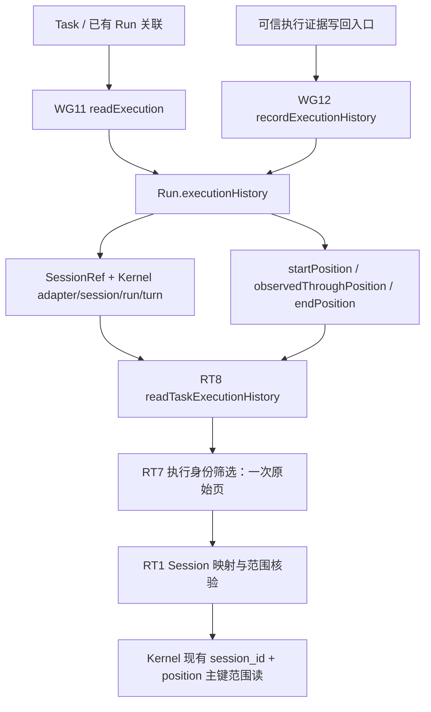

# R4c.2b 图定位历史修复与 R4c.2c 源码事实接线

2026-09-25。状态：**本批范围独立验收 PASS：68 文件 / 620 项测试通过**；完整执行平台仍未完成。施工位置仅为 `coding-platform/next`。

## 1. 修复的实际问题与结果

原 R4c.2a 能按执行身份筛选一页，却仍从 Session 开头寻找；Kernel 再将全部历史物化后切页。用户要求原子操作复用任务图、架构图的数据结构，本批直接在正式 Run 中保存执行历史定位，不另建 History DB 或图模块。



`recordExecutionHistory` 与 `readTaskExecutionHistory` 已接组合根；正式 Runtime prepare/entry/增量观察尚未接通，因此图定位由可信调用者提交，不能声称每次真实模型执行已自动维护区间。无 locator 明确 unsupported，不解释为“未执行”，也不退回全量扫描。

## 2. 数据与所有权

- `RunSnapshot.executionHistory` 保存 SessionRef、Kernel adapter/session/run/turn、包含式起点、单调核验水位和可空终点。起点与身份不可更换；终点一旦设定不可改写。Session 当前占用不限制历史查证。
- WorkGraph 复用 WG11 正式读取与 RecordStore CAS/幂等/事务，在一事务中更新完整 Run、事件和唯一 Kernel execution 绑定；不修改 Run 阶段、Lease、Session 占用。重放核不可变 receipt/event，恢复原响应而非重新读取当前状态。
- AgentRuntime 只组合现有读取器。每页一次 WG11、一次 RT7；Graph 不重复解析 Kernel 正文，RT7 不循环凑满命中数。续页固定上界，索引增长不扩大既有页窗口；来源截短或关联变化拒绝。
- Kernel 原历史仍为原文来源。只改其 `read`，复用原主键；header、tail 和范围查询位于一个只读快照。校验本页连续性与位置身份；范围之外的损坏正文不要求本页先解析。append/replay 的逻辑未重写。
- 游标不是权限：每次仍核 Host/作用域和正式映射；RT1 确保 lower−1 ≤ position ≤ upper，末条真实 cursor 续读为空末页且仍查来源完整性。

## 3. 性能证据与边界

独立 SQLite 测量：Session 有 **361 条记录**，Kernel 读取最后 **3 条**实际取回 **5 行**（header 1、tail 1、页正文 3）。EXPLAIN 验证 tail 与页查询使用现有主键索引。证据见 [kernel-range-cost.json](evidence/next-r4c-history-locators-2026-09-25/kernel-range-cost.json)。这是单次 Kernel `read` 的数据库读取量；图路径另有正式事实读取以及恒定 Session.created 核验，不等于整条图查询总共仅 5 行。

RT1 删除 MAX_SAFE_INTEGER 首次预读；非头页仅额外核验位置 1。Kernel 范围成本随本页大小增长，不随 Session 全部正文增长。没有测量端到端模型耗时或 token 节约，不据此声明固定倍数提速。WG11 仍返回完整 Plan，处理成本随 Plan 大小增长；Query 来源兼容路径仍有事件扫描，后续按真实消费者补精确关联。

Kernel 补丁源位于 `next/vendor/coding-agent/patches/storage/adapters/sqlite/sqlite-stores.ts`；`next/scripts/build-kernel-patch.mjs --check` 从源重建并比较 JS、声明与映射四个文件。隔离验收纳入此检查，避免只改 dist。原 Kernel 源码保持只读。

## 4. R4c.2c SourceAuthority 组件接线

```text
Memory / SQLite RecordStore
    → 已有 createMaterialRecordReaders.authority
    → SourceSnapshotReads 窄适配
    → 已有 source-capture-access 当前资格检查
    → WorkspaceTools / 真实文件读取
```

支持 Workspace、Run、QueryRun 的完整 ref 精确读取；每次只委托既有 reader 一次，无新 Store、codec、缓存或扫描。ReviewWork / QueryJob provider 未实现时返回 unsupported；损坏/不可用与真正 not_found 分开。Work consumer 只需要 load；Query origin 路径仍要求真实 events，不用空 events 模拟。

consumer 对身份种类与实际消费的 envelope 身份/权限字段作窄校验。真实 SQLite fixture 证明 starting 不授读取、可信 running 记录可用原 WorkspaceTools 读取、撤销权限后拒绝且不进入文件 I/O。这是组件链验收，可信种子不代替正式 entry/授权受理。组合根尚未对外提供正式 startRun。

## 5. 施工与审核

采用 Astra 架构/契约 → DSH 4.1F 骨架/测试 → Astra 审核冻结 → DSH 实现 → Astra 独立审阅/反例返修 → 物理隔离验证。索引 writer、Kernel 范围读与 Runtime 图接线按文件范围并行；源码事实接线复用已冻结接口继续。每个 DSH lane 具有只读文档/测试与生产文件白名单；修改测试由主审完成并记录 manifest 哈希，生产返修延续原 DSH Session。

中间与实现审阅实际修正：receipt 重放版本矛盾；Kernel WAL 读取快照与坏 tail key；RT1 下界越界与终点续页兼容；源码未知 principal 和持久 envelope 缺身份。不是依据 DSH 自报测试直接验收。

## 6. 最终验证

物理复制 next（不复制旧平台源码）后完成 Kernel 补丁四项产物重建对比、类型检查、构建、68文件/620测试和编译后平台创建/关闭；全部通过。边界保持5模块/8允许边，实际5条边。完整[执行日志](evidence/next-r4c-history-locators-2026-09-25/isolated-final.log)与[机器结论](evidence/next-r4c-history-locators-2026-09-25/acceptance.json)可复核。

专项包括区间写入66、Kernel范围20、Graph新测试16、Source新测试44、组合根1，共新增147项；此前473项也全部保留通过。Source相关独立复测51项包含既有7项。Kernel测试包含WAL并发快照、页内/页外损坏、unsafe tail与范围性能；图测试覆盖真实持久写入→Kernel读、增长续页、截短、跨身份、取消和关闭排空。

最初直接并行运行两个专项出现SQLite fixture超时（Graph13项、Source8项），原始日志完整保存为各证据目录的 `*-first-integration-timeouts.log`。没有改超时阈值或为重跑修改生产逻辑；随后使用文档规定的工具链，Source串行51项和完整隔离620项通过。语句耗时复测单例未复现慢语句；未证明首次失败根因，不把它结论化为环境性。只读锁审查未发现新增嵌套事务，但既有Store首建每条DDL独立提交是后续可审的成本点，本批未扩范围改它。

[原工程保护](evidence/next-r4c-history-locators-2026-09-25/protected-after.json)：8,827文件零改/删/增。next生产TS现157文件/26,716物理行，其中contracts57文件/3,789行；测试71个TS文件/17,263行（68个测试文件，另外为辅助代码）。对上一25,234行新增1,482行，实现新能力，不宣称本批总行数下降；实际减少的是历史读取量和重复实现。[计数](evidence/next-r4c-history-locators-2026-09-25/source-counts.json)不含Kernel冻结产物。

## 7. 下一步与未完成

继续在已存在的 AgentRuntime 内接 `TaskClaim → prepare → 正式入口受理 → 现有 runObservedModel/Kernel → 原历史定位写回`，复用 WG11/WG12、RT3/RT7/RT8 和 Source reader。不得再造图、上下文总管、扫描式事实源或另一套执行历史。进入前后状态、幂等与未知执行窗口仍须冻结具体协议并先审骨架/测试。

Host current 材料来源 pin、真实工具/模型授权、Query/Reviewer 未迁事实、自动观察与归约/释放、R3 其余能力、R4 其余生命周期、R5 Workflow、R6 UI 均未因此完成。架构图现有邻域/反向影响/比较/SCC 继续复用；本批没有把结构关系变为并行硬锁，也没有改图模块划分。
