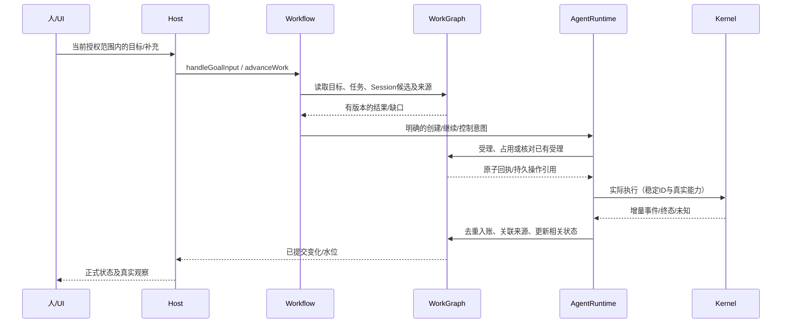

# 贯通流程、Host装配与UI接线骨架

**最新独立仓库验收：124 文件 / 1,102 项通过（exit0）。** 本次包含最终 graph/history UI 和独立目录构建脚本；Kernel 补丁再生、边界、Node/UI 类型、构建、编译入口和受 token 保护的 Host smoke 均通过。[独立验收记录](../reviews/evidence/standalone-2026-09-27/verification.json)。本轮[有界 completion audit](../reviews/completion-audit-2026-09-27.md)已完成：仍有真实实现阻塞与验收缺证；下方较早报告保留其当时范围。

> 独立仓库说明（2026-09-27）：本仓库根即原 `coding-platform/next`，文档位于 `docs/`；当前继续入口见根 `CONTINUE.md` 与 `AGENTS.md`。旧证据、任务书中的绝对路径和 scope 只描述当时工作区，不能直接执行。用户已从独立 main 恢复并完成有界审计；本轮真实模型接入的非语义错误修复已验收并停止，尚未宣告整个 MVP 完成。

**当前状态（2026-09-27）：本轮真实模型接入验收已通过，按用户要求停止施工。** [有界审计](../reviews/completion-audit-2026-09-27.md)之后，[R5b 输出契约](../tasks/R5b-live-model-response-contract.md)已完成两阶段 DSH、中审及两文件导入；独立相关 4 文件 / 4 项、类型与构建通过。[最终真实 DeepSeek 验收](../reviews/evidence/standalone-2026-09-27/e01-live-deepseek/result.json)完成 12 次模型调用、12 次工具完成，模型/工具错误均为 0；两个 Work 复用同一 Session 实际改文件，三次检查 PASS，正式 Goal COMPLETED。真实浏览器展开完成回执并读取 Query 原历史后，模型调用数仍为 12。本限定路径没有再出现“非语义”错误；不继续其它模块，也不据此撤销既定 MVP 余项或宣告整个 MVP 完成。

[受控 coding 路径](../reviews/evidence/standalone-2026-09-27/e01-controlled-coding/result.json)已补证：原生产入口完成两次真实文件编辑、三次实际行为检查及正式 Goal COMPLETED。该证据使用受控 provider，初始化经正式 HTTP owner 完成，不代表真实模型、完整 UI bootstrap 或完整 MVP。

独立根 runner 已实际运行 [Work-control Stage1](../tasks/R6-work-control-consumer-skeleton.md)，骨架中审未发现必须返修项；候选仍只在独立 lane，未导入、未进入 Stage2，因本轮范围收窄保持 STOP。其余返工、控制/恢复、并行、换手、变更/治理和完整项目隔离缺口按原审计保留；A1 旧 lane 不导入，R3g 不自动派发。

2026-09-27：用户行为、首条E2E与产品MVP验收边界见[MVP-BEHAVIOR](../../MVP-BEHAVIOR.md)。正式完成、Workflow、Query/Answer、初始Plan、Session/mailbox与生产UI布局已导入；R4.3a/R4.3b及R6调查/规划执行入口也已导入，真实CUA一键Query→Plan→两Work→checks→正式Goal COMPLETED已通过。完整MVP/UI、恢复/维护、复杂编排与最终产品切换仍未交付；Task→当前Run/原Session/原窗口与完整Session历史消费者已最终导入并完成真实浏览器验收，精确证据见[交接](../HANDOFF.md)。

**提取前隔离历史：124 文件 / 1,102 项通过（exit0）。** 该副本包含R4.3b与R6执行入口最终导入，以及[W2一行机械调用次数断言删除](../reviews/evidence/next-b2-2026-09-26/r4-r6-w2-fixture-amendment.json)；Node/UI types、构建、7/8边界、7源/28产物逐字再生、编译composition与真实token保护Host smoke均通过。见[结果](../reviews/evidence/next-b2-2026-09-26/r4-r6-isolated-result.json)、[通过日志](../reviews/evidence/next-b2-2026-09-26/r4-r6-isolated-recheck.log)及保留的[首次失败日志](../reviews/evidence/next-b2-2026-09-26/r4-r6-isolated-final.log)。快照不含其后的graph/history骨架与实现，不能据此证明当前全部源码整体通过；本轮未重做旧8,827文件全hash比较，不沿用旧快照结论。

目标设计，2026-09-23。本文可以从头阅读理解一次真实任务怎样跨模块推进；各步骤的具体输入/结果类型和内部文件在对应模块页。流程中的函数名均是目标公开能力或明确注明的Host函数，不表示已接入生产。

## 1. 谁负责驱动

Host接收HTTP/UI请求，验证真实用户及项目/工作区范围，构造CoreCallContext。Workflow处理业务选择，WorkGraph提供正式结构读写，AgentRuntime执行已受理意图，WorkspaceTools处理文件来源，RecordStore处理物理持久。事件唤醒只推进有变化或已到期的对象；没有变化不启动模型，不定时重建全部图。



这一反馈不允许WorkGraph import AgentRuntime。AgentRuntime调用WorkGraph提交回流，Host消费结果再决定是否调用Workflow；没有注入一个“业务回调”隐藏反向边。

## 2. Host与组合根的文件责任

本表相对C，保留原迁移责任划分。**2026-09-27当前落点：** 新实现位于独立工程 `C/next`，已有唯一组合根 `next/src/composition/create-platform.ts` 的 `createTargetPlatform`；next 已有独立 HTTP/静态工作台及初始化、图、文件、Session/mailbox 入口；受信配置下的Query/Workflow有限执行消费者已接通，Task→当前Run/原Session/历史消费者已接通，完整控制UI仍待接线。Host 直接消费该组合根，不再新建表中的第二套核心装配，也不导入旧 `src/app/service.ts`、`server.ts` 或其业务服务。旧外部入口继续服务旧消费者，待完整切换后退出。

| 文件 | 目标职责/导出 | 当前真实来源与退出条件 |
| --- | --- | --- |
| `src/composition/platform-core.ts`（新增） | 按依赖顺序装配五模块，返回业务/查询/执行所需窄端口和统一close；不编写业务准入 | 从`persistent-platform.ts`提取模块构造；所有真实/测试装配迁完后删除重复构造分支 |
| `src/composition/persistent-platform.ts`（保留过渡） | 旧createPersistentPlatform/createProductPlatform签名映射至新装配；兼容旧消费者 | 旧Host/harness逐处迁入；不无限保留完整旧引擎对象与新对象两套实例 |
| `src/app/core-call-context.ts`（新增） | 从现有本地Host/token请求与runtime工具身份绑定CoreCallContext；做scope/身份一致性检查 | Host、work_run、query_run 分别绑定；普通 Run 读用真实 RunRef/RoleBinding，协作工具才要求对应 AgentPrincipal；模型参数不能提供actor/principal |
| `src/app/core-actions.ts`（新增） | 明确动作到Workflow/核心窄Port的路由与请求解析；输出既有兼容DTO或新版本DTO | 从service.ts动作分派迁移；不创建万能方法名透传API |
| `src/app/core-queries.ts`（新增） | 按用户展开范围读取图/Session/历史，组合纯查询结果和水位 | 从service.ts状态聚合迁移；不因请求一个面板读取全部日志/图 |
| `src/app/core-http-types.ts`（新增） | §7固定路由的JSON输入/结果类型，由公开Port类型派生；供UI type-only消费 | 不把Host上下文或内部资源句柄序列化；不在共享contracts反向import实现 |
| `src/app/service.ts`（保留/缩减） | 保持现有GUI服务调用面，调用上述两个适配器 | 原有业务分支迁入Workflow，领域状态读取迁WorkGraph，最后删除重复分支 |
| `src/app/scheduling/dispatch-wake.ts`、`durable-wake.ts`（复用） | 按持久待办/事件唤醒驱动；去重触发与重启恢复 | 不另建一个轮询LLM的调度器；接入新Runtime待执行消费后删除旧重复drive |
| `src/app/server.ts`（保留） | HTTP、安全输入边界、静态资源与服务生命周期 | 路由/端口/数据目录兼容；不直接操作RecordStore或Kernel日志 |

模块工厂导出与依赖对象的精确类型由各模块页定义。组合根的结构顺序固定为：RecordStore、WorkspaceTools→WorkGraph→AgentRuntime→Workflow→Host适配与唤醒。每个工厂只收到所需端口；RecordStore原始读写不出现在普通UI/模型工具对象里。

初始化：先打开已有存储并验证schema/版本，再构造模块；启动驱动前恢复未决操作和观察位置，最后开始接收新执行请求。不得启动后才发现无法读取历史格式。关闭：停止新唤醒和领取，按既有宿主语义关闭技术句柄、持久观察，再关闭底层资源；不能在close中伪造Task完成或释放尚未确认终止的写者。未确认结果按unknown保留供重启核对。

## 3. 路径A：没有baseline的新项目

1. 人已要求初始化/开发项目，Host记录原始请求和范围。Workflow区分解释、调查、草案和已授权实施；没有明确授权的新增范围才产生待决。
2. WorkspaceTools.readWorkspace/captureSourceChanges读取当前路径与文件。空目录是实际结果，不要求先有正式baseline，也不创建模型Run来满足读取前提。
3. 需要模型生成方案时使用明确配置的规划工作；输出候选任务/职责/关系和依据。WorkGraph.proposePlan及架构候选操作校验结构，候选不自动变成当前计划。
4. 在已有授权范围内采用计划；首次baseline记录第一份已采用架构，不是创建目录和形成草案的前置条件。任务和采用关系按同一版本生效。
5. 后续按路径B创建/选择Session并执行；UI区分“当前观测”“候选方案”“已采用结构”。

失败可定位：解析器不支持保留路径/文本能力与覆盖说明；候选有环返回具体环；版本变化重读相关对象；无baseline不形成反复要求baseline的死循环。对应状态机A6。

## 4. 路径B：连续修改同一模块

| 顺序 | 发起方→能力 | 必须传递/保存 | 不得发生 |
| --- | --- | --- | --- |
| 1 | Workflow→TaskPort / SessionDirectoryPort查询 | 当前Task/Plan、候选Session工作关联、健康/占用、版本 | 重放所有Run或读取所有transcript来选候选 |
| 2 | Workflow.chooseSession | 确定性排除不合法候选，再按相关性/可用性选；必要时才业务判断 | 只因新Run就无条件新Session |
| 3a | 新建：AgentRuntime.createSession | 稳定OperationRef和planned SessionRef→Kernel Session→正式映射 | 未有映射先领取；创建时就启动模型 |
| 3b | 延续：直接使用已有SessionRef | 核对role/工具/当前范围与真实延续能力 | 同SessionId但模型没读历史却显示“延续成功” |
| 4 | Agent 根据白板/架构和已有事实决定工作 → claimTask | Task/Session、Attempt/Run 与待执行意图一致提交；具体资源需求由实际工具处理 | 已有领取再重复claim；把预测全部范围/预占资源或前驱整体完成作为默认前置 |
| 5 | AgentRuntime.continueSession/startRun | 消费同一领取；唯一consumer/entryGeneration；fresh beginRuntimeEntry 后才调用固定Kernel身份 | 以重放回执再次进入Kernel；每次重建全部平台历史正文 |
| 6 | Kernel→Runtime→RunStatePort | 按序去重的实际观察、最终结果/unknown、文件/产物来源 | 为补丢失响应重复启动；旧运行释放新运行占用 |
| 7 | Workflow.advanceVerification→EvidencePort/TaskPort | 采用的义务、来源版本、检查结果、正式完成条件 | Run ended直接等于Task satisfied |

同模块的独立调查和明确要求的独立审阅可以使用不同Session；模块关联不等于排他锁。同一工作区独立实际写范围必须可并行；具体Session/资源冲突、语义影响与缺口由核心区分返回，编排Agent修正分工后重新领取。模块不同不豁免共享文件/命令副作用，同模块也不一律锁整块。详见[并行协作](../PARALLEL-COLLABORATION.md)。

**Kernel前置**：Runtime骨架选定最小公开扩展，使Kernel内部跨已完成turn读取历史、按同一算法检查预算和工具调用配对；保持旧默认行为，并给新turn稳定执行身份。扩展尚未完成时，capability不能报告真延续已可用。恢复未完成Run与已完成后开新Run是两种方法，不能混用。

## 5. 路径C：图定位、精确事实与Session历史

1. 人问“这个模块现在怎样”。已知moduleId时WorkGraph.queryArchitecture取局部职责/依赖/文件与Session关联；已知路径可直接readWorkspace。
2. 需要原始工具记录时，WorkGraph.searchHistory返回平台关联和原记录引用，AgentRuntime.readSessionHistory从Kernel Store按游标读取；查询本身不启动模型。
3. WorkspaceTools.captureSourceChanges取得冻结来源，querySource在同一capture内分页；临时capture被释放/过期返回显式失效。WorkGraph需要长期保存时保存材料并产生PersistedSourceCaptureRef。
4. 引用当前文件进行决定或验证前，verifyCapture检查相关来源当前性；历史解释可以读取冻结历史，但UI标出版本和适用性。多个页面不拼接不同来源。
5. 仅当问题需要归纳/判断才创建真实QueryRun；它可以关联Session并占用对话，但不伪造编码Task，也不借此获得正式工作写权限。

图缩小搜索范围，正文提供可核对事实。观测图可以含环、未解析节点或不支持语言；正式依赖规则校验由WorkGraph执行，不能为了好看删掉观测边。

## 6. 路径D：失败、返工、重组与恢复

| 触发 | 平台动作 | Kernel/工具动作 | 保存与恢复 |
| --- | --- | --- | --- |
| 检查FAIL且有实际修正方向 | Workflow选择返工；Task保留，新增Attempt/Run | 可继续同Session，加入新缺陷与必要变化 | 旧FAIL和检查轮次保留；义务改变先改计划 |
| 请求重复或响应丢失 | 同身份返回原回执/进度 | 已执行的不重做，未知先查询 | OperationRef、执行映射、最后观察游标持久可读 |
| Kernel启动结果未知 | 保留占用，标unknown | 核对原run/turn/session，不能另启冲突写者 | 能确认未启动才重新交付；已成功只补记录 |
| 需要重组 | Workflow决定新职责/交接，WorkGraph受理维护占用 | 创建接任Session、必要交接；原会话停止/安全点按真实能力确认 | 新映射与交接成功后再切换责任；失败不丢旧历史/未决事项 |
| 原生压缩请求 | 根据真实capabilities明确结果 | 当前无native compact实现，返回unsupported | 不把摘要或新Session当作同Session已压缩 |
| pause/cancel | 保存期望与受影响范围，禁止不合法新启动 | Kernel真实hook/停止边界确认，拒绝/不支持也返回 | UI分别显示requested/observed；取消不自动回滚文件 |
| Host重启 | 恢复正式待办/占用与运行映射 | Kernel恢复自己的日志/checkpoint/运行 | 平台只恢复自己的关联和观察，不复制第二日志 |

同Session维护和执行使用同一独占槽。多Session重组按稳定顺序取得必要维护占用；无法取得时不持锁等待另一个业务决定。文件、Kernel和数据库不在同一事务，阶段与补账状态必须可读。

## 7. UI骨架与数据流

进一步交互按 [UI-WORKBENCH §6](../../UI-WORKBENCH.md#6-双图概览局部放大与节点关系) 实施：两图节点共用当前/历史 Session、归档记录、文件与 diff 的按需关联详情。Host 组合既有 WorkGraph 定向索引、Runtime 历史及 Workspace 来源能力，不新增 UI 权威数据库或 WorkGraph → Runtime 反向边；三栏拖动/页签已接通；Task→当前Run/原Session/历史导航已最终导入，完整关联详情范围保留，当前按用户要求冻结。

2026-09-26：工作台的具体空间、角色卡片和控件设计见 [UI-WORKBENCH](../../UI-WORKBENCH.md)。左侧项目/Agent 导航，中心主对话或 Session 对话/观察，右侧辅助区可隐藏并支持多个页面，承载树状双图、文件管理与终端；中心为传统 Session，节点和角色详情按需展开，不用常驻卡片。UI 只保存呈现状态，真实领域数据继续通过下表端口接入。

旧UI在 `C/src/ui/src/` 保留至最终切换；next已有独立原生DOM工作台。已有task graph、agents、communication、history、verification等视图的展示部分可复用；`features/misc.tsx` 的 ArchitectureView 当前为 unavailable展示，不能把已有计划基线标签算作真实架构图。布局、Resizer、状态提示、文件预览、图布局和卡片可按 next DTO 重接；旧 api/hooks、GuiState、业务 AppStore 与旧业务服务不能整体导入。旧通信页的等待/投递编排展示也不能直接充当 C1 收件箱。

| 文件/组件 | 目标改动 | 数据入口/用户结果 |
| --- | --- | --- |
| `api/types.ts`、`api/client.ts`、`api/hooks.ts` | 增加纯JSON图/Session/历史/控制结果及按scope+版本缓存键；边界解析服务DTO | 内部Map/Set/AbortSignal不跨HTTP；请求取消与失效可见 |
| `features/architecture.tsx`（新增） | 从misc移出真实架构面板；区分采用结构与观测关系，展开邻域/文件/Session/历史 | 图为空、无采用baseline、观测不可用是不同状态 |
| `features/task-graph.tsx`（复用） | 展示计划/当前执行/历史及模块关联，分组边与前置边样式分开 | 不以图布局顺序驱动执行；编辑提交候选/正式操作并处理版本冲突 |
| `features/agents.tsx`（复用） | Agent卡片解释为角色配置+Session+工作关联；显示占用、健康与历史入口 | 归档仍可查历史，重新启用与新建接续区分；QueryRun不会显示成伪Task |
| `features/history-materials.tsx`、`misc.tsx`中的LogsView（逐步迁移） | Kernel历史分页与平台结果引用分开；不加载全部transcript进state | 显示来源/版本/覆盖/过期，已知引用可直达正文 |
| `features/communication.tsx`（复用） | 收件/已读/正式回复/等待分别显示，按cursor读取 | 普通已读不自动解除任务阻塞 |
| `features/verification-round.tsx`及相关检查视图 | 同轮检查覆盖、FAIL/缺项/过期与恢复状态 | 若两PASS一缺项，明确未完成；查看原版本证据 |
| `workbench/registry.ts`、`view-props.ts`、state层 | 注册新架构数据入口和选中对象引用，保存布局与面板定位 | 展开一个面板只读所需数据；正式业务状态不由本地UI自行推导覆盖 |

### 7.1 当前组合根能力与首批入口

下表是已核对的 `createTargetPlatform` 实际返回值，不以本页后面的目标路由名推断能力已交付。

| 人用入口 | 当前实际 port | 读取/写入边界 |
| --- | --- | --- |
| 项目初始化 | `projects.createProject/registerWorkspace`、`completionPolicies.installCompletionPolicy/activateCompletionPolicy`、`goals.createGoal` | R5a 正式 writer；Host 另提供真实目录映射、SQLite 与 Kernel Store。登记不等于目录可访问；政策与初始架构来自明确输入，不自动伪造 baseline |
| 文件 | `workspace.readWorkspace`、`captureSourceChanges/querySource` | 精确路径读取、已有 capture 的分页 paths 查询；没有独立完整目录列表/保存 port；Git固定commit read/compare及working_tree双向文本比较已在核心接通，HTTP diff仍待接 |
| 架构图 | `architecture.readArchitectureRevision/adoptInitialArchitecture`、`queryArchitecture/compareArchitecture/queryImpact` | 正式采用目录与 observed 图分别展示来源及版本；源码观察不自动采用 |
| 任务图 | `plans.queryGoal/queryTaskGraph/queryReadyTasks/readPlanProposal`，写操作 `proposePlan/applyPlanChange` | 显式意图、optional/deferred、首次分配、明确激活及只读 planning diagnostics 已接通；诊断为空或 Run ended 都不代表正式完成 |
| Session | `sessions.findSessions/readSession/getSessionOperation`、关联/归档/重新启用；`runtime.createSession` | 创建不启动模型；以真实 WorkLink 连接模块、任务与 Session，操作查询由 SessionDirectoryPort 拥有 |
| 材料与历史 | `materials.openArtifact`、`plans.readTaskInput`；`runtime.readSessionHistory/readExecutionHistory/readTaskExecutionHistory` | 精确引用与分页读取，区分 current 和 historical_explanation；尚无 `searchHistory` 或材料全库浏览 port |
| 消息 | `messages.readInbox/readMessage/readMessageBody/sendMessage/ackMessage/respondMessage` | C1 正式收件箱与正文；查看不自动 ack，Host 发信使用真实 Host 身份，不代造 work_run |

R6.1a/b 已交付的 **本地 Host 启动与薄工作台、Session/mailbox** 继续保持：直接装配上述组合根，完成真实初始化、文件/双图/Session/材料/历史/消息的引用导航，以及 Session 创建、Host 发信。以明确的 actions/queries 和 JSON DTO 连接展示组件；共享导航只保存选择、布局和带版本的读结果，不新增业务状态库。项目/Goal 初始入口使用配置 scope 与正式创建回执，不虚构全库列表。实际入口见 next/app/core-http-types.ts 与 core-routes.ts；生产UI已接确认的三栏/页签/图与草稿交互，当前范围已真实浏览器复验；调查/规划执行入口[六生产实现已导入](../reviews/evidence/next-b2-2026-09-26/r6-execution-entry-implementation-import.json)，[真实CUA验收](../reviews/evidence/next-b2-2026-09-26/r6-execution-entry-browser-final.json)已从一键规划执行到正式Goal COMPLETED；完整回答默认收起可展开，TaskGraph.completion直接显示。

当前已验证的消费者链（模型使用受控回复，Host/Kernel/SQLite和检查执行真实）：

1. 空 SQLite 经 R5a 正式初始化、实际初始架构与 Plan 采用后，工作台读到双图；关闭重开保持原引用和回执。政策、目录授权或架构缺失时保留真实拒绝/缺口，不由 UI 补假数据。
2. 图节点定位文件、材料、Session 和有界历史；普通打开、分页和刷新均不调用模型，Host 拒绝路径与来源不可用如实展示。
3. Session 创建、Host 发信、收件箱与正文读取通过同一个平台实例贯通；按正式回执显示结果，重开可读，阅读不改变消息状态。
4. 人点击“规划并执行”，Query/Answer→初始Plan→两个Work→实际checks/独立Goal gate→正式Goal COMPLETED；未具备验收条件的optional未来意图继续留图。
5. R4.3a控制投递和R4.3b终态投影保留原历史/推理/实际结果，取消后同Session的第二个正式Task经claim→prepare→start实际消费前缀；真实unknown仍拒绝释放。
6. Task当前已知Run经原claim定位Session，读取该Run原窗口或完整Session原历史；不同Run窗口不混淆，Run页切回保留原读取，中心与辅助页分页独立，完整保存原文默认折叠可展开。[本批最终导入](../reviews/evidence/next-b2-2026-09-26/r6-graph-history-consumer-implementation-import.json)及[真实浏览器复验](../reviews/evidence/next-b2-2026-09-26/r6-graph-history-browser-final.json)通过，模型调用0；不据此声称全部attempt枚举已有。

首批不关闭完整 R6/Workflow：无 Plan 的Query执行/Answer已有，回答到初始Plan与采用后Workflow续传已由initial-plan实现批次贯通，限定真实Host执行入口已接通；CoordinationPolicy matrix 尚缺正式 writer，不能用测试 seed 宣称治理初始化齐备。R4.2 的 Kernel 安全点已有R4.3a实际投递/观察消费者；取消后abandoned历史消费已交付，fresh resume/冷恢复仍未交付；恢复、维护、独立Reviewer/返工、完整从零自动推进和旧消费者最终退役继续按既定范围施工。未接通动作明确显示能力缺口，不能提供“输入目标即自主规划”或“请求控制即已生效”的假成功。

### 7.2 Host路由与后续完整接线

旧Host保持原消费者直到最终切换；next是独立宿主，仅发布自身明确的`/api/real/core/`路由与静态工作台，不代理旧业务。当前本地token、Host/Origin、JSON大小和scope边界已由真实server处理，不宣称已有多用户账户权限系统。以下目标表中的未接方法继续明确标注；已发布的精确路由以core-http-types.ts/core-routes.ts为准。

新增路由采用明确POST，读取不会因此变成写操作。固定目标如下；`input`就是右侧Port第二参数，`options`只允许该方法已有的读选项。请求不包含ctx、actor、principal、materialReader或signal，Host从真实请求/运行上下文绑定。类型别名和运行时schema在`core-http-types.ts`及actions/queries适配中一起实现。

| 目标路径 | 窄能力 | JSON请求/结果 |
| --- | --- | --- |
| `/api/real/core/architecture/query` | ObservedArchitecturePort.queryArchitecture | `{scope,input}` → 对应ReadResult |
| `/api/real/core/tasks/parallelism` | 目标 TaskPort.assessParallelism；当前未提供 | 后续窄能力接通后发布；只读建议，不是执行许可 |
| `/api/real/core/tasks/query` | PlanTaskPort.queryTaskGraph | `{scope,input}` → 对应ReadResult |
| `/api/real/core/sessions/find` | SessionDirectoryPort.findSessions | `{scope,input}` → 对应ReadResult |
| `/api/real/core/sessions/history` | RuntimeExecutionPort.readSessionHistory | `{scope,input}` → 对应ReadResult；精确Session必须属于scope |
| `/api/real/core/history/search` | 目标历史搜索；当前 MaterialPort 无 searchHistory | 后续接通后发布；首批用实际精确历史读取 |
| `/api/real/core/materials/open` | MaterialPort.openArtifact | `{scope,input}` → 已核对适用性的ArtifactRecord；禁止raw body绕行 |
| `/api/real/core/runtime/capabilities` | RuntimeExecutionPort.capabilities | `{scope}` → 对应ReadResult |
| `/api/real/core/sessions/operation` | SessionDirectoryPort.getSessionOperation（platform.sessions） | `{scope,input:OperationRef}` → 对应ReadResult |
| `/api/real/core/sessions/create` | RuntimeExecutionPort.createSession | `{scope,request:CreateSessionRequest}` → OperationReceipt；保留原meta/requestId，不自动启动模型 |
| `/api/real/core/sessions/compact` | 目标 compactSession；当前 RuntimeExecutionPort 无此方法 | 能力为 unsupported；后续真实入口接通后发布 |
| `/api/real/core/sessions/regroup` | 目标 regroupSessions；当前 RuntimeExecutionPort 无此方法 | 后续接通后发布；需要明确维护动作与真实目标Session |

类型派生示例（目标`src/app/core-http-types.ts`；Port导入对应`core/*/ports.ts`，WorkspaceScope来自共享契约）：

```ts
export type ArchitectureQueryBody = {
  scope: WorkspaceScope;
  input: Parameters<ObservedArchitecturePort['queryArchitecture']>[1];
};
export type ArchitectureQueryResponse = Awaited<ReturnType<ObservedArchitecturePort['queryArchitecture']>>;
export type SessionHistoryBody = {
  scope: WorkspaceScope;
  input: Parameters<RuntimeExecutionPort['readSessionHistory']>[1];
};
export type SessionHistoryResponse = Awaited<ReturnType<RuntimeExecutionPort['readSessionHistory']>>;
```

ReadOptions中的AbortSignal不进入JSON body；Host由HTTP断开/超时创建本地signal并传入可信ctx/Port options。客户端只发送可序列化的scope/input。返回DTO也须逐字段核对JSON可序列化性，不能以ReturnType自动证明可跨HTTP。

其余表项使用同样的命名和派生规则；这是编译期复用，运行时仍逐路由解析并明确调用，不做任意Port/方法名透传。新scope同业务字段不得互相覆盖；重试写操作保留原meta.requestId及expected，取消HTTP等待不撤销已提交事实。读结果的not_ready/unsupported等保留原判别字段；输入不合法、来源token拒绝与内部异常沿既有HTTP错误边界处理。

执行、计划采用、控制、验证和架构决策先复用已有`/api/real/*`动作，迁往Workflow和窄Port后删除旧分派逻辑；不增加第二套同义动作API。图编辑提交候选/采用操作，不在浏览器直接修改正式关系。Session创建/维护的新增路由仅在对应真实能力装配完成后发布。

UI收到提交回执后，用其cursor请求相关局部视图；如果投影尚未追上显示not_ready或保留带版本旧视图，不能假装刚才的修改没发生。轮询/事件更新保持有界，仅活跃对象自动更新；隐藏面板不反复全文读取。实际能力unsupported时禁用相应动作并解释，不用乐观动画制造成功状态。

## 8. 验收覆盖与归属

| 场景 | 主验证位置 | 需要证明 |
| --- | --- | --- |
| 同Session实现→测试→返工 | Runtime+WorkGraph集成、Kernel扩展验收 | Session相同、Run不同，历史进入真实下一次输入，新增材料不重复 |
| 同任务/Session竞争与维护竞争 | WorkGraph/RecordStore并发测试 | 只有一个有效占用；失败无半套记录，迟到释放无效 |
| 未决启动/结果补账/重启 | Runtime驱动集成 | 已知成功不重做，unknown不伪装终态，原映射可核对 |
| 完整/缺失/过期检查 | Evidence与业务流程测试 | 完成规则、来源和返工行为不因模块迁移改变 |
| 架构普通读取、分页、历史读取 | Workspace+WorkGraph+Host测试 | 无Run前置、同来源分页、不额外启模型、未知覆盖正确 |
| 人从图到文件/Session/历史并控制 | UI端到端 | 真实数据、真实能力、请求与实际控制状态分开；UI错误能定位 |

测试复用当前suite和fixtures，针对变化补并发/恢复/来源边界；文档/目录纯调整不新增镜像测试。完成一批后记录真实消费者和旧路径退役，不用一个Fake演示或类型检查替代完整接线。

### 8.1 用户提供的真实工作区候选（尚未选择、尚未测试）

2026-09-26 仅做目录、根说明和声明入口的只读核对。以下三个目录均存在，根目录及已核父级未发现 `AGENTS.md`；未安装依赖、运行构建/测试或修改候选工程，也未遍历依赖、大数据、模型或仿真资产目录。表中场景是后续 WorkspaceTools/Host 验收的候选，不代表已注册、已授权写入或已通过验收。

| 准确绝对路径 | 已核内容与声明检查入口 | 适合的真实验收场景与约束 |
| --- | --- | --- |
| `/home/hyh001/projects/1.Project/embodied-agent` | 以中文 Markdown、CSV 论文索引和 Python 标准库检查脚本为主；`workspace/` 当前只有说明，尚非机器人实现。根 README 声明 `python scripts/check_library.py`，脚本核论文必填字段/重复 ID/本地卡片与站内链接，未执行。 | 小范围文件读取、中文路径与 Markdown 链接导航、来源 capture/分页及 Query 引用原文。可在后续明确选定后把原检查脚本接为证据入口；不能把研究文档或空实现目录当作已运行的机器人系统。 |
| `/home/hyh001/projects/1.Project/ai-infra-engineer-learning-main` | Markdown 课程与 Python 项目，含 Makefile、YAML/基础设施配置；`pyproject.toml` 声明 Python ≥3.11、Ruff/Mypy/Pytest。project-101 有 `pytest.ini` 和测试文件；project-103 的 `make test` 调用真实 pytest。根 `make test` 会跳过无 Makefile 的子项目并忽略子命令失败，project-102 的 `test` 仅 TODO；CI 部分入口仍搜索当前根不存在的 `modules/`。 | 选定一个 `projects/project-*` 子范围做 Python 定义/引用/导入查询、目录包含关系、Host 文件与来源展示；课程任务适合保留未具备验收条件的未来意图。不可把根命令成功退出或 README 完成标记当作检查 PASS；具体依赖/服务与单项检查须在选定后核定，不能默认安装或部署云资源。 |
| `/home/hyh001/projects/1.Project/Ros2_fastlivo2_/slam6_navigation (test)` | C++17/ament CMake、Python launch/节点脚本、YAML/XML 与 Shell，六个 ROS 包。README/`docs/commands.md` 声明 `colcon build`、ROS2 launch/话题检查；`ros2_ws/src/tb3_fastlivo/scripts/auto_test.sh` 声明建图/导航流程，未执行。 | 带空格/括号根路径的 Host 映射、跨包文件定位、Python/C++ 来源覆盖与局部架构查询。C++ 语义分析依现有 provider 需要真实可读 `compile_commands.json`，尚未验证其可用性；缺失时保留明确覆盖缺口。说明和 `auto_test.sh` 仍硬编码旧 `slam4`，脚本会启动仿真、发 `/cmd_vel`、按进程名清理并向根外写结果，不可直接作为该副本的有界检查；ROS Jazzy/Livox/Gazebo 等环境也未核定。 |

第二个路径补全用户省略的 leading `/`；第三个路径中的下划线无需反斜杠转义，实际目录名就是表中路径。后续一旦选用，沿已有 Host 根映射、scope/只读前缀和 source policy 装配，平台 SQLite/Kernel 输出与来源根分离；本登记不启动模型或执行候选工程。


2026-09-26 历史展示纠偏：Session/Agent 界面默认分段折叠，主动展开原始记录可查看 Kernel/Session 实际保存的完整历史字段（含已有推理字段、工具参数和结果），不以摘要替代原文或永久裁剪字段。保留原身份、顺序、权限与分页；无正文的引用仍明确未读取。详见 [UI 契约](../../UI-WORKBENCH.md)和[采用决定](../intent/INTENT-AND-DECISIONS.md)。
