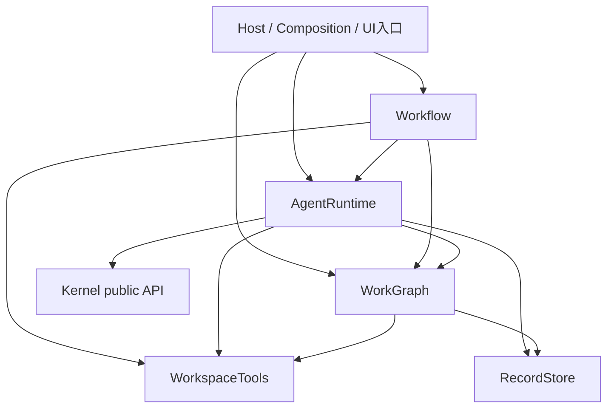

# 详细骨架总览：从意图到文件和接口

2026-09-23。本层是实现前的详细设计，不是源代码已迁移声明。第一次接手可先读 [HANDOFF](../HANDOFF.md)；共同核对[当前PRODUCT](../../PRODUCT.md)、架构、相关模块、[原始对话](../intent/ORIGINAL-DIALOGUE.md)的对应发言及[意图与决定](../intent/INTENT-AND-DECISIONS.md)，不能只沿用工程摘要。

审阅底层数据管理和编排请先看[静态结构与状态机图解](../CORE-STRUCTURES-AND-ORCHESTRATION.md)：包含实际逻辑结构、索引键、原子操作读写集、事务边界，以及状态循环与事件时间线。

## 1. 一页说明系统怎样工作

平台维护项目目标、文件、任务、Session、消息、工具结果和它们的当前/历史关联。架构图用来理解内容和责任，任务图用来理解计划、依赖和推进；确定性工具读取和修改这些结构。Workflow 根据人已授权的目标和实际变化选择下一步；需要模型判断时才发起对应角色的工作。AgentRuntime 通过 Kernel 实施执行，工具结果再回流维护相关结构。

核心工具理解 Task/Session 等对象并执行合法的完整操作。业务不逐表修改数据，不重新实现索引维护。Session 承载连续上下文，角色配置可以复用；同一 Session 的执行/维护互斥，多个不同 Session 可以并行。普通图/文件/历史读取无需 Run，更不需要再调用一个监督模型。

并行接口审阅与三种图见 [PARALLEL-COLLABORATION](../PARALLEL-COLLABORATION.md)。同一工作区按实际范围并行是目标；本批需要的公开子集先通过P0编译闭合，不等待全部未来接口，模块内部可按冻结契约并行实现，真实接线仍须相关能力验收。

## 2. 五模块与详细文档

| 模块 | 目标根目录 | 关键责任 | 详细骨架 |
| --- | --- | --- | --- |
| Workflow | `src/business/workflow/` | 产品流程、规划、Session选择、输入需求、检查与返工策略 | [文件/接口/业务规则](../modules/business/workflow.md) |
| WorkGraph | `src/core/work-graph/` | 工作结构、原子变更、图和历史检索、任务与Session占用、邮箱和证据 | [文件/接口/算法/事务](../modules/core/work-graph.md) |
| AgentRuntime | `src/core/agent-runtime/` | Kernel桥接、统一执行驱动、真实控制/恢复、输入与工具适配 | [文件/接口/Kernel前置条件](../modules/core/agent-runtime.md) |
| WorkspaceTools | `src/core/workspace/` | 文件/Git/来源捕获、冻结查询、解析索引、比较与失效 | [文件/接口/捕获生命周期](../modules/core/workspace.md) |
| RecordStore | `src/core/record-store/` | 原子条件提交、正文存取、事件/索引物理持久与运行技术记录 | [文件/接口/存储迁移](../modules/core/record-store.md) |

每篇模块文档应能独立解释自身目的、关键不变量、内部文件、完整主要接口、调用者、处理顺序、失败和旧实现去向。共享类型由 [CONTRACTS](CONTRACTS.md)统一；模块页重述与自身实现有关的字段意义。跨模块一条真实业务路径见 [END-TO-END](END-TO-END.md)，包含 Host/UI 接线。

## 3. 目标源码层级

```text
src/
  app/                         # HTTP、宿主身份、事件唤醒；保留公开入口兼容
  composition/                 # 单向装配、资源启动/关闭、旧端口过渡
  ui/src/                      # 两图、Session、历史与控制的真实展示
  contracts/                   # 保留旧共享类型与持久协议
    core/                      # 本次新增的少量公共身份/结果/Session/来源类型
  business/workflow/           # 选择意图，消费核心结果
  core/
    work-graph/                # 多种专用领域结构及完整操作
    agent-runtime/             # Kernel适配与执行驱动
    workspace/                 # 文件与源码捕获/查询
    record-store/              # 物理提交/正文/索引
  ...旧模块目录...             # 按批次迁移，最后消费者迁走时删除
vendor/coding-agent/           # 外部执行内核；独立边界、独立兼容与验收
```

目录树表达责任，不要求一个函数一个文件。模块页列出的文件是本轮骨架基线：同一职责内实现时可以合并小文件，但不能借此混合策略、存储和Kernel循环；变更公开职责/跨模块依赖时同步设计与实际消费者。

## 4. 内部依赖与运行反馈的区别



五模块之间的允许边仍为 8 条；图中的 Host/Kernel 是支撑面和外部边界。箭头表示代码消费能力，不是运行时消息只允许单向：结果可以通过函数返回值、已提交事件和外层驱动反馈，核心无需反调 Workflow。

| 实现层 | 可以知道 | 不应该知道 |
| --- | --- | --- |
| Workflow策略 | 目标、候选、成本、可用能力、下一步需求 | SQLite表布局、Kernel checkpoint私有格式 |
| WorkGraph领域操作 | 任务/Session/消息/证据的合法关系、版本和共同更新 | 下一步选哪个业务方案、如何运行模型循环 |
| AgentRuntime驱动 | 已受理执行意图、真实配置、Kernel能力与观察 | 另造任务完成政策或正式图写者 |
| WorkspaceTools算法 | 路径、文件来源、解析器、索引、捕获有效性 | Task完成状态、Session选择、RecordStore实现 |
| RecordStore机制 | 编码、CAS、唯一槽、事务、正文完整性与水位 | 任务为什么就绪、谁应被选择、结果语义是否足以完成 |

## 5. 三种契约不能混为一层

1. **产品/业务契约**：目标怎么确认和变化，是否继续相关Session，什么时候返工，用户看见什么。
2. **核心语义契约**：合法输入与身份、操作结果、并发、版本、来源、失败、跨结构更新。例如claim一次受理占用和待执行意图。
3. **实现/持久契约**：哪个.ts文件实现，索引怎样查，提交检查哪些version/unique/range条件，Kernel映射如何保存，schema怎样迁移。

前两层已有主要设计，本次将第三层补到关键文件与接口。不能把“接口名已经列出”当成第三层完成，也不需要提前展开所有私有函数的逐行实现。

## 6. 已知实现前提与明确决定

- R2a后当前实际源码为WorkspaceTools与11个旧模块；13是此前目标方案，5是本次新目标，三者不能混称。
- 当前平台新Run通常新建随机Session；Session目录、统一占用与连续执行桥接需真实实现。
- Kernel当前同Session ID追加记录不等于历史Context继承。选定最小公开接口扩展由Kernel自己处理历史选择、预算和恢复；平台不维护第二份日志或历史选择器。
- 原生compact当前无实现。未接通前返回unsupported；重组/交接可走明确的新Session业务流程，不把它显示为原生压缩。
- 临时SourceCaptureRef不含ArtifactRef；WorkspaceTools独立返回材料，WorkGraph保存后建立持久来源。
- Session占用使用Run/QueryRun/维护操作的判别联合；只读模型查询不造Task，普通读取不造Run。
- RecordStore低层PreparedCommit仅由可信领域编译器产生，不是模型裸写库入口；完整读集与事务条件迁完前不能删除旧Ledger检查。

## 7. 骨架评审完成条件

每个模块逐项核对：关键文件都有职责/导出/读写说明；公开方法请求/结果可定位；内部主调用链可跟踪；共享算法只有明确owner；来源变化/并发/取消/崩溃有处理；旧实现有具体迁移或删除条件；Host或真实上游有消费者；验证能观察业务结果而非仅“helper被调用”。

文档审阅通过不等于实现通过。后续Agent依据模块页和[实施方案](../IMPLEMENTATION-PLAN.md)执行一个完整迁移批次，留下实际源码、测试与旧路径退役证据，再更新状态。完整交付要满足UI、真实Kernel和状态机验收，不能只验证Fake路径。
