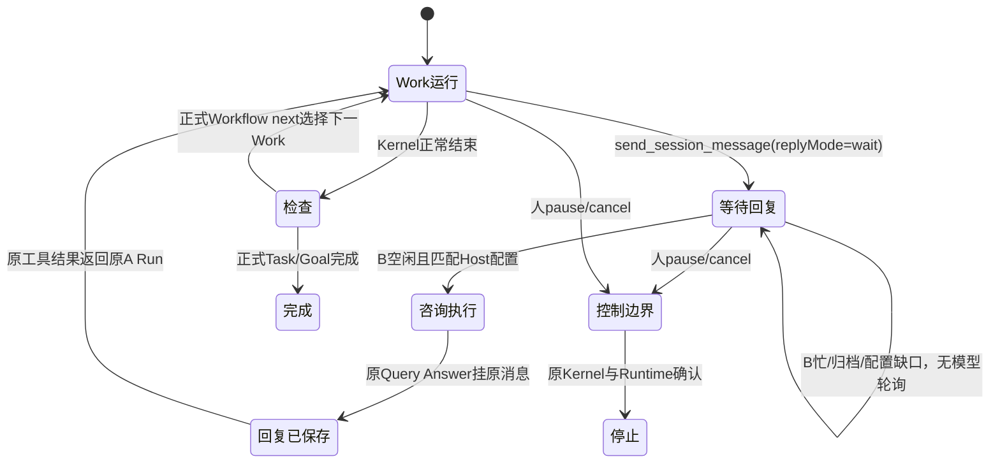

# AG2b 持续通信与工程闭环（2026-09-28）

状态：两阶段 DSH 已导入；相关105项、类型/边界/构建及真实模型/浏览器限定验收通过。[证据](../reviews/evidence/agent-behavior-2026-09-28/ag2b/README.md)。以下保留本批冻结契约，不自动派生额外测试或完整恢复工作。

用户本轮要求：实际通信机制按预设持续运转（状态机），接通 UI，在隔离测试项目完成真实 E2E。来源：ChatGPT《MVP进展与下一步》6ab9f339-953c-83ec-accc-e8d36994928f 及本轮明确指令。AG2a 是当前 dirty tree 基线；不覆盖、不重做。

## 主审冻结的最小行为

A 在原 Work Run 内发送并等待 → Host 同时驱动 B 的原 Session 咨询 → 已保存回复作为原 Kernel 工具结果回到 A → A 继续原任务、可再次咨询 → 实际改动与正式 checks/Evidence/完成。不是 Query 答案冒充 Work 续跑，不另建 A/Task/Session，不放开 Query 写工具。现有 claim 拒绝同 Task 二次 Run、start 对已 entered 只观察，因此本批不冒充实现任意 ended/paused/crash 后恢复。

本批保证存活 Host 内可重复多轮，浏览器导航/刷新不取消执行。Host重启后句柄不自启；已有消息/Query/原历史保持，可查结果。未知执行只观察，不重新调模型；冷恢复继续是明确缺口。消息不是权限或完成证明，B回复仍由A判断。

## 冻结接口

1. `SessionMessage` 与 `sendMessage.input` 增加可选 `replyMode?: 'wait'`。省略完全保持旧 send/指纹行为；只有明确等待才由本驱动处理。codec兼容旧记录，索引按原 sender Work Run（完整scope+RunRef）。`SessionMailboxPort.readOutbox(ctx,{senderRun:RunRef,page:{limit,cursor?,atLeastCursor?}})` 返回同 inbox 页形状；Host可读同workspace，Work只读自己的Run；独立cursor绑定，不扫描所有Session。用已有lookup索引，不造表。
2. 原 `send_session_message` schema接受replyMode。正常发送返回不变；wait分支先保存，随后等待原response，读取原response body，成功返回 `{message, response: MessageBody}`（原工具结果事实）。轮询仅本消息，无模型轮询。业务等待最多300秒（Kernel dispatcher timeout至少多留5秒读回/清理余量），不能超过原Run实际预算/持久deadline；取消需清理timer。超时/控制让出返回 `{message, response:null, waiting:true, reason}`，不得报发送失败或建议新ID重发。用Kernel工具signal；无副作用权限扩大。
3. Runtime给工具注入窄只读控制检查（可在现有control coordinator增加方法）：读取已接受控制，发现pause/cancel则让出工具，原toolGroupBarrier才消费intent与确认；不可在工具内调用decide假装安全点。取消signal直接响应。禁止复制control owner。
4. 新 `src/app/collaboration-driver.ts`，Host层driver（不是Core新owner）：
   - `start(ctx,{advance:WorkflowAdvanceInput,queryProfileIds:string[]})`
   - `read(ctx,{goalRef:GoalRef})`
   - `stop(ctx,{goalRef:GoalRef})`
   返回 `ReadResult<CollaborationSnapshot>`。snapshot：`goalRef,flowId,state,current:WorkflowAdvanceInput|null,last:WorkflowAdvanceResult|null,messages:SessionMessage[],reason:string|null`。state固定 `running|waiting_for_reply|waiting|stopping|stopped|completed|failed`。messages为最近50条显示投影，原事实在mailbox。导出类型与 `CollaborationDriverPort`、factory（deps只取实际platform ports+trusted profiles）及close。
   - 每Goal至多一个本driver活动句柄；相同seed/profile start返回原snapshot，不重复start模型；异seed活动返回busy。不同Goal可并行。
   - Host owns independent signal，启动HTTP快速返回；后台forward原advanceWork.next，绝不重建/猜next。仅本句柄新鲜启动的start Run期间，Work promise与咨询泵必须并行！先读execution并核Run属于本Goal/workspace；已有entered/unknown/settled或纯observe只转发原观察，不为旧等待消息启动咨询（避免重启时A已不在运行却自动拉起B）。pump精确读此Run outbox，只处理replyMode wait、未回复，用原AG2a consumeConsultation。
   - profile ID仅从Host启动时queryProfiles选取，同scope+收件Session.role精确匹配；歧义/缺失明示等待，不能随手选第一个。B busy/archive等待，不抢占、不新建Session。重复tick/重读沿AG2a确定性Query身份。
   - waiting_for_reply仍活动；owner waiting/completed或rejection停止本循环，无紧密重试。约500ms机械tick；不引入心跳策略/通用调度框架。检查等操作原promise无并发重复。
   - stop快速返回stopping，停止后续派发；已有Work用正式controls.submitControl(cancel)+runtime.deliverControl，查询运行用Host signal取消并等待原observations。原promise排空后才stopped；不要仅将UI布尔置停。已领取/准备的Run也必须跟踪，不能只在start步骤才记currentRun；stopped只表示本driver停止且promise排空，未确认正式cancelled时保留原Run未决占用和原因，不自行释放或宣称任务已取消。尚未领取任何Run时停止派发即可。Host close先停止/排空driver再platform.close；启动HTTP信号不传后台。
5. 原HTTP明确3个plain路由 `workflow/driver-start`、`workflow/driver-read`、`workflow/driver-stop`，类型从driver方法导出，沿原token/scope。`messages/outbox` plain读路由供UI历史。createPlatformCoreRouteBindings第二可选driver参数，不强迫旧composition使用Host。
6. UI复用统一面：原drainContinuation进入workflow/advance时交由Host driver，传实际next和已配置query profile IDs（同scope、各角色唯一；歧义用户选已有profile）。后续只轮询read，不能页面与Host双驱动；显示当前状态、消息/B/response关联与原历史入口，提供停止推进。导航返回/刷新可按当前goalRef查询本Host句柄；停止中不写已取消。保留原历史详情与AG2a手动咨询入口。
7. 更新platform-work Skill的通信说明：有实际信息依赖才replyMode wait，回复是同伴陈述需核对；可多轮，普通通知仍不等待。不得靠提示词伪造工具结果。同步 runtime-assets.json 中这一个资源的真实SHA256。

## 两阶段与必要验收

Stage1只写新driver接口/unsupported骨架及 `tests/app/AG2b-collaboration.test.ts`、必要fixture `tests/helpers/AG2b-collaboration-fixture.ts`。真实HTTP未公布是合法RED，不能以import失败/错误Host fixture做RED。可复用AG2咨询Host与R5c workflow/AG1正式图关系种子，不改内部持久层。禁止实现生产算法。结束STOP。

主审冻结后Stage2仅精确scope生产文件实现，测试文件只读。如发现契约矛盾先报告，不造新框架。

验收限三个核心场景：
- 真实Host/SQLite/Kernel受控provider：A图发现B→wait发送→B原Session答→A同Run确实拿到回复→第二轮→A写隔离项目→正式checks/Task/Goal；至少确认两轮body在A模型request工具结果，原A/BSession、消息source和Query身份，普通notify不自动消费。start/read重复不加模型。
- B忙时A等待且不新建Session，释放后自动处理；人停止等待可解除且不继续下一步，原消息事实仍在。真实控制owner，不DB篡改。
- 已完成后Host重开，只读原消息/原Query结果/原历史不加模型；并验证越scope不能读/停其他driver。不制造冷恢复成功承诺。

通过后相关原mailbox/control/AG1/AG2/workflow/Host tests、types/UI types、boundary/build即可。然后真实DeepSeek隔离小工程任务与浏览器操作；不得改三个候选用户项目。新模型费用沿已授权DeepSeek凭据，禁止写/打印凭据。若模型语义不符据实记录，非语义错误修最小路径。
