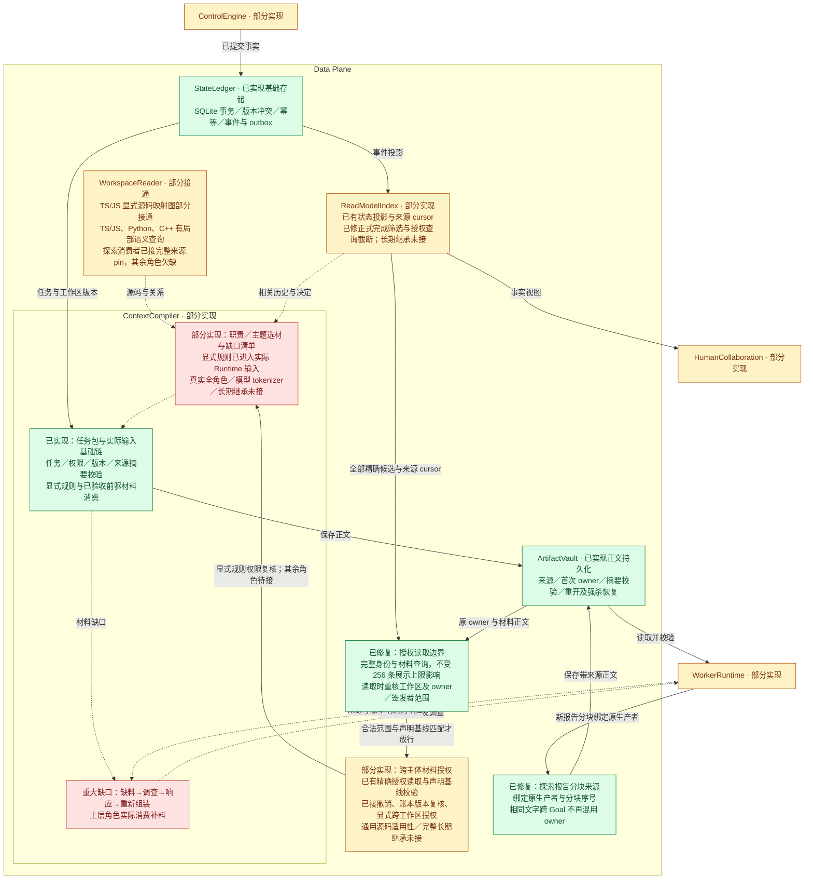
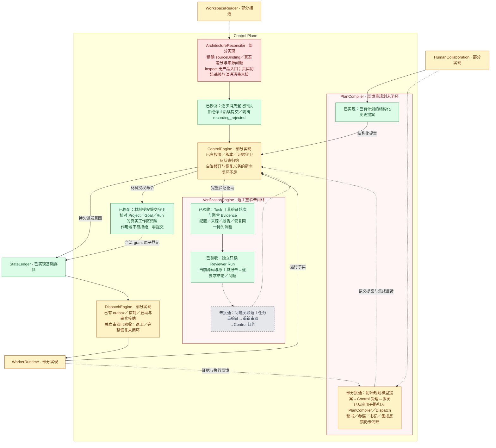
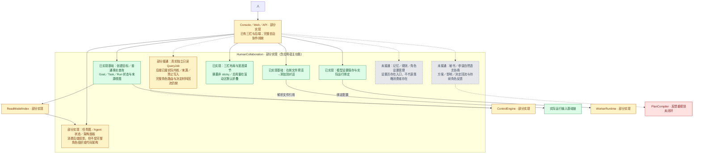
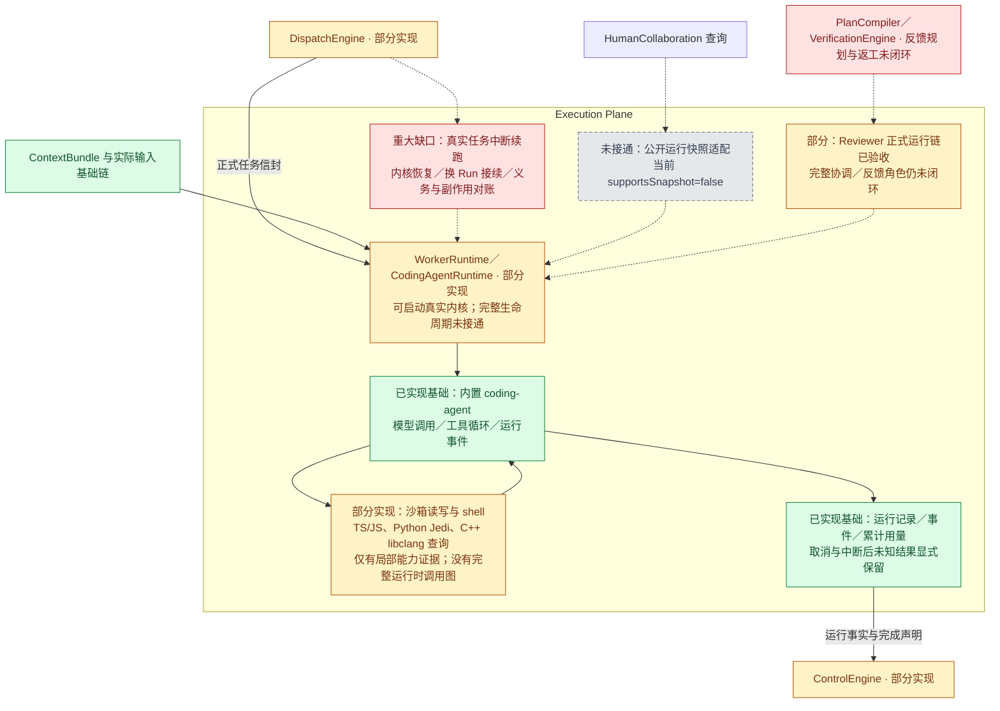
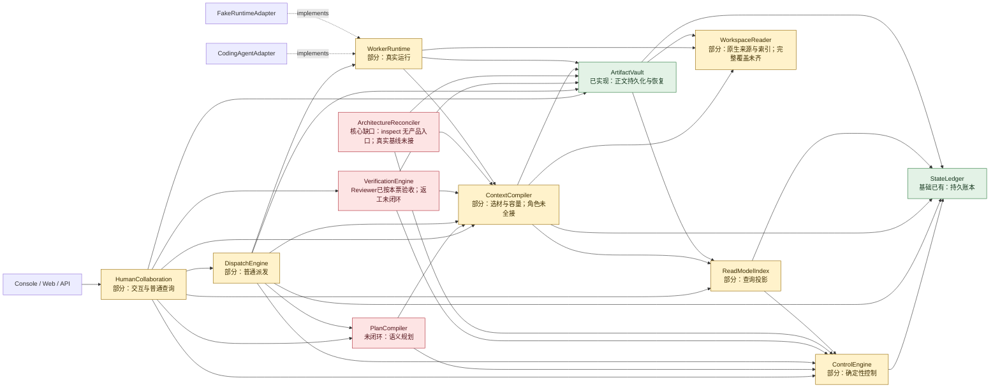

# 原功能图、模块 DAG 与当前实现状态

更新：2026-09-10。本页是人类查看当前实现状态的主入口；产品承诺在 PRODUCT，职责与设计依赖在 ARCHITECTURE，具体源码核对在工程审计。12 个 Module 都已检查实际 Interface、关键 Implementation、宿主接线及代表性测试；这不代表全仓逐行证明无错。

**当前阶段：12 Module 职责归位及一 Module 一目录整理已完成；工具验证、独立 Reviewer 和 DEF-17 按各自范围验收。完整产品仍未完成。本次仅修正文档准确性，下一项实施范围由用户阅读缺口后决定。**

当前源码身份引用重组清单：**744 文件 / f36287a561fe4499043d370d1c73a7adbf012289db7d153974828760b3ec8d3a**。范围为清单所列源码、测试、脚本及根配置，排除生成的 workbench、dist、依赖和证据目录；不是整个工作区的摘要。[重组证据](../../../../agent_platform/evidence/2026-09-10-module-folder-reorg/reorg-report.md)记录全仓 257 文件 / 1672 项与浏览器 25 项通过。[进度审计](../dev_docs/verification/2026-09-10-progress-audit.md)另报告 WSL 全仓复跑通过，但浏览器因 npm 环境缺失未启动；本次文档修订不新增运行验收。

## 当前剩余产品义务（供选题，不表示实施顺序）

| 能力 / 主要负责 Module | 已有基础 | 仍缺什么 |
| --- | --- | --- |
| 工作上下文 / ContextCompiler | WorkContext、CompletedWork 编译端口及来源、权限校验 | 普通真实 Run 消费工作身份与历史材料；清单与实际输入一致；完整 token 容量处理 |
| 补料与决定回流 / HumanCollaboration、PlanCompiler | 独立只读 QueryJob、提案和决定记录 | 缺料请求、按角色路由、结果接纳、重新组装与消费回执；完整反馈重规划 |
| 接续与运行控制 / WorkerRuntime、DispatchEngine、ControlEngine | 持久运行事实、租约、取消、部分重启对账 | 暂停/继续/steer 产品入口、新 Run 内核恢复与换手；未知副作用处置和完整强杀恢复 |
| 长期记忆 / ContextCompiler、ArtifactVault、ReadModelIndex | 正文持久化、精确授权与撤销、历史取材端口 | 记忆查看/更新/作废、检索与真实消费者；显式跨 Workspace 授权已获允许，仍禁止自动共享 |
| 返工重验 / VerificationEngine、ControlEngine、PlanCompiler | 工具轮次、独立 Reviewer、正式 FAIL 与 Evidence | 问题关联返工任务、新版本验证与重审身份、最终归约；DEF-17 启动前恢复不能代替返工 |
| 架构对账与演进 / ArchitectureReconciler | 模块内 sourceBinding、限定 TS/JS 差分、登记回执处理 | inspect 产品入口、真实初始基线来源与绑定；演进决定及激活消费；MigrationGate 仅有守卫，真实迁移检查未实现 |
| 来源与证据时效 / WorkspaceReader、ArtifactVault、ControlEngine | 已有语言索引、探索/Reviewer 来源 pin、材料撤销 | 其他角色消费、完整配置/依赖/增量；通用 Evidence 来源失效闭环与真实 Git diff 接口 |
| 产品交互与整体效果 / HumanCollaboration、全模块 | 工作台、投影、报告和真实查询入口 | 完整角色协作、规则/记忆设置实际生效；全链真实任务及效率评测。浏览器复跑环境也需补可复现说明 |

详细模块边界见下方“12 个模块的结论”。技术选型若现行文档没有决定，实施前由主 Agent 汇总（含子 Agent 发现）向用户询问，等待期间推进其他独立工作。

## 已验收批次（以下数字属于各自历史身份）

[DEF-17 验收](../dev_docs/verification/2026-09-10-def17/acceptance.md)：747 文件 / c399…ac61、256 文件 / 1664 项、浏览器 25 项，均属重组前该批身份；其限定验收继续保留。

VR-02已按限定范围验收：730文件固定快照，全仓249文件/1633项、完整浏览器23项、两套类型、原构建、345项边界及文档检查通过；A01–A04和完整源码/日志身份已由未参与实现的Agent确认。公开职责与实际接口见[独立审阅](../dev_docs/interfaces/independent-review.md)；真实HTTP已覆盖独立只读Run、逐项PASS/FAIL/INCONCLUSIVE、source/config变化、真实撤销及重开无重复模型，浏览器已覆盖实际提交丢响应后查原回执。完整证据见[VR-02验收](../dev_docs/verification/2026-09-09-independent-review/acceptance.md)与[外部审查入口](../dev_docs/verification/2026-09-09-independent-review/external-review.md)。这不代表完整自治产品或真实模型审阅质量已经验收。

2026-09-10 原修复批次当时已实施，739文件5a9e…0364在该批核对时逐文件一致；该批253/1641及浏览器23项日志已核实；较早独立报告后的有界补审与SA-01…03必要补证已独立通过，原批限定范围接受。范围与处置按[外部审查修复工作包](../dev_docs/planning/active/external-review-repair/README.md)收敛；原修复执行期间，旧的 VR-01/VR-02 验收项曾在**该批记录**中重新打开，现已结合最终身份、实际验证与有界独立补审收口，历史 accepted 记录保留不改。已修范围包括：Reviewer 启动前失败分类与受控重新受理（含一处使重新受理永不可达的 Control 策略缺陷）、测试可信度（占位/永真断言、16+2 个就绪探针、替身 selection 语义）、显式执行能力替代 planId 前缀路由、A-1 接口归位、A-2 边数改文档而非凑实现、A-3 缺省 unsupported、A-4/B-2 边界文档与检查器范围、R-1 共享校验、R-5 options 化、`baselineChangeView` 纯投影收敛、E-1 恢复原始字节、EU-1 变异验证成立、D-1…D-8 文档精度。逐项状态与证据见[本批集成交接](../dev_docs/verification/2026-09-10-external-review-repair/integration-handoff.md)，未修项与风险见[延期登记](../dev_docs/planning/active/external-review-repair/deferred-register.md)。

**架构重建批次（历史数字，2026-09-09；当前身份见本页开头，历史批次各按原验收入口）：多 Agent 架构重建已完成本批职责、接口与源码迁移并通过验收，完整产品仍未完成。** 实际责任见 [当前 Module 边界](../dev_docs/interfaces/module-boundaries.md)，证据见 [本批验收](../dev_docs/verification/2026-09-09-architecture-rebuild/acceptance.md) 与 [独立终审](../dev_docs/verification/2026-09-09-architecture-rebuild/closure-audit.md)。12 Module 真实消费者核对通过，F01–F07、C01–C03 共 10 项问题关闭；319 个 TS/TSX 静态边界检查无违规。全仓 **235 文件/1519 项**、浏览器 **19/19**、完整 kernel/app/UI 构建及两套类型检查通过，源码快照及失败轮次均保留。初始规划/派发、Control 政策与正式记录、验证生命周期、历史材料、原生来源读取及版本绑定、持久运行观察与探索输入已归位，Context 反调 Runtime/Session/Verification 的环已解除；真实缺省能力不冒充成功。

仍有两套ReadModel的部分重复投影、大处理器和旧命名等模块内维护债，本批通过不表示可读性和重复问题已全部消除。[VR-01工具验证轮次](../dev_docs/planning/active/core-verification/VR-01.md)已接入真实Task、全部适用命令、报告聚合、Control接纳与工作台；697文件快照全仓239文件/1561项、浏览器21项、类型/构建/边界及文档检查通过，最终日志与六份清单/实际源码已独立核对，主线已验收。准确证据见[本票验收](../dev_docs/verification/2026-09-09-core-verification/acceptance.md)。独立Reviewer已按VR-02的完整消费者证据验收；返工重验、补料、工作Context、人的决定、控制/接续、记忆、架构演进与总验收按原义务保留，但不在本轮继续动工，依赖见[核心功能接续](../dev_docs/verification/2026-09-09-architecture-rebuild/core-continuation.md)。

## 历史增量（保留当时结论，不覆盖上方当前状态）

以下按原日期保留旧调查、修复与验证范围；“未实现”或“仍有缺陷”指记录当时。当前架构与Reviewer状态以上方摘要和下方12模块表为准，已修复问题不因历史文字重新成为待办，有效未完成要求仍保留。

**文档范围明显大于完成范围。账本和部分执行流程已有实质能力，但完整自治产品尚未完成；几个基础模块还有确定缺陷。** 不用一个“P1 全通过”或总测试数概括整产品状态。

**2026-09-09 已依据用户新委托实施首批模块职责修复，完整产品仍未完成。** 前次收尾保留的两项探索读取回归已修复，并完成 Context 选材、Dispatch 授权/租约、初始规划处理、验证证据编排的首轮归位；能力路由、增量发现投影及原子写入机制已迁移。现有全仓 **221 文件／1464 项通过（631.18s）**，最终类型及应用编译通过；测试快照后仅有排版、类型归位和未用导入清理，身份分别记录。无本批真实外部模型、浏览器、OS 强杀或 benchmark 验收。源码依据、修复顺序、验证边界及下一步统一见 [模块职责修复](../dev_docs/verification/2026-09-09-architecture-repair.md)。[收尾交接](../dev_docs/verification/2026-09-09-module-closeout.md) 和下方日期增量保留其历史证据边界，不构成旧切片继续施工的指令。

2026-09-08 接手修复增量：持久化宿主已接入 SQLite ArtifactVault，正文、来源与 owner 的重开恢复和损坏拒绝已验证；Reconciler 已消费登记拒绝回执，返回 `recording_rejected` 并停止后续提交。固定 Finding／丢弃 delta 仍未修复。基础 51 项、Linux 实际内核搭配模型夹具的 Context 17 项、Linux GUI 后端 3 项分别通过；无真实模型调用，无 benchmark 成绩。精确边界见 [基础修复证据](../dev_docs/archive/2026-09-08-verification-history/2026-09-08-framework-acceptance/foundation-repair.md)。**下方四个 Plane 图已按当前源码重新着色，不再使用修复前状态。**

本轮按用户指定顺序先修 Plane 内部缺陷：WorkContext 清单、已完成工作筛选、历史版本／理由／正文大小、架构差分漏检、沙箱预检提示及 GUI 过期文案已修。局部回归 51 项、WSL 实际内核＋模型夹具 18 项通过；不是跨角色闭环。下列图仍保留未接通能力的红色／灰色。

2026-09-08 源码基础切片：已新增基于 TypeScript Language Service 的限定范围定义／引用查询与摘要绑定源码片段，探索和开发运行均已注册工具。其余语言语义、全仓增量索引和架构图基准绑定仍未完成；具体契约与缺项见 [WorkspaceReader](../dev_docs/modules/data/workspace-reader.md)。

2026-09-08 命令检查增量：真实应用已接 `CommandCheckProvider → VerificationEngine → 沙箱 → ArtifactVault → UI 报告读取`，区分退出失败、超时、环境异常、来源变化；12 项真实命令／应用重开测试通过。真实应用停用默认模拟检查器与模拟图，未配置能力明确拒绝。Reviewer、返工、整体证据接纳及中断租约恢复仍未闭环。P1-15 用例已按正式完成资格修正：Run 结束仍不可进入已完成工作历史。

2026-09-08 跨主体材料读取增量（P1-18）：ArtifactVault 不再只有 owner-only。新增不可变 `MaterialAccessGrantV1`（读者主体、精确材料集合、授权基线 planRef／workspaceRevision／sourceDigest），经 Control 以 `material-access-grant`（CAS@0）登记、投影到读模型，Vault 通过宿主注入的解析器按“读者＋材料＋基线＋签发者权威”四条同时成立才放行；基线变化返回 `rejected/stale`，继承材料不静默复用。首个真实消费者是探索路径前驱报告：消费者运行经授权从 Vault 取回生产者清单与分块并核对 reportDigest。新增测试 27 项（契约 9、Vault 授权 7、Control 守卫 5、读模型 3＋2、SQLite 重开与真实全链 1），全仓固定快照 202 文件／1387 项通过（修复前基线 196 文件／1360 项），类型检查与应用编译通过；真实模型调用为 0。剩余：Reviewer／接续／长期记忆仍未接入该授权链，跨主体消息与授权撤销未实现。

2026-09-08 P1-18 独立复核（历史发现；权限与截断问题已由 2026-09-09 修复，自动作废边界仍保留）：35 项局部测试通过，但额外真实 SQLite 反例确认授权工作区可与 Goal／Run 不一致；Control 跨项目材料授权边界及 256 行解析截断仍待修。当前只证明声明基线比较，不能称通用版本自动作废已完成。该底座保持部分完成，见 [独立复核](../dev_docs/verification/2026-09-08-p1-18-independent-review.md)。

2026-09-08 真实模型增量：已执行两轮 DeepSeek 最小开发链（共 12 次真实请求），首轮输出截断失败，扩大单次输出容量后第二轮独立测试通过且报告重开一致。这是微型项目接线验证，非 FeatureBench 或多 Agent 整体验收；角色规划、Reviewer、返工、强杀续跑与 Goal 正式归约仍未完成。见 [真实模型验收](../dev_docs/verification/2026-09-08-real-model-minimal-acceptance.md)。

2026-09-08 前端工作台首期增量：产品新增 React＋TypeScript＋Vite 工作台（Mantine／TanStack Query／React Flow，终端保留 xterm.js），由既有 Node 宿主在 `/workbench` 提供并已切为默认入口，旧前端保留在 `/legacy`。左侧项目／目标／活跃 Agent、中间主对话、右侧标签工作台与底部终端／日志已接通真实项目、目标、真实任务、文件引用与行定位、差异（仅运行工具调用）、任务／Agent 详情、检查报告、模型设置与只读探索；架构、Reviewer、记忆、续跑明确标注后端未支持。浏览器级验收 15 项、前端单元 9 项、后端回归 1385/1387 通过（2 项并发负载超时，单独运行 11/11 通过），真实模型链 1 次（5 次模型调用、6 次工具调用，项目测试 4/4 通过，重启后一致，目标未自动完成）。仍缺：Git 差异接口、真实架构图、Reviewer 返工、长期记忆、任务续跑与真实语义查询。证据见 [首期实施与验收](../dev_docs/verification/2026-09-08-ui-workbench-acceptance.md)。

2026-09-09 前端工作台交付缺陷修复：独立复核发现的首期缺陷已修并有真实验收。(1) 构建：Vite 直接写入服务读取的 `dist/app/public/workbench/`，`copy-ui.mjs` 只复制 `/legacy` 并清理旧工作台，单次 `pnpm build` 即为服务产物；`pnpm verify:ui-build` 在干净目录、已有旧产物和改动后单次构建三种情况下真实启动服务，核对页面引用资源与磁盘字节一致且 `/legacy` 可用。(2) 累计预算：累计输入／输出／模型调用／工具调用／运行时长默认 `null`，只有用户显式填写才生效；上下文窗口（默认 128K）与单次响应输出（默认 4096）是声明容量，命令检查超时单列；UI→HTTP→`validateRuntimeBudget`→RunSpec→内核 limits 全链保留 `null`，用量照常记录。(3) 检查报告：后端投影 `command/kind/timeoutMs/startedAt/finishedAt` 与 `observations`，命令、分类、PASS／FAIL／INCONCLUSIVE、退出码／超时、stdout／stderr、来源摘要、工作区与计划版本在普通展示区可见；记录生命周期与检查结论分开，旧记录缺字段显示“未记录”。(4) 请求幂等：未决 requestId 与载荷摘要按作用域持久化，正式回执后结束该逻辑请求，新执行生成新标识；新增 `POST /api/receipts` 查询正式回执。(5) 验收补足：浏览器 18/18（含“后端已提交但响应丢失”与跨作用域延迟报告）、`tests/app`＋`tests/ui` 113/113、前后端类型检查 0 错误；真实模型 UI-12 链路 4 次请求、4 次工具调用，PASS／FAIL／超时三类真实检查、同命令新执行与未决重试、重启后报告一致、目标仍 `not_ready`。证据见 [交付缺陷修复与验收](../dev_docs/verification/2026-09-09-ui-repair-acceptance.md)。仍缺能力同上，未因本次修复而接通。

2026-09-09 材料授权边界修复：已核对并修复 P1-18 独立复核中的工作区归属、Control 跨作用域材料放行及 256 条候选截断。Control 检查真实 Goal/Run 归属，Vault 限制首次 owner 与签发者范围，宿主按完整主体及材料查询全部候选并重核旧授权；探索新报告分块绑定原生产者以避免相同文字跨 Goal 碰撞。具体实现和验证见 [授权修复验收](../dev_docs/verification/2026-09-09-material-access-repair.md)。currentBasis 仍为声明基线比较，通用版本自动作废、撤销、跨 Goal 记忆继承仍未完成。ArchitectureReconciler 所缺源码基线绑定与 Finding 分类规则仍未明确，未替换固定结论、未标为完成。

历史记录（2026-09-09，当时的“正在实施”不构成当前施工授权）：全模块核心义务补齐已新增材料撤销（原授权不可变、撤销事件、canonical 读取复核）及项目级 TS/JS 索引，局部证据见 [施工与覆盖记录](../dev_docs/verification/2026-09-09-module-completion.md)。同工作区跨 Goal 精确历史读取与 Python 语义服务已通过局部复验；用户已允许显式跨 Workspace 授权并禁止自动共享，协议测试已覆盖两套 Adapter；Context 选材/容量与检查中间日志、Evidence/对账入口已实现部分消费者，真实 TS/JS 架构 sourceBinding/delta 通过一次 SQLite 链路。阶段 A–C 仍有核心缺口，D–G 及真实项目总验收未完成；前述日期条目保留历史验证边界。

## 按原图逐层展开：功能方框内部由哪些模块工作

本轮按当前产品源码和宿主注入重新核对四个 Plane；下图已包含正文持久化、拒绝回执和 2026-09-09 材料授权修复；新增绿色功能节点不表示整个模块完成。Execution Plane 是执行面，不是 Exception Plane。

**颜色图例：🟩 已实现图中限定功能；🟨 部分实现；⬜ 真实路径未实现／未接通（可以已有接口或夹具）；🟥 重大缺口或已知错误，阻断该模块核心产品职责。** 红色不表示没有代码，绿色不表示整个产品已验收。未着色的人、外部输入和容器仅表示边界。

箭头表示信息流，实线为已有局部消费路径，虚线为待接通的产品路径。模块内的功能节点不新增 Module。结论来自当前源码核对及已记录测试；本轮没有执行新模型任务或 benchmark。

### Data Plane：保存事实 → 提供查询 → 组装本次材料

已有文件读取、文本搜索、TS/JS 与 Python 语法 AST。Data ProjectSourceIndex 已接项目配置/依赖/增量语义，Python Jedi 提供隔离跨文件查询，C/C++ libclang 提供受限编译配置下的跨文件语义；TS/JS source-workspace-reader 提供显式映射的真实图。Python 按内容摘要失效与复用查询，C++ 每次重建 TU；全仓多语言、完整外部依赖及动态调用图仍未覆盖。探索前驱消费者已迁移到可信完整目录 pin，读取时由 Vault 复核；两项原回归已通过。其他角色和长期继承的来源消费仍不完整。

### Control Plane：提出方案 → 接受合法变化 → 派发 → 验证反馈

Control 的归约是确定性代码，不能用模型“完成”替代验收。PlanCompiler 的红色指反馈重规划未闭环，VerificationEngine 的红色指返工重验未闭环；已验收的工具轮次与独立 Reviewer 单独标绿。部分实现与核心职责受阻可以同时成立。Reconciler 已去掉固定业务结论，真实差分与来源绑定已有一次 SQLite 证据；基线演进和角色消费仍未闭环。

### Human Interaction：同一界面中的真实数据与缺失协作

“显式规则能随任务材料被消费”与“用户能在设置中持久管理规则并影响后续任务”是两个功能；前者已有，后者未接通。旧 /legacy 控制台禁用相应提问／发送；默认工作台已有独立只读模型查询入口。具备 execution 描述的 QueryJob 走真实查询内核，无该描述的样例路径使用固定回答 Adapter；内置服务器显式开启 fixtureExecution，界面分别标注两类查询。图形展示后端事实，并不能补出后端不存在的角色分工或代码关系。绿色 UI 节点只表示对应基础接线，未宣称 Windows 原生部署或全部浏览器交互验收通过。

### Execution Plane：内核运行、工具与接续边界

真实适配器当前声明 replayable=false；重启后将正在运行的记录置为 outcome_unknown，不会自动证明副作用成功或继续执行。内核单次 Run 的能力与平台跨 Run 的义务、租约、材料和证据恢复分属不同层。测试替身提供的 continuation/lifecycle 能力不能算作真实适配器已完成。

源码入口：[持久化宿主](../../../../agent_platform/src/harness/persistent-harness.ts)、[应用服务](../../../../agent_platform/src/app/service.ts)、[Context 输入](../../../../agent_platform/src/data/context-compiler/runtime-context.ts)、[WorkspaceReader](../../../../agent_platform/src/data/workspace-reader/workspace-reader-adapter.ts)、[执行工具](../../../../agent_platform/src/execution/worker-runtime/exploration-tools.ts)、[Reconciler](../../../../agent_platform/src/control/architecture-reconciler/architecture-reconciler.ts)。本轮 Human/Execution 独立核对见 [源码核对记录](../dev_docs/archive/2026-09-08-verification-history/2026-09-08-framework-acceptance/plane-status-source-check.md)；既有测试范围见 [基础修复证据](../dev_docs/archive/2026-09-08-verification-history/2026-09-08-framework-acceptance/foundation-repair.md)。

## 模块依赖 DAG

下面同步 [ARCHITECTURE 的 ModuleDependencyDAG](../ARCHITECTURE.md#moduledependencydag) 当前节点和箭头，并标出功能完成程度。箭头表示已登记的长期依赖，不是开发顺序；接口归位也不表示全部角色消费者已实现。绿色为基础能力已有；黄色为部分可用；红色为关键功能缺口。颜色只是概览，具体结论以下表为准。

此前工程审计发现的 PlanCompiler 直接读 Ledger、ArchitectureReconciler 直接读 WorkspaceReader、原生来源实现混在 runtime 等结构漂移，已在本次架构批次中归位并独立核对。当前图与 ARCHITECTURE 的 34 条允许 Module 依赖一致（2026-09-10 修正：原声明的 PlanCompiler → ArtifactVault 边没有实现消费者，已从三处一致删除，不是新增实现去凑边数）；实际 DI 与源码证据见[架构验收](../dev_docs/verification/2026-09-09-architecture-rebuild/acceptance.md)。34 条是允许依赖集合，不是实际调用链数量；进度审计报告 9 条直接跨 Module import。其余允许边是否通过契约和宿主注入落实，须逐项检查消费者，不能由允许集推定。下表保留当前接线及功能缺口。

## 设计依赖和实际接线的差别

| 原 DAG 的设计依赖 | 目前实现对照 |
| --- | --- |
| PlanCompiler → Context / Control | 初始协调及人工规划已归 Module，Coordination/Operator Context 取材，Control 受理；计划正文不直接打开 Vault。完整角色反馈重规划仍缺 |
| ContextCompiler → Ledger / Vault / ReadModel / WorkspaceReader | canonical 取材、实际来源、授权材料及选择清单归 Context；公开运行观察从持久记录读取，不回调活 Runtime 或 Session |
| VerificationEngine → Control / Context / Vault | 工具轮次与独立Reviewer生命周期归本Module；Context取材并复核，Control接纳与归约。Reviewer已按本票验收；返工尚未接通，实施范围待用户决定 |
| ArchitectureReconciler → Control / Vault / Context | Architecture/BaselineEvolution Context 提供绑定材料，真实差分和逐步回执已接；迁移检查缺能力返回 unsupported |
| ReadModelIndex → StateLedger / Control | 事件推进投影；PolicyExplanationPort 复用 Control 无状态政策解释，视图不提交命令或归约状态 |

依赖图实线保留原设计语义。“少量代码可调用”和“产品流程可用”不能混成一个已接通状态。

## 12 个模块的结论

| Module | 现状 | 现在如何实现 | 主要问题 | 修改位置判断 |
| --- | --- | --- | --- | --- |
| HumanCollaboration（交互入口） | 部分可用 | 创建目标、查投影；变更转交模块端口存在，产品入口未接；探索/历史材料按接口处理；工作台消费真实工具轮次、Reviewer状态、原报告与请求回执 | 完整协商、角色反馈、记忆/角色设置未接 | Interface 扩展＋实际消费者 |
| PlanCompiler（规划与协调） | 初始提案已归位，完整协调欠缺 | 统一 request/accept 与独立 OperatorPlanning；Context 取材、Control 受理、Dispatch 执行；新普通人工计划含 Reviewer | 反馈重规划、全局语义规划资格与完整角色仍缺 | 核心消费者及明确版本化政策 |
| ControlEngine（确定性控制） | 基础路径可用，自治欠缺 | 命令守卫与确定性归约；独立审阅协议、Work/Result及分组Evidence原子接纳，DEF-17原子替代复用受限端口，版本／权限／当前资格与CAS在本模块复核 | 自治修订授权与消费缺失 | 恢复事实契约＋内部策略 |
| DispatchEngine（派发与运行事实） | 普通/初始计划已接，Reviewer已按本票验收 | 持久outbox、canonical readiness、Run事实；Reviewer复用原事实消费和只读运行，Dispatch 负责派发与租约协调，Control 负责授权和租约受理，Runtime 负责执行适配 | 修订与真实进程强杀恢复未闭环 | 内部驱动与实际恢复协议 |
| VerificationEngine（验证编排） | 工具轮次已验收，独立Reviewer已按本票验收 | 原工具报告、不可变配置/来源、逐VR检查与Reviewer报告资格、Evidence及恢复归Module；HTTP/UI只消费接口 | Reviewer及DEF-17产品授权恢复已限定验收；返工与OS强杀另待；stale不自动撤销旧Evidence | 架构与Reviewer已交付审查材料，其他核心暂不动工 |
| ArchitectureReconciler（架构对账） | sourceBinding/实际差分部分接通 | 模块内可按不可变基线绑定 manifest/commit/映射，执行限定 TS/JS 差分、登记问题并处理拒绝；src/app 尚无 inspect 调用者 | 产品安装基线无 sourceBinding；真实初始基线、inspect 入口、演进与修复决定消费仍缺；MigrationGate 真实检查未实现 | 继续正式消费者与恢复接线 |
| WorkerRuntime（执行内核适配） | 真实执行可用，生命周期未全接 | 适配 coding-agent 内核调用模型／工具；公开观察持久保存供 Context 独立读取，缺省能力诚实拒绝 | 真实控制、新 Run 接续和完整恢复未接 | 生命周期 Adapter＋能力契约 |
| StateLedger（权威账本） | 已实现基础能力 | SQLite事务保存快照、事件、幂等与outbox；支持独立审阅正式记录、读版本CAS及限流前按工作类型筛选，两套后端行为一致 | 本轮未发现需重写其基础事务的问题 | 保留 Interface/核心事务 |
| ArtifactVault（产物正文） | 持久/精确授权/撤销已接 | 原 owner/provenance 不变；≤64 精确材料；读取核对 canonical grant 撤销与 Plan/Workspace；同 Workspace 跨 Goal 及人工显式跨 Workspace 历史授权 | 通用源码适用性、全部继承消费者与记忆未完成；显式跨 Workspace 已获决定并有协议证据 | 证据见 [本轮记录](../dev_docs/verification/2026-09-09-module-completion.md) |
| ReadModelIndex（查询投影） | 投影可用，完成筛选已修 | 两套视图共享Reviewer记录与当前资格解释，DEF-17替代Work初始化Reviewer运行行，保留已提交归约和 producer 行租约；已有新实例重放一致性证据，尚无独立 rebuild/reset/replay API，不提交业务命令 | 协调／查询结束资格尚缺；协议采用checkpoint期间phase可能滞后，不能代替当前资格 | 补结束事实消费者，保留模块内重复投影维护债 |
| ContextCompiler（上下文选材） | 选材/来源绑定已归位，角色覆盖部分 | 探索、协调、历史、源码图及验证材料由明确端口提供；Reviewer固定配置/预算、有界包与完整grant复核，DEF-17从可信持久事实判定未启动资格，当前接纳和历史报告读取分开 | 普通真实 Run 尚未消费 WorkContext/CompletedWork/ExecutionMemory；模型对应 tokenizer、其他角色与历史继承消费者尚缺 | 内部算法＋角色材料契约 |
| WorkspaceReader（源码与索引） | TS/JS、Python、C/C++、显式映射图部分接通 | TS Language Service、隔离Jedi、受限libclang；探索完整目录和Reviewer的Candidate范围各按明确pin读取，保留真实TS/JS图消费者 | 完整配置/外部依赖/持久增量、其他角色 pin 消费及真实项目验收仍缺 | 继续覆盖与角色消费者，保留原探索完整目录语义 |

“已实现基础能力”只覆盖实际核对的范围；没有把某个 Module 标为全部产品需求永久完成。当前源码、Interface 与职责判断见 [Module 边界](../dev_docs/interfaces/module-boundaries.md) 和 [架构终审](../dev_docs/verification/2026-09-09-architecture-rebuild/closure-audit.md)，旧 [工程审计](../dev_docs/archive/2026-09-08-verification-history/2026-09-08-module-audit/README.md) 保留历史发现。

## 已修复与仍存在的问题

- **已修复：通用 Vault 正文未持久化**。SQLite 正文恢复、来源及 owner 保留、损坏拒绝、进程强杀恢复已有局部证据。
- **已修复：Reconciler 忽略登记拒绝**。现在停止后续提交并返回 recording_rejected；不将部分提交算作整个 inspect 成功。
- **已修复限定 TS/JS 范围的架构固定结论**。真实 sourceBinding/delta/Finding 已有 9 月 9 日证据；初始基线、演进 UI、真实角色消费与完整恢复仍未闭环。
- **仍存在：长期 Context 和协作闭环不足**。已有基础包、工具和投影；自动选材、跨角色补料、Reviewer 返工及真实任务续跑未闭环。
- **已新增：跨主体材料读取授权（P1-18）**。不可变grant经Control登记、读模型投影、Vault按读者／材料／基线／签发者放行；基线变化返回stale。探索前驱与本轮Reviewer已有真实消费者，Reviewer已按本票验收；接续、全部角色自动选材与长期记忆继承未接通。当前读取与历史报告解释严格区分，撤销以canonical grant为准。

旧调查反例仅描述修复前状态，保留在 [工程审计](../dev_docs/archive/2026-09-08-verification-history/2026-09-08-module-audit/README.md)。最初着色调查本身未修改运行代码；其后的实际实现与验证以上方修复增量和基础修复证据为准，未产生完整产品 PASS。

## 成熟工具与平台自身算法

AST/语法解析复用成熟工具：TS/JS 用 TypeScript，C++ 用 Clang 与编译数据库；多语言语法提取可考虑 Tree-sitter。Tree-sitter 提供增量语法树，但语法树本身不等于跨文件目标解析或完整运行时调用图。[Tree-sitter 官方说明](https://tree-sitter.github.io/tree-sitter/)、[Clang](https://clang.llvm.org/docs/LibTooling.html)

Context 管理并非完全没有外部方案。检索、分词、排序、检查点可以复用成熟实现，例如 SQLite FTS5 和 LangGraph 的检查点/持久存储设计。是否引入完整框架应评估与现有 Ledger/Control 的重叠；本次建议先复用算法和 Adapter，保留一个权威状态来源。[SQLite FTS5](https://sqlite.org/fts5.html)、[LangGraph 持久化](https://docs.langchain.com/oss/javascript/langgraph/persistence)

平台自己的核心是“哪些材料对当前工作有效”。建议顺序为：**确定身份和义务 → 校验权限/版本 → 强制保留必需材料 → 检索并排序相关内容 → 保留理由和未知项 → 在单次容量内组装 → 检查清单与实际输入一致**。模型可以建议相关性、总结或提出缺口，权限、版本和必需验收内容由确定性代码约束。详细步骤和取舍写在工程审计中。

## 决策材料如何索取，以及容易漏掉的产品缺口

本节依据用户对角色协作、原始代码信息提取、执行中索取决策材料的追问，回查 PRODUCT、运行时协作与人类交互契约。以下区分已有基础、未接通与待验证；不是本次已完成的修复。

### 索取材料不是一个 Hook 就能完成

这个能力是“有来源的信息请求与结果回流协议”，可以向 Agent 暴露为工具；运行事件／安全检查点可触发采集，但 Hook 只是触发位置，不能替代请求对象、路由、回应与接纳。

1. 已有材料：按权限读取公开报告、文件片段和证据引用，不必再调用模型。
2. 需要新分析：正式登记独立 QueryJob／协调调查，明确议题、接收者、版本、输出要求与返回对象，不把普通查询插入正在执行的 Coder。
3. 需要执行者掌握的新信息：由其支持的安全检查点上报公开进展或待决材料，包含问题、依据、选项、影响、未知项及所阻挡的工作；不能假定可读取内核隐藏思维或任意实时快照。
4. 结果回流：保存正文和来源，通知相关秘书／参谋／规划者；需要决定时进入正式提案路径，接受后刷新受影响工作材料并记录送达结果。

已有 [Query 驱动](/mnt/d/1.project/Software/agent_platform/src/control/dispatch-engine/query-drive.ts) 实现持久任务／运行状态与调用接口；应用真实查询已接 [只读内核运行时](/mnt/d/1.project/Software/agent_platform/src/execution/worker-runtime/read-only-query-runtime.ts)，固定回答 Adapter 保留为显式样例路径。`tests/app/semantic-query.test.ts` 验证实际内核搭配模型 stub 的来源读取、禁止写入及重开。[持久宿主](/mnt/d/1.project/Software/agent_platform/src/harness/persistent-harness.ts) 的公开 snapshot 默认返回 unsupported；[真实执行器](/mnt/d/1.project/Software/agent_platform/src/execution/worker-runtime/coding-agent-runtime.ts) 声明 supportsSnapshot=false。因此仍不能说已经具备完整的“向执行者索取并交回决策材料”。缺口主要在公开材料能力、按角色路由和持久反馈，而不只是按钮。

### 修复清单应覆盖的十个方面

1. **可信源码材料链。** 已有读取、搜索、TS/JS 项目索引、隔离 Python 和受限 C/C++ 语义服务，TS/JS 真实架构图与探索完整来源 pin 已有局部消费者。仍需完整配置/外部依赖/多语言持久增量，以及向全部 Context／角色提供版本化片段。验收要从真实符号／关系回到文件位置与快照；未知关系不得生成确定结论。
2. **真实角色协作。** 角色绑定引用、提案／决定登记已有；职责解析、按角色材料要求供材、真实协调运行、结果路由未完整接通。验收要看到角色实际输入、输出、Run 与接纳事件，不能用角色名称或预写回复代替。
3. **按需询问与主动上报。** 按上面四步补公开材料读取、独立查询、议题上报、回应与未回应状态；验证源 Worker 不因普通查询被修改或打断。无公开快照时明确缺口，不能返回替身内容冒充进展。
4. **持久化与真实接续。** 通用 Vault 正文重启丢失已修；取消已有端到端路径；仍需暂停／继续／steer／换手适配与能力声明一致性。对未知副作用先对账；不能靠重跑冒充恢复。验收要在新进程／新 Agent 中保留义务、关键理由、失败和未解项。
5. **历史适用性与 Context 正确性。** 本轮已修完成工作筛选、前后版本比较、关键理由保留与清单不匹配；仍需相关性排序、真实消费者和 token 窗口与字节上限协同。规则、决定和必需证据不能被静默裁剪。用户未设的累计输入／输出预算继续不设。
6. **证据审阅与授权返工。** 实际检查器、独立 Reviewer、正式证据接纳、失败关联修订、再次验收需要贯通；已正式 failed 不用普通 replacement 绕过。保留原失败及来源，证明新增证据确实来自修复后的版本。
7. **跨工作包冲突与人的决定回流。** 不必等测试失败才发现接口／架构分歧；需要议题负责人、参与角色、选项和来源、必要上报、精确决定版本，以及所有受影响 Context 的刷新回执。部分记录接口已有，完整真实协作链未证明。通知发出不等于执行者已消费决定。[规范依据](../dev_docs/interfaces/human-design-status.md)
8. **初始架构、持续对账与任务拆分质量。** Reconciler 拒绝回执和限定 TS/JS 的固定结论已修，初始模型提案已有实际内核与 stub 的局部消费链；仍需初始基线/演进、验收覆盖、任务输入输出和反馈修订。计划需由实际协调产生，任务数量多不能证明拆分合理；代码图、模块 DAG、运行任务图保持各自来源。
9. **面向人的运行解释与设置生效。** 不只显示 phase：显示分工原因、当前等待谁、缺什么材料、失败原因和可追溯解释。文件片段引用、规则／记忆／角色设置须验证保存、版本和真实运行消费，不能只验证卡片；习惯反馈不能自动改变授权。既有布局和预览成果按现状保留，未复验的不一律标为缺失。
10. **与真实产品一致的验收。** 修正测试名称大于断言覆盖的情况，分开标注状态机、替身模型、真实内核、真实角色与 Web 显示证据。先在一个真实任务中贯穿提问、分工、取材、审阅返工、重启与决定回流，再进入一个 SWE-bench Pro 场景。记录成功率、重复读取／失败、用量、耗时和不必要的人类介入；目前没有证据证明已达到效率与习惯适配目标。

不是每一项都要重写一个模块。应保留已经验证的 Ledger、权限守卫、派发与工具能力，先修事实／持久化缺陷，再用一个小任务接完整角色反馈流程；随后扩大语言覆盖、检索质量与评测规模。

## 历史覆盖清单（不作为下一项实施顺序）

开始实施前先固定 [框架验收方案](../dev_docs/verification/2026-09-08-framework-acceptance/acceptance-plan.md) 的任务结果、角色协议和效率口径；选题依据见 [公开基准研究](../dev_docs/verification/2026-09-08-framework-acceptance/benchmark-research.md)。方案与题面已准备不表示框架或 benchmark 已通过。

架构与 Reviewer 批次（[VR-01](../dev_docs/planning/active/core-verification/VR-01.md)、[VR-02](../dev_docs/planning/active/core-verification/VR-02.md)）已验收；2026-09-10外审修复已实施，最终状态复核由[外部审查修复工作包](../dev_docs/planning/active/external-review-repair/README.md)收敛，唯一增量DEF-17已验收并停止，其余核心功能保持延期，原顺序见[核心功能接续](../dev_docs/verification/2026-09-09-architecture-rebuild/core-continuation.md)。此前[模块职责修复](../dev_docs/verification/2026-09-09-architecture-repair.md) 保留原始证据。下表是历史覆盖清单，数字仅用于追溯；已完成项以当前摘要及12模块表为准。用户将在文档准确性修复后决定下一项，当前未授权按此编号推进实现。代码入口见 [模块 README 索引](../../../../agent_platform/src/README.md)。

| 顺序 | 模块／范围 | 本阶段修改与完成标准 |
| --- | --- | --- |
| 1 | StateLedger、ArtifactVault、ReadModelIndex | 保留已验证基础；P1-18 已补跨主体材料授权及声明基线比较；9 月 9 日修复作用域与授权截断，验证旧记录重核和重开；已接撤销与账本版本复核；通用源码作废／长期记忆继承仍待补 |
| 2 | WorkspaceReader | 补项目范围、语言覆盖、失效更新和真实源码快照；每项关系能回溯文件、位置、来源版本，未知明确标记 |
| 3 | ContextCompiler 内部 | 按人类、协调角色、执行者、Reviewer 区分材料；选择、裁剪、权限、时效和交接留痕可验证 |
| 4 | VerificationEngine 内部 | 完善真实检查配置、报告、异常分类和中断检查对账；检查草稿可被正式证据流程消费 |
| 5 | ArchitectureReconciler | 已补 sourceBinding 与真实 delta/Finding；显式 dependencyRules 的历史复验见对应验收，拒绝回执停止；仍需基线演进 UI、真实角色与恢复闭环 |
| 6 | HumanCollaboration／应用 UI | 补真实文件、记忆、规则、设置消费者及报告展示；界面状态与持久后端一致，保留已有布局修复 |
| 7 | WorkerRuntime 内部 | 补运行快照、材料响应、持久交接及可恢复事实；隔离调用失败与副作用未知 |
| 8 | PlanCompiler → ControlEngine → DispatchEngine | 接秘书、参谋、书记、规划、集成的实际模型提案；确定性校验受理／拒绝并派发，替换固定任务计划 |
| 9 | Context／Runtime／角色补料协作 | 上层请求调查，执行者返回带来源、版本和未解决问题的材料，重新组装并实际消费 |
| 10 | Verification／Reviewer／Control／Dispatch | 独立 Reviewer 问题关联返工任务，返工后工具重验和重新审阅，最后由控制层归约 |
| 11 | Control／Dispatch／Runtime／Data 恢复与长期记忆 | 强杀后对账副作用、租约、义务和上下文，再安全续跑；记忆可查看、更新、继承与作废，并影响后续任务 |
| 12 | 全链路真实任务验收 | 先执行固定 FeatureBench Xarray 公开题，再扩大 benchmark；分别报告正确性、平台流程和效率，隐藏评测材料隔离 |

各阶段先执行局部验证；第 8–11 阶段连成完整纵向闭环后才作自治能力验收。阶段 5 的策略未明确不能用夹具填空，其余独立工作可继续。

## 文档如何保留

人类入口看本页、产品意图和 [Context 阅读说明](context-management.md)。Agent 入口按当前任务读取相关 Module、Interface 与具体证据。两种入口共享同一套当前规范，不分别维护两份行为真相。

Agent 结束后，仍适用的接口、规则和算法说明进入当前规范；已经结束的执行计划、日志、旧状态与交接记录进入历史层，默认不加载。归档保留原因与证据，不能覆盖当前实现评价。具体已归档文件及保留理由见工程审计中的文档整理记录。
