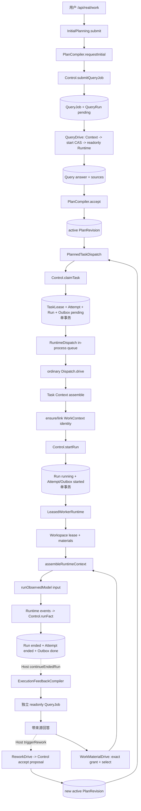
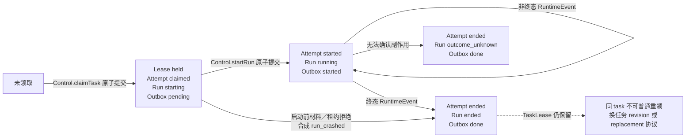

# 当前通信与运行调用链证据

> 调查 ID：CM-RESEARCH-CALLCHAIN  
> 调查日期：2026-09-12  
> 产品代码根（下文 `P`）：`D:/1.project/Software/agent_platform`  
> 权威文档根（下文 `D`）：`D:/1.project/Software/agent_learn/agent_dev/agent_platform`

本笔记只记录只读调查所得的当前事实、规范方向、待验证假设与取舍，不冻结跨域共享 Interface，也不表示任何产品代码已实施。证据优先级为实际源码与当前 `module-status.md`，架构文档用于判断责任归属；现有 collaboration-memory `PLAN.md` 仅作为候选需求，不作为“已经实现”的证据。

标记约定：

- **[事实]**：当前源码或唯一当前状态可以直接证明。
- **[规范方向]**：权威架构／Interface 已给方向，但当前消费者或 wire schema 未成立。
- **[多入口]**：已有多个驱动或受理入口，需决定复用、组合或淘汰关系。
- **[缺失]**：源码中没有对应持久对象或真实消费者。
- **[待验证]**：从源码推导出的风险；需要并发／中断测试才能升级成运行事实。

## 1. 结论先行

1. **[事实] 当前已有可靠的“任务 Run”底座，而不是通用协作运行基础设施。** `claimTask` 把 `TaskLease + TaskAttempt + Run + DispatchOutboxEntry` 原子落账；`startRun` 再把 Run、Attempt、Outbox 一次推进到 started/running；Runtime 事件经 Control 的单 Run CAS 和序号守卫落账。证据：`P/src/control/control-engine/claim.ts:170-183`、`P/src/control/control-engine/start-run.ts:122-143`、`P/src/control/control-engine/run-facts.ts:138-166,186-233`。
2. **[事实] 逻辑工作与 Run 已分开。** `WorkContextBinding` 是跨 Run 的持久工作身份，Run 只是一次执行；同一 task 工作身份的唯一性由 Control 先解析、Ledger 事务内 identity slot 兜底。证据：`P/src/contracts/context-continuity.ts:1-24,99-125`、`P/src/control/control-engine/work-record.ts:77-135`、`P/src/data/state-ledger/sqlite-ledger.ts:940-973`。
3. **[缺失] 没有通用 Agent 实例聚合。** 当前 `RoleBindingRefV1` 明说只是最小版本引用；“ActiveAgent”是 TaskLease／Attempt／Run／RoleBinding 的可重建投影，不是独立身份权威。证据：`P/src/contracts/dispatch.ts:82-93`、`P/src/contracts/active-agent.ts:1-6,25-75`、`P/src/contracts/console-views.ts:299-338`；当前状态亦把完整 Agent 实例管理列为未完成（`D/human/module-status.md:133-136`）。
4. **[事实] 已有一种定向请求闭环。** 源 Run 或正式 FAIL 触发独立只读 `QueryJob/QueryRun`，回答经来源／版本校验与精确 `MaterialAccessGrant`，只进入同一工作关联的后继 Run Context；它不是通用消息、订阅或运行中插话。证据：`P/src/control/plan-compiler/execution-feedback-compiler.ts:19-29,39-82`、`P/src/data/context-compiler/feedback-materials.ts:14-17,48-117,119-136`、`P/src/control/dispatch-engine/work-material-drive.ts:84-98`。
5. **[缺失] 通用消息、订阅、投递和持久等待目前没有产品类型或实现。** 对 `P/src/{contracts,control,data,execution,app}`（排除 UI／静态资源）检索 `Subscription|subscribe`、`WaitCondition|PersistentWait|WaitRef`、`DirectedRequest|MessageDelivery|Inbox`、`Notification` 均无命中。当前 StateLedger 公开面只有 `load/commit/events/pendingDispatchIntents`；候选 `PLAN.md` 自身也承认通用订阅对象、分发游标和事务尚待设计。证据：`P/src/contracts/ledger.ts:911-935`、`D/dev_docs/planning/active/collaboration-memory/READINESS.md:16-21,29-35`。
6. **[事实] 现有 Outbox 是 durable pending snapshot scan，不是带领取权的持久队列。** 两个 Ledger adapter 都扫描所有快照、筛 `status=pending`、按 ref 排序、截断；没有 consumer id、claim token、visibility timeout、delivery attempt、retry-at 或持久消费游标。证据：`P/src/data/state-ledger/sqlite-ledger.ts:919-933`、`P/src/data/state-ledger/in-memory-ledger.ts:824-835`。
7. **[多入口] “唯一入口”只对普通 outbox 消费面成立，不代表全产品只有一个调度器。** 当前还有人工计划派发、人工派发、并行派发、换手、Reviewer、Query 和返工触发等入口；它们对身份、replay、并发和后续工作的处理并不完全相同。`WorkspaceDrive` 与 `HandoffDrive` 只在 harness 暴露，正式 GUI 组合根使用 `RuntimeDispatch + ordinary drive`。证据：`P/src/harness/persistent-harness.ts:502-513,569-585`、`P/src/app/service.ts:186-220,252-267,369-448`。
8. **[事实] 正式 GUI 当前用进程内 Promise queue 收口普通运行、规划和返工触发。** 这些队列能减少单进程重入，但不是持久调度所有权；重启靠 canonical 账本与 runtime observation 扫描补做，不靠队列恢复。证据：`P/src/control/dispatch-engine/runtime-dispatch.ts:10-45`、`P/src/app/service.ts:258-267,326-327,408-448,737-780`。
9. **[事实] Runtime 当前不能恢复同一个真实模型会话。** 真实 adapter 声明 `replayable=false, supportsSnapshot=false`；启动时将遗留 `running` observation 改为 `outcome_unknown`，不自动重跑。真实 app 明确注入未配置的 handoff、continuation、safe-point 能力。证据：`P/src/execution/worker-runtime/coding-agent-runtime.ts:83-89,119-148`、`P/src/execution/worker-runtime/unconfigured-capabilities.ts:5-29`。
10. **[建议，不冻结] 第一条纵向实现应复用 Control/Ledger 的原子状态权威、现有 Context/Runtime 输入链和现有 ordinary launch 收口；不要直接把 `DispatchOutboxEntry` 泛化成收件箱，也不要再加一个会与 `planningQueue`／`semanticReworkQueue` 竞争推进同一工作的后台循环。** 先用一个“已发生或稍后发生的共享材料满足持久等待，恰好生成一个后继 Run”的场景验证身份、投递、等待竞态、唯一调度和重启恢复。

## 2. 权威职责与当前身份关系

架构要求 Control 保留角色、权限、状态转换与受理权威，Data 负责编译材料，WorkerRuntime 只完成一次 Run 并报告事实；StateLedger 是原子事实存储，Dispatch 只读 canonical 状态并把所有正式写入交 Control。证据：`D/ARCHITECTURE.md:80-85,95-121,191-264,277-292`。因此下面的“身份”不能由新调度器自行复制一份状态。

| 概念 | 当前真实身份／权威 | 当前语义 | 分类 |
|---|---|---|---|
| Task 工作 | `WorkContextBinding(projectId, workspaceId, workId)`，对 task 绑定 goal/task/plan/role/initialRun/linkedRuns | 一段连贯工作可跨多个 Run；task 的唯一工作身份由 Control 解析并由 Ledger identity slot 原子保证 | 已实现，可复用 |
| 任务领取 | `TaskLease(projectId, goalId, taskId)` | 同一 task 只有一个 holder Run；竞争 claim 返回 revision conflict | 已实现，可复用，但不是通用队列 claim |
| 尝试 | `TaskAttempt(projectId, goalId, taskId, attemptId)` | claimed→started→ended；携 plan 与 outcome | 已实现 |
| 执行 | `Run(projectId, goalId, runId)` | starting→running→ended；保存精确 envelope、事件序号与 outcome | 已实现 |
| 派发意图 | `DispatchOutboxEntry(projectId, goalId, taskId, attemptId)` | pending→started→done；与 claim 同事务创建 | 已实现，限定任务／Reviewer Run |
| 角色绑定 | `RoleBindingRefV1(bindingId, templateId, templateRevision, bindingVersion, policyRevision)` | Run／Work 引用版本；RoleSpec/Matrix 可受理校验，但 ref 不是完整 Agent 实例 | 部分实现；完整绑定生命周期仍是方向 |
| Agent | 无 canonical `AgentInstance` 聚合；`ActiveAgentView` 由 claim/start/fact 投影 | 当前 UI 中“Agent”实际是一条活跃 Run 行 | 缺失完整实例管理 |
| 查询 | `QueryJob + QueryRun + QueryJobAnswer` | 独立只读语义工作；不创建 Task/Plan，不修改源 Run 的 lease/义务 | 已实现，独立状态机 |
| 换手 | `HandoffPacket + ReplacementAttempt + Replacement outbox` | 老 lease 与替代 claim 有专门协议；正式 app 未接真实 runtime handoff | 协议／harness 已有，产品链未完成 |
| 生命周期控制 | `ControlIntent` + `SafePointAcknowledgement` | desired-state-first 持久记录已经实现；真实 Runtime apply 和 app 入口未接 | 文档与存储已实现，执行未接 |
| 订阅／等待 | 无当前类型 | `PLAN.md` 中的 Subscription/Wait 是候选需求 | 缺失 |

精确类型证据：

- TaskLease、Attempt、Run、Outbox 的 key 分别见 `P/src/contracts/dispatch.ts:16-75`；状态和值见 `P/src/contracts/dispatch.ts:181-215,221-280`。
- WorkContext 的 key、工作种类和 linked Run 见 `P/src/contracts/context-continuity.ts:59-125`；bind/link 的命令与 CAS 见 `P/src/contracts/context-continuity.ts:262-360`。
- QueryJob/QueryRun 的独立 key 和状态见 `P/src/contracts/query-job.ts:31-50,58-132`。
- ControlIntent 的作用域可指向 goal/task/run，状态为 queued/applied/rejected/timed_out/outcome_unknown；接口只定义 submit/ack，不含消费者队列。见 `P/src/contracts/control-intent.ts:71-145,270-297`。

### 2.1 TaskLease 不是 Worker/Delivery 领取租约

`TaskLease` 的作用是阻止同一计划任务被不同 Run 重复 claim。`claimTask` 读取 task lease，并在不同 holder 竞争时拒绝；同一 holder 只允许幂等 replay 落到账本处理（`P/src/control/control-engine/claim.ts:102-145`）。Run 终态提交只更新 Run、Attempt、Outbox，不更新 TaskLease（`P/src/control/control-engine/run-facts.ts:186-203,242-277`）。因此它不能直接承担以下职责：

- 某个通知由哪个 scheduler consumer 领取；
- 可见性超时后重新投递；
- 多订阅者各自消费；
- 等待条件的 all/any 进度；
- 取消、退避、死信和重试次数。

如果后续持久通信复用 “lease” 一词，必须与 TaskLease、WorkspaceLease 分开命名和建模，避免误把任务唯一性当作消息消费所有权。

## 3. 一条能暴露关键问题的当前纵向调用链

下面是正式 GUI 中“用户提交真实工作，执行反馈触发调查与同工作后继 Run”的真实组合关系。虚线部分是宿主显式触发，不是事件总线订阅。

对应源码入口：

- HTTP 受理、规划触发：`P/src/app/service.ts:526-554`。
- `InitialPlanning.advance` 顺序是先 drive queries，再 accept plan，再 drive pending planned work：`P/src/app/initial-planning.ts:13-18`。
- `PlannedTaskDispatch` 从 **当前 active revision** 选 required/active/work assignment，经 readiness/claim，然后 prepare+launch；一次 `drive` 最多启动一个候选：`P/src/control/dispatch-engine/planned-task-dispatch.ts:91-123,124-175`。
- ordinary outbox 顺序是 pending scan→Context→Work identity→Control start→Runtime→facts：`P/src/control/dispatch-engine/dispatch-engine.ts:34-158,191-229`。
- 宿主 Run 后续是 feedback Query→reverify/reviewer→rework；返工受理后再调用现有 `advancePlanning`：`P/src/app/service.ts:369-448`。

### 3.1 当前运行状态图

注意：`outcome_unknown` 在 canonical Run 中是显式终态，不是“等一会儿再重试”；见 `P/src/control/control-engine/run-facts.ts:10-20,242-285`。

## 4. 事件、队列、并发和背压的真实责任

### 4.1 事件持久化与投影

- **[事实]** SQLite `commit` 用 `BEGIN IMMEDIATE` 包住一次提交，事件、快照、幂等和 identity claim 同事务（`P/src/data/state-ledger/sqlite-ledger.ts:181-195,940-985`）。
- **[事实]** `events(afterCursor, limit)` 是全局有序分页读取；cursor 对调用者 opaque（`P/src/contracts/ledger.ts:911-942`、`P/src/data/state-ledger/sqlite-ledger.ts:198-215`）。
- **[事实]** ReadModel 推进由 harness／组合根显式拉取 event page；`lastCursor` 是该 harness 实例内的推进变量，ReadModel 自身保存可重建投影。没有事件推送或 subscriber registry（`P/src/harness/persistent-harness.ts:557-566`）。
- **[事实]** GUI 每次读取 state 前先推进投影，浏览器以 2.5 秒轮询 `/api/state`；不是服务器推送订阅（`P/src/app/service.ts:342-367`、`P/src/app/public/app.js:313-315`、`P/src/app/server.ts:41-47`）。

### 4.2 Outbox 与领取

- **[事实]** `pendingDispatchIntents` 只是读取 pending rows；没有原子“交给 consumer X”的操作（`P/src/contracts/ledger.ts:928-935`、`P/src/data/state-ledger/sqlite-ledger.ts:919-933`）。
- **[事实]** 真正把 pending 变 started 的互斥点是 `Control.startRun` 对 Run、Attempt、Outbox 三个 revision 的原子 CAS（`P/src/control/control-engine/start-run.ts:15-21,122-143`）。
- **[事实]** ledger 幂等判定优先于 CAS；同 identity/fingerprint 的重复 start 会返回 `committed, replayed=true`（`P/src/data/state-ledger/sqlite-ledger.ts:937-952`、`P/src/control/control-engine/start-run.ts:146-161`）。
- **[待验证]** ordinary、parallel、handoff 和 Reviewer driver 在 `startRun.status === committed` 后都调用 Runtime，没有一致检查 `replayed`：`P/src/control/dispatch-engine/dispatch-engine.ts:129-145`、`P/src/control/dispatch-engine/workspace-drive.ts:115-131`、`P/src/control/dispatch-engine/handoff-drive.ts:139-155`、`P/src/control/dispatch-engine/reviewer-dispatch.ts:67-70`。Query driver 则明确跳过 replay：`P/src/control/dispatch-engine/query-drive.ts:80-90`。真实 `CodingAgentRuntime.start` 用 per-run active/record 防止同一模型执行重复启动（`P/src/execution/worker-runtime/coding-agent-runtime.ts:120-144`），Fake 也声明 per-run idempotent（`P/src/execution/worker-runtime/fake-runtime-adapter.ts:4-17`），但跨 driver 的“只调用一次 side-effect port”目前由 adapter 偶然兜底，不是统一调度协议。应以并发驱动测试核实，不能先宣称会重复模型执行。

### 4.3 并发与背压

当前已有的并发约束是不同层级的局部机制：

| 机制 | 作用 | 不覆盖的责任 |
|---|---|---|
| `maxIntents` 默认 8 | 单次 ordinary/parallel/handoff scan 上限 | 不是全局并发度、队列深度或公平性 |
| `RuntimeDispatch.queue` | 正式 GUI 内普通 outbox drive 串行 | 非持久、非跨进程；不覆盖 Query/Reviewer/Rework |
| `planningQueue` | 初始规划／计划任务推进串行 | 非持久；依赖宿主重启扫描 |
| `semanticReworkQueue` + ReworkDrive 自身 queue | 单进程内返工触发串行 | 两层本地队列；不提供分布式所有权 |
| `WorkspaceRead/WriteLease` | 多读、单 workspace writer；冲突与权限经 Control+Ledger CAS | 冲突时当前 Run 失败，不是等待队列或重试策略 |
| Runtime `.platform-runtime/run.lock` | 真实 checkout 的额外单写保护 | Runtime 私有观察，不替代 canonical scheduler 状态 |
| 预算／deadline | 单 Run/Query 的资源上限 | 不调节整个工作区吞吐或积压 |

证据：

- `RuntimeDispatch` 的 queue：`P/src/control/dispatch-engine/runtime-dispatch.ts:10-45`。
- app queues：`P/src/app/service.ts:258-267,326-327,408-448`。
- Workspace lease 语义：`P/src/contracts/workspace-lease.ts:8-36`；真实运行先获取 lease、材料，再调用 runtime，并在终态事件后释放：`P/src/control/dispatch-engine/leased-worker-runtime.ts:24-66,92-96`。
- Runtime lock 与预算中止：`P/src/execution/worker-runtime/coding-agent-runtime.ts:187-241`。

两个边界不能误报为完整背压：

1. `pendingRemaining` 再次用同一个 `maxIntents` 查询并取 `.length`，因此它是“最多 N 条仍 pending”，不是总 backlog 数量（ordinary：`P/src/control/dispatch-engine/dispatch-engine.ts:157-158`；parallel：`P/src/control/dispatch-engine/workspace-drive.ts:162-163`）。
2. `WorkspaceDrive` 先全局取前 N 条普通 pending，再按 `(projectId, goalId)` 过滤；目标 slice 可能因别的 scope 排在前面而本轮一个也取不到（`P/src/control/dispatch-engine/workspace-drive.ts:34-41`）。它目前只在 harness 构造，未进入正式 GUI，但在决定是否保留该入口前应有公平性测试。

## 5. 多个派发／查询／返工入口如何实际组合

| 入口 | 做什么 | 是否进入正式 GUI | 与 ordinary outbox 的关系 | 分类／注意点 |
|---|---|---|---|---|
| `DispatchEngineImpl.drive` | 扫普通 pending，Context、Work identity、start、Runtime、fact | 是，经 `RuntimeDispatch` | 主消费收口 | 已实现 |
| `PlannedTaskDispatch.drivePending` | 从 active Plan 找 assignment，readiness、claim、prepare、launch | 是 | 产生 ordinary outbox，再触发主消费收口 | 已实现；一次只起一个候选 |
| `OperatorTaskDispatch.dispatch` | 人工真实任务／探索：prepare、必要时确保 Plan、claim、launch | 是 | 产生 ordinary outbox，再触发主消费收口 | 已实现；prepare 发生在 plan/claim 前 |
| `WorkspaceDrive.driveParallel` | 同一 goal slice 并发 assemble/start/runtime/fact | 否，仅 harness | 直接与 ordinary driver 消费同类 pending | 多入口，未与 app 收口；未调用 `ensureWorkIdentity` |
| `HandoffDrive.driveHandoff` | 只消费带 ReplacementAttempt 的 ordinary pending | 否，仅 harness | ordinary driver会跳过 replacement | 专门协议；真实 Runtime handoff 未接 |
| `ReviewerDispatch.drive` | 指定 ReviewWork，独立只读 Context/Run/输出绑定 | 是 | review outbox 不由 ordinary scan 消费；复用 ordinary fact consumer | 独立工作身份与恢复 |
| `QueryJobDrive.driveQuery` | 扫 QueryJob event refs，start Query CAS，调用 readonly Runtime，登记答案/关闭 | 是 | 不使用 DispatchOutboxEntry | 独立状态机，正确跳过 start replay |
| `ReworkDrive.driveRework` | 读 Verification 提供的问题材料，编译提案，Control 受理 | 是，由宿主触发 | 自己不 claim/dispatch；受理新 Plan 后 `advancePlanning` | 不是第二个 Worker scheduler |
| `/api/tasks/run` fixture | 直接 claim + `h.drive` | 仅显式 fixture 模式 | 绕过 `RuntimeDispatch` 的 post-Run continuation | 测试入口，不应当作正式链路 |

证据：

- `WorkspaceDrive` 和 Handoff 只有 harness 构造／暴露：`P/src/harness/in-memory-harness.ts:436-448,516-521`、`P/src/harness/persistent-harness.ts:502-513,580-585`；源码生产调用检索不到 `driveParallel`/`driveHandoff`。
- 正式组合根只构造 `RuntimeDispatch`、`OperatorTaskDispatch`、`PlannedTaskDispatch`：`P/src/app/service.ts:186-220,252-257`。
- `ReworkDrive` 明确只读 Ledger、只经 Control 写提案，不直接 dispatch：`P/src/control/dispatch-engine/rework-drive.ts:17-25,61-105,149-217`。
- Reviewer 自己以 WorkRef 去重进程内并复用 `consumeDispatchedRun`：`P/src/control/dispatch-engine/reviewer-dispatch.ts:24-35,64-70`。

### 5.1 必须收敛的行为差异

1. ordinary driver 在 Context ready 后、start 前建立或 link WorkContext identity（`P/src/control/dispatch-engine/dispatch-engine.ts:94-110`）；`WorkspaceDrive` 和 `HandoffDrive` 没有调用该统一入口。不能在未决定 Work 与 replacement/review/query 关系前把 parallel/handoff 当成等价替代。
2. ordinary/parallel/handoff/Reviewer 对 `start.replayed` 的处理不同于 Query；需决定“驱动幂等”由 scheduler 还是 Runtime adapter 保证。
3. Operator 先 `runtime.prepare`，再确保 plan／读取既有 Run／claim（`P/src/control/dispatch-engine/operator-task-dispatch.ts:85-112`）。如果后续校验失败，会留下 Runtime 私有 prepared record，却无 canonical Run；当前 recovery 会跳过找不到 Run 的 observation。这个顺序是现状，不应复制到新工作入口。
4. `WorkspaceDrive` 的“并行”属于 harness 能力；正式 app 由 RuntimeDispatch 全局串行 ordinary drives，PlannedTaskDispatch 每次起一个任务。不能以 WorkspaceDrive 的存在宣称正式产品已有并发调度。
5. 架构表中 `drive(trigger)（唯一入口）`（`D/ARCHITECTURE.md:176`）应解释为普通 durable outbox 的唯一消费入口目标；当前源码已经有专用 Reviewer、Query、Handoff 和 harness parallel 入口，实施计划需说明哪些将复用、哪些保留为专用状态机、哪些退出生产候选。

## 6. 定向请求、Context 与“模型实际消费”的证据

### 6.1 当前已经成立的闭环

1. `ExecutionFeedbackCompiler` 以源 `RunRef`、报告、plan/workspace/source pin（FAIL 时还含 issue ids）构造持久 `QueryJob`；相同当前请求复用，来源变化可建立 supersedes 链（`P/src/control/plan-compiler/execution-feedback-compiler.ts:19-29,39-82`）。
2. Query driver 从 durable events 重建 job/run refs，组装只读 Context，先 Control start CAS，后调用只读 Runtime；回答保存 Vault 正文并经 Control 登记（`P/src/control/dispatch-engine/query-drive.ts:21-40,41-104`）。
3. 后继普通 Run 派发时，`FeedbackMaterialCompiler` 只选择同 Work linked Run 或有匹配已受理返工提案的回答，重核 query/answer/source/currentness（`P/src/data/context-compiler/feedback-materials.ts:48-117`）。
4. Dispatch 为目标 Run 签精确 `MaterialAccessGrant`，再把回答组装成 `rules`（`P/src/control/dispatch-engine/work-material-drive.ts:84-98`）。
5. Runtime Context 对正文 digest、source refs、scope/plan/workspace/permissions/role 逐项核对，把规则正文加入最终 input 并记录 `manifest.selected`、选入原因与 `inputDigest`（`P/src/data/context-compiler/runtime-context.ts:50-90,118-141,175-179`）。
6. `CodingAgentRuntime` 保存该 Context 后，把完全相同的 `r.context.input` 传给 `runObservedModel`；后者作为内核 `runCodingAgent` 的 `input` 参数（`P/src/execution/worker-runtime/coding-agent-runtime.ts:189-195,227-235`、`P/src/execution/worker-runtime/observed-model-run.ts:20-22,41-58`）。

因此当前能证明的是：

- 指定版本回答正文被授权、编入某个后继 Run 的最终输入；
- 最终输入摘要和选入原因被 Runtime observation 保存；
- 该字符串实际作为模型运行请求的 input 交给内核。

当前不能仅凭这些证明模型在语义上采纳了通知。若要验收“模型实际消费”，还需让模型输出或工具行为引用该唯一版本／nonce，并由公开 trace、产物或正式验证检查；模型自称“我看到了”不够。

### 6.2 当前不成立的能力

- 没有运行中消息注入。`WorkMaterialDrive` 明确只在 `runtime.start` 前调用一次，WorkerRuntime 运行中不回调 ContextCompiler（`P/src/control/dispatch-engine/work-material-drive.ts:16-20`）。
- `RunHandle.pollFreshEvents` 是 Dispatch 对当前执行句柄的 pull，真实 adapter 用内存 wake promise 等新事件；它不是跨重启订阅（`P/src/contracts/ports.ts:17-27`、`P/src/execution/worker-runtime/coding-agent-runtime.ts:140-144`）。
- Runtime safe-point control 的 schema 与 Control 落账存在，但真实 app 注入 unsupported adapter，没有从 pending ControlIntent 到 Runtime `apply` 再 ack 的 dispatcher（`P/src/contracts/control-intent.ts:270-290`、`P/src/execution/worker-runtime/unconfigured-capabilities.ts:26-29`）。
- 所以在当前 Runtime 能力下，“等待后继续”只能诚实地结束当前 Run，持久等待条件，满足时启动有关联的新 Run；不得称为恢复同一模型内存。此方向与 `D/dev_docs/planning/active/collaboration-memory/PLAN.md:70-76` 和 `D/dev_docs/interfaces/context-lifecycle.md:53-59` 一致，但 wire schema 尚未验证。

## 7. 取消、重试与恢复

### 7.1 取消

- 正式 GUI `/api/real/cancel` 走 `OperatorTaskDispatch.cancel`，只核对 canonical Run 存在后直接调用 `CodingAgentRuntime.cancel`；不先写 ControlIntent（`P/src/app/service.ts:700-705`、`P/src/control/dispatch-engine/operator-task-dispatch.ts:116-120`）。
- Runtime 把 `cancelRequested` 保存，abort 活跃执行；已进入执行的 Run 最终产生 `run_cancelled`，Dispatch 消费后才成为 canonical Run outcome（`P/src/execution/worker-runtime/coding-agent-runtime.ts:163-168,243-250`）。
- `ControlIntent` 的 desired-state-first 持久协议及 ack reducer 已实现（`P/src/control/control-engine/control-intent.ts:19-38,53-83`），但 app 没有提交/派发它，真实 lifecycle adapter 明确 unsupported。故当前“普通取消”和候选“持久控制命令”是两个未统一入口。

### 7.2 重试语义

- claim/start/Query start 等普通 Control 命令使用 identity+fingerprint 幂等；同输入 replay，不同输入 conflict。
- Runtime fact 不用 Ledger 幂等表，按 Run expectedRevision、event sequence 和 event id 去重；rejected fact 后当前 driver 停止消费，调用者需重读（`P/src/control/control-engine/run-facts.ts:5-25,138-166`、`P/src/control/dispatch-engine/dispatch-engine.ts:191-229`）。
- ordinary Context 缺口发生在 start 前，Outbox 保持 pending，后续 drive 可重新尝试；Runtime 调用或 fact 提交不明发生在 start 后时，不再盲重试，而由 RuntimeDispatch 标 `outcome_unknown`（`P/src/control/dispatch-engine/runtime-dispatch.ts:21-40`）。
- Query 对 running job 明确报告 `outcome_unknown` 且不隐式重新调用 runtime；当前代码只记 drive failure，Job 本身仍保持 running，需后续产品处置（`P/src/control/dispatch-engine/query-drive.ts:41-64`）。

### 7.3 重启恢复

- `CodingAgentRuntime.init` 读取 observation journal；遗留 running 改为 outcome_unknown，禁止重新 start（`P/src/execution/worker-runtime/coding-agent-runtime.ts:83-89,133-148`）。
- `RuntimeDispatch.recover` 对 canonical 未结束 Run：prepared/unknown 记 explicit outcome_unknown；其他 record 只重放 journal 中比 canonical `lastEventSeq` 新的事件，不重新执行模型（`P/src/control/dispatch-engine/runtime-dispatch.ts:47-74`）。
- app 启动时先调用这条恢复，再扫描 review journal、人的决定、已结束 runtime records，补做反馈、返工与 planning（`P/src/app/service.ts:186-189,737-780`）。
- PlannedTaskDispatch 只自动继续 `Run.status=starting && envelope=null` 的未启动 outbox；已有 started envelope 或 Runtime running/unknown 必须走恢复（`P/src/control/dispatch-engine/planned-task-dispatch.ts:108-137`）。
- 当前状态只证明若干具体决定回流断点和 partial restart reconciliation；不证明所有强杀点恢复（`D/human/module-status.md:25,61,110-113`）。

## 8. 能力分类

### 8.1 已实现且可复用

- Control 的版本、权限、计划义务、角色矩阵与 task claim 守卫。
- StateLedger 的原子事件／snapshot／idempotency／outbox 事务和 opaque ordered events。
- task WorkContext 唯一身份、Run linking、不可变 ExecutionNote／WorkMemory revision 记录。
- Task/Attempt/Run/Outbox 状态机与单 Run event sequence 去重。
- Workspace 多读／单写 lease 与真实 Runtime checkout lock。
- ordinary Run 的 Context→start→Runtime→fact 收口。
- 独立 QueryJob/QueryRun 及只读 Runtime。
- 执行反馈／FAIL→Query→带来源回答→正式提案→后继 Run 精确补料的特定闭环。
- Runtime observation journal 与“不确定不重跑”的 partial recovery。
- ReadModel event projection和 UI 轮询查询。

### 8.2 文档有方向，但接口或真实消费者未确定

- 完整 RoleBinding：Agent／Task／Query/Coordination、职责、授权、预算和终止条件的统一绑定。规范方向见 `D/dev_docs/interfaces/runtime-collaboration.md:35-45`；当前源码仍是 minimal ref。
- 有界 assignment/question/report/proposal/handoff/discussion 消息与路由。规范见 `D/dev_docs/interfaces/runtime-collaboration.md:47-59,96-108`；无当前产品类型。
- Context continuation：记录类型存在，真实 runtime session restore/context resume/takeover 均 unsupported。
- ControlIntent 安全点控制：契约、Control 存储和 Fake adapter 有，正式 app/real Runtime dispatcher 无。
- WorkerRuntime public snapshot：契约方向存在，真实 app 注入 unsupported。

### 8.3 已有多个入口，必须统一或明确组合关系

- ordinary vs harness parallel vs handoff vs Reviewer 的 outbox 消费。
- planned dispatch vs operator dispatch 的 claim/prepare/launch 顺序。
- `RuntimeDispatch.queue`、`planningQueue`、`semanticReworkQueue`、Reviewer active map、Query drive 各自的本地并发控制。
- direct Runtime cancel vs durable ControlIntent。
- DispatchOutbox 状态机 vs QueryJob/QueryRun 状态机。
- event projection pull vs 候选 Subscription delivery cursor。
- rework host trigger vs 未来事件唤醒：必须保留“Verification 产事实、组合根传材料、Control 复核”的既有无环责任，不能让 Verification 回调 Dispatch。规范：`D/ARCHITECTURE.md:19-24`。

### 8.4 确实需要新增或纵向验证的能力

- canonical Agent/coordination responsibility identity（若产品确需可查询、可撤权、跨 Run 的 Agent 实例；否则明确不新增 Agent aggregate，只用 Work+RoleBinding）。
- versioned message/request ref 与正文 owner/source/access 关系。
- Subscription 的 scope/filter/start position/cancel/cursor 与每订阅者投递结果。
- Wait 的 all/any/timeout/cancel/已先发生竞态与“一次有效 continuation intent”。
- 持久 scheduler claim/ownership、visibility/heartbeat、并发上限、公平性、退避和 dead-letter/人工处置；或明确单进程宿主约束并给等价恢复证明。
- notification 被某个 Context version 选入、进入某个模型 request 的可观察 receipt。
- 新 Run continuation 与原 Work/Role/authorization/material version 的绑定。
- 真实 safe-point/pause/resume/steer 或明确只支持“终止旧 Run + 新 Run 接续”。
- query running/outcome_unknown、prepared-without-canonical-Run、started-but-no-runtime-observation 等断点的统一产品处置。

## 9. 未定问题与候选取舍（不冻结）

### 9.1 Agent 身份：独立实例还是 Work+Binding 的视图

- **候选 A：新增 AgentInstance。** 适合需要长期身份、跨 Work inbox、撤权、在线状态和用户可管理生命周期；代价是必须与 Work、RoleBinding、Run、subscription owner 定义唯一关系，容易复制 ActiveAgent 投影。
- **候选 B：不新增实例，使用 `WorkContextBinding + RoleBinding version + current/linked Run`。** 与当前事实最贴近，适合短生命周期角色；但需要明确谁拥有跨 Work 订阅、谁可撤销等待，以及“同一 Agent”在 UI/权限上的含义。
- **验证前必须决定的最小问题：** Subscription/Wait 的 owner 是 Work、RoleBinding binding instance，还是新 AgentInstance。其余展示字段可以在纵向实现中收敛。

### 9.2 通信存储：扩展 DispatchOutbox 还是独立 Delivery

- `DispatchOutboxEntry` 当前强绑定 task/attempt/run，终态意味着 Run 结束。直接复用会把“消息已投递”“等待已满足”“Run 已调度”压进同一个状态，并让 Query/Reviewer/普通 Run 的不同语义更难区分。
- 更稳妥的候选是正文仍放 ArtifactVault，Control 原子登记 Message/Request 及授权；Subscription/Delivery/Wait 使用自己的版本化状态，满足条件时只生成现有或扩展的正式工作/dispatch intent。是否把 delivery intent 放进同一个 Ledger commitKind，需要用“发布后崩溃”和“一页部分订阅者投递后崩溃”验证。
- 不建议把 `ledger.events` 当队列：它只有全局 opaque cursor，没有每订阅者持久 cursor/权限/取消/领取。

### 9.3 调度收口：一个 consumer 还是多专用状态机

- ordinary Worker Run 应继续走现有 `claimTask → Outbox → Context → startRun → RunPort → runFact`。
- QueryJob 因无 TaskLease、只读、独立回答和 multi-turn 状态，保留专用状态机有合理性；但共享 scheduler 需要统一 ownership/recovery/replay 语义，不能共享业务状态。
- Reviewer 有独立 work/output qualification，也可保留专用驱动，但 `start/fact/runtime recovery` 应复用同一可验证 primitive。
- Workspace parallel 与 Handoff harness 入口应在进入产品前证明它们与 Work identity、replayed start、fair selection 一致；否则不要作为新 scheduler 的模板。

### 9.4 等待后的 Runtime 行为

- 当前真实 Runtime 无 session restore/snapshot/safe-point delivery。推荐首切片把等待注册视为当前 Run 的显式产出／终止，满足时创建同一 Work 下的新 Run，并在 WorkContext link 中说明 predecessor/continuation basis。
- 如果将来实现同 Run safe-point，应由 Runtime capabilities 和 ack 证明，不由 queue 代理声称恢复；ControlIntent 的 desired/current 分离可复用。

### 9.5 取消与撤权

- Run cancel、Subscription cancel、Wait cancel、Role/Material grant revoke 是四种不同状态变化。不要用一个 `cancelled` 布尔值跨域复用。
- 需要决定撤权对已编译但尚未模型调用的 Context、正在运行的模型、已保存正文和后继 Run 分别如何处理。现有材料入口会在 Runtime start 前核验一次，运行中不会自动刷新。

## 10. 建议的纵向验证与放票门槛

本节是给主计划的证据导向建议，不是 Ticket 或冻结签名。

### 10.1 第一条纵向验证

使用场景：协调 Run 提交一个带来源的定向请求并注册“等待共享材料 A 或正式决定 B”；发布可能早于或晚于等待注册。Control 受理请求／等待并原子产生每授权接收者的投递事实；条件满足后只产生一个现有 ordinary 后继 Run。后继 Run 沿现有 WorkContext identity、Context compiler、Runtime input、run fact 路径执行，并输出可核对的 receipt，证明精确材料版本进入模型请求。

这条实现应由单一负责人贯穿 Host、Control、Ledger、Dispatch、Context、Runtime adapter 与验收，验证：

1. owner 身份选 Work/Binding/AgentInstance 后不会与 Run 混淆；
2. 事件先发生／等待先注册都不丢唤醒；
3. 重复、乱序、重启只生成一个有效 continuation intent；
4. 两个 scheduler 实例竞争时只有一个获得持久执行权，不能只靠进程内 Promise queue；
5. revoked permission、source revision change、timeout、cancel 都有明确终态；
6. 后继 Run 复用唯一 Work identity，权限不继承扩张；
7. `manifest.selected + inputDigest + model/tool witness` 能证明实际输入版本，而非仅通知“已发送”；
8. Runtime 不支持恢复时明确为新 Run，未知副作用不重跑。

### 10.2 实施前必须决定

- Subscription/Wait/Message owner 的身份（Work/Binding/AgentInstance）。
- directed request 与 broadcast event 是否共享正文，但分开 Delivery 状态。
- scheduler 的部署约束：只支持单宿主，还是从第一版就要求跨进程持久 claim。
- 等待满足后当前只支持新 Run continuation，还是首切片必须扩展真实 Runtime safe-point。
- Control 对发布、订阅、等待、continuation intent 的最小事务边界。

### 10.3 可在纵向实现中收敛

- 具体字段名、分页大小、局部 error code。
- poll 周期／本地唤醒实现，只要不承担 canonical 正确性。
- UI 展示布局。
- Query/Reviewer 何时迁移到共享 scheduler primitive；首切片可以只接 ordinary 后继 Run，但必须留对比测试。

### 10.4 释放独立子票所需证据

只有出现以下证据后，才适合把存储、调度、Context、UI 分拆给不同负责人：

- 两种时序（事件早于／晚于 wait）和两个重启断点均通过；
- 两个并发 consumer 只产生一个 Runtime invocation；
- publication、delivery、wait transition、dispatch intent 的 authoritative refs 和事务边界已由运行测试证明；
- 撤权／source stale 会阻止新 Context 使用，且不删除历史正文；
- 后继 Run 的 Work/Role/permission/material versions 可从 canonical state 重建；
- ordinary existing path 没有第二份 Task/Run/Outbox 状态；Query/Reviewer 差异有显式说明；
- 文档验证、模块依赖图通过只能证明静态一致性，仍需上述运行证据。

## 11. 风险清单与最小验证方法

| 风险／未定点 | 当前证据 | 最小验证 |
|---|---|---|
| 两个 driver 同读 pending 后重复调用 Runtime port | start replay 被多个 driver 当 committed；真实 adapter 自己防重 | barrier 同时启动 two drives，注入计数 RunPort；断言一次 start side effect、另一方明确 replay/owned_elsewhere |
| 本地 queue 重启丢触发 | queues 仅 Promise；app 另有启动扫描 | 在 publish/accept 后、host trigger 前强杀，重启应从 canonical pending work 自动推进 |
| wait lost wakeup | 尚无 Wait 对象 | 分别先 event 后 wait、先 wait 后 event；同事务/等价 CAS 证明只 continuation 一次 |
| parallel scope 饥饿 | 先全局 limit 后 slice filter | 多 scope 构造排序靠前 backlog；验证目标仍可公平领取或返回可诊断 backpressure |
| TaskLease 被错当 delivery claim | TaskLease 终态不释放且按 task 唯一 | 同 task 多通知／多订阅者场景，证明 delivery 不占用或篡改 TaskLease |
| query running 永久悬挂 | driver 只报 outcome_unknown failure，不 close | 强杀 Query runtime 后重启，验证显式 reconcile/人工处置与不可重跑语义 |
| cancel 状态分叉 | app direct Runtime cancel；ControlIntent 未接 | cancel 各断点强杀，确认 desired/current/canonical Run/Runtime observation 不矛盾 |
| 通知“已投递”但没进模型 input | 当前只能由 manifest/input 链证明 | 生成唯一 nonce/version；检查 Context inputDigest、公开 model request/trace 和产物引用一致 |
| source 更新或撤权后的旧材料误用 | 当前后继 Run start 前复核，运行中不刷新 | 在 selection、grant、Context assemble、model call 各边界更新/revoke，定义并验证拒绝或 outcome_unknown |
| Work identity 在 specialized driver 分叉 | only ordinary `ensureWorkIdentity` | replacement/parallel 后检查一个 task 仍只有一条 WorkContextBinding，linked Run 完整 |

## 12. 关键源码与规范索引

### 当前事实

- 当前状态总入口：`D/human/module-status.md:3-25,92-118,124-150`。
- 架构责任／DAG／不变量：`D/ARCHITECTURE.md:19-24,80-121,139-149,191-264,277-292`。
- Dispatch 基础协议：`P/src/contracts/dispatch.ts:16-93,115-215,221-280`。
- Ledger 公开面与实现：`P/src/contracts/ledger.ts:891-935`、`P/src/data/state-ledger/sqlite-ledger.ts:181-215,919-985`。
- claim/start/fact：`P/src/control/control-engine/claim.ts:63-183,223-242`、`P/src/control/control-engine/start-run.ts:41-161`、`P/src/control/control-engine/run-facts.ts:117-285`。
- ordinary/parallel/handoff：`P/src/control/dispatch-engine/dispatch-engine.ts:34-229`、`P/src/control/dispatch-engine/workspace-drive.ts:34-163`、`P/src/control/dispatch-engine/handoff-drive.ts:49-162,195-233`。
- 正式 app 组合：`P/src/app/service.ts:104-267,326-448,505-579,680-780`。
- Runtime/recovery/cancel：`P/src/execution/worker-runtime/coding-agent-runtime.ts:72-168,173-250`、`P/src/control/dispatch-engine/runtime-dispatch.ts:10-87`。
- Query：`P/src/contracts/query-job.ts:31-150`、`P/src/control/dispatch-engine/query-drive.ts:21-107`。
- Work identity：`P/src/contracts/context-continuity.ts:1-24,59-125,262-360`、`P/src/control/control-engine/work-identity-resolution.ts:1-32,57-109,163-195`。
- 定向补料到模型输入：`P/src/data/context-compiler/feedback-materials.ts:14-136`、`P/src/control/dispatch-engine/work-material-drive.ts:42-98`、`P/src/data/context-compiler/runtime-context.ts:56-179`、`P/src/execution/worker-runtime/observed-model-run.ts:20-58`。

### 规范方向而非实现证明

- Runtime collaboration extension draft：`D/dev_docs/interfaces/runtime-collaboration.md:35-59,69-82,92-110,127-136,159-177`。
- Context lifecycle：`D/dev_docs/interfaces/context-lifecycle.md:13-23,38-59,71-99`。
- Module boundaries：`D/dev_docs/interfaces/module-boundaries.md:30-81,91-142`。
- Dispatch Module：`D/dev_docs/modules/control/dispatch-engine.md:14-26,38-55`。
- WorkerRuntime Module：`D/dev_docs/modules/execution/worker-runtime.md:30-55`。
- StateLedger Module/Interface：`D/dev_docs/modules/data/state-ledger.md:14-40,54-110`、`D/dev_docs/interfaces/state-ledger.md:129-159,201-207`。

## 13. 调查边界

- 本次未修改产品代码、未执行功能实现、未提交或推送 Git。
- 未把历史 Assistant 的完成声明当作当前事实。
- 本笔记没有冻结 Message、Subscription、Wait、AgentInstance 或 Scheduler 的字段／签名。
- 负向检索只证明当前上述源码目录中没有对应命名类型；若未来选择复用别名，仍须沿实际事务与调用链证明语义，而不能仅凭名称判定。
- 文档检查通过仅表示链接／格式／静态约束通过，不表示并发、恢复、模型消费或产品闭环已经运行验证。
