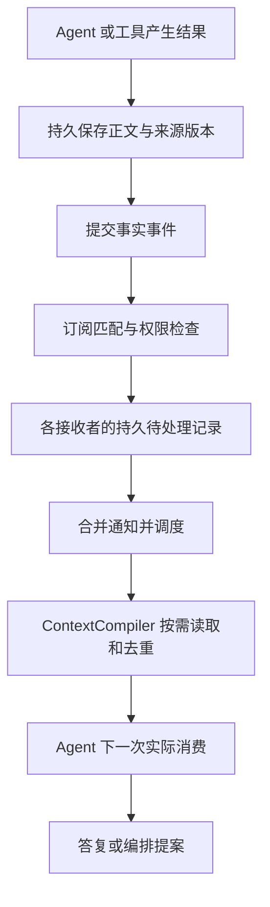

# Agent 通信基础设施与可扩展编排：讨论整理

日期：2026-09-12。性质：用户讨论整理与候选设计，供后续实现和审阅；不是已冻结通信协议，也不是新增能力验收。本文只新增讨论文档，不改变进行中代码、正式架构、Ticket 或阶段批准。

依据：[前次角色模板讨论](2026-09-11-agent模板与通用协作角色-对话记录.md)、[产品要求](../../PRODUCT.md)、[架构](../../ARCHITECTURE.md)、[当前模块状态](../../human/module-status.md)、[运行时协作](../interfaces/runtime-collaboration.md)、[Context 生命周期](../interfaces/context-lifecycle.md)。当前状态以模块状态页为准，下面是整理时点快照。

## 1. 用户关注点与方向

- 秘书、参谋、书记和执行者应能通过 Agent 模板、工具集合和职责描述表达，领域扩展不依赖写死角色名。
- 用名称、简介和名片展示 Agent，让人知道它能做什么。
- 下一步重点是 Agent 通信基础设施和真实编排，而不只是增加模板。
- 通信讨论同时涉及进程、异步任务、队列、发布订阅、网络连接等运行基础设施，以及上层消息语义。
- 同一事实可能被多个 Agent 引用，不能只设计逐对发送正文；应提前考虑共享材料、Context 编译和缓存。
- 编排应放在 Harness、某个协作角色，还是由可扩展能力临时提供，需要明确分层。

用户最后提到的“Scale”暂按可能指 Skill 理解；若指另一种机制，扩展载体需另行明确。本文关于 Skill／插件的内容是建议，不记录为用户已经选定的技术方案。

## 2. 当前已经实现的范围

根据当前模块状态与本批实现记录，已有：

1. RoleSpec 同角色多版本安装、激活和版本化引用；模板创建与职责、工具展示。
2. 初始规划读取可用模板，派发按任务授权和模板能力交集生成实际权限；Runtime 根据实际信封组装工具。
3. 协调 Context 包含其他工作的指派、依赖和正式归约依据。
4. 工作记录中有带来源的记忆版本链、更新和废止；Context 排除已被替代或废止的记忆，历史读取仍核对授权。

“名片”目前是治理页面中的模板信息展示基础，不代表独立 Agent 广场、完整实例管理或高级模板编辑器已完成。工具能力仍主要是 read／write／shell 及其运行时映射，尚无完整非 Coding 外部工具适配体系。

模板和跨工作选材已经接通，不等于持续联合协商、消息路由及冲突重规划全链路已完成。长期记忆也尚缺自动提炼、完整产品写入和维护界面。

本批记录为 302 个文件／1997 项行为测试、28 项浏览器测试，以及类型、模块边界、构建和文档检查通过。这里只引用既有验收，不声称本次重新执行；模型替身验证流程，不能证明真实模型协作质量。

## 3. 通信分层：运行位置、传输、语义

这些是不同维度，可以组合：

| 维度 | 需要回答的问题 | 候选形式 |
| --- | --- | --- |
| 运行位置 | Agent 运行在哪里 | 同进程异步任务、不同线程、不同进程、不同机器 |
| 传输与通知 | 数据和唤醒如何到达 | 内存队列、进程间管道、Socket、HTTP／持久连接 |
| 分发模式 | 谁接收 | 定向收件队列、按任务或事件类型发布订阅 |
| 应用语义 | 收到后是什么意思 | 协作请求、事实通知、答复、计划提案、消费回执 |

发布订阅可以在进程内实现，也可以通过网络服务实现；它与“维护端口”不是二选一。可借鉴 ROS 的发布订阅思路，但本讨论没有决定引入 ROS 或任何特定消息中间件。

建议第一阶段采用一个平台宿主、多个异步 Agent 运行、持久待处理记录和进程内唤醒。每个 Agent 不必独占线程或监听端口。未来跨进程、跨机器时，可由 Worker 主动连接平台服务，通过传输适配扩展；具体选型应由部署需要驱动。

已有 SQLite 账本、事件读取、派发 Outbox 和 Runtime 内部唤醒可复用；它们尚不能被描述成完整的通用 Agent 收件箱、订阅服务或远程 Worker 连接管理。

## 4. 共享事实与定向协作

建议区分三类对象：

- 事实与产物：保存正文、来源、版本和可验证身份，例如报告、工具观察、文档及决定。
- 事件通知：说明某事实产生或更新，携带引用，供订阅者发现变化。
- 协作请求：要求特定角色或实例处理某件事，引用事实并产生可追踪答复。

正文逻辑上保存一份、多个授权消费者引用，不要求单机永不复制物理字节。内容哈希相同也不意味着权限或业务来源相同。共享事实是公开观察或明确提交的解释，不包括隐藏思维。

示例：执行者提交失败报告，参谋读取完整报告分析，协调者读取当前工作影响，书记保存报告引用和决定关系。三者可消费不同片段，但来源都能追溯到同一报告版本。通知本身不等于模型已经读取正文。

## 5. 通信协议应表达什么

以下是语义检查表，尚非最终字段名或新独立协议；实现时先映射现有 QueryJob、ExecutionFeedback、ArtifactRef、PlanRevision 等契约，避免重复体系。

| 信息 | 目的 |
| --- | --- |
| 消息身份、类型和协议版本 | 去重、解析与演进 |
| 发送实例／Run、接收者或订阅范围 | 路由并区分模板与具体运行身份 |
| Goal／Task／Work 及计划版本 | 明确归属，识别过期请求 |
| 因果关系、请求与答复关联 | 追踪为什么发生、回复哪次请求 |
| 材料引用、来源版本 | 多方引用、按需读取和一致性核对 |
| 授权依据及有效范围 | 投递、读取和行动分别受约束 |
| 消费结果、拒绝或失效原因 | 恢复与可解释性 |

需要分别记录“已持久接收”“已调度／投递”“实际进入某次模型输入”“请求已得到处理”。这些不是一组已经确定的枚举，更不能直接推出业务目标完成。

候选可靠性方案：持久事件与待投递意图原子关联，采用可重复投递和幂等消费；订阅者保存消费位置。只承诺所需范围内的顺序，例如同一工作或版本链，不先要求全局严格排序。不宣称网络投递能够提供业务副作用的 exactly-once。

断线或重启后从持久事实恢复；唤醒信号可以丢失，待处理请求不能仅存在内存。外部动作结果未知时进入核对流程，不能用重复执行代替恢复。

## 6. 异步调度、Context 和缓存

运行中的模型请求通常不能直接插入新消息。Runtime 应在下一次模型调用或工具边界消费待处理事件；需要立即改变行为时，使用明确的中断和接续机制。中断、取消和暂停不能混为一谈，当前也不能假设完整机制已经实现。

通知先进入队列，再按相关性、优先级和并发容量处理。允许合并同类进度变化，避免每条事件触发每个 Agent 的模型调用；必须保留需要逐项处理的决定、失败及操作请求。背压、合并和局部顺序规则需进入实现验收。这不设置用户未授权的累计 Token、调用数或时长预算。

| 缓存层 | 复用对象 | 有效性依据 |
| --- | --- | --- |
| 资源读取 | 固定版本正文 | 来源身份、内容版本，读取时权限 |
| 材料加工 | 解析、分段、摘要、索引 | 输入版本、加工器／策略版本；摘要保留来源 |
| Context 编译 | 可复用片段或相同输入的编译结果 | 角色绑定、授权、计划版本、材料版本、编译策略及容量条件 |
| 模型服务缓存 | 服务支持的输入前缀等 | 具体服务行为，需要独立验证 |

缓存命中不能绕过授权撤销和来源有效性检查。历史 Run 保留其实际消费版本，新 Run 按当前适用版本重新核对。记忆是经过适用性管理的材料，不是所有通信日志自动变成长期记忆。

共享材料减少重复读取和加工，但多个模型分别推理仍可能重复消耗输入 Token；不能只凭共享引用承诺推理费用下降。最终应记录运行消费清单，并检验清单与实际模型输入一致。

## 7. 编排权如何分层：推荐方案

建议采用“可替换的语义编排策略 + 平台强制执行机制”。Harness 在这里指运行支撑的统称，不是新增 Module，也不意味着把全部业务逻辑放入 app 组合根。

| 层面 | 应承担的责任 |
| --- | --- |
| 协调 Agent | 理解目标、拆分工作、选择模板、提出依赖、分析冲突、组织重规划 |
| Skill／工作流配置／插件 | 提供领域协作方法、流程模板或策略实现，调用正式平台能力 |
| PlanCompiler | 承接协调请求与提案，形成现有正式计划处理路径 |
| ControlEngine | 校验授权、作用域、版本与义务，受理计划和角色绑定，保有正式状态权威 |
| DispatchEngine／WorkerRuntime | 依据已受理事实排队、派发、执行、处理消费边界与运行回执 |
| Data 模块 | 保存共享事实与正文，查询投影，按权限编译 Context |

语义上的“接下来做什么”可以交给协调 Agent；“是否获准做、如何可靠执行、何时可以宣布完成”由既有平台规则落实。已授权范围内的普通分工和重规划可以自动受理，无需每一步问人。只有超出授权或需要新的业务选择时，才提交具体选项和影响。

不建议仅凭“秘书／参谋／书记”名称固定编排权限。可为某个任务将协调职责绑定给秘书模板，复杂任务则使用独立协调模板；参谋通常给方案，书记维护公开记录。是否允许提交计划提案，应由职责与本次绑定确定，名称本身不产生权限。

同一工作范围可先采用一个当前有效的协调责任绑定，其他角色提供建议；多个协调者并行时必须校验计划基础版本和冲突，不能让两份提案无检查地覆盖同一工作。具体并发接纳规则尚待设计。

Skill 适合描述方法，声明式工作流适合固定步骤，插件适合新增工具或可执行策略。三者都不能自行扩大权限、直接改账本或跳过完成依据。插件代码的隔离方式需专门设计，不能假定加载插件就天然安全。

基础设施先提供稳定的提案、事实引用、定向请求、订阅、答复和调度入口，再用一个内置协调策略跑通真实消费者；可插拔性应围绕真实替换需求形成，不必先构建完整插件框架。

## 8. 工作流设想与下一步验收

建议先做一条不依赖 Coding 专用产物的多工作样例：

1. 用户提出带明确验收方式的目标；协调 Agent 选择两个执行模板，形成正式计划和分工。
2. 两个执行者并行收集不同材料，将结果保存为有来源的共享产物。
3. 一项新事实同时影响两个工作，订阅者收到引用；协调者发现结论或约束冲突。
4. 参谋分析影响，协调者提交带基础版本的联合重规划；Control 受理或给出具体拒绝原因。
5. 所有受影响工作在后续运行实际消费新计划与材料；未受影响工作继续推进。
6. 集成角色形成报告，Reviewer 按声明的验收方式检查；业务判据不足则保留待确认状态。
7. 书记保存公开决定和交接来源；记忆提炼作为后续受控步骤，不把日志直接当作有效记忆。

验收至少覆盖：一份事实被多个授权消费者引用；无权限订阅者不获得受限内容或元数据；同一事件重复投递不重复执行动作；提交后未唤醒和消费后未确认的恢复；过期计划请求被识别；受影响 Run 的实际输入版本可验证；新模板能使用同一通信通路。

建议顺序是：共享事实引用与持久分发 → 收件队列、订阅及消费边界 → 一个实际协调策略的多工作冲突与重规划样例 → 恢复和效率测量 → 根据真实需求扩展工作流／Skill／插件及跨进程传输。长期记忆在这些真实消费者上继续补齐提炼、维护和跨任务复用。

## 9. 待决与落地边界

尚未选定：是否立即需要远程 Worker；传输协议与消息中间件；订阅重放和保留期限；多协调者接纳规则；可执行插件隔离；具体通信字段及模块内路由归属。“Scale”的含义也未确认。

本次建议与现有架构中“语义协调提出方案、Control 受理、Execution 承载运行”的分责一致。正式实现前，将接受的细化回写对应 Interface 和必要 Ticket，不能让本讨论文档成为第二套当前协议。本次仅新增本文，未修改产品源码、模块状态、正式规范或 Git 提交。
