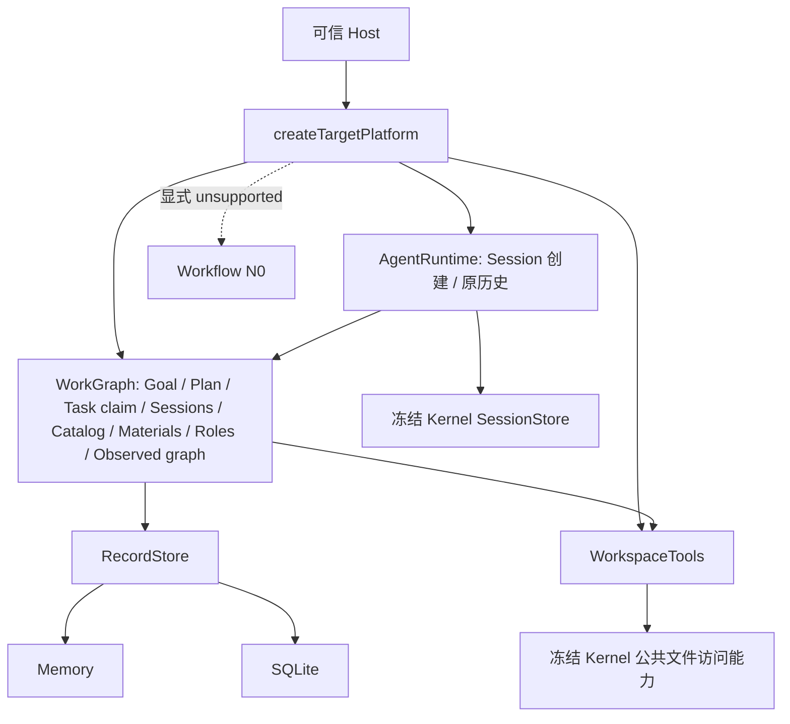

# coding-platform 独立目标工程

2026-09-25。后续重构代码在本目录开发，原 `../src`、`../tests` 是只读参考。这里仍属于同一个 Git 仓，但拥有自己的源码、配置、装配与验收入口；实现不导入旧平台服务。

**最新 B1/W1 已验收：** 78 个测试文件 / 726 项物理隔离通过。现有模型循环支持受信 Skill/Hook 及首次有效使用时打开源码工具；现有 Plan 接口支持 Host 对未来任务的修改、取消和拆分，并保持未变任务的状态来源和历史。正式 Role→执行、观察归约/释放及 Agent 白板工具/Workflow 自动推进仍待完成。见 [本批报告](../../docs/refactor/reviews/next-b1-w1-2026-09-25.md)；下文 A1 及迁入结果保留为前序能力。

本批迁入并验收：WorkspaceTools、Goal 创建领域操作、材料准入/正文、Memory/SQLite RecordStore，以及 R3c 的材料事实与候选索引读取子项。本轮另补齐 26 个 Workspace 实际文件、Python/C++ provider 与运行资源、模型源码工具循环，以及 Work/Review/Query 来源绑定；初始Plan/任务事实查询和Session创建/目录/历史/故障重试已接通；本批角色规格和持久源码观测/邻域/比较/影响也已接入组合根；现有模型循环已透传冻结Kernel连续历史和执行身份，新增Plan v2关系/精确输入，候选不再要求前驱整个Task完成，实际输入经readTaskInput复用材料当前授权；Task领取已接入platform.claims，同事务建立Lease/Attempt/Run/outbox和Session占用，原回执可查询；执行精确事实已接入platform.executions，Kernel定向原始历史已接入runtime.readExecutionHistory；图定位历史读写已接通，Kernel分页复用主键范围读取；Source精确事实组件已接真实Material reader，正式AgentRuntime执行与Workflow仍unsupported，UI未迁。

最新 A1 另接通正式初始架构目录、Session 与 Module/Task 的关联开闭、目标索引发现、显式归档/重新启用；真实 SQLite/Kernel 重启保留关系与历史。Session 未关联模块时仍可在正式目录建立前创建。完整依据：[产品](../../docs/PRODUCT.md)、[架构](../../docs/refactor/ARCHITECTURE.md)、[用户纠偏](../../docs/refactor/intent/2026-09-24-TARGET-PROJECT.md)、[A1 验收与后续任务](../../docs/refactor/reviews/next-a1-graph-session-2026-09-25.md)。详细接口设计是目标；本 README 说明实际已交付范围。开始施工必读[已实现能力与复用入口](../../docs/refactor/IMPLEMENTED-CAPABILITIES.md)的相关条目，再沿源码与测试核对；不要重建已经存在的解析、归约、事务和模型循环。

## 目录与调用路径

```text
next/
├── src/
│   ├── business/workflow/     # N0 unsupported 骨架
│   ├── core/
│   │   ├── work-graph/        # Goal、Plan/领取、Session关联/归档、Catalog、材料、角色和源码观测
│   │   ├── record-store/      # 单连接事务、正文、注册索引
│   │   ├── workspace/         # capture/read/query/compare/verify + 用途 reader
│   │   └── agent-runtime/     # 模型工具/来源绑定；Session创建/历史；执行入口尚未接通
│   ├── contracts/            # 当前子集实际引用的结构与纯判据
│   └── composition/          # createTargetPlatform
├── tests/                    # 726 项独立检查与迁入行为回归
├── scripts/                  # 模块边界与隔离验证
└── vendor/coding-agent/      # 冻结的 Kernel 公共运行产物
```



模块边界门禁使用完整目标的 5 模块/8 条允许边，目前实际 import 为 5 条（含窄事实读取类型）。图中的装配和物理后端不是新增业务模块。端口类型引用也计入静态依赖；不能用边数判断功能完成。

## 使用与验证

使用工作区现有 Node 24 和第三方依赖；没有要求重装依赖。运行：

```sh
source /home/hyh001/projects/coding-platform/.toolchain/env.sh
cd /home/hyh001/projects/coding-platform/coding-platform/next
node --run verify:isolated
```

验证器把本目录复制到临时目录，不复制旧平台源码，只连接已安装的第三方包；随后检查边界、类型、构建、726 项测试，并真正加载构建产物创建/关闭平台。静态门禁同时检查路径别名、动态加载、源码符号链接、依赖包、冻结 Kernel 的导入闭包及非代码资源哈希。它不是通用的恶意代码安全沙箱；DSH 的文件写权限另由工作区 runner 限制。

可单独运行 `node --run check:architecture`、`node --run typecheck`、`node --run build`、`node --run test`。本目录不是原产品 Web 应用，暂不提供 `start` 或 GUI。

可运行[A1 图关联演示](scripts/graph-session-demo.mjs)：

```sh
node --run build
node scripts/graph-session-demo.mjs
```

它在自建临时目录中仅初始化 Project/Workspace，再通过真实平台入口创建 Kernel Session、采用目录、挂靠模块、发现两个待命 Session、归档、重开数据库和重新启用。默认清理自己的演示目录，传 `--keep` 可保留。演示不调用模型，不代替产品 bootstrap、Skill 装配或咨询功能。

## 装配边界

`src/composition/create-platform.ts` 的异步工厂接收 Memory/SQLite 存储选择和可信 `WorkspaceHostBindings`，返回 `goals/plans/claims/executions/sessions/materials/roles/architecture/workspace/runtime/workflow/close`。它自行创建目标 Store 和材料 reader，不接受旧 Ledger、ReadModelIndex 或 ArtifactVault 实例。Host 负责提供真实的工作区定位与访问授权。

SQLite 路径由调用者指定，本批只在临时测试/演示目录验证，未操作用户已有业务数据库。迁入现有文件格式不等于已完成整库升级：当前 schema 注册 Goal、Plan/任务事实、领取 Attempt/outbox、Session/关联、正式 catalog、材料、角色与源码观测所需记录；未迁操作仍不支持。Goal 创建需要已受理的 Project/Workspace，初始计划与初始架构采用已接通，完整产品 bootstrap 入口仍待实现，不以任意原始写接口替代该业务。

`vendor/coding-agent/dist` 与 `resources` 是实体文件的冻结依赖，不是旧源码链接。Kernel 的原 package.json 保留来源元数据，其开发脚本不作为本产物的构建入口。对应哈希、来源和本批状态见验收记录。后续 Kernel 改动必须单独验收并重新冻结。本轮范围读取的受管补丁源与可再现构建入口见 [Kernel README](vendor/coding-agent/README.md)，四项产物已重新核验。

## 后续施工

继续采用 **Astra 架构/接口 → DSH 4.1F 骨架与测试 → Astra 审核冻结 → DSH 实现 → Astra 审阅 → 隔离测试**。已迁范围在目标工程内部删除重复实现；旧参考源码在最终产品切换前保留，不继续新增旧装配适配层。

按[实施方案 §0](../../docs/refactor/IMPLEMENTATION-PLAN.md)保留完整 A/B/C/D 路径：A1 已交付上述图关联子集；B 接角色/Skill/材料装配、真实 Kernel 进入、观察归约与占用释放；C 接沿图咨询、Session 定址消息及秘书/参谋/书记 Skill；D 接控制恢复与重组。B 的具体复用与调用顺序见[Runtime §7.1](../../docs/refactor/modules/core/agent-runtime.md)，C 的协议/Skill 准备可并行。正式 Runtime/Workflow 与 Query 真实事件接线仍待完成，不把事实夹具当生产实现。超出 W1 的 R3c 完整授权计划变更、后续正式架构演进、R3e/f、R4 余项、R5/R6 仍开放；R3g 记忆与知识库不作为当前交付前置；初始计划、Task 领取、图历史定位与本批 A1 不重做。角色解析不授予执行许可，observed 图不替代正式 baseline。

## 补迁组件的使用边界

`core/agent-runtime/observed-model-run.ts` 已能经冻结 Kernel 执行模型与工具循环；`source-capture-access.ts` 保留已受理 Work/Review/Query 的身份、范围和当前资格检查。后者的 Work 路径消费 WorkGraph 的 `SourceSnapshotReads`，已有 `createSourceAuthorityReader` 组件；Query 原发起者路径仍要求完整 `SourceAuthorityReads.events`，其 provider/完整受理链尚未闭合。它们不是平台 `startRun` 或连续 Session 的完成声明。

Python provider 使用目标内冻结 Jedi/Parso archive 和 helper；C++ provider 另需宿主 Python 3/libclang，缺引擎明确报告不可用。`runtime-assets.json` 锁定 helper、分析依赖包与 Kernel skill 文件，避免新副本缺资源却通过类型检查。本机隔离验收实际执行了这些语言测试，未跳过。
