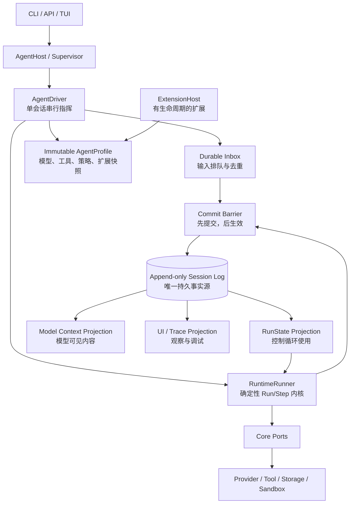

# Agent Core 演进总览

```yaml
status: proposed
baseline_commit: a91cde6
proposal_branch: codex/agent-core-evolution
updated: 2026-08-27
audience: 第一次接触 Agent 架构的读者、短上下文模型、实现者
```

## 30 秒读懂

Coding
Agent 现在已经有一颗可靠的“执行内核”：模型和工具不能直接改状态，每次变化必须先形成事件、可靠写入 Session 日志，再由 Reducer 算出新状态。崩溃后也从日志恢复。

下一阶段不是推翻内核，而是在它外面补四样东西：

1. `AgentDriver`：像班主任一样，一次只安排一件事；
2. `Inbox`：像排队窗口一样，保证新消息不丢、不乱序；
3. `AgentProfile`：像盖章后的课程表，固定本次会话使用的模型、工具、策略和扩展；
4. 多种 Projection：同一份事实日志分别生成运行状态、模型上下文、界面和追踪信息。

一句话原则：**同一个事实只能有一个权威来源；灵活性来自可替换边界，不来自多个模块同时改状态。**

## 目标架构图



图里最重要的不是方框数量，而是箭头方向：输入和状态变化必须经过提交屏障进入日志；界面、模型上下文和
`RunState` 都从已提交事实产生。

## 当前已经可靠的部分

- 版本化的 Run、Turn、AgentEvent、RunState 和边界 schema；
- required event sink：写入失败时不能假装状态已经成功；
- Reducer 单向推进与状态不变量检查；
- 模型流、工具调用、权限、审批、沙箱、取消和限制闭环；
- append-only Session、校验和、乐观并发、Checkpoint 和跨进程恢复；
- OpenAI/DeepSeek 显式 Provider、Skill、Empty Memory、CLI 与 Composition Root；
- 确定性测试、真实 bubblewrap E2E 和 benchmark replay。

因此，`RuntimeRunner`
应继续保持小而严格。通用能力应加在它的外面，不能把热插拔、队列、多 Agent 和所有产品逻辑都塞进循环。

## 三类“真相”

### 1. 事实：Session Log

已经发生什么，只看 append-only 日志。记录不可原地改写；修正通过追加新事实完成。

### 2. 配置：AgentProfile

本会话允许什么，只看冻结的 Profile 快照。Profile 包含 Provider、工具、Hook、策略、上下文投影器和扩展版本，并保存摘要。运行中的会话不能悄悄换配置。

### 3. 顺序：Inbox

下一件要处理什么，只看持久 Inbox 的顺序和状态。`send`、`steer`、`follow-up`、恢复输入都先入队，再由 Driver 串行领取。

这三者不要合成一个大对象：事实、配置和待办的生命周期不同，分开才容易恢复和测试。

## 为什么既稳定又通用

| 需要          | 做法                                        | 避免的问题                |
| ------------- | ------------------------------------------- | ------------------------- |
| 稳定状态      | 事件先提交，Reducer 后计算                  | 内存说成功、磁盘却没有    |
| 可换模型/工具 | 依赖 Port 和 Adapter                        | 厂商协议污染 Core         |
| 可加扩展      | Profile 在启动时装配并冻结                  | 运行一半规则突然变化      |
| 长上下文      | 原始事实不删，只追加摘要事实                | 摘要无法追溯              |
| 多 Agent      | 每个 Agent 有自己的 Session、Inbox、Profile | 共享可变状态互相污染      |
| 可观察性      | 提交后发布 Signal，不反向改事实             | 日志/界面故障改变业务状态 |

这对应一些成熟后端结构：Event Sourcing/CQRS、六边形架构、Actor Mailbox、微内核插件、Saga/Process
Manager，以及类似 Transactional
Outbox 的“先提交、后通知”。它们不是时髦词，而是在回答所有权、顺序和失败恢复问题。

## 分阶段改造

| 阶段 | 内容                                              | 验收标准                                             |
| ---- | ------------------------------------------------- | ---------------------------------------------------- |
| A0   | 文档和状态校正，本提案落地                        | 文档与代码、测试一致                                 |
| A1   | Session v2：lineage、profile digest、扩展事实信封 | v1 可迁移；未知可忽略事件不破坏恢复                  |
| A2   | AgentDriver + durable Inbox                       | 重启后消息不丢；重复输入不重复执行；单会话无并发竞态 |
| A3   | `ContentBlock` + Context Projection               | 文本/图片/文件引用可穷尽映射；模型所见都有日志依据   |
| A4   | append-only Compaction + Fork                     | 原记录保留；摘要带来源区间；可从历史边界派生新会话   |
| A5   | Immutable Profile + ExtensionHost 生命周期        | 注册可撤销；同一 Profile 重放结果不因热更新漂移      |
| A6   | AgentSupervisor / Subagent                        | 子 Agent 独立状态；取消、深度和预算可向下传播        |

每阶段都先增加 schema/contract 测试，再接生产 Adapter；旧版本读取和失败恢复必须属于验收，而不是最后补做。

## 明确不做

- 不允许扩展直接写 `RunState`；
- 不把 UI 事件、调试日志当作持久业务事实；
- 不在活跃 Run 中热替换 Provider、工具或安全策略；
- 不通过删除/改写旧日志实现回滚；
- 不让多个 Agent 共享一个可变 Context 或工具执行状态；
- 不为尚无真实使用者的接口提前建立庞大插件体系。

## 名词小抄

- **Event / 事实**：已经发生、可以重放的记录。
- **Projection / 投影**：根据事实算出来的视图，可以重建。
- **Profile / 配置快照**：一次会话固定使用的能力组合。
- **Inbox / 收件箱**：按顺序等待处理的输入。
- **Port / 端口**：Core 需要某项能力时使用的稳定接口。
- **Adapter / 适配器**：把 OpenAI、DeepSeek、SQLite 等具体系统接到 Port。
- **Signal / 信号**：提交后的临时通知，丢失不影响事实正确性。

关系调研见 [Coding Agent、DSH 与 Pi](dsh-pi-relationship.md)，模块边界见
[下一阶段模块图](next-module-map.md)，逐步事件顺序见
[下一阶段数据流](../data-flow/next-agent-data-flow.md)。
