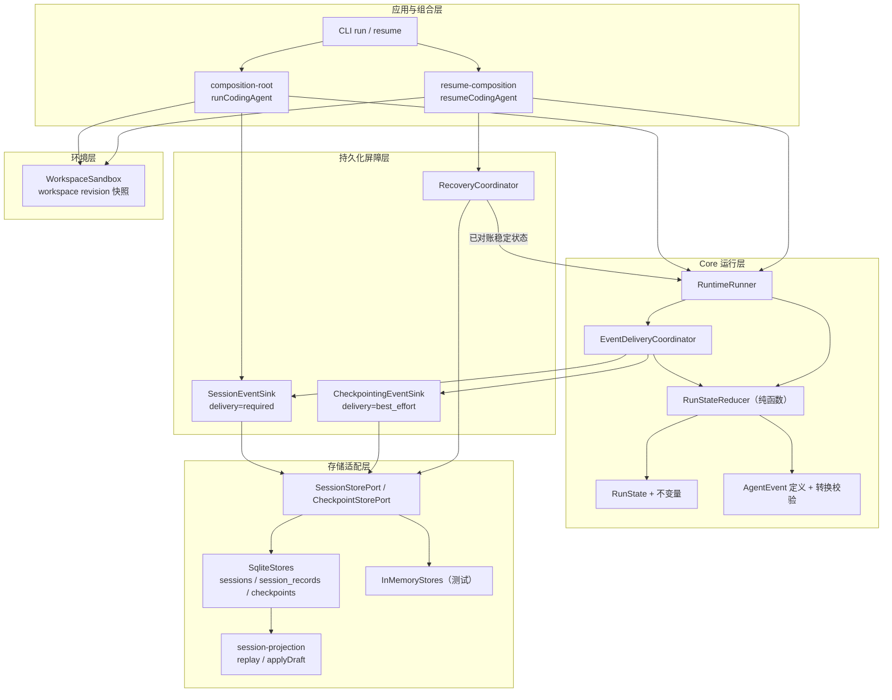
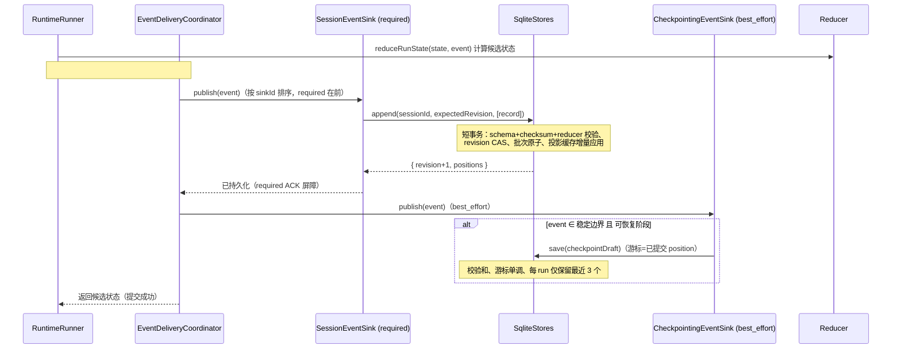
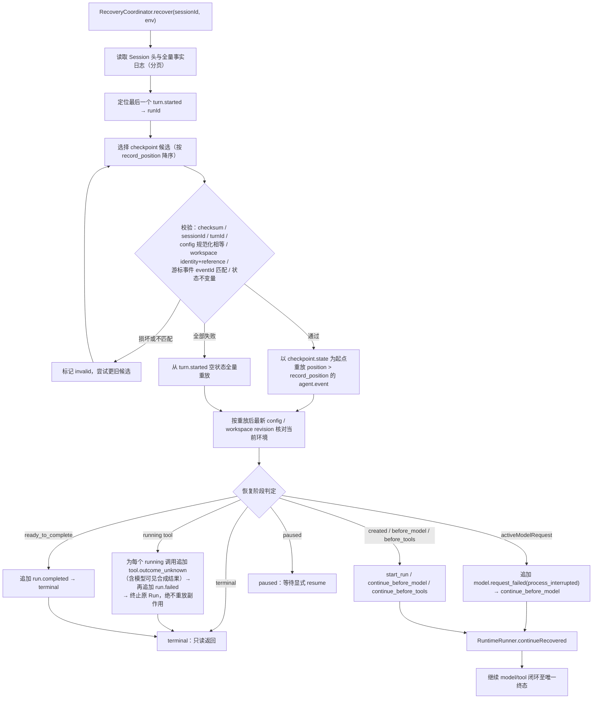

# 安全快照与增量一致性——Coding Agent 持久化与恢复机制技术报告

```yaml
status: current
updated: 2026-08-28
scope: M4 持久化事实日志、Checkpoint 快照、投递屏障、恢复对账与工作区一致性
based_on: 当前可执行源码（src/）与通过的集成/跨进程测试
related_code:
  - src/core/runtime/events/agent-events.ts
  - src/core/runtime/state/run-state.ts
  - src/core/runtime/reducer/run-state-reducer.ts
  - src/core/runtime/event_delivery/event-delivery-coordinator.ts
  - src/core/runtime/checkpointing/checkpointing-event-sink.ts
  - src/core/runtime/recovery/recovery-coordinator.ts
  - src/core/ports/session_store/
  - src/core/ports/checkpoint_store/checkpoint-store-port.ts
  - src/storage/session_event_sink/session-event-sink.ts
  - src/storage/adapters/sqlite/sqlite-stores.ts
  - src/storage/adapters/in_memory/in-memory-stores.ts
  - src/sandbox/workspace/workspace-sandbox.ts
  - src/app/composition/composition-root.ts
  - src/app/composition/resume-composition.ts
```

## 摘要

Coding Agent 的持久化设计围绕一条不可动摇的原则：**Session 事件日志是事实来源（source of
truth），Checkpoint 只是可丢弃的加速层**。运行期间产生的每一个状态变化都先被编码为不可变事实
`AgentEvent`，通过 required 持久化屏障追加写入 append-only 事件日志；内存中的 `RunState`
只是对这段日志的纯函数投影。恢复时，系统选择一个经过完整性校验的快照作为前缀，再增量重放快照之后的事件尾部，从而在任何崩溃窗口内都能把状态重建到"已提交事实"的精确边界。

本报告按"总体架构 → 模块详解 → 信息流汇总 → 一致性保证"组织。总体架构先给出组件关系、写入路径与恢复路径三张图；模块详解部分对每个模块按"模块定位与整体关系、内部实现、外部接口、与外部模块的交互、交流信息"五段展开，内部实现与外部接口严格分开陈述。

## 1 总体架构

### 1.1 组件架构图



运行链与恢复链共用同一组端口与同一个 Reducer：`RuntimeRunner`
只依赖 Core 端口，SQLite、沙箱、策略等具体实现全部由组合层注入；`RecoveryCoordinator`
是恢复链的唯一入口，其输出（已对账的稳定 `RunState`）通过 `RuntimeRunner.continueRecovered`
回到正常闭环。

### 1.2 写入路径（增量追加 + 快照生成）



### 1.3 恢复路径（快照 + 增量重放）



### 1.4 事实日志与快照的时间线关系

```text
Session 事实日志（append-only，position 连续，逐条 SHA-256）
  position:  1            2                   3                    4
            session.created  turn.started        agent.event          agent.event
            ────────────────┬───────────────────────────────────────────────────────►
                            │
  checkpoint:               │  record_position=2（早期快照）── 可回退
                            │
                            │  快照覆盖前缀 = [1..2]，恢复时重放 (2, 当前尾]
                            │
  最新快照:                 │                  record_position=3（含 lastEventId 绑定）
                            │
  游标不变量：checkpoint.lastEventId 必须等于日志中 position=record_position
  事件的 eventId，且 sequence 严格连续；快照永远不能越过已提交事实。
```

## 2 一致性模型与设计原则

| 原则         | 含义                                                                                     | 代码依据                                                                |
| ------------ | ---------------------------------------------------------------------------------------- | ----------------------------------------------------------------------- |
| 事实来源唯一 | 事件日志是真相，Checkpoint 只是加速层，可整体丢弃                                        | `checkpointing-event-sink.ts:4`、`recovery-coordinator.ts:63`、ADR-0002 |
| 状态是投影   | `RunState` 只经纯函数 `reduceRunState` 演进，模型/工具/Hook/存储都不得直接改写           | `run-state-reducer.ts`、`runtime-runner.ts:201`                         |
| 提交屏障分级 | `required` sink 失败阻断状态提交；`best_effort` 失败只记诊断                             | `event-sink-port.ts`、`event-delivery-coordinator.ts:74`                |
| 增量一致性   | 提交只追加增量事件；投影缓存按 revision 增量应用草稿；恢复 = 快照前缀 + 尾部增量重放     | `sqlite-stores.ts:199`、`recovery-coordinator.ts:100`                   |
| 乐观并发     | 追加携带 `expectedRevision`，CAS 失败即冲突；`recordId` 幂等，ACK 丢失可安全重试         | `session-store-port.ts:179`、`sqlite-stores.ts:197`                     |
| 安全快照     | 快照只在稳定边界生成、携带全量 SHA-256、游标绑定具体事实、单调不回退、损坏即回退更旧候选 | `checkpoint-store-port.ts:131`、`checkpointing-event-sink.ts:31`        |
| 不重放副作用 | 已开始但结果未知的工具终止原 Run，绝不自动重放                                           | `recovery-coordinator.ts:146`、`m4-stable-cross-process.test.ts`        |
| 环境一致性   | 恢复续跑前核对完整运行配置与 workspace identity/revision/reference                       | `recovery-coordinator.ts:272`                                           |
| 存储硬化     | 数据目录 0700、库文件 0600、WAL + FULL、trusted_schema=OFF、defensive、版本 fail closed  | `sqlite-stores.ts:100`、ADR-0002                                        |

## 3 模块详解

### 3.1 AgentEvent 事件模型（`src/core/runtime/events/agent-events.ts`）

**模块定位与整体关系**：`AgentEvent`
是贯穿写入链、持久化链与恢复链的"事实"载体。它只描述已经发生的事实，不直接修改状态、不执行外部副作用；状态机（3.2、3.3）由它驱动，存储层以它为单位落盘，恢复层以它为单位重放。整体功能关系上，它是"增量"的最小单位：每次增量追加即一条
`agent.event` 记录。

**内部实现**：14 种事件类型（`run.started`、`model.request_started`、`model.usage_recorded`、`model.request_failed`、`assistant.message_completed`、`tool.started`、`tool.completed`、`tool.failed`、`run.paused`、`run.resumed`、`run.completed`、`run.cancelled`、`run.limit_exceeded`、`run.failed`）统一由
`agentEventSchema`（zod discriminatedUnion + strict）约束。每个事件携带
`meta`：`eventId`（全局唯一）、`runId`、`turnId`、`sequence`（从 1 起严格连续）、`occurredAt`、`elapsedMs`。`validateTransition(state, event)`
在归约前检查九类违例：`schema_invalid`、`identity_mismatch`、`sequence_mismatch`、`elapsed_time_regression`、`status_disallows_event`、`phase_disallows_event`、`operation_mismatch`、`duplicate_id`、`invariant_violation`。

**外部接口**：导出 `agentEventSchema`、`AgentEvent` 类型与
`validateTransition`。被 Reducer（3.3）、事件投递协调器（3.4）、Runner（3.11）、Session 存储端口（3.5）、Checkpoint（3.8）共同引用。

**与外部模块的交互**：生产者（RuntimeRunner 的 `#createEvent`、恢复器的
`#event`）构造并校验事件；`EventDeliveryCoordinator`
提交事实；Reducer 根据事件得到下一状态；`SessionEventSink` 把事件包成 `agent.event` 记录持久化。

**交流信息**：`{ type, meta{eventId, runId, turnId, sequence, occurredAt, elapsedMs}, payload }`。sequence 连续性、runId/turnId 身份一致性、elapsedMs 单调性在写入与重放两个方向上都被强制校验，构成"增量有序"的形式化基础。

### 3.2 RunState 状态结构与不变量（`src/core/runtime/state/run-state.ts`）

**模块定位与整体关系**：`RunState`
是运行状态的唯一权威内存形态，也是快照序列化的对象。它由日志投影而来（3.3、3.5），被快照（3.8）整体序列化、被恢复器（3.10）重建、被 Runner（3.11）消费。`deriveRunPhase`
输出的六阶段（`created / before_model / awaiting_model / before_tools / ready_to_complete / paused / terminal`）是快照安全边界与恢复分支的共同判据。

**内部实现**：`runStateSchema` 严格定义字段：`status`（七态）、`transcript`（user_message /
assistant_message / tool_result 三种条目）、`activeModelRequest`、`toolBatch`（含每条工具调用的
`pending/running/completed/failed/cancelled/outcome_unknown/abandoned`
七态，对应工具生命周期矩阵）、`pause`、`outcome`、`usage`、时间戳与 `lastEventSequence` /
`lastEventId`。`validateRunStateInvariants` 实施结构性不变量：transcript 首条必须是本 Turn 的 user
message；`activeModelRequest` 与 `toolBatch` 互斥；toolBatch 必须来自最后一条 assistant
message；各状态的时间/pause/outcome 组合合法；终止态必须 status/outcome 一致；
`completed/failed/cancelled` 必须有 result；`abandoned` 不能伪造 result；`outcome_unknown`
必须对应已开始（有 effectiveCall）的调用。`createInitialRunState(run)` 生成 created 初始态。

**外部接口**：导出
`runStateSchema`、`createInitialRunState`、`deriveRunPhase`、`isTerminalRunStatus`、`validateRunStateInvariants`、`runSchema`
等。

**与外部模块的交互**：Reducer 每次归约前后调用 schema 与不变量校验；Checkpoint 序列化整个 `state`
并在恢复时重新校验；存储层投影（3.5）通过不变量判断"是否有未终止 Turn"。

**交流信息**：完整 `RunState`
对象（快照负载）、`DerivedRunPhase`（阶段信号）、`RunStateInvariantResult`（校验结果）。

### 3.3 RunStateReducer 纯函数归约（`src/core/runtime/reducer/run-state-reducer.ts`）

**模块定位与整体关系**：Reducer 是"事件 → 状态"的唯一纯函数通道，被四个方向复用：Runner 提交（3.11）、Checkpoint 镜像维护（3.9）、存储层投影与草稿校验（3.5、3.6）、恢复重放（3.10）。四个方向共用同一实现，保证任何路径重建的状态逐位一致——这是增量一致性"同构重放"的基石。

**内部实现**：`reduceRunState(state, event)` 依次执行：schema 解析状态与事件 → `validateTransition`
校验转换合法性 → `applyEvent` 按类型构造下一状态副本 → schema 解析 →
`validateRunStateInvariants`。任何一步失败抛 `ReducerError`（`transition_rejected` /
`state_invalid`）。`applyEvent`
是纯函数分支：消息入 transcript、工具批次结算（completed/failed/cancelled/outcome_unknown 都视为已结算）后按 ordinal 排序写回 transcript 并清空批次、终态事件统一经
`terminalState` 并
`abandonUnsettledTools`（pending→abandoned、running→outcome_unknown 兜底）、usage 增量累加。

**外部接口**：`reduceRunState(state, event): RunState`，以及 `ReducerError`。

**与外部模块的交互**：`EventDeliveryCoordinator.commit` 先调用它计算候选状态，required
sink 全部成功后才返回候选；`SessionEventSink` 不计算下一状态（只负责落盘）；SQLite 的 append 用
`applySessionDraft` 在事务内预校验草稿，非法事件导致整批拒绝。

**交流信息**：输入 `{state, event}`，输出 `RunState`；异常携带错误码。无 I/O、无事件产生。

### 3.4 EventDeliveryCoordinator 投递与提交屏障（`src/core/runtime/event_delivery/event-delivery-coordinator.ts`）

**模块定位与整体关系**：它是"提交"的中枢：决定事件按什么顺序、以什么等级投递给哪些 sink，以及状态何时可以提交。整体关系上它把 Runner 与所有观察者/持久化 sink 解耦，并实现 required/best_effort 两级屏障语义。

**内部实现**：构造时按 `sinkId` 字典序排序 sink（保证 `00-session-store` 的 required 追加先于
`99-checkpoint-store`
的快照）。`commit(state, event, signal, excludedSinkIds)`：先用 Reducer 计算候选状态；随后向所有 required
sink 投递——即使某个 required sink 失败，也继续把同一事件投递给其余 required
sink，避免健康 sink 出现 sequence 缺口；全部 required 成功后才投递 best_effort sink（失败只经
`onDiagnostic` 记录诊断），最后返回候选状态。单次发布有 30 秒超时（`AbortSignal.any`
组合调用方信号与超时）。

**外部接口**：`commit(...): Promise<RunState>`；`RequiredSinkError`（携带失败 sinkId 列表）；`EventSinkPort`
定义 `sinkId`、`delivery`、`publish(event, {signal})`。

**与外部模块的交互**：Runner 的 `#commit`
是唯一调用方；失败处理策略由 Runner 决定（见 3.11）。sink 列表由组合层注入（3.13）。

**交流信息**：`AgentEvent`（向下游）、`RunState`（候选，向上游）、`EventDeliveryDiagnostic`（best_effort 失败诊断）、`RequiredSinkError`（向上抛）。

### 3.5 SessionStorePort 会话事实端口与投影（`src/core/ports/session_store/session-store-port.ts`、`session-projection.ts`）

**模块定位与整体关系**：该端口定义"事实日志"的抽象契约：三类记录（`session.created`、`turn.started`、`agent.event`）、乐观并发追加、分页读取、校验和协议与错误码。`session-projection.ts`
提供把记录投影为 `RunState`
的纯函数。它是 Core 与存储介质之间的唯一边界，Core 不关心背后是 SQLite、内存还是其他介质。

**内部实现**：`sessionRecordSchema` 要求每条记录带
`position`（正整数、连续）、`checksum`（SHA-256，`canonicalJson`
规范化序列化后哈希）、`recordedAt`。`sessionHeaderSchema` 维护
`revision`、`activeRunId`、`activeTurnId`。`StoreError`
定义 11 种错误码（`not_found / already_exists / conflict / idempotency_conflict / invalid_record / version_unsupported / corrupt / busy / cancelled / closed / internal`）。`canonicalJson`
按键排序递归序列化，保证不同进程对同一对象得到相同字节。`session-projection.ts` 的
`replaySessionRecords` 从 turn 起点顺序重放；`applySessionDraft`
对未提交草稿预演（重叠 Turn、非法事件都会拒绝）；`isActiveSessionState`
判断 Session 是否仍有活动 Run。

**外部接口**：`SessionStorePort`：`create / append(sessionId, expectedRevision, records, options) / read(sessionId, afterPosition, limit) / get / list / close`；`StoreCallOptions { signal }`；`computeSessionRecordChecksum`
/ `assertSessionRecordChecksum`。

**与外部模块的交互**：`SessionEventSink`（3.7）调用
`append`/`read`；`RecoveryCoordinator`（3.10）调用
`get`/`read`；SQLite 与内存适配器（3.6）实现该端口；`RunConfigSnapshot` 与 `WorkspaceReference` 作为
`turn.started` 的载荷在此定义，被快照（3.8）与组合层（3.13）引用。

**交流信息**：追加方向为 `SessionRecordDraft[]` + `expectedRevision`，返回
`{revision, positions, records}`；读取方向为
`ReadSessionPage {revision, records, nextPosition}`；错误方向为
`StoreError{code, lastTrustedPosition}`——`lastTrustedPosition` 让上层在 corrupt 时知道可信前缀长度。

### 3.6 SqliteStores 持久化适配器（`src/storage/adapters/sqlite/sqlite-stores.ts`）

**模块定位与整体关系**：这是事实日志与快照在生产环境中的唯一落盘实现，同时实现 `SessionStorePort` 与
`CheckpointStorePort`。它把"安全快照"与"增量一致性"的存储侧要求落到物理层：原子事务、唯一约束、校验与安全 PRAGMA。`InMemoryStores`（`in-memory-stores.ts`）严格模拟同一语义，用于测试与短生命周期运行。

**内部实现**：

- **打开与硬化**：`open` 创建并收紧目录权限 0700、库文件 0600；初始化 PRAGMA
  `foreign_keys=ON`、`journal_mode=WAL`、`synchronous=FULL`、`trusted_schema=OFF`、`busy_timeout=1000`，并
  `enableDefensive(true)`；四张 STRICT 表：`metadata`（记录 `database_schema_version=1`，版本不符抛
  `version_unsupported` fail closed）、`sessions`、`session_records`（PK(session_id,
  position)、UNIQUE(record_id)、UNIQUE(run_id,
  event_sequence)）、`checkpoints`；初始化后复核 PRAGMA 实际生效，否则拒绝启动。
- **追加**：`append` 在 `BEGIN IMMEDIATE`
  短事务内完成：草稿 schema 解析、recordId 批次内唯一；全量已存在则逐条比对内容（`draftMatches`）做幂等返回；部分存在抛
  `idempotency_conflict`；`header.revision !== expectedRevision` 抛
  `conflict`；利用投影缓存——缓存 revision 与头一致则只增量 `applySessionDraft`，否则全量
  `replaySessionRecords`；逐条计算 position 与 SHA-256 后插入；`UPDATE sessions ... WHERE revision=expectedRevision`
  完成乐观并发；提交后更新缓存。任何一步失败整批回滚。
- **读取**：`#allRecords` 校验 position 连续、JSON 经 strict schema 解析、逐条校验和复核。
- **Checkpoint**：`save`
  幂等（同 checkpointId 内容 canonical 相等返回既有）、游标不超过 Session 事实位置（`record_position > COUNT(*)`
  拒绝）、同 run 游标单调（倒退抛
  `conflict`）、每个 run 仅保留最近 3 个（`DELETE ... OFFSET 3`）。`listCheckpointCandidates`
  对损坏单条返回 `{checkpointId, checkpoint: null}`，不阻断更旧候选。

**外部接口**：实现 `SessionStorePort` + `CheckpointStorePort`
全量方法；`SqliteStores.open(databasePath)`。

**与外部模块的交互**：组合层（3.13）负责打开与关闭；`SessionEventSink`/`RecoveryCoordinator`
通过端口调用；投影缓存对上层不可见，属于内部增量优化。

**交流信息**：与 3.5 端口契约一致；另外
`CheckpointCandidate`（可能为 null 的损坏项）、`deleteInvalid` 返回删除计数。

### 3.7 SessionEventSink required 增量追加屏障（`src/storage/session_event_sink/session-event-sink.ts`）

**模块定位与整体关系**：它是运行链上"已提交事实"的物理定义：只有事件成功追加进 Session 日志，Runner 才允许推进状态或启动后续副作用（如工具执行）。其
`revision`/`lastPosition` 同时充当 checkpoint 的已提交游标，把写入链与快照链绑定在同一个进度上。

**内部实现**：`delivery = "required"`，`sinkId = "00-session-store"`（字典序保证在快照 sink 之前被投递）。`connect`
读取 Session 头与日志尾部，初始化 `#revision`、`#lastPosition`。`publish` 以
`agent-event:${eventId}` 为 recordId 调用
`store.append(expectedRevision)`，成功后更新本地游标。它不计算下一状态——状态推进由
`EventDeliveryCoordinator` 用 Reducer 完成，职责严格分离。

**外部接口**：`SessionEventSink.connect(store, sessionId, {signal})`；`revision` / `lastPosition`
只读访问器；实现 `EventSinkPort`。

**与外部模块的交互**：被 `EventDeliveryCoordinator` 调用（required 阶段）；`CheckpointingEventSink`
以它为 `CommittedSessionCursor`（3.9）；组合层在启动/恢复时 `connect` 后注入 Runner。

**交流信息**：输入 `AgentEvent`；输出 `append` 的
`{revision, positions}`；向 CheckpointingEventSink 暴露已提交游标 `{sessionId, lastPosition}`。

### 3.8 CheckpointStorePort 快照结构、校验与端口（`src/core/ports/checkpoint_store/checkpoint-store-port.ts`）

**模块定位与整体关系**：定义"安全快照"的完整契约：快照内容结构（`CheckpointDraft` →
`Checkpoint`）、恢复模式（`resumeMode`）、完整性校验（checksum）与存储端口。快照把一段日志前缀折叠为一个可直接装载的状态，是恢复加速的唯一来源，但语义上永远从属于事实日志。

**内部实现**：

- `checkpointSchema`（strict）字段：`schemaVersion=1`、`checkpointId`、`sessionId`、`runId`、`turnId`、`recordPosition`（正整数，对应日志中已提交的 position）、`lastEventSequence`、`lastEventId`、`state`（完整 RunState）、`resumeMode`（`before_model / before_tools / ready_to_complete / paused / terminal`）、`config`（RunConfigSnapshot）、`workspace`（WorkspaceReference）、`createdAt`、`checksum`。
- `createCheckpoint(draft)`：解析草稿 → 用 `deriveCheckpointResumeMode`
  推导恢复模式 → 对内容做 canonical SHA-256 → 全量 schema 复核。`deriveCheckpointResumeMode`
  是安全边界判据：`created` 与 `awaiting_model` 阶段、存在 running 工具的 `before_tools`
  阶段一律拒绝生成可恢复快照。
- `assertCheckpointChecksum`：剥离 checksum 后重算比对，不匹配抛 `corrupt`。

**外部接口**：`CheckpointStorePort`：`save / loadLatest / listCheckpoints / listCheckpointCandidates? / deleteInvalid / close`；工厂
`checkpointDraft(...)`；`CheckpointCandidate {checkpointId, checkpoint | null}`。

**与外部模块的交互**：`CheckpointingEventSink`（3.9）生产草稿；SQLite/内存适配器（3.6）实现端口；`RecoveryCoordinator`（3.10）消费候选并删除无效项；`RunConfigSnapshot`/`WorkspaceReference`
类型来自 Session 端口（3.5）。

**交流信息**：草稿（无 checksum/resumeMode，由适配器补齐）→ 成品 Checkpoint（含 checksum）；候选列表携带"损坏=null"信号；`deleteInvalid(checkpointIds)`
单向清理。

### 3.9 CheckpointingEventSink 稳定边界快照生成（`src/core/runtime/checkpointing/checkpointing-event-sink.ts`）

**模块定位与整体关系**：它是快照的生产者，作为 best_effort
sink 挂在投递链上。整体关系上，它不参与状态提交决策，只负责在"安全边界"把已提交状态折叠成快照，因此它的失败不影响运行正确性（设计上 checkpoint 是 best_effort 加速层）。

**内部实现**：构造时克隆初始状态与 workspace 引用，维护镜像 `#state`。`publish`
流程：先用 Reducer 推进镜像状态；若事件为 `tool.completed`/`tool.failed` 且结果携带
`effects.workspaceRevision`，则同步镜像 workspace 版本（否则重启会把 Agent 自己已确认的修改误判为外部并发变更）；随后若事件类型属于
`CHECKPOINT_BOUNDARIES`（`run.started / assistant.message_completed / tool.completed / tool.failed / model.request_failed / run.paused / run.completed / run.cancelled / run.limit_exceeded / run.failed`——全部是"无活动操作"的稳定边界，`tool.started`、`model.request_started`、`run.resumed`
等飞行中事件被排除），再调用 `deriveCheckpointResumeMode` 二次确认（非法阶段静默跳过），最后以
`cursor.lastPosition`（即 required sink 刚提交的 position）为游标 `save(checkpointDraft(...))`。

**外部接口**：实现
`EventSinkPort`（`delivery="best_effort"`，`sinkId="99-checkpoint-store"`）；构造参数：初始状态、`CheckpointStorePort`、`CommittedSessionCursor`（由
`SessionEventSink` 提供）、`RunConfigSnapshot`、`WorkspaceReference`；`state` 只读访问器。

**与外部模块的交互**：被 `EventDeliveryCoordinator` 在 required 之后投递；游标来自
`SessionEventSink`（保证快照进度不越过已提交事实）；产物交给 3.6 适配器落盘；当前生产热路径未接入该 sink（ADR-0004：best_effort 仍同步 await，启用前需有界 write-behind 与语义 flush
barrier），其语义由集成/跨进程测试验证。

**交流信息**：输入 `AgentEvent`；输出
`CheckpointDraft{checkpointId, sessionId, recordPosition, state, config, workspace, createdAt}`；`CheckpointDiagnostic{runId, recordPosition, message}`。

### 3.10 RecoveryCoordinator 恢复协调器（`src/core/runtime/recovery/recovery-coordinator.ts`）

**模块定位与整体关系**：恢复链的唯一入口，把"事实日志 + 可选快照"重建为稳定状态，并消解进程中断窗口。它输出的
`RecoveryAction`
决定后续走向：`start_run / continue_before_model / continue_before_tools / paused / terminal / side_effect_result_unknown`。整体关系上它是快照（加速）与事实（真相）的仲裁者：快照永远不能覆盖较新的已提交事件。

**内部实现**：

1. **读取事实**：`get` 头部 + 按 256 条分页 `read` 全量记录；定位最后一个 `turn.started`
   得到 runId，`runRecords = records.slice(turnIndex)`。
2. **选择快照**：`#selectCheckpoint` 按 `record_position`
   降序遍历候选，逐项验签与身份核对：checksum；`sessionId`/`turnId`
   与 turn 记录一致；`recordPosition >= turnRecord.position`；`config`
   canonical 相等；`workspace.identity/reference`
   相等（revision 允许不同，因为 Agent 自己的写入会推进 revision）；游标绑定——`lastEventSequence > 0`
   时日志中 `position == recordPosition` 的记录必须是 `agent.event`
   且 eventId 匹配；`validateRunStateInvariants`
   复核快照状态。失败项累积为 invalid，找到有效项或全部失败后 `deleteInvalid` 清理。
3. **增量重放**：以 `checkpoint.recordPosition ?? turnRecord.position` 为游标，重放
   `position > cursor` 且 `runId` 匹配的 `agent.event`，逐条 `reduceRunState`。
4. **环境核对**：仅当将要继续（非终态/非 paused/无 running 工具/非 ready_to_complete）时，把"记录中的 config"与"记录或快照 workspace 经 transcript 中工具结果推进后的 revision"同当前环境做 canonical 比较，不一致抛
   `conflict`。
5. **中断窗口消解**：`activeModelRequest` 存在 → 追加
   `model.request_failed(process_interrupted, retryable=true)`（允许新 requestId 重试）；running 工具存在 → 先为每个 running 调用追加
   `tool.outcome_unknown`（payload 含
   `callId/toolName/effectClass/reason/retryPolicy/recordedCallEventId` 与模型可见合成结果），再追加
   `run.failed(side_effect_result_unknown, retryable=false)`（副作用结果不可知，原 Run 不自动重放）；`ready_to_complete`
   → 追加 `run.completed`；否则按阶段给出继续动作。对账事件经 `#appendReconciliation` 用
   `expectedRevision`
   追加，保证只追加一次（重复恢复幂等）；同一次 recover 内多个对账事件的 eventId 带序号保证唯一。

**外部接口**：`RecoveryCoordinator.recover(sessionId, options, environment?)` 返回
`RecoveryResult{sessionId, revision, lastPosition, state, action, checkpointId, reconciledEvent}`；依赖注入
`{sessions, checkpoints?, idFactory?, now?}`；`RecoveryEnvironment{config, workspace}`。

**与外部模块的交互**：依赖 `SessionStorePort`（必选）与
`CheckpointStorePort`（可选）；`resume-composition`（3.13）提供当前环境并消费
`RecoveryResult`；稳定状态交给 `RuntimeRunner.continueRecovered`/`resume`（3.11）。

**交流信息**：向下游读取事实/快照；向上游返回重建状态、恢复动作、对账事件（`reconciledEvent`）与是否使用了快照（`checkpointId`）；错误方向为
`StoreError{conflict/corrupt/not_found}`。

### 3.11 RuntimeRunner 恢复执行入口（`src/core/runtime/loop/runtime-runner.ts`）

**模块定位与整体关系**：运行链的编排者，也是恢复链的终点。三个入口覆盖三种继续方式：`run`（全新 Run）、`resume`（仅接受 paused 状态，先提交
`run.resumed`）、`continueRecovered`（仅接受已对账的稳定状态，不允许仍有 `activeModelRequest`
或 running 工具，`created` 阶段走 `start` 模式，其余走 `continue` 模式，且不重复生成
`run.started`）。其 `#commit` 实现"required 失败也保证终止事实被记录"：required
sink 失败时，若候选已终态则直接返回，否则提交 `run.failed(required_sink)`
并排除失败 sink，防止日志悬空。

**内部实现**：主循环按 `deriveRunPhase` 分派：`before_model`
→ 上下文构建/裁剪、Hook、`model.request_started`
提交、流式消费、`usage`/`assistant.message_completed`/失败提交；`before_tools` →
Hook 前置、`tool.started` 提交（required ACK 之后才调用工具执行器）、按批策略执行、结果提交
`tool.completed`/`tool.failed`；`ready_to_complete` → `run.completed`。所有状态变化一律先
`#createEvent` 构造事实，再经 `#delivery.commit` 提交，模型/工具/Hook 均无直接改状态的能力。

**外部接口**：`RuntimeRunner.run/resume/continueRecovered(input, options)`；依赖注入
`modelClient / toolExecutor / eventSinks / limits / toolBatchPolicy / clock / idGenerator` 等。

**与外部模块的交互**：组合层注入全部依赖（3.13）；事件经 `EventDeliveryCoordinator` 流向
`SessionEventSink` 与观察者；工具执行经 `ToolExecutorPort` 进入工具安全链，其结果携带
`effects.workspaceRevision` 回灌给快照镜像（3.9）。

**交流信息**：`RunnerContextInput{run, baseSystemPrompt, tools, skills, memories, tokenBudget, ...}`；事件提交结果
`RunState`；`RequiredSinkError` 触发失败降级路径。

### 3.12 WorkspaceSandbox 工作区快照与一致性（`src/sandbox/workspace/workspace-sandbox.ts`）

**模块定位与整体关系**：把"运行状态一致性"扩展到文件系统：工作区不是 Agent 独占的，恢复续跑前必须证明当前工作区与事实日志记录的基线一致。它产出
`WorkspaceSnapshot{revision, rootRevision, files, strategy}`，`revision` 是 `git_status_v1` 或
`sparse_metadata_v1` 策略下的 canonical SHA-256，被写入 `turn.started` 的
`WorkspaceReference`、工具结果的 `effects.workspaceRevision`、快照的 `workspace`
字段，成为恢复环境核对（3.10）的比对对象。

**内部实现**：`captureBaseline` 记录已接受基线；`acceptAgentChanges`
把 Agent 已确认的变更并入基线（`#acceptWorkspaceChanges`
只更新变更路径，避免全量重扫）；`checkConsistency(scope)`
支持三种模式：`session`（只复核本 Session 观察过的路径覆盖树）、`workspace`（对账整个基线并推进）、`strict`（effectful 操作进入审批前自动对账，发现非 Agent 漂移即拒绝）。文件级并发保护使用内容 SHA-256 与
`identity(dev:ino)`，`/proc/self/fd` 锚定的目录句柄逐段 `O_NOFOLLOW` 打开，杜绝 symlink
TOCTOU。revision 只记录不可伪造的 inode/ctime/mtime/size 元数据，避免每次工具调用全量读文件内容。

**外部接口**：`WorkspaceSandbox.create(root, options)`；`identity / revision / captureBaseline / acceptAgentChanges / checkConsistency / read / replace / createFile / diff / acquireRootHandleForProcess`；`WorkspaceConsistencyReport{mode, scope, status, changedPaths, revision, ...}`。

**与外部模块的交互**：组合层启动/恢复时 `captureBaseline` 并把 `{identity, revision, reference}`
写入 `turn.started`；工具链（ToolDispatcher）在审批后复核 revision，结果携带
`effects.workspaceRevision`；恢复器（3.10）以当前基线做环境核对；CheckpointingEventSink（3.9）用工具结果推进快照中的 workspace 版本，使 Agent 自己的已确认修改不会被误判为外部漂移。

**交流信息**：`WorkspaceReference{identity, revision, reference}`；`ToolEffects.workspaceRevision`；`WorkspaceConsistencyReport`。

### 3.13 Composition 装配（`src/app/composition/composition-root.ts`、`resume-composition.ts`）

**模块定位与整体关系**：把以上全部模块装配成可运行的 App 拓扑，是写入链与恢复链在进程层面的分界点：`runCodingAgent`
负责"开新 Session + 写 turn 头 + 跑闭环"，`resumeCodingAgent` 负责"读事实 + 恢复对账 + 继续闭环"。

**内部实现**：

- **runCodingAgent**：解析配置 → 构造 `Run`（runId/turnId/userMessage）→ 计算
  `RunConfigSnapshot`（modelConfigId、limits、enabledToolSchemaDigest、policyVersion、sandboxProfileVersion、baseConfigDigest）→ 打开 SQLite
  → Session 不存在则 `create`（`session.created`），存在且无活动 Run 则复用 →
  `append(turn.started)`（携带 run/config/workspace 基线）→ `SessionEventSink.connect`
  → 装配工具/策略/沙箱/审批 →
  `RuntimeRunner.run`（`eventSinks=[sessionSink, ...observers]`）。当前生产热路径不装配
  `CheckpointingEventSink`（见 ADR-0004）。
- **resumeCodingAgent**：重算同一形状的 config 快照与当前 workspace 基线 →
  `RecoveryCoordinator({sessions, checkpoints})`（传入 store 使其消费既有快照）→ 按 `action`
  分支：`terminal`/`side_effect_result_unknown` 直接返回；`paused` → `runner.resume`；其余 →
  `runner.continueRecovered`（`run` 取自 turn 记录，保证 runId 一致）。

**外部接口**：`runCodingAgent(RunAppInput)` / `resumeCodingAgent(ResumeAppInput)`，返回
`{sessionId, state, action?, enabledTools, provider}`；`AppRuntimeConfiguration` 通过
`onConfiguration` 回调向外暴露运行配置。

**与外部模块的交互**：向下注入全部端口实现；`sessionId`
是跨进程的协调键——同一数据库文件 + 同一 workspace，先 run 后 resume 即构成完整的跨进程生命周期。

**交流信息**：`AppConfig`（入）、`RunConfigSnapshot`/`WorkspaceReference`（写入 turn 头）、`RecoveryEnvironment`（恢复入）、`RecoveryResult`（恢复出）。

## 4 模块间信息流汇总

| 发送方                   | 接收方                          | 接口/通道                                     | 信息内容                                                                        | 等级/方向                      |
| ------------------------ | ------------------------------- | --------------------------------------------- | ------------------------------------------------------------------------------- | ------------------------------ |
| RuntimeRunner            | EventDeliveryCoordinator        | `commit(state, event)`                        | 候选状态 + AgentEvent                                                           | 同步调用                       |
| EventDeliveryCoordinator | SessionEventSink                | `publish(event, {signal})`                    | AgentEvent                                                                      | required，先于一切 best_effort |
| EventDeliveryCoordinator | CheckpointingEventSink / 观察者 | `publish(...)`                                | AgentEvent                                                                      | best_effort，失败仅诊断        |
| SessionEventSink         | SqliteStores                    | `append(sessionId, expectedRevision, drafts)` | agent.event 记录（recordId 幂等键）                                             | required，事务内 CAS           |
| SqliteStores             | SessionEventSink                | append 返回                                   | `{revision, positions}`（已提交游标）                                           | 返回                           |
| CheckpointingEventSink   | SqliteStores                    | `save(draft)`                                 | CheckpointDraft（游标=lastPosition）                                            | best_effort，单调游标          |
| SessionEventSink         | CheckpointingEventSink          | `CommittedSessionCursor`                      | `{sessionId, lastPosition}`                                                     | 构造注入                       |
| SqliteStores             | RecoveryCoordinator             | `read/get/listCheckpointCandidates`           | 事实记录页、Session 头、候选快照                                                | 恢复读取                       |
| RecoveryCoordinator      | SqliteStores                    | `append(...)`（对账事件）                     | `process_interrupted` / `tool.outcome_unknown` + `run.failed` / `run.completed` | 幂等追加                       |
| RecoveryCoordinator      | RuntimeRunner                   | `continueRecovered(state, context)`           | 已对账稳定 RunState + RunnerContextInput                                        | 恢复续跑                       |
| WorkspaceSandbox         | 组合层                          | `captureBaseline()`                           | WorkspaceReference（identity/revision/reference）                               | 启动/恢复时                    |
| 工具链                   | CheckpointingEventSink          | ToolResult.effects                            | `workspaceRevision`（Agent 确认的写入版本）                                     | 事件载荷                       |
| 恢复器 ↔ 环境            | `RecoveryEnvironment`           | 当前 config + workspace 基线                  | canonical 比对，不一致抛 conflict                                               | 双向核对                       |

## 5 一致性保证与故障模型

### 5.1 崩溃窗口消解

| 崩溃发生点                               | 日志中的事实         | 恢复行为                                                                        | 依据                                                    |
| ---------------------------------------- | -------------------- | ------------------------------------------------------------------------------- | ------------------------------------------------------- |
| required sink 追加前                     | 无该事件             | 事件未提交，状态不推进，无痕                                                    | `event-delivery-coordinator.ts:92`                      |
| 追加成功、ACK 丢失                       | 事件已落盘           | 重试按 recordId 幂等返回既有 position                                           | `sqlite-stores.ts:183`、`m4-storage.test.ts`            |
| 追加后、状态提交前                       | 事件已落盘           | 重放日志重建状态，行为一致                                                      | 3.5、3.10                                               |
| `tool.started` 已提交、结果未知          | 工具可能已产生副作用 | 先追加 `tool.outcome_unknown`（含合成结果）再 `run.failed`，原 Run 终止，不重放 | `recovery-coordinator.ts:146`、`m4-storage.test.ts:278` |
| `model.request_started` 已提交、结果未知 | 模型请求无副作用     | 追加一次 `process_interrupted`，新 requestId 重试                               | `recovery-coordinator.ts:127`、`m4-storage.test.ts:481` |
| 稳定边界后（含快照已存）                 | 快照 + 完整事实前缀  | 快照装载 + 尾部重放，恢复后继续闭环                                             | `m4-stable-cross-process.test.ts`                       |

### 5.2 幂等与原子性

- **批次原子**：append 事务内先用 `applySessionDraft`
  预演全部草稿，任一非法（schema、sequence、阶段违例）整批拒绝，日志不留半截事实（`m4-storage.test.ts`
  验证 batch 无残留）。
- **重试幂等**：`record_id` 全局唯一 + 内容比对，ACK 丢失后重试返回原 positions；`checkpointId`
  同样幂等。
- **并发互斥**：`expectedRevision` CAS + SQLite `WHERE revision=?`
  更新；跨进程并发追加直接冲突失败。

### 5.3 快照安全

- **稳定边界**：仅 12 类无活动操作事件生成快照（含 `tool.cancelled` /
  `tool.outcome_unknown`）；`deriveCheckpointResumeMode`
  拒绝 created/awaiting_model/running-tool 状态。
- **完整性**：每条记录与每个快照均带 canonical
  SHA-256；恢复时验签，坏快照单条降级为 null 候选，回退更旧快照并 `deleteInvalid`
  清理（`m4-storage.test.ts:409` 验证 SQLite 损坏回退）。
- **游标绑定**：快照 `recordPosition` 必须对应日志中 eventId 匹配的
  `agent.event`，且不能越过已提交事实（`save` 拒绝游标超界与倒退）。
- **存储硬化**：目录 0700/文件 0600、WAL + `synchronous=FULL`、`trusted_schema=OFF`、defensive
  mode、schema 版本 fail
  closed；数据目录位于 App 配置路径而非 Agent 可编辑的 workspace（ADR-0002）。

### 5.4 增量一致性的三层体现

1. **写路径**：每次提交只追加一条增量事件；SQLite 投影缓存按 revision 命中时只对草稿增量归约（`sqlite-stores.ts:199`），长会话避免 O(n²) 全量重放（ADR-0004）。
2. **恢复路径**：快照折叠前缀 + 从 `recordPosition+1`
   增量重放尾部，同一 Reducer 保证与写路径逐位一致。
3. **环境路径**：workspace revision 作为事实参与一致性——Agent 自己确认的写入通过
   `effects.workspaceRevision`
   推进快照与恢复基线，避免重启后误判为外部漂移（`m4-runtime-persistence.test.ts:185`、`m4-stable-cross-process.test.ts:336`）。

## 6 附录：关键代码索引

| 主题                 | 位置                                                                                                                                                                          |
| -------------------- | ----------------------------------------------------------------------------------------------------------------------------------------------------------------------------- |
| 事件定义与转换校验   | `src/core/runtime/events/agent-events.ts`                                                                                                                                     |
| 状态结构与不变量     | `src/core/runtime/state/run-state.ts`                                                                                                                                         |
| 纯函数归约           | `src/core/runtime/reducer/run-state-reducer.ts`                                                                                                                               |
| 投递与提交屏障       | `src/core/runtime/event_delivery/event-delivery-coordinator.ts`                                                                                                               |
| 事实端口与校验和     | `src/core/ports/session_store/session-store-port.ts`                                                                                                                          |
| 记录投影             | `src/core/ports/session_store/session-projection.ts`                                                                                                                          |
| 快照结构与端口       | `src/core/ports/checkpoint_store/checkpoint-store-port.ts`                                                                                                                    |
| 增量追加屏障         | `src/storage/session_event_sink/session-event-sink.ts`                                                                                                                        |
| SQLite 适配器        | `src/storage/adapters/sqlite/sqlite-stores.ts`                                                                                                                                |
| 内存适配器           | `src/storage/adapters/in_memory/in-memory-stores.ts`                                                                                                                          |
| 稳定边界快照生成     | `src/core/runtime/checkpointing/checkpointing-event-sink.ts`                                                                                                                  |
| 恢复协调器           | `src/core/runtime/recovery/recovery-coordinator.ts`                                                                                                                           |
| 运行与恢复入口       | `src/core/runtime/loop/runtime-runner.ts`                                                                                                                                     |
| 工作区快照与一致性   | `src/sandbox/workspace/workspace-sandbox.ts`                                                                                                                                  |
| 装配（run / resume） | `src/app/composition/composition-root.ts`、`src/app/composition/resume-composition.ts`                                                                                        |
| 契约验证             | `tests/integration/m4-storage.test.ts`、`tests/integration/m4-runtime-persistence.test.ts`、`tests/e2e/m4-stable-cross-process.test.ts`、`tests/e2e/m4-cross-process.test.ts` |
| 相关决策记录         | `docs/adr/0002-node-sqlite-session-storage.md`、`docs/adr/0004-streaming-and-workspace-consistency.md`                                                                        |
