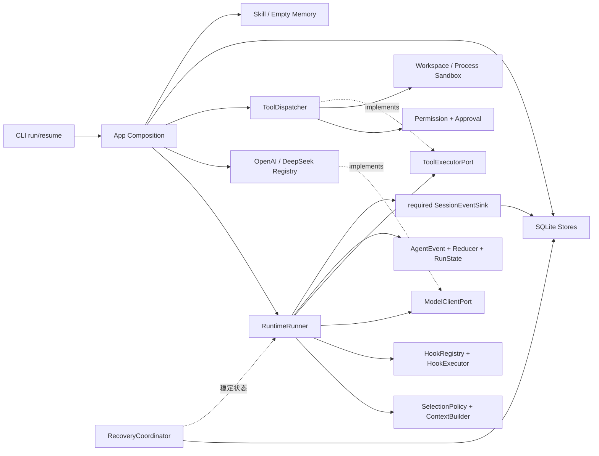
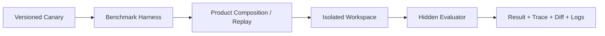
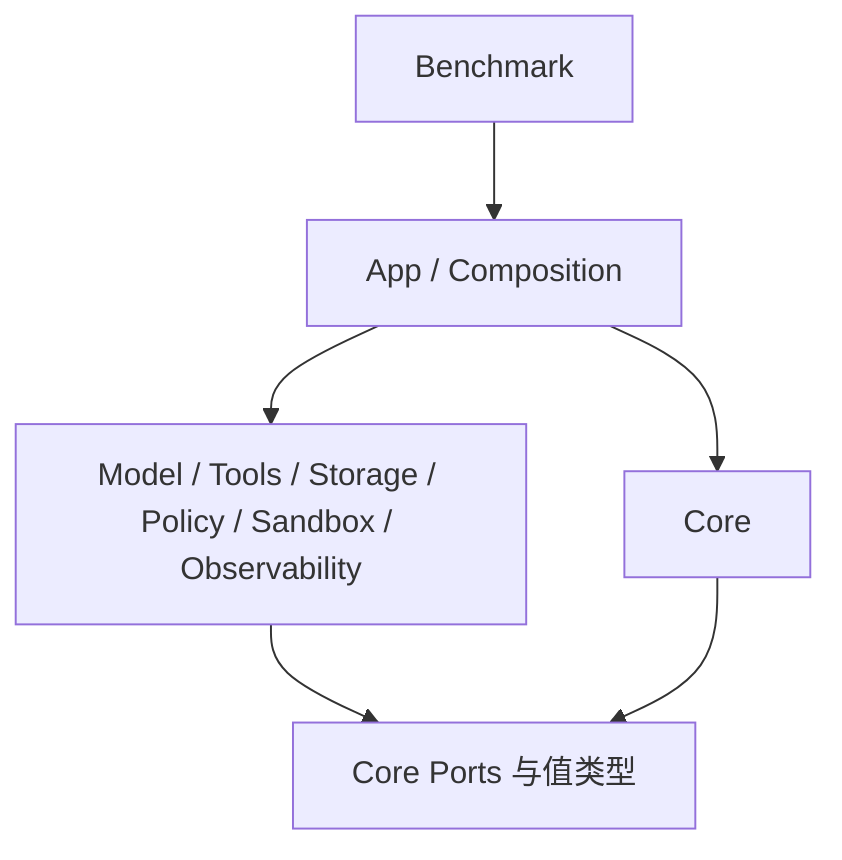

# M1–M6 实际模块地图

```yaml
status: current
updated: 2026-08-27
scope: 当前实现的模块职责、运行时组合、评测边界和静态依赖方向
related_code: /home/han001/projects/agents/coding-agent/{src,benchmarks}/
```

## 运行时组合关系



`RuntimeRunner` 只看 Core
Port；Provider、Dispatcher、SQLite、Sandbox、CLI 和扩展实现均由外层 Composition 注入。

## Benchmark 边界



隐藏 evaluator、oracle 和其他 trial 不进入 Agent
workspace。Benchmark 可以依赖 App，但不能反向成为 Core 依赖。

## 静态依赖方向



`npm run check:architecture` 检查 Core 反向依赖、Adapter 越权依赖、无法解析的内部导入和循环依赖。

## 阶段状态

| 能力                           | 主要目录                                                     | 状态                                                     |
| ------------------------------ | ------------------------------------------------------------ | -------------------------------------------------------- |
| M1 Core 契约与测试替身         | `src/core`、`tests/fakes`                                    | VERIFIED                                                 |
| M2 Runtime 最小闭环            | `src/core/runtime`、Context、Hook                            | IMPLEMENTED + TESTED                                     |
| M3 Coding Tools 与安全边界     | `src/tools`、`src/policy`、`src/sandbox`                     | VERIFIED；真实 bwrap 6/6                                 |
| M4 Session、Checkpoint 与恢复  | `src/storage`、checkpoint/recovery                           | CROSS-PROCESS TESTED                                     |
| M5 App、Provider、Skill/Memory | `src/app`、`src/model/providers`、`src/skills`、`src/memory` | IMPLEMENTED；真实 Provider smoke 部分完成                |
| M6 Benchmark 与交付            | `benchmarks`、CI、交付文档                                   | IMPLEMENTED；DeepSeek baseline 已验证，OpenAI 门禁待凭据 |
