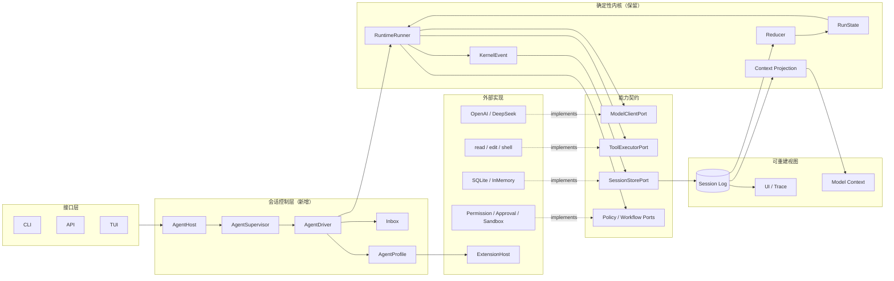

# 下一阶段模块图

```yaml
status: proposed
baseline_commit: a91cde6
updated: 2026-08-27
```

## 模块图



## 每个模块只回答一个问题

| 模块                 | 只负责                         | 不负责                    |
| -------------------- | ------------------------------ | ------------------------- |
| `AgentHost`          | 创建、查找、关闭 Agent         | 运行模型循环              |
| `AgentSupervisor`    | 父子关系、预算、取消传播       | 共享子 Agent 的可变状态   |
| `AgentDriver`        | 串行领取输入并启动/恢复 Run    | 直接改 RunState           |
| `Inbox`              | 接收、去重、排序、确认输入     | 拼模型 Prompt             |
| `AgentProfile`       | 固定能力组合和版本摘要         | 运行中热修改内核          |
| `RuntimeRunner`      | 执行单个 Run/Step 的确定性协议 | 管理整个产品生命周期      |
| `KernelEvent`        | 描述会改变事实的闭集事件       | 承载任意 UI 日志          |
| `Reducer`            | 纯函数计算下一状态             | I/O、网络、工具执行       |
| `Context Projection` | 从事实生成模型视图             | 删除原始事实              |
| `ExtensionHost`      | 扩展安装、启动、释放和贡献收集 | 绕过 Port、权限和提交屏障 |

## 事件分两类

- `KernelEvent`：会改变业务状态，schema 严格、必须可靠提交、Reducer 必须认识；
- `SignalEvent`：提交后的流式/UI/指标通知，可以丢失或重建，不能反向改变事实。

需要持久化的扩展事实使用带 namespace、版本、可忽略策略和 model-visibility 声明的信封，不把无限事件类型塞进 Core 的闭集状态机。

## 建议代码位置

```text
src/
  agent/
    host/
    supervisor/
    driver/
    inbox/
    profile/
  core/
    runtime/          # 现有严格内核
    context/          # 增加 projection/content blocks
    ports/
  extensions/
    host/
    manifest/
  storage/
    ...               # Session v2 与迁移
```

这是目标边界，不要求一次搬目录。先新增接口和兼容层，再小步迁移；避免为了“看起来整齐”制造无功能收益的大规模重命名。
